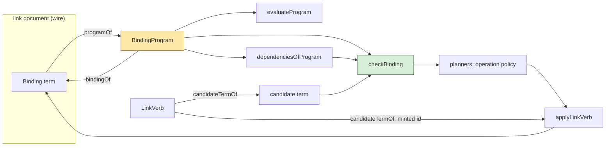
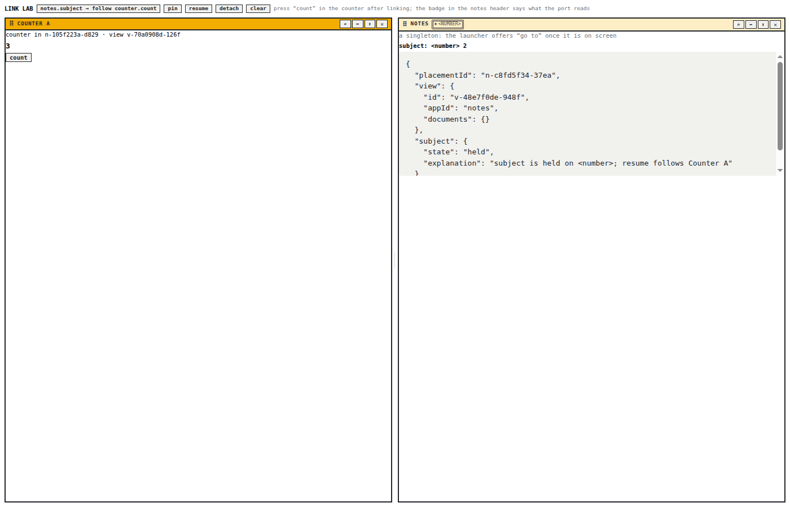
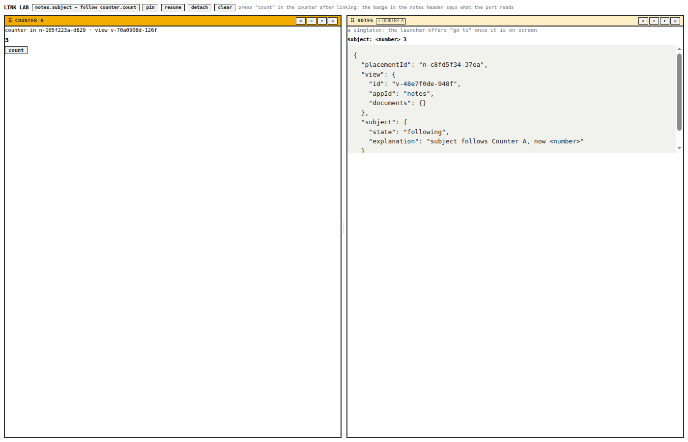
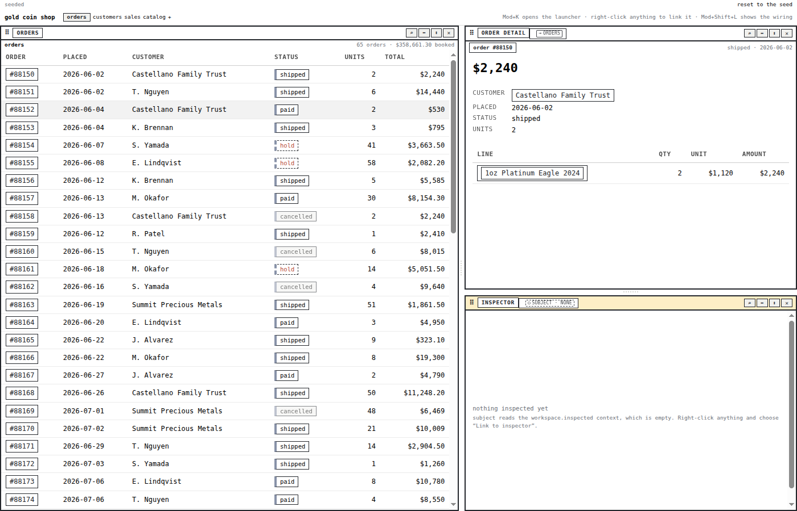
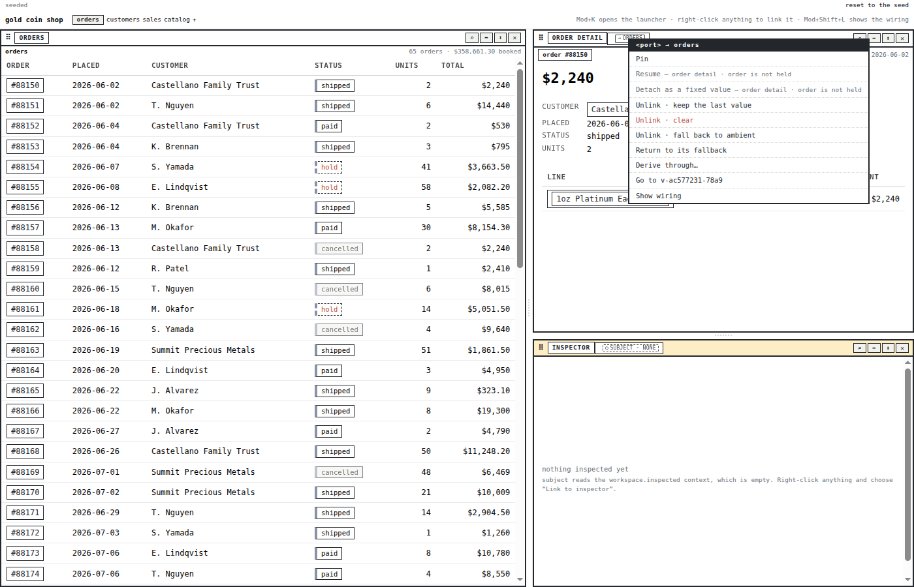
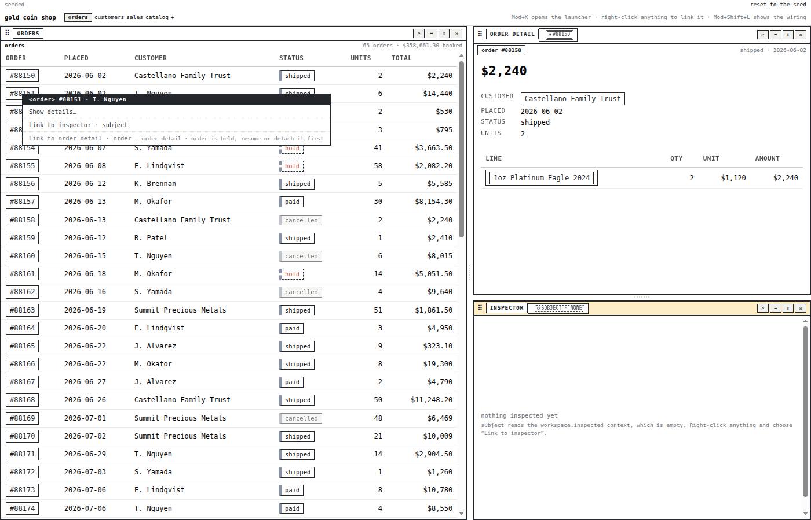

# PBUI Binding Programs: The Link IR as the One Authority for Evaluation, Dependencies, and Planning

This report describes the implementation of PBUI-KERNEL-2 on 2026-09-02, the first of three follow-up tickets split out of the PBUI-KERNEL-1 clean cutover ([[PROJECT REPORT - PBUI Kernel - One Compiled Presentation, Named Fragments, and the Clean Cutover of Every Consumer]]). KERNEL-1 landed a prototype intermediate representation for the workbench's link bindings, together with a compiler, a lowering, dependency extraction and a static checker, but left them beside the older code paths rather than in place of them. KERNEL-2 makes the representation the one thing the link kernel reasons over: it pins the laws the representation must satisfy as tests, removes the second dependency walk, has the planners check the exact term the apply step will persist, and then deletes the planners' own copies of the structural checks once parity is proven. The purpose of this report is to let a reader understand why a persisted grammar and an internal program are different objects, what each interpreter reads, and what the tests hold the code to.

The reader is assumed to know the link kernel as it was built in PBUI-LINK-1 ([[PROJECT REPORT - PBUI Linked Tiles - Landing the Binding Algebra in the pbui Workbench]]): ports with contracts, the seven binding terms, planners that answer "may this port follow that one" with a verb or a refusal, and one transition function that applies verbs to the link document.

> [!summary]
> - The persisted binding grammar (`ambient`, `constant`, `follow`, `alias`, `derived`, `hold`, `unresolved`) is now the wire format only. Internally every term compiles to a binding program that separates sources, relation application, held state and broken state; evaluation, dependency extraction and the static checker all read the program.
> - Five laws from the design guide are tests: the wire round trip is byte-for-byte stable, normalization is a fixpoint, normalization preserves dependencies, `resume(pin(b)) == b` at the term level, and a held value is independent of its snapshot. All held on the prototype as landed; the one shape the program does not preserve (a hold nested under a derivation) is stated as an exception rather than hidden.
> - Planners no longer compute type reachability, cycles or context existence themselves. They construct the verb they will return, obtain its term from `candidateTermOf`, and take those verdicts from `checkBinding`. What a planner keeps is operation policy: existence, direction, self, document slots, held, shared, already linked, and which relations are legal.
> - The change is invisible to users by construction. Every refusal sentence the planners used to write is now written by the checker, including the tile names in a cycle refusal and the context name in an ambient type refusal. The pbui root suite (443 tests) and every workspace package pass unchanged.

## 1. Project status

The ticket is complete on the `task/add-plot-editor` branch of pbui, in five phases and ten commits between 3f55488 and b8e3687. The exit criteria set by the KERNEL-1 guide (§18, Phase 8) are met: wire round-trip fixtures are unchanged, `normalize(normalize(b)) == normalize(b)`, the hold/resume law passes, and cycle and type diagnostics are unchanged or improved.

| Phase | What landed | Commit |
|---|---|---|
| P1 | `laws.test.ts`: the §19.6 laws and twelve checker failure classes as tests | 3f55488 |
| P2 | One dependency walk (`dependsOn` in `check.ts` over the IR); `titleOfPort` on the snapshot; cycle diagnostics name tiles; `sourcePortOf`/`linkIdOf` parity law | 1167b08 |
| P3 | `links/candidate.ts`: `candidateTermOf(verb, linkId)` shared by the planners and the apply step; law that the persisted term equals the candidate | 2cf52b6 |
| P4 | Planners' duplicate type, cycle and context checks deleted; IR constructors removed from the root export; parity tests | d080c68 |
| P5 | Cross-package build, typecheck and tests; six screenshots; README section on the link kernel | b8e3687 |

Nothing in this ticket touched a consumer. rag-ttc, hyperblog, the shop, the chat demo and datalab-ui import planners, terms and `applyLinkVerb` exactly as before; their behavior is unchanged because the verdicts are.

## 2. The problem

PBUI-LINK-1 defined a binding as a term in a small algebra and persisted the term in the link document. The design was right about the grammar and quiet about what reads it. By the time KERNEL-1 imported the composable-kernel research, four readers had grown up around the same seven productions, each with its own recursion:

- `evaluatePort` interpreted a term against a snapshot.
- `sourcePortOf` and `linkIdOf` in `terms.ts` walked a term to find its one source port and its wire id, for badges and the workbench's link references.
- `dependsOn` in `plan.ts` walked the explicit bindings of a snapshot through `sourcePortsOfBinding` to refuse cycles.
- Each planner (`planFollow`, `planBind`, `planAmbient`, `planDerive`) checked what it could of the candidate's structure by hand: `reaches` on the value types, `dependsOn` for cycles, a context lookup for ambient terms.

The research report's argument, adopted by the KERNEL-1 guide in §12.3, was that these are not four problems. A binding is a program: a source, zero or more relation applications, and a control state that is live, held or broken. Once that program exists as data, evaluation, dependency extraction and static checking are sibling interpreters over one AST, and the planners can ask the checker rather than repeat it. KERNEL-1 landed the program (`links/expression.ts`) and a checker (`links/check.ts`) with the prototype patch, and even switched `evaluatePort` onto the program, but the second dependency walk and the planners' hand checks stayed. The planners called the checker as a last step, after their own checks had already answered.

Two concrete defects follow from that arrangement. First, two walks drift: the planner's walk and the checker's walk agreed in September 2026 because both were written the same week, and nothing held them together. Second, a planner that checks a look-alike term is not checking the term that will be persisted. `planFollow` checked `terms.follow(source, "__plan__")` and the apply case wrote `terms.follow(source, id)`; `planDerive` checked `Derived(Follow(source, "__plan-source__"), ρ, "__plan-derived__")` and the apply case wrote `Derived(Follow(source, id), ρ, id)`. The shapes agreed by inspection. KERNEL-2's job was to make them agree by construction and then to remove what the construction made redundant.

## 3. Vocabulary

**Term.** A value of the persisted `Binding` union in `terms.ts`: one of `ambient(key)`, `constant(reference)`, `follow(port, linkId)`, `alias(classId)`, `derived(term, relationId, linkId)`, `hold(reference, term)`, `unresolved(diagnostic)`. Terms are JSON and live in the link document.

**Program.** A value of `BindingProgram` in `expression.ts`: `live(expression)`, `held(reference, program)` or `broken(diagnostic)`. An expression is a `source` or an `apply(relationId, input, linkId)`; a source is a `context`, `constant`, `port`, `cell` or `error`. Programs never leave the `links/` directory.

**Compiler and lowering.** `programOf(term)` and `bindingOf(program)`. `normalizeBinding(term)` is their composition.

**Dependencies.** Three finite sets extracted from a program: the ports it reads, the relations it applies, the link ids it carries. `includeSuspended` decides whether the suspended program under a hold contributes; it defaults to true.

**Candidate.** The exact term a term-writing verb (`port.follow`, `port.bind`, `port.derive`, `port.ambient`) will persist on its destination, as `candidateTermOf(verb, linkId)` returns it. Under `PLAN_LINK_ID` it is what the planner checks; under a minted id it is what apply stores.

**Operation policy and structure.** The guide's §12.7 split. Structure is what the checker decides about a candidate against a snapshot: sources, contexts, cells and relations exist; relation domains and the destination type reach; no cycle. Operation policy is what a planner decides about the operation itself: the destination exists and is not an output, a source is not an input, the port is not held or shared, the destination is not a document slot, the link is not already there, which relations are legal for a derive.

## 4. The binding program

### 4.1 Types

The program factors the grammar along the axis the grammar mixes. In the grammar, `hold` is both a term and a control state; `derived` is both a term and a computation; `unresolved` is both a term and an error. In the program each of those is its own layer:

```ts
type BindingSource =
  | { kind: "context"; key: string }
  | { kind: "constant"; reference: SerializableReference }
  | { kind: "port"; port: PortId; linkId: string }
  | { kind: "cell"; classId: string }
  | { kind: "error"; diagnostic: Diagnostic };

type BindingExpression =
  | { kind: "source"; source: BindingSource }
  | { kind: "apply"; relationId: string; input: BindingExpression; linkId: string };

type BindingProgram =
  | { kind: "live"; expression: BindingExpression }
  | { kind: "held"; reference: SerializableReference; suspended: BindingProgram }
  | { kind: "broken"; diagnostic: Diagnostic };
```

The lowest layer answers "where does a value come from"; the middle layer answers "what is computed from it"; the top layer answers "is that computation running". An evaluator that reaches a `held` program returns the frozen reference without looking further. A dependency extractor that reaches a `held` program looks further only when asked. A checker that reaches a `held` program types it as the frozen reference and reports the suspended program's dependencies, because a resume would bring them back.

### 4.2 Compiler and lowering

The mapping is the one the guide wrote in §12.4, production by production:

```text
programOf:
  ambient(k)          -> live(source(context(k)))
  constant(r)         -> live(source(constant(r)))
  follow(p, l)        -> live(source(port(p, l)))
  alias(c)            -> live(source(cell(c)))
  derived(b, ρ, l)    -> live(apply(ρ, expressionOf(b), l))
  hold(r, suspended)  -> held(r, programOf(suspended))
  unresolved(d)       -> broken(d)

bindingOf: the inverse, writing keys in the grammar's order
normalize: bindingOf ∘ programOf
```

One production has no exact inverse. `expressionOf` is defined on terms, not programs, and a `hold` reached under a `derived` has no expression form: the middle layer has no place for control state. The prototype folds it to `constant(r)`, so `derived(hold(r, b), ρ, l)` normalizes to `derived(constant(r), ρ, l)` and the suspended `b` is dropped. No planner writes that shape; `apply.ts` only ever places a `hold` at the top of a term. KERNEL-2 kept the fold and made it a stated exception in the tests rather than an unstated one in the code. Whether the fold should instead compile to a `broken` program, so the loss shows in the document, is left as an open question in §14.

### 4.3 The one shape the tests fix

Key order is part of what a document diff sees. `bindingOf` constructs each term with its fields in the grammar's order (`kind`, then `source`, `linkId` for a follow; `kind`, `source`, `relationId`, `linkId` for a derived), and the round-trip test compares `JSON.stringify` of the lowered term to the fixture text, not just deep equality. A reordered key would fail the test even though every deep comparison passed.

## 5. The laws, as tests

Phase 1 wrote the guide's §19.6 laws down before touching anything, in `src/presentation/links/laws.test.ts`, so that Phases 2 through 4 had a fence. The fixtures are ten JSON strings, one per production plus the nestings the planners and the unlink policies write:

| Fixture | Term |
|---|---|
| ambient | `{"kind":"ambient","key":"workspace.order"}` |
| constant | `{"kind":"constant","reference":{"type":"order","value":{…}}}` |
| follow | `{"kind":"follow","source":"v-east/order","linkId":"L1"}` |
| alias | `{"kind":"alias","classId":"σ1"}` |
| derived | `derived(follow(v-east/order, L2), order.customer, L2)` |
| derived over derived | `derived(derived(follow(…, L3), order.self, L3), order.customer, L4)` |
| hold over follow | `hold(#1042, follow(v-east/order, L5))` |
| hold over derived | `hold(customer c-ada, derived(follow(…, L6), order.customer, L6))` |
| hold over unresolved | what `port.unlink` with policy `freeze` writes |
| unresolved | what `port.unlink` with policy `clear` writes |

Against those fixtures the tests assert:

```text
bindingOf(programOf(b)) == b            deep-equal AND JSON-identical, every fixture
normalize(normalize(b)) == normalize(b) every fixture, and the non-canonical shape
deps(normalize(b)) == deps(b)           every fixture; the non-canonical shape drops its wire
resume(pin(b)) == b                     follow, derived, explicit ambient, alias; constant is vacuous (pin refuses)
held value independent of upstream      the same held program against a quiet, a moved and an emptied snapshot
```

The checker is exercised on twelve cases: missing source port, missing context, missing identity cell, an existing cell typing as its members, missing relation, relation domain mismatch, destination mismatch (for a derived result and for a constant), direct cycle, transitive cycle through two followers, a held term whose suspended wire would close a loop, a partial-but-well-typed relation, and a broken term.

All fifty-five assertions passed on the first run. That is the finding of Phase 1, and it is worth stating plainly: the prototype was lawful as landed. What it lacked was the proof, and the proof is what allowed the deletions that followed.

The `resume(pin(b)) == b` law deserves a note on the alias case. When a port is a member of an identity class, its effective binding is `alias(classId)` although no such term is stored; the alias is derived by the snapshot. Pinning writes `hold(value, alias(classId))`; resuming must restore the absence of a term, not write `alias(classId)` into the document. `restore` in `apply.ts` recognizes a suspended alias equal to the port's current class as redundant and deletes the entry, which is why the law holds for that case without a special test path.

## 6. Dependencies and the one walk

`dependenciesOfBinding(term, { includeSuspended })` compiles the term and collects three sets from the program. It is the only recursion over a term's structure that the kernel now runs for the purpose of finding what a term reads.

Phase 2 removed the second one. `plan.ts` had `dependsOn(port, target, snapshot)`, recursing over `sourcePortsOfBinding`; `check.ts` had `readsFrom(port, target, snapshot, seen)`, recursing over `dependenciesOfBinding(...).ports`. Both included suspended wires. Both were correct. The checker's version stayed, was renamed `dependsOn`, and is exported; the planners import it. Its contract:

```ts
/** Does `port`'s explicit chain read, transitively, from `target`? Suspended wires count. */
function dependsOn(port: PortId, target: PortId, snapshot: LinkSnapshot): boolean
```

Including suspended wires is the conservative reading and it is now a test: a port held over `follow(v-b/order)` cannot be followed by `v-b/order`, because a later resume would close the loop and the resume planner does not re-check structure.

`sourcePortOf` and `linkIdOf` remain in `terms.ts`. They are not a second walk in the sense that matters, because they do not decide anything; they name the one source a badge shows and the wire id a workbench link reference carries. They cannot be defined over the program without an import cycle (`expression.ts` imports `terms.ts`). Instead a parity law in `laws.test.ts` holds them to the dependency sets: for every fixture, `sourcePortOf(b)` is the single member of `dependencies.ports` or null when the set is empty, and `linkIdOf(b)` is a member of `dependencies.links`. The two cannot disagree without a failing test.

## 7. The static checker

`checkBinding(candidate, snapshot, deps, destination?)` returns either `valid(program, resultType, dependencies)` or `invalid(diagnostic)`. Its steps, in order:

```text
program      = programOf(candidate)
dependencies = dependenciesOfBinding(candidate)          suspended included
resultType   = infer(program)
  live      -> infer the expression
  held      -> the frozen reference's type
  broken    -> invalid("unresolved")

infer(expression):
  source context(k)   -> the context's declared valueType, else invalid("context-missing")
  source constant(r)  -> r.type
  source port(p)      -> p's contract valueType, else invalid("source-missing")
  source cell(c)      -> the first member's valueType, else invalid("class-missing")
  source error(d)     -> invalid("unresolved")
  apply(ρ, input)     -> infer(input); ρ must exist ("relation-missing");
                         input must match ρ.from exactly or reach it ("relation-source");
                         result is ρ.to

with a destination:
  the destination must exist                            ("source-missing")
  no dependency port may dependsOn(destination)          ("cycle")
  resultType must reach the destination's valueType      ("type")
```

Two properties of the checker are decisions rather than consequences. First, it establishes admissibility, not totality: a relation that is statically well-typed and returns `empty` for the current value is valid, and the test for that case evaluates the port afterwards and asserts `empty`, not an error. Partiality is a fact about the world, and the guide is explicit that it must not be converted into a static error. Second, its diagnostics are sentences a menu can show. Phase 2 moved `titleOfPort` from `plan.ts` to `snapshot.ts`, where a function of a port definition belongs, so the checker's cycle refusal reads `Orders East · order already reads from Detail B · order; that would be a cycle`; Phase 4 taught the type refusal to name the context when the program is a single context source, `workspace.order holds <order>, which does not reach <customer>`, so that the ambient planner's sentence survived its deletion.

## 8. Planner integration

### 8.1 The candidate

`links/candidate.ts` is the small module Phase 3 added:

```ts
type TermVerb = Extract<LinkVerb, { kind: "port.follow" | "port.bind" | "port.derive" | "port.ambient" }>;
const PLAN_LINK_ID = "__plan__";

function destinationOf(verb: TermVerb): PortId;
function linkIdFor(verb: TermVerb, mint: () => string): string | undefined;
function candidateTermOf(verb: TermVerb, linkId = PLAN_LINK_ID): Binding;
```

`candidateTermOf` spells each shape once: `follow(source, linkId)`, `constant(reference)`, `derived(follow(source, linkId), relation, linkId)`, `ambient(context)`. `linkIdFor` returns the verb's own id when it carries one, mints one for follow and derive otherwise, and returns `undefined` for bind and ambient, which carry none. That last case matters: a test asserts that applying a bind or an ambient calls the minting function zero times, because a skipped id in a document is a visible gap.

### 8.2 What the planner does now

Each of the four term planners builds the verb it will return first, checks its candidate, and returns that same verb object:

```ts
const verb = linkVerbs.follow(source, destination) as TermVerb;
const checked = checkedCandidate(verb, destination, s, deps);   // checkBinding(candidateTermOf(verb), …)
if (checked) return checked;
return available(verb, `${titleOfPort(D)} will follow ${titleOfPort(S)}${replacing}`);
```

The apply step does the same with a real id:

```ts
case "port.follow": {
  const plan = planFollow(verb.source, verb.destination, s, deps);
  if (plan.kind !== "available") return refuse(plan);
  next.set(verb.destination, candidateTermOf(verb, linkIdFor(verb, newLinkId)));
  return ok(s, next, plan.explanation);
}
```

The law that binds the two is in `laws.test.ts`: for each term verb, `applyLinkVerb(verb)` writes exactly `candidateTermOf(verb, mintedId)` on `destinationOf(verb)`, and the planner's candidate has the same ports and relations up to the link id.

### 8.3 What was deleted, and precedence

Phase 4 deleted, in `plan.ts`: the `reaches` check and the `dependsOn` check in `planFollow`; the `reaches` check in `planBind`; the context lookup and the `reaches` check in `planAmbient`; the `dependsOn` check in `planDerive`. What each planner still decides before the checker runs:

| Planner | Operation policy kept | Taken from the checker |
|---|---|---|
| `planFollow` | port-missing (both ends), self, direction (source in / destination out), held, shared, already | type, cycle |
| `planBind` | port-missing, direction, document-slot, held, shared | type |
| `planAmbient` | port-missing, direction, held | context-missing, type |
| `planDerive` | port-missing, self, direction, held, shared, legal relations, already | relation-source, type, cycle |

Existence stayed in the planners for a reason the guide does not spell out: a planner needs both port definitions to write titles into its sentences, and the tests assert `code: "port-missing"` for a missing source, which the checker would report as `source-missing`.

Deleting checks changes the order in which a candidate that fails on two counts is refused. Two changes are visible in tests. A follow whose destination is held and whose types do not reach now says "held" where it used to say "type"; that is the better message, since the user must resume or detach first in either case. A derive with no legal relation that would also be a cycle now says "no relation" where it used to say "cycle"; the cycle is unreachable without a relation, so legality is the more useful verdict. The parity test records both orders explicitly.

### 8.4 Evaluation

`evaluatePort` already ran on the program when KERNEL-1 landed. Its shape is worth restating because it is the third sibling: `evaluateProgram` dispatches on `live` / `held` / `broken`, `evaluateExpression` dispatches on `source` / `apply`, and `evaluateSource` dispatches on the five source kinds. A `held` program returns its reference without consulting the snapshot; that is the whole of the "held value is independent of upstream" law at the program level, and the test runs one held program against three different worlds to say so.



## 9. The export surface

The guide's §12.3 asks that the program's constructors stay internal at first, so that public operations can expose normalized diagnostics and dependency summaries without freezing every IR constructor. Phase 4 did that: `programOf`, `bindingOf`, `dependenciesOfProgram`, `effectiveProgram`, `evaluateProgram` and the `BindingProgram`, `BindingExpression`, `BindingSource` types no longer appear in `links/index.ts`, and therefore not in `@hyperslop-systems/pbui/presentation`. What a consumer gets is `normalizeBinding`, `dependenciesOfBinding`, `sourcePortsOfBinding`, `dependsOn`, `checkBinding` with its result and diagnostic types, and the candidate helpers. A grep across every workspace package and the two external consumers found no use of the removed names, so this was a deletion with no migration.

## 10. What the work found

Three things were learned that were not in the design text.

**The prototype was lawful.** Every law and every checker case passed before any code changed. The value of Phase 1 was not repair but permission: the deletions in Phase 4 were safe only because the checker's coverage was proven, and the guide had said as much.

**The "Link to…" family never shows a type refusal.** The workbench's link contributions filter candidate target ports by `reaches` before planning, so the checker's `type` verdict cannot appear in that menu; what the menu shows from the checker is `cycle`, and from operation policy `held` and `shared`. A screenshot of a type refusal in a menu would need the connect-mode rail or the relation palette. This is not a defect, but it explains why the shop screenshots in §12 show a held refusal rather than a type one.

**The verb constructors return the wide union.** `linkVerbs.follow(...)` is typed as `LinkVerb`, not as the follow member, so the four planners cast to `TermVerb` after construction. The casts are local to four lines and correct; a narrowed return type per constructor would remove them and is noted in §14.

## 11. Testing

| Suite | Result |
|---|---|
| `src/presentation/links/laws.test.ts` | 75 tests: laws, checker coverage, wire projections, candidate law, parity |
| `npx vitest run src/presentation/links` | 9 files, 136 tests (65 before the ticket) |
| `npx vitest run src` (pbui root) | 40 files, 443 tests |
| `pnpm -r typecheck` after `pnpm build` | every workspace package clean |
| `pnpm -r --no-bail test` | green in every package; the two failures are the ones baselined in KERNEL-1 (`pbui-chat/test/grid-columns.test.ts`, which scans workbench CSS; the load-sensitive `pbui-workbench` slate perf guard, which passes alone) |

The planner tests written in PBUI-LINK-1, including the one that asserts the exact sentence `<order> does not reach <customer>`, passed unchanged after the planner checks were deleted. That is the parity proof.

## 12. On screen

The screenshots were taken with Playwright at 1400×900 against the pbui-workbench Storybook and the gold-coin shop demo after Phase 4, so what they show is the checker's verdicts and the candidate terms in use.

The workbench's LinkLab story links a notes tile's `subject` port to a counter's `count` port. After two counts the badge reads `→ Counter A` and the port shows 2:


After Pin and one more count the counter is at 3 while the port stays held on 2, and the explanation names the suspended wire from the program's dependencies:



After Resume the port follows again and shows 3; the link document is what it was before the pin, which is the `resume(pin(b)) == b` law at the document level:



In the shop, "Link to order detail · order" on order #88150 plans through `planFollow` and the apply step persists `candidateTermOf(port.follow)`; the detail's badge reads `→ orders`:



The port badge menu shows operation policy staying where it belongs: Pin is available, Resume and Detach are unavailable with "order detail · order is not held":



After Pin, the "Link to…" family on another order renders the held refusal with the planner's sentence; type refusals never reach this menu because the family pre-filters by reachability:



## 13. Working rules

- The link document stores terms; the kernel reasons over programs. New reasoning over a binding is written over `BindingProgram` inside `links/`, and exposed, if at all, as a normalized summary.
- A planner never re-derives a structural fact. If a verdict is about sources, contexts, cells, relations, types or cycles, it belongs in `checkBinding`, with a sentence a menu can show.
- A planner checks `candidateTermOf(verb)`, never a hand-built look-alike, and returns the verb it checked.
- Every caller of dependency extraction states whether suspended wires count. The default is that they do.
- A change to a refusal sentence is a change to the checker, and the parity tests in `laws.test.ts` must be updated in the same commit.
- Wire fixtures in `laws.test.ts` are compared as JSON text. A change to a term's key order is a wire-format change and must be treated as one.

## 14. Open questions and next steps

- Whether `derived(hold(r, b), ρ)` should compile to a `broken` program, making the dropped suspended term visible in the document, rather than folding to `derived(constant(r), ρ)`. No planner writes the shape today.
- Narrowed return types on `linkVerbs.follow/bind/derive/ambient`, so that the `TermVerb` casts in the four planners disappear.
- Whether the "Link to…" family should plan every reachable-or-not target and let the checker's `type` verdict render as a disabled row, instead of pre-filtering by `reaches`. The pre-filter keeps menus short; the alternative makes the menu explain more.
- PBUI-KERNEL-3 (identity quotient and operation-specific port compatibility) is next; `planIdentityAdd` keeps its own compatibility checks until then.

## 15. Files to read first

- `src/presentation/links/expression.ts`: the program types, `programOf`, `bindingOf`, `normalizeBinding`, `dependenciesOfBinding`.
- `src/presentation/links/check.ts`: `dependsOn` and `checkBinding`.
- `src/presentation/links/candidate.ts`: `candidateTermOf`, `destinationOf`, `linkIdFor`.
- `src/presentation/links/plan.ts`: what a planner still decides; the header comment states the split.
- `src/presentation/links/laws.test.ts`: the fixtures and the laws; start at the top.
- `README.md`, section "Link kernel: terms, programs, planners".
- The ticket's diary, `ttmp/2026/09/02/PBUI-KERNEL-2--…/reference/01-diary.md`, Steps 1–5, for what was tried and in what order.

## 16. Conclusion

KERNEL-2 did not add a capability. It removed the possibility of two answers to one question. Before it, a cycle was refused by whichever of two walks ran first, and a planner's verdict was about a term that resembled the one persisted. After it, one program is compiled from the wire, one walk finds what it reads, one checker decides what is admissible, and the planner that asks it hands over the exact term the apply step will write. The laws that make this safe are tests, the exception they admit is named, and the deletion the guide asked for was done rather than deferred.

## Related notes

- [[PROJECT REPORT - PBUI Kernel - One Compiled Presentation, Named Fragments, and the Clean Cutover of Every Consumer]]: the ticket this one was split from; §12 of its guide is the specification implemented here.
- [[PROJECT REPORT - PBUI Linked Tiles - Landing the Binding Algebra in the pbui Workbench]]: the grammar, the planners and the transition this ticket reorganized.
- [[PROJECT REPORT - pbui Action-Selection Kernel and the Post-Legacy Unification]]: the sibling kernel whose availability conventions the link refusals follow.
