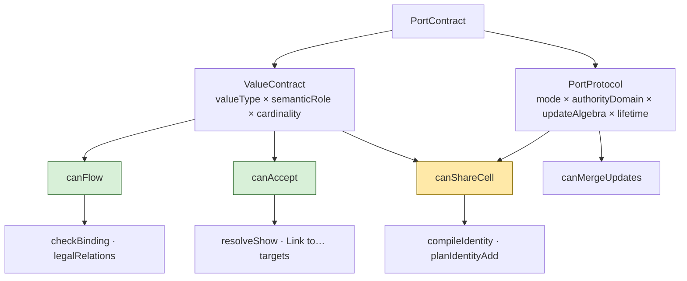
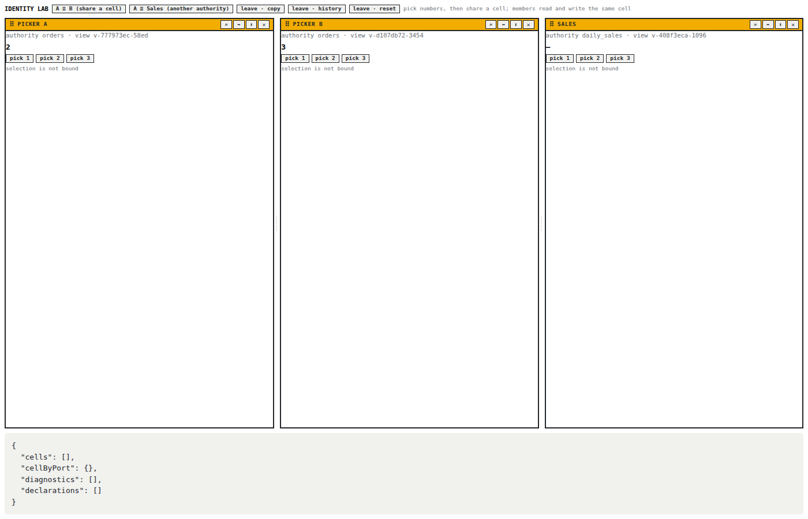
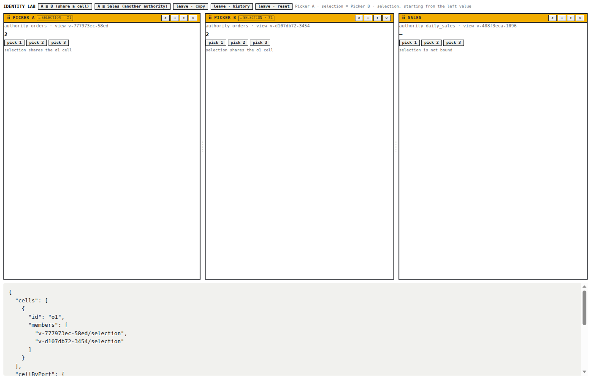
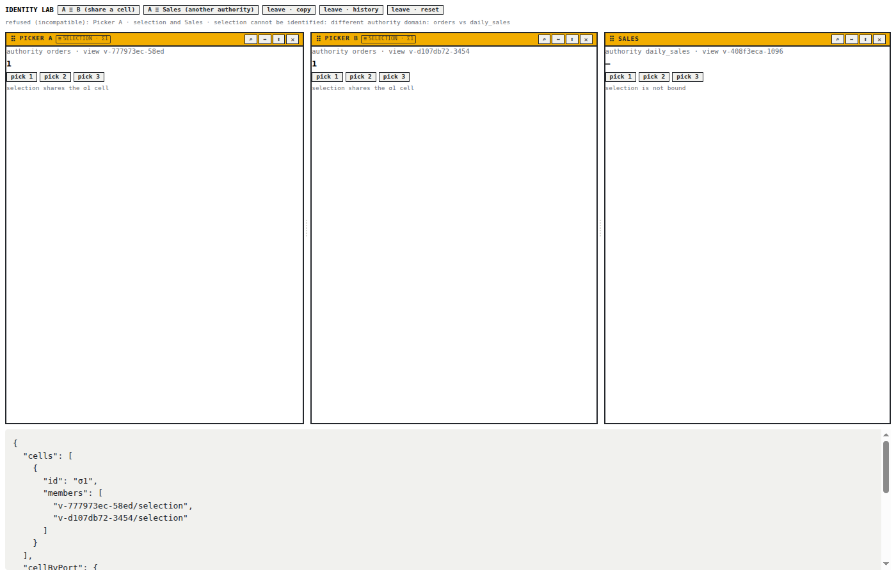
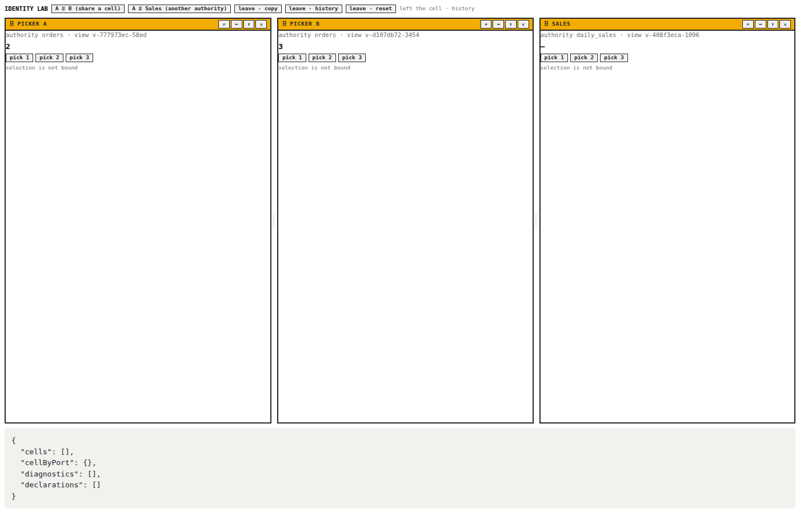

# PBUI Identity Quotient: Logical Cells, Four Compatibility Questions, and the Properties That Hold Them

This report describes the implementation of PBUI-KERNEL-3 on 2026-09-02, the second follow-up ticket split out of the PBUI-KERNEL-1 clean cutover. The ticket has two subjects that share a root. The first is identity: two ports of a workbench may be declared to be the same logical cell, and the set of such declarations induces a partition of the ports. The second is compatibility: whether two ports may be identified is one of at least four different questions the link kernel asks about a pair of port contracts, and until this ticket all four were answered by one of two tools that did not say which question they answered. The root is that both subjects are about what a contract means for an operation, and that the answer differs by operation.

The reader is assumed to know the link kernel as PBUI-LINK-1 built it and as PBUI-KERNEL-2 reorganized it ([[PROJECT REPORT - PBUI Binding Programs - The Link IR as the One Authority for Evaluation, Dependencies, and Planning]]): ports with seven-field contracts, identity classes compiled from declarations with persistent ids, and planners that keep operation policy and take structure from a checker.

> [!summary]
> - The quotient of ports by admitted identity edges is now held to its definition by property tests: forty seeded random edge sets are compared with a naive reference partition, and flipping, duplicating or permuting edges (or the port map) must leave cells, the port-to-cell map and lineage unchanged. All properties held on the prototype as landed.
> - A port contract is a value contract times a protocol, and `links/compatibility.ts` gives each operation its own predicate: `canFlow` and `canAccept` consult value reachability only; `canShareCell` demands equality on both projections and reports value and protocol disagreements apart; `canMergeUpdates` reads the update algebra only.
> - Every caller now names the question it asks. Identity asks `canShareCell`; the checker and relation legality ask `canFlow`; the show resolver and the workbench "Link to…" family ask `canAccept`. No refusal sentence changed.
> - A snapshot exposes its identity as a quotient (`quotientOf`, `cellOf`) and planners phrase refusals in cells. An IdentityLab story in the workbench shows a shared cell, write-through, the authority refusal and a history split on screen.

## 1. Project status

The ticket is complete on the `task/add-plot-editor` branch of pbui, in five phases and ten commits between d9fc64a and 2f2dde2. The exit criteria set by the KERNEL-1 guide (§18, Phase 9) are met: existing class ids and lineage fixtures are stable (the PBUI-LINK-1 identity tests pass unchanged), the quotient partition is order-independent (P1), and identity and flow compatibility tests are separate (P2).

| Phase | What landed | Commit |
|---|---|---|
| P1 | `identity.properties.test.ts`: §19.7 properties as 136 seeded tests against a reference partition | d9fc64a |
| P2 | `links/compatibility.ts`: `canFlow`, `canAccept`, `canShareCell`, `canMergeUpdates`, projections; tests grouped by question | 02d85f3 |
| P3 | Identity on `canShareCell`; checker and `legalRelations` on `canFlow`; `resolveShow` and the workbench "Link to…" family on `canAccept` | 7650690 |
| P4 | `quotientOf(snapshot)`, `cellOf(port, snapshot)`; "shared" refusals read cells and say "cell" | b5907c9 |
| P5 | IdentityLab story; five screenshots; README section; ticket status | 2f2dde2 |

Consumers are untouched. rag-ttc, hyperblog, the shop and the chat demo import the planners and `applyLinkVerb` as before; the one workbench change (the "Link to…" target filter) produces the same set of targets because `canAccept` computes the same reachability the old `reaches` call did.

## 2. The problem

PBUI-LINK-1 Phase 5 introduced identity: an undirected declaration that two ports share one cell, compiled by a union-find into classes with persistent ids, so that a badge does not renumber and undo restores exact cells. The compiler was correct and had tests, but the tests were examples: one three-port chain, one reversal. Nothing said what the compiler was a function of. A union-find has tie-breaking; a fiber split has an order; a canonical sort decides ids. Whether any of those depended on the order in which declarations were written was a question the tests did not ask.

The second half of the problem was older. `types.ts` defined a `PortContract` as the seven fields P06 hashes for identity compatibility, with a comment that "following needs only type reachability; identity needs equality on every field." That sentence names two questions and the code had two tools: `reaches(fromType, toType, graph)` and `contractMismatches(left, right)`. But the kernel asks more than two questions. Whether a subject may be shown in a port is acceptance. Whether two members of a cell combine writes the same way is update merging. The guide's §13.2 lists the four and warns: "Do not equate all compatibility with whole-contract equality by accident." With two tools and four questions, the accident is a matter of time.

## 3. Vocabulary

**Identity declaration.** `{ linkId, left, right, mergePolicy }`: an undirected edge between two ports, persisted in the link document.

**Fiber.** The set of ports with one contract fingerprint. Identity edges are unioned only within a fiber; an edge across fibers is diagnosed as incompatible and does not enter.

**Cell, class.** One equivalence class of ports under the reflexive-symmetric-transitive closure of admitted edges, with at least two members. The code's `IdentityClass` and the guide's `LogicalCell` are the same type; the wire says "class" in `Alias(classId)` and new reasoning says "cell".

**Quotient.** `IdentityQuotient { cells, cellByPort, lineage, diagnostics }`: the partition as a whole.

**Lineage.** What happened to a class across a recompile: `new`, `unchanged`, `expanded`, `contracted`, `merged`, `split`.

**Value contract, protocol.** `ValueContract = valueType × semanticRole × cardinality`; `PortProtocol = mode × authorityDomain × updateAlgebra × lifetime`; `PortContract = ValueContract × PortProtocol`.

**Verdict.** `{ ok: true } | { ok: false, code, because }`, the shape every predicate returns; `canShareCell` returns a `ShareVerdict` that adds the value and protocol mismatch lists.

## 4. The quotient and its properties

### 4.1 The definition

Given a port map `P` and declarations `E`, admit an edge when both ports exist, neither is output-only, and their contracts agree on every field. Let `~` be the reflexive, symmetric, transitive closure of the admitted edges. The cells are `P / ~` with singletons dropped. That is the whole definition, and the test file writes it down as a function of about twenty lines, `referencePartition`, using a breadth-first search over an adjacency map. The compiler is then held to it.

### 4.2 The properties

The guide's §19.7 lists six properties. Each is a `describe` block in `identity.properties.test.ts`, and each runs over seeded random edge sets from a small generator (mulberry32) so that a failing case is reproducible from the seed in the test name. The port map is synthetic: eight ports in fiber `orders`, four in fiber `daily_sales`, one output-only port and one port with another semantic role, so that every rejection class can appear in a random set.

| Property | What the test does |
|---|---|
| The quotient is the closure | 40 seeds: `cells(compile(E))` equals `referencePartition(E)` as a set of member lists |
| `union(a,b) == union(b,a)` | 20 seeds: flip every edge; cells and `cellByPort` unchanged |
| Duplicate edges are idempotent | 20 seeds: every edge written twice under a new link id; cells unchanged |
| Permutations preserve cells | 20 seeds × 5 rounds: shuffle the edges and the port map; cells, `cellByPort` and lineage unchanged, ids included |
| Incompatible declarations never enter | a fixture with a cross-fiber, an output-only, an other-role and a missing-port edge, each diagnosed with its code; 10 seeds: no cell ever mixes fingerprints or contains an output port |
| Unchanged components retain ids; lineage is deterministic | 20 seeds: random edges elsewhere never renumber an untouched cell; five fixtures (expand, contract, merge, split, new beside unchanged) report the same lineage from any order |

Every property held on the first run against the compiler as landed. The one failure was in the comparison: the compiler orders cells by contract fingerprint (so the `daily_sales` fiber sorts before `orders`), the reference by first member. The partition agreed. The comparison now sorts both sides by first member, since the partition is what the property is about and the cell order is a canonical convention of the compiler, tested separately by the permutation property.

### 4.3 Why the compiler is order-independent

It is worth stating why the properties hold, because the compiler was written before the properties were. Three decisions in `compileIdentity` do the work. Equal-rank unions break ties lexically, so the root of a component does not depend on which edge arrived first. Components are collected and sorted by fingerprint and then by smallest member before any id is assigned, so the sequence of components is a function of the partition. And id assignment walks that sorted sequence, giving each component the id of the previous class it overlaps most (ties by id), so ids are a function of the partition and the previous classes. Lineage is computed from the same sorted assignment. None of these depend on declaration order, and the permutation property confirms it for lineage as well as membership, which the original tests did not cover.

### 4.4 The snapshot's view

`compileIdentityQuotient(declarations, ports, previous)` was in the prototype: compile, then view. What planners and instruments hold is a `LinkSnapshot`, which carries classes (for id stability) and aliases (port → class id) but not the compile that produced them. Phase 4 added the view over a snapshot:

```ts
function quotientOf(s): IdentityQuotient
  // cells = s.classes; cellByPort = s.aliases; lineage = empty; diagnostics = a fresh compile's

function cellOf(port, s): LogicalCell | null
```

Lineage is empty on purpose. A snapshot does not persist it and recomputing it needs the previous classes, which the apply step has at the one moment lineage is true. The three planners that refuse a shared destination read the cell through `cellOf` and say "shares the σ1 cell; leave the cell first"; before, the sentence used "cell" and "class" for one thing.

## 5. Four questions of a contract

### 5.1 The factorization

`types.ts` already had the projections (`valueContractOf`, `portProtocolOf`, `VALUE_CONTRACT_FIELDS`, `PORT_PROTOCOL_FIELDS`). What `links/compatibility.ts` adds is the predicates, each with a name, a code and a sentence:

```ts
canFlow(from: ValueContract | RuntimeTypeId, into: ValueContract, graph): Verdict
canAccept(reference: SerializableReference, into: ValueContract, graph): Verdict
canShareCell(left: PortContract, right: PortContract): ShareVerdict
canMergeUpdates(left: PortProtocol, right: PortProtocol): Verdict
```

```text
canFlow(from, into)      reaches(from.valueType, into.valueType, graph)
canAccept(ref, into)     canFlow(ref.type, into, graph)
canShareCell(l, r)       valueMismatches(l, r) = ∅  ∧  protocolMismatches(l, r) = ∅
canMergeUpdates(l, r)    l.updateAlgebra == r.updateAlgebra
```

The predicates are deliberately narrow in what they do not consult. `canFlow` reads the value type and nothing else: not cardinality, not role, not any protocol field. That is the PBUI-LINK-1 law (a follow needs type reachability) given a name rather than changed; a cardinality-aware flow (`many` into `one`) would be new behavior and is left for a ticket that wants it. `canMergeUpdates` reads only the algebra; authority is a different question (who may write), and a merge policy that needs both should compose the two predicates rather than widen one.

`canShareCell` is the whole-contract equality identity always required, but its verdict keeps the two projections apart. A menu can then say whether two ports disagree about what they hold (value type, role, cardinality) or about how they hold it (mode, authority, algebra, lifetime). The `because` sentence concatenates value mismatches then protocol mismatches, which is the order `contractMismatches` produced from the fingerprint's field list, so identity refusals are byte-identical after the change.

### 5.2 The tests are grouped by question

`compatibility.test.ts` is organized so that the same pair of contracts is asked several questions and the answers are allowed to differ:

| Pair | `canFlow` | `canShareCell` | `canMergeUpdates` |
|---|---|---|---|
| `order` out → `inspectable` in (a subtype) | ok | refused: value type, semantic role | ok |
| orders selection ↔ daily_sales selection | ok | refused: authority domain (protocol) | ok |
| orders selection ↔ orders selection with `union` algebra | ok | refused: update algebra (protocol) | refused |
| orders selection ↔ same contract | ok | ok | ok |

The first row is the one that matters most. Flow accepts a subtype, because a detail that reads an `inspectable` can read an `order`. Identity refuses it, because two ports that are one cell must agree on what the cell holds, and `order` and `inspectable` are different value types with different roles. Before this ticket that distinction was correct in the code and invisible in the tests; a future change that made identity use reachability would have failed no test.

### 5.3 Who asks what

Phase 3 moved every caller onto its predicate:

```text
compileIdentity, planIdentityAdd (via compatibilityOf)    canShareCell
checkBinding, destination check                            canFlow
legalRelations, relation codomain                          canFlow
resolveShow, existing ports a subject may be shown in      canAccept
workbench "Link to…" family, target filter                 canAccept
```

One `reaches` call stays in `check.ts` and one in `plan.ts`, both matching an input type against a relation's declared source type. That is a question about a relation's domain, and a relation has no port contract to ask `canFlow` about. A second `reaches` stays in `resolveShow` for spawnable apps, whose `valueType` is a bare type rather than a contract; if apps ever declare contracts for spawning, it becomes `canAccept`.



## 6. What the work found

**The compiler was already order-independent, including ids and lineage.** The value of Phase 1 was the proof, not a repair; the permutation property is the one that had never been asked and it held.

**Two tools answered four questions.** Before Phase 3 the workbench's "Link to…" family called `reaches` directly, which was the only compatibility decision outside the kernel's planners. Everything else went through the planners, which is the right shape; the family now asks `canAccept`, which is the same computation with a name.

**A snapshot does not know its lineage.** The design's `IdentityQuotient` carries lineage, but a snapshot carries classes without the compile that produced them. `quotientOf` returns an empty lineage rather than recomputing one that could be wrong; a UI that wants "merged"/"split" reads the `CompiledIdentity` the apply step returns.

**The demo apps could not share a cell.** The workbench's stories had one output port and one input port, and identity needs two inout ports with one contract. The IdentityLab story adds a picker app with an inout `selection` port, declared twice with different authorities so that one workspace holds both a shareable pair and a refused one.

## 7. Testing

| Suite | Result |
|---|---|
| `identity.properties.test.ts` | 136 tests (40 seeds, 5 fixtures, 6 properties) |
| `compatibility.test.ts` | 11 tests, grouped by question |
| `identity.test.ts`, `identity.quotient.test.ts` (PBUI-LINK-1 and prototype) | unchanged and green; class ids and lineage fixtures stable |
| `npx vitest run src/presentation/links` | 11 files, 287 tests (136 at the start of KERNEL-2, 65 before it) |
| `npx vitest run src` (pbui root) | 42 files, 591 tests |
| `pnpm build`, pbui-workbench typecheck and tests | clean; 31 files, 281 tests |

## 8. On screen

The screenshots were taken with Playwright at 1400×900 against the pbui-workbench Storybook story `Workbench/IdentityLab`, added in Phase 5. Three pickers each own an inout `selection` port; Picker A and Picker B have authority `orders`, Sales has `daily_sales`.

Each picker holds its own value; there are no declarations and the panel below reports no cells:



After "A ≡ B", `planIdentityAdd` accepts through `canShareCell`, both badges read `≡ selection · σ1`, both pickers show the left value (`prefer-left`), and the panel lists cell σ1 with both members and the port-to-cell map:



Picker B picks 1 and Picker A shows 1: a member writes the shared cell, because `useEmitPort` looks up the emitting port's alias and routes the write to the class:


"A ≡ Sales" is refused with the field named, `different authority domain: orders vs daily_sales`. This is the pair `canFlow` would accept; the refusal is `canShareCell`'s protocol projection:



After "leave · history", each picker shows the value it had before the merge (A 2, B 3), the cell is gone and the declarations are empty:



## 9. Working rules

- A compatibility decision names its question. New code calls `canFlow`, `canAccept`, `canShareCell` or `canMergeUpdates`; it does not call `reaches` on a contract or compare whole contracts by hand. The remaining `reaches` calls are about relations and bare app types, not ports.
- Identity is a quotient. Planners and instruments read `cellOf` or `quotientOf`; `Alias(classId)` is what the wire and the effective binding say, not what reasoning is phrased in.
- The reference partition in `identity.properties.test.ts` is the definition of identity. A change to what an admitted edge is (for example, a relaxed compatibility for sharing) changes the reference first and the compiler second, and the seeds must still agree.
- Lineage comes from the apply step's `CompiledIdentity`, never from a snapshot.
- A refusal sentence for sharing lists value disagreements before protocol disagreements; the tests and the identity refusals depend on that order.

## 10. Open questions and next steps

- Cardinality-aware flow: whether `many` into `one` should be refused by `canFlow`. It is a behavior change and needs a product that wants it.
- Whether a snapshot should carry lineage, persisted beside the classes, so that a badge can say "merged" without the apply step's result.
- `canAccept` for spawnable apps once they declare contracts rather than bare value types.
- PBUI-KERNEL-4 (interaction policy and introspection) is the remaining follow-up from KERNEL-1.

## 11. Files to read first

- `src/presentation/links/compatibility.ts`: the four predicates; the top comment states the four questions.
- `src/presentation/links/compatibility.test.ts`: the same pairs asked each question.
- `src/presentation/links/identity.properties.test.ts`: `referencePartition` is the definition; the six `describe` blocks are §19.7.
- `src/presentation/links/identity.ts`: `compileIdentity`, `compatibilityOf`, `quotientOf`, `cellOf`.
- `packages/pbui-workbench/src/stories/IdentityLab.stories.tsx`: the smallest shared-cell demo.
- `README.md`, subsection "Identity and port compatibility".
- The ticket's diary, `ttmp/2026/09/02/PBUI-KERNEL-3--…/reference/01-diary.md`, Steps 1–5.

## 12. Conclusion

KERNEL-3 changed no partition and no refusal. What it changed is what the code can be held to. The identity compiler is now provably a function of the set of admitted edges, in membership, in ids and in lineage, against a definition written in twenty lines. The four questions a link operation asks of two contracts have four names, and each caller says which one it means, so a subtype can flow into a port and still be refused as its cell-mate without anyone reading the wrong seven fields by accident. The design guide's warning about equating compatibility with equality is no longer a warning; it is a type signature.

## Related notes

- [[PROJECT REPORT - PBUI Binding Programs - The Link IR as the One Authority for Evaluation, Dependencies, and Planning]]: KERNEL-2, the ticket before this one; its checker now asks `canFlow`.
- [[PROJECT REPORT - PBUI Kernel - One Compiled Presentation, Named Fragments, and the Clean Cutover of Every Consumer]]: KERNEL-1, whose guide §13 and §19.7 this ticket implements.
- [[PROJECT REPORT - PBUI Linked Tiles - Landing the Binding Algebra in the pbui Workbench]]: PBUI-LINK-1, where identity classes and port contracts were first built.
