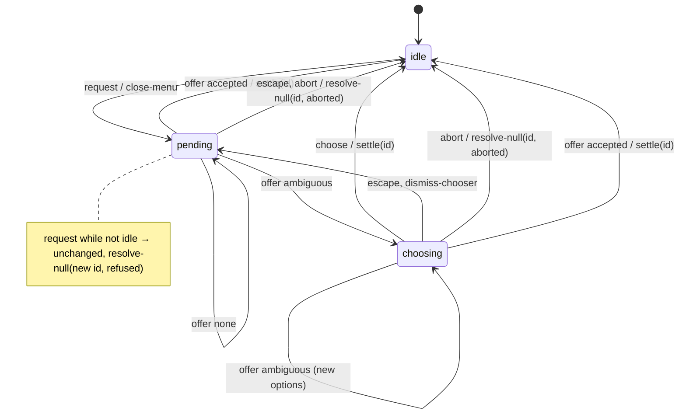
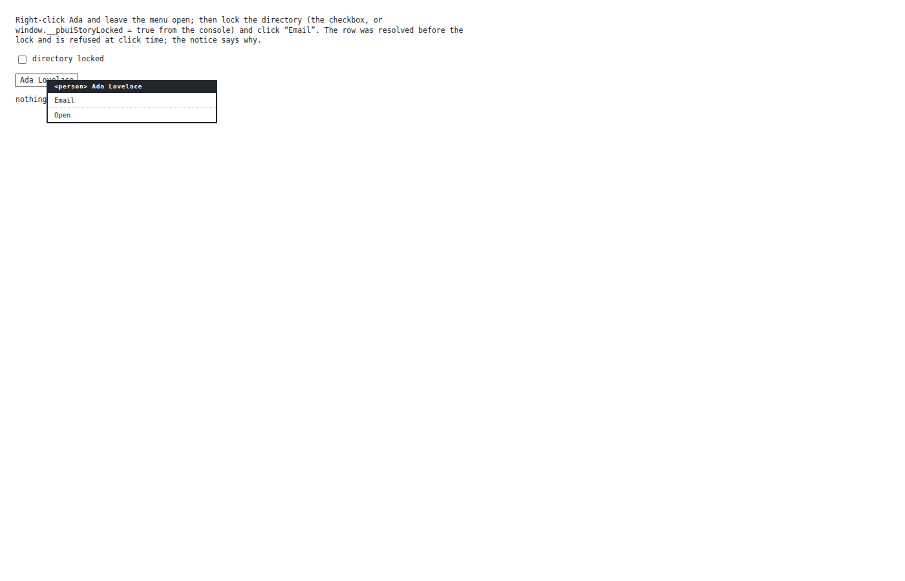
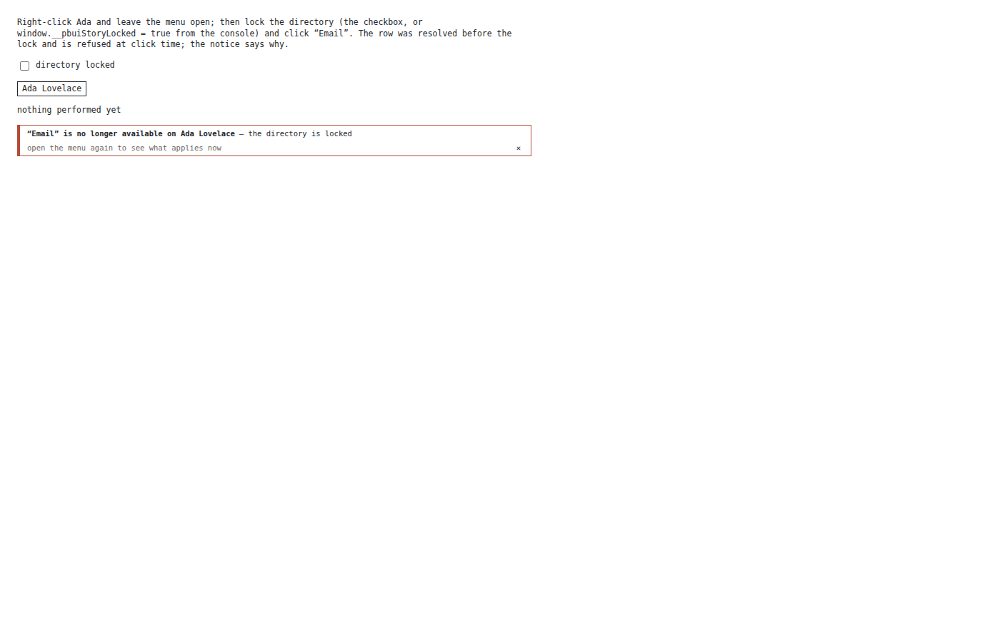
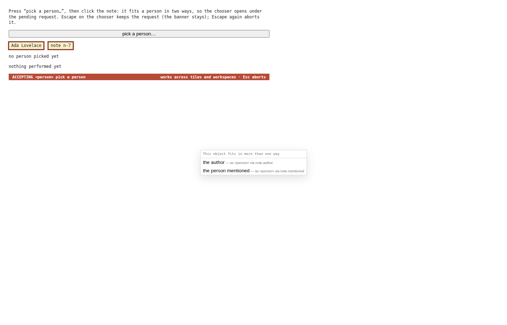
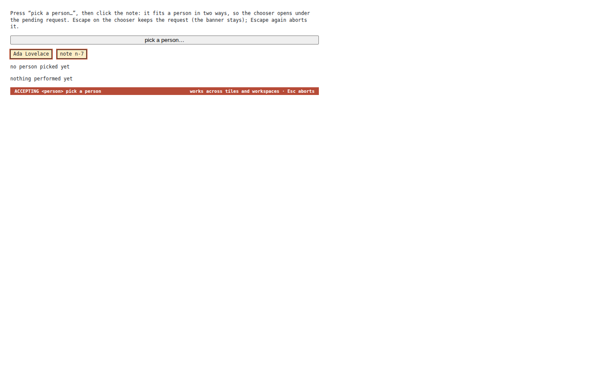
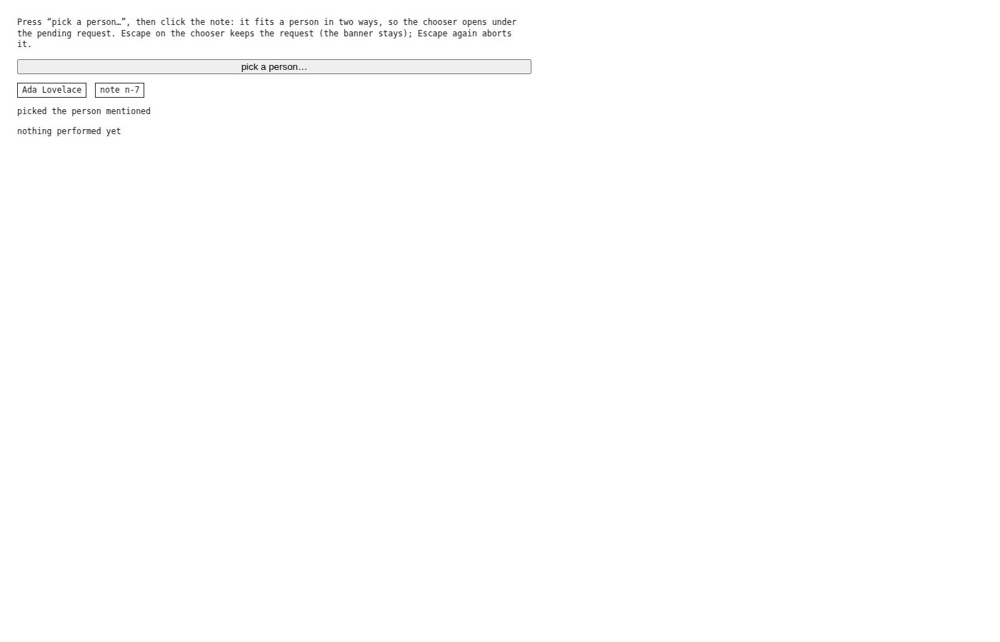
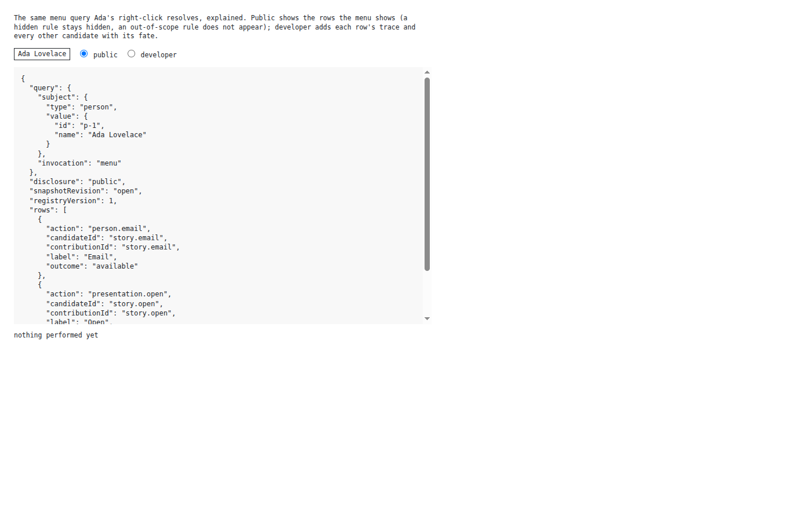
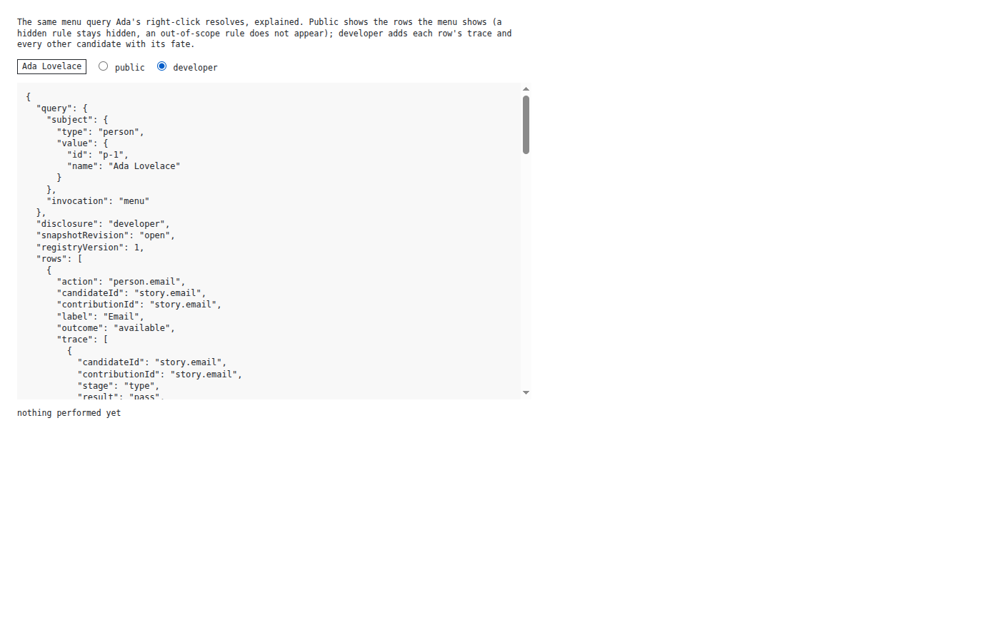

# PBUI Interaction Policy: One Activation Ladder, a Request-Identified Accept Machine, Refusals with a Face, and Explaining the Menu

This report describes the implementation of PBUI-KERNEL-4 on 2026-09-02, the last of the three follow-up tickets split out of the PBUI-KERNEL-1 clean cutover. Where KERNEL-2 and KERNEL-3 were about the link kernel, this ticket is about the React runtime in `src/presentation/createPbui.tsx`: what happens when a user clicks a presentation, what happens while a command is waiting for an object, what the user sees when a menu row is refused, and how a product can explain the menu the user is looking at. Each of those was policy living inside event handlers and `useState` calls. The ticket moves the policy into pure functions with tests and leaves the components to dispatch events and carry out effects.

The reader is assumed to know the action-selection kernel ([[PROJECT REPORT - pbui Action-Selection Kernel and the Post-Legacy Unification]]): resolved actions, fresh revalidation at click time, and the acceptance resolver that decides whether a clicked reference satisfies a pending request directly, through a relation, or ambiguously.

> [!summary]
> - The click ladder is one pure function. `activationOutcome({ acceptable, activate, primary })` returns `attempt-accept`, `activate-host`, `perform-primary` or `open-menu`; the pointer and keyboard handlers both ask it and differ only in how they carry the outcome out. A table test covers every input combination.
> - The accept flow is a request-identified state machine. `acceptStep(state, event)` returns the next state and effects; promise resolvers are keyed by request id, so a settle can only resolve the request it names. 200 seeded event sequences hold the §14.5 invariants; six DOM tests hold them through the real components. `pbui.accept` is still a promise-returning call usable outside React.
> - A refusal has a presentation. Every fresh-revalidation refusal lands in `pbui.refusal`; `RefusalNotice` renders it as one sentence with the row, the subject, the product's reason and a hint. `onRefuse` is now an optional hook, and a refusal that nothing observes is warned about.
> - Introspection explains the original query. `pbui.explain(query, disclosure)` reuses the menu's or primary click's resolution over the same snapshot; `public` is exactly what the menu shows, `developer` adds the trace and every other candidate's fate.

## 1. Project status

The ticket is complete on the `task/add-plot-editor` branch of pbui, in six phases and twelve commits between 2ae05e8 and e56e3da. The exit criteria set by the KERNEL-1 guide (§18, Phase 10) are met: pointer and keyboard paths call one activation function; accept-machine properties hold under generated event sequences; public introspection omits hidden detail; developer introspection explains the same rows as the menu query. The constraint from the consumer inventory holds: rag-ttc's accept bridge captures `pbui.accept` from outside React and calls it from its verb sink, and that function is unchanged in shape.

| Phase | What landed | Commit |
|---|---|---|
| P1 | `interaction/activation.ts`; both DOM handlers on it; table test | 2ae05e8 |
| P2 | `interaction/accept.ts`: state, events, effects, `acceptStep`; 8 transition tests and 200 fuzzed sequences | 65ae198 |
| P3 | The Provider as executor: one machine state, resolvers by request id, Escape dispatched by the surfaces | db767eb |
| P4 | `interaction/refusal.ts`, `pbui.refusal`, `RefusalNotice`, `onRefuse` optional with a warning; 5 DOM tests | 4ee8735 |
| P5 | `interaction/explain.ts`, `pbui.explain`, public/developer disclosure; 5 tests | 65832f2 |
| P6 | §19.8 runtime tests, three Storybook stories, seven screenshots, stylesheet rules, README | e56e3da |

Consumers are unchanged. Every field they read from the context (`accepting`, `acceptChooser`, `accept`, `abortAccept`, `resolve`, `performAction`) keeps its name and type; the new fields (`acceptDispatch`, `refusal`, `dismissRefusal`, `explain`) are additions. `onRefuse` went from required to optional, which breaks no caller.

## 2. The problem

`createPbui.tsx` is the one place where pbui touches the DOM, and by the time KERNEL-1 landed it held four pieces of policy that were correct, tested through their symptoms, and written in the shape React invites: state in hooks, decisions in handlers.

The click ladder was spelled twice. `handleClick` decided, in order, acceptable → accept, `activate` → the host's gesture, a unique primary → perform it, otherwise open the menu. `handleKeyDown` spelled the same four rungs for Enter and Space. The two had diverged once already (PR #9: Enter called `activate.run` directly and never reached the host) and had been re-aligned by hand with a comment explaining why.

The accept flow was three pieces of state (`accepting`, `acceptChooser`, and a `pending` ref holding the promise's resolver) and four callbacks (`accept`, `settle`, `satisfyAccept`, the chooser's `dismiss`). Its invariants were real: one request at a time, a second resolves null without disturbing the first, Escape on the chooser keeps the request while Escape on the banner aborts it. But nothing stated them as a whole, and the resolver in one ref could in principle be settled by whichever callback ran last.

Refusals had a contract and no face. KERNEL-1 made `onRefuse` required so that a stale row's refusal could not vanish by omission, and every consumer then wrote a handler: rag-ttc traces it, the shop sets a status line, hyperblog and the chat demo pass `() => {}` with a comment. The runtime knew exactly what was refused and why, and had no way to say so itself.

Introspection had the wrong input. The help surface resolves with invocation `"introspection"`, which is right for help; but explaining a menu by re-resolving with a different invocation explains a different query, since invocation is an input to discovery. The guide's §15.3 is explicit that a menu is explained from the menu's own resolution.

## 3. Vocabulary

**Activation.** A left click or an Enter/Space on a presentation. Its **outcome** is one of `attempt-accept`, `activate-host`, `perform-primary`, `open-menu`.

**Accept request.** `{ types, prompt }`: a product's demand for an object of some type, made through `pbui.accept(request)`, which returns a promise of a reference or null.

**Offer.** A click on a presentation while a request is pending, resolved against the request by the acceptance resolver into `accepted`, `ambiguous` (several relations tie) or `none`.

**Request id.** A number minted per `accept` call; the machine's state carries it, and every terminal effect names it.

**Refusal.** The runtime's decision not to perform a clicked row because the fresh resolution disagrees with the rendered one: `action-no-longer-available`, `action-no-longer-resolves`, `action-became-ambiguous`, `action-implementation-changed`.

**Disclosure.** `"public"` or `"developer"`: how much of a resolution's trace an explanation shows.

## 4. One activation ladder

### 4.1 The function

```ts
type ActivationOutcome<Values, Verb> =
  | { kind: "attempt-accept" }
  | { kind: "activate-host"; bubble: true; run: (() => void) | undefined }
  | { kind: "perform-primary"; action: ResolvedAction<Values, Verb> }
  | { kind: "open-menu" };

function activationOutcome({ acceptable, activate, primary }): ActivationOutcome
  if acceptable            → attempt-accept
  if activate              → activate-host (bubble, carry run)
  if primary() is one      → perform-primary
  otherwise                → open-menu
```

Two details are deliberate. The first rung is named `attempt-accept`, not `accept`: an acceptable click may open the chooser rather than settle, and the name should not promise more than the machine does. The primary resolution is a thunk: resolving the unique primary action costs a kernel resolution, and doing it for every click that never reaches the third rung would put menu-time work on the render path of every grid cell, which is the cost boundary datalab set. The table test records, for each of the eight input combinations, the outcome, whether the gesture stops, and whether the thunk ran.

### 4.2 The handlers

Both handlers now read:

```ts
const outcome = activationOutcome({ acceptable, activate, primary: primaryFor });
switch (outcome.kind) { … }
```

and differ only in the carrying out. On the pointer, `activate-host` runs `run` (if any) and lets the click bubble so the host row sees its own gesture; the other three stop propagation, because they are this element acting. On the keyboard, `activate-host` synthesises a real bubbling click with `element.click()`, which is what a host listening for clicks expects, and `open-menu` anchors the menu at the element's box rather than at pointer coordinates. The click-propagation tests from PBUI-ACTIONS-2 (host sees an activated click; menu swallows; Enter reaches the host, with and without `run`; nested presentations) pass unchanged.

## 5. The accept machine

### 5.1 State, events, effects

```ts
type AcceptState =
  | { kind: "idle" }
  | { kind: "pending";  requestId; request }
  | { kind: "choosing"; requestId; request; options };

type AcceptEvent =
  | { type: "request"; requestId; request }
  | { type: "offer"; reference; resolution }      // accepted | ambiguous | none
  | { type: "choose"; option }
  | { type: "escape" } | { type: "dismiss-chooser" } | { type: "abort" };

type AcceptEffect =
  | { kind: "close-menu" }
  | { kind: "settle"; requestId; reference }
  | { kind: "resolve-null"; requestId; reason: "refused" | "aborted" };
```

The transition table, in prose:

- `request` from `idle` goes `pending` and closes the menu. From any other state it is refused: the state is returned unchanged and the effect is `resolve-null` for the new request's id with reason `refused`.
- `offer` while `pending` or `choosing`: `accepted` settles and returns to `idle`; `ambiguous` goes `choosing` with the options under the same request id; `none` changes nothing.
- `choose` while `choosing` settles with the option's result.
- `dismiss-chooser` and `escape` while `choosing` return to `pending` with the same request. `escape` and `abort` while `pending` return to `idle` with `resolve-null` for the request, reason `aborted`.
- Everything else is a no-op with no effects.

The `reason` on `resolve-null` was not in the guide's sketch. It is there because the old runtime told the product's `onAccept` about an abort and did not tell it about a refused second request, and the executor that runs the effect no longer has the machine's context to know which case it is in.

### 5.2 The invariants as a fuzz

`accept.test.ts` runs 200 seeded sequences of 40 random events (mulberry32, so a failure is reproducible from its seed) and checks at every step: a `request` from `idle` is admitted and any other is refused with the state object returned identical; a `choosing` state has options; a terminal effect for the current request leaves the machine idle; Escape from `choosing` keeps the request id and from `pending` ends it. After draining with `abort`, every admitted request and every refused request has exactly one terminal effect. Counting admitted and refused requests separately is what makes "exactly once" provable rather than assumed.

### 5.3 The Provider as executor

```ts
const acceptRef = useRef<AcceptState>({ kind: "idle" });          // read by accept() and offers
const [acceptState, setAcceptState] = useState(…);                 // mirror, for rendering
const acceptResolvers = useRef(new Map<number, resolve>());

acceptDispatch(event):
  step = acceptStep(acceptRef.current, event)
  acceptRef.current = step.state; setAcceptState(step.state)
  for effect of step.effects: execute(effect)

execute:
  close-menu    → setMenu(null)
  settle        → resolvers.take(id)(reference); onAccept(reference)
  resolve-null  → resolvers.take(id)(null); if aborted: onAccept(null)

accept(request) = new Promise(resolve => { id = ++counter; resolvers.set(id, resolve); dispatch(request) })
```

Two readers of the state are deliberately different. `isAcceptable` reads the mirrored state because it is a render-time predicate that decides which presentations light up. `satisfyAccept` reads the ref because a click may arrive before the mirror has re-rendered, and reading the mirror there could lose an offer. The banner and the chooser both forward Escape as one `escape` event; the escape-surface stack still decides which of the two surfaces owns the key, so a dialog opened above keeps its own Escape, and the machine decides what the key means.



## 6. Refusals with a face

`describeRefusal({ code, because, label, subjectLabel })` is a pure function returning a headline, an optional detail and a hint:

| Code | Headline |
|---|---|
| `action-no-longer-available` | “Email” is no longer available on Ada Lovelace |
| `action-no-longer-resolves` | “Email” no longer applies on Ada Lovelace |
| `action-became-ambiguous` | “Email” now matches more than one rule on Ada Lovelace |
| `action-implementation-changed` | “Email” changed while the menu was open |
| anything else | “Email” was refused on Ada Lovelace (code) |

The Provider stores each refusal (now carrying the row's label when it was a string) in `pbui.refusal`, calls `onRefuse` if given, and clears the refusal when the next menu opens, since the user is then looking at what applies now. `RefusalNotice` renders it with `role="alert"` and a dismiss button, and registers itself in a context counter. A refusal that neither a mounted notice nor an `onRefuse` handler observes is logged as a warning naming the code. That warning is the mechanism that replaces the type-level requirement KERNEL-1 introduced: `onRefuse` is optional again, and "never silent" is enforced at the moment a refusal happens rather than at the moment a Provider is written.

## 7. Explaining the menu

`explainResolution(query, resolution, disclosure)` takes the resolution the menu or the primary click already computed and decides how much of it to show. `pbui.explain(query, disclosure = "public")` resolves the query exactly as `pbui.resolve` does and hands the result over; there is no re-resolution with a synthetic invocation.

```text
public:
  rows        = resolution.actions, in menu order: action, candidate, contribution, label,
                outcome (available | unavailable), the product's because
  ambiguities = resolution.ambiguities
  nothing else: no trace, no hidden or rejected candidates, no reason codes

developer:
  rows        = the same, each with its trace entries
  others      = every candidate in the trace that is not a shown row, with its last
                stage, result and reason code, and its trace
```

A hidden rule wins its action and is then withheld at the `selected` stage, which is why public disclosure filters on the rows and not on a `condition` stage of the trace. The tests serialize the public explanation and assert that the hidden rule's id, an out-of-scope rule's id, `reasonCode`, an unavailable rule's code, and the words `trace` and `others` are absent from the text; the developer test checks that the shown rows are the menu's rows candidate for candidate, that each row's trace entries belong to that candidate, and that the hidden and out-of-scope rules appear among the others with `selected:hidden` and `scope:reject`.

The runtime does not enforce a gate around developer disclosure. The doc comment says it is for a product's own diagnostics behind a deliberate gate; that gate is the product's.

## 8. What the work found

**The handlers were already aligned; the function makes staying aligned free.** No behavior changed in P1, and every propagation test passed. What changed is that a future rung goes in one place.

**The old accept code resolved a refused second request without telling `onAccept`, and an abort with telling it.** That asymmetry was correct and undocumented; it is now a field on the effect and a test.

**A stale row needs a side channel to demonstrate.** A row can only go stale between menu render and click, and any click in the page closes the menu, so the Storybook story exposes the lock as a window flag that Playwright (or the console) flips while the menu is open. The refusal itself comes from `evaluateFresh` as in production.

**Playwright's screenshot can hang on this UI.** With the chooser open the screenshot call timed out twice; the acceptable-pulse animation and the chooser's focus handling kept the page from settling. Injecting a no-animation stylesheet made it return. The KERNEL-2 and -3 screenshots did not need this because nothing pulsed.

## 9. Testing

| Suite | Result |
|---|---|
| `interaction/activation.test.ts` | 10 tests: the full input table plus outcome payloads |
| `interaction/accept.test.ts` | 208 tests: 8 transitions, 200 seeded sequences |
| `interaction/refusal.test.ts`, `interaction/explain.test.ts` | 3 and 5 tests |
| `createPbui.refusal.test.tsx` | 5 DOM tests: notice content, dismiss and retirement, hook still called, warning when unobserved, no warning when mounted |
| `createPbui.interaction.test.tsx` | 6 DOM tests: direct settle, second request, chooser vs request Escape, choose, Enter parity, explain via context |
| `npx vitest run src` (pbui root) | 48 files, 828 tests |
| `pnpm -r typecheck` after `pnpm build` | every workspace package clean |
| `pnpm -r --no-bail test` | green in every package; the two failures are the ones baselined in KERNEL-1 |

## 10. On screen

The screenshots were taken with Playwright at 1400×900 against the core pbui Storybook, story group `Presentation/Interaction (KERNEL-4)`. The three stories share one presentation: a person with an always-available Open, an Email that becomes unavailable when a directory lock is set, a hidden Audit rule, an admin-only Purge, and a note that fits a person through two acceptance relations.

Ada's menu is open; the directory was locked from the console after the menu resolved, so the Email row is now a stale proposal:



Clicking Email performs nothing and the notice says why, with the row, the subject, the product's reason and a hint:



A pending request for a person, and a click on the note, which fits a person in two ways: the banner stays and the chooser opens under the same request:



Escape on the chooser dismisses the choices and keeps the request; the banner is still there and nothing was picked:



Choosing “the person mentioned” settles the request with that option's result:



The menu query explained under public disclosure: two rows with their availability, no trace, and neither the hidden Audit nor the admin-only Purge:



The same query under developer disclosure: each row with its trace entries, and the other candidates with their fates further down:



## 11. Working rules

- A new rung in the click ladder goes into `activationOutcome` and its table test; the handlers only carry outcomes out.
- Accept policy lives in `acceptStep`. A component that wants the accept flow to do something new dispatches a new event; it does not set state.
- A terminal effect names its request id. Anything that resolves an accept promise goes through the executor's `settle` or `resolve-null`.
- A product either mounts `RefusalNotice` or passes `onRefuse`; the warning is not a substitute for either.
- An explanation is computed from the query the user is looking at. Do not resolve with `"introspection"` to explain a menu; that invocation is for help.
- Developer disclosure is gated by the product, not by pbui.

## 12. Open questions and next steps

- Consumers can mount `RefusalNotice` and drop their `() => {}` handlers when pbui 0.11 is released; the shop's status line and rag-ttc's trace handler remain valid uses of `onRefuse`.
- A developer-disclosure panel in a product; the chat demo's inspector is the natural host.
- Whether `request` while `choosing` should queue rather than refuse. The guide says refuse; the machine refuses; nothing has asked for a queue.
- The coordinated 0.11 release that KERNEL-1's §20.5 lists is now unblocked: all three follow-up tickets have landed.

## 13. Files to read first

- `src/presentation/interaction/activation.ts` and its test: the ladder as a table.
- `src/presentation/interaction/accept.ts`: the invariants are in the top comment; `accept.test.ts` is the fuzz.
- `src/presentation/createPbui.tsx`: search `acceptDispatch` for the executor, `RefusalNotice` for the notice, `explain:` for introspection.
- `src/presentation/interaction/explain.ts`: the two disclosures.
- `src/presentation/Interaction.stories.tsx`: the three stories behind the screenshots.
- `README.md`, section "Interaction policy and introspection".
- The ticket's diary, `ttmp/2026/09/02/PBUI-KERNEL-4--…/reference/01-diary.md`, Steps 1–6.

## 14. Conclusion

KERNEL-4 closes the KERNEL-1 design. The compiled presentation (KERNEL-1), the binding programs (KERNEL-2) and the identity quotient with its four compatibility questions (KERNEL-3) made the kernel's decisions explicit; this ticket does the same for the runtime's. A click's outcome is a value from a function with a table. An accept request is a number that its settle effect must name. A refusal is a sentence the runtime can show. An explanation is the menu's own resolution, disclosed by policy. The React components that remain do what components should: they dispatch, and they render.

## Related notes

- [[PROJECT REPORT - PBUI Kernel - One Compiled Presentation, Named Fragments, and the Clean Cutover of Every Consumer]]: KERNEL-1, whose guide §14.4, §14.5 and §15.3–§15.5 this ticket implements.
- [[PROJECT REPORT - PBUI Binding Programs - The Link IR as the One Authority for Evaluation, Dependencies, and Planning]]: KERNEL-2.
- [[PROJECT REPORT - PBUI Identity Quotient - Logical Cells, Four Compatibility Questions, and the Properties That Hold Them]]: KERNEL-3.
- [[PROJECT REPORT - pbui Action-Selection Kernel and the Post-Legacy Unification]]: fresh revalidation and the acceptance resolver this ticket builds on.
