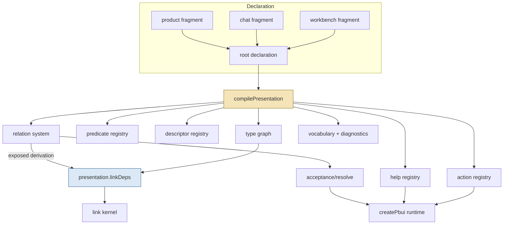
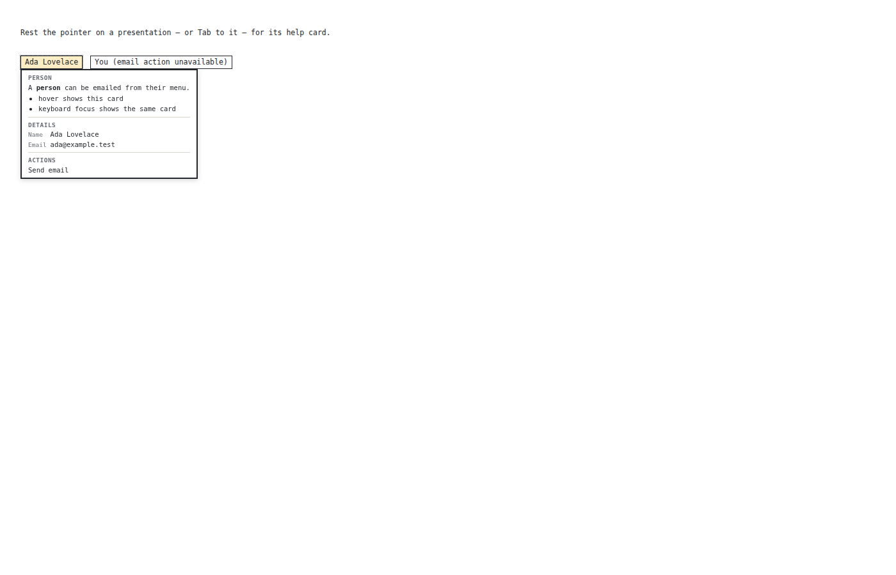
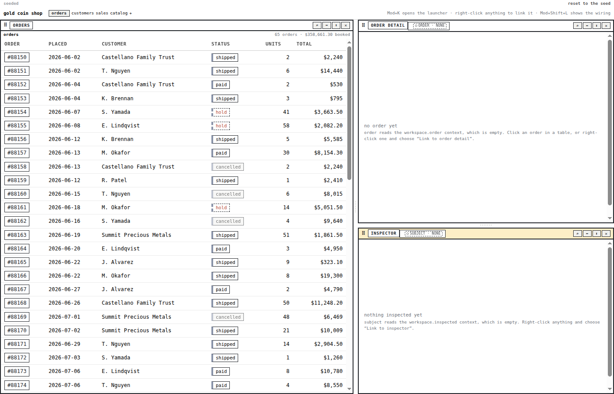
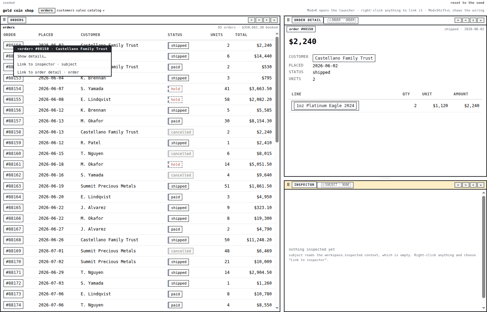
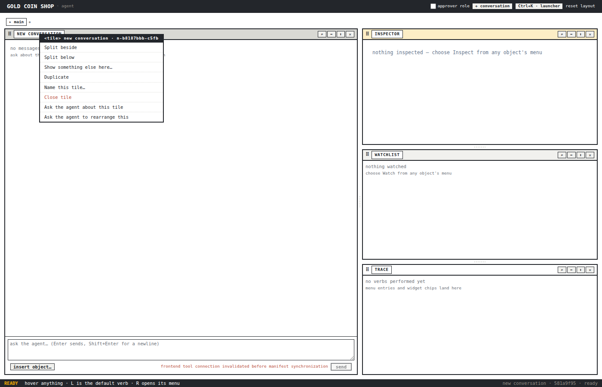
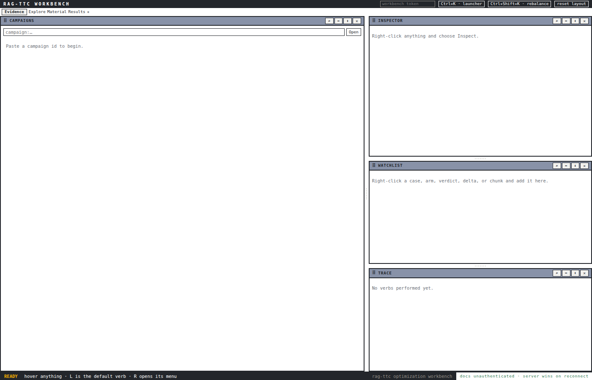
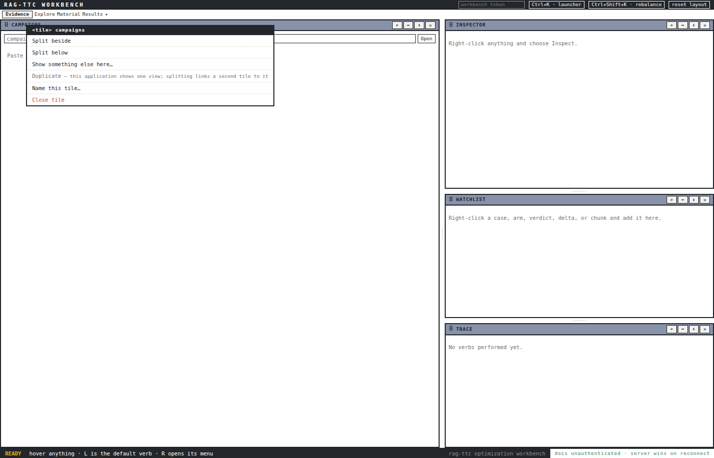
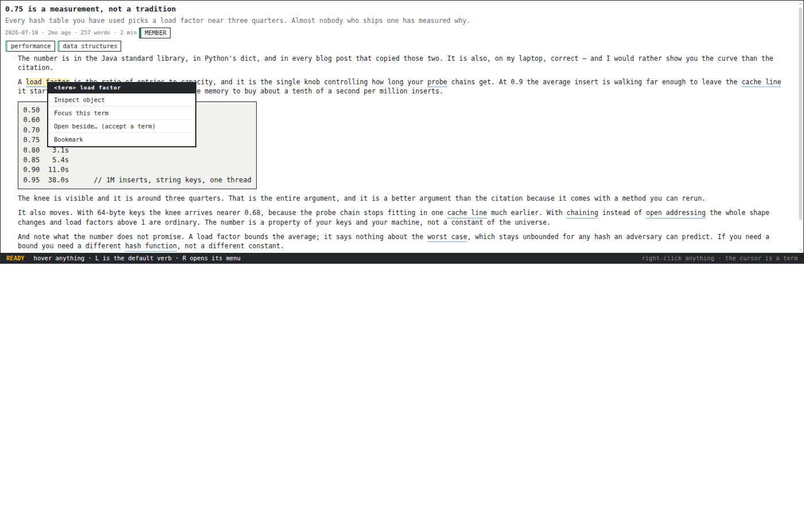

# PBUI Kernel: One Compiled Presentation, Named Fragments, and the Clean Cutover of Every Consumer

This report describes the implementation of PBUI-KERNEL-1, the ticket that replaced pbui's separately assembled presentation registries with one compiled declaration, on 2026-09-02. It covers the problem the ticket solved, the semantic model that was chosen, the eleven-phase plan and how it was cut to eight, the code that landed in `src/presentation/model/`, `relations/`, `acceptance/`, and `context/`, the fragment factories in three shared packages, the migration of seven consumers across three repositories, and the two declaration defects the new compiler found on the way. The purpose is to let a reader understand the system as it now stands well enough to extend it, and to record the decisions and their evidence so the release that follows can be judged against them.

The reader is assumed to know the earlier pbui reports: the action-selection kernel ([[PROJECT REPORT - pbui Action-Selection Kernel and the Post-Legacy Unification]]) and the link kernel ([[PROJECT REPORT - PBUI Linked Tiles - Landing the Binding Algebra in the pbui Workbench]]). This ticket did not change what those kernels decide; it changed how a product tells them what exists.

> [!summary]
> - A product now declares its presentation semantics once: `definePresentation<Values, Environment, Facts, Verb>().create({ include: [fragments], types, knownScopes, descriptors, actions, relations, help, revision })`. Construction validates the whole declaration and throws with the fragment named; the type world is closed.
> - Actions, help, acceptance, and links stay separate interpreters, but they read one graph, one predicate table, one selector, and one relation system. Relations carry an explicit `exposure` naming the interpreters that may discover them.
> - `createPbui` accepts only `{ presentation, contextFor }`, `onRefuse` is required, and the link kernel receives `presentation.linkDeps(...)`. Shared packages export named fragments (`createWorkbenchPresentationFragment`, `createChatPresentationFragment`, `createGeneratedActionsFragment`).
> - Seven consumers migrated: five in-repo packages plus rag-ttc and hyperblog from sibling checkouts. The compiler rejected two real declaration gaps during the migration. One deviation from the design (a derived port-type graph as the link fallback) is recorded as decision C19.

## 1. Project status

The work lives on the pbui branch `task/add-plot-editor` as nineteen commits from `d2ee0c2` (the imported prototype applied) to `de07084` (the audit walked), with matching commits in rag-ttc (`4658ef77`) and hyperblog (`6b5c58f`). Phases 0 through 7 and 11 of the design guide are complete; Phases 8, 9, and 10 were split into PBUI-KERNEL-2, -3, and -4 before implementation started and are not started.

| Gate | Result |
|---|---|
| pbui root | typecheck clean, 368 tests, build, Storybook build |
| pbui-workbench | 281 tests, Storybook build |
| datalab-ui | 554 tests |
| pbui-ecommerce | 35 tests, Storybook build |
| pbui-sandbox | 224 tests |
| pbui-chat | 240 tests (one pre-existing CSS-policy failure that scans workbench CSS modules) |
| pbui-plotscript | 31 tests (one pre-existing timing failure) |
| rag-ttc `apps/workbench/web` | typecheck clean, 167 tests, vite build; committed vocabulary artifact byte-identical |
| hyperblog `ui` | typecheck clean, 28 tests, vite build |

The two external repositories were verified against the local workspace build through pnpm `link:` overrides that were deliberately not committed. The steps that remain are the coordinated 0.11 release of pbui, pbui-workbench, pbui-chat, and pbui-sandbox; version bumps in rag-ttc, hyperblog, and agentlogic; a turboproof upgrade ticket; and the three follow-up tickets.

## 2. The problem

Before this ticket, pbui had four sound interpreters and no single statement of what a product presents. A product built a descriptor registry, a type graph, an action registry over that graph, an optional help registry over the same graph, an array of translators for acceptance, a `snapshotFor` function that hand-built the resolution snapshot, and, if it used the workbench's tile linking, a second type graph plus a relation callback for the link kernel. `createPbui` accepted all of these as separate options.

Nothing checked that the pieces agreed. The action registry and the help registry each compiled their own predicate map from whatever definitions they were given; the acceptance resolver received an empty predicate map, so a conditional translator could not use a product predicate at all. The ecommerce shop built its type graph twice, once for menus and once for links. The chat demo and rag-ttc merged the chat layer's presentation types into their own value vocabulary by hand. Every product invented its own revision convention for the snapshot. And the type graph tolerated undeclared types as isolated nodes, an escape hatch kept alive for one legacy adapter, which meant a product could present a type it had never declared and nothing would say so.

The design guide names the property that was missing: impossible assemblies should be unrepresentable. The list in its §24 is the acceptance test for this ticket, and it is worth quoting in full because every item became a construction-time check:

- actions and help cannot see different predicates;
- links cannot see a different graph;
- a relation cannot silently appear in a persistent palette;
- an undeclared type cannot enter runtime resolution;
- a snapshot cannot omit semantic revision identity;
- a reusable fragment cannot omit its companion type declarations;
- a stale row cannot produce an unobserved no-op;
- a link plan cannot persist a structurally invalid program;
- identity cannot be mistaken for directed following.

The last two items belong to the follow-up tickets. The first seven are what landed.

## 3. Vocabulary

The terms below have exact meanings in the code, and the rest of this report uses them without further definition.

| Term | Meaning |
|---|---|
| Presentation reference | A `{ type, value }` pair. `type` is the runtime dispatch identity; `value` stays in the product's concrete representation. |
| Runtime type | A declared node in the presentation type graph. Abstract nodes organize behavior and serve as relation codomains; they never appear as runtime references. |
| Known scopes | Every scope identifier a declaration may name. Declaration vocabulary. |
| Default active scopes | The inner-to-outer stack a product uses when a query gives none. Convenience. |
| Active scopes | The ordered stack for one resolution. Runtime fact. |
| Selector | The part of a declaration that says where it applies: a subject (one declared type with exact or subtype reach, or every declared type), zero or more scopes, an optional condition, a priority. |
| Relation | A named, typed, contextual partial function from one reference to another, with an exposure. |
| Exposure | Which interpreters may discover a relation: `acceptance`, `facet`, `derivation`. |
| Fragment | A named, atomic contribution of types, known scopes, predicates, descriptors, actions, relations, and help rules. |
| Compiled presentation | The immutable, validated aggregate built from a root declaration and its included fragments. |
| Context input | The one runtime shape a product hands the model: `{ facts, revision?, activeScopes?, modes?, capabilities? }`. |

## 4. The semantic model

### 4.1 Six concepts and one orthogonal one

The guide reduces presentation semantics to six concepts, and the implementation follows that reduction file by file:

```text
presentation semantics
    = types                    actions/typeGraph.ts
    + contextual selectors     context/selector.ts
    + named relations          relations/system.ts
    + contextual contributions actions/, help/
    + binding programs         links/ (KERNEL-2 finishes)
    + sibling interpreters     actions/resolve.ts, help/resolve.ts, acceptance/resolve.ts, links/evaluate.ts
```

Identity is the orthogonal seventh concept, a quotient of compatible ports into logical cells, and belongs to KERNEL-3.

The interpreters are deliberately not unified. Actions compete per action id and choose at most one winner; help accumulates every matching item; acceptance first tries subtyping and then selects or exposes ambiguity among applicable relations; links persist and evaluate binding programs. A universal resolver with a mode flag would make those invariants conditional. What the interpreters share is stopped at the stable primitives: the graph, the predicate registry, the selector, and the relation system.

### 4.2 The closed type world

The most consequential rule is also the shortest: unknown types are errors. Before this ticket, `graph.ancestors("mystery")` returned `[{ type: "mystery", distance: 0 }]`, so an undeclared reference matched an exact rule on its own name and matched nothing else. That behavior existed for one adapter that presented types it never declared. It was also the reason a validated declaration could not guarantee anything: a runtime could always introduce a type the declaration had never seen.

The new graph throws:

```ts
function ancestorsOf(type: RuntimeTypeId): readonly AncestorEntry[] {
  const cached = ancestorCache.get(type);
  if (cached) return cached;
  if (!byId.has(type)) {
    throw new Error(
      `runtime type "${type}" is not declared in the type graph — ` +
        `every runtime type must be declared (closed world, PBUI-KERNEL-1 C9)`,
    );
  }
  ...
}
```

The asymmetry is deliberate. The subject of a query must be declared; an undeclared supertype is merely unrelated, so `graph.isSubtype("file", "mystery")` is `false` and `graph.distance("file", "mystery")` is `Infinity`. An accept request may therefore name a type that turns out not to exist and receive `none` rather than an exception.

Universal matching, which the open world had smuggled in through the `"*"` family subject, became an explicit value:

```ts
export interface AnyDeclaredTypeSubject { readonly kind: "any-declared-type" }
export const anyDeclaredType: AnyDeclaredTypeSubject = Object.freeze({ kind: "any-declared-type" });

export type SelectorSubject =
  | { readonly kind: "type"; readonly type: RuntimeTypeId; readonly match: "exact" | "subtypes" }
  | AnyDeclaredTypeSubject;
```

A family declared on `anyDeclaredType` matches every declared type at distance zero. It still requires the reference type to be declared; the selector checks `graph.has(reference.type)` before anything else.

### 4.3 The selector and its provenance

Actions, help, and relations all answer the same three questions about a declaration and a reference: does the type reach, is a declared scope active, does the condition hold. Before this ticket the action resolver had its own inline path for `"*"` families and the acceptance resolver reimplemented scope and condition logic independently. Now there is one function:

```ts
export function matchSelector(selector, subject, snapshot, graph, predicates): SelectorMatchResult {
  const concreteType = subject.type;
  if (!graph.has(concreteType)) throw new Error(/* closed world */);

  // type: any-declared-type → distance 0, declaredType null
  //       exact             → reject unless equal
  //       subtypes          → graph.distance, reject if infinite
  // scope: empty list → scope null, scopeIndex null (scope-universal)
  //        otherwise  → nearest active declared scope, reject if none
  // condition: evaluate; non-available → reject with the status kind as reason
  return { kind: "matched", match: { declaredType, concreteType, typeDistance, scope, scopeIndex, priority } };
}
```

Two details of the provenance matter downstream. `declaredType` is `null` for a universal subject, and `scope`/`scopeIndex` are `null` for a scope-universal selector. The prototype had used a synthetic `"__unscoped__"` scope at index zero for the second case, which made a scope-universal relation rank as the *nearest* candidate in acceptance. Under the new rule a universal relation makes no nearness claim and ranks behind any relation that matched an active scope (`scopeIndex ?? Infinity`).

Actions and help require explicit scopes as an authoring rule, so they narrow the match with `requireScoped`, which throws if a scope-universal match reaches an interpreter that cannot carry it. The action resolver keeps one subtlety from before: it does not pass the rule's condition to the selector, because a failing action condition is a *status* that stays in the override competition (an unavailable rule still suppresses a less specific fallback), not a rejection.

### 4.4 Relations and exposure

A relation is the one semantic arrow. Acceptance reads it to answer "may this click satisfy that request"; facet derivation (a separate ticket) reads it to merge menus across related types; link derivation reads it to evaluate a persisted `Derived` term. The prototype offered every relation to every interpreter. That is the risk the guide calls overexposure: a convenient acceptance conversion becomes a persistent link operator without anyone deciding so.

The implementation makes exposure a required field:

```ts
export interface RelationExposure {
  readonly acceptance?: boolean;
  readonly facet?: boolean;
  readonly derivation?: { readonly transport: "serializable" };
}
```

`exposure: {}` declares a private relation, legal only as a step of a composition; a private relation no composition names is reported by `diagnostics()` as `unreachable-private-relation`. Discovery is filtered before any relation runs:

```ts
relations.matches(reference, snapshot, { targets: wanted, exposedTo: "acceptance" })
relations.exposed("derivation")   // what a link palette may offer
```

Codomains may be abstract. A relation may promise `party` and return a concrete `customer`; the runtime rejects an abstract *output* (no descriptor could label it), an undeclared output, and an output that does not reach the declared codomain, each with a distinct message. Discovery, however, is by *declared* codomain: a request for `customer` does not find a relation that promises only `party`. This surprised the author of the first model test, and the test now documents both halves of the rule.

Composition is explicit and finite. `{ kind: "composition", id, steps: ["a.b", "b.c"] }` declares a public arrow whose `from`, `to`, and initial match discipline are inferred from its steps; adjacent codomains and domains are checked at construction; cycles are rejected; no path is ever inferred from adjacency.

### 4.5 Scopes and revisions

The prototype and the first guide both conflated a registry's known scopes with a snapshot's active stack. The compiled presentation keeps three things apart. `knownScopes` are merged from every fragment, deduplicated in first-declaration order, and used to validate every contribution and relation. `defaultActiveScopes` is a root-only convenience. `activeScopes` arrive per query in the context input. `snapshot()` validates that the active stack names only known scopes and repeats none.

Revisions are semantic invalidation tokens, never serializations:

```text
revision     = input.revision ?? declaration.revision?.(input.facts) ?? throw
activeScopes = input.activeScopes ?? declaration.defaultActiveScopes ?? throw
```

The guide's argument against a default serializer stands in the code as a thrown error: facts may contain functions, sets, and lazy readers; irrelevant data would invalidate results; relevant external data would be omitted; and the cost would land on every hover. A product that wants a JSON-shaped revision writes one (the chat demo does).

## 5. Architecture



The dependency direction is one way. The model depends on the specialist registry constructors; the specialist interpreters never import React; the link kernel receives only the narrow `LinkDeps` and never the whole model.

The package layout after the cutover:

```text
src/presentation/
├── model/        types.ts define.ts compile.ts vocabulary.ts diagnostics.ts model.test.ts
├── context/      types.ts selector.ts predicates.ts selector.test.ts
├── relations/    types.ts define.ts system.ts system.test.ts
├── acceptance/   types.ts resolve.ts resolve.test.ts
├── actions/      (unchanged interpreter; registry reads a prepared predicate table)
├── help/         (unchanged interpreter)
├── links/        (evaluate.ts now has one relation path; expression.ts and check.ts await KERNEL-2)
└── createPbui.tsx
```

Deleted: `kernel/` (the prototype's aggregate), `translators/`, `relations/adapters.ts`, `context/match.ts`.

## 6. The compiler

`compilePresentation` is about three hundred lines and does the work the guide's §7.2 and §8.1 describe. Its first half merges; its second half validates and constructs.

### 6.1 Merging fragments with origin tracking

```ts
const ordered = [...(declaration.include ?? []), declaration];
for (const fragment of ordered) {
  // duplicate fragment id → throw
  for (const type of fragment.types ?? [])        claim("type", type.id, fragment.id, "runtime type");
  for (const scope of fragment.knownScopes ?? []) if (!knownScopes.includes(scope)) knownScopes.push(scope);
  for (const predicate of fragment.predicates ?? []) claim("predicate", predicate.id, fragment.id, "predicate");
  for (const [type, descriptor] of Object.entries(fragment.descriptors ?? {})) {
    if (Object.hasOwn(descriptors, type)) throw new Error(`descriptor for type "${type}" is declared by fragment "${fragment.id}" but another fragment already declared one — descriptors do not merge`);
    descriptors[type] = descriptor;
  }
  for (const contribution of fragment.actions ?? []) claim("action", contribution.id, fragment.id, "action contribution");
  for (const relation of fragment.relations ?? [])   claim("relation", relation.id, fragment.id, "relation");
  for (const rule of fragment.help ?? [])            claim("help", rule.id, fragment.id, "help rule");
}
```

`claim` records `kind:id → fragmentId` and throws on a second claim naming both fragments. That map is what makes every later diagnostic and every vocabulary entry carry its `fragment`, and it is what the compiler's `originOf(kind, id)` reads.

### 6.2 Closed-world cross validation

After the registries are built, the compiler checks descriptors against the graph in both directions. A descriptor for a type with no node throws ("declare the type in the fragment that owns the descriptor"). A descriptor for an abstract type throws (abstract types never appear as references). A concrete type without a descriptor throws by default; a test fixture may set `strictDescriptors: false` and receive a `missing-descriptor` warning with the owning fragment instead. Production declarations use the strict default.

### 6.3 Diagnostics and vocabulary

Structural errors throw and never produce a model. Advisory findings are collected once: the action registry's potential conflicts and opaque testers, the relation system's unreachable private relations, an included fragment that contributes nothing, and relaxed descriptor completeness. Each carries `severity`, `code`, `message`, `ownerId`, `fragmentId`, and a dotted `path`.

The vocabulary is the static, JSON-serializable projection: types, actions, relations (with exposure), help declarations (as selector subjects), and per-fragment counts, every entry tagged with its fragment. It contains no runtime values, verbs, family instances, or dynamic labels, and it does not claim to know which help *kinds* a rule emits, because those are decided at resolution time.

### 6.4 The link projection

```ts
function linkDeps(options: { contextFor(linkSnapshot): PresentationContextInput<Facts>; label? }): LinkDeps {
  return {
    graph,
    relations: relations.exposed("derivation").map(({ id, from, to, match, label }) => ({ id, from, to, match, ...(label ? { label } : {}) })),
    relationEvaluation: (id, reference, linkSnapshot) => {
      const relationSnapshot = snapshot(options.contextFor(linkSnapshot));
      const result = relations.evaluate(id, reference, relationSnapshot);
      if (result.kind === "empty") return { kind: "empty" };
      if (result.kind === "value") {
        if (!isSerializableReference(result.reference)) return { kind: "error", diagnostic: { code: "relation-result-not-serializable", ... } };
        return { kind: "value", reference: result.reference };
      }
      return { kind: "error", diagnostic: { code: result.code, message: result.because } };
    },
    ...(options.label ? { label: options.label } : {}),
  };
}
```

This is decision C10 in code. A `LinkSnapshot` (document and runtime topology, ports, bindings, identity classes) is not a `SelectionSnapshot`, and the two are not made to inherit. The product supplies `contextFor`, the only layer that can honestly project link-world facts into the facts, scopes, and revision a relation reads, and the projection goes through the same `snapshot()` validator acceptance uses. `empty` is preserved as ordinary partiality; everything else becomes a diagnostic the badge can show.

## 7. The strict runtime

`createPbui` lost its option bag. The final signature:

```ts
export interface CreatePbuiOptions<Values, Environment, Verb, ProductFacts> {
  presentation: CompiledPresentation<Values, Environment, ProductFacts, Verb>;
  defaultEnvironment: Environment;
  contextFor(query: ActionQuery<Values>, environment: Environment): PresentationContextInput<ProductFacts>;
  renderMenuHeader?: (...) => ReactNode;
  helpRenderers?: HelpRendererRegistry;
}
```

Every resolution, for actions, help, acceptance, and the fresh revalidation before `onPerform`, goes through `presentation.snapshot(contextFor(query, environment))`. The instance exposes `presentation` and nothing else that names a registry; pbui-chat, which used to read `pbui.registry`, reads `pbui.presentation.descriptors`.

`onRefuse` is required on the Provider. A displayed menu row is a proposal; when the fresh resolution no longer agrees, the product must decide what the user sees. Before this ticket the refusal was returned from `performAction` and otherwise disappeared. Making the callback required removes silence by omission; a product may pass `() => {}` only with a documented reason, and the demos, datalab, rag-ttc, and hyperblog each chose an explicit handler (console telemetry in all four, which the report's working rules flag as a follow-up for rag-ttc).

Help is enabled by renderers, not by a separate registry. The core Storybook now compiles one presentation with help rules and mounts it twice, once without `helpRenderers` (help off) and once with them.



*The core `WithContextualHelp` story: the actions row is the live resolution of the same declaration the menu uses.*

## 8. Fragments in the shared packages

The guide's sixth correction to the original proposal is that reusable declarations should be named fragments rather than parallel arrays a product must spread correctly. Three packages now export one.

### 8.1 pbui-workbench

`createWorkbenchPresentationFragment<Values, Environment, Facts, Verb>(options)` returns the `tile` type with its descriptor and the six tile menu rules; with `links` it adds the `port` and `link` types, their descriptors, the link rules, and the "Link to…" family on the product's chosen subjects. Two design points came out of the migration itself.

`workspace` is opt-in by descriptor. A product that presents workspace rows (the workspace strip) passes a `workspace` descriptor in the fragment's `descriptors` option and the fragment declares the type; a product that never presents one (rag-ttc) gets no such type. Under strict descriptors a fragment cannot declare a type it does not describe, so the fragment has to be told.

The product verb parameter is unconstrained. The fragment's rules bind `WorkbenchVerb`, so the product's verb union must *admit* it (be a supertype), which TypeScript cannot state as a constraint; the rules are widened on return exactly as `workbenchTileContributions` always was.

The workbench's `LinkEnvironment` became an alias of the narrow `LinkDeps`. Without a product projection, `createLinkHandlers` builds a graph from the value types the applications' ports declare. This is the one recorded deviation and is discussed in §11.

### 8.2 pbui-chat

The chat layer renders eight presentation types of its own (message, run, tool, widget, proposal, traceEntry, source, unresolved) but owns no descriptors for them; how a proposal labels itself is product policy. The fragment is therefore built from the product's descriptors for the chat types it uses:

```ts
export function createChatPresentationFragment(descriptors) {
  const declared = Object.keys(descriptors).filter((type) => chatTypeIds.includes(type));
  // a non-chat key throws
  return { id: "pbui-chat", types: declared.map((id) => ({ id })), descriptors };
}
```

Every described chat type is declared, and no chat type is declared without a descriptor. The `Provider` that pbui-chat wraps around the product's takes `onRefuse` and defaults to a console warning.

### 8.3 pbui-sandbox

`createGeneratedActionsFragment(options)` wraps the generated-actions family (now declared on `anyDeclaredType`) with the `global` scope it lives in. It declares no types: it applies to every declared type of the product that includes it.

## 9. The consumers

Phase 6 migrated in the order the guide gives: in-repo packages first, because they gate the workspace build, then the two external consumers from the sibling checkouts in this workspace.

### 9.1 Inventory

The original guide named agentlogic and turboproof as the external consumers to coordinate. A grep across every repository in the workspace that depends on `@hyperslop-systems/pbui` corrected the picture:

| Repository | pbui | Uses | Role in this ticket |
|---|---|---|---|
| rag-ttc `apps/workbench/web` | 0.9.0 | 41-type graph, 46 rules, 7 translators, help registry, `createPbuiChat`, an accept bridge from outside React, a vocabulary golden freezing every id | Primary external target |
| hyperblog `ui` | 0.10.0 | `define.family("*")` over an empty graph republishing descriptor `actions()`; 4 translators; static revision | The only consumer of the open-world exception |
| turboproof `ui` | 0.6.0 | Pre-kernel descriptor `actions()` deleted in 0.8.0 | Out of scope; own ticket |
| agentlogic `ui` | 0.9.0 | Components and `createWorkbench`/`defineApp` only | Version bump only |

The first pass of that grep missed turboproof because its import and its call sit on different lines; the lesson, recorded in the diary, is to grep for the bare symbol and then read.

### 9.2 pbui-ecommerce

The shop is the reference product because it uses everything. Its runtime compiles two fragments:

```ts
export function createShopPresentation(host, extra = []) {
  return p.create({
    id: "shop.presentation",
    include: [
      createWorkbenchPresentationFragment<Values, Environment, ShopFacts, ShopVerb>({
        links: { links: (snapshot) => snapshot.product.links, subjects: [INSPECTABLE], scopes: ["shop"] },
      }),
      p.fragment({ id: "shop", types: SHOP_TYPES, knownScopes: ["shop", "global"], descriptors: shopDescriptors, relations: createShopRelations(host), actions: extra }),
    ],
    defaultActiveScopes: [...SHOP_SCOPES],
    revision: shopRevision,
  });
}
```

Its three host relations (`order.customer`, `lineItem.product`, `product.category`) are declared once with `exposure: { acceptance: true, derivation: { transport: "serializable" } }`, so accept mode and `Derived` link terms read the same objects. `shopTranslators`, the second `createPresentationTypeGraph(SHOP_TYPES)` for links, and the hand-written `relation` callback are gone; `createShopWorkbench` passes `shop.pbui.presentation.linkDeps({ contextFor: () => ({ facts: { hostRevision: host.revision(), links: null } }), label })`.



*The gold-coin shop on the compiled presentation.*



*An order's menu: the shop's own row, then the two "Link to…" rows the workbench fragment declares on `inspectable`.*

### 9.3 pbui-chat demo

The demo includes the chat fragment for the six chat types it describes and declares its thirteen product types itself; the workbench tile rules ride inside its contribution list through `project`, because the chat layer's tile value is a wire reference rather than a `TileRef`. `row → product` became a canonical acceptance relation. The golden menu tests changed only their import lines: `demoActionRegistry` and `snapshotForDemo` remain as thin aliases over the compiled presentation.



*A tile menu in the chat demo: six rows from the workbench fragment, two from the product, one subject, no ambiguity row.*

### 9.4 datalab-ui

Datalab is frozen (PBUI-DATALAB-1 rebuilds it as a demo), so decision C17 allowed a mechanical migration only. `presentation.ts` compiles the type definitions, the descriptor map, the rule contributions, the `cat → field` relation, and the help rules; the help rules take the action resolver as a factory argument so that the module graph has no cycle. Tests import `datadropActionRegistry`, `datalabHelpRegistry`, and `snapshotForDatalab` from the presentation module. One test flipped: "an unknown presentation type degrades rather than throws" now asserts the closed-world throw.

### 9.5 rag-ttc

rag-ttc was already shaped like the target: one facts type, a composed semantic revision, abstract organizing types (`inspectable`, `citable`, `watchable`), and unconditional translators with frozen wire ids. The migration touched about five files in `src/pbui/`, replaced the `workbenchTileContributions` spread with the fragment, turned `translators.ts` into `relations.ts` with ids unchanged, and made the help rules a factory. The committed `chat/vocabulary.json` is byte-identical afterwards, because its conversions read the same `from`/`to` from the relations.

Two things blocked compilation that had nothing to do with this ticket and everything to do with the version gap: pbui-workbench 0.4 replaced `docBound: true, bindings: [X]` with document-slot ports, and fifteen application declarations plus a catalog-parity test had to move to `ports: [documentSlotPort(X, ...)]`, `documentSlots(app)`, and `isDocBound(app)`.





*rag-ttc on the local pbui build; the campaigns tile menu with "Duplicate" unavailable and explaining itself.*

### 9.6 hyperblog

hyperblog is the interesting small case. Its runtime bridged descriptor `actions()` callbacks into the kernel through a `define.family("*")` over `createPresentationTypeGraph([])`: no declared types at all, every reference an isolated node. The migration declares its ten types from the descriptor map's keys, puts the family on `anyDeclaredType`, turns four translators into acceptance-exposed relations, and keeps the static revision as `contextFor: () => ({ facts: {}, revision: "static" })`. Its reader app's `docBound` became a document-slot port, and `vite.config.ts` gained `resolve.dedupe` for React, without which a linked pbui brings a second React copy and every hook throws.



*A term's menu in hyperblog, resolved through the bridge family on `anyDeclaredType` over the now-closed graph.*

## 10. What the compiler found

Two declaration defects surfaced during the migration, and both are the kind the guide predicted.

In ecommerce, the compiler refused `runtime type "workspace" is declared by both fragment "pbui-workbench" and fragment "shop"`. The shop's own type list and the first version of the workbench fragment both declared it. The fix was not to delete one line but to decide who owns the type, which produced the opt-in-by-descriptor rule in §8.1.

In rag-ttc, the compiler refused `descriptor for type "unresolved" has no node in the presentation type graph`. The product had described `unresolved`, the chat layer's fallback type for a mention that resolves to nothing, for as long as it had used pbui-chat, and had never declared it. The open world had let it through as an isolated node. It is a chat-layer type, so it now enters through the chat fragment, which is what decision C18 was for.

## 11. Deviations from the design text

The guide's §20.2 asks for no empty-graph fallback in the workbench: a link-enabled workbench should receive its graph from the product's compiled presentation. The first implementation threw at construction whenever any application declared ports and no `links` was given. That is the letter of the rule, and it broke about a hundred and eighty pbui-workbench test and story sites that mount demo applications without any product presentation.

The replacement, recorded as decision C19, derives the fallback graph from the value types the applications' ports declare, as isolated nodes with no relations and no evaluator:

```ts
function declaredPortGraph(apps: AppRegistry) {
  const ids = new Set<string>();
  for (const app of apps.list()) for (const port of app.ports ?? []) ids.add(port.contract.valueType);
  ids.delete("any");
  return createPresentationTypeGraph([...ids].map((id) => ({ id })));
}
```

This is not an empty graph, every declared port type is a real node, so the closed world holds and `reaches` never sees an undeclared type. It invents nothing: only equal type ids reach. What it cannot express is subtyping, which is exactly the case where a product must pass `presentation.linkDeps`, the graph its menus already use. A `Derived` term evaluated under the fallback yields a visible `relation-missing` diagnostic. The guide's §20.2 now carries this as a marked item, and the diary flags it for a second reader.

Two smaller departures are worth stating. `RelationEvaluation` keeps the field name `match` for its selector provenance where the guide's sketch says `provenance`; the shape is the same. And the workbench fragment's verb parameter is unconstrained rather than `Verb extends WorkbenchVerb`, because the constraint was backwards (the product's union must admit the workbench's verbs, not extend them).

## 12. Testing

The test strategy follows the guide's §19: existing tests are behavioral fences whose semantic outcomes must survive, and every new law gets a test. The counts above are the result; the new files are:

- `context/selector.test.ts`: the matcher across type, scope, and condition stages, plus universal subject, universal scope, and the closed-world throw.
- `relations/system.test.ts`: exposure filtering before evaluation, private steps reachable only through compositions, orphan diagnostics, abstract codomains with concrete outputs, abstract and undeclared outputs rejected, and the outcome kinds `value`/`empty`/`unavailable`/`error` kept distinct.
- `model/model.test.ts`: fragment merge with origin, duplicate and conflicting declarations naming both fragments, closed-world cross validation, snapshot resolution and validation, strict versus relaxed descriptors, the universal family, and the link projection.
- `acceptance/resolve.test.ts`: the ACTIONS-2 matrix over relations plus abstract requests, exposure, and universal ranking.

Screenshots were taken with Playwright at 1400×900 against vite and Storybook dev servers for every migrated consumer; each page's console showed only favicon 404s and, where a Go backend was absent, 502s from its proxied API. The images and an index live in the ticket's `various/screenshots/` and are reproduced above.

## 13. Working rules

These are the rules the implementation settled and that any further pbui product work should follow.

- Declare once. A product has one `definePresentation().create(...)`; shared packages contribute fragments the product includes. Do not build a registry outside it.
- Every runtime type is declared. If a reference can appear on screen, its type is in a fragment and has a descriptor. The compiler enforces this; do not relax `strictDescriptors` outside a test fixture.
- A relation says who may see it. `exposure` is required; `derivation` requires the serializable transport; a private relation exists only as a composition step.
- Revision is a semantic token the product computes from the facts rules read. Never serialize facts to make one.
- `contextFor` is the only bridge from product state to resolution. Rules read `snapshot.product` and nothing else.
- Help rules that show actions take the resolver as a factory argument, so the module that compiles the presentation can own both without an import cycle.
- Links receive `presentation.linkDeps({ contextFor })`. A product whose ports rely on inheritance must pass it; the derived-port fallback is for workbenches without a product presentation.
- `onRefuse` is a product decision. Console telemetry is acceptable for demos; a product with a status line or a trace should route refusals there.

## 14. Open questions and next steps

The release steps are mechanical but not done: publish pbui, pbui-workbench, pbui-chat, and pbui-sandbox together as 0.11; bump rag-ttc, hyperblog, and agentlogic; remove the pnpm `link:` overrides that verified the two external repositories (they exist only in working trees). A turboproof ticket should take that repository from 0.6.0 straight to the compiled model in one move.

The three split-out tickets start from prototype code already in the tree. KERNEL-2 owns the binding-program IR and static checker (`links/expression.ts`, `links/check.ts` landed with the patch but evaluation does not yet run on them). KERNEL-3 owns the identity quotient and the factorization of port contracts into value and protocol projections. KERNEL-4 owns the activation-outcome function, the request-identified accept machine, refusal presentation, and introspection under a disclosure policy, with the constraint that `pbui.accept` must remain callable from outside React, because rag-ttc's verb sink late-binds it.

Two questions remain open. Whether C19's derived-port fallback should stay once every product passes `linkDeps`, or whether the workbench's own stories should build a small presentation of their own. And whether facet derivation (PBUI-FACETS-1), which now must consume `relations.exposed("facet")`, needs metadata on the facet exposure beyond a boolean.

## 15. Files to read first

- `src/presentation/model/compile.ts`: the compiler, top to bottom.
- `src/presentation/context/selector.ts` and `context/types.ts`: the selector and its provenance.
- `src/presentation/relations/system.ts`: exposure, discovery, evaluation, composition.
- `src/presentation/acceptance/resolve.ts`: acceptance over relations.
- `src/presentation/createPbui.tsx` lines 56–90 and 360–380: the strict options and the engine reads.
- `packages/pbui-workbench/src/actions.ts` (the fragment) and `links/handlers.ts` (the projection and C19).
- `packages/pbui-ecommerce/src/presentation/runtime.tsx` and `createShop.ts`: the reference consumer.
- The design guide `design-doc/02-clean-cutover-…md` §0.1, §3.13.1, §17 C16–C19, §20; and the diary `reference/01-investigation-diary.md` Steps 4–12.

## 16. Conclusion

The ticket set out to make impossible assemblies unrepresentable, and the evidence that it did is not the test count but the two declarations the compiler refused: a type two fragments both claimed, and a type a product had described for months without declaring. Both were invisible under the old assembly and both are now construction errors with the fragment named. Everything else in this report, the selector, the exposure metadata, the fragments, the strict runtime, the link projection, exists to make that kind of refusal possible while leaving the four interpreters' laws exactly where the earlier tickets proved them.

## Related notes

- [[PROJECT REPORT - PBUI Linked Tiles - Landing the Binding Algebra in the pbui Workbench]]
- [[PROJECT REPORT - pbui Action-Selection Kernel and the Post-Legacy Unification]]
- [[PROJ - PBUI Workbench Tiles - A Reusable Server-less Shell and the Chat Agent on Tiles]]
- [[PROJECT REPORT - RAG-TTC PR 8 - Building an Authorized Durable RAG Experiment Workbench]]
