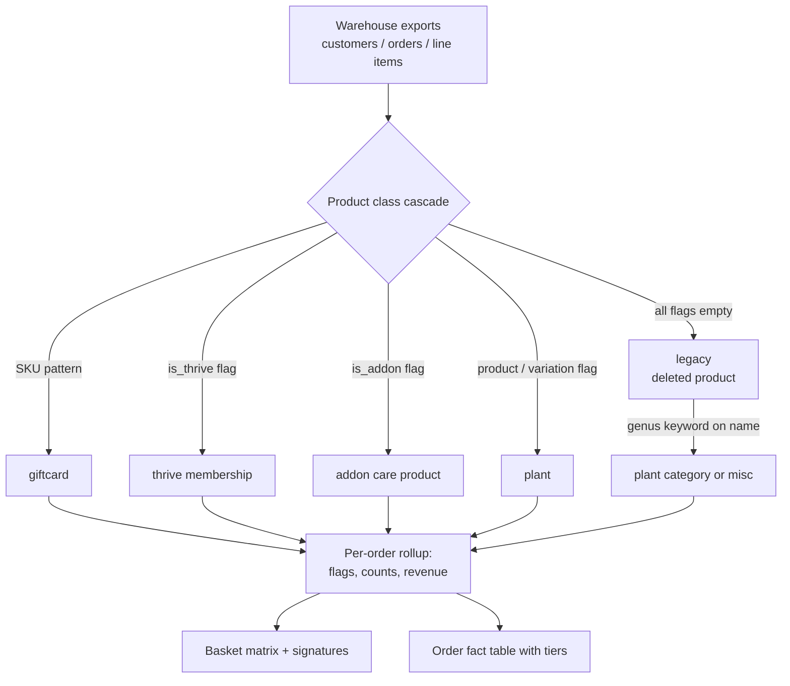
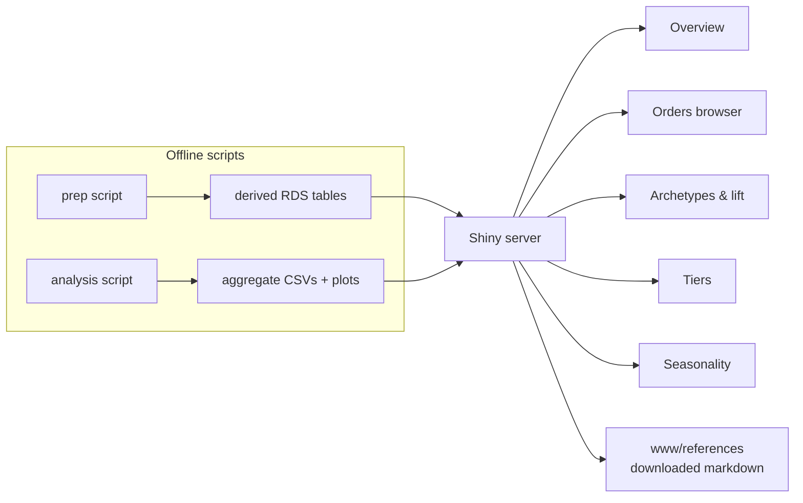

# TTC Customer Clustering

This report documents a customer-segmentation project for thetreecenter.com: what was asked for, what the data actually supported, how an order-grain baseline segmentation was built on top of a WooCommerce dbt warehouse, and how a Shiny application turned the analysis into something a marketing team can explore and interpret on its own. The report is written so that a reader who has never seen the repository can reconstruct the reasoning — not just the results — from the data model up through the clustering mathematics to the application architecture.

> [!summary]
> - The provided CSV exports contained order-grain data with no customer key and only a filtered slice of the catalog; the real customer-grain dataset had to be requested from the TTC dbt warehouse.
> - A product-classification cascade (giftcard, membership, addon, plant, legacy) had to be derived from data inspection, because the warehouse's product flags are unreliable for deleted products.
> - The analysis pipeline produces basket signatures, conditional attach rates, pairwise lift, k-means order tiers, and seasonality distributions; every statistic is recomputable within a selectable time window in the companion Shiny explorer.

## Why this project exists

The request was to cluster customers. The initial attachment was a set of CSV exports in a `data/` directory: a market-basket export of order line items, an order-split fulfillment export, and an order-item metadata export. Inspection established two facts that reframed the entire project.

First, none of the exports carried a customer identifier. The finest join key available was the order number. Every analysis possible with the attached data alone would segment *orders*, not customers.

Second, the market-basket export was not the catalog. It contained only a small, curated set of products — care-product addons, the Thrive membership subscription, and a handful of trees and merchandise items. An order containing a tree plus a root stimulant would appear in that file as an order containing only the stimulant, because the tree lines were never exported. Any product-mix conclusion drawn from that file alone would have been structurally wrong.

The resolution was not to work around the exports but to go to their source. TTC maintains a dbt project over the WooCommerce database, and that warehouse contains customer-keyed models: a customer dimension built from user metadata, an order fact table that carries both the billing email and a customer identifier, a full line-item table with cost and product flags, and a subscription table. The project therefore acquired a second track: specify the exports needed for customer-grain work, and — while those were being produced — build the strongest possible *order-grain* baseline that would later become the vocabulary and validation target for customer-level clustering.

This report covers that baseline, the toolchain work it required, and the Shiny explorer that exposes it.

## Project shape

The repository is organized so that every stage of the pipeline is a standalone script with a numbered prefix:

| Path | Role |
|---|---|
| `scripts/01-explore.R` | Exploratory profiling of the originally provided CSVs |
| `scripts/02..05-export-*.sql` | Warehouse export requests (customers, orders, full line items, subscriptions) |
| `scripts/06-tier-a-prep.R` | Classification, per-order rollup, basket matrix; writes `derived/*.rds` |
| `scripts/07-tier-a-analysis.R` | Signatures, attach rates, lift, k-means tiers, seasonality; writes `output/` |
| `app.R` | The Shiny explorer |
| `ttmp/…/customer-clustering…` | docmgr ticket: analysis doc, investigation diary, changelog |
| `www/references/` | Reference pages downloaded as markdown, served by the app |

Raw exports live under `data/` and derived tables under `derived/`; both are gitignored because they contain personally identifying information. Aggregate outputs under `output/` contain no row-level data and are committed. The investigation diary in the ticket records every step, including failures, with verbatim error text.

## The data model

### From exports to a single order-grain table

The prep script joins three warehouse exports into one row per *parent* order. Two design decisions matter here.

The first is the order key. WooCommerce orders in this warehouse can be split into multiple shipments, and split children carry suffixed order numbers. The dbt `orders` model already rolls split children up to their parent order number, and the line-item export carries a split-source identifier that resolves to the parent. Joining on the parent means a basket is counted once, not once per shipment. A validation pass confirmed that essentially all completed orders join to line items, and that nearly all line items resolve to a billing email — the small residue are orders whose items reference nothing classifiable.

The second is the analysis population. Only completed orders enter the baseline. The status distribution of the full order table is dominated by completed orders anyway, and mixing cancelled or refunded orders into attach-rate and tier statistics would blur exactly the purchasing behavior the segmentation is meant to isolate. Refund-*adjusted* totals still flow through as an order attribute, which is how the analysis later surfaced a refund-heavy order bucket that is a data-quality phenomenon rather than a marketing segment.

### The product classification cascade

The line-item export carries product flags from the warehouse: addon, membership, product, variation. Left alone, these flags silently misclassify a substantial share of lines, and the reason is a warehouse property worth stating precisely: the flags are derived from a join against live product posts. When a product has been deleted from the store, the join finds no post, and every flag comes back empty. Deleted products are not rare legacy debris in this dataset; they are a meaningful slice of historical sales, and their *names* are still present on the line items.

The classification therefore runs as a cascade, in an order chosen so that each class is decided by its most reliable signal:

```r
product_class = case_when(
  is_gc_line                          ~ "giftcard",  # by SKU/name pattern
  is_thrive == 1                      ~ "thrive",
  is_addon == 1                       ~ "addon",
  is_product == 1 | is_variation == 1 ~ "plant",
  TRUE                                ~ "legacy"     # deleted products
)
```

Giftcards are detected by SKU prefix rather than by flags, because giftcards are published as ordinary products and would otherwise land in the plant class. Legacy lines — the deleted products — are retained as a distinct class and then classified by the same plant-genus keyword matcher used for live plants, applied to the product's parent name. The cascade embodies a rule that generalizes: when flags are produced by a join that can fail, classify by the failure mode you can detect, and never let an empty flag mean "none of the above" silently.

Plant categories come from keyword matching on genus names (maple, spruce, hydrangea, arborvitae, and so on). This is deliberately coarse. The alternative — a taxonomy export joined on product identifiers — is the right long-term answer, and it is listed as a follow-up, but it requires another warehouse request. Keyword classification over parent names is available immediately, is stable for the dominant categories, and makes the classification logic auditable in a single screen of code.



### The basket matrix

From the classified line items, the prep stage pivots to a binary matrix: one row per order, one column per basket dimension, value one if the order contains that dimension. The dimensions are the frequent addon types, the frequent plant categories, a miscellaneous-plant bucket, and the membership flag. Rare addons and rare plant categories collapse into catch-all buckets so the matrix stays small and every column carries enough support to be interpretable.

The *signature* of an order is the sorted concatenation of its present dimensions. Signatures make basket composition countable: instead of clustering half a million binary vectors blind, you first enumerate the combinations that actually occur and their frequencies. In this data the frequency distribution is steep — a modest number of signatures cover the overwhelming majority of orders — and the leading signatures are almost all single-category plant orders, with care-product and membership combinations filling the remainder.

## Basket statistics

### Support and conditional attach rates

Support is the empirical probability that an order matches a signature. The attach rate of an addon to a plant category is a conditional probability: the share of that category's orders that contain the addon. The interesting quantity is the *difference* between the conditional rate and the unconditional base rate, because that difference is what tells a marketing team which categories accept upsells.

The attach-rate analysis produced one finding that has held up across every later view of the data: maple buyers attach care products — and warranties, and the membership — at a markedly higher rate than buyers of privacy-screen evergreens like arborvitae. Ornamental collectors behave differently from hedge builders, and the difference is visible before any model is fit.

### Pairwise lift

Lift compares observed co-occurrence to independence:

$$\mathrm{lift}(A,B) = \frac{P(A \cap B)}{P(A)\,P(B)}$$

A lift of one is independence; values above one indicate positive association. The strongest signal in this dataset is between the organic-care addons: buyers of one care product are several times more likely to buy another than independence would predict. The practical output for the business is a short list of pair rules with both the lift and its support, because lift on a nearly-unsupported pair is noise — the classic failure of association-rule mining on rare items, which is why the explorer enforces a minimum-support slider before showing lift rankings.

Computing lift for all dimension pairs naively means scanning the basket matrix once per pair. The reactive version in the explorer computes all pair counts in a single matrix product:

```r
M  <- as.matrix(basket[, dims])   # binary matrix, filtered window
ct <- crossprod(M)                # all pairwise co-occurrence counts
pa <- diag(ct) / nrow(M)          # marginal rates
```

The matrix product is both faster and, more importantly, correct by construction — every pair is computed from the same filtered population. The bug this replaced is instructive: the dimension list initially included the signature's character column, so `as.matrix()` produced a character matrix and the product failed with a type error. The lesson is to assert the storage type of a matrix the moment it crosses from data-frame land to linear-algebra land.

## Order tiers

The tier analysis clusters orders on a small feature vector: log order value, line count, quantity, addon count, and binary indicators for membership, warranty, and discount presence. Features are z-scored before clustering because they live on incommensurate scales; without standardization the distance would be dominated by whichever feature happens to span the widest numeric range.

The algorithm is k-means, which minimizes within-cluster sum of squares around centroids. Two properties of the estimator matter for interpretation. It finds a local optimum, so the fit uses multiple random restarts. And it produces spherical clusters whether or not the data are spherical, so the number of clusters is chosen by average silhouette rather than by the within-cluster sum alone. The silhouette of a point compares its mean distance to its own cluster against its mean distance to the nearest other cluster; values near one indicate well-placed points, values near zero indicate boundary points.

Silhouette requires pairwise distances. On the full order population that distance matrix does not fit in memory — the naive attempt fails with an allocation error three orders of magnitude beyond the machine's capacity. The estimator therefore computes silhouette on a random sample of the population, which is accurate to well within the resolution that matters for choosing among candidate cluster counts. Sampling for a statistic whose standard error shrinks with sample size is standard practice; the failure mode worth remembering is that the *full* matrix is not merely slow, it is infeasible, and the error message arrives as an allocation failure rather than as a statistics problem.

The resulting tiers have interpretable profiles, and the naming reflects profiles rather than cluster boundaries: core orders, addon-heavy orders, membership orders, bulk and landscaping orders at increasing scales, and a residual bucket of refund-adjusted near-zero-total orders that exists in the data rather than in the business. Two tiers can share a name because they reach the same profile by different routes — many moderate lines versus few lines with large quantities — and the explorer's glossary spells out the distinction per tier rather than leaving it implied by the label.

## Seasonality as conditional distributions

The seasonality views normalize each row — archetype or plant category — to a distribution over months. Row normalization answers the question the analysis is actually asking: *given* that a customer bought a dogwood, in which months did that happen? Raw counts would instead answer a volume question, in which the largest categories dominate the color scale regardless of when their sales occur. Every row integrates to one, so seasonal shapes are comparable across categories of very different size.

Read this way, the heatmaps show the planting calendar: plant archetypes concentrate in the spring and fall shipping windows, care-product-only orders spread more evenly through the seasons, and membership signups concentrate around first plant purchases. The membership table in the warehouse carries creation and cancellation timestamps, so the same conditional-month view extends to signup seasonality without touching the order tables.

## The Shiny explorer

### Architecture

The explorer reads the derived tables produced by the prep and analysis scripts, never the raw exports. This keeps personally identifying fields out of the application process entirely — the rendered interface shows order numbers, dates, amounts, and labels, but no emails, names, or addresses.



The application is organized around one global time filter in a sidebar: all time, a single calendar year, or an arbitrary month range. A single reactive computes the date window, and a second reactive materializes the filtered order population. Every tab's statistics — indicator values, archetype counts, signature tables, attach rates, lift, tier statistics, seasonality distributions, membership signups — derive from that one filtered population, so all views are consistent with each other by construction. Tier *assignments* remain those of the all-time clustering, while tier *statistics* recompute within the window; the sidebar states this explicitly so the distinction is not discovered by surprise.

The Orders browser is server-side DataTables over a capped random sample of the filtered population, with the exact summary line computed on the full filtered set before sampling. Filtering is a debounced reactive rather than button-gated: an event-gated table starts life empty because an event reactive evaluates nothing until its event fires, which is precisely the bug that originally left the tab blank on load.

### Documentation inside the application

Three documentation layers ship in the app itself. Every tab carries a mathematics panel — rendered formulas for support, conditional attach, lift, z-scoring, the k-means objective, the silhouette statistic, and the row-normalized conditional distributions behind the seasonality heatmaps — each with interpretation guidance and the caveats that matter for this dataset, such as lift inflation on rare pairs. Every tab carries a label glossary explaining the tier names, archetype names, and signature naming convention, including per-tier plain-language profiles. And the reference links point both to the original sources and to local markdown copies downloaded into the application's static directory, so the documentation survives link rot and works offline.

The glossaries are hand-written from the current clustering solution and marked as such in the code. This is a deliberate trade: static text is readable and reviewable, and regenerating it from cluster statistics is a small follow-up script whenever the clustering is re-fit, rather than a reason to leave the labels unexplained.

### Failure modes encountered

The explorer's development log doubles as a catalog of Shiny failure modes, each verified and fixed:

| Failure | Mechanism | Fix |
|---|---|---|
| Empty orders tab on load | Event reactive never evaluates before first button click | Plain reactive with debounce |
| Lift tab type error | Character column leaked into the numeric basket matrix | Exclude non-numeric columns; assert storage type |
| Empty time-filtered views | Date-range input with no default end date parses to a missing value, and comparison against it filters everything | Explicit default end plus a missing-value guard |
| DataTable polling an empty response | Application restart invalidates browser session tokens; the data endpoint returns an empty body for unknown sessions | Reload the page; the diagnosis is documented so the symptom is recognizable |

Each of these presents to a user as a silently broken view. None produce an error message in the interface. The general lesson is that reactive programming errors surface as absence — a blank plot, an empty table, a count of zero — and the fastest diagnosis is to test the exact failing request against a fresh session before touching application code.

## Toolchain work

The analysis stack required Bayesian tooling — Stan through cmdstanr, NIMBLE, bayesm, and a latent-class package — plus scikit-learn on the Python side. Most of these failed to install initially, and the failures had a common shape: the machine's system libraries had moved past the versions the prebuilt R packages were compiled against, and the box has no administrative package installation. The repairs were all user-local: rebuilding the string-processing library from source against the current ICU; supplying a compiler toolchain and headers through a user-space package manager; and creating local library symlinks plus make-variable additions so the R build system could find system numerical libraries that the user-local linker could not resolve by itself.

This work is recorded in the diary because it is the kind of knowledge that decays: the error messages point at the packages, the causes live in the system libraries underneath them, and the fixes are invisible once applied. The installed stack passes an end-to-end smoke test — a trivial model compiles and samples — which is the level of verification that matters before trusting an install for real work.

## Current project status

The order-grain baseline is complete and explored through the application. The warehouse exports that enable customer-grain work have landed and been validated: the join keys hold, the full catalog is present in the line-item export, and customer-key coverage is essentially complete. The subscription export is available for membership churn work.

## Open questions

- How should deleted products be handled at the *warehouse* level? The line-item flags depend on a join to live posts; a product-existence dimension in the dbt models would remove the need for the legacy class heuristic.
- Does the customer dimension export drop users with missing address metadata? The customer model joins user metadata with inner joins, and the distinct-email gap between the order and customer exports suggests some users are absent from the customer table.
- Will a full product-category taxonomy export replace genus keyword matching, and how much do the coarse categories distort the miscellaneous-plant bucket?

## Near-term next steps

- Build the customer feature table: recency, frequency, monetary value, addon attach, membership status, warranty usage, and category mix per customer.
- Fit the customer-grain segmentation — mixture models and latent-class analysis are installed and smoke-tested — and evaluate it against the order-grain vocabulary established here.
- Reuse the explorer shell for a customer-grain explorer, including the same mathematics panels and glossary treatment.
- Extend the membership work toward renewal and churn cohorts using the subscription table's status and cancellation timestamps.

## Key points

- No customer key existed in the initial exports; identifying that fact early redirected the project to the warehouse rather than into an analysis of the wrong grain.
- Product flags produced by joins to live posts fail silently for deleted products; the classification cascade detects the failure mode and reclassifies by name.
- Signatures make basket composition countable before it is clusterable; the signature frequency table is both the baseline and the interpretability anchor for every later model.
- Lift requires support thresholds, silhouette requires sampling at this population size, and row normalization is what makes seasonality comparable across categories.
- In reactive applications, errors present as absence; verify the failing request against a fresh session before changing code.
- Documentation that lives inside the tool — formulas, glossaries, local reference copies — reaches people who will never read the repository.

## Important project docs

- Ticket workspace with analysis doc and full investigation diary: `ttmp/2026/09/03/customer-clustering--customer-clustering-analysis-for-thetreecenter-com/` in the project repository
- Cluster approach design doc: `analysis/01-customer-clustering-approach.md` in the same ticket
- Warehouse models the exports derive from: `~/code/ttc/ttc/sql/dbt/models/`

## Project working rule

Every analytical claim in this project traces to a script in `scripts/` or a table in `output/`, and every script failure that changed the design is recorded verbatim in the ticket diary. New work on this repository should start from the diary, extend the numbered script sequence, and keep raw data out of version control.
