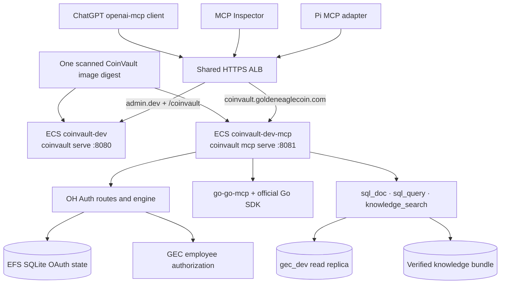
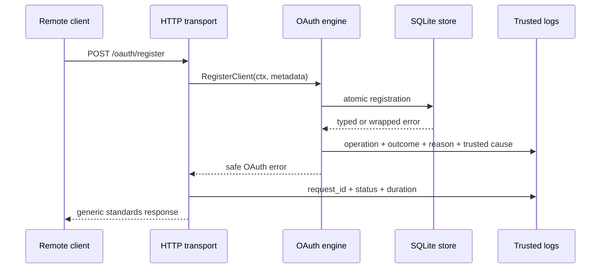
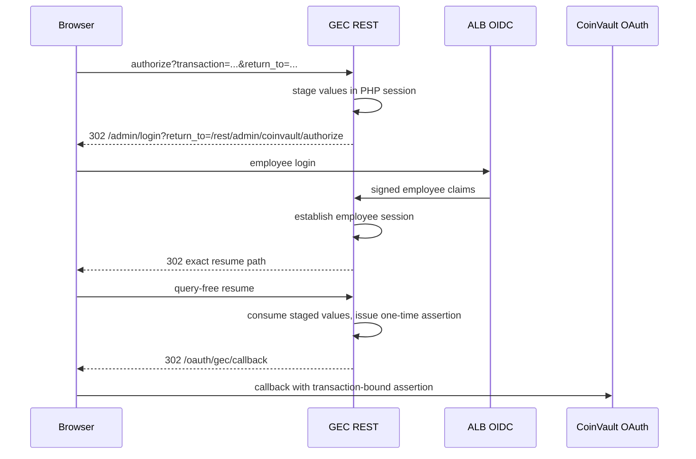
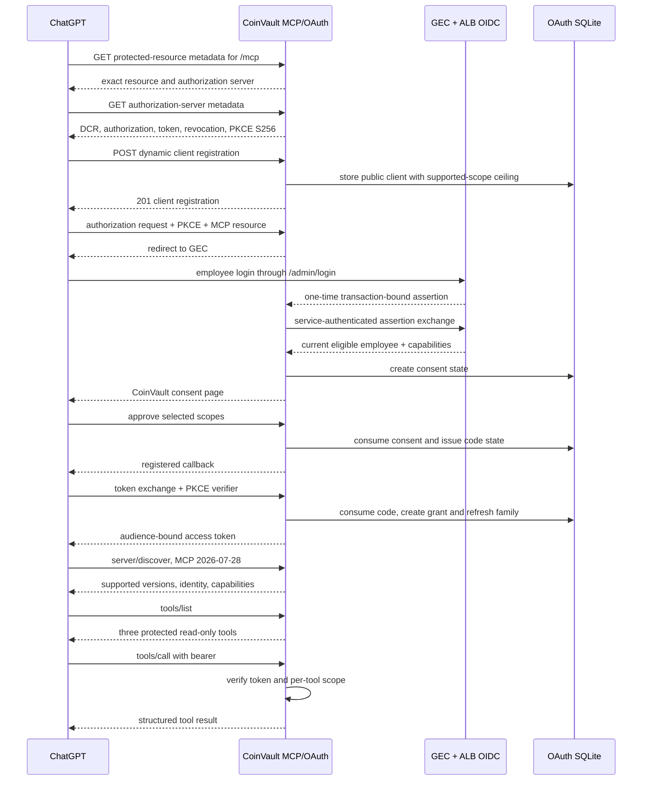

# CoinVault MCP: From Local Conformance to ChatGPT 2026-07-28

CoinVault now runs as an OAuth-protected remote MCP server at `https://coinvault.goldeneaglecoin.com/mcp`. ChatGPT dynamically registers an OAuth client, authenticates an employee through the Golden Eagle Coins development environment, obtains an audience-bound token, discovers the server through MCP `2026-07-28`, imports three read-only tools, and can invoke them with the employee's authorized scopes.

The final result looks compact because the public interface is compact. The implementation spans three Go modules, one PHP application, two ECS services, an ALB, Route 53, EFS-backed OAuth state, SSM-delivered secrets, a development Aurora reader, and a verified knowledge bundle. Most failures did not occur in the core OAuth or MCP algorithms. They occurred where independently correct systems disagreed about metadata locations, omitted fields, browser security policy, HTTP forwarding, login entry points, context propagation, or protocol generations.

This report reconstructs that work as a technical analysis. It begins where the earlier [[PROJECT REPORT - CoinVault Remote MCP - Official Go SDK and Employee OAuth Authorization]] ended: the official Go SDK migration and employee authorization model existed, but hosted ChatGPT acceptance did not. The focus here is the sequence that converted that design into a deployed, diagnosable, interoperable service.

> [!summary]
> - **Acceptance was staged by boundary.** Loopback transport, deterministic OIDC, real domain tools, Pi, public metadata, OAuth, GEC login, MCP Inspector, and ChatGPT were tested separately before their evidence was combined.
> - **Secret-safe observability made progress possible.** Generic public errors remained generic, while typed internal events exposed SQLite schema drift, GEC service-auth failures, consent CSP behavior, MCP method names, response status, content type, and protocol generation.
> - **The hosted service required exact identity contracts.** Issuer, MCP resource, callback, protected-resource metadata path, client scope ceiling, token audience, and GEC return path had to agree exactly.
> - **The last ChatGPT blocker was protocol generation, not OAuth.** ChatGPT sent sessionless `server/discover` with MCP `2026-07-28`; the server was configured for stateful legacy negotiation. Stateless Streamable HTTP enabled the modern discovery path.
> - **Authorization was enforced twice.** OH Auth issued only scopes permitted by client, resource, employee capabilities, and consent. go-go-mcp then enforced each required scope at decoded tool dispatch.

## 1. The acceptance problem

The initial implementation already had the principal components: an official-SDK Streamable HTTP server, an OAuth state machine, a GEC employee capability authority, and canonical CoinVault tools. That was not enough to claim ChatGPT compatibility. A remote host exercises behavior that a package test does not cover:

1. It locates protected-resource metadata at a path derived from the resource URL.
2. It discovers authorization-server metadata and Dynamic Client Registration.
3. It supplies its own public callback and may omit optional registration fields.
4. It drives a browser through a second site's login mechanism.
5. It follows consent redirects under browser CSP enforcement.
6. It chooses an MCP protocol generation independently of the server.
7. It interprets tool descriptors and enforces its own action-import rules.

The acceptance plan therefore treated each layer as an independent contract. A failure at `/oauth/register` was not debugged as an MCP failure. A failure after an authenticated `/mcp` request was not treated as proof that token issuance was wrong. This discipline reduced the number of plausible causes at each step.

### 1.1 Exact deployed identity

The deployed values form one security contract:

| Purpose | Value |
| --- | --- |
| OAuth issuer | `https://coinvault.goldeneaglecoin.com` |
| MCP resource and audience | `https://coinvault.goldeneaglecoin.com/mcp` |
| Protected-resource metadata | `https://coinvault.goldeneaglecoin.com/.well-known/oauth-protected-resource/mcp` |
| Authorization metadata | `https://coinvault.goldeneaglecoin.com/.well-known/oauth-authorization-server` |
| OAuth callback into CoinVault | `https://coinvault.goldeneaglecoin.com/oauth/gec/callback` |
| Employee login and authority | `https://admin.dev.goldeneaglecoin.com` |
| Database | `gec_dev` through `gec_dev_ro` |
| Durable OAuth state | `/state/mcp/oauth.sqlite` on development EFS |

The stable hostname is backed by development infrastructure. That distinction is deliberate. The hostname gives MCP clients a stable issuer, while the database, employee identity, service bearer, signing key, and OAuth state remain development-owned. Production cutover must create production state and require reauthorization rather than promoting development refresh-token families.

## 2. Architecture at acceptance

CoinVault uses one immutable image digest across two ECS services. The browser service and MCP service execute different commands, expose different ports, mount different routes, and receive different secrets.



The host-only ALB rule is important. OAuth metadata, registration, authorization, consent, token, revocation, callback, JWKS, health, and MCP all share the issuer origin. A rule restricted to `/mcp` would make the transport reachable while leaving OAuth incomplete.

### 2.1 Repository responsibilities

| Repository | Responsibility |
| --- | --- |
| `coinvault` | Runtime composition, canonical tools, GEC adapter, resource policy, MCP lifecycle logs, AWS image |
| `oh-auth` | OAuth transitions, DCR, PKCE, consent, token issuance, refresh, revocation, SQLite store, correlation |
| `go-go-mcp` | Official SDK adaptation, Streamable HTTP, token propagation, tool metadata, decoded-dispatch authorization |
| `goldeneaglecoin.com` | Employee login, capabilities, authorization version, one-time assertions, service-authenticated principal lookup, AWS infrastructure |

The separation prevents one subsystem from becoming an accidental source of authority. GEC decides current employee capabilities. OH Auth calculates an OAuth grant. CoinVault maps the verified grant into its domain policy. go-go-mcp rejects a tool call if the request's token metadata lacks the tool's required scope.

## 3. Local proof before hosted debugging

The first successful evidence came from local processes. The loopback server established the official SDK transport independently of OAuth. A direct client initialized MCP, listed `connector_status`, and called it through the real `/mcp` handler.

The first bundled smoke attempt failed with:

```text
MCP smoke list tools: knowledge_search is not registered
```

That failure was a test mismatch. The Phase 1 server intentionally had no domain registry, while the smoke client required `knowledge_search`. Direct protocol requests proved the transport without weakening the phase boundary.

The next harness built a production-shaped local topology:

```text
deterministic OIDC issuer
        |
        v
CoinVault external-OIDC verifier
        |
        +-- verified immutable knowledge bundle
        +-- deterministic embedding fixture
        +-- Streamable HTTP /mcp
        |
        v
coinvault-mcp-smoke and Pi
```

The harness proved that a bearer-authenticated client could discover `knowledge_search`, invoke it, receive structured content, and exercise the embedding path. Two independent client connections succeeded against one process. Pi then repeated the path using `directTools: true`, `lifecycle: "eager"`, and `bearerTokenEnv`, which kept the token out of its JSON configuration and command line.

These tests established three facts before AWS work began:

- The MCP transport and canonical tool adapter worked.
- Exact audience and bearer verification worked with a deterministic issuer.
- `knowledge_search` returned evidence-bearing structured content through a real agent client.

## 4. Deploying a stable public MCP service

The public hostname already resolved through wildcard DNS and was covered by the wildcard ACM certificate. Before deployment, it returned the shared ALB's fixed 503 because no listener rule claimed the host. The implementation added explicit Route 53 ownership and a dedicated target group, task definition, service, listener rule, health check, logs, alarms, EFS path, and task-local secret materialization.

The artifact decision was intentionally separate from the service decision:

```text
one image digest
  ├── browser task definition: coinvault serve
  └── MCP task definition:     coinvault mcp serve
```

This removed duplicate image authority while preserving independent deployment and failure boundaries. A static Terraform contract rejects a reintroduced `mcp_image_uri` and verifies that every MCP container references the shared digest-pinned `image_uri`.

### 4.1 The typed-nil deployment failure

The first shared-image deployment left MCP healthy but put the browser service into a restart loop. Bundle hydration completed, then startup failed with:

```text
RAG OAuth resource does not support a custom application root
```

The browser's optional RAG verifier was a nil concrete pointer stored in a non-nil interface. The server therefore entered the RAG branch even though RAG OAuth was not configured. The fix returned the interface type directly from `buildRAGVerifier`, preserving a genuinely nil interface for the browser's `/coinvault` root.

This was not an ALB timing problem. Faster health checks would only detect the deterministic startup failure sooner. After the interface fix was published and deployed, both services became healthy. Development health checks were then tightened to a five-second interval, two-second timeout, and two successful checks. The approximately two-minute verified-bundle open remained the dominant startup cost.

## 5. Making safe failures diagnosable

The first ChatGPT registration attempt returned only:

```json
{"error":"temporarily_unavailable","error_description":"service is temporarily unavailable"}
```

That public response was correct. Returning SQL driver details to an unauthenticated client would have created an information disclosure. The operational defect was that the trusted logs contained no paired cause.

OH Auth already exposed an `AuditSink`, so observability was added through dependency inversion rather than by importing CoinVault's logger. Typed audit events gained trusted causes, outcomes, reason codes, safe identifiers, and request IDs. CoinVault adapted those events to zerolog. HTTP middleware added `X-Request-ID`, status, route, and duration. SQLite diagnostics reported schema version, journal mode, foreign keys, busy timeout, row counts, file sizes, and a rolled-back write probe.



The redaction contract prohibited access tokens, refresh tokens, authorization codes, PKCE verifiers, OAuth state, consent tokens, GEC assertions, service bearers, cookies, signing keys, request bodies, and authorization headers. Tests inserted sentinel values and asserted that none appeared in serialized events.

### 5.1 Observability changed the debugging process

After deployment, the hidden DCR error became explicit:

```text
SQL logic error: no such column: last_used_at (1)
```

A migration added the timestamp column, but the next attempt revealed a deeper mismatch:

```text
SQL logic error: no such column: payload (1)
```

The EFS database came from the pre-OH-Auth development implementation. It was not merely an earlier OH Auth schema version. With explicit authorization for this first development deployment, the SQLite database, WAL, and SHM files were removed and the service restarted. OH Auth recreated schema version 2, and DCR returned HTTP 201.

The important result was not only that state was reset. The system had become capable of identifying which state transition and which schema assumption failed without copying the OAuth database out of the service.

## 6. OAuth discovery and registration incompatibilities

### 6.1 RFC 9728 path-specific metadata

After DCR itself worked, ChatGPT still reported that the server did not implement OAuth. CoinVault served:

```text
/.well-known/oauth-protected-resource
```

The MCP resource has path `/mcp`. RFC 9728 requires its metadata at:

```text
/.well-known/oauth-protected-resource/mcp
```

ChatGPT performs this discovery before enabling DCR. CoinVault added the path-specific endpoint and changed `WWW-Authenticate` to reference it, while retaining the root endpoint for compatibility.

### 6.2 Omitted DCR scope

ChatGPT's registration request omitted optional RFC 7591 scope metadata. OH Auth interpreted omission as an empty client scope ceiling. ChatGPT then requested every advertised scope during authorization, and the engine correctly rejected the request as `scope_not_allowed`.

OH Auth changed the omitted-field default to the server-supported scope set. This does not grant those scopes. The final grant remains an intersection:

```text
requested scopes
∩ registered client ceiling
∩ resource-supported scopes
∩ server-supported scopes
∩ current employee capability projection
∩ consent selection
```

The distinction between a client ceiling and a token grant is essential. Defaulting an omitted ceiling permits the protocol to continue; it does not bypass employee policy or consent.

## 7. The employee login boundary

The GEC authorization bridge was present on a long-running feature branch but absent from the deployed development application. Deploying the whole branch was unsafe because it carried unrelated changes, so five required authorization commits were cherry-picked onto a clean branch from current `origin/develop`. The resulting PR remained isolated as GEC PR #1025 while the feature branch was deployed to development for acceptance.

### 7.1 Why `/adminlogin` failed

The first browser route was blocked by the REST framework before its method ran. The route became `@noAuth` only at the transport layer, while its body retained explicit employee-session enforcement. It then redirected to `/adminlogin`, a standalone Google Identity Services page.

That page was the wrong login mechanism for the development admin host. It required the origin to be registered as a Google JavaScript origin and failed with:

```text
Error 400: origin_mismatch
```

The supported employee path is `/admin/login`, which is protected by the AWS ALB `authenticate-oidc` action. After Google authentication, GEC verifies the ALB claim, resolves the active employee, enforces Workspace requirements, and writes the PHP session.

The OAuth transaction could not be placed into a broad `return_to` parameter without weakening GEC's existing return-path policy. The final flow stages the transaction and callback in the server-side PHP session and permits one exact query-free resume path:



The ChatGPT account email never becomes a GEC authorization input. The employee identity comes from the Google Workspace account selected at the ALB boundary.

## 8. GEC back-channel and Apache configuration drift

The browser login eventually reached the CoinVault callback but returned public `access_denied`. CoinVault originally collapsed GEC HTTP 400 and 401 into one error. Typed mappings were added for service authentication, invalid assertion, ineligible principal, replay, expiry, upstream status, transport failure, and invalid response.

The next attempt produced:

```text
reason_code=gec_service_authentication
```

Three SHA-256 fingerprints were compared without exposing the bearer: the SSM SecureString, the running MCP task's secret file, and GEC's configured value. They matched. The credential was not stale.

The active Apache vhost lacked the repository's `Authorization` forwarding and narrow Basic-Auth bypass rules. GEC application deployment updated release files but did not install host-level Apache configuration. The reviewed development vhost was installed, `apache2ctl configtest` returned `Syntax OK`, and Apache was reloaded. A correct bearer plus intentionally invalid assertion reached PHP and returned 400; a missing bearer returned 401.

This isolated the boundary precisely:

- Secret value: correct.
- ECS materialization: correct.
- GEC configuration: correct.
- Apache header forwarding: missing.

The successful hosted OAuth sequence then included GEC callback, employee acceptance, consent, authorization-code exchange, access-token issuance, and authenticated MCP access.

## 9. Consent behavior in a real browser

MCP Inspector provided an independent OAuth-capable client and exposed a failure hidden by direct requests. The consent page loaded and the first approval succeeded server-side. Chromium then blocked the cross-origin redirect to Inspector's loopback callback under:

```text
form-action 'self'
```

A second click submitted the already-consumed one-time consent state and returned `invalid_grant`. CloudWatch classified the secondary failure as `store_consumed`.

CSP `form-action` governs redirects following a form submission, not only the immediate form action. OH Auth now permits `'self'` plus the origin snapshotted from the validated registered redirect URI. It never interpolates an arbitrary current request value. The consent page also gained a same-origin static CoinVault stylesheet, preserving `style-src 'self'`, `frame-ancestors 'none'`, and `base-uri 'none'` without inline scripts or external assets.

After deployment, Inspector completed OAuth and showed:

```text
initialize                 200
notifications/initialized  202
tools/list                 200
```

It listed `knowledge_search`, `sql_doc`, and `sql_query`.

## 10. The hidden tool-scope propagation bug

Inspector could list tools, but every protected invocation returned a missing-scope error even though its OAuth panel showed all five granted scopes. The token was correct. The dispatch context was incomplete.

CoinVault uses a custom `HTTPAuthVerifier`. go-go-mcp validated the bearer and placed an `AuthPrincipal` in the HTTP request context. The official SDK's per-tool authorization, however, reads scopes from `CallToolRequest.Extra.TokenInfo`. The custom middleware never populated the official SDK token context, so decoded dispatch observed an empty scope set.

The corrected bridge uses the official SDK bearer middleware and translates the verified principal into `mcpauth.TokenInfo`:

```go
return &mcpauth.TokenInfo{
    UserID:     principal.Subject,
    Scopes:     principal.Scopes.Strings(),
    Expiration: principal.Expiration,
    Extra: map[string]any{
        officialPrincipalExtraKey: principal,
    },
}, nil
```

The downstream tool policy now receives the same verified scopes that CoinVault accepted at HTTP ingress. An end-to-end regression test wraps an official stateless transport in the application verifier, invokes a protected tool, and asserts that the handler runs exactly once.

After go-go-mcp `v0.2.2` and CoinVault PR #23 were deployed, Inspector's `knowledge_search` returned five evidence results instead of an authorization error.

## 11. Why ChatGPT still showed no actions

At this stage, OAuth worked, Inspector worked, and protected tools worked. ChatGPT displayed the connector as connected but showed:

```text
No app actions available yet.
```

The existing logs recorded one authenticated POST from `openai-mcp/1.0.0`, but did not identify the JSON-RPC method or response. A secret-safe MCP lifecycle observer was added. It probes only the bounded JSON-RPC envelope needed to identify `method`, restores every request byte before dispatch, and emits:

- JSON-RPC method;
- HTTP method;
- MCP protocol version;
- request content type and `Accept`;
- response status and content type;
- session-presence booleans;
- duration, user agent, and request ID.

It never emits request or response bodies, arguments, results, tokens, cookies, authorization headers, or session identifiers.

The next ChatGPT refresh produced the decisive trace:

```text
rpc_method=server/discover
protocol_version=2026-07-28
request_session=false
response_content_type=text/event-stream
status=200
user_agent=openai-mcp/1.0.0
```

ChatGPT was not sending legacy `initialize`. It was using the MCP `2026-07-28` sessionless discovery method.

## 12. Stateful versus stateless Streamable HTTP

The official Go SDK dependency was already new enough to support MCP `2026-07-28`. Support did not activate automatically because go-go-mcp constructed the transport as stateful:

```go
&official.StreamableHTTPOptions{
    Stateless:    false,
    JSONResponse: false,
}
```

The Go SDK accepts MCP `2026-07-28` only for stateless Streamable HTTP. In stateful mode, `server/discover` advertises legacy supported versions and expects the client to fall back to `initialize`. ChatGPT did not complete that fallback during action refresh.

The default changed for every go-go-mcp Streamable HTTP server:

```go
&official.StreamableHTTPOptions{
    Stateless:    cfg.streamableHTTPStateless,
    JSONResponse: cfg.streamableHTTPJSONResponse,
}
```

The defaults are now:

```text
--streamable-http-stateless=true
--streamable-http-json-response=false
```

Both settings remain configurable. Servers that require legacy sessions can set stateless to false, and deployments that require JSON responses can set JSON response to true. CoinVault exposes the same flags through its Glazed command.

Conformance tests now cover both generations:

- Legacy `initialize` remains accepted.
- Modern `server/discover` returns `2026-07-28` in `supportedVersions`.
- Discovery advertises tool capability.
- Stateless requests do not issue `Mcp-Session-Id`.
- CLI flags can restore stateful mode or enable JSON responses.

After go-go-mcp `v0.2.3` and CoinVault PR #25 were deployed, the final ChatGPT trace was:

```text
server/discover  protocol=2026-07-28  status=200  session=false
tools/list       protocol=2026-07-28  status=200  session=false
```

ChatGPT imported the actions successfully.

## 13. The complete successful sequence



## 14. Evidence returned by `knowledge_search`

The MCP knowledge tool returns the source content itself. Each result includes an evidence ID, title, canonical URL, heading path, text, document ID, chunk ID, and rank. The `[E1]`, `[E2]`, and `[E3]` labels in a ChatGPT answer are run-scoped references to those returned objects.

CoinVault's native web frontend renders evidence entities as source cards. ChatGPT currently receives JSON and structured content but no CoinVault MCP App UI resource, so it presents plain labels rather than the native cards. This is a presentation gap, not a retrieval gap.

The next descriptor and UI phase should add:

1. Accurate `outputSchema` definitions for all three tools.
2. `readOnlyHint: true`.
3. `destructiveHint: false`.
4. `idempotentHint: true`.
5. `openWorldHint: false`.
6. A compact linked `sources` projection for knowledge results.
7. Optionally, an MCP App UI resource for CoinVault evidence cards.

Without annotations, ChatGPT applies conservative public/write/open-world classifications. Those labels do not describe the actual CoinVault implementation, but they should be corrected because host policy and review interfaces consume descriptor metadata.

## 15. Failure chronology and diagnostic lesson

| Visible symptom | Actual cause | Corrective change |
| --- | --- | --- |
| Browser ECS never healthy | Typed nil verifier activated RAG branch | Return a genuinely nil verifier interface |
| DCR returned 503 | Legacy SQLite lacked `last_used_at`, then `payload` | Add migration support; reset explicitly disposable first-dev state |
| ChatGPT said OAuth unsupported | Missing RFC 9728 path metadata | Serve `/.well-known/oauth-protected-resource/mcp` |
| Authorization returned `invalid_scope` | ChatGPT omitted DCR scope; client ceiling became empty | Default omission to supported client ceiling |
| GEC authorization returned Not Found | Authorization bridge not deployed | Isolate and deploy required GEC commits |
| GEC returned 401 before route code | REST pre-auth blocked anonymous browser | Narrow `@noAuth`; enforce session in method |
| Google returned `origin_mismatch` | Wrong `/adminlogin` GIS mechanism | Use ALB OIDC `/admin/login` |
| Callback returned `access_denied` | Apache stripped service bearer | Install reviewed vhost forwarding and narrow bypass |
| Inspector consent returned `invalid_grant` | CSP blocked first redirect; second click reused consumed state | Allow validated callback origin in `form-action` |
| Every tool reported missing scope | Custom verifier did not populate SDK `TokenInfo` | Bridge principal scopes through official bearer middleware |
| ChatGPT connected but showed no actions | It sent modern `server/discover`; transport was stateful | Default Streamable HTTP to stateless MCP `2026-07-28` |

The recurring pattern is precise: the visible error often described the second failed transition, not the first incorrect assumption. The consent `invalid_grant` was correct after the credential had been consumed; the earlier CSP block was the root cause. The GEC 401 was correct at PHP's service boundary; the missing Apache forwarding rule prevented the valid credential from reaching it. The missing-scope result was correct given an empty SDK token context; the OAuth token itself contained the scopes.

## 16. Security properties preserved throughout the work

The debugging process did not remove the original authorization constraints.

- Protected tools still fail closed when authentication is absent.
- MCP tokens require the exact `https://coinvault.goldeneaglecoin.com/mcp` audience.
- RAG and MCP remain separate resource namespaces.
- PKCE S256 is required for authorization code exchange.
- Redirect URIs and the GEC callback are exact-match values.
- GEC assertions are one-time, transaction-bound, short-lived, and stored only as SHA-256 digests.
- Refresh revalidates current GEC eligibility and authorization version.
- Client registration, employee capability, resource support, requested scope, and consent independently narrow the grant.
- Tool dispatch independently enforces each required scope.
- SQL remains read-only and bounded by parser and execution limits.
- The MCP process runs with one SQLite writer and one ECS task.
- Secrets are injected from development SSM references into mode-0600 task-local files.
- Logs contain typed outcomes and safe identifiers, never credential material or request bodies.

## 17. Validation and release discipline

Each reusable fix was released before CoinVault consumed it:

| Component | Relevant releases |
| --- | --- |
| OH Auth | `v0.0.7` trusted audit causes; `v0.0.8` complete observability; `v0.0.9` review corrections; `v0.0.10` schema migration; `v0.0.11` DCR scope default; `v0.0.12` consent CSP and styling |
| go-go-mcp | `v0.2.2` custom-verifier token propagation; `v0.2.3` stateless Streamable HTTP default and flags |
| CoinVault | PRs #17 through #25 for observability, migration, discovery, DCR, GEC diagnostics, consent, scope propagation, lifecycle logging, and modern MCP discovery |

Validation repeatedly included `GOWORK=off` tests, race-sensitive package tests where relevant, vet, golangci-lint, custom Glazed and Geppetto linters, GoSec, govulncheck, Terraform formatting and validation, PHP syntax checks, focused PHPUnit contracts, ECR enhanced scanning, narrow saved Terraform plans, ECS rollout completion, ALB target health, and public endpoint probes.

The repeated publication cycle was expensive but useful. A dependency fix was not treated as deployed until a tagged module was consumed by CoinVault, merged to main, built through the protected image workflow, accepted by enhanced ECR scanning, pinned by digest, applied through a narrow Terraform plan, and observed in the running service.

## 18. Current status

The hosted connector now has direct evidence for:

- Public HTTPS health.
- RFC 9728 protected-resource discovery for `/mcp`.
- RFC 8414 authorization-server metadata.
- Dynamic public-client registration.
- GEC employee login through ALB OIDC.
- CoinVault consent and PKCE code exchange.
- Access-token and refresh-token issuance.
- Secret-safe refresh handling.
- MCP `2026-07-28` sessionless `server/discover`.
- Stateless `tools/list` from `openai-mcp/1.0.0`.
- Inspector discovery of all three tools.
- Inspector execution of protected `knowledge_search` with evidence content.
- Claude execution of read-only SQL against `gec_dev`.

The remaining work is no longer basic interoperability. It concerns product-quality descriptors, evidence presentation, operational consolidation, and final review:

- Add output schemas and accurate tool behavior annotations.
- Add linked source presentation and, if desired, an MCP App evidence widget.
- Update acceptance and observability diaries with the final ChatGPT `server/discover` and `tools/list` evidence.
- Review and merge GEC PR #1025.
- Automate Apache configuration synchronization or drift detection.
- Complete remaining negative audience, refresh, revocation, and cleanup checks that are still relevant to the acceptance ticket.

## 19. Engineering rules worth preserving

- Test protocol transport before OAuth, and OAuth before a hosted client.
- Treat issuer, resource, callback, metadata path, and token audience as one exact contract.
- Keep client scope ceilings distinct from issued grants.
- Use one authority for employee capability state and explicit adapters at every namespace boundary.
- Preserve generic public errors and improve trusted internal evidence instead.
- Log normalized method and outcome metadata, not bodies or credentials.
- Verify suspected secret drift with fingerprints before rotating credentials.
- Distinguish application deployment from host configuration deployment.
- Do not assume a current SDK feature is enabled merely because the dependency version contains it; inspect runtime options.
- Support old and new protocol paths with explicit conformance tests when client behavior is heterogeneous.
- Interpret one-time-state failures in temporal order. A consumed-state error may be evidence that an earlier response succeeded.

## 20. Primary source material

### Ticket records

- `/home/manuel/workspaces/2026-08-28/coinvault-oidc-mcp/coinvault/ttmp/2026/09/02/CV-MCP-ACCEPT-001--coinvault-mcp-oauth-and-chatgpt-acceptance-testing/`
- `/home/manuel/workspaces/2026-08-28/coinvault-oidc-mcp/coinvault/ttmp/2026/09/02/CV-OAUTH-OBS-001--oauth-and-mcp-structured-observability-for-hosted-connector-debugging/`

### CoinVault

- `cmd/coinvault/cmds/mcp.go`
- `internal/mcpconn/server.go`
- `internal/mcpconn/observability.go`
- `internal/mcpconn/tool_adapter.go`
- `internal/mcpconn/principal_scopes.go`
- `internal/mcpoauth/provider.go`
- `internal/mcpoauth/audit.go`
- `internal/mcpauthz/gec_client.go`

### OH Auth

- `pkg/oauthserver/engine.go`
- `pkg/httptransport/server.go`
- `pkg/httptransport/correlation.go`
- `pkg/sqlitestore/store.go`
- `pkg/correlation/correlation.go`

### go-go-mcp

- `pkg/embeddable/official_backend.go`
- `pkg/embeddable/tool_authorization.go`
- `pkg/embeddable/official_mapping.go`
- `pkg/embeddable/official_backend_conformance_test.go`

### GEC and infrastructure

- `src/rest/CoinvaultAuthorizationRest.php`
- `src/lib/CoinvaultAuthorizationService.php`
- `src/lib/CoinVaultLoginReturn.php`
- `sites/gec/src/pages/admin/login.php`
- `infra/webserver-config/dev/apache/admin.conf`
- `infra/terraform/modules/coinvault-runtime/main.tf`
- `infra/terraform/coinvault-dev/runtime.tf`

The final ChatGPT acceptance evidence is concise:

```text
2026-09-03T22:05:09Z server/discover protocol=2026-07-28 status=200 session=false
2026-09-03T22:05:09Z tools/list       protocol=2026-07-28 status=200 session=false
```

Those two lines are the end of a much longer implementation sequence. They prove that the deployed OAuth identity, modern Streamable HTTP transport, official SDK configuration, and ChatGPT action-import path finally agree.
