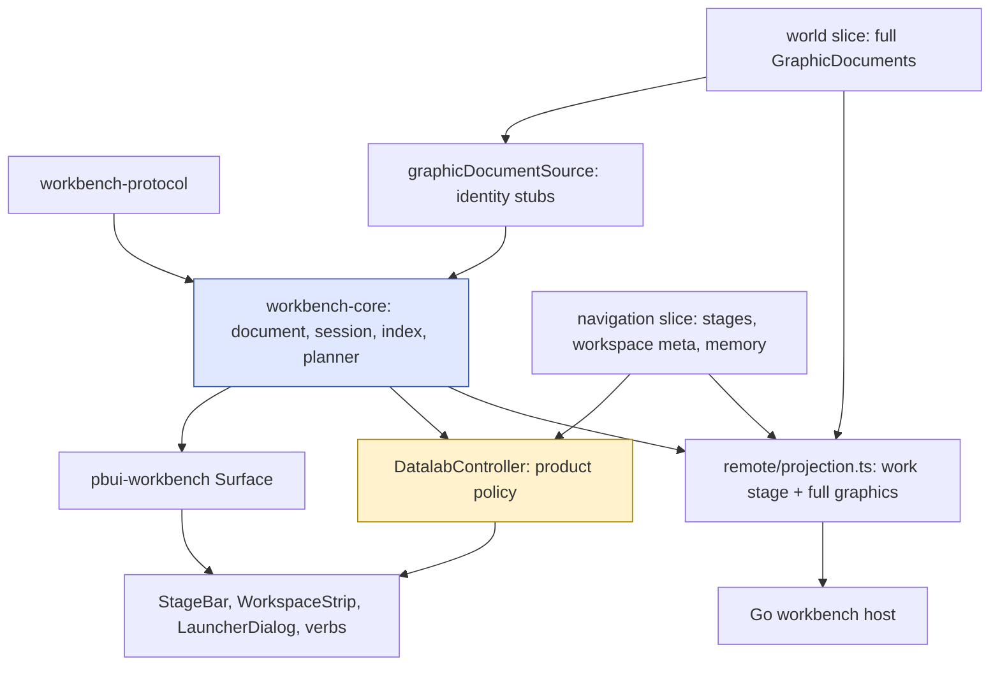
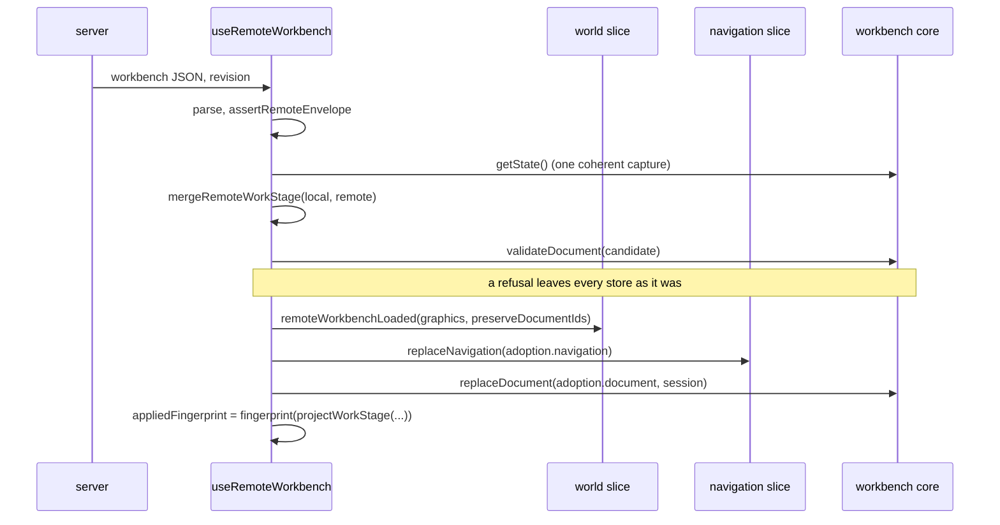

# PBUI Datalab on Workbench Core: Goldens First, One Coordinated Cutover, and a Product Layer Kept Above the Engine

This report describes the implementation of PBUI-DATALAB-WORKBENCH-1, the ticket that removed Datalab UI's own implementation of workspaces, logical views, placements, and split trees and made `@hyperslop-systems/workbench-core` the only owner of that state, on 2026-09-03. It is the third report in a series. The first, [[PROJECT REPORT - PBUI Workbench Core - A Headless Engine, a Pure Planner, and the Hard Cutover of the React Shell]], describes the engine and the shell this ticket adopts. The second, [[PROJECT REPORT - PBUI Workbench Stabilization - Safe Publication, a Proven Headless Boundary, and Binding Semantics Shared with Go]], describes the transaction, ownership, and binding guarantees the engine had to have before a product with its own Redux store, its own analytical documents, and its own remote policy could depend on it. This ticket is the first consumer that exercises all three.

The report covers the duplicate model the ticket started from and the evidence that made a naive port fail; the ownership model that decides what moves into the engine and what stays in Datalab; the goldens frozen from the code being deleted; the four additive adapters (manifests, seed compiler, document source, navigation slice); the controller that sits between product policy and protocol validity; the coordinated cutover of rendering, launcher, chrome, persistence, remote synchronization, and portable bundles; the deviations from the old reducers that were taken deliberately; the verification and the measured performance; and what remains. Each section cites the design guide by section number as "§n" and the diary by step, and quotes the code that landed where its exact shape carries the argument. The purpose is to let an engineer who has not read the ticket understand where each boundary sits, why, and which test holds it there.

> [!summary]
> - The old `store/layout.ts` was a 1,162-line Redux slice that implemented the same spatial model the workbench-core engine already owned: split, close, duplicate, linked duplicate, replace, swap, dock, workspace create/delete/rename/clone, a session pointer, and orphan repair. Thirty-seven files imported it. An earlier attempt to swap its local `Node` type for the protocol's produced 308 type errors across 25 files and would have rewritten reducers that the renderer cutover then deletes. Decision 4 of the design, goldens and adapters first and one coordinated cutover after, is what worked this time.
> - Ownership is explicit and tabulated. The engine owns workspace, view, placement, tree, index, and session. Datalab keeps stages (audience, chrome, allow-lists, pinned definitions, remembered workspace per stage), the analytical world with its full `GraphicDocument` values, the rich launcher, portable bundles, and the work-stage-only remote projection. The workbench document holds identity stubs for bound graphic documents, never the graphics themselves.
> - Phase 0 froze an id-free shape golden of `defaultLayout()` with view aliasing, so singleton sharing across workspaces is a testable property, and a real version-5 `save()` payload with user changes. Phase 1's seed compiler reproduced the shape golden on its first run; Phase 2's controller replayed 36 reducer behaviours headless; Phases 3–7 cut rendering, launcher, chrome, persistence, remote, and bundles over in one commit (`0b980f3`: 89 files, +4,348/−6,026) and deleted the slice, the tree algebra, `SplitView`, and the node/view codec.
> - The product layer stayed above the engine. The controller refuses what the protocol allows but the product forbids (`pinned_workspace`, `last_workspace_in_stage`, `pinned_stage`, `last_stage`), writes navigation metadata before a core command and rolls it back on refusal, expresses close-view as a raw `viewClose` batch, and keeps the singleton reuse rule the reducers implied. The current stage is derived from the core's session; no mirrored pointer survives, and a stage-memory invariant test over every controller operation replaces the old per-reducer test.
> - Persistence is version 6 (the workbench document as protobuf JSON beside the world and navigation), a version-5 migrator transcribes the old local tree, and `mergePinned` takes code-defined stages from source, keeps the user's workspaces, deduplicates singleton views by repointing leaves, and lands a missing stored workspace on the work stage's remembered workspace rather than on the sign-in page. The remote layer is a pure projection plus an adoption applied world → navigation → core after validating the candidate on a snapshot; bundles import as one validated batch in the same order.
> - Verification: datalab-ui at 55 test files / 602 tests (from 49 / 554), the whole-workspace audit green across ten suites, Storybook built, a browser smoke of the tour and product pages including a reload from a version-6 envelope, and measured timings (core index over the 15-workspace seed 0.046 ms; version-5 migration with merge and validation 8.0 ms). Version 0.2.0 is set; the publish waits on workbench-core 0.2.0 and pbui-workbench 0.6.0, which are unpublished on this branch.

## 1. Project status

The work lives on the pbui branch `task/consolidate-pbui-kernel`, on top of the stabilization commits described in the sibling report. The ticket workspace is at `/home/manuel/workspaces/2026-09-01/add-plot-editor/pbui/ttmp/2026/09/03/PBUI-DATALAB-WORKBENCH-1--consolidate-datalab-workspace-semantics-onto-workbench-core/`. The design guide is `design-doc/01-intern-guide-to-consolidating-datalab-onto-workbench-core.md` (about 6,800 words: §§3–5 ownership, §§6–8 adapters and commands, §§9–14 rendering, launcher, stages, bundles, persistence, remote, §17 decisions, §18 phases, §20 deletion list, §23 completion gates, §24 open questions). The diary `reference/01-investigation-diary.md` has six steps: the design, Phase 0, Phase 1, Phase 2, Phases 3–7 as one block, and Phase 8. The Phase 0 inventory is `reference/02-spatial-use-inventory-and-golden-map.md`, and two scripts under `scripts/` generated the goldens and recorded the timings.

| Phase | Deliverable | Code commit | Size |
|---|---|---|---|
| 0 | Id-free shape golden and real version-5 payload; golden test; classification of all 52 production action uses and 57 state reads | `bc3f027` | 6 files, +1,937 |
| 1 | Registry projected onto manifests; seed compiler over the protocol; identity-only graphic document source; navigation slice with derived current stage | `49d27e8` | 14 files, +1,542/−42 |
| 2 | Headless controller with product policy and metadata sequencing; runtime binding store, core, controller and source; verb thunks | `93cbf64` | 8 files, +1,351/−41 |
| 3–7 | Surface with two Datalab slots; launcher, strip, stage bar over the core; version-6 persistence, version-5 migrator, pinned merge; remote projection and adoption; bundles as validated batches; the layout slice, tree algebra, `SplitView`, and node/view codec deleted | `0b980f3`, `beb8887` | 89 files, +4,348/−6,026; then 1 file |
| 8 | Whole-workspace audit, browser smoke, performance recording, `MIGRATION.md`, version 0.2.0 | `17c9b83` | 3 files, +143/−1 |

Each code commit is paired with a docs commit that adds the diary step, the changelog entry, and the task tick (`f630cf9`, `9fad9bf`, `a64535f`, `78a7f43`, `8ffb68f`); `204613b` dropped the ticket's related-file entries for the deleted slice.

The test picture for `packages/datalab-ui`, as the diary records it at each gate:

| Gate | Files / tests | What the old slice was doing |
|---|---|---|
| Baseline (Step 1) | 49 / 554 | Everything |
| Phase 0 | 49 / 554 + goldens | Everything; the goldens assert against it |
| Phase 1 | 53 / 589 | Everything; the seed compiler runs beside it |
| Phase 2 | 55 / 628 | Everything; 36 parity tests replay its behaviours through the controller |
| Phases 3–7 | 55 / 602 | Deleted; its tests ported or intentionally replaced |
| Phase 8 | 55 / 602 | Deleted |

The dip from 628 to 602 is the removal of the old slice's own reducer tests once the controller parity tests covered the same behaviours, and the deletion of `shortcut-routing.test.ts`'s active-placement cases, which now belong to the core's session. The whole-workspace audit at `17c9b83` ran ten package suites green: protocol 40, core 243, workbench 116, editor 12, ecommerce 35, datalab 602, sandbox 224, plotscript 32, chat 241, chat demo 13 (1,558 tests in sum). `pnpm -r typecheck` and `pnpm -r build` pass, the datalab Storybook builds, the generated protocol code is unchanged, and `go test ./pkg/workbench/...` passes.

The size picture: `store/layout.ts` (1,162 lines), `store/layoutTree.ts` (96), `store/applyLayoutVerb.ts` (101), `components/organisms/SplitView/` (four files), the builder half of `store/stages.ts` (607 of its lines), and the node/view half of `remote/codec.ts` (247 lines removed) are gone. In their place: `store/controller.ts` (476 lines), `store/seed.ts` (511), `store/navigation.ts` (328), `store/merge.ts` (242), `store/migrateV5.ts` (260), `store/graphicSource.ts` (75), `store/workbenchVerbs.ts` (124), `remote/projection.ts` (248), `appkit/workbench.ts` (84), `appkit/DatalabWorkbenchContext.tsx` (85), and `appkit/workbenchApps.ts` (59).

Version 0.2.0 of `@hyperslop-systems/datalab-ui` is set. It depends on `workbench-core` 0.2.0 and `pbui-workbench` 0.6.0 as workspace packages; neither is published, and the branch is not pushed (§14).

## 2. The problem

Datalab UI is the analytical product built on PBUI: a set of tiles (chart, table, pipeline, encoding, sources, inspector, and others) arranged in split trees inside workspaces, grouped into stages with audiences, over a Redux store whose `world` slice holds the `GraphicDocument` values the tiles read. It already spoke the workbench protocol at its remote boundary, where a Go host stores the work stage as a `WorkbenchDocument`. Internally it had a second implementation of every spatial concept the protocol names.

The design's §1 and §2 measure the duplication at the baseline. `store/layoutTree.ts` defined a local `Node` (leaf with `viewId`, or split with `dir`, `a`, `b`, `ratio`) and its algebra: update, remove, find, count, remove-by-view, clone, ratio snap. `store/layout.ts`, at 1,162 lines, held the local `AppView` and `Workspace` types and reducers for split, close, resize, swap, dock, duplicate, linked duplicate, replace, rename, rebind, workspace create/delete/rename/clone, the current workspace and active placement, and orphan repair, together with stages, audiences, pinned workspaces, allow-lists, the pending import, the export notice, the inline rename target, the launcher invocation, and the first-sign-in marker. `components/organisms/SplitView/` and the spatial half of `components/organisms/Tile/Tile.tsx` rendered that tree with their own drag, resize, keyboard-divider, and error-boundary code. `remote/codec.ts` converted local nodes and views to protocol nodes and views and back. Thirty-seven files imported `store/layout`; production code had 52 `layoutActions.*` call sites over 23 distinct actions and 57 reads of `state.layout.*`; 26 files named the local `Node`; three files imported the protocol; none imported workbench-core.

The duplication was not only type spelling. Every rule the core's planner enforces (an orphaned view after a replace, a workspace that must keep at least one tile, a singleton application that may have one logical view, a linked placement that shares a view id) existed a second time in the reducers, with its own edge cases and its own tests. Two implementations of one model drift; the earlier PBUI-WORKBENCH-2 investigation had already documented where Datalab's differed.

The same investigation is the evidence for how not to fix it. Its experiment replaced the local `Node` with the protocol's `Node` inside the existing reducers and measured 308 TypeScript errors across 25 files. The errors themselves were not the finding. The finding was that every file the errors touched, the reducers and the recursive renderer, is a file the eventual cutover to the shell's `Surface` deletes. A type-first migration rewrites code in order to throw it away, and leaves the repository red for the whole interval. The design's Decision 4 states the alternative: build the adapters and the goldens additively while the old slice still runs, then switch reducers and rendering together in one integration phase, and delete the old code in the same commit. Decision 7 forbids the middle path of long-lived aliases or synchronized duplicate state. The diary's Step 1 records the consequence as a working rule: "Begin Datalab Phase 0 by freezing migration goldens, not by editing local Node types."

The other constraint was what must not change. Datalab's stages encode authentication audiences, pinned code-defined layouts that are replaced from source on every load, chrome that hides the workspace strip on a one-workspace stage, and the rule that only the work stage is sent to the server. Its launcher searches across stages, speaks a `wsN` and `+` grammar, intersects instance, stage, and workspace app scopes, and prefers the placement the user came from. Its portable bundles omit runtime ids and preserve sharing through indexed references. Its persistence refuses to write credential-shaped keys. None of that is a workbench concept, and the design's §0 lists each as retained. The ticket's title says "consolidate workspace semantics", not "rebuild Datalab on the generic shell".

## 3. The ownership model

The design's §5 states the target as an ownership table, and the README's "Workbench ownership" section restates it after the cutover with the file that owns each fact. The two agree, and the table below is the README's.

| Fact | Owner |
|---|---|
| workspace, view, placement, tree, active placement | workbench core (`src/store/runtime.ts`) |
| stages, workspace → stage, pinned, allow-lists, remembered workspace | the `navigation` slice (`src/store/navigation.ts`) |
| product policy in front of core commands (pinned, last-in-stage, close-view) | `src/store/controller.ts` |
| full `GraphicDocument`s, snapshots, pins, watch, trace | the `world` slice; the workbench holds identity stubs (`src/store/graphicSource.ts`) |
| the rich launcher, stage bar, stage-scoped strip, portable bundles | Datalab components and `src/store/bundles.ts` |
| what the server sees: the work stage with full documents | `src/remote/projection.ts` |

Three decisions in the design's §17 fix the shape. Decision 1: the core owns all spatial state and semantic commands. Decision 2: Stage remains a Datalab product layer outside the workbench document, because no other consumer demonstrates the concept and adding it to the protocol would be premature. Decision 3: full `GraphicDocument`s remain in the world slice; the workbench receives source-owned identity payloads sufficient for binding validation, and the full payloads are joined only at the persistence and remote boundaries. The rejected alternative for Decision 3, moving the analytical documents into the workbench document, would have rewritten the 487-line world slice and every analysis selector; the other rejected alternative, leaving the workbench document empty of documents, fails the core's strict binding validation (`unknown_document`), which the stabilization program had just made identical to the Go host's.



The diagram has two properties worth stating. First, there are no arrows from the core back into the Redux store: the runtime subscribes to the core to repair navigation metadata, and the source subscribes to the store to write stubs into the core, but neither reacts to the other's write with a write of its own (§8.3, and the reentrancy rule the stabilization program established). Second, every product write goes through the controller; a component that wants to split a tile calls `controller.splitTile`, not `core.execute` and not a reducer.

## 4. Phase 0: the goldens

Phase 0 changed no production code. It produced two fixtures, one test, and one inventory, and the reason it exists is a claim the diary states in Step 2: a golden generated from the code being deleted is the only golden that cannot be wrong about what that code did. A hand-written approximation of the seed, or of a stored layout, encodes the author's memory of the behaviour; a fixture produced by running the behaviour encodes the behaviour.

### 4.1 The id-free shape describer

The first fixture had to capture the shape of `defaultLayout()`: which stages exist and in what order, which workspaces belong to each, every tree's arrangement, and which leaves share one logical view. Runtime ids are minted per store, so a golden carrying them fails on every run. The helper `test/helpers/layoutShape.ts` therefore describes a layout with views named by first appearance:

```ts
const aliases = new Map<string, string>();
const alias = (viewId: string): string => {
  let name = aliases.get(viewId);
  if (!name) {
    name = `v${aliases.size + 1}`;
    aliases.set(viewId, name);
  }
  return name;
};
```

A singleton placed in three workspaces shows the same alias three times; a chart placed twice in one workspace is one alias placed twice. Pinned workspaces keep their ids, because those are code-defined and must match across builds; user-owned workspaces are described by name. Each stage records its chrome, audience, allow-list, and the workspace it remembers. The output for the default layout is 12.8 kB of JSON at `test/fixtures/layout-shape.golden.json`.

View aliasing is the part that makes the migration's largest risk testable rather than remembered. The design's §7.2 and §21 warn that the pinned layouts deliberately place the same singleton logical view (`sources`) in the welcome start page, in tour 1, in demo 7, and in the work stage's `explore` workspace, and that a seed compiler calling the layout builder once per workspace would mint a second `sources` view each time. The golden test's second case asserts the property directly: it walks every tree in the fixture, collects the alias of every `sources` leaf, and requires more than one occurrence with exactly one distinct alias.

### 4.2 The real version-5 payload

The second fixture is a version-5 `save()` payload with user changes layered on the seed. The ticket script `scripts/01-freeze-layout-goldens.ts` builds a store with `makeStore()`, which runs under plain Node, installs a `localStorage` shim, and dispatches the old actions: rename the work stage's `explore` to `my explore`, add a `scratch` workspace, split its launcher tile with a chart bound to the first world document, rename the chart `Yield watch`, make a linked duplicate of it, narrow `scratch`'s allow-list to chart, table, and launcher, switch to the account stage, and switch the work stage's pointer to `my explore`. It then calls the old `save()` and writes the 32.2 kB result to `test/fixtures/persisted-v5.json`. The version-5 migrator written in Phase 6 must read exactly this.

Two small failures are recorded for the script. Its doc comment contained the path fragment `*/scripts/…`, which closed the comment early (`ERROR: Unterminated regular expression`); and the relative imports from the ticket's `scripts/` directory needed six `..` segments, not five (`ERR_MODULE_NOT_FOUND …/ttmp/packages/datalab-ui/src/store`). Both are worth recording because the script is what a future engineer reruns if the goldens ever need regenerating from an older commit.

### 4.3 The golden test, on both sides of the gate

`test/migration-goldens.test.ts` asserted the fixtures against the code that produced them in Phase 0, and against the seed compiler and the migrator after the cutover. Its post-cutover form has four cases: `defaultSeed()` reproduces the frozen shape (`toEqual(shapeGolden)`); the golden records singleton sharing; the version-5 payload migrates and validates; and the migrated payload carries every user change. The last is the specification of what "migrated" means, stated as assertions: the work stage's workspaces are `build`, `my explore`, `gallery`, `help`, `scratch`, all unpinned; `scratch` has the narrowed allow-list; there are two chart leaves in `scratch` sharing one view id whose title is `Yield watch` and whose `primary` binding is the world's first document; the current workspace is `my explore` in the work stage; and the account stage remembers `ws-account`. A fifth case asserts that the pinned stages and workspaces come from code, not from the payload, which is the merge policy of §7.3 (DR-29 in the product's own decision records).

### 4.4 The inventory

`reference/02-spatial-use-inventory-and-golden-map.md` classifies every production use of the slice. Its action table has a column for what each becomes: `setRatio` → `commands.resize` (the shell's SplitPane), `splitLeaf` without an app → `commands.duplicate` under the product's `{ app: "launcher" }` policy, `createViewInPlacement` → `view.show` with `reuse: "never"`, `closeView` → the controller's batch, `setCurrentSpace` → `commands.selectWorkspace` plus stage memory, the eight transient reducers → the navigation slice unchanged, the three `*FromBundle` reducers → a controller import, `replaceLayout` → gone, replaced by construction from the accepted state. Its golden map lists, for each behaviour that will be deleted, the fixture or test that freezes it. One thing is recorded as deliberately not frozen: `viewOrder` ordering, because the seed compiler builds views in reading order while the old builder created them in call order, and the launcher tests assert on grouped results rather than raw order.

## 5. Phase 1: the four adapters

Phase 1 added the workbench-side foundation beside the untouched slice. Its exit gate, from the design's §18, was that a headless core can construct every pinned Datalab seed and pass strict validation. The diary's Step 3 records the gate met: the compiled default seed reproduces the Phase 0 shape golden exactly, on the first run, and validates against the real catalog.

### 5.1 Descriptors as manifests

Datalab's applications register by import side effect into a registry of `AppDescriptor`s with `singleton`, `duplicable`, `docBound`, and a component. `src/appkit/workbenchApps.ts` projects each onto a workbench app after `apps/all` has loaded:

```ts
manifest: {
  id: descriptor.id,
  viewCardinality: descriptor.singleton ? "one" : "many",
  duplicatePlacement: descriptor.duplicable && !descriptor.singleton ? "clone" : "link",
  bindings: descriptor.docBound
    ? { primary: { required: false, formats: [GRAPHIC_DOCUMENT_FORMAT], role: "primary" } }
    : {},
  launch: "unbound",
},
```

Two choices differ from the design's §6.1 sketch, and the file's comment explains both. `primary` is optional, not required: a document-bound tile with no binding follows the active document, which is a legal state that DocBar's "+" and the launcher both produce. `launch` is `"unbound"` for the same reason and because the generic launcher is not mounted; Datalab's own launcher decides what to bind. The third detail is the `duplicable && !singleton` guard: an application that is both would have to be `"clone"` under a `viewCardinality: "one"` manifest, which the core refuses, so it is forced to `"link"`. No such application exists today and `apps.test.ts` forbids the combination, but the mapping is total. The registry's side-effect registration stays (§6.2, open question 8): removing it is a separate cleanup, not to be combined with a spatial migration whose tests cannot prove initialization order stable.

### 5.2 The seed compiler

`src/store/seed.ts` replaces the builder half of `stages.ts`. Its input is product-friendly: a list of `StageDefinition`s and a list of `WorkspaceSeed`s, each with a fixed id for a pinned workspace, a stage id, an optional allow-list, and a `LayoutSpec` written with workbench-core's `tile(appId, { documents?, title? })` and `split(direction, ratio, a, b)`. Its output is one `WorkbenchDocument` plus navigation metadata plus the workspace to start on.

The compiler is built through the protocol. `buildLayout` issues the same `viewCreate` mutations a user would, `workspaceCreateMutation` the same `workspaceCreate`, and `applyMutations` over `emptyDocument` applies them; whatever the applier accepts here is what a server running `pkg/workbench` would accept, and there is no second tree model. The part the file's comment calls out is the singleton carry:

```ts
const existingViewsByAppId = new Map<string, string>();
for (const seed of input.workspaces) {
  const built = buildLayout(seed.spec, { singletonAppIds, existingViewsByAppId, ids });
  for (const view of built.views) {
    if (singletonAppIds.has(view.appId) && !existingViewsByAppId.has(view.appId))
      existingViewsByAppId.set(view.appId, view.viewId);
  }
  ...
}
```

`buildLayout` takes an `existingViewsByAppId` map so that a leaf naming a singleton application places the existing view rather than minting one; the compiler threads the same map through every workspace in document order, exactly as the core's `workspace.create` does within one workspace. The diary records that this is what gave singleton sharing "for free": the golden matched on the first run because reading order in `buildLayout` and the old builder agree on every tree.

The compiler also writes identity stubs. The welcome workspaces bind versioned demo documents (`WELCOME_DOC_IDS.*`) before `/v1/me` has advertised them and before the world holds them; the core validates every binding against its document store, so `compileSeed` collects every bound id from the specs and emits a `documentPut` of a stub for each before the layout mutations. `test/seed.test.ts` asserts the stub set is exactly the bound id set, which is also what lets the source (§5.3) never delete one.

One transcription hazard is recorded in the diary: workbench-core's `split` takes the ratio second (`split("row", 0.4, a, b)`) where Datalab's builder took it last. Every pinned tree in `pinnedDefinitions()` was transcribed by hand, and the shape golden, which records every ratio, is what proved none was transposed. `MIGRATION.md` repeats the warning for embedders.

`defaultSeed` composes the four pinned stages (sign-in, welcome, account, work) with their eleven pinned workspaces and the work stage's four user-owned starting workspaces, mints `build`'s id, and starts there. `singleStageSeed` produces one workspace on one freshly minted stage with `masthead: false` and `stageBar: false`, which is what every embedded instance and every story seeds. The seed is deterministic under workbench-core's `sequentialIds`, which the tests use.

### 5.3 The identity-only document source

`src/store/graphicSource.ts` is Decision 3 made concrete. A stub is a `DocumentPayload` with the id, the format `datadrop.gog.document`, schema version 2, and a body containing only the source's ownership mark under the stabilization program's `SOURCE_OWNER_FIELD`:

```ts
export function graphicStub(id: string): DocumentPayload {
  return create(DocumentPayloadSchema, {
    id,
    format: GRAPHIC_DOCUMENT_FORMAT,
    schemaVersion: GRAPHIC_DOCUMENT_SCHEMA_VERSION,
    body: { [SOURCE_OWNER_FIELD]: GRAPHIC_SOURCE_ID },
  });
}
```

The source itself is `graphicDocumentSource(read, subscribe?)` with `update: "identity-only"` and a `list` that returns the world's `docOrder` as `{ id }` records. It takes a reader and a subscriber rather than the store, so the same function serves a Redux store, a test's plain object, and a remote merge reasoning about a world it has not installed yet. The consequences the file states: a stub written once is never rewritten, so a world edit changes no workbench document and wakes no workbench subscriber; a stub may stand for a document the world does not hold yet, and the source leaves a bound stub alone whether or not the world has caught up. `test/graphic-source.test.ts` covers the four cases: a new world document gets a stub and an existing stub is left alone; a stub the world no longer holds is deleted when unbound and kept while bound; a stub of another format under a listed id is a collision, never overwritten; a stub carries nothing analytical.

### 5.4 The navigation slice and the derived current stage

`src/store/navigation.ts` holds what sits above the workbench document: `stages` (definitions with chrome, allow-list, `pinned`, `audience`), `workspace` (per workspace id: `stageId`, `pinned`, `apps`), `rememberedWorkspaceByStage`, and the five transient fields the old slice carried (pending import, launcher invocation, export notice, rename target, first-sign-in marker), each marked never persisted. `durableNavigation` projects the first three for storage.

The slice has no current-workspace pointer. The old slice stored `currentSpaceId` twice, once at the top level and once on each stage, and needed a test walking every reducer to keep the two in step (DR-60). The canonical current workspace is now the core's `session.workspaceId`, and the current stage is derived:

```ts
export function currentStageId(state: PersistedNavigation, workspaceId: WorkspaceId): StageId {
  const stageId = metaOf(state, workspaceId).stageId;
  return state.stages.some((stage) => stage.id === stageId)
    ? stageId
    : (state.stages[0]?.id ?? WORK_STAGE_ID);
}
```

`metaOf` defaults an unknown workspace into the work stage, which is the deterministic repair the design's §8.3 asks for. `landingWorkspaceOf(state, workspaceIds, stageId)` returns the stage's remembered workspace when it still exists in that stage, else the stage's first in document order.

`reconcileNavigation(state, workspaceIds)` is the pure repair: every workspace the document holds gets metadata (unknown → work stage), no metadata names a workspace the document lacks, a workspace naming a stage that no longer exists joins work, and each stage's remembered workspace exists and belongs to it. The diary's "what was tricky" for Phase 1 is the identity requirement: the function must return the same object when nothing changed, or a subscriber comparing identity wakes on every core install. It tracks a `changed` flag through both maps and the memory, and `test/navigation.test.ts` asserts the identity case first.

The invariant test that replaces the old reducer walk lives in `test/stages.test.ts` under "stage memory never disagrees with where the user is". It holds a table `OPERATIONS` with one representative call per controller operation that can move the user or change what a stage owns (sixteen entries, including "removeWorkspace of another stage's remembered one" and "moveWorkspaceToStage of the current one"), a coverage case asserting that every navigation method on the controller appears in the table, and the invariant case: after each operation, the current stage is defined, the workspace on screen is filed under it, that stage remembers the workspace on screen, and every remembered workspace exists and belongs to the stage remembering it. The failure it exists to prevent is stated in its comment: you are on `gallery` in `work`, switch to `account` to mint a token, switch back, and land on `build` because the memory and the pointer disagreed.

## 6. Phase 2: the controller

Phase 2 put the product's policy in front of the core. The design's §5.5 states the principle: a raw core command could rename a pinned workspace, and that is acceptable at the semantic layer because "pinned" is not in the protocol; Datalab's public entry points must route through a controller that refuses it. Protocol validity and product permission are separate checks, and the controller is where the second lives.

### 6.1 Shape and injection

`src/store/controller.ts` exports `createDatalabController({ store, core, execute? })` returning a `DatalabController` with navigation (`selectWorkspace`, `selectStage`), workspace policy (`createWorkspace`, `removeWorkspace`, `renameWorkspace`, `cloneWorkspace`, `moveWorkspaceToStage`, `setWorkspaceApps`), stage policy (`addStage`, `removeStage`, `renameStage`), and tile verbs (`splitTile`, `duplicateView`, `createLinkedDuplicate`, `replacePlacement`, `renameView`, `rebindView`, `removePlacement`, `closeView`, `setActivePlacement`). Every method returns an `ExecuteResult`; a product refusal is `{ ok: false, code, because }` with one of `pinned_workspace`, `last_workspace_in_stage`, `pinned_stage`, `last_stage`, `unknown_stage`, `empty_stage`, `empty_name`, `unknown_workspace`, `unknown_view`, `unknown_placement`, in addition to whatever the core returns. `MIGRATION.md` states the consequence for callers: every spatial refusal is a result with a code, never a silent no-op reducer.

The controller is headless and never measures anything. `execute` is injectable: the tests run it over `core.execute`, and the React layer (§7.1) passes the shell's executor, which measures the mounted Surface before a command that needs geometry. This is why the launcher can ask for a split without naming an axis and get the longer rendered one.

### 6.2 Metadata before the command, with rollback

The operations that change the workbench document and the navigation metadata together are sequenced so that metadata is written first and rolled back on refusal:

```ts
createWorkspace(create = {}) {
  ...
  const workspaceId = core.ids("ws");
  store.dispatch(navigationActions.putWorkspace({ id: workspaceId, meta: { stageId, pinned: false, apps: create.apps ?? null } }));
  const result = execute(commands.createWorkspace(create.name ?? "workspace", create.spec ?? { kind: "tile", appId: LAUNCHER_APP_ID }, { workspaceId, select }));
  if (!result.ok) {
    store.dispatch(navigationActions.forgetWorkspace(workspaceId));
    return result;
  }
  if (select) remember(workspaceId);
  return { ...result, workspaceId };
},
```

The ordering is forced by the runtime's reconcile subscription (§6.5). The core's install notifies subscribers synchronously; a reconcile that ran between "workspace exists in the document" and "metadata written" would file the new workspace under the work stage for one notification, and a strip rendering during that notification would show it in the wrong stage. Writing the metadata first, under a pre-minted id from `core.ids("ws")`, means the reconcile finds nothing to repair. `cloneWorkspace` follows the same shape and marks the copy as the user's regardless of the source's pinning; `addStage` adds the definition, creates the stage's first workspace through `createWorkspace`, and removes the definition if that refuses.

The removals need the opposite care. `removeStage` when the current workspace is in it must select the landing workspace of another stage before the deletes, in the same batch; otherwise the core's `workspace.delete` picks any survivor and the user lands in a random stage. `removeWorkspace` of the current one selects a same-stage sibling first, in one transition, and refuses with `last_workspace_in_stage` if there is none (DR-72: at least one workspace per stage, not per document). Both are in the invariant table of §5.4.

### 6.3 The reuse rule

Datalab's reducers implied a rule about view identity that the controller states once, in `applicationView`:

```ts
reuse: manifest?.viewCardinality === "one" ? ("manifest-default" as const) : ("never" as const),
```

A singleton application's existing view is reused; every other application gets a fresh view. `splitTile` with an application, `replacePlacement` with an application, and the launcher's "new" rows all go through it. The core's `view.show` with `reuse: "never"` mints; with `"manifest-default"` it follows the manifest's cardinality, which for `"one"` means the existing view. `test/controller.test.ts` has "a singleton application's existing view is reused rather than minted twice" for the positive case.

### 6.4 Close-view as a raw batch

`closeView(viewId)` removes every placement of a view across every workspace and repairs any workspace left empty with a launcher tile. The design's §8.2 asked for a compound helper and said not to add a generic core command for one product. The diary's Step 2 found that the protocol already has the operation: `viewClose` with a `fallbackViewId` removes every placement of one view and repairs an emptied workspace with the fallback. The controller therefore builds a raw mutation batch and sends it through `core.apply`:

```ts
const batch: Mutation[] = [];
let fallbackViewId = state.document.viewOrder.find((id) => id !== viewId);
if (emptied.length > 0 || !fallbackViewId) {
  const fallback = create(AppViewSchema, { id: core.ids("v"), appId: LAUNCHER_APP_ID, documents: {} });
  batch.push(create(MutationSchema, { body: { case: "viewCreate", value: { view: fallback } } }));
  fallbackViewId = fallback.id;
}
batch.push(create(MutationSchema, { body: { case: "viewClose", value: { viewId, fallbackViewId } } }));
const applied = core.apply(batch);
```

The fallback launcher view is minted only when a workspace would empty (or when no other view exists to name as fallback, since the protocol requires one). `core.apply` runs the core's validation and links maintenance but not the planner's orphan sweep; that is fine here because `viewClose` deletes the view itself, so nothing is left unplaced. The controller then clears the rename target and closes the launcher, because a closed view cannot be renamed or replaced.

### 6.5 The runtime

`src/store/runtime.ts` builds the store, the core, the controller, and the source as one unit and is the file the README names as the core's owner. `createDatalabRuntime({ seed, apps, world?, ids?, executor?, ... })` makes the Redux store with the seed's navigation preloaded and a lazy `controller` getter on the thunk extra argument (the controller does not exist until the core does); the core over the seed's document with `initialSession: { workspaceId: seed.workspaceId }` and the policy `duplicate: { app: "launcher" }` (a bare split makes an empty launcher tile, and aiming a new tile at a launcher's centre fills it rather than splitting it); the controller with the injected executor; and two one-way subscriptions.

The reconcile subscription compares the joined workspace-id list, not object identity, so an install that changed only tiles dispatches nothing:

```ts
let lastWorkspaces = "";
const reconcile = () => {
  const ids = core.getState().document.workspaces.map((workspace) => workspace.id);
  const key = ids.join(" ");
  if (key === lastWorkspaces) return;
  lastWorkspaces = key;
  store.dispatch(navigationActions.reconcile(ids));
};
```

The source subscription is `connectDocumentSource(core, graphicDocumentSource(() => store.getState().world, store.subscribe))`. The file's comment states the rule that keeps the pair from feeding each other: a reconcile that finds nothing to do dispatches nothing, and a sync with no mutations applies nothing. One runtime per workbench instance, never module-global: the landing page mounts six, and placement ids may repeat across them.

### 6.6 Verb thunks

`src/store/workbenchVerbs.ts` is the verb seam over the controller, the successor to the reducer-dispatching half of `applyLayoutVerb.ts`. Each case returns a thunk rather than running one, which keeps `actionsForVerb` a pure function of the verb (the property DR-68 established), and the thunk reaches the controller through the store's extra argument, so nothing here imports React or a workbench instance. It returns `null` for a verb it does not own. After the cutover it also owns the export, import, and template verbs, so `applyLayoutVerb.ts` is gone.

### 6.7 What Phase 2 proved, and what failed first

The exit gate was that every behaviour the old reducer tests pinned replays through the controller without rendering. `test/controller.test.ts` has 36 cases across tiles and views, active placement, stage memory, workspace policy, stage policy, and the source: the last tile cannot be closed; a split makes an empty launcher tile; a split naming an application creates that view in one transition bound to the active document; swapping moves app, document, and label while placement ids stay put; renaming and clearing restores the derived title; duplicating keeps the document and marks the copy; a linked duplicate creates a second placement of the same view; rename and rebind propagate through linked placements; replacing a placement with an existing view links it and the view it showed goes when nothing else shows it; closing a view repairs an emptied workspace with a launcher; docking never leaves the same leaf in two places; a workspace added to another stage does not steal the pointer; deleting counts within the stage.

The first run had seven failures, and the diary records two causes, both instructive. The test handed the seed and the core separate `sequentialIds()` generators, so a node id the core minted collided with one the seed had used (`duplicate_id … "n-00000004-0000" was already used`). The fix is to share one generator, which is also why `createDatalabRuntime` takes `ids` and passes the same generator to both. The second cause: tests bound `"doc-a"` without a world document holding it, and the core refused with `unknown_document`. That refusal is correct; it is the strict binding validation the stabilization program made identical to Go's, and the fix was to mint real documents through `worldActions.newDoc`, whose stubs the source writes in the same tick. A third, smaller failure was TS2345 on `view.show`: an inline `{ primary } | {}` union is not a `Record<string, string>`, so the documents map is typed explicitly.

## 7. Phases 3–7: the coordinated cutover

Phases 3 through 7 are one continuous block, committed once green as `0b980f3`, as Decision 4 requires. The diary's Step 5 lists what changed by area; this section follows the same order and explains the choices that were not obvious.

### 7.1 The React wiring

`src/appkit/workbench.ts` exports `createDatalabWorkbench(options)`: it builds the manifests from the registered apps, the seed (default or supplied), and the runtime with an `executor` callback that constructs the pbui-workbench shell over the core and returns `shell.execute`. The controller therefore runs through the shell, and geometry is measured. `src/appkit/DatalabWorkbenchContext.tsx` provides the Redux `Provider` for the workbench's store and a context handing components the core, the shell, and the controller, plus the hooks `useDatalabWorkbench`, `useCurrentWorkspaceId` (the core's session through `shell.useCoreState`), `useCurrentStageId` (derived through `currentStageId`), `useCurrentStage`, `useWorkspaceMeta`, and `useWorkspacesOfStage`. `WorkbenchInstance` builds one workbench in a `useRef` and passes it to the provider; `InstanceConfig.preloaded` is `{ world?, seed? }`; the product's `Product` route loads, merges, and constructs from the accepted state.

`useWorkspacesOfStage` is the site of the `beb8887` fix. Its first form returned a fresh filtered array on every call, and react-redux warned that the selector returned a different result each time; it is now memoised on the document and the metadata map. The diary notes that the remaining warnings of that kind, `useSelector(s => s)` in `LessonRail` and `BriefChecklist` and the `DocBar` document map, predate the ticket (§14).

### 7.2 The Surface with two slots

`WorkbenchShell.tsx` keeps the Datalab page composition (masthead with the stage bar, accept banner, stage-scoped workspace strip, the import dialog, the launcher, the export notice, the object menu, context help) and replaces the recursive `NodeView`/`SplitView` renderer with:

```tsx
<workbench.shell.Surface
  renderTitle={renderDatalabTitle}
  tileAction={renderDatalabTileAction}
  linkModeShortcut={false}
  swapLabel="⇄ swap applications"
  dockLabel="split-dock here · the source tile closes"
  className={styles.surface}
/>
```

The shell supplies recursion, dividers, drag and drop, swap and dock, the active placement, the split and close buttons, and the per-tile error boundary. Datalab supplies two slots. `Tile.tsx` shrank from 337 changed lines to `TileTitle` and `TileAction`: the title renders the `<tile>` PBUI presentation carrying the object menu, derives `chart · α` from the app title and the bound document's name, shows the inline rename when the navigation slice's `renamingId` matches, and draws the `×n` linked marker; the action opens Datalab's launcher in replace mode, because the shell's default would open the generic launcher that Datalab does not mount. `linkModeShortcut={false}` because Datalab has no ports to connect and the chord would open an empty mode. The design's §9 risk, that the generic Surface could not express Datalab's tile chrome, did not materialise: two slots sufficed, and open question 5 is answered in practice.

One detail of scoping: two `data-workbench-shell` markers would have doubled the "lone workbench" count that decides whether Mod+K fires when nothing owns focus. The Surface carries that marker; Datalab's root dropped its own and keeps only `data-launcher-open` for its active-tile outline rule.

### 7.3 The launcher over the core index

`LauncherDialog.tsx` keeps its grammar, its stage and workspace grouping, its `wsN` scoping, its limits and explanations, and its keyboard listbox (Decision 5). What changed is the data and the choices. The index is built over the core's `document.views`, `document.viewOrder`, and a `LauncherWorkspace` join of the core's workspaces with their navigation metadata (`stageId`, `apps`, `tree`); the target workspace's app scope is `instance ∩ stage ∩ workspace` computed for the workspace a row concerns, not the current one, which was a prior correctness finding.

The navigate-mode placed row is the case that answered open question 1 (whether `view.show(existing, navigate)` needs a preferred placement id):

```ts
if (row.kind === "placed") {
  const placement = preferredPlacement(row, activePlacement);
  controller.execute([
    commands.selectWorkspace(row.workspaceId),
    ...(placement ? [commands.activate(placement)] : []),
  ]);
  ...
}
```

`[selectWorkspace, activate]` is one batch because `session.activatePlacement` refuses a placement outside the current workspace, and the draft session inside a batch already reflects the switch. The launcher achieves the preferred placement without a new core request field, so the question stays open in the design but is not blocking. A "new" row in navigate mode fills the active tile if it is an empty launcher and otherwise calls `controller.splitTile(placementId, undefined, show)` with no axis, letting the shell measure. In replace mode, both rows go through `controller.replacePlacement`. Focus returns by placement id through `shell.focusPlacement`, which scopes the lookup to this workbench's root and waits a frame for a tile a command has just created.

### 7.4 DocBar through a thunk, because of the layer graph

`test/layers.test.ts` walks every import under `src/` and fails on an edge the table forbids. `DocBar` is a molecule, and molecules may not import `appkit`; but DocBar's one write, pointing a view at a document, needs the controller. The first cutover had DocBar import the workbench context and the layer test failed. The fix is the `rebindView(viewId, docId)` thunk in `workbenchVerbs.ts`, which reaches the controller through the store's extra argument; a molecule may dispatch to the store. The same test forbids `store → appkit` even for type imports, which is why the controller lives in `store/` and only the React wiring in `appkit/` (a decision recorded in the diary at Phase 0).

### 7.5 The lessons contract

The tour's lessons complete by predicate, never by button press (DR-50): `done` is a pure function of the state. The old predicates read tile counts from `RootState.layout`. The new contract is `done(state, workbench)`, where the second argument is the core's `{ document, session, index }`; a predicate about tiles reads `leavesOfWorkspace(workbench.index, workbench.session.workspaceId)`. `Goal.done` has the same signature, `LessonContext.workbench` is the instance's controller (a `run` that used to dispatch `layoutActions.*` calls `workbench.splitTile(...)`), and the tour's fixtures seed through `datalabSingleStageSeed`. This is one of the three shape changes that justify the 0.2.0 version.

### 7.6 Chrome and session

`WorkspaceStrip` and `StageBar` read the core's workspaces filtered by navigation metadata and route every action through the controller; pinned markers and refusals stay product-owned. `Workbench.tsx`'s auth gate calls `controller.selectStage(landingStageFor(authed))` when the current stage is not visible for the auth state, `selectStage(SIGNIN_STAGE_ID)` on an `auth_error` callback, and `selectStage(ACCOUNT_STAGE_ID)` on a first sign-in. `AppScope.useAvailableApps`, `LauncherApp`, `ModulesApp`, `SignUpApp`, and `TemplatesApp` read the core or the navigation slice instead of the layout slice.

### 7.7 The deletion

`0b980f3` deletes `store/layout.ts`, `store/layoutTree.ts`, `store/applyLayoutVerb.ts`, `components/organisms/SplitView/` (component, stories, CSS, index), the builder half of `stages.ts` (which now re-exports the stage ids and keeps `stageIsVisible` and `landingStageFor`), and the node/view/workspace conversion in `remote/codec.ts` with its local types. The design's §20 deletion list is met in full; §16's layer target holds (the layer test is green, and `model` and `analysis` import nothing from the workbench).

### 7.8 Ported by agents, over a shared brief

The diary records that the tests and stories were ported by three parallel agents over a shared API brief while the source was being finished: launcher-index, view-switcher, lessons, portable, and effects tests; the layoutShape helper, migration-goldens, stages, store, instances, and shortcut-routing tests; remote-codec, remote-load, and seven stories. Two test-infrastructure fixes followed: `no-raw-controls` had a stale allowlist entry, and `render-boundary` had to learn that the per-tile boundary is now the shell's. The story agent recorded its own deviations: the per-tile application dropdown is gone, so the TwoInstances play proves separation by tile counts; a story about an unregistered application must add a ghost manifest, because the core refuses a document naming an application its catalog lacks; a story may only bind `primary` on a doc-bound app; and `test/stories.test.ts` takes the first quoted `title:` in a file as the meta title, so a `tile("chart", { title })` above the meta breaks it.

## 8. Persistence: version 6, the migrator, and the pinned merge

### 8.1 The envelope and the load order

`src/store/persist.ts` writes version 6: `{ version: 6, world, workbench, navigation, workspaceId }`, where `workbench` is the workbench document as canonical protobuf JSON (the same bytes a Go server would accept), `navigation` is the durable subset, and `workspaceId` is the workspace on screen. The credential guard, the parameterised key (five embedded instances must not share one), and the quota handling are unchanged.

`validate(input, apps)` implements the load order of §13.2, and the order matters:

```ts
const parsed = parseWorkbenchDocument(JSON.stringify(data.workbench));   // structural, no catalog yet
let document = parsed.document;
const { mutations } = documentSourceMutations(document, graphicDocumentSource(() => world));
if (mutations.length > 0) document = applyMutations(document, mutations); // hydrate stubs
const merged = mergePinned(defaultSeed({ apps }), { document, navigation, workspaceId }, { apps });
if (!merged) return null;
return { world, seed: merged };
```

The structural parse comes first, without a catalog, so a layout naming a retired application survives to the merge, where its pinned pages are replaced from code, and only then is judged. Hydration comes before validation (the stabilization program's §9.7): a stub the world's documents would contribute is added now, so a layout bound to a document whose stub was never persisted is repaired. The merge validates the assembled document against the catalog and returns null for anything unusable, and the product constructs its workbench from that final accepted state; nothing renders a default and then replaces it.

### 8.2 The version-5 migrator

`src/store/migrateV5.ts` transcribes the old local layout. The shapes were already the protocol's in all but spelling (DATALAB-VIEW-001 had separated logical views from placements), so a local `Node` becomes a protocol `Node` under the same id, a local `AppView` a protocol `AppView`, a `Workspace` a protocol `Workspace` plus one navigation record for the stage it named, and each stage's `currentSpaceId` becomes the stage's remembered workspace. Every bound document id gets an identity stub, because the core validates bindings. `isV5Layout` checks the structure exhaustively first (every leaf's view exists, `viewOrder` is a permutation of the view ids, every ratio is within 0.05–0.95); `migrate(raw)` passes version 6 through, transcribes version 5, and refuses versions 1–4 (a clean break the stages test asserts against a version-1 fixture generated from the version-1 source at commit `f53be15`). The migrator is structural only; the pinned merge and the catalog validation happen on the migrated envelope, exactly as for version 6.

### 8.3 `mergePinned`

`src/store/merge.ts` is the successor to `mergeStages`, over protocol values. The policy: a pinned stage and its pinned workspaces are taken wholesale from this build's seed; the user's workspaces, the views they reach, and the stages they made come from storage; the one thing a pinned stage keeps from storage is which workspace it was last on. The steps, in the file's numbering:

1. The seed's pinned workspaces and the views they reach, computed through the trees (reachability, not `viewOrder`, per §7.3's last line).
2. The stored workspaces this build does not pin, and the views they reach.
3. A singleton canon: the seed's view of each `viewCardinality: "one"` application wins, else the first the user's workspaces reach; every kept leaf that shows a superseded singleton view is repointed at the canonical one by `rewriteTree`.
4. Assembly: pinned first in seed order, then the user's in stored order; every stored stub survives (an unbound one is the source's to sweep) and the seed's stubs for the pinned pages come along.
5. Navigation: definitions from code, the user's stages and memory from storage, then `reconcileNavigation`.
6. Repair: a stage left with no workspace at all gets one launcher workspace named `build`.
7. Validation against the catalog, and the landing workspace.

Step 3 is the one that needs justification. A restored `explore` workspace still places the `sources` view of the seed it was born under; this build's seed mints a fresh `sources` view for the tour pages; the core refuses a document with two views of a singleton application. Keeping both fails validation, dropping the user's tile loses a placement, so the leaf is repointed. `test/stages.test.ts` has "a view a user workspace reaches survives; a singleton it shares with a pinned page is repointed" for it, and the diary flags the choice of canon for review.

Step 7 is the fix the diary records under "what didn't work". The first `mergePinned` fell back to `workspaces[0]` when the stored `workspaceId` no longer existed, and `workspaces[0]` in document order is the sign-in page. The store-side porting agent had weakened a test to pass this. The corrected fallback is the work stage's remembered workspace:

```ts
const workspaceId = present.has(restored.workspaceId)
  ? restored.workspaceId
  : (landingWorkspaceOf(navigation, [...present], WORK_STAGE_ID) ?? workspaces[0]!.id);
```

and the test was tightened. The first patch of this fix left `landingWorkspaceOf` unimported, because biome had reflowed the import block under the regex used to edit it, and three tests failed with `ReferenceError: landingWorkspaceOf is not defined` before the import was restored. `MIGRATION.md` lists the behaviour as one of the four that changed on purpose.

## 9. The remote projection and adoption

The generic workbench sync assumes the whole document is the server's. Datalab's is not: only the work stage is remote, and the full analytical documents live in the world. Decision 6 keeps a product-specific projection and controller for the first migration and renames the pieces to reveal policy. `remote/codec.ts` is now the codec and only the codec: the JSON boundary of the workbench document (`parseRemoteWorkbenchJSON`, `workbenchDocumentJSON`, `assertRemoteEnvelope`) and the envelope codec for a `GraphicDocument` (`encodeGraphicDocument` puts identity in the envelope and everything else in the body; `decodeGraphicDocument` checks the format, the schema version, and that the body does not carry the reserved identity keys). `remote/projection.ts` holds the policy, and every function in it is pure over plain values.

Outbound, `projectWorkStage(local, identity)` takes the work-stage workspaces in document order, the views they reach, the documents those views bind, and the full `GraphicDocument`s for those ids from the world, and builds one wire document; it throws if the work stage binds a document the world does not hold. `useRemoteWorkbench` fingerprints the projection of the current state and compares it to the fingerprint applied after the last adoption or save to decide "dirty"; a projection that throws mid-adoption (the world has not yet received a document the work stage binds) yields no candidate for that render rather than a wrong one.

Inbound, `mergeRemoteWorkStage(local, remote, currentWorkspaceId)` computes the preserved state (every workspace outside the work stage and the views and documents it reaches), throws on a remote document id that collides with a preserved one (`assertRemoteDocumentNamespace`), splits the full graphics off for the world, keeps an identity stub for each remote document in the workbench, replaces the work-stage workspaces with the server's, and reconciles navigation with every remote workspace filed under the work stage. It returns what to install and the order to install it in. The controller in `appkit/useRemoteWorkbench.ts` then does exactly that:



The order is world → navigation → core, and the diary's "what was tricky" states both reasons. World documents must exist before a view binding them is installed, so no tile observes a view whose document is missing (extra old world documents are harmless during one render; missing new ones are not). Metadata must be in the navigation slice before the core installs a new workspace, or the runtime's reconcile files it under the work stage for one notification. Validation of the candidate on the core's snapshot comes before any of the three writes, so a refusal touches nothing; that is the answer in practice to open question 7 (no adoption gate was needed). The merge reads the core and the store directly rather than the render's copies, because it must see the state the install will replace. Conflicts stay visible: a newer revision arriving while this browser has unsaved changes is reported, never silently rebased (§14.4), and the revision, stream, and retry logic of the old controller is unchanged.

`test/remote-load.test.ts` has three cases: adoption replaces the work stage while preserving code-defined stages; a remote collision cannot overwrite a preserved document; a remote naming an application this build lacks is refused before installing. The diary flags one coupling for review: `mergeRemoteWorkStage` drops local stubs that no preserved view binds, and the source re-adds any the world still holds, so nothing is lost, but the two are coupled.

## 10. Bundles as prepared, validated batches

Datalab's portable bundles (tile, workspace, stage) omit runtime ids and preserve sharing through indexed references (DR-64); the design's §12 keeps the format and changes its adapters. `store/bundles.ts` is pure in both directions. Export builds from three stores captured at one moment (`{ world, document, navigation }`): a `DocCollector` and a `ViewCollector` assign indices on first sight, so two tiles on one document export as two references to one index, and a stage bundle uses one collector across every workspace so sharing between workspaces is preserved too. Import takes the bundle and a list of ids the caller minted (`idsNeeded(bundle)` says exactly how many) and returns protocol values: `applyTileBundle` a minted view and documents; `applyWorkspaceBundle` an `ImportedWorkspace` with a protocol tree from `hydrateTree` over `leafNode` and `splitNode`; `applyStageBundle` a stage definition (never pinned, whatever the bundle claims) and its workspaces.

`store/effects.ts`'s `commitImport` applies the result in the same dependency order as remote adoption, with the same validate-first rule:

```ts
const batch = [...Object.keys(docs).map(graphicStubMutation), ...mutations];
const candidate = applyMutations(core.snapshot(), batch);
const checked = core.validateDocument(candidate);
if (!checked.ok) return { ok: false, reason: `that bundle does not fit here: ...` };
dispatch(worldActions.addDocs(docs));   // world first
before();                                // navigation metadata (putWorkspace / addStage)
const applied = core.apply(batch);       // one complete batch
if (!applied.ok) { undo(); for (const id of Object.keys(docs)) dispatch(worldActions.deleteDoc(id)); return { ok: false, reason: applied.because }; }
after();                                 // select, if in the current stage
```

Stubs for the minted documents ride in the batch, so the batch is self-contained: the pre-validation sees them, and the source's own put for the same identity is idempotent. On the refusal that the pre-validation makes unlikely, the minted documents are removed rather than left as silent library documents, and the navigation metadata is rolled back through `undo`. A workspace imported into another stage does not steal the pointer.

The tile case has one detail that is also a recorded deviation (§11). The target's placement id is kept (`placementReplace`), so a focus or a drag in flight stays valid, and the view the tile showed is deleted explicitly when nothing else shows it, because `core.apply` has no orphan sweep.

`test/portable.test.ts` (887 lines) covers the envelope against a worked example field for field, that ids do not travel, that sharing survives a round trip (linked placements stay linked, one linked view remains shared across workspaces in a stage bundle, two leaves on one document import to two leaves on one document), every `parseBundle` refusal reason, the limits, the credential guard in both directions, an unknown application warning rather than refusing, and that `idsNeeded` is exactly what applying the bundle consumes.

## 11. The deliberate deviations

The diary records four departures from the old reducers, all toward the core's rule, flagged for review and listed in `MIGRATION.md` under "Behaviour that changed on purpose".

| Old reducer | New behaviour | Why |
|---|---|---|
| `cloneSpace` linked every view: a duplicated workspace showed the same chart and table views as the original | `workspace.clone` clones the views of clone-able applications (chart, table, pipeline, encoding) and links singletons | The core's clone policy follows each manifest's `duplicatePlacement`; a duplicated workspace now gets independent views to diverge, and shares the singletons it must share |
| Replacing a tile's only view left the old view "unplaced", and the launcher's "Not shown" group listed it | The planner's finalize step deletes views this batch made unplaced; the old view is gone | The core's central orphan sweep (the sibling report's F12) replaces the product's manufactured unplaced views; "Not shown" now lists only views that arrived unplaced from a remote adoption or an import |
| A tile import left the replaced view for the sweep | `commitImport` deletes the replaced-only view explicitly | `core.apply` (raw batch) has no sweep; the import batch states the deletion |
| `createViewInPlacement` always minted a view | A raw `view.show` `{ replace }` on a view placed once retargets the same view id (`viewConfigure` with a new `appId`); on a linked view it mints | The core's rule; the swap test still passes because swap is placement-level |

A fifth change, the missing-stored-workspace fallback of §8.3, is in `MIGRATION.md`'s list as well. The design's §19.3 had named "unplaced view handling" as a launcher test to add; the diary marks it reviewed in Phase 4 with the launcher tests, and the outcome is the second row above.

The diary also records two decisions where the design gave a choice. The controller lives in `store/` rather than `appkit/` because of the layer graph (§7.4). And close-view bypasses the planner: links maintenance runs, the orphan sweep does not, and `viewClose` deletes the view itself so nothing is left unplaced (§6.4).

## 12. Verification

### 12.1 Gates

The design's §23 has seventeen completion gates. The diary's Step 6 walks them and records each met: workbench-core and pbui-workbench are explicit dependencies; one core per instance; the core is the only spatial owner; Stage is explicit metadata; the current workspace is the core's session with no Redux mirror; every spatial verb compiles to commands or the documented close-view batch; the Surface renders Datalab tiles with the presentation behaviour; the launcher keeps its grammar over the core index; pinned, audience, and stage constraints pass; graphics stay in the world with identity stubs; version 5 migrates; the remote projection round-trips and preserves local-only stages; bundles preserve linked views and shared documents; `layoutTree.ts` and the spatial reducers and components are deleted; the layer graph is acyclic with `model` and `analysis` workbench-free; the 554 baseline tests are ported or intentionally replaced (602 now); typecheck, tests, builds, Storybook, protocol fixtures, and Go validation pass.

### 12.2 The audit and the smoke

The whole-workspace audit: `pnpm -r typecheck` with no errors, `pnpm -r test` green across the ten suites listed in §1, `pnpm -r build` for every package and demo, `build-storybook` for datalab-ui, the generated protocol code unchanged, and `go test ./pkg/workbench/...` passing. Nothing in this ticket touched the shared contract or the Go side, and the audit confirms it.

The browser smoke ran `pnpm --filter @hyperslop-systems/datalab-ui dev` and opened `/` (the tour, with six embedded instances) and `/ui/` (the product). The diary records what was exercised: the shell's split button makes a `new tile` launcher pane (the `duplicate: { app: "launcher" }` policy); the Datalab launcher opens in replace mode from the action-group button and in navigate mode from Mod+K; a placed row switches workspace and shows the linked counts (`sources ×4`); `+ workspace` selects the new workspace; a reload restores the layout from a 15 kB version-6 envelope. Zero console errors apart from the `/v1/me` proxy 502, since no API was running.

### 12.3 Performance, measured

The design's §19.8 asked to measure rather than assume. `scripts/02-record-performance.ts` is a vitest file rather than a `tsx` script, for two reasons the diary records: bare package imports do not resolve from the ticket directory, and once the paths were fixed the application modules import CSS, which `tsx` cannot load (`ERR_UNKNOWN_FILE_EXTENSION`). It is copied under `test/`, run, and removed; because vitest swallows console output in this package, it appends to a log file. The figures:

| Measurement | Result |
|---|---|
| default seed | 15 workspaces, 42 views, 50 tiles |
| core index over the default seed | 0.046 ms/op |
| launcher index over every stage | 0.126 ms/op |
| launcher search `chart` across stages | 0.124 ms/op |
| work-stage projection | 0.018 ms/op |
| version-5 migration + pinned merge + validate | 8.025 ms/op |
| split to 15 tiles through the controller | 0.423 ms/split |
| core index over 15 tiles | 0.005 ms/op |
| close back to 1 tile | 0.291 ms/close |

None of the design's §21 performance risks materialised. The one figure above a millisecond, the migration, runs once per load and includes a full catalog validation of a 15-workspace document. The Surface re-render cost when one `GraphicDocument` changes, which §19.8 also lists, was not measured by the script; the identity-only source is the structural argument that a world edit wakes no workbench subscriber (§5.3), and the lesson rail's whole-state subscriptions are the known exception (§14).

## 13. How to read the code

The shortest path through the result, in the order the diary's review instructions recommend.

1. `packages/datalab-ui/MIGRATION.md` for the external shape changes, then the README's "Workbench ownership" table.
2. `test/helpers/layoutShape.ts` and `test/fixtures/layout-shape.golden.json`: find the `sources` alias appearing once with several placements. Then `test/migration-goldens.test.ts`.
3. `src/store/seed.ts` (`compileSeed`, the singleton carry, `pinnedDefinitions`), `src/store/graphicSource.ts`, `src/store/navigation.ts` (`reconcileNavigation`, `currentStageId`, `landingWorkspaceOf`), `src/appkit/workbenchApps.ts`.
4. `src/store/controller.ts` (`createWorkspace` for the metadata-first shape, `removeWorkspace` and `removeStage` for the select-before-delete batches, `closeView`, `applicationView`) and `src/store/runtime.ts` (the two one-way subscriptions).
5. `test/controller.test.ts` and the stage-memory invariant in `test/stages.test.ts`.
6. `src/appkit/workbench.ts` and `src/components/pages/Workbench/WorkbenchShell.tsx`, then `src/components/organisms/Tile/Tile.tsx` (the two slots) and `LauncherDialog.tsx` (`choose`).
7. `src/store/persist.ts` (`validate`), `src/store/migrateV5.ts`, `src/store/merge.ts` (`mergePinned`, especially steps 3 and 7).
8. `src/remote/projection.ts` and the adoption effect in `src/appkit/useRemoteWorkbench.ts`.
9. `src/store/bundles.ts` and `commitImport` in `src/store/effects.ts`.
10. `test/layers.test.ts` for the graph that decided where the controller lives and why DocBar dispatches a thunk.

Four rules to carry while changing anything here. A product write goes through the controller; a component that reaches `core.execute` directly bypasses the pinned and last-in-stage checks. Metadata is written before the core command that creates a workspace and rolled back on refusal; a new operation that creates or removes a workspace belongs in the stage-memory invariant table. The workbench holds identity stubs for graphic documents and never a graphic; anything that needs the full document reads the world, and anything that crosses the remote boundary joins it there. Three stores change in the order world → navigation → core, after validating the candidate on a snapshot.

## 14. What remains

The ticket's nine tasks are marked done and the phases are committed; the branch is not yet published.

- The publish, in order: pbui 0.12.0, workbench-protocol 0.5.0, workbench-core 0.2.0, pbui-workbench 0.6.0, then datalab-ui 0.2.0. The datalab-ui version depends on the two unpublished packages above it, and the diary leaves the publish with the user, as the earlier tickets did.
- The branch `task/consolidate-pbui-kernel` is unpushed; the repository has no `origin/task/consolidate-pbui-kernel` ref.
- Open questions 3, 4, 6, and 8 of the design's §24 remain future work: whether Stage metadata should become a product system document for atomic import and export; whether remote whole-document replacement stays the endpoint after generic batch sync stabilizes; whether close-view becomes a generic core command once another consumer needs one; and whether import-side-effect application registration is removed in a separate cleanup.
- Open question 1 (a preferred placement on `view.show(existing, navigate)`) stays open in the design; the launcher achieves it with the `[selectWorkspace, activate]` batch, so nothing blocks on it.
- Open question 2, whether an identity-only `datadrop.gog.document` payload is valid under the Go host's document validator, is the stabilization report's per-format `$source` decision applied to this format; the diary does not record it closed, and the work-stage projection sends full graphics rather than stubs, so the stub never crosses the wire today.
- The lesson rail's whole-state subscriptions: `LessonRail.tsx` and `BriefChecklist.tsx` subscribe with `useSelector((s) => s)` and now also `useCoreState((s) => s)`, so they re-render on every core install. This predates the ticket; a narrower subscription would help on the tour page.
- The `DocBar` document-map selector warning predates the ticket as well.
- Two couplings flagged for a second pair of eyes: `mergePinned`'s choice of canonical singleton view, and `mergeRemoteWorkStage`'s reliance on the source to re-add stubs it drops.

## 15. Conclusion

The ticket did what its design's §26 states: one large migration made of small evidence and adapter phases, followed by one coordinated spatial cutover, with no protobuf-shaped Redux tree written and then deleted, no bidirectional mirror of workbench state into Redux, and no product semantics discarded because their file also held duplicated spatial code. The decisive difference from the earlier failed attempt is the order of operations. Freezing what the old slice did, from the old slice itself, gave the seed compiler and the migrator a specification they could be tested against before any component changed; building the controller headless and replaying the reducer tests through it proved the semantics before the renderer moved; and cutting rendering, launcher, chrome, persistence, remote, and bundles over in one commit meant no interval in which two spatial models were both live.

What the result establishes is a division of ownership that the tests hold in place. The engine owns space and the session. Datalab owns the stage, the analytical document, the launcher's grammar, the bundle format, and the remote policy, and reaches the engine through one controller that refuses what the product forbids, sequences metadata before commands, and orders every multi-store change world → navigation → core after validating on a snapshot. The 1,162-line slice, the tree algebra, the recursive renderer, and the codec halves are gone; 602 tests, a workspace audit across ten suites, a browser smoke, and a set of measured timings stand where they were. The publish is the step that remains.

## Related notes

- [[PROJECT REPORT - PBUI Workbench Core - A Headless Engine, a Pure Planner, and the Hard Cutover of the React Shell]]
- [[PROJECT REPORT - PBUI Workbench Stabilization - Safe Publication, a Proven Headless Boundary, and Binding Semantics Shared with Go]]
- [[PROJ - PBUI - Presentation-Based UIs in TypeScript and React]]
- [[PROJ - PBUI Workbench Tiles - A Reusable Server-less Shell and the Chat Agent on Tiles]]
- [[PROJECT REPORT - PBUI Application Views - Logical Views, Linked Placements, and the Launcher Foundation]]
- [[PROJECT REPORT - PBUI Kernel - One Compiled Presentation, Named Fragments, and the Clean Cutover of Every Consumer]]
