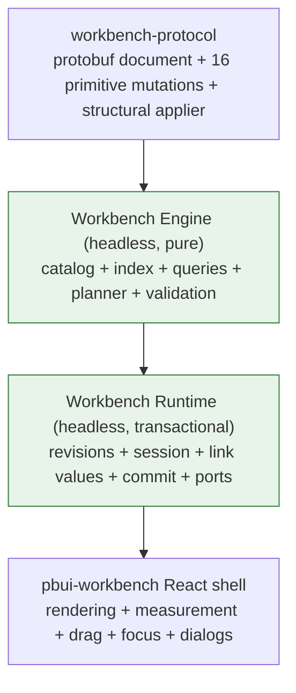
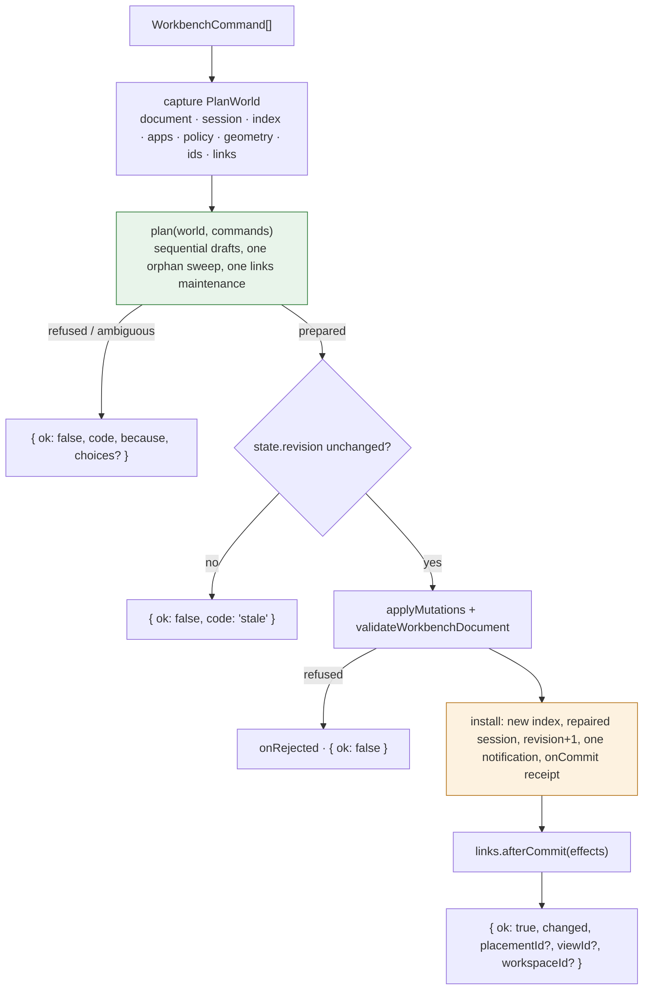

# PBUI Workbench Core: A Headless Engine, a Pure Planner, and the Hard Cutover of the React Shell

This report describes the implementation of PBUI-WORKBENCH-CORE-1, the ticket that split the pbui workbench into a React-free engine package (`@hyperslop-systems/workbench-core`) and a thin React shell (`@hyperslop-systems/pbui-workbench`), on 2026-09-03. It covers the defects the old workbench had and the evidence for each, the domain model the new engine is built on, the four-layer architecture and the first-version simplifications chosen against the ideal design, the engine's modules with excerpts from the code that landed, the shell cutover, the verification strategy, the decisions and deviations recorded while building, and what is still open. The purpose is to let an engineer who has not read the ticket understand the system well enough to extend it, and to record why each boundary sits where it does.

The reader is assumed to know the earlier workbench reports: the shell over a protocol document ([[PROJ - PBUI Workbench Tiles - A Reusable Server-less Shell and the Chat Agent on Tiles]]), logical views with linked placements ([[PROJECT REPORT - PBUI Application Views - Logical Views, Linked Placements, and the Launcher Foundation]]), the rebalance engine ([[PROJ - PBUI Rebalance - Layout Repair, Proposal Slates, and Placement Gestures]]), and the link kernel ([[PROJECT REPORT - PBUI Linked Tiles - Landing the Binding Algebra in the pbui Workbench]]). This ticket did not change what those systems decide. It changed where the deciding code lives, what it is allowed to touch while deciding, and through which door its decisions reach the document.

> [!summary]
> - Planning is now pure. The old `plan()` created a shadow store but handed the live link runtime to the handlers, so previewing an identity merge incremented the runtime revision and created a class `σ1` without a commit. The ticket's probe recorded that defect; the inverted probe now passes against `core.preview`.
> - There is one semantic door. `core.execute(command, { geometry })` captures state, plans against immutable values, checks one coarse revision, applies the whole mutation batch, validates, appends links maintenance, installs once, and only then runs the planned runtime effects. Raw batches, restore, reset, and sync adoption go through the same gateway.
> - Every "put this application or view somewhere" verb of the old 1,407-line `verbs.ts` is one `view.show` command whose identity axis (`resolveView`) and spatial axis (`resolvePlacement`) are resolved independently and joined by `materialize`. Geometry reaches the planner as a measured value, never as a DOM.
> - Phases 0–7 are committed (`9822ba8` through `580f1a9`); the 44 Phase 0 goldens replay through the core with three deliberate differences; the rebalance preservation law has a property test; sync preserves whole batches. Phases 8 (consumer migration, deletion audit) and 9 (release audit) are not done, and the in-repo consumers do not compile at the current commit.

## 1. Project status

The work lives on the pbui branch `task/consolidate-pbui-kernel`. The ticket workspace is at `/home/manuel/workspaces/2026-09-01/add-plot-editor/pbui/ttmp/2026/09/03/PBUI-WORKBENCH-CORE-1--hard-cutover-consolidation-of-the-workbench-into-a-reusable-composable-core/`; the design guide is `design-doc/01-intern-guide-to-the-pbui-workbench-core-consolidation-and-hard-cutover.md` (§§6–15 the ideal design, §16 the chosen implementation, §17 the phases, §18 the deletion list), the scope record is `design-doc/02-version-one-simplification-decisions.md`, and the diary `reference/01-investigation-diary.md` has fourteen steps: five of research and design, then one per implementation phase.

| Phase | Deliverable | Code commit |
|---|---|---|
| 0 | 44 command→transition goldens with deterministic ids; consumer inventory; `workbench-core` skeleton with the React/DOM fence | `9822ba8` |
| 1 | Protocol `IdGenerator`; `createWorkbenchClient` deleted; core manifests, six-map index, on-demand queries, essential validation, layout builders, structured parse | `54beaf4` |
| 2 | Policy, slot-aware initial-document policy, session repair, `createWorkbenchCore` with a validated apply/replace gateway, `defineWorkbenchApp` | `dfab835` |
| 3 | Command algebra, pure planner with generalized `view.show`, `execute`/`preview`, links planned as data; goldens replayed; purity probe inverted | `98d34a6` |
| 4 | Raw batches and replacement pass links maintenance and runtime cleanup; door-equivalence test | `93724d5` |
| 5 | Rebalance engine moved to `workbench-core/rebalance` with the preservation law and a property test; `measureGeometry` and the shell-local store | `f909b1e` |
| 6 | React shell over the core; old assembly, store, verbs, link handlers deleted; describe, persistence, sync moved to the core; READMEs | `4fa53f1` |
| 7 | Batch-preserving sync outbox | `580f1a9` |
| 8 | Consumer migration and deletion of legacy symbols | not started |
| 9 | Release audit, browser smokes, versions | not started |

Each code commit is paired with a docs commit that adds the diary step and the changelog entry (`75c0fe3`, `69ee5d8`, `429f550`, `1fd7259`, `b2f19d3`, `65023ae`, `5370102`, `1515592`); the ticket documents themselves were first committed as `e9ce3ed`.

The test picture at `580f1a9`, as recorded in the diary and the changelog:

| Package | Baseline at `04d1d7c6` | Now |
|---|---|---|
| `workbench-protocol` | 3 files, 48 tests | 40 tests (the eight configured-client tests were deleted with `createWorkbenchClient`) |
| `workbench-core` | did not exist | 25 test files; 171 tests after Phase 6 plus the 13 sync tests of Phase 7 |
| `pbui-workbench` | 31 files, 281 tests | 22 files, 114 tests (the engine tests, the goldens, and the rebalance suites moved to the core) |

The size picture: the old `verbs.ts` was 1,407 lines and the root barrel 188 lines with 64 `export` statements; the shell's production source was about 10,001 lines. Now the core's production source is 5,898 lines (which includes the rebalance engine that moved in) and the shell's is 4,391. Phase 6 alone was 93 files changed, 2,000 insertions and 7,026 deletions.

The in-repo consumers (pbui-chat, pbui-sandbox, pbui-ecommerce, pbui-plotscript, pbui-editor) do not compile against the new shell at this commit; the diary says so explicitly at Step 13, and the root `pnpm -r typecheck` is red until Phase 8 lands. This report describes the packages as they stand, not a released state.

## 2. The problem

The workbench that existed at commit `04d1d7c6` had strong primitives and a wrong composition boundary. The protocol package (`packages/workbench-protocol`) defined a protobuf document with sixteen primitive mutation arms and a structural applier; the Go host (`pkg/workbench`) applied a batch and then validated the whole graph. Above that, one package, `pbui-workbench`, held everything else: a store that mixed the durable document, the semantic session, and the transient dialogs; a 1,407-line `verbs.ts` that combined command syntax, identity policy, binding defaults, graph queries, DOM measurement, mutation construction, link maintenance, local UI state, and execution; and a `createWorkbench()` that constructed all of it plus five bound React components.

The guide's §5 lists fifteen findings, each with a file-and-line citation into that commit. They are the specification of what the cutover had to fix, so they are worth stating in full.

| Finding | Severity | Evidence at `04d1d7c6` | Correction |
|---|---|---|---|
| F1 planning mutates the live link runtime | critical | `createWorkbench.tsx:101-125` passes the real `runtime` to shadow handlers; `links/handlers.ts:146-150` applies effects to it | link planning returns effects as data; only commit interprets them |
| F2 the plan algebra is narrower than the command algebra | high | `WorkbenchState` holds launcher, rebalance, link mode, chooser, palette (`store.ts:12-37`); `WorkbenchPlan.finalState` captures four fields (`types.ts:148-155`) | shell actions leave the command union |
| F3 one documented commit pipeline does not exist | high | verb handlers wrap the store with link maintenance (`verbs.ts:620-640`) but `Workbench.mutate` calls the store directly (`createWorkbench.tsx:166`); `replaceDocument`, restore, reset, sync adoption bypass it | one gateway |
| F4 freshness uses object identity | high | `applyPlan` accepts when `current.document === plan.baseDocument` (`createWorkbench.tsx:149-153`), which ignores runtime, geometry, catalog | explicit revision precondition |
| F5 sync replay tests syntax, not meaning | high | one-by-one `applyMutation` replay (`sync.ts:218-241`) | batch-level rebase with conflicts |
| F6 batch boundaries disappear in sync | medium-high | flat `Mutation[]` outbox (`sync.ts:136-139,368-373`); `onInvalid: "isolate"` sends single mutations (`sync.ts:335-343`) | one outbox entry per committed batch |
| F7 duplicated high-level clients drifted | medium-high | `builders.ts:285-500` `createWorkbenchClient` reimplements binding/replace/link policy; no production caller | delete it |
| F8 document replacement is under-validated | medium-high | `parseDocument` checks format and tree shape only; `replaceDocument` checks nothing | complete-enough local validation with Go codes |
| F9 identity and spatial policies are entangled | medium | repeated branches in `split`, `place`, `placeAt`, `openAt`, `openView`, `replace`, `link` (`verbs.ts:794-1038`) | `resolveView` and `resolvePlacement` |
| F10 one privileged binding slot | medium | apps declare many `documentSlot` ports but `BindingConfig` fills only `source` (`verbs.ts:566-575`) | slot-aware policy |
| F11 terminology leaks visual ownership | medium | `tile.close`, `tile.split`, `tile.link`, `tile.replace` manipulate placements | `placement.*` |
| F12 orphan-view policy is implicit | medium | handlers delete orphans after link, replace, close, delete (`verbs.ts:530-538,1109-1126,1185-1202`) | one central sweep |
| F13 semantic and React catalogs are coupled | medium | headless use requires a descriptor with `Component`, tone, prose (`apps.ts:22-67`) | manifest and presentation projections |
| F14 graph knowledge is recomputed | medium | 179 uses of the tree-query names across sources and tests | one index per revision |
| F15 the barrel does not communicate stability | low | 64 exports, no README | small root, documented subpaths |

F1 is the one that was proven rather than argued, and it deserves a closer look because it shaped the whole design. The imported assessment claimed planning was impure; the ticket did not repeat the claim, it tested it. The probe (`scripts/01-plan-purity-probe.historical.ts`) builds a two-tile workbench of `table` and `plot`, each with an `inout` selection port, emits a value on the left port, and plans an `identity.add(prefer-left)` between the two. Identity merging is the operation that produces a runtime effect (`seed-class`), which an ordinary follow does not; that is why it was chosen. The recorded output:

```json
{"planOk":true,"documentUnchanged":true,"runtimeRevisionBefore":1,"runtimeRevisionAfter":2,"classCountBefore":0,"classCountAfter":1,"classIdsAfter":["σ1"]}
```

`documentUnchanged` is true: the shadow store protected the document. `runtimeRevisionAfter` is 2 where it began at 1, and a class `σ1` exists: the live runtime changed under a call whose documented contract was "preflight without touching the real workbench". A mounted tile reading its class cell would have seen a merge nobody committed, and a later failure would have left the effect behind. The probe had to run under Vitest rather than `tsx` because importing the old package graph reached CSS-bearing React modules even for a headless operation, which is itself a small demonstration of F13.

The other structural fact worth stating up front is scope. A workspace scan found importing files in five repositories (pbui 87, rag-ttc 45, agentlogic 10, turboproof 9, hyperblog 7), including a Redux adapter in turboproof and a server-backed product in rag-ttc. A hard cutover of the public API is therefore a cross-repository event, and the inventory that fixes who imports what (`reference/02-consumer-inventory-and-public-surface.md`) was produced in Phase 0 so Phase 8 can migrate against a list rather than a search.

## 3. The domain model

The workbench protocol (`proto/hyperslop/pbui/workbench/v1/workbench.proto`) defines five identities, and the whole engine rests on keeping them distinct.

| Entity | Role | Owns | Does not own |
|---|---|---|---|
| Application manifest | executable type | app id, cardinality, clone policy, ports | a particular open view |
| `AppView` | logical instance | app id, title, document bindings | geometry |
| Placement (`Node.leaf`) | spatial occurrence | placement id and a reference to a view | application state |
| Workspace | spatial context | one binary placement tree | browser selection |
| `DocumentPayload` | durable resource | opaque format, version, body | application interpretation |

The invariant is `application ≠ view ≠ placement ≠ document ≠ workspace`. Two placements may reference one view; changing the view's title changes both tiles; closing one placement does not delete the view while the other remains; an independent duplicate creates a second view and does not duplicate the documents the first was bound to.

Geometry is a tree and semantics are a graph. Each workspace holds a binary tree:

```text
Layout ::= Placement(viewId)
         | Split(direction, ratio, Layout, Layout)
```

The workbench as a whole is not a tree. Placements point into a shared view map, views point into a shared document map, and persistent links point between view ports. The guide formalizes the document as `D = (R, V, W, L)` with resources, views, workspace trees, and link topology, and the catalog `A` outside it, with `app : V → A`, `place : P → V`, and `bind ⊆ V × Slot × R`. A view may have many placements, and that is exactly why walking every workspace tree inside every command (F14) was conceptually wrong as well as slow: the questions commands ask are graph joins, and a graph join wants an index.

The model also separates four lifetimes of state, which the old `WorkbenchState` had merged:

| Lifetime | Examples | Where it lives now |
|---|---|---|
| durable document | workspaces, views, bindings, the `pbui.links` document, application documents | `WorkbenchCoreState.document`, serialized and synced |
| semantic session | selected workspace, active placement | `WorkbenchCoreState.session`, browser-only |
| semantic runtime | emitted port values, context cells, identity-class cells | `LinkRuntime`, in memory, reconstructed on reload |
| shell UI | launcher open, rebalance modal, connect mode, chooser, palette, focus | `WorkbenchShellStore`, component-local |

The ownership boundary follows from the lifetimes. The workbench owns identity, bindings as opaque ids, layout and feasibility policy, link topology between declared ports, commands and their planning, validation, serialization, sync, and the headless description. Applications own what a payload means, their own state, how a view renders, and their titles and launcher prose. The React shell owns DOM measurement, focus and pointer mechanics, transient modes and dialogs, presentation, and the translation of gestures into commands.

## 4. The architecture: four layers, and what version one simplified

The ideal design in the guide's §§6–15 has four explicit layers:



with the canonical operation `plan(snapshot, command) → prepared transition | refusal | ambiguity` followed by `commit(prepared, current) → receipt | stale`. A fully elaborated prepared transition would carry protocol mutations, session effects, runtime effects, dependency-specific preconditions (document revision, per-module runtime revision, geometry revision, definition revision, entity fingerprints), created and affected ids, and an explanation.

The chosen first version, §16, keeps the boundaries that address observed defects and defers the machinery that current usage has not justified. The decisive simplifications, from `02-version-one-simplification-decisions.md`:

| Concern | Ideal | Chosen (S-number) |
|---|---|---|
| Plan freshness | dependency-specific preconditions | one coarse local revision; plan and apply inside `execute` (S1) |
| Plan lifetime | prepared transitions committed later | `preview` is advisory; acceptance re-executes the command (S2) |
| Public assembly | definition → engine → runtime → React | `createWorkbenchCore(...)` then `createWorkbenchShell(...)` (S3) |
| Shell follow-up | planned `AfterCommitIntent[]` | shell reacts to returned ids (S4) |
| Shell state | a controller per transient feature | one shell-local store; placement mode stays a controller (S5) |
| Extensibility | generic `WorkbenchModule` registry | one explicit links collaborator (S6) |
| Validation | full TS/Go parity | essential structural, catalog, binding checks; server authoritative (S7) |
| Orphans | reject every committed orphan | core-generated commands never create new ones; imported ones stay legal (S8) |
| Sync | store commands, re-plan intent | preserve whole batches; conflict destructive batches (S9) |
| Geometry | versioned snapshot with preconditions | measured immediately before execution (S10) |
| App definition | compiled definition with fragments | `defineWorkbenchApp({ manifest, presentation })` (S11) |
| Results | rich prepared/refused/stale receipts | `{ ok, changed, placementId?, viewId?, workspaceId? }` or `{ ok: false, code, because, choices? }` (S12) |
| Index | comprehensive materialized projection | six structural maps plus on-demand queries (S13) |

Two things were explicitly not simplified (K1, K2): explicit non-durable effects remain a distinct representation rather than being folded into a session patch, and `view.show` keeps its two-axis normal form. The engine and runtime layers of the ideal design are one package in the chosen design, `workbench-core`, with the planner pure internally and the stateful executor around it; the package boundary that matters is the one between that package and React.

The implemented data flow through `execute`:



Nothing left of the `install` box touches anything observable. That is the property F1 lacked.

## 5. The core's modules

The core's `README.md` gives the map; this section walks it in dependency order with the code that landed. All paths are under `/home/manuel/workspaces/2026-09-01/add-plot-editor/pbui/packages/workbench-core/src/`.

### 5.1 Manifests: the semantic half of an application

`apps.ts` defines what the engine knows about an application, and nothing a renderer needs:

```ts
export type ViewCardinality = "one" | "many";
export type DuplicatePlacement = "clone" | "link";

export interface WorkbenchAppManifest {
  readonly id: string;
  readonly viewCardinality: ViewCardinality;
  readonly duplicatePlacement: DuplicatePlacement;
  readonly ports?: readonly PortDeclaration[];
}

export function defineAppManifest(input: WorkbenchAppManifestInput): WorkbenchAppManifest {
  if (!input.id || input.id.trim() !== input.id) throw new Error(/* ... */);
  const viewCardinality = input.viewCardinality ?? "many";
  const duplicatePlacement = input.duplicatePlacement ?? (viewCardinality === "one" ? "link" : "clone");
  if (viewCardinality === "one" && duplicatePlacement === "clone") {
    throw new Error(`workbench-core: application "${input.id}" declares viewCardinality "one" and duplicatePlacement "clone"; a single view cannot be cloned`);
  }
  const ports = input.ports && input.ports.length > 0 ? definePorts(input.ports) : undefined;
  return { id: input.id, viewCardinality, duplicatePlacement, ...(ports ? { ports } : {}) };
}
```

The two axes replace the old `singleton` and `duplicable` booleans, whose negations had to be read together to know what a bare split would do. `"one"` is what the Go host enforces as `duplicate_singleton`; `"link"` means a duplicate places the same view again; `"clone"` mints an independent view with the same bindings. The contradiction `one` + `clone` fails construction rather than being resolved silently at split time. Document-bound behaviour is derived from ports: `isDocBound(app)` is true when a port declares `documentSlot`, and `documentSlots(app)` lists those port names in declaration order, which is the key set of `view.documents`. `createManifestCatalog` takes an explicit list and refuses a duplicate id.

### 5.2 The structural index and the on-demand queries

`graph.ts` materializes the six joins nearly every command asks for:

```ts
export interface WorkbenchIndex {
  readonly workspaceById: ReadonlyMap<string, Workspace>;
  readonly nodeById: ReadonlyMap<string, Node>;
  readonly workspaceByNodeId: ReadonlyMap<string, string>;
  readonly viewByPlacementId: ReadonlyMap<string, string>;
  /** In workspace order, then reading order within a tree. */
  readonly placementsByViewId: ReadonlyMap<string, readonly PlacementRef[]>;
  /** In `viewOrder`. */
  readonly viewsByAppId: ReadonlyMap<string, readonly string[]>;
}
```

`buildWorkbenchIndex(doc)` walks every workspace tree once, and a duplicate node id throws `WorkbenchDiagnosticError(duplicate_id)` at that point because two maps keyed by node id cannot represent it; every other malformation is validation's job. The index is rebuilt wholesale after every install; the guide records the decision not to maintain it incrementally before profiling shows a need (at the protocol's limits of 256 nodes and 128 views, a rebuild is cheap).

One detail from the diary matters for correctness: `viewsByAppId` is built from `doc.viewOrder`, not from the placement walk. An unplaced view (an imported orphan) must still count as a view of its application, or a singleton check would let a second one be created.

`queries.ts` holds the questions asked by a few commands, each answered by one scan in one place: `viewsUsingDocument`, `documentsWithFormat`, `orphanViewIds(doc, index)` (every id in `viewOrder` absent from `placementsByViewId`), `placementCount`, `firstPlacementOfView`, `workspaceOfView`, `isPlacement`, `leavesOfWorkspace`, `canClose` (a workspace keeps at least one tile), and `sameBindings`. The comment at the top of the file states the rule: a command that walks the document itself for any of these is a bug.

### 5.3 Essential validation with the host's codes

`validation.ts` implements the subset of `pkg/workbench/validate.go` that decides whether the engine can plan over a document at all: format and schema version, workspace count, node count and depth, required and duplicate ids, leaf→view references, split direction and ratio in `[0.05, 0.95]`, exactly two split children, the bijection between `views` and `viewOrder`, map-key/embedded-id agreement, trimmed titles, per-view binding count, and, when a catalog is supplied, `unknown_application`, `duplicate_singleton`, `unknown_binding`, and `unknown_document`. Byte limits, credential sniffing, and product payload validators are deliberately left to the server (S7).

The codes and paths are the host's, so a refusal reads the same whichever side produced it:

```ts
if (!slots.has(slot)) report("unknown_binding", bindingPath, `application "${app.id}" does not define binding "${slot}"`);
if (!doc.documents[documentId]) report("unknown_document", bindingPath, `document "${documentId}" does not exist`);
```

with `bindingPath` of the form `views["v-1"].documents["slot"]` and tree paths of the form `workspaces[0].tree.split.a.leaf.viewId`. One difference the diary flags for reviewers: the TypeScript validator collects every diagnostic while Go returns the first, so the first entry of the list is the one to compare with a Go refusal.

`document.ts` builds layouts through the protocol rather than by hand: `layout(spec)` issues a `viewCreate` per tile and a `workspaceCreate` with a tree assembled from the protocol's own `leafNode`/`splitNode`, then applies them with the shared applier, so whatever the builder accepts is exactly what a server running `pkg/workbench` accepts. `parseWorkbenchDocument(json, { apps })` returns `{ ok: true, document } | { ok: false, diagnostics }` and never throws, because persistence reads it on every load and a corrupt entry must fall back to a default layout while telling the caller why.

### 5.4 The command algebra and the generalized `view.show`

`commands.ts` is the boundary a button, an agent's tool call, and a remote caller all cross. What is not in it is as important as what is: launcher, rebalance dialog, connect mode, the relation palette, and the show chooser are shell actions.

```ts
export type WorkbenchCommand =
  | { kind: "placement.duplicate"; placementId: string; axis?: Axis }
  | { kind: "placement.close"; placementId: string }
  | { kind: "placement.swap"; a: string; b: string }
  | { kind: "placement.dock"; source: string; target: string; edge: Edge }
  | { kind: "placement.replaceWith"; source: string; target: string }
  | { kind: "placement.resize"; splitId: string; ratio: number; snap?: boolean }
  | { kind: "view.show"; view: ViewRequest; placement: PlacementRequest }
  | { kind: "view.configure"; viewId: string; title?: string; documents?: Readonly<Record<string, string>> }
  | { kind: "workspace.create"; name: string; layout?: LayoutSpec; workspaceId?: string; select?: boolean }
  | { kind: "workspace.rename"; workspaceId: string; name: string }
  | { kind: "workspace.delete"; workspaceId: string }
  | { kind: "workspace.clone"; workspaceId: string; name?: string; newWorkspaceId?: string; select?: boolean }
  | { kind: "workspace.rebalance"; workspaceId: string; tree: Node }
  | { kind: "session.selectWorkspace"; workspaceId: string }
  | { kind: "session.activatePlacement"; placementId: string | null }
  | WorkbenchLinkCommand;
```

`isWorkbenchCommand` checks the complete shape, not a kind prefix, because an agent's half-written command must be refused before it is planned. `describeWorkbenchCommand` gives each a one-line explanation. The `commands.*` builders (`duplicate`, `split`, `close`, `swap`, `dock`, `replaceWith`, `resize`, `activate`, `place`, `placeAt`, `open`, `replace`, `link`, `goTo`, `setTitle`, `rebind`, `selectWorkspace`, `createWorkspace`, `renameWorkspace`, `deleteWorkspace`, `cloneWorkspace`, `rebalance`) compile to the normal form; there is no second vocabulary.

`view.show` is the command that absorbed `app.place`, `app.placeAt`, `view.open`, `tile.replace`, `tile.link`, and `view.goTo`. Its two request types name the two questions each of those verbs used to answer with its own control flow:

```ts
export type ViewRequest =
  | { kind: "existing"; viewId: string }
  | { kind: "application"; appId: string; documents?: Readonly<Record<string, string>>; title?: string;
      reuse?: "manifest-default" | "same-bindings" | "never"; requestedViewId?: string };

export type PlacementRequest =
  | { kind: "navigate" }
  | { kind: "auto"; near?: string }
  | { kind: "split"; target?: string; edge?: Edge; axis?: Axis }
  | { kind: "replace"; target: string };
```

The mapping from the old verbs, frozen by the goldens at Phase 0 (diary Step 6), reads:

| Old verb | `view.show` normal form |
|---|---|
| `tile.split(p, dir, appId)` | `{ application(appId, manifest-default), split(target p, axis) }` |
| `app.place(appId, from?)` | `{ application(appId), auto(near: from) }` |
| `app.placeAt(appId, target, zone)` | `{ application(appId), split(target, edge) \| split(target) \| replace(target) }` |
| `view.open(appId, docs, near?/at?)` | `{ application(appId, documents, same-bindings), auto(near) \| split \| replace }` |
| `tile.replace(p, appId, docs?)` | `{ application(appId, documents), replace(p) }` |
| `tile.link(p, viewId)` | `{ existing(viewId), replace(p) }` |
| `view.goTo(viewId)` | `{ existing(viewId), navigate }` |

`planner/show.ts` resolves the two axes independently and joins them. The identity axis:

```ts
export function resolveView(world: PlanWorld, request: ViewRequest): ResolvedView | { kind: "refused"; code: string; because: string } {
  const { document: doc, index, apps } = world;
  if (request.kind === "existing") {
    const view = doc.views[request.viewId];
    if (!view) return { kind: "refused", code: "unknown_view", because: `view "${request.viewId}" does not exist` };
    return { kind: "existing", viewId: request.viewId, app: apps.get(view.appId) };
  }
  const app = apps.get(request.appId);
  if (!app) return { kind: "refused", code: "unknown_application", because: `application "${request.appId}" is not registered` };
  const reuse = request.reuse ?? "manifest-default";
  const requested = request.documents ?? {};
  if (reuse !== "never") {
    const existing = index.viewsByAppId.get(app.id) ?? [];
    if (app.viewCardinality === "one" && existing[0]) return { kind: "existing", viewId: existing[0], app };
    const byBindings = reuse === "same-bindings" || (reuse === "manifest-default" && isDocBound(app) && Object.keys(requested).length > 0);
    if (byBindings) {
      const twin = existing.find((viewId) => sameBindings(doc.views[viewId]?.documents ?? {}, requested));
      if (twin) return { kind: "existing", viewId: twin, app };
    }
  }
  const bound = resolveInitialDocuments(world.policy.initialDocuments, app, requested, doc, index);
  if (bound.kind === "refused") return { kind: "refused", code: bound.code, because: bound.because };
  return { kind: "create", viewId: request.requestedViewId ?? world.ids("v"), app, documents: bound.documents,
           ...(request.title ? { title: request.title } : {}), documentsRequested: request.documents !== undefined };
}
```

Singleton reuse, exact-binding deduplication, and slot-aware default binding are each one line here; in the old code each verb had its own copy. The spatial axis, `resolvePlacement(world, request, view)`, produces one of `navigate` (workspace and placement), `split` (target, axis, before/after), or `replace` (target). Its `navigate` helper looks for the view in the current workspace first and in any workspace second; `auto` navigates when the view is placed anywhere and otherwise splits beside `near`, the active tile, or the first; `split` resolves the axis from an edge, an explicit axis, or the longer rendered axis with the policy's headless fallback, and checks `canSplitPlacement` against the supplied geometry. One rule from the old `placeAt` generalized here: when a `split` carries neither edge nor axis and the target shows the policy's empty-placement application (a launcher pane, an empty state), the placement resolves to `replace` instead, so aiming at the centre of an empty pane fills it rather than halving it.

`materialize(world, view, placement)` turns the pair into mutations and a session patch. A `navigate` produces no mutation and a session change. A `replace` has three branches: an existing view is pointed at with `placementReplace` (a no-op when it is already there); a fresh application on a pane that owns its view is a `viewConfigure` that retargets in place, so the pane keeps its placement id and any product state keyed by view; a fresh application on a pane whose view is linked into other tiles mints a view and moves only this placement, because retargeting would silently change the twin too. A `split` mints the view when needed and appends a `placementSplit` beside the target, with ids minted in the order view, split, leaf, which is the old handlers' order and what keeps the goldens' ids aligned.

### 5.5 Plan, execute, preview

`planner/world.ts` fixes what a planner may read:

```ts
export interface PlanWorld {
  readonly document: WorkbenchDocument;
  readonly session: WorkbenchSession;
  readonly index: WorkbenchIndex;
  readonly apps: ManifestCatalog;
  readonly policy: WorkbenchPolicy;
  readonly geometry: GeometrySnapshot | null;
  readonly ids: IdGenerator;
  readonly links: WorkbenchLinks | null;
}
```

Values only: no store, no DOM, no runtime mutation methods, no React. The links collaborator is present, but as a value-returning planner; its `afterCommit` is not reachable from here. Each command handler returns a `FragmentOutcome`: `prepared` with mutations, an optional session patch, optional effects, and the ids it landed on; `refused` with a code and a sentence; or `ambiguous` with choices.

`planner/plan.ts` plans a sequence of commands as one transition. Each command sees the draft left by the previous one; the draft is a new `PlanWorld` with the mutations applied through the protocol applier and a rebuilt index. After the last command, three finalization steps run once: the orphan sweep deletes views that this batch made unreachable and that were not orphans before (so imported orphans stay legal, S8); the links collaborator appends its maintenance mutation; and a `forget-view-values` effect is derived for every `viewDelete` in the batch.

```ts
if (mutations.length > 0) {
  const before = new Set(orphanViewIds(world.document, world.index));
  const orphans = orphanViewIds(draft.document, draft.index).filter((viewId) => !before.has(viewId));
  if (orphans.length > 0) {
    const applied = step(orphans.map((viewId) => mutation({ case: "viewDelete", value: { viewId } })), undefined);
    if (!applied.ok) return { kind: "refused", /* ... */ };
  }
  if (world.links) {
    const upkeep = world.links.maintenance(world.document, mutations);
    if (upkeep) { /* step([upkeep]) */ }
  }
  for (const item of mutations) {
    if (item.body.case === "viewDelete") effects.push({ kind: "forget-view-values", viewId: item.body.value.viewId });
  }
}
```

The `expand` mechanism in the same file is how a link `show` that needs to spawn a tile becomes an ordinary sequence: the show handler returns two inner commands (a `view.show` with a pre-minted view id, then a `follow` or `bind` naming that view's port), and `run` plans them in the same draft loop so the follow's snapshot already contains the just-minted ports. The old shell did this through a "planner hook" over a shadow store; here it is the sequential draft.

`createWorkbenchCore.ts` holds the state and the doors. The state is one immutable object per install:

```ts
export interface WorkbenchCoreState {
  readonly document: WorkbenchDocument;
  readonly session: WorkbenchSession;
  readonly index: WorkbenchIndex;
  readonly revision: number;
}
```

and `execute` is the sequence in the diagram of §4:

```ts
execute(input, executeOptions = {}) {
  const revision = state.revision;
  const { commands, result } = planned(input, executeOptions.geometry);
  if (result.kind !== "prepared") return refusal(result);
  const { transition } = result;
  if (state.revision !== revision) return { ok: false, code: "stale", because: "the workbench changed while the command was planned" };
  if (!transition.changed) return { ok: true, changed: false, ...ids_of(transition) };
  let next = state.document;
  if (transition.mutations.length > 0) {
    const prepared = prepare(transition.mutations);
    if (!prepared.ok) { report(transition.mutations, prepared.diagnostics); options.onRefused?.(commands[0]!, prepared.code, prepared.because); return { ok: false, code: prepared.code, because: prepared.because }; }
    next = prepared.document;
  }
  install({ document: next, session: transition.session, ...(transition.mutations.length > 0 ? { mutations: transition.mutations } : {}) });
  links?.afterCommit(transition.effects);
  return { ok: true, changed: true, ...ids_of(transition) };
}
```

Planning is synchronous over a captured snapshot, so the revision check can only fail if a re-entrant listener installed during planning; it is kept explicit as the coarse precondition of S1. `preview` runs `planned` and returns `{ ok: true, changed, mutations, session, explanation, ...ids }` without installing anything and without running effects; it is advisory, and accepting it means calling `execute` again. A session-only command (activate, select workspace, navigate) installs a new state and notifies, but produces no `onCommit` receipt, because a receipt is what an outbox or persistence layer subscribes to and session changes never reach a server.

`install` builds the index, repairs the session (`repairSession` guarantees the selected workspace exists and the active placement is a leaf of it), increments the revision, notifies once, and then calls `onCommit` inside a try/catch whose failure is routed to `onPostCommitError` and never turns a committed batch into a refusal; an agent that saw a failure would retry and duplicate a change that already landed.

### 5.6 The links collaborator and effects as data

`effects.ts` is thirteen lines and carries the decision K1:

```ts
export type LocalEffect =
  | { readonly kind: "link-runtime"; readonly effects: readonly RuntimeEffect[] }
  | { readonly kind: "forget-view-values"; readonly viewId: string };
```

Session changes are not effects; they are part of the planned session, applied at install. Effects are the non-durable consequences (class cells seeded on merge, private values restored on split, values of a deleted view forgotten) that must run after the document is installed and must never run from `preview`.

`links/collaborator.ts` is the one explicit collaborator of S6, and its interface is the narrow method set decided in diary Step 6:

```ts
export interface WorkbenchLinks {
  readonly runtime: LinkRuntime;
  bind(apps: ManifestCatalog): void;
  readonly deps: LinkDeps;
  readonly labels: LinkLabels;
  snapshot(doc: WorkbenchDocument): LinkSnapshot;
  plan(command: Exclude<WorkbenchLinkCommand, { kind: "show" }>, doc: WorkbenchDocument, ids: IdGenerator): LinkPlanOutcome;
  maintenance(doc: WorkbenchDocument, mutations: readonly Mutation[]): Mutation | null;
  afterCommit(effects: readonly LocalEffect[]): void;
  afterReplace(doc: WorkbenchDocument): void;
  sourceOf(reference: SerializableReference): PortId | null;
}
```

`plan` calls the PBUI link kernel's `applyLinkVerb` on a snapshot and converts the result into one `documentPut` of the `pbui.links` payload (`linksChange`) plus a `link-runtime` effect; it does not call `runtime.apply`. `maintenance` inspects a batch for `viewDelete`, `viewConfigure` with a new `appId`, and `viewClone`, and returns the one mutation that drops or re-keys the affected terms and identity declarations, or null. `afterCommit` is the only method that writes the runtime, and only `execute` and `apply` call it. `afterReplace` is what a wholesale replacement needs instead of maintenance: with no mutation list, it reconciles the runtime against the new document's view set and forgets every emitted or attended value of a view that is gone.

When no `deps` are supplied, `bind` derives a type graph from the value types the manifests' ports declare, as isolated nodes; a product with a compiled presentation passes `presentation.linkDeps(...)`, which is the C19 fallback the kernel report recorded. The snapshot is cached per (document identity, runtime revision).

`links/runtime.ts` is the same subscribable store the shell had, moved into the core with no React; the shell's `useLinkRuntime` wraps it in `useSyncExternalStore`. `links/document.ts` reads and writes the `pbui.links` `DocumentPayload`; an empty state deletes the payload rather than writing an empty one.

### 5.7 One gateway

F3 said there were several doors into the document and only one of them maintained links. Now there are three public doors and one pipeline. `apply(mutations)` is the raw-batch door: it appends `links.maintenance(state.document, mutations)` to the batch, runs `prepare` (apply then validate), installs once, and runs the forget-values effects for every `viewDelete` in the batch. `replaceDocument`, `restore`, and `reset` share `replace`, which validates against the catalog, installs with a repaired session and no receipt, and calls `links.afterReplace`. `execute` is the third. There is no fourth: `install` and `prepare` are returned from `createWorkbenchCoreWithInternals` and discarded by the public `createWorkbenchCore`, so no caller can install a document that skipped validation.

The diary records one asymmetry as a deliberate rule (Step 11): a raw batch receives links maintenance but not the orphan sweep. A raw batch is taken to mean exactly what it says; the sweep is a service to commands, which express intent rather than mutations.

### 5.8 Geometry as a value

`geometry.ts` defines what the shell measures and the planner reads:

```ts
export interface GeometrySnapshot {
  readonly viewport?: Rect;
  readonly divider: { readonly inline: number; readonly block: number };
  readonly placements: ReadonlyMap<string, Rect>;
  readonly splits: ReadonlyMap<string, Rect>;
}
```

and the pure math over it: `paneRatioBounds(size, minPx, minFraction)`, `canSplitPlacement`, `splitRatioBounds`, `longerAxis`, and `layoutFits`. Every function takes `GeometrySnapshot | null`, and null has a defined meaning: a split is feasible, the axis is the policy's `headlessAxis` (default `"row"`, decided at diary Step 6 for the guide's open question 5), and ratio bounds are the relative floor `[minFraction, 1 − minFraction]`. `geometry.test.ts` pins both halves: without geometry every fallback is deterministic; with geometry the rendered pixel minima decide, so a 250px-wide tile cannot split side by side under a 240px minimum, and a 400px-tall column split gives bounds of `160/390` on each side.

The old handler required `root(): HTMLElement | null` and queried `[data-placement-id]`, `getBoundingClientRect`, and CSS inside semantic code. The fence test (`fence.test.ts`) now refuses any production module of the core that imports `react` or `react-dom`, mentions `HTMLElement`, `Element`, or `DOMRect`, or accesses a bare `document.`, `window.`, `localStorage.`, or `navigator.` (with `persistence/` and `sync/` allowed guarded `globalThis` access and still no React), and asserts that `typeof document` is `"undefined"` in the test environment, which Vitest runs as `node`.

### 5.9 The rebalance law

The rebalance engine (`analysisTree`, `propagate`, `projectLower`, `strategies`, `repairPass`, `structural`, `slate`, `config`, `configDocument`) moved by `git mv` into `rebalance/` and is exported as the `./rebalance` subpath; the guide's §4.8 and §12.4 are explicit that these are distinct algorithms whose integration, not whose mathematics, was the consolidation target. What the ticket added is the law:

```ts
export function placementMapOf(tree: Node | undefined): ReadonlyMap<string, string> {
  return new Map(leaves(tree).map((leaf) => [leaf.id, leaf.body.case === "leaf" ? leaf.body.value.viewId : ""]));
}

export function preservesPlacements(before: Node | undefined, after: Node | undefined): boolean {
  const a = placementMapOf(before);
  const b = placementMapOf(after);
  return a.size === b.size && [...a].every(([id, viewId]) => b.get(id) === viewId);
}
```

`planRebalance` in `planner/workspace.ts` applies the same predicate before emitting a `workspaceSetTree`, refusing with `rebalance_changes_membership` when a tree adds, drops, or retargets a leaf, and with `invalid_tree` for a malformed one. The law is stronger and more useful than "same leaf count": a tree that swaps which view a placement id shows has the same leaf count and is not a rebalance. Raw `workspaceSetTree` remains a protocol-level input available through `apply`; the command is the normal door.

### 5.10 Batch-preserving sync, and persistence

`sync/index.ts` is the union of the agentlogic and turboproof loops that the earlier report described, rewritten so the outbox holds whole committed batches:

```ts
export interface OutboxEntry {
  readonly id: string;
  readonly mutations: readonly Mutation[];
  readonly destructive: boolean;
}
```

`enqueue(mutations)` makes one entry per batch (wired as the core's `onCommit`, so exactly the batches that committed locally are queued); `destructive` is true when the batch contains a `workspaceSetTree`. `send` concatenates whole entries into one request with a request id hashed from the content, so a retry after a timeout is idempotent and a correction is not mistaken for a replay. The rebase after a 409:

```ts
const rebase = (server: WorkbenchDocument, queue: readonly OutboxEntry[], afterConflict: boolean) => {
  let document = server;
  const kept: OutboxEntry[] = [];
  const dropped: OutboxEntry[] = [];
  const conflicted: OutboxEntry[] = [];
  for (const entry of queue) {
    if (afterConflict && entry.destructive) { conflicted.push(entry); continue; }
    try { document = applyMutations(document, [...entry.mutations]); kept.push(entry); }
    catch (error) { if (!(error instanceof MutationError)) throw error; dropped.push(entry); }
  }
  drop(conflicted, "conflict");
  drop(dropped, "rebase");
  return { document, kept };
};
```

A batch either applies whole or is dropped whole; a destructive batch built on a revision that moved is reported as a `conflict` even when it would still apply structurally, because a stale tree replacement that applies is exactly the case that silently overwrites another tab's layout (F5). A 422 with `onInvalid: "isolate"` re-sends the batches one at a time, never halving one; the test pins the request sizes `[3, 2, 1]` and states that `[3, 1, 1, 1]` must never occur. `adopt` (a normal response or a stream refetch) rebases the queue without the conflict rule; the diary flags this for review, since a stream refetch arriving while a rebalance is queued will replay it if it still applies. The module header carries the concurrency statement from the guide's §15.5: optimistic single-user, multi-client persistence with batch-level conflict detection, not collaborative editing.

`persistence/index.ts` keeps the envelope to the document plus the selected workspace. `readWorkbenchSnapshot(key, { apps, onDiscard })` takes the catalog so a stored layout naming a retired application falls back to the default layout with a reason rather than failing core construction (see §8). `createLocalPersistence(core, { key })` subscribes to the core's state rather than to `onCommit`, because a replacement and a workspace switch both change what a reload should show and neither produces a receipt; writes are debounced trailing and flushed on `pagehide`.

## 6. The React shell cutover

Phase 6 turned `pbui-workbench` into an adapter and renderer. The files that defined the old semantics (`createWorkbench.tsx`, `store.ts`, `verbs.ts`, `apps.ts`, `document.ts`, `describe.ts`, `persistence.ts`, `sync.ts`, `links/{handlers,runtime,snapshot,document}.ts`) are deleted, not aliased.

`createWorkbenchShell({ core, apps })` (`packages/pbui-workbench/src/createWorkbenchShell.tsx`) checks that every presentation has a manifest in the core, throws if the core has no links collaborator (the tiles read ports), and builds the `WorkbenchShell`: the core, the presentation registry, the shell-local store, the placement controller, `execute`/`preview`/`dispatch`/`perform`/`apply`, the React subscriptions (`useDocument`, `useCoreState`, `useShellState`), root and measurement helpers, `focusPlacement`, `describe`, and five bound components. Its `execute` is the one place geometry is measured:

```ts
function needsGeometry(commands: readonly WorkbenchCommand[]): boolean {
  return commands.some((command) => {
    switch (command.kind) {
      case "placement.duplicate": case "placement.dock": case "placement.resize":
      case "view.show": case "workspace.create": case "show":
        return true;
      default:
        return false;
    }
  });
}

const execute = (input) => {
  const commands = Array.isArray(input) ? input : [input];
  const geometry = needsGeometry(commands) ? measure() : null;
  const result = core.execute(commands, geometry ? { geometry } : {});
  if (!result.ok && result.code === "ambiguous" && result.choices && commands.length === 1 && commands[0]!.kind === "show") {
    shell.dispatch({ kind: "show.chooser.open", command: commands[0], choices: result.choices });
  }
  return result;
};
```

`createWorkbench({ apps: WorkbenchApp[], initial, links?, ...coreOptions })` is the convenience most products use: it builds the presentation registry, derives badge labels from presentation titles, constructs the links collaborator from `LinkDeps` or accepts one already built, creates the core over `manifestsOf(apps)`, and calls `createWorkbenchShell`. Keeping the name and the shape of this convenience is what let most stories and tests change only in what they read and how they act.

`defineWorkbenchApp({ manifest, presentation })` in `app.ts` produces both projections from one declaration; the manifest's id is spread last so a spread presentation cannot override it (a bug the shell's own tests found, diary Step 13). `labelOfView(view, presentation)` is the one spelling of a tile's label, used by the tile bar, the launcher, the badges, and `describe`.

The shell-local store (`shellState.ts`) holds the five transient facts the old `WorkbenchState` mixed into the semantic store:

```ts
export interface WorkbenchShellState {
  readonly launcher: { readonly from: string | null } | null;
  readonly rebalanceOpen: boolean;
  readonly linkModeOpen: boolean;
  readonly showChooser: { readonly command: Extract<WorkbenchCommand, { kind: "show" }>; readonly choices: readonly Choice[] } | null;
  readonly relationPalette: { readonly destination: string; readonly source?: string } | null;
}
```

with a reducer over `WorkbenchShellAction` (`launcher.open/close`, `rebalance.open/close`, `link.mode.open/close`, `show.chooser.open/close`, `relation.palette.open/close`). `WorkbenchVerb = WorkbenchCommand | WorkbenchShellAction` is the union a product's verb router sees; `perform(verb)` dispatches a shell action or executes a command and returns whether it landed. Placement mode stays its own controller (`placement.ts`) because its aiming lifecycle is asynchronous: the launcher's `beginCarry` arms it with an `accept` callback that executes `commands.placeAt(appId, aim.placementId, aim.zone)`, and the resolved outcome decides whether to focus the placed tile or fall back to `commands.place(appId)`.

The show chooser illustrates the boundary. The old code kept a kernel `ShowResolution` object in the store. The new one keeps the `show` command and the `choices` the core returned, groups them by candidate-id prefix, and re-executes the command with `candidateId`; no kernel object crosses the shell boundary.

The components read core selectors and issue commands. `Tile.tsx` resolves the view from `useDocument()` and the presentation from `workbench.apps`, computes `canClose` and `placementCount` from the index, wires `useTileDrag` to `commands.swap`, `commands.dock`, and `commands.replaceWith`, the frame's split and close buttons to `commands.duplicate` and `commands.close`, and the per-pane launcher button to `dispatch({ kind: "launcher.open", from })`; activation on pointer-down capture is `commands.activate`. The per-tile error boundary remains. `RebalanceDialog.tsx` computes its geometry from `workbench.measure()` (`rebalanceGeometry` reads the viewport and the thinner divider dimension), applies a resize proposal as a raw batch through `workbench.apply` (because `placement.resize` would re-clamp each ratio against pre-repair geometry, which refuses compound repairs), applies a tree proposal through `commands.rebalance`, and undoes through the same command rather than a replacement, so persistence and outbox observers see it.

`describe.ts` moved into the core with two inputs made explicit: a `presentations(appId)` lookup for titles and prose, and a `geometry` value for per-tile rectangles. The shell's `describe({ geometry: true })` measures and passes both.

## 7. Verification

The strategy was to freeze behaviour before moving it, then prove the moved code reproduces it.

Phase 0 wrote 44 goldens (`packages/pbui-workbench/src/goldens/transitions.test.ts`, snapshot preserved as ticket `scripts/03-phase0-goldens.snap`) against the old handlers. Each golden captures the exact protocol batches (through `onMutate`), the session, the returned value, the view order, and the leaf→view map per workspace, with `crypto.randomUUID` stubbed by a zero-padded counter so ids read `v-00000001-0000`. The scenarios cover every placement verb, every identity/placement combination `view.show` would absorb, view and workspace verbs, and the link lifecycle (follow, close-source maintenance, app replacement, clone re-keying, identity.add, show spawn). The rendered-axis rule was frozen with a fake root whose `getBoundingClientRect` was stubbed per placement.

Phase 3 replayed the same scenarios through the core (`packages/workbench-core/src/goldens/transitions.test.ts`, 45 cases) with `sequentialIds()` producing the same thirteen-character id shape, and the same observable shape, so a diff between the two snapshot directories is the review of the cutover. The diary reports identical batches in 41 of 44 cases, with three intentional differences (§8). The ids line up because the planner mints in the old order: view, then split, then leaf.

The purity probe was inverted rather than deleted. `execute.test.ts` builds the same two-tile identity scenario, subscribes a listener to the core and one to the link runtime, previews the merge, and asserts that `core.getState()` and `links.runtime.getState()` are the same objects as before, the runtime revision is unchanged, the class count is zero, and neither listener fired; a second test executes the same merge and asserts the document is installed first, the runtime revision increments once, and `σ1` now exists. The ticket-local twin (`scripts/02-plan-purity-probe-core.test.ts`) runs the historical probe's exact shape against `core.preview` and passes; its captured output is `scripts/02-plan-purity-probe-core.output.txt`.

`gateway.test.ts` is the door-equivalence test for Phase 4: a close command and a raw `closePlacement` batch, on two identical linked workbenches, produce byte-identical committed batches and identical `pbui.links` payloads, and both forget the deleted view's runtime values; a raw batch whose second half is invalid is refused whole with the state object unchanged; replacement forgets only the vanished views; restore and reset validate. The first run of this test failed on a setup mismatch (only one side had emitted a value), which the diary records as a test defect rather than a gateway difference.

`rebalance/law.test.ts` generates trees from a small grammar (depth 1–3, sixteen shapes, three ratio classes, two configs) and asserts `preservesPlacements` for every `set-tree` proposal `buildSlate` emits, plus explicit refusals for a dropped, added, or retargeted leaf. The diary notes the grammar is small (depth ≤ 3) and does not cover the 12-tile perf fixture.

`sync/sync.test.ts` ports the old loop's guarantees (order, in-flight survival, bootstrap adoption, request-id stability and distinction, backoff, 404 detach, stream refetch) and adds the §19.6 cases: whole-batch rebase drop, destructive conflict, per-batch isolation, a single invalid batch dropped whole, and link topology plus maintenance as one batch.

The remaining core tests cover the index against slow reference traversals (`graph.test.ts`), the on-demand queries, every validation code, the layout builders and parse, policy compilation, the binding policies, the constructor's atomicity and post-commit isolation, geometry fallbacks, commands, and describe and persistence (ported from the shell). The shell's 114 tests are the old Surface, Launcher, WorkspaceStrip, placement, rebalance, link, connect, derive, identity, and show tests, ported to the new API with the same DOM assertions.

## 8. Decisions and deviations recorded in the diary

The diary records each place where the implementation had to decide something the guide left open, or where the new behaviour deliberately differs from the old.

**The React fence is on the core's sources, not on its module graph** (Step 6). The core cannot avoid importing `@hyperslop-systems/pbui` for the link kernel, and that package's runtime entry loads React. The resolution: the fence forbids `react` and DOM access in every non-test module of the core, the core's tests run in Vitest's `node` environment with no DOM, and React is a devDependency of the core only so the pbui bundle can be imported in tests. A React-free `@hyperslop-systems/pbui/links` build entry is recorded as a follow-up.

**Core modules never name a parameter `document`** (Step 8). The fence's DOM regex matched `document.views` in `graph.ts`, `queries.ts`, and `validation.ts`. Rather than weaken the fence, every core module renames the parameter to `doc`; one missed rename surfaced at runtime as `invalid_json: document is not defined`. At Step 10 the regex was refined to ignore property access preceded by a dot (`world.document.views`), which is why the fence's pattern begins with `(^|[^.\w])`.

**Replace now activates the target pane** (Step 10). The old code activated the target after `placeAt`/`openAt` replace but not after `tile.link` or `tile.replace`. The unified `replace` materialization always sets `activePlacementId` to the target. Three goldens show `activePlacementId` set where it used to be null; kept, because the pane the user just changed is the natural active one.

**Rebinding an application that declares no document slot is refused** (Step 10). The old code wrote the binding and the server would have rejected the batch. `resolveInitialDocuments` and validation refuse with `unknown_binding` before a view exists. The core golden for `setTitle`/`rebind` says so in a comment and rebinds a `sku` view instead of `notes`.

**The empty-pane fill is generalized** (Step 10). The old code filled an empty pane only from `placeAt(center)`; `resolvePlacement` applies the rule to any `split` request with neither edge nor axis, including `openView … at center`. Flagged for a second pair of eyes.

**The initial document is validated at construction** (Step 9). A stored layout naming an application that is no longer registered used to render an empty tile; it now throws `WorkbenchDiagnosticError` from `createWorkbenchCore`. The door that falls back instead is `readWorkbenchSnapshot({ apps })`, so products must pass their manifests to it in Phase 8.

**`followTheCrowd` fills every declared slot** (Step 9), including a slot the caller left out of a non-empty request, where the old `BindingConfig` used a non-empty request verbatim. For a single-slot app it reproduces the old golden exactly; the multi-slot case is a deliberate change with no golden.

**The orphan sweep runs once, after the last command** (Step 10), not immediately after a close; and an ambiguous `show` offers every ranked candidate (six in the test), not only the winners, so a chooser can explain the runners-up. Both were first-run test expectations that were wrong about the code.

**Raw batches get links maintenance but not the orphan sweep** (Step 11), as stated in §5.7.

**Two `Rect` types exist on purpose** (Step 12): the rebalance engine's `{x, y, w, h}` under the subpath and the geometry snapshot's `{x, y, width, height}` at the root; unifying them would have edited every rebalance module for no semantic gain.

**`adopt` rebases without the conflict rule** (Step 14); only a 409 marks destructive batches as conflicts.

**Smaller items**: `perform` returns true for an ambiguous show because the chooser opened, matching the old boolean, and agents should read `execute`'s result instead; `createWorkbenchShell` throws when the core has no links collaborator while `createWorkbench` always installs one; a dependant package resolves `workbench-protocol` and `workbench-core` through their built `dist/`, so the rule for the ticket was to rebuild them before testing a dependant; `slate.perf.test.ts` is a wall-clock guard that failed once under parallel load in three separate phases and passed alone each time.

The guide's §23 open questions were settled at Step 6: persistence and sync as `/persistence` and `/sync` subpaths; effects as the two-member `LocalEffect` union; the collaborator's method set as listed in §5.6; selected-workspace persistence as an explicit envelope field; headless axis `"row"`; no-op success as `{ ok: true, changed: false }`; imported orphans accepted.

## 9. What remains

Phases 8 and 9 are open, and the current commit is not a releasable state.

Phase 8 migrates consumers in the guide's order and then deletes the §18 symbols. In the repository: pbui-workbench's own stories and tests are done; pbui-chat (22 importing files; it uses `plan()` for atomic multi-verb agent tools, `describeWorkbench`, `readWorkbenchSnapshot`, `workbench.mutate` in the demo NotesApp), pbui-sandbox, pbui-ecommerce (26 files; `createWorkbench` with `links` deps, `workbench.perform`, `useDocument`, the presentation fragment), pbui-plotscript (12 files; `parseDocument`, `workbench.mutate` for `documentPut`), and pbui-editor (comments only) do not compile at `580f1a9`. Outside the repository: rag-ttc (45 files, `link:` to this checkout), agentlogic (10, packed tarball, sync via the old subpath), hyperblog (4, `link:`), and turboproof (7, a Redux `WorkbenchStore` adapter). Specific migration items the diary names: products must call `readWorkbenchSnapshot({ apps })` to keep the fall-back behaviour for retired applications; products that used `onDropped(mutations, reason)` move to the entry-based signature; turboproof's Redux slice can no longer be the document's source of truth without a host port the guide defers, so that consumer needs a decision. Datalab is frozen (PBUI-DATALAB-1) and out of scope.

Phase 9 is the audit: all package and consumer suites, Go tests and `make protocol-check`, property and fuzz runs, a bundle-boundary check that the core contains no React or DOM, the migration note, performance baselines for index build, plan, commit, link snapshot, and rebalance slate, and the release of protocol, core, and shell in dependency order. READMEs for both packages already exist from Phase 6.

Follow-ups recorded outside the phase plan: a React-free pbui link-kernel entry so the core can drop React from devDependencies; wiring the `contracts/workbench/v1/{valid,invalid}` fixtures into a core parity test once the catalog shape for fixtures is decided; and a generic module abstraction only after a second subsystem demonstrates the links collaborator's lifecycle.

## 10. How to read the code

For a new engineer, the guide's §20.1 says to start with behaviour, not folders, and the shortest path through the new code follows that.

1. `packages/workbench-core/README.md`, then `packages/pbui-workbench/README.md`: the module map and the two constructors.
2. `packages/workbench-core/src/goldens/transitions.test.ts`: read it as the semantic contract; every command's observable effect is there with deterministic ids. Compare one case against `packages/pbui-workbench/src/goldens/__snapshots__` if the old snapshot is still in the tree, or against ticket `scripts/03-phase0-goldens.snap`.
3. `commands.ts`: the algebra, and the `commands.*` builders that show how the old verbs compile to `view.show`.
4. `planner/show.ts` top to bottom (`resolveView`, `resolvePlacement`, `materialize`), then `planner/plan.ts` for the draft loop, the orphan sweep, and the links maintenance step, then `planner/placement.ts` and `planner/workspace.ts` for the remaining handlers.
5. `createWorkbenchCore.ts`: `execute`, `preview`, `apply`, `replace`, and `install`; note what the public object does not expose.
6. `links/collaborator.ts`: which methods return data and which one writes the runtime.
7. `graph.ts`, `queries.ts`, `validation.ts`: the index, the on-demand questions, and the Go-aligned codes.
8. `geometry.ts` with `geometry.test.ts`, and `packages/pbui-workbench/src/geometry.ts` for the measuring side.
9. `packages/pbui-workbench/src/createWorkbenchShell.tsx`, then `shellState.ts`, `components/Tile/Tile.tsx`, and `components/Launcher/Launcher.tsx`: how a gesture becomes a command and how a result becomes focus or a chooser.
10. `sync/index.ts` with `sync/sync.test.ts`: the outbox as batches, the rebase, and the conflict rule.

Three rules to carry while changing anything: a planner reads `PlanWorld` and returns data, and if a change needs a store, a DOM, or a runtime write during planning it is in the wrong place; every durable change reaches the document through `prepare` and `install`, and a new door is a bug; a shell dialog or mode is a `WorkbenchShellAction`, and if it appears in `WorkbenchCommand` the plan algebra has become narrower than the command algebra again.

## 11. Conclusion

The ticket's stated destination was not a larger `createWorkbench` but a smaller set of boundaries whose composition is explicit and whose correctness can be tested independently. The evidence that the boundaries hold is not the line count but three tests that could not have been written before: a preview of an identity merge that leaves the runtime revision where it was, a close command and a raw close batch that commit byte-identical batches, and a generated-tree property that every rebalance proposal preserves the placement→view map. The consumer migration that makes this a release is the work that remains.

## Related notes

- [[PROJ - PBUI - Presentation-Based UIs in TypeScript and React]]
- [[PROJ - PBUI Workbench Tiles - A Reusable Server-less Shell and the Chat Agent on Tiles]]
- [[PROJECT REPORT - PBUI Workbench Control Plane - Revisioned Authoring Across React, Go, and Agents]]
- [[PROJECT REPORT - PBUI Application Views - Logical Views, Linked Placements, and the Launcher Foundation]]
- [[PROJ - PBUI Rebalance - Layout Repair, Proposal Slates, and Placement Gestures]]
- [[PROJECT REPORT - PBUI Linked Tiles - Landing the Binding Algebra in the pbui Workbench]]
- [[PROJECT REPORT - PBUI Kernel - One Compiled Presentation, Named Fragments, and the Clean Cutover of Every Consumer]]
