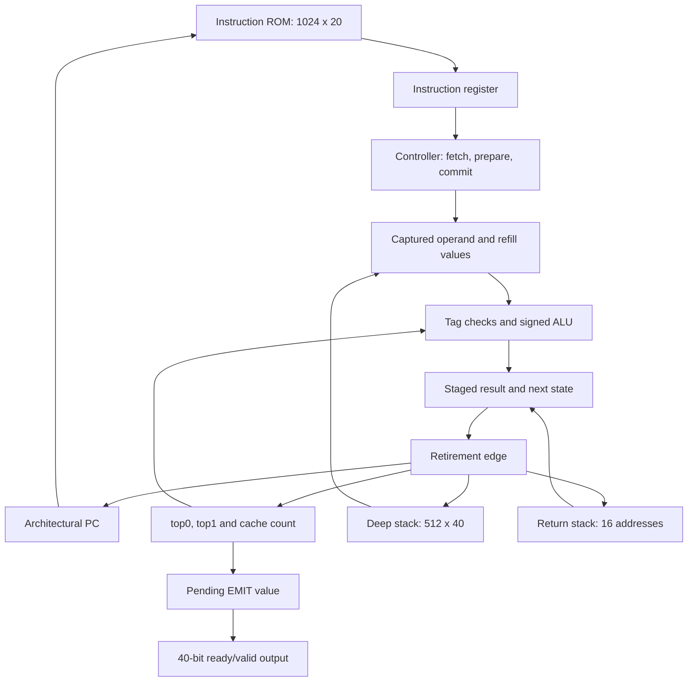
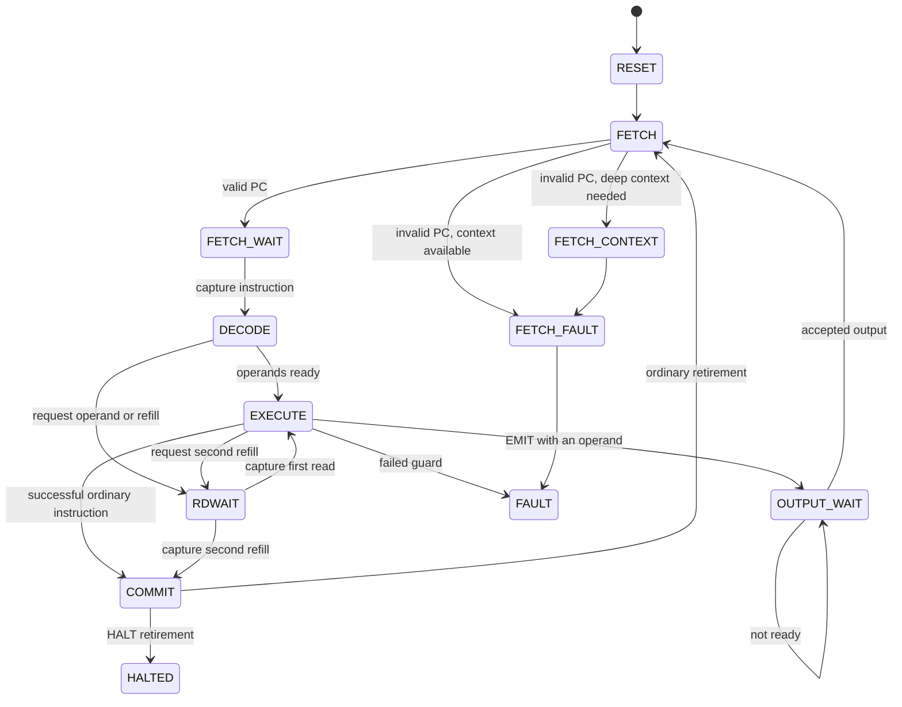
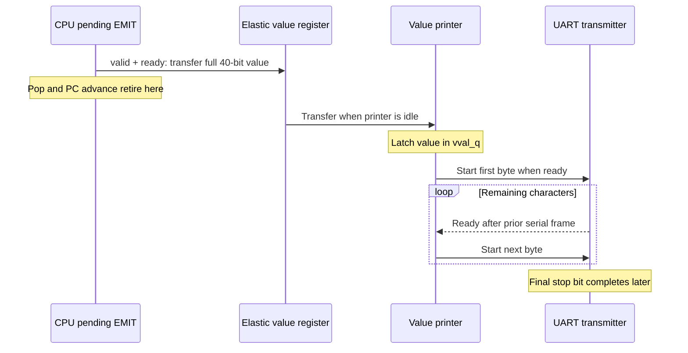

# Inside a Tagged Stack CPU: Semantics, BRAM Execution, and Precise Retirement

The GateMate symbolic evaluator is a processor for a small, typed stack instruction set. Its programs manipulate 40-bit values, perform checked signed arithmetic, branch on Boolean conditions, call subroutines, and send results to an output channel. The processor executes these operations on an FPGA using synchronous instruction memory, a two-entry operand cache, and a deeper stack stored in block RAM. Understanding the machine requires connecting the meaning of an instruction to the clocked state changes that implement it.

This article develops that connection from the implemented architecture. It assumes familiarity with variables, binary numbers, and functions, but defines the processor-specific concepts before using them. The central questions are concrete: which bits constitute a value, which state an instruction may change, how synchronous memory supplies an operand, when an instruction becomes complete, and how a failure preserves the computation that preceded it. Worked executions cover arithmetic, stack spilling and refilling, subroutines, recursion, branches, overflow, and output stalls.

The source snapshot is commit `9acc6cc` of `/home/manuel/code/wesen/2026-09-04--gatemate-symbolic`. Paths below are relative to its `symbolic_eval/` directory unless a ticket path is specified. The architectural examples were executed against this snapshot's Python model and preserved by ticket script `20-report-examples.py`; cycle descriptions are derived from the RTL state machines. Hardware results are identified separately. This is a source-based technical study, with the implementation and its recorded experiments as primary evidence.

> [!summary]
> - A value has a type tag, flags, and a payload; an instruction defines how those fields affect computation.
> - The CPU separates preparation from retirement. Failed checks preserve the program counter, live operand stack, live return stack, and previously accepted output.
> - The BRAM implementation represents one logical stack with two cached entries and a contiguous deep region. Synchronous reads take time without changing that logical state.
> - An `EMIT` completes when its output channel accepts the value. UART transmission finishes later, and reset may abort that later work.

## 1. The instruction-level machine

A processor architecture specifies the state a program can observe and the transitions its instructions perform. A microarchitecture specifies the registers, memories, combinational logic, and clock sequencing used to implement those transitions. This project makes the distinction executable: `tools/stack_model.py` expresses the instruction-level machine in Python, while `rtl/stack_core.sv` and `rtl/stack_core_bram.sv` implement it with different operand storage.

Write the architectural state as:

```text
M = (pc, D, R, O, F, H)

pc : address of the current instruction, measured in instruction words
D  : operand stack, ordered oldest to newest
R  : return-address stack, ordered oldest to newest
O  : sequence of accepted output values
F  : no fault, or a latched fault record
H  : whether HALT has completed
```

An instruction word occupies one program address regardless of its opcode. The operand stack contains typed values; the return stack contains instruction addresses. Neither stack is a general-purpose memory interface. The instruction set provides no arbitrary load or store, heap allocation, input instruction, interrupt handling, or operating-system mode. A program starts at address zero with empty stacks and runs until it halts, faults, or continues indefinitely. The test harness may stop an infinite computation with a watchdog, but that watchdog is not a CPU instruction or fault.

The output sequence `O` is a useful specification device. The FPGA does not retain an unbounded history of emitted values. It produces a sequence of successful channel transfers, which the observer can collect into `O`. Likewise, the Python model does not assign clock durations to instructions: one successful `step()` represents one completed instruction. The hardware may spend several cycles preparing that same transition.

Throughout the article, `[a, b]` places `b` at the top of the operand stack. A stack effect `(a b -- r)` means that an instruction consumes the two newest values and replaces them with `r`. For `SUB`, this means `a - b`, not `b - a`. The RTL calls `b` `top0`, and the next value `a` `top1` or the second operand.

For example, the architectural meaning of checked addition is:

```text
step_ADD(M):
    require length(D) >= 2, otherwise STACK_UNDERFLOW
    a = D[-2]
    b = D[-1]
    require a.tag == INT and b.tag == INT, otherwise TYPE_FAULT
    r = signed32(a.payload) + signed32(b.payload)   // mathematical result
    require -2^31 <= r <= 2^31 - 1, otherwise ARITH_OVERFLOW

    retire together:
        D  = D[:-2] followed by INT(r)
        pc = pc + 1
```

The order of the checks is observable when several conditions are wrong at once. An `ADD` with only one Boolean value faults for underflow; it does not first report the Boolean tag. The phrase “retire together” defines an architectural boundary: an observer must never see the operands consumed with the old program counter, or a new program counter with the old stack.

The concrete specifications for these rules are `Machine.step()` at `tools/stack_model.py:199`, `_commit()` at line 313, and the instruction metadata in `tools/opcodes.py:80`.

## 2. Values are typed bit patterns

Each operand occupies 40 bits. The payload is not interpreted independently of the tag. For example, integer one and Boolean true have equal payload bits but different complete representations.

```text
bit      39       36 35       32 31                             0
         +----------+----------+--------------------------------+
field    | tag: 4   | flags: 4 | payload: 32                    |
         +----------+----------+--------------------------------+

packed_value = (tag << 36) | (flags << 32) | payload
```

| Value | Tag | Flags | Payload bits | Complete 40-bit word |
|---|---:|---:|---|---|
| `INT(7)` | `0` | `0` | `00000007` | `0000000007` |
| `INT(-1)` | `0` | `0` | `ffffffff` | `00ffffffff` |
| `BOOL(false)` | `1` | `0` | `00000000` | `1000000000` |
| `BOOL(true)` | `1` | `0` | `00000001` | `1000000001` |
| A flag-bearing integer seven | `0` | `1` | `00000007` | `0100000007` |

An integer payload uses signed two's-complement interpretation. The model stores its 32 payload bits as a nonnegative Python integer, then interprets bit 31 when an arithmetic instruction needs a signed value. Thus `ffffffff` is the bit pattern for `INT(-1)`, although a raw payload display may show 4294967295. Hardware performs the corresponding signed conversion before arithmetic and comparison.

The tag enumeration reserves `REF`, `ATOM`, `PAIR`, `THUNK`, `IND`, `ERROR`, `POISON`, and `EMPTY` in addition to `INT` and `BOOL`. These names do not establish working object representations. There is no dereference operation, object layout, garbage collector, thunk evaluator, or graph reducer in this CPU. The implemented value-producing instructions create integers and Booleans. Generic stack manipulation and output move complete values; `EQ` compares their bits.

Flags are part of the representation even though this instruction set assigns them no independent arithmetic meaning. `DUP` and `SWAP` preserve all 40 bits. Arithmetic checks the integer tags, computes from the payloads, and constructs a new integer with zero flags. `EQ` compares tag, flags, and payload together. Consequently, two integers with payload seven and different flags compare unequal, while adding them computes fourteen with cleared flags. Such flag-bearing inputs are useful constructed test states; ordinary literal instructions cannot create them.

Boolean canonicality is checked when `JZ` consumes its condition. A `BOOL` payload must be zero or one for that operation. A constructed `BOOL(2)` causes `NONCANONICAL_BOOL`, whereas `INT(0)` causes `TYPE_FAULT`. Neither is accepted as a branch condition. Flags do not participate in the `JZ` canonicality test: it tests the tag and payload. `EQ`, in contrast, can compare arbitrary complete words without interpreting their type-specific validity.

The implementation fixes both the value width and integer range. They are not abstract configuration parameters in the current model. `Value40` enforces the field bounds, and the RTL uses the corresponding packed struct. Its constructors assign whole packed results:

```systemverilog
mk_int  = {4'h0, 4'h0, x};
mk_bool = {4'h1, 4'h0, 31'b0, b};
```

This form also survives constant folding in the supported synthesis toolchain. A constructor regression executes a synthesized netlist and checks all 40 bits for constant and dynamic arguments. The representation and API are in `tools/stack_model.py:57` and `rtl/symbolic_types_pkg.sv:75`.

## 3. Instruction encoding and the complete ISA

Instructions are 20 bits wide, split into a five-bit opcode and a fifteen-bit operand field. The opcode determines whether the operand field denotes a signed literal, an unsigned absolute target, or no operand. Program addresses count these words, so an increment of one advances by one instruction, not by one byte.

```text
19                 15 14                                  0
+--------------------+-------------------------------------+
| opcode: 5          | immediate or target: 15             |
+--------------------+-------------------------------------+

word = (opcode << 15) | (operand & 0x7fff)
```

`PUSH_S15` accepts literals from -16384 through 16383. Its immediate is sign-extended to 32 payload bits, then tagged `INT`. An unsigned target can encode addresses zero through 32767, but the configured ROM size imposes a further bound. The board's default ROM has 1024 words, so a target of 2000 is representable in the encoding and invalid for that machine configuration.

| Opcode | Instruction | Operand-stack effect | Additional behavior |
|---:|---|---|---|
| `00` | `PUSH_S15 k` | `-- INT(k)` | Signed 15-bit literal; capacity check |
| `01` | `PUSH_TRUE` | `-- BOOL(1)` | Capacity check |
| `02` | `PUSH_FALSE` | `-- BOOL(0)` | Capacity check |
| `03` | `ADD` | `INT(a) INT(b) -- INT(a+b)` | Precise signed overflow check |
| `04` | `SUB` | `INT(a) INT(b) -- INT(a-b)` | Precise signed overflow check |
| `05` | `MUL` | `INT(a) INT(b) -- INT(a*b)` | Precise signed overflow check |
| `06` | `EQ` | `x y -- BOOL(x==y)` | All 40 bits participate |
| `07` | `LT` | `INT(a) INT(b) -- BOOL(a<b)` | Signed comparison |
| `08` | `DUP` | `x -- x x` | Requires an existing value and spare capacity |
| `09` | `DROP` | `x --` | Discards one value |
| `0a` | `SWAP` | `a b -- b a` | Exchanges the two newest values |
| `0b` | `JMP t` | `--` | Sets `pc=t` after target validation |
| `0c` | `JZ t` | `BOOL(c) --` | Takes target when `c=0`; validates target either way |
| `0d` | `EMIT` | `x --` | Removes value only on output acceptance |
| `0e` | `HALT` | `--` | Sets halted; keeps `pc` at this instruction |
| `0f` | `CALL t` | `--` | Pushes `pc+1` on return stack, jumps to `t` |
| `10` | `RET` | `--` | Pops return stack into `pc` |

The opcode numbers in the table are hexadecimal. Undefined opcodes `11` through `1f` cause `BAD_OPCODE`. For instructions without an operand, the assembler emits zero in the low fifteen bits; the RTL dispatches on the opcode and does not add a general check that those unused bits are zero.

Several encodings make the layout explicit. `PUSH_S15 7` is `00007`, `PUSH_S15 -1` is `07fff`, `ADD` is `18000`, and `CALL 7` is `78007`. A raw illegal instruction with opcode `1f` is `f8000`. The raw word `0001f` is instead a valid `PUSH_S15 31`.

The assembler is a two-pass encoder. The first pass assigns word addresses to labels and reserves words for unresolved operands; the second resolves labels and validates literal and target ranges. Its `assemble(source, rom_depth=1024)` API returns `(words, symbols, listing)`. The returned words are unpadded. The command-line writer emits a `.hex` file padded to ROM depth, a `.lst` listing, and a `.sym.json` symbol map.

Padding has executable semantics. A zero word means `PUSH_S15 0`; it does not mean `HALT`. Falling beyond the explicit source into the configured ROM's padding continues pushing zeros until another stopping condition occurs. A label beyond the last source instruction can therefore refer to padding if it remains inside the configured ROM. Invalid syntax is rejected rather than skipped, and the capacity limit applies to the raw `WORD` directive as well as ordinary instructions. See `tools/asm20.py:49` for the complete interface.

## 4. An arithmetic program, instruction by instruction

The file `programs/arith.asm` evaluates `((7+5)*3)==36`, emits its Boolean result, and halts. Every intermediate result is a tagged value. Arithmetic produces integers, equality changes the result type to Boolean, and output transfers that Boolean without converting it back to an integer.

```text
PUSH_S15 7
PUSH_S15 5
ADD
PUSH_S15 3
MUL
PUSH_S15 36
EQ
EMIT
HALT
```

| Old PC | Instruction | Operand stack after completion | New PC | Event |
|---:|---|---|---:|---|
| 0 | `PUSH_S15 7` | `[INT(7)]` | 1 | COMMIT |
| 1 | `PUSH_S15 5` | `[INT(7), INT(5)]` | 2 | COMMIT |
| 2 | `ADD` | `[INT(12)]` | 3 | COMMIT |
| 3 | `PUSH_S15 3` | `[INT(12), INT(3)]` | 4 | COMMIT |
| 4 | `MUL` | `[INT(36)]` | 5 | COMMIT |
| 5 | `PUSH_S15 36` | `[INT(36), INT(36)]` | 6 | COMMIT |
| 6 | `EQ` | `[BOOL(1)]` | 7 | COMMIT |
| 7 | `EMIT` | `[]` | 8 | OUTPUT |
| 8 | `HALT` | `[]` | 8 | COMMIT |

The model emits these final records verbatim:

```text
TRACE 6 6 7 EQ 1 COMMIT
TRACE 7 7 8 EMIT 0 OUTPUT 1 00000001
TRACE 8 8 8 HALT 0 COMMIT
FINAL 1 NONE 8 0 1 0
```

The basic trace fields are sequence number, old PC, new PC, mnemonic, post-transition operand depth, and event kind. An OUTPUT record appends the tag and payload. `FINAL` reports halted, fault name, PC, operand depth, output count, and return depth. These records describe instruction-level transitions; the sequence number is not a clock counter.

`HALT` illustrates a useful distinction between stopping and advancing. It is a completed instruction with a normal COMMIT event, but the PC remains eight. The output count is already one when it halts because `EMIT` completed first. That says the output channel accepted the value; it does not establish that the UART has transmitted the last byte.

## 5. Retirement and precise faults

A precise fault identifies an unsuccessful instruction while preserving the computation completed before it. In this CPU, faulting leaves `pc`, `D`, `R`, and previously accepted `O` unchanged. The fault record and diagnostic sequence state do change: the processor must record the failure and enter its terminal fault state. Describing a fault as “nothing changes” would hide that distinction.

The ordinary instruction path has separate execution and commit states. Execution evaluates guards and prepares candidate results. Commit applies the candidate PC, depth, values, and return-stack changes on one clock edge. No later instruction starts while this instruction is pending. Because reads and combinational calculations have no external effect, they may occur before the guards finish; writes to live state must wait for successful validation.

```text
prepare(current_state, instruction):
    candidate = complete proposed next state
    if any required check fails:
        publish fault record for current_state
        enter FAULT
    else:
        latch candidate
        enter COMMIT

on COMMIT edge:
    apply candidate architectural values and counts
    perform scheduled operand/return memory writes
    publish one trace event
    enter FETCH, or HALTED for HALT
```

The register core represents stack updates as staged write descriptors with address and data. The BRAM core stages cache counts, deep counts, result values, and refill decisions. Both stage return occupancy rather than publishing it when `CALL` or `RET` is first decoded. A call must not expose a new return depth before its return-address write and target PC retire.

The nine faults are `STACK_UNDERFLOW`, `STACK_OVERFLOW`, `TYPE_FAULT`, `ARITH_OVERFLOW`, `BAD_OPCODE`, `BAD_BRANCH_TARGET`, `NONCANONICAL_BOOL`, `RSTACK_UNDERFLOW`, and `RSTACK_OVERFLOW`. The fault record carries the faulting PC, opcode context, operand depth, and current top-two tags. A fetch fault has an explicit fetch flag because no valid instruction was fetched. Absent operand tags are recorded as zero; depth distinguishes absence from an actual `INT` tag, which is also zero.

Consider the three-word program `PUSH_TRUE; PUSH_S15 4; ADD`. Immediately before `ADD`, the operand stack is `[BOOL(1), INT(4)]` and the PC is two. Both operands exist, so the underflow check passes. The tag check fails. The result is:

```text
TRACE 2 2 2 ADD 2 FAULT TYPE_FAULT 1 0
FINAL 0 TYPE_FAULT 2 2 0 0

D remains [BOOL(1), INT(4)]
R remains []
O remains []
```

There is no partially consumed stack and no replacement zero value. Execution stops in `S_FAULT` until reset. This is a terminal fault mechanism, not an exception-handler transfer or automatic instruction retry.

Signed arithmetic uses a wider result to detect overflow before narrowing. The RTL computes addition, subtraction, and multiplication in signed 64-bit intermediates. A result fits in signed 32 bits exactly when all upper 32 bits equal the sign extension of bit 31:

```text
overflow = result[63:32] != repeat(result[31], 32)
```

This is especially consequential for multiplication: two valid signed 32-bit inputs can produce a result requiring 64 bits. Truncating first would lose the information needed to distinguish a valid negative result from an overflowed positive one.

Small literal width does not make overflow unreachable. The following short program uses only ordinary instructions:

```text
PUSH_S15 16383
DUP
MUL             ; 268402689
DUP
ADD             ; 536805378
DUP
ADD             ; 1073610756
DUP
ADD             ; 2147221512: still a valid signed 32-bit integer
DUP
ADD             ; 4294443024: outside the signed range, faults at PC 10
HALT
```

The last `ADD` retains two copies of `INT(2147221512)` and PC ten. Its exact record is `TRACE 10 10 10 ADD 2 FAULT ARITH_OVERFLOW 0 0`. Constructed initial states remain useful for direct boundary tests, but they are not required to reach arithmetic overflow from a program. The distinction matters when reasoning about which safety checks real programs can exercise.

## 6. Two implementations of the same operand stack

The register implementation keeps 32 operand entries by default. It reads the newest two live entries through combinational selection and applies staged writes only at commit. Its conceptual simplicity is useful for checking instruction semantics independently of synchronous data-memory handling.

The board instantiates the BRAM implementation. Its default operand capacity is 514 values: 512 deep memory slots plus two cached entries. The return stack remains a separate 16-entry register array. Both cores use the same 1024-word synchronous instruction ROM by default. Equivalence must be tested with matching capacities; the default 32-slot register machine and 514-slot board machine intentionally have different overflow boundaries.



The BRAM stack is described by `top0`, `top1`, cache count `tc`, deep count `dc`, and deep memory. For every live entry, the abstraction into the logical stack is:

```text
D = deep[0:dc] followed by:
    []                 if tc == 0
    [top0]             if tc == 1
    [top1, top0]       if tc == 2

depth = dc + tc
dt = dc                // first free deep address
```

Only live entries matter. When a value is popped, its old memory bits need not be erased. Decreasing a count removes it from the abstraction. For reachable normal states, an empty cache implies an empty operand stack; a nonempty deep region may coexist with either one or two cached values. In particular, `tc=1, dc>0` is a normal state, not evidence of corruption.

That last case follows from the pop policy. When two values are cached, `DROP` shifts `top1` into `top0` and reduces the cache count to one without immediately filling the second cache slot. The next instruction may need a read. Cache occupancy therefore describes the physical representation, not just `min(depth, 2)`.

### 6.1 Pushes and spills

A push into an empty cache writes `top0`. A push with one cached value shifts it into `top1` and places the new value in `top0`. A push with two cached values stores the old `top1` at `deep[dc]`, increments `dc`, and performs the same cache shift. The deep write and count changes take effect at retirement.

```text
push(x), after capacity validation:
    if tc == 0:
        top0 = x; tc = 1
    else if tc == 1:
        top1 = top0; top0 = x; tc = 2
    else:
        deep[dc] = top1
        dc = dc + 1
        top1 = top0; top0 = x
    depth = depth + 1
```

Starting empty, push ten, twenty, and thirty. The resulting logical stack is `[10,20,30]`; the physical representation is `deep[0]=10`, `top1=20`, `top0=30`, `dc=1`, `tc=2`. The oldest cached value was spilled because subsequent binary operations use the newest two values.

### 6.2 Binary results and refills

For `ADD` in that state, both operands are cached. The controller also reads `deep[0]` before retirement because the result will leave two logical values. At commit it places fifty in `top0`, the fetched ten in `top1`, and reduces `dc` to zero. The physical representation now describes `[10,50]` with two cached values. Counts, result, and refill must become visible together.

The more involved case begins with one cached value and at least two deep values. The second operand is `deep[dc-1]`. After combining it with `top0`, the implementation refills the second cache slot from `deep[dc-2]`. These are two distinct synchronous reads: the first supplies an input to the operation, and the second supplies a surviving older value. The result reduces logical depth by one but reduces the deep count by two, because one deep value was consumed and another moved into the cache.

| Before binary operation | Second operand source | After successful operation |
|---|---|---|
| `tc=2, dc=0` | `top1` | `tc=1, dc=0` |
| `tc=2, dc>0` | `top1` | `tc=2, dc=old_dc-1`, refill from deep |
| `tc=1, dc=1` | `deep[0]` | `tc=1, dc=0` |
| `tc=1, dc>=2` | `deep[dc-1]` | `tc=2, dc=old_dc-2`, second read for refill |

### 6.3 A complete cache transition example

The following table uses integers throughout and writes cached entries in logical order, older to newer. It follows the implemented push, pop, and refill rules rather than assuming the cache is always full.

| Instruction | Live deep memory | Live cache | Logical stack |
|---|---|---|---|
| `PUSH_S15 10` | `[]` | `[10]` | `[10]` |
| `PUSH_S15 20` | `[]` | `[10,20]` | `[10,20]` |
| `PUSH_S15 30` | `[10]` | `[20,30]` | `[10,20,30]` |
| `PUSH_S15 40` | `[10,20]` | `[30,40]` | `[10,20,30,40]` |
| `DROP` | `[10,20]` | `[30]` | `[10,20,30]` |
| `ADD` | `[]` | `[10,50]` | `[10,50]` |

At the last `ADD`, reading `deep[1]` supplies twenty, and reading `deep[0]` supplies the retained ten. The sum is twenty plus thirty. Until commit, the architectural stack remains `[10,20,30]`, even though the temporary read registers already contain those values. After commit, it is `[10,50]`. The original deep memory bits may remain physically present, but `dc=0` makes them inactive.

This separation between temporary data and live data is also necessary for faults. With `tc=1` and `dc>0`, the second logical value is in RAM even if the pending opcode does not consume it. The controller performs the operand-context read for all instructions in that representation so that an illegal opcode or bad branch can report the actual current top-two tags. Reading a stale `top1` register would report a physically stored value that no longer belongs to the logical stack.

The implementation of these transitions is concentrated in `rtl/stack_core_bram.sv`: decode at line 287, read capture at line 305, execution at line 326, and commit at line 523.

## 7. Synchronous memory determines the execution schedule

Both instruction and deep-stack memory return registered read data. Presenting an address is a request for a value available after a clock edge; it does not create an immediately usable combinational operand. The controller therefore has explicit states for requesting, capturing, and using memory results. This sequencing is part of how the RTL maps storage into block RAM.

`program_rom.sv` implements `data <= mem[addr]` on the rising edge. The core presents its PC-derived address in `S_FETCH`, captures the returned instruction in `S_FETCH_WAIT`, and proceeds through decode and execute. The separate instruction register keeps the opcode stable while later stack reads or output stalls occur. Instruction memory remains independent of the operand memory, so stack operations do not overwrite the running program.



The read-purpose register distinguishes operand capture, initial refill, and second refill. `R_OPND` captures the older operand in `opnd_q` and also the possible post-pop value in `pf_q`. `R_FILL` captures a surviving older value in `rf_q`. `R_FILL2` captures the second requested refill and then proceeds directly to commit, since execution has already validated and computed the result.

For the cache example ending in `ADD`, the state progression is:

```text
FETCH       present current instruction address
FETCH_WAIT  capture ADD instruction
DECODE      request deep[dc-1], the second operand
RDWAIT      capture that operand
EXECUTE     check types and overflow; stage sum; request deep[dc-2]
RDWAIT      capture the surviving older value
COMMIT      publish result, refill, counts, PC, and trace together
```

During the middle five steps the machine has not yet completed `ADD`. A debugger observing the logical stack must still see the pre-instruction state. This is often described formally as stuttering: an implementation transition occurs while the corresponding abstract computation state does not change. The useful invariant is stronger than a correct final answer; it requires correct state at every retirement boundary and stable live state between boundaries.

Counting controller cycles from entering FETCH through the retirement edge gives the following derived costs, excluding reset and output stalls:

| Successful path | Controller cycles |
|---|---:|
| Ordinary instruction without a stack read | 5 |
| Instruction with one operand/context or refill read | 6 |
| Binary operation with one cached value and at least two deep values | 7 |
| `EMIT` with no stack read and immediately ready output | 5 |
| Each additional blocked cycle in OUTPUT_WAIT | +1 |

These are state-machine costs, not independently measured throughput benchmarks. They show why a processor clock rate is not an instruction rate. At 10 MHz, an uninterrupted five-cycle instruction path corresponds to at most two million such instructions per second. A real program mixes read paths, branches, calls, and possibly long output waits.

The arithmetic itself is combinational in this implementation. In particular, `MUL` does not run an iterative multiplier protocol with a variable completion time. The synthesis maps arithmetic into available logic and multiplier resources, while the controller still uses the same staged retirement structure. Adding a genuinely multi-cycle arithmetic unit would require a result-wait protocol that preserves the current instruction's operands and fault context.

## 8. Control flow, return addresses, and recursion

`JMP` changes only the PC after checking its target. `JZ` additionally consumes a Boolean condition, but only after all checks succeed. It branches when the payload is zero and falls through when the payload is one. The target is checked even on the fall-through case. Thus a true condition does not excuse an out-of-range target encoded in a `JZ` instruction.

`CALL` adds a second kind of stack operation: it pushes the continuation address `pc+1` on `R`, then transfers execution to the target. This continuation is the instruction at which execution should resume. `RET` restores the newest continuation and removes it from `R`. Arguments and results remain on `D`; neither instruction supplies local variables, frame allocation, an argument count, or automatic cleanup.

A subroutine therefore needs a stack contract. The square routine in `programs/sq.asm` has contract `(INT(x) -- INT(x*x))`, assuming the product fits. Its instructions are simply `DUP; MUL; RET`. Any older operand-stack prefix survives the routine, allowing the caller to retain a previous result while computing another.

```text
0: PUSH_S15 3
1: CALL 7
2: PUSH_S15 4
3: CALL 7
4: ADD
5: EMIT
6: HALT
7: DUP
8: MUL
9: RET
```

| Executed PC | Instruction | Data stack after completion | Return stack after completion | Next PC |
|---:|---|---|---|---:|
| 0 | `PUSH_S15 3` | `[3]` | `[]` | 1 |
| 1 | `CALL 7` | `[3]` | `[2]` | 7 |
| 7 | `DUP` | `[3,3]` | `[2]` | 8 |
| 8 | `MUL` | `[9]` | `[2]` | 9 |
| 9 | `RET` | `[9]` | `[]` | 2 |
| 2 | `PUSH_S15 4` | `[9,4]` | `[]` | 3 |
| 3 | `CALL 7` | `[9,4]` | `[4]` | 7 |
| 7 | `DUP` | `[9,4,4]` | `[4]` | 8 |
| 8 | `MUL` | `[9,16]` | `[4]` | 9 |
| 9 | `RET` | `[9,16]` | `[]` | 4 |
| 4 | `ADD` | `[25]` | `[]` | 5 |
| 5 | `EMIT` | `[]` | `[]` | 6 |
| 6 | `HALT` | `[]` | `[]` | 6 |

All data values in this table are integers. The separation of the stacks explains why `MUL` does not consume a return address and why the second call can preserve nine below its argument. It also creates independent resource limits. A program may have ample operand capacity and still fail because its 16-entry return stack is full. `CALL` checks return capacity before target validity; `RET` on an empty return stack reports `RSTACK_UNDERFLOW`.

### 8.1 Recursive Fibonacci as a stack contract

The recursive program computes `fib(n)` with the convention `fib(n)=n` for `n<2`, otherwise `fib(n-2)+fib(n-1)`. The actual routine starts at address four and its recursive branch at address nine:

```text
fib:
    DUP
    PUSH_S15 2
    LT
    JZ fib_rec
    RET

fib_rec:
    DUP
    PUSH_S15 2
    SUB
    CALL fib
    SWAP
    PUSH_S15 1
    SUB
    CALL fib
    ADD
    RET
```

The test of `n<2` preserves the original `n` because `DUP` creates the value consumed by `LT`. Immediately before `JZ`, the stack is `[n, BOOL(n<2)]` above any caller prefix. `JZ` removes the Boolean in either successful direction. A true condition falls through to `RET`, leaving `n` as the result. A false condition branches to the recursive case, again leaving `n` available.

The recursive case retains exactly the data needed across calls:

```text
[n]
  -> [n, n-2]
  -> [n, fib(n-2)]                  after first CALL returns
  -> [fib(n-2), n]                  after SWAP
  -> [fib(n-2), n-1]
  -> [fib(n-2), fib(n-1)]           after second CALL returns
  -> [fib(n-2) + fib(n-1)]          after ADD
```

For `n=3`, the first recursive call computes `fib(1)=1`; the second computes `fib(2)`, whose children return zero and one. The two final operands are one and one, yielding two. Every call's return address lives on `R`, while the retained `n` or partial result lives on `D`. The maximum depths therefore differ even though both grow with recursive work.

Replaying the actual program with input three produces 47 instruction events, maximum operand depth five, maximum return depth three, and one output `T0:00000002`. Input ten produces 1,681 events, maximum operand depth twelve, maximum return depth ten, and output `T0:00000037`. These are model execution measurements for this exact bytecode, including its initial call, final output, and halt. The output 55 also matches the recorded board capture. They are not cycle counts and do not imply larger inputs fit either stack or the signed integer range.

## 9. The PC must represent an invalid continuation

The architectural PC has to express more than valid physical ROM addresses. A successfully completed instruction at the final ROM word can advance to `ROM_DEPTH`. A call there can also save that one-past-the-end address as a continuation. If the address were truncated to the physical ROM address width, a power-of-two ROM would wrap to zero and execute an unrelated instruction instead of reporting a fetch fault.

The implementation therefore uses `$clog2(ROM_DEPTH+1)` bits for architectural PCs and return addresses, and `$clog2(ROM_DEPTH)` for the physical ROM address port. At the default depth 1024, those are eleven and ten bits respectively. Physical address generation is guarded: an out-of-range architectural PC selects a harmless physical address while the controller takes the fault path. The fetched bits at that guarded address are not interpreted as the faulting instruction.

The distinction is observable in a seven-word ROM:

```text
0: JMP 6
1: RET
2: HALT
3: HALT
4: HALT
5: HALT
6: CALL 1
```

The call at address six has a valid target, so it commits and saves return address seven. The `RET` at address one then commits, removes seven from the return stack, and sets the PC to seven. The next fetch faults. The exact architectural trace is:

```text
TRACE 0 0 6 JMP 0 COMMIT
TRACE 1 6 1 CALL 0 COMMIT
TRACE 2 1 7 RET 0 COMMIT
TRACE 3 7 7 FETCH 0 FAULT BAD_BRANCH_TARGET 0 0
FINAL 0 BAD_BRANCH_TARGET 7 0 0 0
```

It would be incorrect to move this fault onto `RET` and restore the return-stack entry: the defined transition has already completed. The fetch fault preserves the state *after* the successful return. Conversely, a `JMP` whose encoded target is outside ROM faults before changing the PC at all. These two failures share a fault code but occur at different architectural boundaries.

The `trace_fetch` and `fault_fetch` signals distinguish instruction faults from failed instruction acquisition. Opcode fields are not meaningful when those flags are set. In the BRAM core, a fetch fault can itself require one extra context-read state if the second logical stack value is in deep RAM. Precise diagnostics therefore remain subject to the same memory-latency rules as ordinary execution.

## 10. Output acceptance is an architectural event

`EMIT` transfers an arbitrary 40-bit value through a ready/valid interface. The producer asserts `valid` when it has a value, the consumer asserts `ready` when it can accept one, and transfer occurs on an edge where both are asserted. While blocked, the producer must retain the same value and keep it valid. Advancing the instruction or popping the stack before that edge would lose the value if the consumer stayed blocked.

The core first copies `top0` into a pending register, then enters `S_OUTPUT_WAIT`. Until acceptance, the PC and stacks remain unchanged. On the acceptance edge it removes the value, advances the PC, updates the cache representation using any prefetched refill, and emits one OUTPUT trace event. Output timing is thus part of the instruction's completion condition, rather than an independent best-effort side effect.

```text
OUTPUT_WAIT:
    out_valid = true
    out_data  = pending_value
    if not out_ready:
        hold PC, live stacks, and pending_value
    else, on this clock edge:
        append pending_value to abstract output sequence
        pop one operand
        advance PC
        publish OUTPUT event
```

The board connects the core to a one-entry elastic register, then to a value printer, then to the UART transmitter. These components have distinct state and acceptance points:



`rv_reg.sv` implements its input readiness as `!full_q || out_ready`. An empty buffer can accept a value. A full buffer can also accept a replacement on the same edge that its current value leaves. If it is full and the printer is blocked, it retains both occupancy and data. The printer separately latches its current value, allowing the elastic register to hold another accepted value while transmission proceeds. A further `EMIT` may then wait inside the CPU.

The textual printer emits thirteen bytes per value: `T`, one tag digit, a colon, eight payload hex digits, carriage return, and line feed. Digits are emitted most significant first; hexadecimal letters use uppercase. The four flags bits are omitted from this textual format, even though they cross the internal 40-bit channel intact. The UART text is therefore not a complete serialization of the architectural word.

The countdown program exercises output during a loop and from a subroutine. It emits a copied counter, subtracts one from the retained counter, compares the new counter with zero, and executes `JZ loop`. Equality false means the count remains nonzero, so that is the branch taken back to the loop. When equality becomes true, it falls through, drops zero, emits true, and halts. The actual model and board text is:

```text
T0:00000005
T0:00000004
T0:00000003
T0:00000002
T0:00000001
T1:00000001
```

Each displayed line terminates with CR LF on the wire. This program executes 55 model events and emits six values. The final tag digit matters: Boolean true is a different value from integer one, although both have payload one.

### 10.1 The UART rate constrains sustained output

The transmitter uses 8N1 framing: one start bit, eight data bits transmitted least significant bit first, and one stop bit. With a 10 MHz clock and requested baud rate 115200, the rounded divider is 87 clocks per bit. The derived serial rate is approximately 114942.5 bits per second. Thirteen ten-bit frames require 11310 clock periods, or 1.131 milliseconds, before allowing for inter-byte and controller transitions. This gives a ceiling of roughly 884 complete value lines per second from framing alone; actual sustained rate is slightly lower.

That rate is much slower than an arithmetic instruction path. Buffering allows brief overlap but cannot remove the sustained bandwidth limit. A computation that emits every few instructions will eventually wait in OUTPUT_WAIT. The architecture remains deterministic with respect to completed values; elapsed time depends on readiness.

### 10.2 Halt, fault, and reset have different effects

`HALT` stops the CPU but does not reset the printer or transmitter. Previously accepted output can continue draining. A CPU fault similarly stops further instruction execution without inherently deleting accepted output already downstream. The board's active-low LED indicates halted with solid illumination, running with a slower blink, and faulted with a faster blink. It does not certify that all serial bytes have drained, and UART silence alone does not reveal a precise fault record.

Reset is a global abort. It clears CPU state and output occupancy, resets the printer and UART, and restarts from address zero after release. It can discard a buffered value or interrupt a byte already on the wire. No rollback can retract bits transmitted before reset. The button passes through two synchronization flip-flops; its synchronized value combines with the configuration reset source and a reset synchronizer. This is a separate mechanism from architectural fault handling.

The core output interface is in `rtl/stack_core_bram.sv:597`, the elastic register in `rtl/rv_reg.sv:28`, printer acceptance in `rtl/top.sv:201`, and serial framing in `rtl/uart_tx.sv:29`.

## 11. What correspondence between model and hardware means

The strongest practical claim supported by the test harness is agreement on the architectural abstraction for the executions it checks. Comparing only a final UART line would miss errors in values that never get emitted. Comparing only instruction names and stack depths would miss corrupted lower stack entries or return addresses that happen not to be consumed before halt.

The harness therefore compares three views. TRACE and FINAL describe control flow, completion, and faults. STATE snapshots contain every live operand value and return address. XFER records contain the complete accepted 40-bit words, including flags. Per-cycle monitors also check that the logical PC and live stacks do not mutate between retirement events or on a fault. Inactive memory locations are excluded because their stale contents are not part of `D` or `R`.

```text
For each observed retirement or fault event:
    execute the next abstract model transition
    compare PC, live D, live R, and terminal status
    compare event context
    if an output transfer occurred:
        compare all 40 output bits

Between retirement events:
    require live PC, D, and R to remain unchanged
```

Both directed and generated programs use the same comparisons. The generator validates bounded instruction fragments with the model, including calls and branches, and deliberately injects faults in separate cases. Constructed initial states exercise noncanonical Booleans, flag-bearing values, and exact arithmetic boundaries. ROM-boundary and production-capacity tests cover cases that short demonstration programs rarely reach.

The recorded final suite has 198 passing tests. Its execution coverage includes all seventeen opcodes, all nine fault kinds, and both intended conditional-branch outcomes. This is useful breadth, but it does not establish exhaustive state coverage, formal equivalence, or correctness for every possible parameter combination. The coverage counters describe test executions, not a proof that every relevant interaction occurred.

There is also a boundary between RTL simulation and the circuit produced by synthesis. The constructor regression checks one known-sensitive part of that transformation by synthesizing constant and dynamic constructors and simulating the resulting netlist. Whole-system board captures then check selected physical executions. These are complementary evidence layers, each with a narrower observable scope than the complete mathematical machine.

At the recorded snapshot, the Fibonacci build uses two `CC_BRAM_20K` blocks and one `CC_MULT`; its routed timing estimate is 16.03 MHz against a 10 MHz constraint. The two memories correspond to 1024 by 20 instruction bits and 512 by 40 deep-stack bits. Each logical memory contains 20480 bits, while the top cache contains another 80 data bits in registers. The return-address payload storage at the default configuration is sixteen eleven-bit addresses, excluding its control registers.

The router also reports a packing-stage message that 392 CPEs were created. That message should not be substituted for a complete final area characterization: the later utilization report lists multiple CPE resource categories. Timing likewise refers to this routed image and toolchain, not to a universal frequency guarantee for all programs or parameter choices.

The final board evidence records matching UART streams for Fibonacci, arithmetic, countdown, and the type-fault example. For type-fault, the matched stream is empty; that establishes absence of emitted bytes, not direct observation of the board's internal fault metadata. The precise preservation property is checked in simulation. These evidence limits matter because the board top currently leaves most trace and fault-detail ports unconnected.

## 12. A source map for reading and extending the CPU

The shortest useful reading path starts with the value and instruction definitions, then the model, then the BRAM state machine. Reading the RTL first without its abstract contract makes it easy to confuse a temporary refill value with a live stack value, or an execution-state assignment with an already completed instruction.

| Question | Primary source and entry point |
|---|---|
| What are the tags, faults, opcodes, and stack effects? | `tools/opcodes.py`, `Tag`, `Fault`, `Instruction`, `INSTRUCTIONS` |
| How are complete values represented? | `tools/stack_model.py:57`, `Value40`; `rtl/symbolic_types_pkg.sv`, `value40_t` |
| What does one instruction mean? | `tools/stack_model.py:199`, `Machine.step()` |
| How are source labels resolved? | `tools/asm20.py:49`, `assemble()` |
| How does register-backed retirement work? | `rtl/stack_core.sv:235` and `:396`, EXECUTE and COMMIT |
| When does the BRAM core request and capture an operand? | `rtl/stack_core_bram.sv:287` and `:305` |
| How are cache and deep counts published? | `rtl/stack_core_bram.sv:523`, COMMIT |
| What constitutes a fault observation? | `rtl/stack_core_bram.sv:639`, `do_fault()` and fetch flags |
| What are memory timing assumptions? | `rtl/program_rom.sv:26`; `rtl/sync_sdp_ram.sv:26` |
| When is output irrevocably accepted by the channel? | `rtl/stack_core_bram.sv:597`; `rtl/rv_reg.sv:28` |
| How does a value become bytes? | `rtl/top.sv:163`, `byte_of()`; printer state machine at `:208` |
| How does a byte become a serial frame? | `rtl/uart_tx.sv:29` |
| How is the complete abstraction checked? | `sim/state_checks.py`, `assert_architectural_states()` |

The Python APIs provide a convenient way to explore the architecture without assigning cycle timing:

```python
from asm20 import assemble
from stack_model import Machine

words, symbols, listing = assemble("PUSH_S15 7\nPUSH_S15 5\nADD\nHALT")
machine = Machine(program=words, total_depth=514)
while not machine.halted and machine.fault is None:
    record = machine.step()
    print(record.line())
    print([f"{value.word():010x}" for value in machine.stack])
```

Run that code with `symbolic_eval/tools` on Python's import path. For a fresh repository validation, use the installed CAD environment and run the existing commands from `symbolic_eval/`:

```bash
source ~/fpga/oss-cad-suite/environment
make test
python3 scripts/check_isa.py
make asm PROG=sq
make bit PROG=sq
```

`make bit` creates an image; it does not establish physical execution. Loading a board and capturing serial output are separate operations. The metadata check verifies handwritten RTL constants and bench mnemonic tables against the Python authority; it does not generate the RTL semantic implementation from Python.

Three extensions follow directly from the current boundaries, but are not implemented here. Heap-bearing tags need defined object formats and checked memory operations. A multi-cycle arithmetic unit needs explicit in-flight ownership and a result-completion protocol. Richer observability needs a trace transport or trace memory, because the current UART text loses flags and exposes no complete fault record. Each extension must define its architectural transition and then preserve the same retirement discipline across its additional internal work.

## 13. Exercises that expose the architectural rules

These small changes are useful checks of understanding because their answers depend on state transitions rather than terminology.

1. **Replace `EQ` with `SUB` in the arithmetic example.** The final integer operands are both 36, so the emitted value becomes `INT(0)`, represented on UART as `T0:00000000`. Equality and subtraction have the same depth effect but different result types.

2. **Execute `JZ` with `[INT(0)]`.** It reports `TYPE_FAULT`, keeps that value, and retains the PC. Numeric zero does not satisfy the Boolean tag requirement.

3. **Execute `JZ` with `[BOOL(1)]` and an invalid raw target.** It still reports `BAD_BRANCH_TARGET`. Target validation is required before either branch outcome can retire. The assembler normally rejects such a target; a raw word or constructed model program can exercise the CPU check.

4. **After pushing four values and dropping one, inspect the BRAM cache count.** It is one, with two values still in deep RAM. A following binary operation needs an operand read and a separate refill read.

5. **Block output readiness while `EMIT` is pending.** The pending value, PC, and logical stacks stay stable. When readiness returns, exactly one value transfers and exactly one operand is removed.

6. **Place `HALT` in the last ROM word.** It halts at that valid address and does not produce a fetch fault. A successful instruction that advances beyond that word has a different outcome because the next fetch attempts an invalid architectural address.

7. **Reset after an output transfer but before the final UART character.** The model's accepted-output boundary has already occurred, yet the physical transmission can be incomplete. Reset is an experiment abort, so the design does not guarantee draining accepted output across reset.

These cases connect the machine's principal rules: tags determine admissible operations, live-state counts determine stack meaning, and retirement determines when a computation becomes observable. The same instruction semantics remain valid whether operands are directly readable registers, delayed BRAM responses, or values waiting for a downstream consumer.

## Sources and reproducible evidence

The primary source repository is `/home/manuel/code/wesen/2026-09-04--gatemate-symbolic`, reviewed at `9acc6cc737a1566b75edf427f57c6c357dfb87ce`. The constructor implementation itself is in commit `605f41d`. Source references in this article describe the repaired snapshot; earlier reports remain historical records.

The implementation ticket is `ttmp/2026/09/04/GATEMATE-SYMBOLIC-003--correctness-repairs-for-the-tagged-stack-evaluator/`. Within it:

- `scripts/20-report-examples.py` replays the architectural examples and asserts key expected results. It requires the local Python model, not the FPGA tools.
- `reference/validation/report-examples.json` preserves source, assembled words, labels, before/after stacks and PCs, return addresses, exact traces, and execution statistics for the examples used here.
- `reference/validation/P5-final-tests.log` records the 198-test result; `P5-coverage.json` records execution coverage.
- `reference/validation/P5-hardware.json` records expected and actual UART text plus per-image SHA256 hashes. `P5-nextpnr.log` and `P5-yosys.log` preserve the Fibonacci timing and synthesis reports.
- `design-doc/01-correctness-repair-design-and-validation-plan.md` gives the detailed repair contract, and `reference/01-implementation-diary.md` preserves the implementation history for readers who need it.

The preceding vault report, [[PROJECT REPORT - GateMate Symbolic - A Precise Tagged Stack Evaluator from Abstract Machine to Hardware]], describes the construction work and its earlier evidence. This article supplies the current architectural explanation, including the repaired ROM, fault-context, and complete-state semantics. Related processor projects include [[PROJ - MATE-16 VM CPU on the GateMateA1-EVB]] and [[PROJ - Uxn Computer - A Varvara Machine in GateMate FPGA]].
