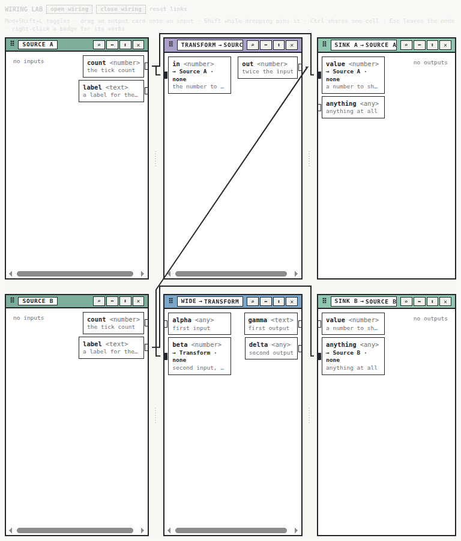
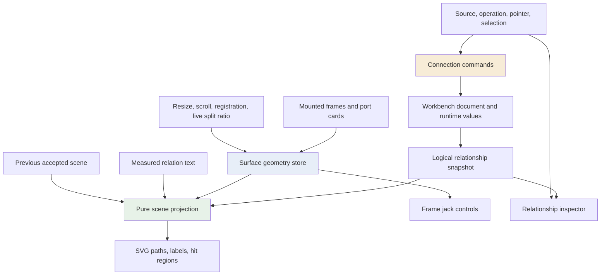
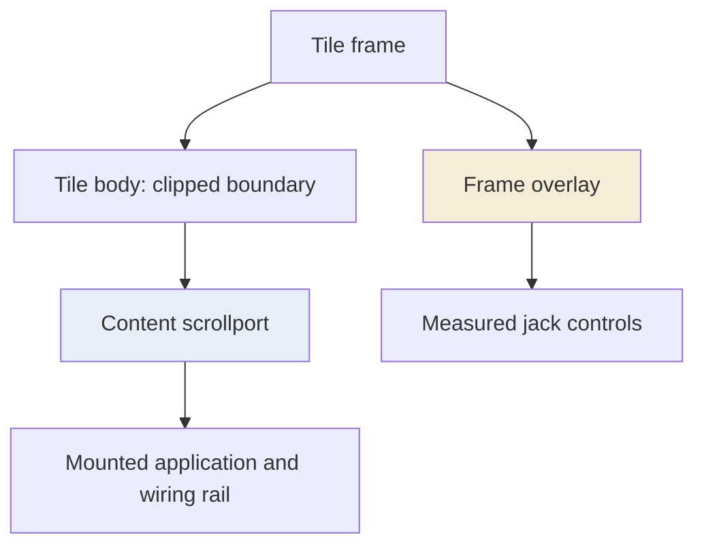
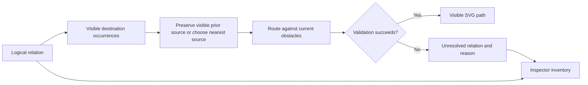
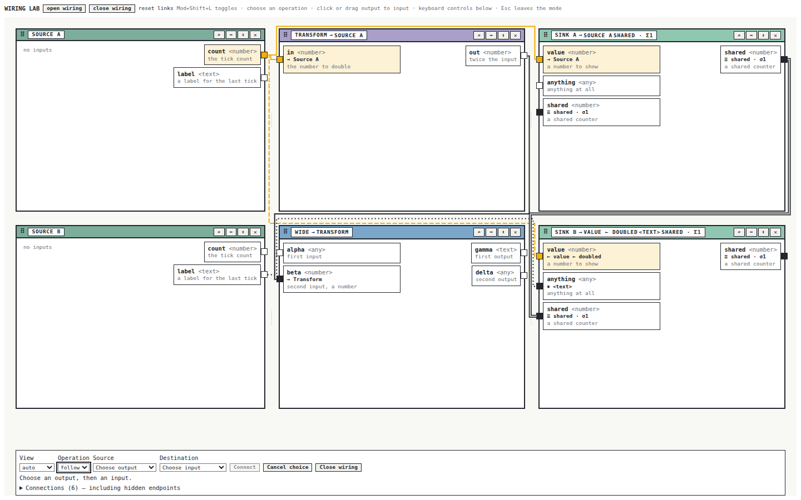
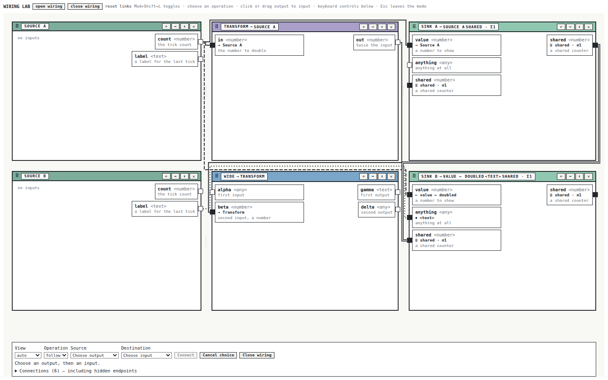

# PBUI Wiring Refactor — Geometry Ownership, Orthogonal Routing, and Atomic Interaction

A visual connection editor has several independent correctness obligations. Its commands must create the intended relationships. Its geometry must describe the current layout. Its paths must satisfy routing constraints after every transformation. Its interaction model must let a person inspect and change those relationships when the workspace becomes too small to show all endpoints. PBUI's wiring refactor made those obligations explicit and assigned each one to a particular implementation component.

The work began with an interface whose values could propagate correctly while the corresponding wires crossed tiles, remained behind during a divider drag, or pointed at clipped ports. The most useful initial measurement was a counterexample: a wire had **zero endpoint error and an invalid diagonal interior segment**. That observation changed the problem from adjusting SVG appearance to defining and validating the entire path from semantic state to rendered geometry.

This report explains the completed implementation at source commit `4b4aa33`, the failures that determined its architecture, and the limits of the validation. It assumes familiarity with functions, data structures, and basic React components; graph search, clipping, transaction publication, and external-store identity are developed where they become necessary. It follows the earlier [[PROJECT REPORT - PBUI Visual Consolidation and Link-Mode Wiring - One Chip, One Shell, and Wires That Route Around Tiles|visual consolidation and initial wiring report]], which remains a record of the preceding implementation.

> [!summary]
> - Measured geometry has its own lifetime and revision, independent of durable workspace state.
> - Every definitive wire passes an explicit geometric validator; an unavailable route remains unresolved.
> - Click, drag, and keyboard controls construct the same connection commands, including atomic Hold.
> - Preview exposed a React snapshot-identity defect that required correcting the core's cache, even though preview did not mutate the live document.

## 1. Define the entities before defining the picture

PBUI provides React presentation primitives and a workbench shell. A workbench document contains application views and a tree of placements. A view identifies an application instance and its configuration. A placement identifies one location where that view appears in a workspace. Two placements can show the same view, so view identity and rendered occurrence identity cannot be used interchangeably.

Applications declare ports. An output emits a typed reference; an input evaluates a binding to determine its current reference. An `inout` port can participate on both sides of an interaction. The link kernel understands the allowed relationships and evaluates their consequences. The workbench core plans and applies commands. The wiring UI presents these existing semantics and supplies user operations that invoke them.

Four relationship forms matter to this refactor:

| Relationship | Semantic behavior | Spatial treatment |
|---|---|---|
| Follow | The destination evaluates the source's current reference. | A solid wire identifies the dependency. |
| Derived | A declared relation transforms the source reference for the destination. | A patterned wire carries a relation label when it fits. |
| Held | The destination keeps a captured reference while preserving a suspended binding. | A dotted wire explains the suspended source. |
| Identity | Participating ports share a runtime class value under the declared merge/split policies. | A double wire distinguishes shared state from directed following. |

These forms explain why a wiring fixture must verify values as well as appearance. A held binding needs a value to capture. An identity declaration needs compatible participating ports. Rendering something that resembles either state does not establish that the semantic state exists.

The original lab attempted some operations without checking their results. Its title and intended examples therefore described more states than it actually contained. Phase zero replaced that setup with checked commands and initial emissions. The repaired fixture has three follows, one held relation, one derived relation, and one identity relation. Its tests change emitted values and check the resulting evaluations: a doubled number changes, a held text remains captured, and shared counters reflect the same class value. See [`createWiringLab`][fixtures] and the [fixture tests][fixture-tests].

A logical relationship can also exist without a visible route. The destination might belong to another workspace, or its card might be outside a scrolled port column. The semantic document remains authoritative in both cases. The inspector therefore lists relationships independently of whether the scene can draw both endpoints.

## 2. The measurements that invalidated the original assumptions

The initial review resized the same mounted lab through several dimensions and then returned to its original size. It also dragged dividers, scrolled crowded port columns, and exercised connection creation. This preserved enough state across operations to distinguish a size-dependent defect from accumulated drift.

At 768×900, one returned polyline was:

```text
M 501.109375 49.671875
L 504       49.671875
L 252       420
L 252       530.25
L 259.234375 530.25
```

The segment from `(504, 49.671875)` to `(252, 420)` changes both coordinates. It is diagonal. Its endpoints can still match their jacks exactly, so endpoint checks alone cannot detect the defect. The old router found a grid path, reduced it to corners, and then changed corner coordinates to attach it to exact endpoints. That final transformation could destroy orthogonality. The important failure occurred after search.



A second failure occurred during live divider dragging. With the pointer held still for 600ms, some wires remained approximately 130px away from their new attachment positions. Releasing the pointer committed the split ratio and caused the picture to catch up. The distinction is precise: the durable document had not changed during the drag, but the DOM layout had. A renderer subscribed primarily to durable updates could not describe that intermediate layout correctly.

The scrollbar observations exposed a third boundary. Jacks and overflowing wire decoration could contribute to scrollable geometry even when the visible card content appeared to fit. In the crowded story, a wire targeted a port below the visible column: its endpoint y was about 606px in a surface only about 502px high. At 390px, the document's width reached 394px while the port cards were already too compressed to read comfortably.

These observations produced separate acceptance conditions:

- A final polyline must satisfy all path constraints, including its interior segments.
- Live geometric changes must publish independently of durable layout commits.
- A hidden or clipped endpoint must not produce a definitive connection to an offscreen coordinate.
- Decorative geometry must not introduce unintended scrolling.
- A narrow layout must provide an alternative way to perform the same semantic operations.

The [original review][review] records the captures and source replay. The [archived 768px fixture][resize-fixture] preserves actual floating-point coordinates from that investigation rather than replacing them with a convenient synthetic layout.

## 3. The new architecture separates three kinds of state

Durable state records the workspace, placements, views, and link declarations. Measured state records where the currently mounted frames and port cards appear. Interaction state records a source choice, operation, pointer gesture, refusal message, and selected relationship candidates. Each changes for different reasons and has a different lifetime.

A divider drag is a useful example. `SplitPane` updates a local ratio for immediate visual feedback. A layout effect invalidates the geometry store after the DOM reflects that ratio. Pointer release still produces one durable resize. This preserves the persistence behavior while allowing intermediate wire scenes to follow the current layout.



The geometry store belongs to one mounted surface. There is no module-global map of port elements. A registration key includes `placementId`, `portId`, and `side`; the store itself supplies surface identity. This combination permits duplicate placements and separate workbenches to use the same logical port names without sharing DOM ownership.

The public model also distinguishes an epoch from a revision. The epoch changes when the root lifetime changes. The revision changes when measured geometric content changes. A `pending` flag says that previously measured positions are awaiting replacement. The scene suppresses definitive paths during that interval instead of leaving stale paths selectable. These fields describe freshness without inventing a durable workspace mutation for each animation frame. See the [geometry model][model] and [geometry store][geometry].

## 4. A registration owns exactly its cleanup

A registration API can appear correct until React replaces an element under the same logical key. Suppose registration A owns a key, registration B replaces it, and A's disposer runs later. A disposer that simply deletes the key would remove B. The current implementation compares registration tokens before deleting anything.

The essential logic is:

```typescript
const entry = { key, element, token: {} };
anchors.set(id, entry);

return () => {
  if (anchors.get(id)?.token === entry.token) {
    anchors.delete(id);
    observer?.unobserve(element);
    invalidate();
  }
};
```

The token's object identity identifies the registration instance. The placement/port/side key identifies its logical slot. The two identities solve different problems: stable keys support lookup, while instance tokens prevent obsolete cleanup from deleting a replacement.

The store also checks that a registered element belongs to its current root before measuring it. Root replacement disconnects observers, removes scroll/resize listeners, cancels pending measurement, and advances the lifetime epoch. Tests cover stale disposal, duplicate placements, foreign elements, two independent roots, and snapshot stability. These are lifecycle tests of observable ownership behavior, rather than assertions about a particular map implementation.

This design is especially valuable during a refactor because it allows the renderer and port presentation to change without retaining the previous global registry. The old registry and carry exports were deleted after their callers were replaced.

## 5. Measurement requires a coordinate and clipping contract

Browser rectangles come from `getBoundingClientRect()` in viewport coordinates. The scene uses surface-relative CSS pixels. For the axis-aligned layout under test, the conversion subtracts the root's viewport position and its client-border offset:

```text
origin.x = rootRect.left + root.clientLeft
origin.y = rootRect.top  + root.clientTop
local.x  = viewport.x - origin.x
local.y  = viewport.y - origin.y
```

This matters because an absolutely positioned frame overlay and the outer border rectangle do not have the same origin. The store records frame outer bounds and inner edges separately. Jack positions are derived from the card's measured vertical center and the appropriate frame edge. The renderer never measures an already-rendered jack to discover where a wire should terminate.

Visibility is another explicit input. For each card, the store intersects its rectangle with the surface and with ancestors that clip the relevant axis. It also checks hidden/display/visibility state. A visible intersection alone is insufficient: the card center used as the attachment y must lie inside the resulting clip interval. This prevents a wire from claiming a connection to the center of a mostly clipped card.

```text
clip = surface bounds
for each ancestor between the card and the root:
    intersect horizontal bounds if that ancestor clips x
    intersect vertical bounds if that ancestor clips y
    mark invisible if the ancestor is hidden

visible = card has area
          and intersection(card, clip) has area
          and card.centerY lies inside clip
```

This is a rectangular clipping model. It is appropriate to the measured workbench layout; the corpus does not establish correctness for arbitrary CSS transforms, nonrectangular masks, or every possible writing mode.

The overflow repair also changed DOM structure. The tile body contains a content scrollport, while the frame overlay is a sibling of that body. Jacks occupy the overlay. Their horizontal extent therefore does not become extra content inside the port-column scroll container.



The [CSS Overflow specification](https://www.w3.org/TR/css-overflow-3/) distinguishes overflow that participates in scrolling from clipping behavior. That distinction supports the structural decision here: giving decoration a different owner is more reliable than attempting to conceal a scrollbar after decoration has already enlarged the scrollable area. The resulting source changes are in [`TileFrame`][tile-frame] and the [chrome stylesheet][chrome-css].

Resize and scroll can generate many invalidations before a paint. The store marks the snapshot pending and schedules one animation-frame measurement. It then compares the measured signature before advancing the geometry revision. A layout-effect invalidation from `SplitPane` covers position changes that do not alter the outer surface's dimensions. One read batch can therefore serve frames, cards, jacks, paths, and labels.

## 6. Routing is constrained search followed by independent validation

A wire is a polyline, an ordered sequence of points $P=(p_0,\ldots,p_n)$. Each consecutive pair must share an x-coordinate or a y-coordinate. The first point must equal the source jack and the last point must equal the destination jack. The initial and final segments must also respect the attachment directions. These requirements exclude paths that are visually close to a port but enter its tile through the wrong side.

Obstacles are the measured tile frames, expanded by a clearance margin. The default expansion is 3.5 CSS pixels. A segment may touch the expanded rectangle's boundary but may not intersect its strict interior. This gives the router a precise geometric predicate instead of a collection of pixel-distance exceptions. Validation additionally rejects nonfinite coordinates, zero-length segments, diagonal segments, and points outside the surface bounds. These checks live in [`validate.ts`][validate].

The router builds a rectilinear coordinate arrangement. Its x-coordinates include the bounds, endpoint and attachment-stub positions, and expanded obstacle sides. Its y-coordinates include the bounds, endpoint positions, and expanded obstacle sides. It adds midpoints between adjacent coordinates, then considers the Cartesian product of the resulting x and y sets. Adjacent vertices can connect horizontally or vertically when their connecting segment clears every obstacle.

This implementation should not be described as a sparse visibility graph. With $X$ distinct x-coordinates and $Y$ distinct y-coordinates, there can be $V=XY$ vertices before filtering. The current implementation rejects arrangements exceeding 60,000 vertices before allocating the graph. There is a second search budget of 160,000 expanded states. These limits turn excessive work into an explicit unresolved route, which the interface can represent.

The graph alone does not contain enough state to price bends. Arriving at a vertex from the left and arriving from above create different costs for the same next edge. The search state therefore includes both location and heading:

$$
  s=(v,h),\qquad h\in\{+x,-x,+y,-y\}.
$$

A transition adds its Manhattan segment length, a default cost of 24 for a heading change, and a penalty for collinear overlap with previously accepted routes. Immediate reversals are forbidden. The Manhattan distance to the destination supplies the A* heuristic. For the default nonnegative penalties, it is a lower bound on the remaining cost because a path cannot be shorter than its Manhattan displacement.

```text
route(source, destination, obstacles, priorRoutes):
    coordinates = arrangementCoordinates(source, destination, obstacles)
    if coordinateProduct(coordinates) exceeds vertexBudget:
        return unresolved("budget-exceeded")

    graph = adjacentRectilinearEdges(coordinates)
    discard edges intersecting expanded obstacle interiors
    search over (vertex, heading):
        allow only the required source departure direction
        reject immediate reversal
        transitionCost = length + bendPenalty + overlapPenalty
        accept destination only with its required arrival heading

    candidate = simplifyConsecutiveCollinearSegments(reconstructPath())
    if validate(candidate, currentGeometry) fails:
        return unresolved("invalid-final-geometry")
    return candidate
```

The independent validator matters because the search procedure and its output transformations are separate possible sources of error. A correct search followed by an incorrect simplifier is still an incorrect renderer. The simplifier removes consecutive segments only when they continue in the same direction; treating a reversal as ordinary collinearity would change the path's meaning.

The router also reattaches and validates the previous route. It may retain that route if its length-plus-bend cost is within 24 of the new route's length-plus-bend cost. This discourages unnecessary visual changes across small geometry updates. However, the implementation performs the new search before this comparison. It is a stability policy, not an incremental-search optimization.

There is a further distinction between the search objective and the retention objective. Search includes overlap penalties, whereas the returned cost and retention comparison use length and bends. Consequently, the implementation does not establish global optimality for a shared-wire objective. Wires are processed in stable order, and earlier accepted wires influence later searches. That is a deterministic sequential heuristic. A future joint optimizer would need to define and evaluate an objective over the complete set of routes.

The [orthogonal connector routing paper by Wybrow, Marriott, and Stuckey](https://users.monash.edu/~mwybrow/papers/wybrow-gd-2009.pdf) provides a useful research starting point for obstacle-aware orthogonal routing. PBUI implements its own bounded arrangement search; the paper should not be read as a claim that this code implements the published algorithm. The concrete algorithm and its limits are in [`route.ts`][route].

## 7. The scene chooses visible occurrences, not just logical endpoints

A logical port can appear in more than one placement. The scene builder must therefore resolve two distinct questions: which logical relation exists, and which visible occurrences should represent it. Looking up a port ID and taking the first DOM element would accidentally make mounting order part of the routing policy.

The pure [`buildScene` implementation][scene] receives geometry, semantic link references, label measurements, and the preceding scene. It sorts link references and anchor candidates by stable identifiers. For each visible destination occurrence, it retains the previous source occurrence when that source remains visible. Otherwise, it chooses the nearest visible source by Manhattan distance, with a stable identifier as the tie-breaker. Identity relations add pairs to represent visible source occurrences that would otherwise be omitted. This is deliberately not the full Cartesian product of all source and destination occurrences.



If either endpoint is unavailable, the scene produces an unresolved result rather than inventing a coordinate. If geometry is pending, it does not construct a fresh route from an incomplete mixture of measurements. An unresolved endpoint marker can still indicate the visible side of a relation, while the inspector preserves access to the relation itself. The semantic inventory is therefore more complete than the current set of drawable wires.

Labels introduce another measured input. The SVG component measures label text using the actual small-font styling, then asks the scene builder for a placement. The builder considers horizontal segments long enough to contain the label plus padding. A candidate box must fit within the surface and avoid tile frames. This is a first-fit local rule. It does not perform global label packing, avoid every other label, or optimize crossings. Those limitations should remain explicit when evaluating dense scenes.

The component named [`WiringCanvas`][canvas] renders SVG. Its name does not imply use of the Canvas 2D API. Each accepted route has a visible path and a wider hit path. SVG gives the browser a retained representation of the paths while React owns the corresponding relation groups. The application still performs its own nearest-segment calculation for ambiguous selection: candidates within six pixels are sorted by distance and stable ID, and the inspector can show multiple candidate relations. A ten-pixel hit stroke improves acquisition, but it does not resolve semantic ambiguity by itself.

Changing to raster canvas would not eliminate endpoint measurement, clipping, routing, relation identity, or command planning. It would primarily change rendering and hit-testing responsibilities. For this implementation, the more consequential improvement was to make those responsibilities explicit while retaining SVG.

## 8. A connection gesture requests a transaction

The controller does not directly modify the graph when a user clicks a jack. It records an interaction state: the selected source, intended operation, relation parameters, feedback, and selected relation IDs. The operation is then translated into commands understood by the existing core. This division makes mouse, keyboard, and inspector actions use the same semantics.

[`connectionCommands.ts`][commands] maps Follow to following, Hold to a batch containing follow and pin, Share to the identity operation, and Derive to a relation-bearing derived connection. Share currently requests the prefer-left policy. These choices are concrete product semantics, not merely different wire colors.

Hold demonstrates why the command boundary matters. If following succeeds and pinning fails in two independently installed operations, the system would leave a live connection when the user asked for a held value. Instead, the existing core plans the complete batch before installation. A failed plan leaves the installed graph unchanged. A successful plan publishes the installed result through the core's existing transaction machinery.

```text
requestConnection(source, destination, operation):
    commands = commandsFor(operation, source, destination)
    preview = core.preview(commands)
    if preview refuses:
        keep selected source
        display refusal
        return

    result = core.execute(commands)
    if result succeeds:
        clear selected source
    else:
        keep selected source
        display execution refusal
```

Preview improves feedback, but execution remains authoritative. State can change after a preview, so the controller must handle an execution refusal as an ordinary result. The preview path also must not produce the same user notification as a real failed execution. The core's refusal helper now accepts a notification flag; preview calls it with notification disabled. This preserves explanatory preview results without turning render-time eligibility checks into repeated user-facing errors.

The inspector exposes operations that are easy to omit from a diagram-only editor: Hold and Resume, Detach, unlinking with explicit value policies, and unsharing with explicit identity policies. A disabled control can expose the refusal reason. The relation inventory remains usable even when no spatial route can be drawn. These controls are implemented in [`ConnectionInspector`][inspector]; their consequences are governed by the core rather than by SVG event handlers.

## 9. Preview exposed an external-store identity violation

The most instructive integration failure was not a routing failure. Adding preview-based controls exposed a snapshot cache that was too small for the documents it served. React's [`useSyncExternalStore` contract](https://react.dev/reference/react/useSyncExternalStore) requires repeated snapshot reads to return the same value while the store is unchanged; object snapshots must be cached accordingly. Equal contents alone do not satisfy reference identity checks.

The links collaborator originally retained one cached snapshot for one document and runtime revision. A preview evaluates a speculative document. Reading that document displaced the cache entry for the installed document. The next read of the installed document constructed another snapshot object, even though the installed document had not changed. Another preview could repeat the displacement.

```mermaid
sequenceDiagram
    participant UI as React subscriber
    participant Cache as Old single-entry cache
    participant Preview as Command preview
    UI->>Cache: Read installed document A
    Cache-->>UI: Snapshot A1
    Preview->>Cache: Read speculative document B
    Cache-->>Preview: Snapshot B1; A entry replaced
    UI->>Cache: Read unchanged installed document A
    Cache-->>UI: New snapshot A2
    Note over UI,Cache: A1 !== A2 despite unchanged installed state
    UI->>UI: Schedule another update
```

The observed symptom was React's maximum-update-depth failure. Suppressing a dependency or skipping preview would have concealed the violated contract. The repair instead changed the cache ownership: each document object has its own cached snapshot entry, with runtime revision tracking inside that entry.

```typescript
// Structural pseudocode: the implementation also tracks document revisions.
const snapshots = new WeakMap<WorkbenchDocument, CachedSnapshot>();

function snapshotFor(document, runtimeRevision) {
  const cached = snapshots.get(document);
  if (cached?.runtimeRevision === runtimeRevision) {
    return cached.snapshot;
  }
  const snapshot = buildSnapshot(document, runtimeRevision);
  snapshots.set(document, { runtimeRevision, snapshot });
  return snapshot;
}
```

A weak key is appropriate because speculative document objects should not become permanently retained by a cache. The installed document continues to return its cached object while its runtime revision is unchanged; speculative documents can have their own entries without evicting it. Application rebinding resets the cache. The actual implementation also preserves the appropriate document revision in each entry. See [`links/collaborator.ts`][collaborator].

This is a referential-stability requirement at an API boundary. A pure value computation can still be an incorrect external-store implementation if it allocates a new result on every read. Conversely, a cache can return referentially stable results and still be incorrect if it ignores a relevant revision. The repair must satisfy both conditions: stable identity when inputs are unchanged, and invalidation when an input that affects the snapshot changes.

## 10. Interaction state has its own lifetime

The [`connection controller`][controller] supports source-then-destination clicks and pointer dragging without making dragging a separate connection API. A primary pointer begins a potential drag. Movement beyond five pixels activates dragging and pointer capture. On release, the controller uses the release coordinates with `elementFromPoint`, then finds an input port and verifies that it belongs to the same workbench root.

The [Pointer Events specification](https://www.w3.org/TR/pointerevents3/) defines pointer capture as retargeting subsequent pointer events to the capturing element. That is useful for continuing a drag after leaving its starting element, but it means an event's target is not sufficient evidence of the port under the release position. The explicit release-position lookup addresses that distinction.

The controller suppresses the click that follows a completed drag, then clears suppression promptly so a later intentional click still works. Releasing away from a destination keeps the selected source available. A successful command clears it; a refused command preserves it with feedback. Escape has two levels: cancel the active selection or drag first, then close wiring mode when there is no active selection to cancel. Closing returns focus to the invoking control where possible, otherwise to the workbench root.

Connected highlighting has a separate implementation because it is presentation state, not graph mutation or geometry. Let $S$ be the hovered port set. For a card background, $S$ contains that card's ports. Define $E_S$ as the relations incident to at least one port in $S$. The highlighted port set is $S$ together with the endpoints of $E_S$. Hovering a wire seeds that relation directly. This is a one-hop neighborhood, not a transitive traversal of the complete connected component.

[`connectedHighlight.ts`][highlight] delegates pointer and focus events at the workbench root and checks root ownership. It updates presentation attributes directly, avoiding a scene rebuild for every hover movement. Pointer hover takes precedence while active; leaving restores focus-based highlighting. Disposal removes listeners and attributes.

The visual rule was refined during use: connected ports and wires change color using the PBUI category token, without adding a hover underline, border, outline, or thicker wire. Existing keyboard focus indicators remain meaningful. The inspector also uses the shared framed `Button` and `SelectInput` with `size="tiny"`, rather than independent raw controls. These are deliberate density and consistency choices. The measured buttons are approximately 14.8 pixels high; that should not be represented as evidence of generous touch targets.



## 11. Responsive layout is a feasibility calculation

A narrow viewport creates a real constraint problem. Shrinking every tile indefinitely would eventually preserve the diagram at the expense of usable controls and readable application content. The new layout policy calculates whether the split tree can satisfy minimum leaf dimensions, then chooses spatial or focused wiring mode.

Each leaf requires 280 pixels of width and 180 pixels of height. Consider a horizontal split with ratio $r$, gutter $g=24$, and child minimum widths $w_a,w_b$. The required parent width is:

$$
 w_{parent}=g+\max\left(\frac{w_a}{r},\frac{w_b}{1-r}\right).
$$

The height requirement is the maximum of the child heights. A vertical split exchanges the roles of width and height. Recursing through the tree produces the minimum dimensions for the actual split ratios, rather than relying on a fixed screen-width breakpoint. Ratios are clamped away from zero and one before this calculation.

For example, two 280-pixel leaves with a ratio of 0.25 require $24+\max(1120,373.3\ldots)=1144$ pixels before surface allowances. This explains why two trees containing the same number of leaves can have different feasibility limits. An uneven split can be the controlling constraint.

The policy adds horizontal and bottom allowances and uses a 32-pixel hysteresis margin when returning from focused to spatial mode. Without hysteresis, measurements near the threshold could repeatedly switch modes. With it, entering focused mode and leaving focused mode use different boundaries. [`layoutPolicy.ts`][layout] contains the recurrence and constants.

Focused mode provides the connection controls and relation inventory without requiring all spatial wires to remain visible. The application tree remains mounted, hidden and inert in its retained container. This is necessary because a layout-mode switch must not reset application-local state. A regression check repeatedly toggled wiring and focused mode while retaining the same input element and value: one mount, zero unmounts.




The focused screenshot is a different interaction mode, not evidence that six valid wires fit into 390 pixels. Its success criteria are access to the same semantic operations, retained application state, and no unnecessary document-level horizontal overflow.

## 12. Evidence must distinguish geometry, behavior, and appearance

The final browser run exercised viewport changes, a crowded forced-spatial scene, scrolling, divider dragging, click connection, drag connection, keyboard operation, and hover presentation. The capture script is preserved with the ticket as [`11-final-browser-capture.js`][capture]. A copy of its [final raw metrics](_assets/pbui-wiring-refactor-metrics.json) accompanies this note.

| Viewport width | Mode | Valid spatial routes | Diagonal segments | Tile collisions | Document width | Recorded scene projection |
|---:|---|---:|---:|---:|---:|---:|
| 1920 | Spatial | 6 | 0 | 0 | 1920 | 1.3 ms |
| 1440 | Spatial | 6 | 0 | 0 | 1440 | 1.1 ms |
| 1024 | Spatial | 6 | 0 | 0 | 1024 | 1.3 ms |
| 768 | Focused | 0 | — | — | 768 | Not compared |
| 390 | Focused | 0 | — | — | 390 | Not compared |

The spatial captures recorded endpoint discrepancies of about 0.0078 CSS pixels. These are negligible in the measured scenes, but endpoint accuracy is only one invariant. The diagonal and collision checks are separately necessary, as the original 768-pixel failure demonstrated.

The projection timings are individual last-invocation measurements from the component. They are not percentiles, complete animation-frame costs, or end-to-end resize latency. Label measurement can also trigger an additional scene projection. A credible performance claim would require sampling a defined workload and accounting for measurement, projection, React work, and browser layout and paint separately.

In the crowded 1440-by-640 forced-spatial scene, the initial state had five valid routes and one unresolved relation because an endpoint was clipped. Scrolling the relevant column by 176 pixels made the endpoint visible and produced six valid routes with no unresolved relation. This is the desired distinction between a hidden endpoint and a missing semantic link. A divider drag of 45 pixels produced five valid routes and one unresolved relation, with no diagonals. An unresolved result is preferable to a plausible-looking line attached to an invalid coordinate.

Browser interaction also added a seventh relation by click and an eighth by drag. At 390 pixels, attempting Hold from a source with no emitted value produced a refusal; choosing the source with an emitted value succeeded. Escape behavior was exercised in its two stages. Final computed hover styles had no outline or text decoration.

The project validation record reports 859 root tests, 250 core tests, 132 workbench tests, and 35 ecommerce tests: 1,276 in those full suite runs. All four package builds passed. A final selected run covered 20 relevant tests after the last style edits. This is evidence from the implementation session, not a claim that this documentation-only publication reran the application suites.

Some validation failures were useful architectural feedback. Workbench style guards rejected raw controls, hardcoded colors, and component organization that did not match the repository's conventions. The implementation adopted shared controls, tokens, component directories, CSS, exports, and stories. A root fuzz test timed out during concurrent validation and passed when the root suite ran alone; no timeout was increased to conceal it. The detailed [implementation diary][diary] records these events, including the snapshot-identity failure and its repair.

## 13. What the implementation establishes, and what should improve next

The refactor establishes a coherent ownership model. Durable semantics belong to the core, geometry belongs to the mounted surface, scene construction is a deterministic function of declared inputs, and gestures request existing commands. These boundaries make errors easier to localize: an invisible anchor is a measurement question, a rejected polyline is a routing question, and a refused Hold is a semantic planning question.

The next improvement should be systematic geometry invalidation coverage. The current observer, scroll listeners, and split-layout invalidation cover the exercised cases. Additional cases deserve explicit investigation: asynchronous font loading, clipping changes caused by styles, transformed ancestors, and changes to surrounding layout that move a card without resizing its observed frame. The objective is not to add unrelated listeners indefinitely; it is to document the supported coordinate model and ensure each supported cause of change advances its geometry inputs.

A second improvement is to make the routing objective internally consistent before increasing solver complexity. If overlap avoidance is a desired part of route quality, the returned score and previous-route retention policy should account for it explicitly. After that, measurements can determine whether sequential routing is sufficient or whether a bounded rerouting pass improves congested scenes. Dense-scene evaluation should report unresolved rates, crossings, overlap, bend counts, length, and computation budgets across repeatable fixtures.

A third improvement is label placement as a separate constrained problem. Labels currently avoid tile frames and surface boundaries but can compete with other labels and wires. A small deterministic candidate-placement pass could rank horizontal segments, reject occupied label boxes, and make omission explicit when no acceptable placement exists. Keeping labels separate from route validity prevents a text-placement failure from invalidating an otherwise useful relation path.

A fourth improvement is keyboard and ambiguous-selection review with users. The inspector supplies a semantic alternative to precise pointing, and the candidate list avoids silently choosing an arbitrary overlapping wire. That does not by itself establish the best navigation order, understandable announcements, or efficient operation in a large relation inventory. Those require dedicated interaction scenarios and accessibility checks. Tiny shared controls satisfy the requested visual density; any future touch-oriented surface would need its own target-size decisions.

A fifth improvement is performance instrumentation that spans the full update. The current projection timer is useful during development but cannot diagnose whether a slow resize comes from DOM measurement, graph construction, repeated projection, reconciliation, or paint. The geometry epoch and revision already provide identifiers with which to associate those stages. Recording those stages for controlled fixtures would produce evidence for optimization rather than assuming SVG is the limiting factor.

These improvements can be made directly. This work is unmerged development, and no migration or compatibility layer is required by the task. The implementation already removes the previous carry and wire-layer paths instead of keeping two architectures active.

## 14. How to study and review the system

A new contributor should read the model and geometry store before the rendering component. First identify the distinction between an anchor's logical port and placement occurrence. Then trace one measured anchor through `buildScene`, route validation, and SVG output. Only after that should the contributor follow a click through the controller and command planner. This order prevents DOM events from obscuring the semantic model.

| Concern | Primary source | Question to answer while reading |
|---|---|---|
| Geometry value types | [`wiring/model.ts`][model] | Which identifiers distinguish logical entities from occurrences? |
| Measurement ownership | [`wiring/geometryStore.ts`][geometry] | What invalidates a snapshot, and who owns cleanup? |
| Tile clipping | [`src/chrome/TileFrame.tsx`][tile-frame] | Which element scrolls and which owns the overlay? |
| Route correctness | [`routing/validate.ts`][validate] | Which final-output conditions are independent of search? |
| Route search | [`routing/route.ts`][route] | Why does heading belong in the search state? |
| Occurrence pairing | [`wiring/scene.ts`][scene] | What is deterministic, and what reuses prior state? |
| SVG and hit testing | [`WiringCanvas.tsx`][canvas] | Which geometry is visible, and which geometry is interactive? |
| Gesture state | [`connectionController.tsx`][controller] | What survives refusal, cancellation, and mode changes? |
| Semantic operations | [`connectionCommands.ts`][commands] | Which user actions require an atomic batch? |
| Snapshot cache | [`links/collaborator.ts`][collaborator] | Can preview change the identity of an unchanged live snapshot? |
| Responsive policy | [`layoutPolicy.ts`][layout] | How do ratios and hysteresis affect feasibility? |
| Operation inventory | [`ConnectionInspector.tsx`][inspector] | Can a relation be managed when it has no visible path? |

Three review exercises expose the important contracts. First, replace an anchor registration and invoke its old disposer: the replacement must remain registered. Second, preview a speculative command between two live snapshot reads: if the installed document and runtime revision are unchanged, the live result must retain identity. Third, scroll one endpoint entirely out of its clipping region: the relation must remain in the inspector while its spatial route becomes unresolved. Each exercise targets a boundary between subsystems rather than mirroring an implementation detail.

For browser reproduction, start with the ticket's capture script and the same Storybook fixtures, retaining the viewport dimensions recorded above. Inspect the raw metrics alongside the images. A screenshot can show clipping and visual density, but it cannot prove that a hidden relation remains operable, a transaction is atomic, or a mounted application survived a mode change. Those claims require interaction traces or tests.

The implementation history can be navigated through a few focused commits: `c6fd94d` introduces geometry ownership, `00e027c` introduces the validated routing graph, `3317272` constructs measured scenes, `879b342` adds the controller integration and snapshot-cache repair, and `2146413` adds focused-mode behavior. The report is pinned to `4b4aa3362ef30f10daf2b3422722382dc710564f`, including the final styling and validation record. The [initial refactoring design][design] and [implemented handoff][handoff] document the intended architecture and delivered result separately.

## References and related material

The primary research references used here are the [React external-store API contract](https://react.dev/reference/react/useSyncExternalStore), [CSS Overflow specification](https://www.w3.org/TR/css-overflow-3/), [Pointer Events specification](https://www.w3.org/TR/pointerevents3/), and [orthogonal connector routing research](https://users.monash.edu/~mwybrow/papers/wybrow-gd-2009.pdf). The ticket also preserves a foundations source collection under `sources/foundations`; its role is to support further study, not to imply that every technique in those sources is implemented.

Related vault account: [[PROJECT REPORT - PBUI Visual Consolidation and Link-Mode Wiring - One Chip, One Shell, and Wires That Route Around Tiles]]. That earlier note records the initial implementation. This note records the subsequent geometry, routing, transaction, interaction, and responsive-layout refactor, with copied browser evidence preserved beside it.

[fixtures]: https://github.com/wesen/pbui/blob/4b4aa3362ef30f10daf2b3422722382dc710564f/packages/pbui-workbench/src/stories/WiringLab.stories.tsx

[fixture-tests]: https://github.com/wesen/pbui/blob/4b4aa3362ef30f10daf2b3422722382dc710564f/packages/pbui-workbench/src/wiring/fixtures.test.ts

[resize-fixture]: https://github.com/wesen/pbui/blob/4b4aa3362ef30f10daf2b3422722382dc710564f/packages/pbui-workbench/src/wiring/fixtures/resize-768.json

[model]: https://github.com/wesen/pbui/blob/4b4aa3362ef30f10daf2b3422722382dc710564f/packages/pbui-workbench/src/wiring/model.ts

[geometry]: https://github.com/wesen/pbui/blob/4b4aa3362ef30f10daf2b3422722382dc710564f/packages/pbui-workbench/src/wiring/geometryStore.ts

[tile-frame]: https://github.com/wesen/pbui/blob/4b4aa3362ef30f10daf2b3422722382dc710564f/src/chrome/TileFrame.tsx

[chrome-css]: https://github.com/wesen/pbui/blob/4b4aa3362ef30f10daf2b3422722382dc710564f/public/chrome.css

[validate]: https://github.com/wesen/pbui/blob/4b4aa3362ef30f10daf2b3422722382dc710564f/packages/pbui-workbench/src/wiring/routing/validate.ts

[route]: https://github.com/wesen/pbui/blob/4b4aa3362ef30f10daf2b3422722382dc710564f/packages/pbui-workbench/src/wiring/routing/route.ts

[scene]: https://github.com/wesen/pbui/blob/4b4aa3362ef30f10daf2b3422722382dc710564f/packages/pbui-workbench/src/wiring/scene.ts

[canvas]: https://github.com/wesen/pbui/blob/4b4aa3362ef30f10daf2b3422722382dc710564f/packages/pbui-workbench/src/wiring/WiringCanvas/WiringCanvas.tsx

[commands]: https://github.com/wesen/pbui/blob/4b4aa3362ef30f10daf2b3422722382dc710564f/packages/pbui-workbench/src/wiring/connectionCommands.ts

[controller]: https://github.com/wesen/pbui/blob/4b4aa3362ef30f10daf2b3422722382dc710564f/packages/pbui-workbench/src/wiring/connectionController.tsx

[inspector]: https://github.com/wesen/pbui/blob/4b4aa3362ef30f10daf2b3422722382dc710564f/packages/pbui-workbench/src/wiring/ConnectionInspector/ConnectionInspector.tsx

[highlight]: https://github.com/wesen/pbui/blob/4b4aa3362ef30f10daf2b3422722382dc710564f/packages/pbui-workbench/src/wiring/connectedHighlight.ts

[layout]: https://github.com/wesen/pbui/blob/4b4aa3362ef30f10daf2b3422722382dc710564f/packages/pbui-workbench/src/wiring/layoutPolicy.ts

[collaborator]: https://github.com/wesen/pbui/blob/4b4aa3362ef30f10daf2b3422722382dc710564f/packages/workbench-core/src/links/collaborator.ts

[capture]: https://github.com/wesen/pbui/blob/4b4aa3362ef30f10daf2b3422722382dc710564f/ttmp/2026/09/04/PBUI-WIRING-1--link-mode-wiring-scrim-lifted-tiles-jacks-and-orthogonal-wires/scripts/11-final-browser-capture.js

[diary]: https://github.com/wesen/pbui/blob/4b4aa3362ef30f10daf2b3422722382dc710564f/ttmp/2026/09/04/PBUI-WIRING-1--link-mode-wiring-scrim-lifted-tiles-jacks-and-orthogonal-wires/reference/01-diary.md

[review]: https://github.com/wesen/pbui/blob/4b4aa3362ef30f10daf2b3422722382dc710564f/ttmp/2026/09/04/PBUI-WIRING-1--link-mode-wiring-scrim-lifted-tiles-jacks-and-orthogonal-wires/design-doc/03-intern-architecture-and-implementation-review-with-interactive-resize-evidence.md

[design]: https://github.com/wesen/pbui/blob/4b4aa3362ef30f10daf2b3422722382dc710564f/ttmp/2026/09/04/PBUI-WIRING-1--link-mode-wiring-scrim-lifted-tiles-jacks-and-orthogonal-wires/design-doc/04-wiring-scene-refactoring-architecture-and-intern-implementation-guide.md

[handoff]: https://github.com/wesen/pbui/blob/4b4aa3362ef30f10daf2b3422722382dc710564f/ttmp/2026/09/04/PBUI-WIRING-1--link-mode-wiring-scrim-lifted-tiles-jacks-and-orthogonal-wires/design-doc/05-implemented-wiring-architecture-and-validation-handoff.md
