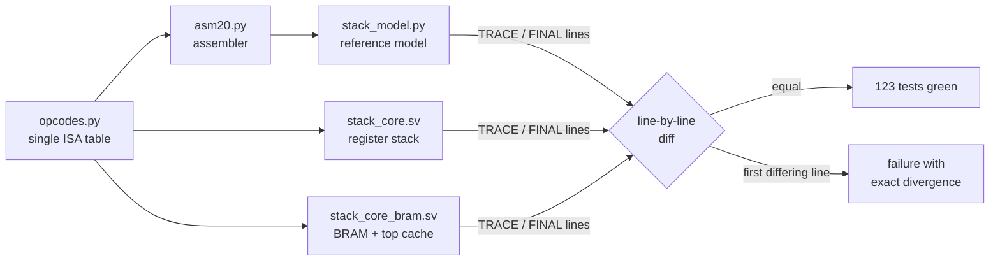

# PROJECT REPORT - GateMate Symbolic - A Precise Tagged Stack Evaluator from Abstract Machine to Hardware

This report covers the complete construction of Laboratory 1 of *Composable Hardware Patterns for Symbolic Computers*: a tagged stack evaluator for the Olimex GateMateA1-EVB (Cologne Chip CCGM1A1), built with open-source tools only, from the executable reference model through two different RTL implementations of the same contract to measured hardware evidence. The laboratory's subject is not arithmetic throughput. It is *precision* — the property that a machine computing with typed values either completes an instruction or leaves its entire architectural state exactly as it was, with a named fault record explaining why. Everything in this report — the state machine, the two-phase commit discipline, the differential test loop, even the bug list — follows from taking that property seriously.

The work was organized as a docmgr ticket (`GATEMATE-SYMBOLIC-001`) with an intern onboarding guide as its primary deliverable, then implemented phase by phase against that guide. The repository is `/home/manuel/code/wesen/2026-09-04--gatemate-symbolic`, with the machine itself in `symbolic_eval/`. It continues the GateMate line of projects in this vault: [[PROJ - MATE-16 VM CPU on the GateMateA1-EVB|MATE-16]] (a 16-bit stack CPU), [[ARTICLE - PCA-Z80 - Static Mesh Architecture and GateMate Hardware Validation|PCA-Z80]] (a Z80 on a message-passing mesh), and [[PROJ - Uxn Computer - A Varvara Machine in GateMate FPGA|Uxn]] (a Varvara machine). What distinguishes this project from its siblings is that the value representation itself carries type information, and that the verification method — a frozen trace format shared by a Python model and the RTL testbenches — closes the loop between abstract semantics and hardware behavior.

> [!summary]
> Three results define the project:
> 1. The laboratory's exit criteria hold on real hardware: Program A (`((7+5)*3)==36`) emits exactly one `BOOL(true)` over UART (`T1:00000001`) and halts; Program B (`BOOL(true) + INT(4)`) enters `TYPE_FAULT` with program counter and stack byte-for-byte unchanged and no output transfer.
> 2. The design fits the book's stop-build budget with a wide margin — 2 of 2 budgeted block RAMs, 392 of ~2,000 CPEs, 16.56 MHz routed against a 10 MHz board clock — while carrying a 17-opcode typed ISA, a 16-entry return stack (`CALL`/`RET` with recursion verified: fib(10) = 55 on the board), and precise fault semantics.
> 3. One executable model, one frozen trace format, and 123 tests make the two RTL implementations (register stack and BRAM-with-top-cache) interchangeable: random programs with random output backpressure produce identical commit traces in the model and in both cores.

## Why this machine exists

The source book develops a pattern language for processors whose work is dominated by symbolic values, dynamic structure, irregular control, and managed memory — the territory of logic engines, functional language implementations, and constraint solvers rather than dense numeric loops. The common denominators of that territory are concrete and mechanical: values carry metadata (a tag), control flow depends on that metadata, and correctness depends on state updates being ordered, visible at defined points, and recoverable at defined points.

Laboratory 1 is the smallest machine that exhibits all three properties. It executes typed stack bytecode — `PUSH_S15 7; PUSH_S15 5; ADD; ...` — where every stack element is a tagged word. The defining discipline is stated in the book's commitment model. Four levels recur throughout:

| Level | Name | Meaning in this machine |
|---|---|---|
| µ | microarchitecturally provisional | ALU result held in a staging register before `COMMIT` fires |
| A | architecturally retired | `pc_q`, `depth_q`, stack contents updated on a commit pulse |
| S | semantically committed | the value popped by `EMIT`, once the channel accepts it |
| E | externally visible | the UART byte on the wire |

The rule that makes the whole laboratory work is a single sentence: **no architectural (A-level) mutation may occur before all checks for an instruction have passed.** Underflow checks, tag checks, arithmetic overflow checks, branch target checks — all of them execute in the `EXECUTE` state; only after every check passes does `COMMIT` write registers. Faults are then precise by construction rather than by repair logic: the faulting instruction's program counter and stack are still the pre-instruction values, and a fault record names the code, the faulting `pc`, the opcode, the depth, and the operand tags.

The two programs that define completion are short enough to state in full:

```text
Program A (success):
  PUSH_S15 7; PUSH_S15 5; ADD; PUSH_S15 3; MUL; PUSH_S15 36;
  EQ; EMIT; HALT
  -> one output transfer BOOL(true), then halted

Program B (precise fault):
  PUSH_TRUE; PUSH_S15 4; ADD
  -> TYPE_FAULT at the ADD, pc and stack unchanged, no output
```

## The machine in one page

### The value representation

Every value in the machine is a `value40` — 40 bits in three fields:

```text
+-----------+-----------+--------------------------------+
| tag[3:0]  | flags[3:0]| payload[31:0]                  |
+-----------+-----------+--------------------------------+
```

The tag selects the type family (`INT`, `BOOL`, `REF`, `ATOM`, `PAIR`, `THUNK`, `IND`, `ERROR`, `POISON`, `EMPTY`); Laboratory 1 produces and consumes only `INT` and `BOOL`, but the full tag set is defined once so later laboratories extend the design without redefining the word. The payload holds a signed 32-bit integer directly — the book's *Immediate-or-Boxed Split*: small values never require a heap. `BOOL` payloads must be canonical (`0` or `1`); a `BOOL` with any other payload is itself a fault (`NONCANONICAL_BOOL`) when consumed by `JZ`. The 40-bit width is a physical convention chosen because it packs into GateMate block RAM organizations (20/40/80-bit modes), not an architectural promise — the reference model is width-agnostic by construction.

### The instruction set

Instructions are 20-bit words: `[19:15] opcode`, `[14:0]` immediate or branch target. Seventeen opcodes are defined:

| Op | Stack effect | Precise-fault preconditions |
|---|---|---|
| `PUSH_S15 k` | `-- INT(k)` | capacity |
| `PUSH_TRUE` / `PUSH_FALSE` | `-- BOOL(1/0)` | capacity |
| `ADD` / `SUB` / `MUL` | `INT a, INT b -- INT(r)` | depth ≥ 2, both `INT`, signed 32-bit result in range |
| `EQ` | `x, y -- BOOL(x==y)` | depth ≥ 2 (any tags; mixed tags yield `BOOL(false)`) |
| `LT` | `INT a, INT b -- BOOL(a<b)` | depth ≥ 2, both `INT` |
| `DUP` | `x -- x, x` | depth ≥ 1, capacity |
| `DROP` | `x --` | depth ≥ 1 |
| `SWAP` | `x, y -- y, x` | depth ≥ 2 |
| `JMP t` | `--` | target < ROM depth |
| `JZ t` | `BOOL c --` | depth ≥ 1, tag `BOOL`, payload canonical, target valid |
| `EMIT` | `x --` | depth ≥ 1; pops only on channel acceptance |
| `HALT` | `--` | none |
| `CALL t` | `--` | return-stack capacity, target valid |
| `RET` | `--` | return stack non-empty |

Two facts about this table matter more than they appear to. First, the check *order* is fixed — capacity/underflow, then operand tags, then canonicality, then branch target — because the fault record must be identical in the model and in RTL, and a program that fails two checks simultaneously would otherwise expose the order. Second, the table exists exactly once, in `tools/opcodes.py`; the assembler, the reference model, and (through a mirrored SystemVerilog package) the RTL all derive from it. The failure mode this prevents — four hand-copied tables drifting apart — is the one MATE-16 was built to avoid, and the discipline carried over unchanged.

### The fault set

Nine fault codes, each leaving the architectural state untouched and stopping the machine:

```text
STACK_UNDERFLOW, STACK_OVERFLOW, TYPE_FAULT, ARITH_OVERFLOW,
BAD_OPCODE, BAD_BRANCH_TARGET, NONCANONICAL_BOOL,
RSTACK_UNDERFLOW, RSTACK_OVERFLOW      (CALL/RET extension)
```

Fault records carry `code`, faulting `pc`, opcode, depth, and the tags of the top two operands. One detail cost a debugging cycle: the operand tags default to the *actual current* top-of-stack tags (zero when the stack is shallower than two), so `BAD_OPCODE` and underflow records still describe the machine's operand context. An earlier model version reported zeros unconditionally and disagreed with the RTL on random programs — the RTL's behavior is the more informative one and is now the contract.

## The method: one model, one trace format, two implementations

The project's central engineering decision is not in the RTL. It is the frozen commit-trace contract. The reference model (`tools/stack_model.py`) implements the abstract machine

```text
M = <pc, stack, output_stream, fault, halted>
```

as directly executable Python — one `step()` per abstract transition, checks before mutations, a `TraceRecord` per retired instruction, fault, or output acceptance. The RTL testbenches print **exactly the same lines**:

```text
TRACE 0 0 1 PUSH_S15 1 COMMIT
TRACE 1 1 2 PUSH_S15 2 COMMIT
TRACE 2 2 3 ADD 1 COMMIT
TRACE 3 3 4 PUSH_S15 2 COMMIT
TRACE 4 4 5 MUL 1 COMMIT
TRACE 5 5 6 PUSH_S15 2 COMMIT
TRACE 6 6 7 EQ 1 COMMIT
TRACE 7 7 8 EMIT 0 OUTPUT 1 00000001
TRACE 8 8 8 HALT 0 COMMIT
FINAL 1 NONE 8 0 1 0
```

That trace is the book's expected commit trace for Program A, reproduced by the model and by both RTL cores character-for-character. The test loop is then mechanical:



The value of this construction showed up before any RTL existed. Three hand-written test programs were wrong in ways the model caught immediately: a loop used an `INT` as the `JZ` condition (`TYPE_FAULT`), a countdown loop inverted the `JZ` polarity (`JZ` branches on *false*), and a raw-word fixture encoded the value `0x1F` instead of the word with opcode `0x1F` (`0x1F << 15 = 0xF8000`). Each would have cost board-debugging time otherwise. The model also reaches states legal programs cannot: `NONCANONICAL_BOOL` and `ARITH_OVERFLOW` for `ADD`/`SUB` are unreachable through `PUSH_S15`-only programs of practical length (a 15-bit immediate cannot build operands large enough), so the tests construct machine states directly and the RTL must match.

Random testing follows the book's recipe: a generator maintains a typed software stack, emits only legal instructions, and occasionally injects one illegal instruction (mixed-tag `ADD`, underflowing `DROP`, or a raw bad opcode). The generated programs run through the model and both cores with *random output backpressure* — the testbench deasserts `out_ready` pseudo-randomly (one-in-four stall per cycle, deterministic per seed) — and the commit traces must still match exactly. Backpressure changes timing, never semantics; that equivalence is the *Delayed Irreversible Store* pattern under test.

## The register-stack core: staging before mutation

The first RTL implementation (`rtl/stack_core.sv`) keeps the entire stack in registers — 32 `value40_t` entries — deliberately isolating semantic and interface behavior from RAM latency. Its controller is a nine-state FSM:

```text
RESET -> FETCH -> FETCH_WAIT -> DECODE -> EXECUTE -> COMMIT -> FETCH ...
                                  |          |
                                  |          +-> OUTPUT_WAIT -> (out_ready) -> FETCH
                                  +-> FAULT | HALTED
```

Instructions take a variable number of cycles (five minimum: fetch, wait, decode, execute, commit; `EMIT` takes as many as the channel demands). The structural rule that matters is the division of labor between the last two states:

- `EXECUTE` performs **every** precondition check and stages complete next-state data: next `pc`, next depth, up to two stack-write descriptors (address and data), the `EMIT` pending value, the halt flag.
- `COMMIT` is the **single mutation owner**: it applies the staged writes to `pc_q`, `depth_q`, and `stack_q`, increments the sequence counter, and fires the one-cycle trace pulse.

```systemverilog
// EXECUTE (combinational): validate all preconditions, stage everything
OP_ADD: begin
  if (depth_q < 2)                do_fault(F_STACK_UNDERFLOW);
  else if (top1.tag != TAG_INT || top0.tag != TAG_INT)
                                   do_fault(F_TYPE_FAULT);
  else if (add_ovf)                do_fault(F_ARITH_OVERFLOW);
  else begin
    wrA_en_d   = 1'b1;
    wrA_addr_d = depth_q - 2;      // result overwrites NOS
    wrA_data_d = mk_int(add_w[31:0]);
    ndepth_d   = depth_q - 1;
    npc_d      = pc_q + 1;
    state_d    = S_COMMIT;
  end
end

// COMMIT: the only place architectural state changes
S_COMMIT: begin
  pc_d    = npc_q;
  depth_d = ndepth_q;
  seq_d   = seq_q + 1;
  trace_valid_d = 1'b1;  /* ... trace fields ... */
  state_d = S_FETCH;
end
```

Nothing else in the module writes the stack. This is what makes the precise-fault claim an argument rather than a hope: a fault fires from `EXECUTE` with the staged data discarded, and there is no second writer whose interleaving could leave a half-applied arithmetic result. The same discipline governs `EMIT`: the value moves to a pending register, the machine enters `OUTPUT_WAIT`, and the pop, the `pc` advance, and the `OUTPUT` trace pulse happen only on the edge where `out_valid && out_ready`. While blocked, the producer holds the item stable — asserted by a testbench monitor, sampled pre-edge to avoid racing the randomizer.

## The refinement: a BRAM stack behind a two-entry top cache

The register version passing is the entry condition for the second implementation (`rtl/stack_core_bram.sv`), which replaces the stack body with synchronous block RAM and keeps a two-entry cache of the newest values — the book's *Split-Lifetime Frame*. The representation:

```text
top0_q       newest value            (valid when tc_q >= 1)
top1_q       next value             (valid when tc_q == 2)
RAM[dc-1]    newest deep value      (dc_q live entries, LIFO)
dt_q         first free RAM address (== dc_q; no holes)

invariant:  architectural depth == tc_q + dc_q
logical stack (newest -> oldest):
    top0, top1, RAM[dc-1], RAM[dc-2], ...
```

The invariant is checked by the testbench on every cycle after reset, not merely at instruction boundaries. Holding it across every operation is what makes the refinement a proof rather than a hope, and it dictates the machinery:

**Push with spill.** When the cache is full (`tc == 2`), the old `top1` is written to `RAM[dc]`, `dc` and `dt` increment, and the new value displaces into the cache:

```text
if tc == 0:   top0 = v;                tc = 1
elif tc == 1: top1 = top0; top0 = v;   tc = 2
else:         RAM[dc] = top1; dc++; dt++
              top1 = top0; top0 = v
```

**Binary operation with operand in RAM.** This is the subtle case. When `tc == 1` and `dc >= 1`, operand *a* lives at `RAM[dc-1]`, and after the operation removes one element the *new* `top1` lives at `RAM[dc-2]` — two sequential RAM reads, at different addresses, for one instruction:

```text
tc == 2:  operands from cache; result -> top0;
          if dc > 0: top1 <- RAM[dc-1], dc--, tc = 2  else tc = 1
tc == 1:  a <- RAM[dc-1]                      (read 1, at DECODE)
          compute result
          if dc >= 2: top1 <- RAM[dc-2]        (read 2, after EXECUTE)
                      tc = 2, dc -= 2
          else:       tc = 1, dc = 0
```

**Pop with refill.** Removing the newest value when `tc == 1` and `dc > 0` requires reading `RAM[dc-1]` into `top0` and shrinking the deep region. The same applies after an accepted `EMIT`.

Two implementation decisions keep this machinery honest:

1. **Prefetch at DECODE.** The FSM issues the `RAM[dc-1]` read *before* the instruction's checks run, whenever the representation will need it (operand, binary-result refill, or pop refill). This is safe because reads are side-effect-free: a prefetched value that an ensuing fault discards changes nothing, and the fault record does not depend on it. The cost is one extra state (`RDWAIT`) on the instructions that need it.
2. **Atomic count updates at the commit point.** `depth_q`, `tc_q`, `dc_q`, `dt_q`, and `pc_q` all change on the same edge — in `COMMIT`, or on the `EMIT` acceptance edge. RAM reads that repair the representation (the refill data itself) are internal stuttering around that pulse. The trace never observes an intermediate state in which `depth != tc + dc`.

The write-side discipline matches: spill writes are issued only in `COMMIT`, at address `dc`, which no read can target in the same cycle (reads target `dc-1` or `dc-2`, issued from different states). The memory wrapper (`sync_sdp_ram.sv`) exposes exactly two points — write-enable/address/data, and read-data valid one cycle after the read address — and nothing in the design depends on combinational read data, which is what would have made simulation pass and synthesis fail.

## The `EMIT` commitment boundary, measured twice

`EMIT` deserves its own section because it is where the commitment levels separate visibly. The core offers the value (`out_valid`, `out_data` held stable); the board top inserts the book's one-entry elastic register (`rv_reg.sv`) and then a byte printer; the printer only accepts when the UART transmitter is idle. One emitted value becomes 13 bytes at 115200 8N1:

```text
'T' <tag hex digit> ':' <8 payload hex digits, MSB first> CR LF
e.g. BOOL(true) -> T1:00000001\r\n     INT(55)  -> T0:00000037\r\n
```

The semantic commit (S-level) is the pop at `rv_reg` acceptance. The external event (E-level) is the last UART bit roughly 113 µs later. A board-level testbench bug made this distinction concrete: the testbench originally waited only forty bit-times after `halted` before finishing, and captured four and a half values — the machine had halted, but the printer and elastic register were still draining accepted-but-unframed values. The drain window is now sixty byte-times, and the lesson is recorded in the machine's own terms: *acceptance is not transmission, and a drain path behind a commit boundary needs its own termination condition.*

## The CALL/RET extension: continuation state

The book's first listed extension adds `CALL`, `RET`, "and explicit continuation records." The implementation gives the machine a separate 16-entry return-address stack in registers (10-bit entries — return addresses are ROM addresses, not values), widening the fault-code field from three to four bits to name `RSTACK_UNDERFLOW` and `RSTACK_OVERFLOW`. `CALL` pushes `pc+1` and jumps; `RET` pops and jumps; both follow the same stage-in-`EXECUTE`, apply-in-`COMMIT` discipline as every other instruction, with the return-stack write staged alongside the data-stack writes and applied by the same single mutation owner.

The interesting program is recursion, because a pure data stack forces an explicit discipline for keeping a value alive across nested calls. `fib` in this ISA:

```text
fib:                       ( n -- fib(n) )
    DUP PUSH_S15 2 LT      BOOL(n < 2)
    JZ fib_rec             n >= 2 -> recursive case
    RET                    base case: n is the result

fib_rec:
    DUP PUSH_S15 2 SUB     [n, n-2]
    CALL fib               [n, fib(n-2)]
    SWAP                   [fib(n-2), n]
    PUSH_S15 1 SUB         [fib(n-2), n-1]
    CALL fib               [fib(n-2), fib(n-1)]
    ADD
    RET
```

Each `fib` frame consumes exactly one argument and leaves exactly one result; the caller duplicates `n` before each call and swaps between them so the second call sees the original. fib(10) runs 1,682 committed instructions with a maximum return-stack depth of 10 and a maximum data depth well inside the 32-entry budget, and the board emits `T0:00000037` — 55 — before halting. Two fault-demo programs complete the extension: `RET` on an empty return stack, and an infinite self-call that fills the return stack and faults precisely on the seventeenth `CALL` with all sixteen entries live.

## Hardware results

Synthesis (Yosys `synth_gatemate -luttree -nomx8`), place-and-route (nextpnr-himbaechel, router2), packing (gmpack), and loading (openFPGALoader over the RP2040 DirtyJTAG bridge) are driven by one Makefile. Measured against the book's stop-build budgets:

| Metric | Budget | Measured |
|---|---|---|
| Block RAM | 2 physical blocks | 2 × CC_BRAM_20K (1K×20 ROM + 512×40 stack) |
| Logic | ~2,000 CPEs (before debug instrumentation) | 392 CPEs |
| Multiplier | — | 1 × CC_MULT (34×34 for `MUL` overflow detection) |
| Timing | 10 MHz board clock | 16.56 MHz routed max |

The 392-CPE figure is worth a comment. The yosys netlist is 1,894 cells, but CPE packing absorbs the LUT/mux fabric efficiently; the design sits at 2% of the device. The stop-build budget is not a forecast — it is the threshold at which the book says to stop and simplify. This machine never approached it, which is the intended outcome of keeping the multiplier to one inference point, the tag decoders deduplicated through the shared package, and the deep stack in BRAM rather than registers.

Hardware evidence, captured by reading `/dev/ttyACM0` at 115200 during bitstream load (the program runs at configuration time; the FPGA button is wired as a global experiment abort that restarts it):

```text
Program A: T1:00000001\r\n            (BOOL(true); then halted, LED solid)
Program B: (no bytes)                (precise TYPE_FAULT, LED fast-blink)
fib:      T0:00000037\r\n            (55; halted)
```

The LED encodes machine state and taught the project its last lesson: the GateMateA1-EVB user LED is **active-low** (the LiteX platform names the pin `user_led_n`). The first implementation drove the pin high for the halted state, which left the LED dark while the machine was demonstrably fine — the UART output proved the halt. The fix is one inversion at the pin (`user_led = ~led_logic`); the episode is recorded here because "the LED is off" and "the machine is dead" are distinguishable only if the polarity convention is written down.

## Toolchain portability: the yosys ∩ iverilog subset

Both tools are required — iverilog for simulation, yosys for synthesis — and their SystemVerilog acceptance is not identical. Every feature used had to lie in the intersection, and each mismatch was fixed portably rather than per-tool:

| Limitation (yosys) | Portable fix |
|---|---|
| No `return` in functions | Classic function-name assignment (`mk_int = v;`) |
| No `import` (file-scope or module-header) | Fully-qualified references (`symbolic_types_pkg::TAG_INT`) everywhere |
| No multi-declarator typedef'd variables | One `value40_t` declaration per line |
| No `parameter string`; `-D` macro strings mangled on the command line | ROM init via a `.ys` script file (yosys's own tokenizer), MATE-16 pattern |
| Enum-typed struct fields break width inference in package functions | Plain `logic [3:0] tag` field; the enum remains documentation |

The qualification pass that rewrote bare package references into qualified ones was applied by a word-boundary regex over a fixed name list — and its interaction with later edits produced the project's most instructive failure. Patch patterns written against pre-qualification text silently no-opped three times (the `CALL`/`RET` case insert, a parameter declaration, a port width), each time printing success. The symptom was precise and diagnostic: the RTL executed `PUSH_S15` and then faulted `BAD_OPCODE` at the `CALL`, because an unqualified `OP_CALL:` case label elaborates as an implicit wire that never matches. The model diff caught all three within one test run. The recorded rule: every scripted patch asserts its match count and is verified by grep before the work is considered applied.

## Verification inventory

123 tests, all green, roughly one second per hundred:

| Suite | Count | Covers |
|---|---|---|
| `test_model.py` | 36 | book Program A trace exact; Program B precise fault; every opcode at minimum depth; all nine fault cases (constructed states for the unreachable ones); `CALL`/`RET`; fib; value packing |
| `test_assembler.py` | 12 | round-trip, labels, error cases, raw `WORD` |
| `test_directed.py` | 17 | register core vs model on 16 programs + stall-seed reruns |
| `test_bram.py` | 52 | BRAM core on the same programs, refinement invariant per cycle, 24 random-program differential tests, 12 register-core random tests |
| `test_top.py` | 6 | full-board sim: UART byte stream vs model EMITs, including fib and countdown |

The random generator deserves its own note because it is the only test source that explores the cache boundaries systematically: programs of 120 instructions against a total stack depth of 8 (cache of 2, deep region of 6) force spill and refill on nearly every instruction, with roughly 6% deliberately illegal injections, all under random backpressure. The first fault-record disagreement the suite ever caught — operand tags in `BAD_OPCODE` records — came from exactly this source.

## How to reproduce

```bash
source ~/fpga/oss-cad-suite/environment
cd /home/manuel/code/wesen/2026-09-04--gatemate-symbolic/symbolic_eval

make test                    # 123 tests (model + assembler + both cores + board sim)
make asm PROG=fib            # assemble programs/fib.asm
make bit PROG=fib            # synth -> PnR -> pack (ROM image baked in)
make load                    # load over DirtyJTAG

stty -F /dev/ttyACM0 115200 raw -echo && cat /dev/ttyACM0
# during/after load: T0:00000037  (fib(10) = 55), then LED solid ON
# press the FPGA button to restart the program
```

## What remains open

- **Trace RAM.** The commit trace currently exists only at testbench ports. A `trace_sink.sv` that writes each commit packet into a block RAM on `trace_valid` and streams it over the existing UART after `HALT`/`FAULT` — in the same `TRACE` line format — would close the loop fully: hardware output diffed line-by-line against the model. Estimated at one to two hours and one additional CC_BRAM_20K; the book excludes debug instrumentation from the stop-build budget by construction ("~2,000 CPEs *before debug instrumentation*").
- **ILA.** The official GateMate integrated logic analyzer belongs to the proprietary Cologne Chip toolchain; the OSS flow cannot insert one. Trace RAM is the open-source-native equivalent for this project, and produces model-comparable records rather than waveforms.
- **Random CALL/RET.** The random generator does not yet emit calls; directed programs (fib, countdown, the two rstack fault demos) cover the extension, but random return-stack boundary exercise is the natural next test source.
- **Fault-record contract.** `rdepth` appears in the `FINAL` line but not in `FAULT` trace records; if later laboratories need fault-time continuation state, the record format is the place to add it.
- **Laboratories 2–5.** The book's ladder continues with rollback constraint solving (checkpoints, trails), elastic dataflow, lazy graph reduction, and a relational query engine, each reusing this machine's substrate: the value word, the trace contract, the elastic output path, and the verification loop.

## Sources

- Book (primary source, imported into the ticket): `ttmp/2026/09/04/GATEMATE-SYMBOLIC-001--*/sources/Composable_Hardware_Patterns_for_Symbolic_Computers.md` — Laboratory 1 at lines 4211–4569; pattern contract ch. 3; commitment levels ch. 4; GateMate substrate and budgets ch. 6; `symbolic_types_pkg` and `rv_reg` in Part III.
- Intern onboarding guide (ticket design doc): `ttmp/2026/09/04/GATEMATE-SYMBOLIC-001--*/design-doc/01-intern-onboarding-guide-symbolic-computer-patterns-on-gatemate.md`
- Investigation diary (12 steps, failures verbatim): `ttmp/2026/09/04/GATEMATE-SYMBOLIC-001--*/reference/01-investigation-diary.md`
- Machine: `/home/manuel/code/wesen/2026-09-04--gatemate-symbolic/symbolic_eval/` — `rtl/` (two cores, `sync_sdp_ram`, `program_rom`, `rv_reg`, `uart_tx`, `top`), `tools/` (`opcodes.py`, `stack_model.py`, `asm20.py`), `programs/` (16 programs), `sim/` (three testbenches, five pytest suites), `scripts/synth.ys`.
- Sibling projects: [[PROJ - MATE-16 VM CPU on the GateMateA1-EVB]], [[ARTICLE - PCA-Z80 - Static Mesh Architecture and GateMate Hardware Validation]], [[PROJ - Uxn Computer - A Varvara Machine in GateMate FPGA]]
