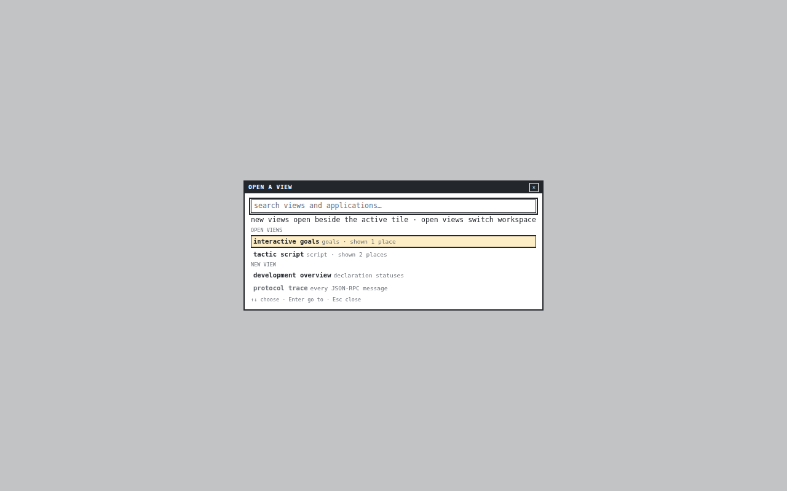
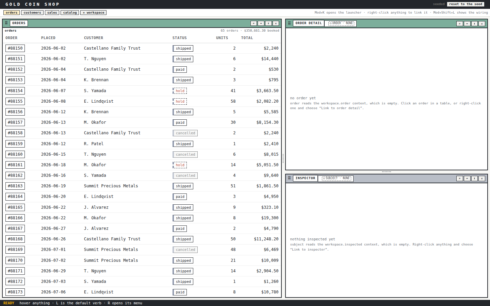
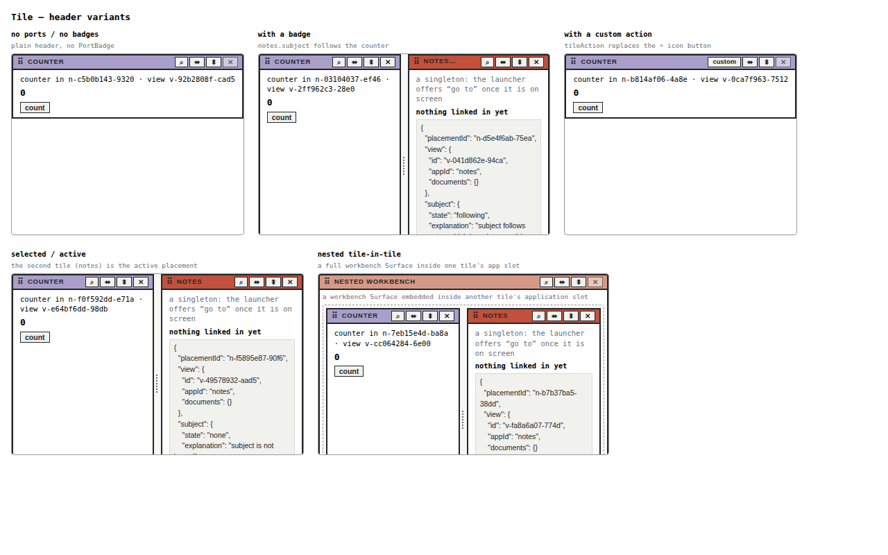
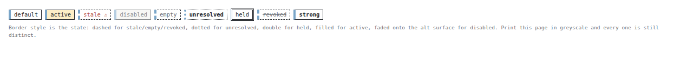
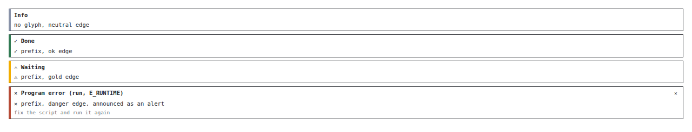
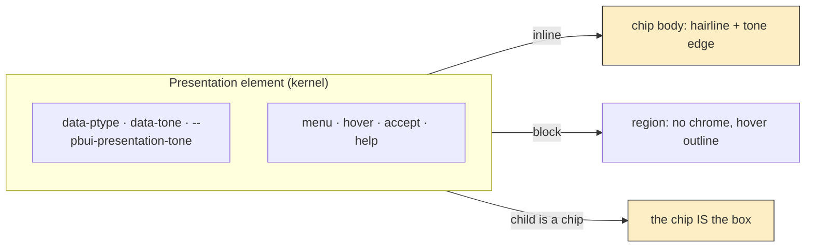
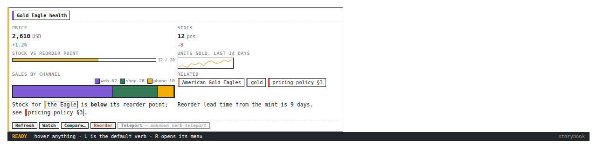
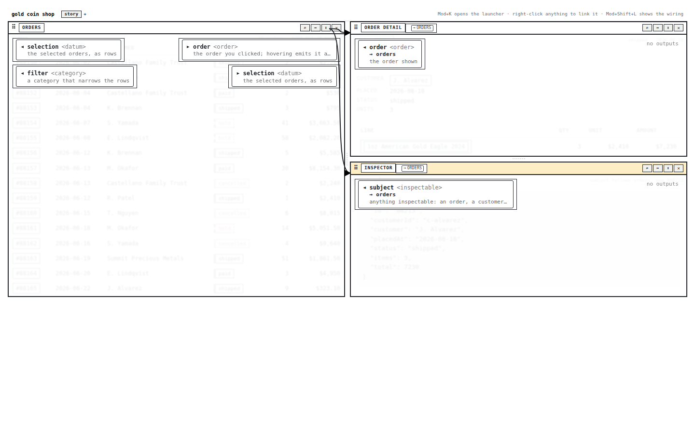
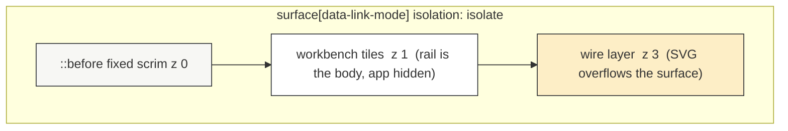
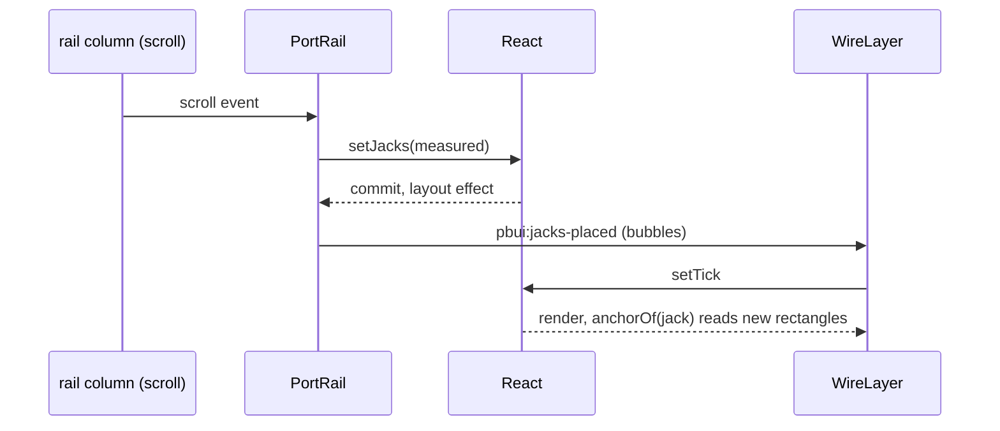

# PROJECT REPORT - PBUI Visual Consolidation and Link-Mode Wiring - One Chip, One Shell, and Wires That Route Around Tiles

This report covers one day of work on `pbui`, the presentation-based React UI family, split across two tickets. `PBUI-VISUAL-1` audited the visual state of the core library, seven packages and four demo applications with a corpus of 663 screenshots, then consolidated the family in eight phases so that the same object renders the same way everywhere. `PBUI-WIRING-1` restyled the workbench's link mode after a reference mock, in nine phases, ending with a router that draws wires through the gutters between tiles. Both tickets live under `ttmp/2026/09/04/` in the repository, each with a design document, a diary in the strict step format, per-phase screenshots and a thermal work slip at every phase boundary.

The report is written for someone who will run the next style pass or extend link mode. It explains the mechanisms that were introduced, the reasoning behind each rule, the defects that were found along the way and how each was diagnosed, and the procedure that makes the whole thing repeatable.

> [!summary]
> Three ideas carry the day's work:
> 1. **A screenshot corpus is the unit of evidence for a design system.** Eight storybooks and four demos were shot with one harness into numbered manifests, so every claim in the audit and every fix in the consolidation cites an exhibit by code, and the after-corpus is generated by the same scripts.
> 2. **A presentation is a chip when it is inline and a region when it is a block.** The kernel now carries each object's tone as a custom property and draws the family's edged box on inline presentations, draws nothing on block presentations, and lets a chip inside a presentation be the box. Products stop inventing bodies.
> 3. **Wires are a routing problem, not a drawing problem.** Anchors, jacks, a containing block, a stacking order, a grid router with lane spreading and an explicit commit signal between the rail and the wire layer each fixed one cause of "the wire is wrong", and the WiringLab story lets a person try all of it by hand.

## Why this project exists

`pbui` ships a core library (tokens, atoms, molecules, organisms, the presentation kernel) and a family of packages built on it: `pbui-workbench` (tiles, splits, launcher, links), `pbui-chat`, `pbui-ecommerce`, `pbui-plotscript`, `pbui-sandbox`, `pbui-editor`, and `datalab-ui`, which is the oldest product and the reference implementation of the look. Each package has its own storybook, and three of them have demo applications with a Vite entry point.

The user's request was to look at all of it at once and consolidate the visual style, because "sometimes we have objects that use a different visual representation, sometimes there are too many nested boxes, sometimes margins are missing". The reference for what "consistent" should mean was named explicitly: the `pbui-agent-workbench` artifact, without its brutalist hard shadows. That mock has a small, strict vocabulary: one monospace face at four sizes, hairline ink borders and zero radius, no blurred shadows, a dark masthead and a dark status footer, tile title bars tinted by the kind of thing the tile shows, outlined chips with a 4px tone edge, and two to six pixels of internal spacing.


Measured against that vocabulary, the family was one system at the atom level and four systems at the shell level. The object menu was pixel-identical in every package. Tiles, badges, dialogs, banners and page shells were not.

## The method: a corpus with exhibit codes

The first decision was to make every observation citable. A small Playwright harness, `scripts/01-screenshot-storybook.mjs` in the VISUAL-1 ticket, fetches a running Storybook's `index.json`, opens every story in the iframe, crops to the rendered content and writes a `manifest.json` with the story id, title, name, file and size. A second script drives the demo applications through their states (menus, launcher, accept mode, dialogs), a third drives the link flows, a fourth captures interaction states that a static story cannot show. Five subagents ran the collection in parallel against twelve servers in one tmux session; each wrote a notes file with one line per screenshot in the form `NNN | name | what is visible | oddities`.

The analysis stayed in the main session. The agents' notes are evidence; the conclusions were checked against the images, and three of the agents' claims were rejected on inspection (a "pill-shaped" toolbar button that was a raw native `<button>` in the story, a "garbled" badge that was merely cramped, a "layout bug" that was the story's fixed container). A sixth script, `06-build-catalog.py`, turns the manifests and notes into a catalog where every image has a code such as `C-155` (core, file 155) or `D-CH-001` (demo, chat, file 001), so that feedback can name an exhibit and the after-corpus can be paired with the before-corpus by story id rather than by file number.

The port map is part of the method, because packages consume each other's built `dist` and a stale build lies in a screenshot:

| Server | Port | Notes |
|---|---|---|
| core storybook | 6006 | reads `src/` directly |
| pbui-chat, workbench, sandbox, editor, plotscript, ecommerce storybooks | 6007 to 6012 | read `@hyperslop-systems/pbui` from `dist` |
| datalab-ui storybook | 6013 | its default 6006 collides with core |
| datalab, chat, plotscript, ecommerce demos | 5173 to 5176 | chat needs `GOWORK=off go run ./cmd/pbui-chat serve --port 8090` |

Two rules follow from that table and were learned the expensive way. First, rebuild core and any changed package before taking a screenshot of a downstream storybook, because the storybook shows the last successful build. Second, if a build fails midway, restart the downstream storybooks with their Vite cache removed, because they pre-bundle a half-written `dist` and then render, for example, chips with no border at all.

## The design system before consolidation

The CSS inventory (a 791-line document produced by one of the agents and verified section by section) described a system whose parts were individually reasonable and collectively inconsistent. The mechanisms in use were four: CSS modules for atoms and layout, `data-part` attribute sheets for the tile chrome and the presentation parts, `data-pbui-component` attribute sheets with an `unstyled` escape hatch for three components (Dialog, JsonBlock, InspectorPanel), and a zero-specificity `:where()` fallback sheet. datalab-ui added five global sheets and inline `style={{}}` objects.

Three structural facts explained most of the visible inconsistency.

**The presentation parts had two definitions.** `src/styles.css` carried a `:where()` block that styled the presentation box and the object menu at zero specificity, and `public/presentation-parts.css` carried the same parts at attribute specificity. Both shipped in `dist/pbui.css`, so the second always won, and the first was dead weight except for whatever properties the winner had forgotten to define. When the loser was deleted, the presentation's base border vanished, which is how it became clear that the "fallback" was load-bearing for one property.

**The fallbacks were a second palette.** Every `var(--pbui-x, literal)` in the four global sheets carried a literal that disagreed with `tokens.css`: the firm border was `1.5px solid #1f2430` in five places and `2px solid #23262b` in the token, the selection fill was a cool blue `#e6ecf5` in four places and the warm `#fdeec6` in the token, the radius was `2px` twice and `0` in the token. A fallback only shows when the token is missing, which is exactly when nobody is looking; the effect was an older look embedded in the bundle, surfacing in whichever consumer happened to lose a token.

**Six tokens existed only in datalab-ui.** `--pbui-border-grid`, `--pbui-border-rule`, `--pbui-wash`, `--pbui-track-banner`, `--pbui-space-6` and `--pbui-selected-wash` were defined in datalab's `tokens.css`, a byte-for-byte copy of core's plus those names. pbui-chat read the two border tokens in twelve files with no fallback, so its grid lines and rules did not render outside datalab. This is the class of defect the user had described as "margins missing": not a missing padding rule but a missing definition, silently invalidating a declaration at computed-value time.

The rest of the inventory was counting: fifteen chip implementations with no two sharing padding, border and font size; seven implementations of the uppercase tracked label at five tracking values; sixteen hand-written tile header rows; seven key/value grids; the pairing `flex: 1; min-height: 0; overflow: auto` copied twelve times in core alone although an `AppBody` component existed for it.

## The eight consolidation phases

The user ranked ten priorities from the audit and answered them by number: datalab's tile chrome with the dark masthead, one chip, never rounded, no nested double borders, the selection colour un-overloaded, one notice grammar, tokens fixed at the source, one label idiom, a global skin for native controls. The design document turned those into eight phases, each independently shippable and screenshot-verified, all hard cutovers with no compatibility layers.

### Phase 1: one definition site for tokens

The 27 datalab-only names moved into `src/tokens.css` with datalab's values, together with the tone family that had been defined per product (`--pbui-tone-order`, `--pbui-tone-product`, `--pbui-tone-step` and fifteen more), the chart palette, and a new `--pbui-tag-wash` for chip fills that carry no state. Every inline fallback in the four global sheets was removed with a balanced-parenthesis rewrite (a regex on `[^)]*` would have broken `rgb(35 38 43 / 28%)`). datalab's sheet was deleted; its four tests that read it were re-pointed at core's, with comments stripped before matching, because core's header comment contains the literal text `--pbui-ink: …` and the unstripped regex matched it and produced `NaN` in a contrast check.

```css
/* src/tokens.css, the block that ended the datalab-only tokens */
:where(:root) {
  --pbui-wash: #f7f7f4;
  --pbui-selected-wash: #fffdf4;
  --pbui-tag-wash: var(--pbui-pane-alt);
  --pbui-border-rule: 1px dashed var(--pbui-line);
  --pbui-border-grid: 1px solid var(--pbui-line);
  --pbui-tone-order: #7cae9b;
  --pbui-tone-product: #e0b95c;
  --pbui-tone-tool: #b9bec7; /* light slate: a tile bar must carry ink text */
  /* … */
}
```

The `:where(:root)` wrapper is the mechanism that lets one sheet be the default for every product: it has zero specificity, so a product's own `:root { --pbui-ink: … }` wins regardless of import order.

### Phase 2: one definition of the parts, and the Dialog on the menu recipe

`src/styles.css` shrank to the `body` typography baseline. The parts sheet became the single definition and absorbed what the deleted block had been quietly providing: the presentation's base box, the menu item's button reset, the focus ring, the danger colour, the placeholder rule. `public/components.css` was rewritten in tokens. The Dialog had been the only rounded, shadowed, backdrop-blurred, `rem`-spaced surface in the family, with an 18px title in an 11.5px system; it is now the object menu at dialog size, which is the rule the whole ticket converged on: paper or pane, a hairline or firm ink border, zero radius, no blurred shadow, an inverted header in the tracked-uppercase label voice, px spacing from the five-step scale, monospace inherited from `body`.




datalab's `dialogs.css`, which had overridden core's Dialog wholesale because core's default did not match core's own language, was deleted; its content had become the default.

### Phase 3: one tile chrome, one shell, tones by kind

The four demos had four page shells: a dark masthead and status footer in datalab and chat, a bare white row in plotscript and ecommerce, tile header tints on every tile, on two, on one, or on none. pbui-workbench gained `AppShell`, a component with slots (`wordmark`, `tagline`, `mastheadActions`, `banner`, `strip`, `stripActions`, `status`) and a fixed geometry: a masthead on the inverted surface with the wordmark uppercase and banner-tracked, a strip row on paper under a grid rule, a canvas on the wash as a one-cell grid so the workbench surface gets a committed height, a status row for the mouse-doc line. The chat demo, the plotscript demo, the ecommerce `ShopShell` and datalab's `WorkbenchShell` mount it; their hand-rolled grids and their CSS are gone.




Every tile bar is now tinted by the kind of thing it shows, from the core tone family. This is the reference's device for telling tiles apart, and it replaced chart-palette colours on bars (which read as decoration) and a story-only orange. One tone had to change: the tool grey `#696e75` is a fine chip edge and an unreadable bar under ink text, so it became a light slate.

Two nesting rules landed in the chrome. A workbench nested in a tile gets a `space-2` gutter on the wash so two firm frames never touch. Content padding is the application's job through `AppBody`, which pads by default and has a `flush` variant for tables; the workbench story apps that had been rendering text on the frame now render through it.




One rule in `Tile.module.css` deserves its own paragraph because it broke datalab on the first cut. The workbench's application cell was a one-cell grid so that a single-root application (a scrolling body, an editor) gets a committed height. datalab's applications render fragments (a doc bar, a toolbar, a body), and when datalab first imported the workbench stylesheet, the grid handed the first fragment child the entire height and centred its contents. The rule is now conditional on the number of roots:

```css
.app {
  display: flex;
  flex-direction: column;
  min-width: 0;
  min-height: 0;
}

/* One root: a committed cell. Fragments: normal flow. */
.app:not(:has(> * + *)) {
  display: grid;
  grid-template-columns: minmax(0, 1fr);
  grid-template-rows: minmax(0, 1fr);
}
```

That datalab had never loaded the workbench's module CSS at all, and had worked by the accident of block flow, was itself a finding.

### Phase 4: one Chip

The core `Chip` grew the knobs the fifteen implementations had been re-inventing: `size` (small, tiny, micro), `fill` (none, wash, tone), `edge` (the 4px tone edge, off for badges that name a state rather than a type), a leading `glyph`, and seven states. Border style is the only state language, so a badge, a pill and a tag stay legible in greyscale and identical across products; colour reinforces it and never replaces it.

| State | Border | Colour |
|---|---|---|
| active | solid | selection fill |
| stale | dashed | danger text |
| disabled | solid | 0.55 opacity on the alt surface |
| empty | dashed | faint text |
| unresolved | dotted | bold |
| held | double, 3px | ink |
| revoked | dashed | faint, struck through |



The workbench's `PortBadge` became a tiny edgeless Chip with the link kernel's badge state mapped onto the chip states; datalab's seven badge components became Chip calls and their modules were deleted. Interactive small boxes (verb chips, the rebalance badge) stayed `Button`s: chips are inert, buttons act, and that sentence is now in the Chip's doc comment.

### Phase 5: one notice, one mode banner

`Callout` is the family's notice: paper, a hairline, a 4px edge that names the severity (neutral, ok green, warning gold, danger red), an optional hint and dismiss. The `danger` variant announces as `role="alert"` and the others as `status`, which is what an earlier version had used to justify having no danger variant at all while failures grew four unrelated looks across the products. The kernel's refusal notice draws the same recipe. The accept banner is the mode banner (an ink bar, paper text, the mode word in gold) like the mouse-doc line and the workbench's placing banner, instead of a red bar.



### Phase 6: labels, TileHeader, KeyValueList

Every uppercase label reads `--pbui-track-label`; the literal `0.04em` that had appeared independently in six files is gone. Core gained `TileHeader` (a tight bordered toolbar with a strong tiny title, chips, a faint status and actions) and `KeyValueList` (a definition-list grid with faint tracked keys), and sixteen header rows and five facts grids across ecommerce, sandbox, plotscript, workbench and chat render through them. A required `title` on the shared header turned out to be a useful lint: two tiles had been rendering without one.

### Phase 7: native controls

A zero-specificity block in `styles.css` skins checkboxes, radios, selects, bare buttons and bare text inputs, guarded by `:not([class]):not([data-part])` so that the atoms' modules and the parts sheets keep winning. A raw `<button>` in a story or a sandboxed program now reads as the framed tiny Button. A `<select>` cannot carry a pseudo-element, so its chevron is an inline SVG data URI with the ink colour as a literal; that one literal is commented.

### Phase 8: story hygiene and the after-corpus

The package storybooks each got a `base.css` with the family's body typography, because Storybook's preview sets its own body font at class specificity, which beats the library's zero-specificity baseline; the root storybook had carried such a file since the audit began, and that difference explained why inherited text looked sans-serif in the package storybooks and monospace in the products. Five story defects (a black-on-black icon story, two brand stories with undefined tokens, four tour stories without their provider, an audit story opening link mode before mount) and one real crash (the chat composer offering every vocabulary type to `pbui.accept`, including an undeclared runtime type) were fixed. Then the whole corpus was re-shot into `screenshots-after/` and a generator paired 38 exhibits by story id for the report in `design-doc/03`.

## The presentation is a chip

The most consequential rule came from feedback after the phases, when the user pointed at four things at once: a box nested around a port badge, order ids without a coloured edge, prose mentions that "are not proper presentations", and a stat widget whose every child had grown a bar. All four were one defect. The kernel's `Presentation` element is a behaviour wrapper: it provides `data-ptype`, the object menu, hover, accept mode and the help card, and renders whatever body it is handed. It had no opinion about that body, so every call site invented one: raw text in a table cell, a `Chip` in a watchlist, a title in a bar, a stat card in a widget.

The fix has three parts, all in the kernel and the parts sheet.

**The kernel carries the type's tone.** Descriptors declare a semantic tone (`neutral`, `accent`, `positive`, `warning`, `danger`, or a `var(...)` reference), and the kernel now sets a custom property on each presentation element:

```ts
function presentationToneVar(tone: string, type: string): string {
  const semantic =
    tone === "accent" ? "var(--pbui-cat-2)"
    : tone === "positive" ? "var(--pbui-ok)"
    : tone === "warning" ? "var(--pbui-cat-3)"
    : tone === "danger" ? "var(--pbui-danger)"
    : tone.startsWith("var(") ? tone
    : "var(--pbui-tone-neutral)";
  return /^[A-Za-z][A-Za-z0-9_-]*$/.test(type)
    ? `var(--pbui-tone-${type}, ${semantic})`
    : semantic;
}
// …
style={{ "--pbui-presentation-tone": presentationToneVar(tone, reference.type) }}
```

The type's own token wins when the family names one (`--pbui-tone-order` exists, so an order presentation is green wherever it appears), and the descriptor's semantic tone is the fallback.

**Inline is a token, block is a region.** The parts sheet draws the 4px edge on every inline presentation from that property, and draws nothing on a block presentation; a block presentation (a stat, a meter, a table row) is a region you can hover and right-click, and the hover outline is its only cue. A presentation whose direct child is a chip, or another presentation, draws no box of its own; the chip is the box, and the chip's default edge inherits the presentation's tone.

```css
[data-part="presentation"] {
  border: var(--pbui-border-hair);
  border-left: var(--pbui-tone-edge) solid var(--pbui-presentation-tone, var(--pbui-tone-neutral));
  /* … */
}

[data-part="presentation"][data-layout="block"] { border: 0; padding: 0; background: transparent; }

[data-part="presentation"]:has(> [data-chip], > [data-part="presentation"]) {
  border: 0; padding: 0; background: transparent;
}
```

The `:has()` rule keys on a `data-chip` marker rather than on `data-part="chip"`, because the port badge passes its own `data-part` through to the chip for the e2e selectors, and the first version of the rule never matched it.

**`ObjectChip` is the body with an opinion.** The kernel instance exposes `ObjectChip`, a Presentation whose body is the family's Chip labelled by the descriptor (or by the children, joined) and toned by the type. Products that had handed `Presentation` raw text in one place and a `Chip` in another get one rendering per object kind by using it; ecommerce's eleven text-bodied presentations were migrated in one pass, and the outer element, with `data-ptype` and the handlers, did not change, so no e2e selector needed an edit.





## Link mode: from a mock to routed wires

The second ticket started from a mock the user supplied and an analysis of the difference from the current link mode. In the mock, the page washes out under a scrim and the tiles in the mode stand on top showing only their ports; every port has a small square jack on the tile frame, inputs on the left edge and outputs on the right; wires are two-pixel orthogonal runs through the gutters with no arrowheads; each port is one hairline card; the bar reads `ORDERS → ORDERS · NONE` as one label. In the current version the rail sat translucently over the tile content, wires were beziers with arrowheads, one wire started off-screen, cards were boxed twice, and the bar showed title and badge as two boxes.





Nine phases followed. Six are visual; three (anchors, routing, the scrolling rail) are the technical core of this report.

### Anchors: every mounted element, one wire per destination

The off-screen wire was a registry defect. `registerPort(id, side, element)` in core kept one element per port and side; a view shown in two tiles registered its ports twice, the last registration won, and after a tile unmounted the registry could still point at its element. The registry now keeps a `Set` of elements per port and side. Because a React ref callback delivers `null` on unmount without saying which element left, the unregister path prunes whatever is no longer `isConnected` on that side, and clears the side if nothing was (which keeps the unit test's detached elements working). The wire layer draws one wire per mounted destination, from whichever mounted source is nearest to it, so a duplicated view gets a wire into each place a link lands and never a wire to a tile that is not there.

### Jacks, and the containing block

Each port card gets a 12px square astride the tile frame at the card's centre line, filled with ink once the port is bound; the wire layer anchors to the jack's outer edge. The second "missing wire" was found by a probe rather than by reading: a Playwright `evaluate` that prints every jack's rectangle relative to the workbench root and every wire's path data. The wire layer's box (`position: absolute; inset: 0`) sat at page coordinates `(0, 0)` while the anchors were measured relative to the root at `(22, 71)`, because the surface was not positioned; every wire was drawn shifted by the surface's own offset. One line, `position: relative` on the surface, was the fix, and the probe became the standard check for the rest of the ticket.

### Orthogonal routes, then routes around tiles

The first router was three segments: out of the source jack horizontally, one vertical run, into the destination jack horizontally, with a five-segment detour when the destination is behind the source and a per-wire channel offset so parallel wires do not overlap. A 16px jack-to-jack gap across a 10px gutter was initially classified as "behind" because the forward threshold was two stubs; the threshold is 4px now and the run is clamped inside the gap.

Three segments cannot avoid a tile that sits between the two ends, and the WiringLab story (two rows of three tiles, four port contracts, five seeded links) showed three wires cutting through tiles. The router in `route.ts` treats the problem as shortest-path on a grid:

```
routeAround(from, to, obstacles, lanes, {bounds, cell=6, margin=3, turn=10, occupied=8}):
  rasterise bounds into cells of `cell` px
  block every cell inside any obstacle rectangle inflated by `margin`
  free a short corridor out of the source (+x) and into the destination (−x)
  state = (cell, heading), headings {+x, −x, +y, −y}, no reversing
  Dijkstra from (source, +x) to (destination, +x):
    step cost 1
    + turn   if heading changes
    + occupied if `lanes` already holds the cell
  walk back, mark every cell in `lanes`
  keep the corners only; snap the first and last corners to the jacks' y
```

The turn penalty produces long straight runs with few bends. The occupied penalty makes the second wire through a gutter take the lane beside the first instead of overlapping it, which is what the six-pixel channel had done for the straight route. The field is the surface plus an 18px strip around it, because a row of tiles that fills the surface edge to edge has no gutter row, and the only way past a tile in the middle is along the outside; the SVG overflows, so the strip is drawable. When no path exists the caller falls back to the three-segment route. Three unit tests cover a clear field, a wall passed below, and lane spreading.


### The scrim and the stacking order

In link mode the surface isolates a stacking context and paints a fixed scrim over the whole page with a `::before`; the tiles in the mode get `position: relative; z-index: 1`, their applications are `visibility: hidden` under the rail (they were already `inert`), the wire layer sits at `z-index: 3`, and the split gutters widen to 24px so the jacks and a wire's vertical run have room between two frames. Three layers, one context.



### The scrolling rail and the commit signal

A tile with more ports than height must scroll its rail, and a jack inside a scrolling column would be clipped exactly where it matters, on the frame. The jacks therefore live in their own layer over the rail: a layout effect measures every card's rectangle and places a jack at its centre line, re-running on column scroll, on a `ResizeObserver` and on window resize; the layer clips top and bottom with the rail (`clip-path: inset(0 -20px)`) and never sideways. The wire layer finds a jack in the rail by port id and side.

Getting the wire to follow a scrolled card took three attempts, and the sequence is worth recording because it is a general problem: two components measuring the same DOM in one event. The first attempt re-measured wires on the scroll event and read the jacks where they had been, because the rail's `setJacks` and the wire layer's `setTick` were batched into one render and the wire layer measures during render. The second attempt deferred the wire measurement to `requestAnimationFrame` and still lagged by one step, because a passive scroll listener's state update is not flushed before the next frame either. The third attempt is the one that holds: the rail dispatches a `pbui:jacks-placed` event from a layout effect keyed on its jacks, that is, after its own commit, and the wire layer measures on that event.




The same phase surfaced a real interaction hazard through the e2e suite: a right-click meant for a short wire landed on a long one that shares the stub out of the same jack, because the later wire's 14px hit stroke covered the short wire's centre. Wires are now drawn longest-first so the short one is on top, and the hit stroke is 10px.

## Failure modes, catalogued

The two tickets found a dozen defects that had nothing to do with the requested style change and everything to do with how a design system and a screenshot-driven workflow fail. They are listed here because each one will recur.

| Symptom | Cause | Diagnostic | Rule |
|---|---|---|---|
| a border or grid line absent in one product | a token read with no fallback and defined only in another product | grep reads versus definitions per package | one definition site; no per-product copies |
| a component renders bare after deleting a "fallback" sheet | the loser of two definitions supplied a property the winner never set | screenshot before and after the deletion | delete the loser and diff the computed style |
| chips with no box in a package storybook | a failed core build left a half-written `dist` in the Vite cache | the core storybook is correct, the package one is not | restart downstream storybooks after a failed build |
| sans-serif text in package storybooks only | Storybook's body font at class specificity beats a `:where(body)` baseline | compare with the root storybook, which has a `base.css` | every preview imports a base sheet |
| `Unable to index … acorn` from Storybook right after an edit | a stale index from a mid-write read | `touch` the file and re-fetch `index.json` | do not chase it as a syntax error |
| a wire starting off-screen | one element per port in the registry, last registration wins | a probe listing registered elements | multi-element registry, prune on unmount |
| every wire shifted by a constant | the layer's containing block was the page, not the surface | a probe printing the layer's rect versus the root's | position the surface |
| a wire that will not draw in a story | the fixture bound an output as a destination, so no input jack existed | the dotted portal circle at the source | fixtures bind inputs |
| a wire that cuts through a tile | no gutter row in an edge-to-edge layout, router returned null | the fallback's straight path | route through a field larger than the surface |
| a wire that lags a scrolled jack | measurement in the same batch as, or the frame after, the jack move | probe: jack top versus path end | an explicit post-commit event |
| a right-click hitting the wrong wire | overlapping hit strokes at a shared stub | the e2e's unlink scenario | draw short wires on top, narrower hit stroke |
| `TypeError: reading 'escape'` in tests | `CSS.escape` is absent in jsdom | the failing test | guard with a manual escape |

## Working rules for the next pass

The diaries end with the procedure distilled from both tickets. It is short enough to state in full.

- Start the twelve servers in one tmux session with the port map above, and start the chat Go backend with `GOWORK=off`.
- Run the sweeps with the VISUAL-1 scripts (`01` per storybook, `03` demos with `OUT_ROOT`, `04` and `05` with an output directory) into a fresh directory, never into the before-corpus; `07-after-corpus.sh` does all of it and waits for the ports first.
- Add screenshot directories to git only after the sweeps finish; the first ticket commit swept in 241 in-progress files.
- Rebuild core and every changed package before any downstream screenshot, and restart a downstream storybook with its cache removed after any failed build.
- Verify with a probe, not with the eye, whenever geometry is involved: jack rectangles and path data relative to the root answer "which anchor is wrong" in one run.
- Keep the before-corpus and pair exhibits by story id or scenario slug; file numbers shift whenever a story is added.
- Print a plan slip at the start of a ticket and a slip at every phase boundary; the slips and the diary steps are the same events.

## Current status and open items

Both tickets are complete on `task/consolidate-pbui-kernel`: PBUI-VISUAL-1 in eight phases plus five feedback rounds (commits `b1e351f` through `e5103e2`), PBUI-WIRING-1 in nine phases (commits `e06e068` through `7d9b9a9`). Every package's tests are green, and the ecommerce e2e suite of nine link scenarios passes against the built packages. The ticket directories hold the design documents, the diaries (twenty-five steps in total), the corpora and the reports with paired exhibits.

Open items, none of them blocking:

- The accept banner overflows when a product offers its whole vocabulary of types; the list should elide.
- The link-mode scrim covers product chrome outside the workbench, which is the mock's look and may not suit an embedded workbench.
- Routing runs one Dijkstra per wire per measurement; a workbench with dozens of wires should memoise on the tile rectangles.
- chat's `RefPresentation` and datalab's chip wrappers could delegate to `ObjectChip`.
- The playbook for re-running the audit is deliberately unwritten until the procedure has been run a second time; the diaries and `07-after-corpus.sh` are its material.

## Important project docs

- `ttmp/2026/09/04/PBUI-VISUAL-1--…/design-doc/01-visual-audit-screenshots-and-inconsistency-notes.md`: the audit, the decisions, and the 663-exhibit catalog.
- `ttmp/2026/09/04/PBUI-VISUAL-1--…/design-doc/02-consolidation-design-….md`: the eight-phase design.
- `ttmp/2026/09/04/PBUI-VISUAL-1--…/design-doc/03-after-the-consolidation-….md`: before/after exhibits by priority.
- `ttmp/2026/09/04/PBUI-VISUAL-1--…/reference/01-diary.md`: sixteen steps.
- `ttmp/2026/09/04/PBUI-WIRING-1--…/design-doc/01-wiring-design-….md` and `02-report-….md`: the wiring design and the phase-by-phase report.
- `ttmp/2026/09/04/PBUI-WIRING-1--…/reference/01-diary.md`: nine steps.
- `packages/pbui-workbench/src/stories/WiringLab.stories.tsx`: the story to drive link mode by hand, with a `Crowded` variant.
- `packages/pbui-workbench/src/components/WireLayer/route.ts`: the grid router and its tests.

## Related notes

- [[PROJ - PBUI - Presentation-Based UIs in TypeScript and React]], the project note for the library this report consolidates.
- [[PROJ - PBUI and Datalab UI - Completed Frontend Package Refactor]], the refactor that produced the package layout audited here.
- [[PROJ - PBUI Documentation - Structure, Method, and Handoff]], for where the design documents cited above sit in the repo's documentation method.
- [[ARTICLE - Playbook - Self-Contained Go Wasm and JavaScript Browser Applications]], for the vault's article style this report follows.
