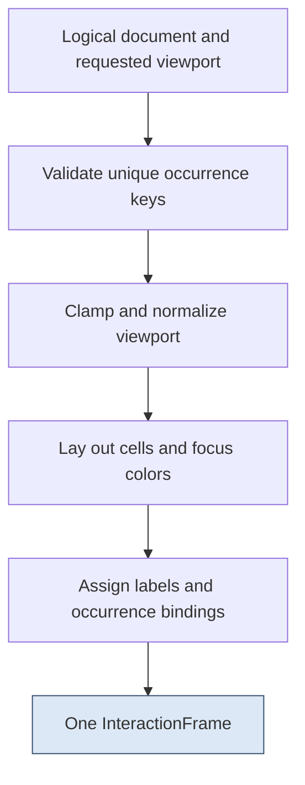

# Published Frames and Input Freshness

A positional input is meaningful only in relation to a particular display. If key `3` denotes the third visible file, changing the visible list changes the meaning of that key even if every file reference remains valid. A correct interface must therefore retain not only what it intends to display, but which completed display supplied the input's interpretation.

The PBUI handheld makes that relationship explicit with an `InteractionFrame`. Layout creates the cells and occurrence bindings together. A synchronous painter publishes the frame only after every necessary write succeeds. The shell and transports then compare the input's observed frame with the currently actionable frame before allowing positive semantics.

> [!summary]
> A frame is a positional interpretation, not merely an image. Publication follows completed painting, freshness is checked separately from object liveness, and release cleanup remains possible when positive input is unavailable.

This article explains the implementation at `1b75e54`. All 41 host checks passed in Debug and Release again during preparation of this series; the retained logs are in `_assets/pbui-subsystems-debug-ctest.txt` and `_assets/pbui-subsystems-release-ctest.txt`. No physical display qualification is implied.

## 1. Three distinct kinds of state

The display path has three representations that must not be collapsed into one mutable buffer.

A **logical document** contains bounded text rows and optional typed occurrences. An **interaction frame** contains laid-out cells and the mapping from visible labels to those occurrences. The **physical-row cache** records which row contents the sink has successfully completed. A new logical document can exist while the old frame is still painted; a partially painted new frame can exist without any actionable publication.

An occurrence contains a view-local key, a typed domain reference, and a context anchor. Two occurrences may refer to the same file but occupy different document rows. Layout checks the uniqueness of occurrence keys, not the uniqueness of object references. Otherwise showing a file twice would either be forbidden or make caret restoration ambiguous.

```text
LogicalRow
    bounded text
    optional Occurrence(key, reference, context)
    foreground and background

InteractionFrame
    FrameId
    cells[20][40]
    bindings[16]
    binding_count
    normalized viewport
```

These are explanatory field summaries of `rows.hpp`, not an alternative implementation. The actual types use fixed arrays and `OwnedText<128>` for row text.

## 2. Layout also defines the input mapping

The frame has forty columns and twenty rows. Rows 0 and 1 are title/subtitle, rows 2–17 form the sixteen-row body, and rows 18 and 19 contain prompt/help text. Body text starts at column 3, leaving room for occurrence labels.

Layout first clamps the top row. It locates the active occurrence in the fresh document and, in ordinary navigation, moves the viewport enough to keep it visible. Manual reading follows a different rule: an off-screen active occurrence becomes a restoration hint and loses active focus. The final viewport stored in the frame is the normalized result, not necessarily the viewport originally supplied by the caller.

For each visible row, layout renders the text, applies focus colors, and creates a binding if the occurrence has a label. Ordinary layout assigns digits to at most nine visible occurrences. Hint layout uses a shared alphabet and can label all sixteen. Text-only rows do not consume a target label.



The key property is that labels and bindings are emitted by the same iteration. A renderer and key handler that separately enumerate “visible objects” can disagree about skipped text rows, duplicate references, or the point at which scrolling was applied. Keeping both outputs in one value eliminates that particular source of divergence.

It does not automatically define every mode's keyboard behavior. A frame may contain a digit binding that a particular shell mode does not consume as direct selection. Layout establishes the available positional map; the mode decides which events use it.

## 3. The synchronous sink contract

`FramePublisher::paint` accepts a proposed frame and a row sink. The sink must return success only when that row is physically complete under its contract. Enqueueing DMA and immediately returning true would violate the current contract unless a separate completion mechanism were added before publication.

The publisher rejects zero or non-increasing frame IDs before starting a valid new paint. For an admissible new frame it disables interaction, compares each row with the completed-row cache, and writes only rows that are unknown or changed. A failed write invalidates that row's cached knowledge and returns unavailable. Successful completion installs the entire proposed frame as published.

```text
paint(next):                                      # explanatory pseudocode
    if next.id is zero or next.id <= published.id:
        return stale

    interactive = false
    for row in 0..19:
        if valid[row] and painted[row] == next.cells[row]:
            continue
        if not sink.write_complete(row, next.cells[row]):
            valid[row] = false
            return unavailable
        painted[row] = next.cells[row]
        valid[row] = true

    published = next
    interactive = true
    return success
```

A rejected stale proposal does not itself begin a new physical paint. Distinguishing this initial check from a failure during an accepted paint matters when reviewing the publisher in isolation.

The cache records completed rows individually. If rows 0–6 succeed and row 7 fails, a retry can reuse unchanged completed rows 0–6. It must rewrite row 7, even if the intended cells match the failed attempt, because a failure cannot establish which pixels reached the display. Later rows retain whatever completed knowledge the cache already held.

### A concrete partial-paint sequence

The following sequence is illustrative, not captured hardware output:

| Step | Physical knowledge | Actionable publication |
|---|---|---|
| Frame 40 completed | All rows known | Frame 40 |
| Start admissible frame 41 | Old rows known; writes beginning | None |
| New rows 0–6 completed | Those rows now match 41 | None |
| Row 7 fails | Row 7 unknown | None |
| Retry and complete 41 | All required rows match 41 | Frame 41 |

The old binding map is not retained as an actionable fallback while the screen contains a partial replacement. The display may be visibly mixed during the failure, but the software refuses to interpret positive positional input against that mixed result.

Publication is atomic at the owner's semantic boundary, not at the LCD's electrical boundary. That narrower statement is the actual guarantee.

## 4. Shell dirtiness is an additional condition

The shell owns semantic transitions, a current frame identity, and a dirty flag. A navigation event can mutate the viewport before painting begins. At that moment the publisher may still remember the previously completed frame, but the shell knows that it no longer represents the current interaction state.

Positive input therefore requires all of the following:

1. The shell is not dirty.
2. The publisher exposes a current frame.
3. The event's observed frame equals the shell's current frame identity.

These checks are not interchangeable with generation/liveness checks on the selected object. A file can remain live while moving from visible label `3` to `5`. Conversely, a frame can be current while a backend reference requires fresh validation before an operation. Display freshness protects interpretation; domain freshness protects execution.

On the P4, the keyboard task observes an atomic published-frame token. The application sets that token to zero during painting and restores it from the shell afterward. Producers do not inspect the mutable document or attempt to choose the current object themselves.

## 5. Why release processing comes first

The key gate receives the event before the positive-frame checks. That ordering maintains physical held/blocked state even when the UI cannot currently accept semantic input. A release clears source-local key state and normally returns successful false: cleanup occurred, but no positive action was admitted.

Held peek adds one cleanup transition. Releasing `i` from the source that opened the active peek closes it even if the frame is stale or unavailable. The shell checks that specific cleanup after validating the event through the gate but before returning for a non-positive event.

This does not permit arbitrary stale actions. The exception is narrow: current Peek mode, the matching key, a release event, and the matching input source. A delayed release after Escape cannot close a later menu because that mode no longer satisfies the condition.

Another consequence deserves explicit attention. A stale positive press can update held state before semantic refusal. The implementation does not reinterpret a later repeat as a new fresh press. Tests and console helpers need to supply the corresponding release rather than assuming refusal erased the physical transition.

## 6. Console input must retain when it began

The UART receives bytes rather than complete key events. If a line starts while frame 40 is current but finishes after frame 41, assigning frame 41 at parse time silently changes what the command was observed against.

`ObservedConsoleLine` records the current frame on the first ingested byte of an assembling line. It retains that identity until the line completes or the framing protocol resynchronizes. This is a conservative software observation. It is not the time the user pressed a terminal key or the time a byte entered the physical UART.

The underlying `ConsoleLine<256>` owns its bytes and distinguishes completion, overflow, and resynchronization. A full-capacity line can terminate normally; attempting to append beyond the array enters discard mode. Loss or overflow discards the damaged line through a delimiter. A truncated command prefix is never executed.

The returned line view is borrowed only for the owner turn, until another feed/lost call. It must not be stored in a queue as if it owned the bytes.

### Text batches need a preflight

A `/text` request owns up to 128 printable ASCII bytes. Delivery checks the whole batch's observed frame before sending any key to the gate. After an accepted character and its synchronous paint, subsequent characters may use the batch's own newly published frame.

Without the initial preflight, an ignored first character could trigger a repaint and cause the rest of an originally stale line to be relabeled as current. The batch would then cross the freshness boundary without a legitimate first event.

```text
if current_frame is absent or current_frame.id != batch.observed:
    refuse the entire batch before gate input

for character in batch:
    deliver press and release against observed
    complete synchronous paint
    observed = resulting current frame
```

This is sequential delivery, not an all-or-nothing transaction. Earlier characters are not rolled back if a later character refuses. Similarly, a normal `/key i` stroke includes both press and release before painting; explicit pressed/released requests are required to observe a held peek.

## 7. Resource and encoding consequences

With an 8×16 bitmap font, forty by twenty cells produce a 320×320 image. The target rasterizer uses one sixteen-pixel-high row group, or 10,240 RGB565 bytes, for synchronous output. Dirty-cell-row publication is therefore compatible with bounded raster storage; it does not require a second complete pixel framebuffer in this application.

Text width remains a separate limitation. The cell decoder replaces a non-ASCII sequence with a fallback glyph and safely consumes input rather than copying incomplete UTF-8 bytes into the cell map. That is not Unicode rendering. A 128-byte logical row also does not imply that all its text is accessible through the thirty-seven text columns. Horizontal/full-text access and the final legibility audit remain work to do.


*Historical actual-shell render at `1057991`, using a synthetic document. It illustrates a viewport without active focus after a card round trip. The original image/provenance is retained in the general report assets; it is not physical LCD evidence.*

## 8. Evidence and a review procedure

The `rows` suite tests layout and publication contracts. `raster` exercises deterministic pixel generation. `console_line`, `console_frame`, and `transport` cover framing and ingress interpretation; mode suites such as `peek` exercise cleanup after stale/failed publication. Their current success is part of the 41-entry native run, not a separate claim of hardware behavior.

From the firmware repository:

```bash
ctest --test-dir /tmp/pbui-native-validation/Debug \
  -R '^(rows|raster|console_line|console_frame|transport|peek)$' \
  --output-on-failure
```

A useful code review begins at `components/pbui_rows/include/pbui/rows.hpp:62–150`, then follows `Shell::handle_input` in `components/pbui_handheld/include/pbui/shell.hpp:750` and `deliver_input` in `transport.hpp`. Check failed-row retry, no-op paints with new identity, stale proposals, absent frames, delayed releases, and a line spanning a frame change. Do not accept a screenshot hash as proof of any of those transitions; the test must inspect state and bindings too.

For a future asynchronous sink, completion identities, buffer lifetime, cancellation, and publication ordering would need a new explicit design. Replacing a blocking write with an enqueue call is not a local performance optimization under the present API.

## Related reports

- [[ARTICLE - PBUI Handheld 2 - Keyboard Acquisition and Recovery]] explains where keyboard frame tokens and loss messages originate.
- [[ARTICLE - PBUI Handheld 4 - Command Ownership and Argument Acquisition]] follows a valid interaction into execution.
- [[ARTICLE - PBUI Handheld 5 - Focus Reading Position and Transient Modes]] develops the viewport and held-peek transitions.
- [[PROJ - PBUI Handheld - Typed Actions Published Frames and Recoverable Input on ESP32-P4]] gives the project-wide status and evidence limits.

## Conclusion

A completed image and its positional map form one published interaction state. The implementation preserves that state across partial writes, delayed bytes, and source-local releases by separating physical-row knowledge, shell dirtiness, and semantic freshness. The result is not a claim that painting cannot fail. It is a defined answer to which inputs remain meaningful when painting does fail.
