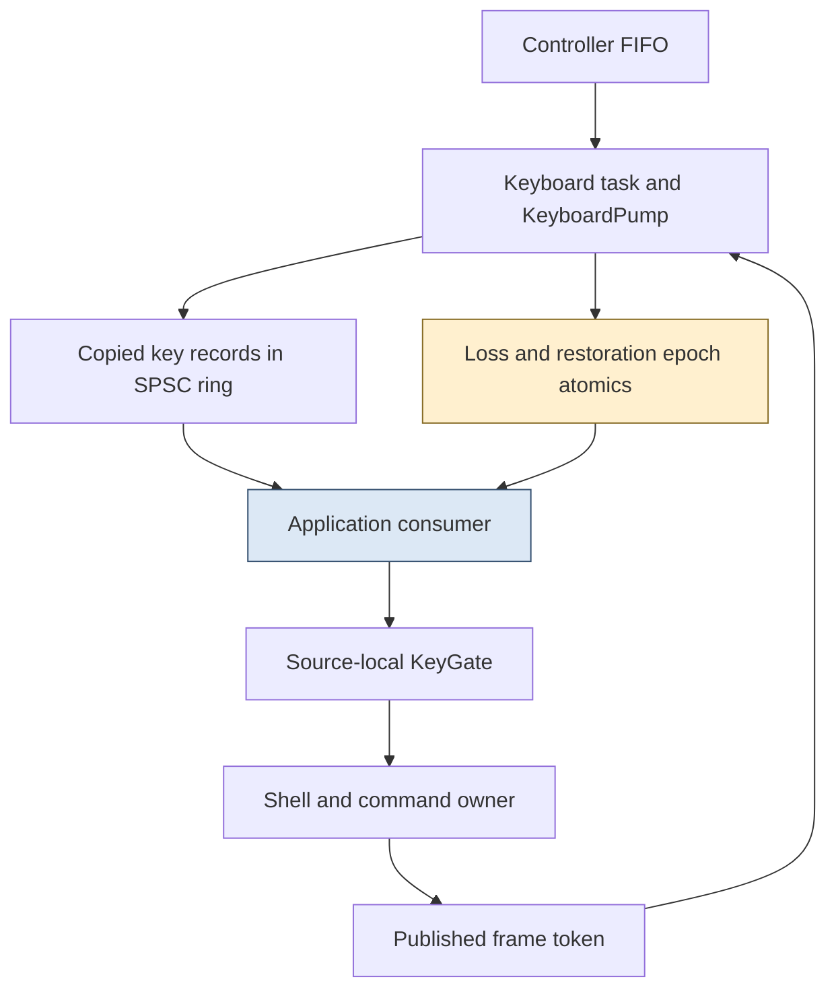
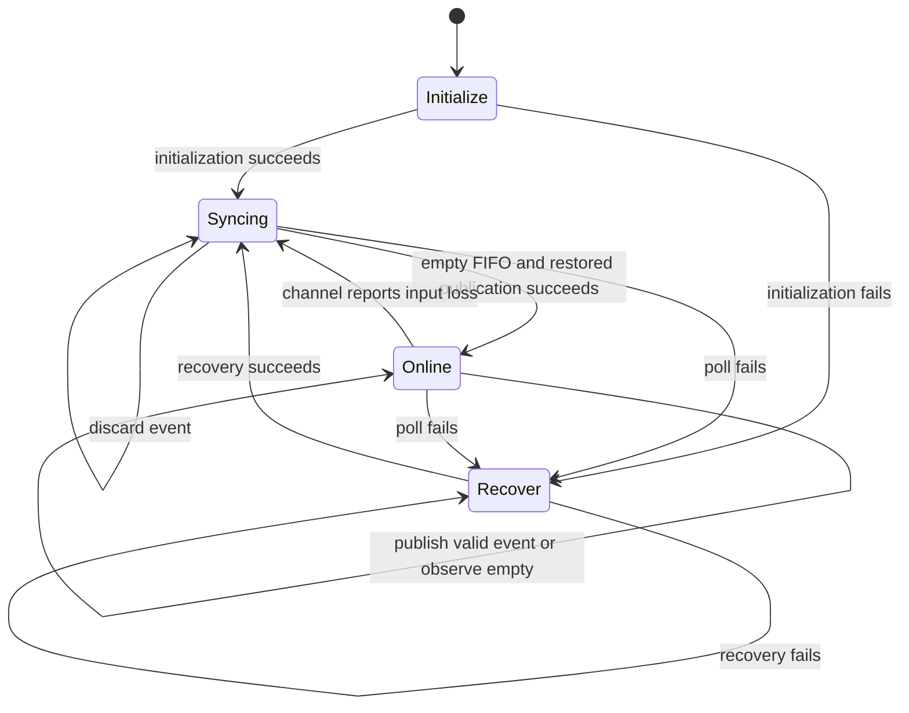

# Keyboard Acquisition and Recovery

Losing a keyboard event changes more than the number of events delivered. If the missing event is a release, the application may believe a key remains held. If an old release arrives after recovery, it may incorrectly rearm a key whose current physical state is unknown. A recovery protocol must therefore restore a trustworthy event sequence, not merely resume successful bus reads.

PBUI separates the physical driver task from the application owner and uses two coordinated mechanisms: a bounded SPSC message ring for keys, and out-of-band epochs for loss and restoration. Recovery also drains the controller's FIFO before announcing restoration. Source-local key gates ensure that console input cannot repair or corrupt physical held state accidentally.

> [!summary]
> Loss must remain reportable when the queue is full. The consumer discards its own stale storage, the producer synchronizes the upstream FIFO, and restoration does not assert that keys have been released.

This report describes the native implementation at `1b75e54`, including host-tested failure behavior. Physical controller recovery, electrical behavior, and real latency remain unqualified because no device was accessed. The latest complete Debug/Release runs each passed 41 checks; those runs are not new ThreadSanitizer or hardware measurements.

## 1. Ownership is the first concurrency decision

The application task owns domain facts, session/deck state, modes, command execution, and painting. The keyboard task owns initialization, polling, and recovery of the keyboard driver. It publishes copied values and reads an atomic frame token; it does not inspect application containers or invoke product effects.

This arrangement addresses a concrete scheduling problem. Driver initialization and recovery can block. Putting those calls in the semantic owner would stop console service and repainting while waiting for the keyboard. Moving the driver into its own task permits recovery to block without transferring semantic ownership.



`KeyboardMessage` contains a kind, copied `KeyEvent`, epoch, and acquisition timestamp. `KeyEvent` contains a semantic key, state, observed frame, and input source. Text keys are printable ASCII; special keys have distinct enum values rather than pretending to be text bytes. The decoder has explicit policies for recognized modifiers and unsupported input.

The timestamp is sampled by software during acquisition. It does not identify when a switch closed or when a controller first enqueued the event.

## 2. The ring's ownership and memory ordering

`KeyboardChannel<Capacity>` requires a power-of-two capacity greater than one and at most 65,536. The default is 128. Its 32-bit atomics are required to be always lock-free. The producer alone advances `head`; the consumer alone advances `tail`. Neither task dequeues or resets the other's storage.

Publication writes the ordinary ring slot, then release-stores the new head. Consumption acquire-loads head before reading the slot. The consumer release-stores tail after consuming, and the producer acquire-loads tail before deciding whether storage is free. Those pairs establish the necessary ordering for non-atomic payload storage.

```text
producer:
    head = load head locally
    tail = acquire load tail
    if head - tail == Capacity:
        report loss
        refuse publication
    ring[head & (Capacity - 1)] = copied message
    release store head + 1

consumer:
    tail = load tail locally
    head = acquire load head
    if head == tail:
        no record
    read ring[tail & (Capacity - 1)]
    release store tail + 1
```

This is the storage algorithm only. The actual methods also enforce epoch checks before and after payload access. Those additional checks are what prevent a correctly synchronized but semantically stale key from reaching the owner.

Unsigned counter wrap is permissible under the bounded difference/index arithmetic. Semantic epoch wrap is not permissible. The same integer width does not imply the same lifecycle rule.

## 3. Why loss cannot be an ordinary queued record

If a queue is full, enqueueing an overflow notification into that same queue cannot reliably tell the consumer that information was lost. Dropping only the overflowing key also leaves held state underdetermined. The implementation takes a conservative approach: any overflowing event, including a repeat, advances the loss epoch and requires synchronization.

Five atomic/control values are especially important:

| Value | Writer | Meaning |
|---|---|---|
| `head` | Producer | Published ring position. |
| `tail` | Consumer | Consumed/discarded ring position. |
| `epoch` | Producer | Current input interval; a change signals loss. |
| `restored` | Producer | Epoch whose upstream stream has been synchronized. |
| `consumed_epoch` | Consumer | Epoch for which old software storage has been discarded. |

The consumer also owns its last observed epoch and last delivered restoration epoch. Loss/restored messages are synthesized from these values rather than requiring free ring slots.

When `take()` observes a new epoch, it advances tail to an acquired head snapshot, remembers the epoch, release-stores `consumed_epoch`, and returns a loss message. Publication in the new epoch is blocked until this acknowledgment. The producer cannot fill new-epoch storage while the consumer is still performing its old-ring discard.

The consumer's final epoch recheck after reading a slot handles loss that occurred during consumption. A record with the wrong epoch is skipped rather than delivered. `take()` bounds its scan by capacity, so it does not loop indefinitely while trying to find a usable record.

## 4. A complete overflow sequence

The following trace uses illustrative epoch numbers; it is a walkthrough of the protocol, not physical captured output.

```text
E=7: restored=7, consumed_epoch=7, ring full
producer polls one more event
publish detects full ring -> epoch becomes 8 -> input_lost
pump enters syncing
consumer observes epoch 8 -> discards old ring -> consumed_epoch=8
consumer returns lost(8)
pump drains upstream controller events to empty
pump publishes restored=8
consumer returns restored(8)
subsequent accepted key records carry epoch 8
```

The relative speed of producer and consumer can differ. Restoration might be announced before the consumer acknowledges the loss, but publication still checks `consumed_epoch`. The consumer must deliver restoration before the first key of that epoch. There is even an explicit retry in `take()` for the case where acquiring the new head is the first observation of the just-restored producer.

Multiple losses can coalesce into the latest observed epoch. The protocol is not a durable journal of every physical failure. Its purpose is to ensure that the consumer recognizes a discontinuity before acting on a resumed stream.

At `UINT32_MAX`, epoch advancement saturates permanently. Restoration and publication refuse generation exhaustion. Reusing a previous epoch could make an old acknowledgment appear valid; terminal refusal is preferable to that identity ambiguity.

## 5. Software draining cannot repair the controller FIFO

The controller can retain events that predate recovery. Even after the software ring is discarded, an old release can still be returned by the next driver poll. Treating it as a fresh release would rearm a blocked key without establishing its current state.

`KeyboardPump` has four internal states: initialize, recover, syncing, and online. Initialization/recovery may block, but each ordinary step performs at most one poll. Successful driver setup enters syncing, not online. Syncing discards events until a poll reports empty. Only that empty boundary allows a restoration announcement.



The loss flag suppresses repeated epoch increments for the same outage. A poll failure announces loss before subsequent blocking recovery. An overflow detected by the channel has already advanced the epoch, so the pump enters syncing without pretending that a second driver reset is necessarily required.

This structure deliberately sacrifices pending keys across an uncertain interval. It does not claim lossless throughput or repeat coalescing. A continuously nonempty FIFO could also delay synchronization; host tests do not prove that physical input will reach an empty boundary within a specified time. That is part of the remaining controller/queue-pressure qualification.

## 6. Key state belongs to an input source

`KeyGate` stores held and blocked bits for 140 key positions across two sources: keyboard and console. Printable characters and named special keys map to distinct validated indices.

A release clears both held and blocked. A press is admitted only if the key is neither held nor blocked, then sets held. A repeat is admitted only if the key is held, unblocked, and repeat is allowed in the current mode. Invalid source/key/state values produce an explicit error.

Loss clears held and blocks every key for the affected source. That is stronger than merely clearing the keys known to be held: after a discontinuity, even the recorded held set is incomplete. Each key needs a source-matched release before it can act again.

| Event | Held after event | Blocked after event | Positive admission |
|---|---|---|---|
| Loss for source | False | True | No |
| Press while blocked | Unchanged | True | No |
| Matching release | False | False | No; cleanup only |
| New press | True | False | Yes |
| Repeat | True | False | Only if mode permits |

A console release cannot unblock the physical keyboard's corresponding bit. Nevertheless, input loss can cancel the shared transient interface. Physical-state isolation and semantic cancellation are different scopes: a lost source may make the current command/overlay unsafe even though another source still has valid held state.

A notable test failure came from expecting a new press to work immediately after loss. The implementation correctly suppressed it. The test was repaired by issuing the required source-matched release, not by weakening recovery semantics.

## 7. Restoration is not release

A successful bus read says nothing about which keys are physically down. Even an empty FIFO does not prove that all switches are up; it establishes only that buffered events have been drained. Consequently, restoration does not rearm the key gate.

This gives three separate facts:

- The driver can communicate again.
- The software/controller event backlog has been synchronized.
- A particular key has supplied a new release.

The first two allow resumed transport. The third permits that key's next positive action. Combining all three into a single “connected” Boolean would authorize more than the implementation knows.

Held peek exposes the importance of this distinction at the UI level. Its release cleanup is allowed even when frame freshness fails, but it must still match the opening source. The recovery protocol supplies trustworthy source/state events; the shell decides which current transient state that release may clean up.

## 8. Scheduling and measurement boundaries

The keyboard task uses its own internal-memory stack and runs separately from the owner. The current target inventory gives 4,128 bytes for the default channel and 10,648 bytes for the keyboard runtime layout, including its associated runtime storage. These are nested layout facts, not independent amounts to sum blindly.

The owner performs bounded UART notification work and services keyboard messages without waiting on blocking driver recovery. That design avoids one obvious source of UI starvation. It does not prove adequate throughput at all polling rates or under sustained queue pressure.

Keyboard residence telemetry measures from software acquisition to just before owner handling. It excludes physical scan/debounce time and the later semantic/layout/display work. Reporting it as key-to-visible latency would misstate the interval. Host scheduling and mock-driver progress tests are similarly not measurements of FreeRTOS timing on the board.

## 9. Verification and unresolved obligations

`host/tests/keyboard_channel.cpp` exercises the bounded channel; `keyboard_pump.cpp` exercises the driver state machine and blocked-recovery separation; `input.cpp` exercises decoding/gating and source isolation. These suites pass in the current Debug and Release run. Earlier ticket evidence includes repeated Release channel stress and TSAN runs for channel/pump; TSAN required per-process ASLR disabling on this host after an unexpected-memory-mapping failure. The series does not present those earlier runs as freshly repeated evidence.

```bash
ctest --test-dir /tmp/pbui-native-validation/Debug \
  -R '^(keyboard_channel|keyboard_pump|input|notification_drain)$' \
  --output-on-failure
```

The code reading order is:

1. `components/pbui_handheld/include/pbui/input.hpp` for event domains and the gate.
2. `components/pbui_handheld/include/pbui/keyboard_channel.hpp:20–95` for atomics, publication checks, and bounded take.
3. `0104-esp32-p4-pbui-handheld/platform/keyboard_pump.hpp:13–73` for recovery states.
4. `main/keyboard_runtime.hpp` and `main/app_main.cpp` under that project for target task integration.

Review full-queue loss, loss during consumption, restoration before new keys, repeated recovery failures, source mismatches, and terminal epochs. The remaining physical work must verify actual FIFO semantics, held-state behavior around reset/disconnect, bus recovery, stack high-water, and input-to-visible timing. Offline work still includes broader queue-pressure and failure/resource analysis; it is not all hardware-blocked.

## Related reports

- [[ARTICLE - PBUI Handheld 1 - Published Frames and Input Freshness]] explains the frame token and cleanup ordering.
- [[ARTICLE - PBUI Handheld 5 - Focus Reading Position and Transient Modes]] explains peek and repeat policies.
- [[ARTICLE - PicoCalc Keyboard Reset and I2C Recovery - ESP32-P4 Host Investigation]] provides the hardware-driver investigation background.
- [[PROJ - PBUI Handheld - Typed Actions Published Frames and Recoverable Input on ESP32-P4]] records the broader project scope.

## Conclusion

Recovery succeeds semantically only when old input cannot regain current meaning. The channel's epochs, consumer-owned discard, upstream FIFO synchronization, and source-local release policy establish distinct parts of that property. Keeping them separate makes both concurrency reasoning and physical qualification more precise.
