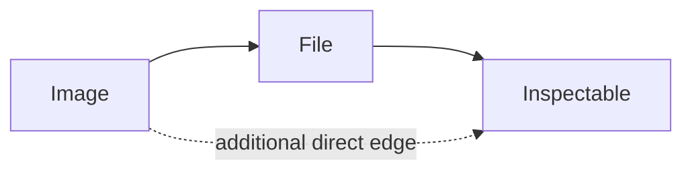
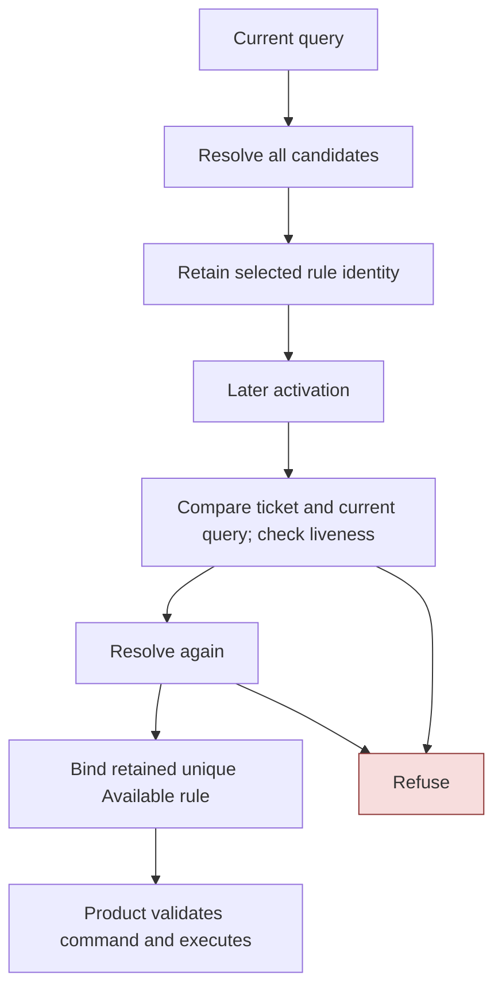

# Native Action Resolution and Acceptance

An object can match several applicable operations, and an argument slot can accept an object in several ways. Those are different forms of multiplicity. Action resolution must identify the winning rule for each action without erasing unavailable or hidden policy. Acceptance must preserve how a source became an argument, even when two routes produce the same reference.

The native PBUI core implements both operations in bounded C++20. It separates declaration validation, structural matching, availability, ranking, binding, and fresh execution checks. This separation is the main reusable result of the port: the handheld can offer menus, direct activation, and command acquisition without implementing their semantic decisions independently.

> [!summary]
> Action rank uses type distance, scope, and priority. Acceptance has a terminal direct path and ranks eligible translations by scope/priority. Both preserve ambiguity, but they must not share an assumed universal ranking algorithm.

The snapshot is `1b75e54`. The full native Debug and Release test runs each pass 41 CTest entries. This is not proof of complete browser-kernel equivalence or independent-product reuse; the latter remains a required experiment.

## 1. Define identity before defining rules

A `Reference` contains a `TypeId` and an object key with slot and generation. Product lookup must validate both the type and key. A slot alone is insufficient because it can name a different generation, and a valid slot with the wrong type is not a legitimate reference.

A rule's identity is separate from its action identity. Several rules can implement one `ActionId`; `RuleId` identifies the specific declaration selected. A context anchor identifies the view/local context, while a model epoch identifies the compiled declaration version. Invocation records how the operation was requested, such as primary activation or menu invocation.

```text
ActionQuery
    subject: Reference
    anchor: ContextAnchor
    active scopes: ordered sequence
    invocation: exactly one bit
    model: ModelEpoch

ActionRule
    RuleId and ActionId
    subject selector
    permitted invocation bits
    condition index
```

The query describes current inputs to resolution. It is not an executable operation. The action ticket later records enough of that identity to ask whether the same operation is still valid.

## 2. Structural matching has observable order

A selector tests type, then scope, then condition. A condition callback does not run for a subject that structurally fails earlier. This is observable even when predicates are intended to be pure: a malformed predicate or an expensive query should not be evaluated for unrelated objects.

Subtype matching uses shortest-path distance in the compiled type graph. Exact matching additionally requires equal types. Distance affects action rank; subtype membership is not just a Boolean convenience for catalog enumeration.

Consider the graph:



Without the direct edge, Image-to-File has distance one and Image-to-Inspectable has distance two. Adding the edge preserves reachability but changes the latter distance to one. Rules on those two supertypes can now tie at the type stage. A graph transformation that preserves reachability but changes shortest paths is not necessarily semantics-preserving for actions.

Active scopes are ordered context information. A selector matching a nearer scope wins over one matching a farther scope only after type distance ties. A high-priority generic rule does not defeat a more specific rule merely because its numeric priority is larger.

## 3. Conditions produce status, not truth

Availability has four states with distinct roles:

| State | Meaning in action resolution |
|---|---|
| Available | The rule competes and can bind if uniquely best. |
| Unavailable | The rule competes but cannot bind. |
| Hidden | The rule competes but is not disclosed as a normal visible winner. |
| Inapplicable | The rule withdraws from competition. |

The `all` evaluator checks children in order and returns the first error or non-Available result. It is therefore an ordered status computation, not a commutative Boolean conjunction. Reordering a Hidden and an Unavailable child can change the returned status and diagnostic reason.

Conditions include mode, capability, and product predicate checks, with validated symbol/range handling. Recursion and array access are bounded. The compiler validates declaration storage; evaluation still refuses malformed access rather than relying entirely on caller correctness.

For action resolution specifically, the implementation performs structural matching with an Available callback and then evaluates the rule's condition separately. That preserves Unavailable and Hidden as candidate properties. Calling the general selector with the action condition and retaining only successful matches would accidentally remove these competitors.

## 4. Resolution is per action, not across the entire menu

The resolver validates the registry and invocation, enumerates structurally matching rules, and stores every non-Inapplicable candidate within its fixed capacity. It then compares candidates that share an `ActionId`.

The rank is lexicographic:

$$
\text{prefer smaller type distance, then nearer scope, then larger priority.}
$$

The code compares priority directly. It does not negate `INT_MIN` or subtract arbitrary priorities. Declaration order is not a tie-breaker.

```text
for candidate in candidates:                       # explanatory pseudocode
    equal_rank_count = 0
    shadowed = false
    for other in candidates with same ActionId:
        if other ranks better:
            shadowed = true
        if ranks are equal:
            equal_rank_count += 1
    candidate.ties = 0 if shadowed else equal_rank_count
```

The `ties` field consequently has three meanings: zero is shadowed, one is a unique winner, and greater than one is ambiguous. Distinct actions can each have their own unique winner; this routine does not choose one global “best menu operation.” Primary-action selection is a further product responsibility.

### Worked example: unavailable is not fallback

Suppose three rules share action Open:

| Rule | Type distance | Scope position | Priority | Status |
|---|---:|---:|---:|---|
| A | 0 | 1 | 0 | Unavailable |
| B | 1 | 0 | 100 | Available |
| C | 1 | 0 | 100 | Available |

A wins because type distance is compared first. B and C are shadowed despite their equal ranks. The result is an unavailable Open action, not B/C ambiguity and not successful fallback. If A becomes Inapplicable, it withdraws and B/C become ambiguous. If A becomes Hidden, it still wins but suppresses normal disclosure.

This example is an explanatory table, not a captured run. It illustrates why removing non-Available candidates before ranking is incorrect.

The current `Candidate::visible()` predicate also requires a unique winner. It does not itself expose every ambiguous candidate as a menu row. Semantic ambiguity and how a UI explains ambiguity are separate responsibilities.

## 5. Binding and execution are separate steps

`bind_selected` checks a retained rule in a completed resolution. It refuses ties, shadowed rules, non-Available status, and absent rules before invoking the supplied binding callback. Binding constructs an operation seed; it is not the product effect boundary.

The separation matters because resolution can fail after examining several rules. A condition error or capacity exhaustion must not leave some early candidates already executable or executed. `resolve_actions` returns no executable partial result on error.

The selected ticket contains rule, action, subject, anchor, invocation, and model epoch. Fresh evaluation checks ticket/query agreement and subject liveness, resolves again, then binds the retained rule only if it remains the correct unique winner for that action.



The product gateway has additional obligations: validate command declaration, argument roles, receiver, and operation-specific state. The core ticket is not a universal authorization token and does not by itself prove that every product argument remains meaningful.

## 6. Acceptance preserves references or declares translations

A slot declares wanted types and a filter. Direct subtype acceptance returns the original reference without changing its identity. A relation can translate the source into another reference and must identify that translation explicitly.

```cpp
struct AcceptanceOption {
    std::optional<RelationId> relation;  // absent for direct acceptance
    Reference result;
};
```

The native profile supports direct acceptance and declared single-relation translation. It does not perform arbitrary multi-hop conversion search. A general path engine would need rules for cycles, path rank, execution cost, and path identity that this profile does not claim to provide.

The source catalog uses `catalog_source_type` to decide which source types could be worth enumerating. That check is a static over-approximation. It does not evaluate current conditions, run translators, validate the current output, or apply the slot's dynamic filter. Enumeration is not acceptance.

## 7. The direct path is terminal

Exact acceptance first checks the wanted-type declaration, source type, and liveness. If the source type reaches a wanted type, it applies the slot filter and returns either one direct option or an empty result.

It does not fall back to relations after direct rejection. Suppose a memory reference already has an acceptable type but fails a “not protected” filter. Trying a translator afterward could replace the offered object with another object that passes. That would change the meaning of direct filtering from rejection to an invitation to reinterpret the source.

```text
if source.type reaches any wanted type:
    if slot_filter(source):
        return [direct(source)]
    return []                                  # terminal rejection
```

An empty acceptance result is distinct from malformed declarations, invalid references, or translator errors. Callers can display “no acceptable result” without pretending the catalog or adapter is valid when it actually produced an invalid reference.

## 8. Relation competition intentionally differs from action competition

When direct acceptance does not apply, the resolver enumerates acceptance-enabled relations whose declared targets can reach a wanted type. Each relation must match its source selector and condition. The translator can return no result, a result, or an error. A result must be live, have a known type, and inhabit the relation's declared codomain; it must then satisfy wanted types and the slot filter.

Only eligible outputs enter acceptance ranking. The rank uses nearer scope and higher priority. **Source type distance is not part of this final relation rank.** It participates in source matching, but importing the action comparator would change acceptance semantics.

A translator error propagates. An invalid codomain result is not silently skipped as if it were an ordinary non-match. Capacity is checked before collecting beyond the bounded candidate array; the resolver does not return a truncated set of apparently unambiguous options.

Equal-best relation/result pairs remain distinct, including when the result references are equal. Sorting by relation ID gives stable display ordering only. It does not resolve ambiguity or deduplicate routes.

### Fresh route validation

An acquisition attempt retains the original source and the selected option. The owner repeats acceptance against current state and calls `revalidate_option`:

```text
if fresh options are multiple and original route was implicit:
    refuse ambiguous
if chosen relation/result pair still exists:
    accept chosen result
otherwise:
    refuse stale
```

The first condition handles a subtle race: an offer that originally had one route may acquire a second equally ranked route before execution. Automatically retaining the old singleton would silently choose a route that the user never explicitly selected. Conversely, an explicit choice can remain valid among multiple fresh options if the exact chosen pair is still present.

## 9. Bounded implementation choices and their costs

The core uses fixed arrays, strong IDs, owned compiled model data, and explicit `Result` errors under a no-exceptions/no-RTTI profile. Some algorithms use quadratic scans: registry duplicate checks and candidate rank comparison are straightforward examples. The capacities bound those costs and make their behavior easy to inspect, but bounded is not the same as fast enough for every proposed larger model.

Avoid replacing the scans with an unordered first-winner table without preserving ties and failure behavior. A performance change must retain the full result semantics, including Hidden competition, terminal direct rejection, and route identity. If capacities grow, benchmark and analyze the actual operations rather than extrapolating from the six-app demo.

Generic compilation also does not prove product independence. The missing second product must supply different types, projections, rules, and command meanings while using the same core/owner interfaces. A synthetic long document exercises geometry, not this boundary.

## 10. Verification and modification guide

Start with these sources, relative to the repository in frontmatter:

| Source | Contract to inspect |
|---|---|
| `components/pbui_core/include/pbui/selection.hpp` | Ordered type/scope/condition matching. |
| `components/pbui_core/include/pbui/actions.hpp:34–125` | Rank, candidate preservation, binding and freshness. |
| `components/pbui_core/include/pbui/acceptance.hpp:32–114` | Catalog over-approximation, exact acceptance, route revalidation. |
| `components/pbui_core/include/pbui/model.hpp` | Owned compiled declarations and validation boundary. |
| `0104-esp32-p4-pbui-handheld/host/tests/` | `selection.cpp`, `actions.cpp`, `acceptance.cpp`, `model.cpp`. |

```bash
ctest --test-dir /tmp/pbui-native-validation/Debug \
  -R '^(contracts|selection|actions|acceptance|model)$' \
  --output-on-failure
```

The existing suite includes generated graph/ordering evidence and direct tests of refusal and freshness. The entire 41-entry suite was rerun for these reports; it does not establish the full original-test mapping, six tutorials, or every source/native interaction scenario.

For a proposed change, review at least these distinctions: equal rank versus declaration order; Hidden versus Inapplicable; source distance versus relation rank; no translation versus invalid translation; equal output versus equal route; implicit singleton versus explicit choice; stale identity versus currently unavailable policy. A test that checks only the final output reference will miss several of them.

## Related reports

- [[ARTICLE - PBUI Handheld 4 - Command Ownership and Argument Acquisition]] explains how a retained route becomes an execution attempt.
- [[ARTICLE - PBUI Handheld 1 - Published Frames and Input Freshness]] supplies the separate positional freshness condition.
- [[PROJECT REPORT - pbui Action-Selection Kernel and the Post-Legacy Unification]] describes the earlier browser-side semantic work.
- [[PROJ - PBUI Handheld - Typed Actions Published Frames and Recoverable Input on ESP32-P4]] records current scope and remaining work.

## Conclusion

The semantic core is reusable because it keeps different questions separate. Matching establishes structural fit. Availability preserves policy. Ranking preserves the best candidates and their ambiguity. Acceptance preserves the offered source and route. Binding and fresh evaluation defer executable meaning until those facts have been checked again. The native implementation's value lies in these distinctions, not merely in replacing JavaScript containers with fixed C++ arrays.
