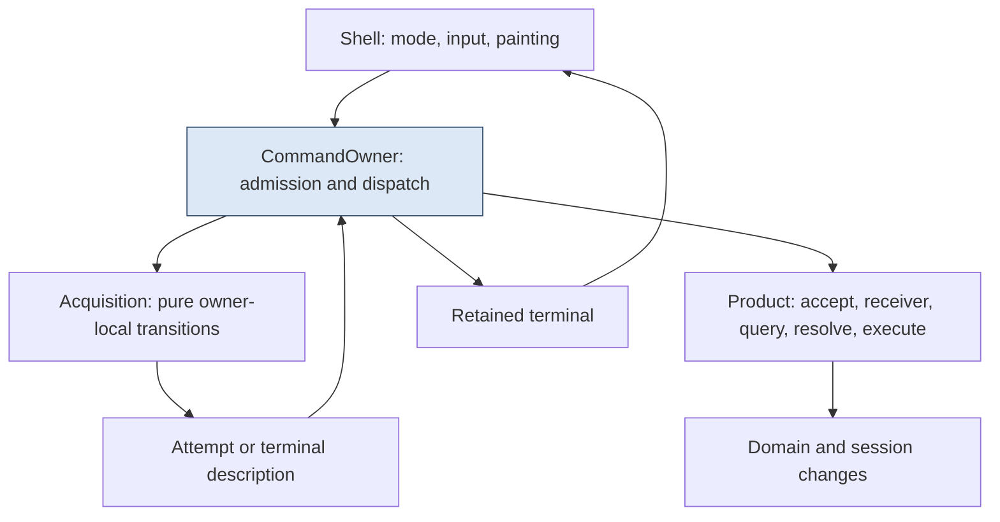
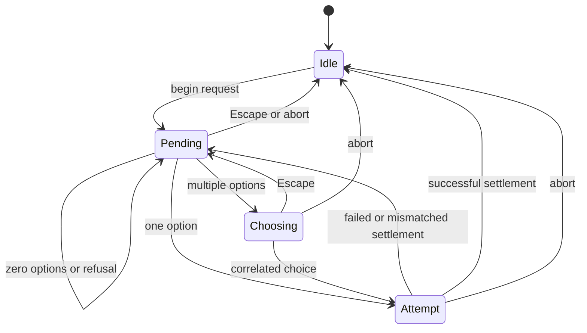

# Command Ownership and Argument Acquisition

A command that needs an object has a lifetime longer than a key press. The user can filter candidates, offer an object, choose a translation route, cancel a chooser, or change the context before execution. Modeling that lifetime as a nullable callback or an `accepting` flag loses the identities needed to distinguish an old choice from a current one.

PBUI represents acquisition as a correlated state machine and gives one owner the responsibility for validation and synchronous execution. The outer shell controls painting and input modes. The product supplies command declarations, receiver selection, acceptance, action resolution, and the final gateway. None of these layers needs to pass executable closures through the input transport.

> [!summary]
> Request, choice-frame, choice, and attempt identities serve different purposes. The owner revalidates the original source and route before dispatch, retains terminal outcomes until drained, and separates command replacement from ordinary invocation admission.

This is a report of the implementation at `1b75e54`, not a claim that the full default provenance or all tutorial scenarios are finished. The current complete host run passes 41 checks in both Debug and Release.

## 1. Four roles in a command declaration

The command name identifies a user-facing operation schema. Its action identifies the semantic operation to resolve. Its receiver is the subject on which that action operates. Its slot, if any, describes an argument the user must supply.

For a slot-received command, the accepted object becomes the action subject. A memory pin command is an example. For `newtile`, the session receives the action while the slot supplies an app reference. Treating all accepted objects as receivers would make it impossible to express that difference correctly.

```text
CommandSpec                                 # conceptual field summary
    command identity and name
    action identity
    invocation kind
    receiver kind
    optional typed slot and filter
```

The generic owner asks the product to derive the receiver from the declaration, arguments, and session. It then builds the action query for that receiver. The shell never infers backend command meaning from a row label such as “Memory” or “Files.”

There is also a distinction between a command specification and its current invocation. Menu and primary activation select a declared command but dispatch with their appropriate invocation kind. They must not bypass the fresh resolver merely because a visible row already advertised an operation.

## 2. Ownership boundaries

`CommandOwner<Product, Domain>` holds references to the product, domain, and session. It owns an `Acquisition<32>`, the current command/origin, monotonically allocated request state, a published frame identity, and an optional terminal result.

The shell owns the visual editor/chooser state and calls the owner only through the appropriate current-frame input path. The owner owns the command transaction, but it does not know how to paint its choices. The product owns the domain semantics, but it does not own key-repeat or menu-return policy.



“Pure owner-local transitions” means the acquisition machine produces data describing the next step. It does not launch an asynchronous product operation. Its attempt record is trivially copyable and carries identities/references, not captured callbacks.

## 3. Acquisition state is a sum, not a collection of flags

The machine has four alternatives:

| State | Retained information | Meaning |
|---|---|---|
| Idle | None | No acquisition request. |
| Pending | Request and return point | Waiting for an offered source. |
| Choosing | Request, original source, reserved frame, choices | Waiting for an explicit route selection. |
| Attempt | Request, operation ID, source, chosen option, explicit-route flag | Waiting for owner settlement. |

A return point contains view identity, active occurrence, scroll position, manual-reading state, and restoration hint. Saving only an integer row would not restore the distinction between an actionable caret and an inactive remembered position.

The identifiers correlate separate boundaries:

- `RequestId` identifies the acquisition lifetime.
- `FrameId` identifies the displayed choice interpretation.
- `ChoiceId` identifies an option within that request's generated choices.
- `OperationId` identifies a particular validation attempt for settlement.

They are not interchangeable because a single request can return from a chooser to pending and generate another chooser or attempt. Reusing list index zero as the only choice identity would allow delayed input to select a different option.

## 4. The transition algorithm

Offering an accepted source with zero options returns missing and leaves the request pending. One option creates an attempt without an explicit route choice. Multiple options create a chooser with new choice IDs and a reserved future frame. The shell must paint that frame before dispatching input against it.



At the lower-level machine, Escape from Choosing returns to Pending; Escape from another active state cancels. Abort cancels any active state. In normal application use, attempts are synchronously settled by the owner, so they are not a user-visible asynchronous waiting screen. The lower-level transitions still have explicit stale checks rather than assuming an impossible call can never occur.

Choice allocation checks that the entire choice set fits before incrementing identifiers. Attempt allocation similarly refuses exhaustion. Identity wrap would make old input indistinguishable from new input, so exhaustion is terminal for the allocator rather than silently restarting numbering.

## 5. Revalidate the source, not only the result

Suppose a source produces one acceptable context segment. The owner offers it and the machine creates an implicit attempt. Before dispatch, the owner calls acceptance again on the original source. If two equally ranked routes now exist, the attempt is ambiguous even if one is the old result.

For an explicitly selected route, the exact relation/result pair must still exist in the fresh best set. Keeping only the result reference would miss route removal or route substitution. Keeping only the relation ID would miss a translator now returning a different object.

```text
apply(attempt):                                # explanatory pseudocode
    find current command and slot
    fresh = product.accept(slot, attempt.source)
    validated = revalidate_option(
        fresh, attempt.chosen, attempt.explicit_route)

    if validated:
        result = dispatch(command, [validated.reference], origin)
        if result is error or successful false:
            validated = refusal

    settled = acquisition.settle(
        attempt.request.id, attempt.id, validated)
    retain terminal if settlement produced one
```

Settlement checks both request and operation identity. A successful result must equal the chosen result. Failure returns the same request to Pending, allowing another offer rather than losing the acquisition context. Success returns to Idle and emits a terminal with the accepted reference.

The Boolean convention in this code deserves care. `Result<bool>::value()` is a pointer; false is not an error. However, within acquisition application, a successful-false dispatch is not treated as a completed command and is converted to an unavailable settlement. That is a deliberate higher-level interpretation, not a change to the underlying result type.

## 6. Dispatch resolves the receiver's current action

Dispatch looks up the receiver, builds a current query, and resolves candidates. It finds the candidate for the command's action, refuses ambiguity or missing/non-Available winners, constructs an `ActionTicket`, and invokes the product gateway with arguments.

The product gateway must then validate command/ticket/arguments and fresh rule applicability before mutation. This second boundary is not redundant with chooser validation. Acceptance establishes that an argument is acceptable; action resolution establishes that an operation is currently available on the receiver. A valid argument does not imply permission to execute the command.

For primary activation, the product first chooses a primary command for the subject. For a shortcut, it chooses the command from product-owned shortcut metadata and current subject policy. Menu invocation already has a command ID. All three converge on dispatch rather than maintaining three implementations of pin, close, or revert.

Repeat also redispatches. A current-subject repeat takes the active occurrence's reference/context; a saved-argument repeat retains the argument and checks that the receiver still agrees. History is not a stored executable callback.

## 7. Admission, replacement, and terminal backpressure are different

Ordinary invocation admission refuses while a terminal is undrained, while another command is pending, or when the observed frame is not the published one. This applies to the direct activation/menu/shortcut path. Repeat has corresponding checks.

`begin`, however, is an explicit command-start/replacement API. It does not call the same frame-admission helper and does not simply reject an existing command. The shell is responsible for the frame-valid input path that reaches it. `begin` validates the command and return origin, checks request identity capacity, aborts the prior acquisition, retains its terminal if present, and starts the new slot request or dispatches an immediate no-slot command.

Likewise, the lower-level `Acquisition::begin` can replace an active request with a newer one and emit cancellation for the old request. Describing the whole system as “begin always refuses while busy” would be inaccurate.

The retained terminal is a separate obligation. `take_terminal()` returns and clears it. An ordinary subsequent transition cannot overwrite it silently. This provides backpressure for the shell's restoration/bookkeeping step even when the acquisition machine itself has already moved to Idle or a replacement Pending state.

A reviewer should therefore ask two questions separately: can this entry point replace a request, and has the caller drained the prior terminal? A single busy flag cannot answer both.

## 8. Immediate commands do not necessarily produce acquisition terminals

A command with no slot may finish synchronously from `begin`. There is no successful argument acquisition to settle, so the shell cannot rely solely on `take_terminal()` to recognize completion.

This distinction became important for overview commands. Starting clear from the overview can complete without producing a new acquisition terminal. The shell needs explicit origin-aware completion handling to return to the overview rather than leave an editor mode active after a successful operation.

Menu return state owns a variant of supported origin surfaces, currently tray or overview. Editing and acquisition can retain an overview origin. Return is allowed only when the original root view is still current. Navigation-producing operations such as switch/newtile and operations that remove the origin return to the resulting browse state instead.

When changing a variant-held mode, the return surface must be copied before replacing the variant. Retaining a reference into the old mode across assignment would use destroyed state. This is a local C++ lifetime issue inside a larger navigation correctness problem.

## 9. Defaults are not ordinary selection

The shell distinguishes filter text, explicit focus in a candidate list, and a nominated default. Typing a filter changes what is shown; it does not authorize the first row merely because it is now visible. `it` means captured active focus, not an off-screen restoration hint. Current card and session context are separate implicit sources.

Existing default precedence and context tests establish concrete policies, but full provenance tuples and all live invalidation requirements remain unfinished. The owner architecture helps by revalidating at execution, yet a late refusal is not a substitute for presenting the correct current default and explanation while the user is deciding.


*Historical screenshot at `b23bcef`. The highlighted row is explicit selection. The image demonstrates the visual state, while tests establish which reference is offered and whether a default was used. Text truncation/fallback is visible and remains part of the broader accessibility work.*

## 10. History records successful semantics, not input traffic

A successful command enters bounded history with a monotonic sequence. The sequence is independent of retained count, so after twenty successful commands a sixteen-entry buffer still reports the total as twenty rather than sixteen. Sequence exhaustion is checked before the effect, preventing a successful operation that cannot be assigned its required history identity.

Direct card cycling and focus-only search/hints are navigation transitions rather than gateway command executions; they do not all create history entries. Overview Enter invokes a declared switch action and does record the successful command. Similar visible movement can therefore have different history semantics because the invocation paths are intentionally different.

The `r` repeat policy also differs from a product shortcut such as uppercase `R`. The first repeats through saved command metadata and fresh dispatch; the second names a product operation. Case and mode distinctions must survive console decoding and key-repeat handling.

## 11. Evidence, tests, and code reading

The main implementation sources are:

| Source | Read for |
|---|---|
| `components/pbui_core/include/pbui/acquisition.hpp:6–123` | State records, correlated transitions, settlement and replacement. |
| `components/pbui_handheld/include/pbui/command_owner.hpp:19–103` | Admission, dispatch and fresh attempt application. |
| `components/pbui_handheld/include/pbui/command_owner.hpp:193–269` | Begin replacement, offer, choice, escape and cancellation. |
| `components/pbui_handheld/include/pbui/shell.hpp` | Terminal draining, editor/chooser origins and restoration. |
| `components/pbui_handheld/include/pbui/session.hpp` | Bounded history and repeat metadata. |

```bash
ctest --test-dir /tmp/pbui-native-validation/Debug \
  -R '^(commands|acquisition|command_owner|defaults|session|overview|shortcuts)$' \
  --output-on-failure
```

These suites pass in the complete current run. Review tests should distinguish stale request, stale displayed choice frame, stale choice ID, and stale attempt ID; a single generic “stale input” case does not exercise every correlation boundary. Also inspect implicit-to-ambiguous acceptance, failed dispatch returning to Pending, undrained terminal refusal, replacement cancellation, no-slot completion, and origin removal.

The original six manual tutorials are still not completed native acceptance replays. Passing these lower-level tests and proving six product projections exist does not close that gap. Independent-product integration and the full failure/provenance matrix remain separate requirements.

## Related reports

- [[ARTICLE - PBUI Handheld 3 - Native Action Resolution and Acceptance]] defines the algorithms the owner invokes.
- [[ARTICLE - PBUI Handheld 1 - Published Frames and Input Freshness]] explains published-frame admission.
- [[ARTICLE - PBUI Handheld 5 - Focus Reading Position and Transient Modes]] explains return points and mode-specific Escape.
- [[PROJ - PBUI Handheld - Typed Actions Published Frames and Recoverable Input on ESP32-P4]] gives the project-wide progress boundary.

## Conclusion

Command ownership is the coordination of several identities and completion obligations. The acquisition machine identifies what the user selected, the owner establishes that the same source and route remain valid, the product validates the current operation, and the shell drains completion to restore the appropriate surface. Their separation makes replacement, refusal, and cancellation explicit rather than accidental consequences of callback lifetime.
