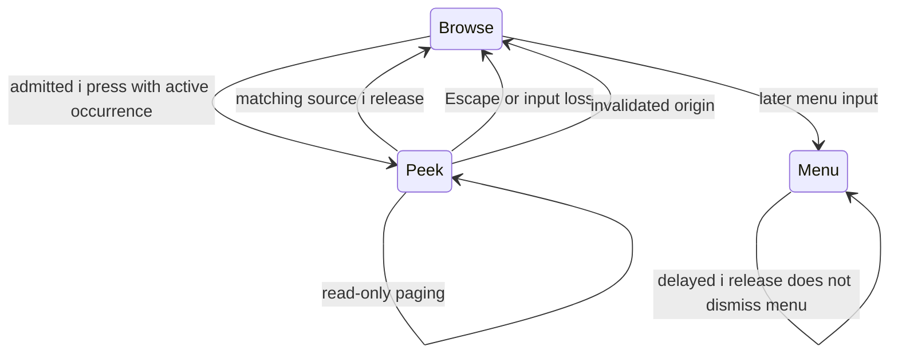

# Focus, Reading Position, and Transient Modes

A keyboard interface needs to represent where the user is reading independently of which object will receive the next action. Paging a document can make the old caret invisible. A search can identify an off-screen object without executing it. A held inspector can expose useful text without changing the underlying navigation stack. Treating these operations as variants of “set selected object” discards their different promises.

PBUI uses occurrence identities, explicit viewport state, and a sum of interaction modes. Manual reading, frozen hints, fresh search, exact-type cycling, and held peek each retain only the state their protocol requires. The shared parts are publication, source-local key hygiene, explicit focus installation, and owner-controlled transitions.

> [!summary]
> Active focus authorizes an object-oriented action; a restoration hint does not. Hints preserve a frozen visible map, search/type cycling query fresh documents, and peek owns a separate read-only surface whose lifetime follows a source-matched release.

The implementation described here is `1b75e54`. The full native run passes 41 checks in Debug and Release. The six manual end-to-end tutorial replays, complete text accessibility, and physical readability qualification remain unfinished.

## 1. Focus is an occurrence, not just an object

The same object can appear twice in one document. A file reference in a summary row and the same file beside a later edit are one domain object but two navigation positions. `OccurrenceKey` therefore identifies a view and row, while `Occurrence` separately contains the reference and context.

The viewport contains four fields with distinct meanings:

```cpp
struct Viewport {
    std::size_t top;
    std::optional<OccurrenceKey> focus;
    bool manual;
    std::optional<OccurrenceKey> restore_hint;
};
```

`top` controls the reading window. `focus` identifies an active occurrence. `manual` changes whether layout follows the caret automatically. `restore_hint` remembers an occurrence for a later explicit restoration transition; it is not an invisible active target.

This distinction extends into `ReturnPoint`, so cancelling an acquisition can restore a manually scrolled document without accidentally reactivating its old object. It also extends into per-card view state: switching cards should not replace one card's reading position with another's.

## 2. Manual paging changes the meaning of the next arrow

In ordinary navigation, layout follows focus enough to keep the active occurrence visible. In manual reading, paging moves the viewport without forcing the old focus back on screen. If that occurrence becomes invisible, layout clears it and retains a hint.

The first Up or Down after manual reading is a restoration transition, not an additional previous/next-object step. The implementation tries the remembered occurrence anywhere in the current document, then the first visible occurrence, then the first occurrence anywhere. It clears the hint and leaves manual mode. Ordinary layout can then scroll to the restored focus.

```text
on Up or Down while manually reading:             # explanatory pseudocode
    leave manual mode
    clear active focus
    if restore_hint still occurs in document:
        focus = restore_hint
    else if viewport contains an occurrence:
        focus = first visible occurrence
    else if document contains an occurrence:
        focus = first document occurrence
    clear restore_hint
    store viewport
    return without another navigation step
```

This algorithm explains a behavior that can look surprising without the state model: the first Down can return to an earlier off-screen occurrence. It is restoring object-navigation mode, not promising to move further down the manually selected page.

If the document contains no occurrences, reading still works and no active target is invented. Saturating page arithmetic prevents Home/End/PageUp/PageDown from underflowing or moving beyond the last valid viewport.

### Example: separate reading and action state

Imagine a fifty-row document with occurrences at rows 0 and 40. The user begins at row 0, pages to the final sixteen rows, and can now read the occurrence at row 40. That does not necessarily make row 40 active. The page can contain a labeled occurrence without a focus highlight. Enter and `it` must not continue targeting the now-invisible row 0 through the restoration hint.


*Historical host render at `1057991`. The synthetic document exercises real shell paging and card state. The caption's claim is deliberately narrower than independent-product reuse or hardware readability.*

## 3. Card navigation preserves independent view state

The native deck is a flat bounded collection with independent inspector stacks. Direct Left/Right or bracket cycling changes the selected card and wraps at the ends. It preserves each card's current inspector and its complete viewport, including manual state and restoration hint.

This intentionally differs from the prototype behavior that cleared stacks on switching. The native choice makes a card round trip a return to the same reading/inspection context, rather than an implicit root reset. Single-card cycling is a successful no-op, which tests must distinguish from an error.

Stable card/view identity is more important than a cached array position. Reorder or close operations can change positions; preserved state belongs to the identified card. The overview uses CardId-based occurrences for the same reason, although its Enter path invokes a declared switch command rather than the direct cycle transition.

## 4. Why modes should not share one generic selection policy

The shell's mode is a variant containing Browse, Editing, Acquiring, Menu, ReadOnlyPage, Tray, Search, Hints, TypeCycle, Peek, and Overview. These alternatives have different input and freshness contracts.

| Mode or operation | Retains | Selection policy | Product action? |
|---|---|---|---|
| Manual browse | Top, focus/hint, manual flag | Explicit restoration before ordinary arrows | Not from paging alone |
| Hints | Exact visible logical snapshot | Captured label map must still match | Focus only |
| Search | Query and origin view | First matching current product label | Focus only |
| Type cycle | Origin occurrence and view | Next current exact-type occurrence | Focus only |
| Peek | Ephemeral inspector, origin, source | Read-only private viewport | No open action |
| Acquisition | Request plus visual/source state | Typed acceptance and route choice | Only through owner validation |

A single “selected row” field cannot express all these protocols. In particular, Hints promises a stable map while Search promises current results. Applying one freshness rule to both would either allow hints to silently retarget or make search unnecessarily stale.

## 5. Hints freeze the visible logical projection

Pressing `f` captures a `HintSnapshot` for the current view and viewport. It owns at most sixteen visible `LogicalRow` values plus the document size. Capture refuses invalid view association or a visible region without a target.

The snapshot retains more than the ordinary nine digit bindings. Its label alphabet is shared by the layout and chooser:

```text
asdfghjklqwertyuiopzxcvbnm
```

Only the first sixteen labels are needed for a full body, ending at `u`. Text-only rows do not consume letters. A test initially assumed a different sixteenth character and failed; fixing the expectation rather than copying a second alphabet preserved the single source of truth.

Before painting or choosing, the shell projects the current document and compares view, document size, viewport state, text, occurrence, foreground, and background against the snapshot. A change cancels the mapping. It never renumbers targets under the user's pending suffix.

```text
capture:
    own visible rows and all mapping-relevant viewport state

choose(letter):
    obtain fresh current projection
    require exact snapshot match
    look up letter in captured occurrence sequence
    return to Browse
    install chosen occurrence as focus
```

An off-screen text change that leaves document size and the entire visible projection unchanged does not invalidate the map. Conversely, even a visible logical text change beyond the currently displayed text columns is included in the exact row comparison. The snapshot is conservative about the logical content it owns, not merely a pixel checksum.


*Historical render at `7adb00f`, with a synthetic dense document. It demonstrates capacity and label placement; tests also check identity/style changes and failed painting.*

The key gate suppresses a held opening `f` from repeating into its own target label. A suffix `r` chooses its hint occurrence; it does not run Browse's repeat command. Choosing a target moves focus only, leaving action execution to a later input.

## 6. Search is a fresh label query

Search captures an origin view and a bounded 32-byte query. Input is printable ASCII, and matching folds ASCII uppercase to lowercase for substring comparison. It is not Unicode case folding, full-text search, or regular-expression matching.

On Enter, the shell obtains the current document and calls the product's label function for each occurrence in order. The first matching label supplies the occurrence key. An off-screen match is valid; explicit focus installation lets ordinary layout reveal it. Duplicate references can produce multiple occurrences, and document order chooses the first.

An empty substring matches the first occurrence under the implemented policy. No match returns missing and leaves reading/focus state unchanged as the mode returns to Browse. A product projection or label error is a different failure path; it is not rewritten as a successful empty search. Changed origin views refuse stale behavior rather than searching an unrelated card.

The query searches product labels, not arbitrary prose in text-only rows. This distinction matters for long inspector bodies: search is not the missing complete-text-access mechanism.

## 7. Type cycling uses exact presentation types

Typing `;` opens a product-defined type selector. The product currently supplies suffixes for file, hunk, task, memory, context, step, and tool. The catalog validates unique visible ASCII suffixes, nonzero types, bounded labels, and a list size that fits the supported surface.

The selected type is matched by equality with the occurrence's presentation type. No subtype distance or acceptance relation is consulted. A File can be an Inspectable for action resolution without being selected when the user requested a different exact presentation type.

`next_type_occurrence` first locates the captured origin in the fresh row sequence. It scans after that occurrence to the end, then from the beginning through the origin. Missing origin starts at the beginning. A sole matching occurrence can therefore select itself after wrap.

```text
start = position after captured occurrence, or zero
return first exact-type match in rows[start:end]
    otherwise first exact-type match in rows[0:start]
```

The two bounded scans are enough; there is no need for an unbounded loop or cached index into an old projection. The current oracle checks 83,652 generated cases, including absent origins and wrap. That is strong evidence for this small algorithm, not a count of complete user scenarios.

Help displays complete gestures such as `;f`, while the active prefix list displays suffix `f`. Generating both forms from the same metadata avoids misleading the user into typing the prefix twice.

## 8. Explicit focus installation is shared

Hints, Search, and TypeCycle all finish through `focus_occurrence`. It copies the current viewport, assigns the occurrence key, leaves manual mode, clears the restoration hint, and stores the viewport for the current view.

This small shared transition prevents divergence. Without it, one path might keep a stale manual flag, so layout would fail to reveal the newly selected off-screen match; another might leave a restoration hint that unexpectedly wins the next arrow. Sharing the state update is useful precisely because the algorithms that choose the occurrence remain different.

Failure and cancellation should not call this helper with a guessed fallback. Hint invalidation, no search match, and no exact-type match are refusals, not permission to focus the first convenient row.

## 9. Peek is a separate read-only surface

Held `i` obtains the product's inspector projection on a newly identified ephemeral surface. It does not execute the primary open action or push onto the card's inspector stack. The surface owns its own viewport, origin view, and input source.

During projection, the shell strips all occurrences before layout. Read-only behavior is therefore not just a keyboard branch that happens to ignore Enter: the published frame has no actionable object bindings. Paging can expose the bounded inspector body through all sixteen rows without mutating underlying browse state.


*Historical actual-product render at `933ea6a`. Native peek uses a full-body paged overlay rather than the source prototype's eight-line slice. Existing fallback glyphs remain visible.*

The release protocol is source-specific. After the gate validates a released `i`, the shell closes the current Peek only if its stored source matches. This cleanup occurs before current-frame validation, so a failed paint does not prevent release. Other positive actions remain subject to normal publication checks.



The last transition is crucial. Once Escape ends Peek, an old release is still physical cleanup but no longer owns the current surface. It must not close a later menu or acquisition. Ordinary console strokes press and release before painting, so a visible held overlay must be tested with explicit `/key i pressed` and `/key i released` events.

## 10. Repeat and Escape are mode policies

The key gate only admits repeat when the shell grants repeat for the current event/mode. Browse card cycling and read-navigation can repeat. Editing/search text and backspace can repeat. Product actions and hint suffix selection are not made repeatable simply because they are printable characters.

Escape similarly operates on the current mode. It cancels Search/Hints/TypeCycle/Peek, returns menus to owned origins, steps from acquisition chooser back to pending, cancels pending acquisition through its terminal, and pops a Browse inspector level. A global “Escape means root” implementation would lose both request continuity and independent card history.

Input loss cancels transient interaction while preserving source-local held/block rules. Restoration does not release keys. Tests that inject loss must rearm the relevant source explicitly before expecting the next positive event to exercise a later branch such as sink failure.

## 11. Verification and what remains

The current tests cover manual scrolling, search, hints, type cycling, peek, card cycling, read-only pages, and overview. The following subset can be rerun independently:

```bash
ctest --test-dir /tmp/pbui-native-validation/Debug \
  -R '^(manual_scroll|search|hints|type_cycle|peek|card_cycle|read_pages|overview)$' \
  --output-on-failure
```

Read `components/pbui_handheld/include/pbui/shell.hpp:743–925` for shared focus, gate/release ordering, and the transient chooser branches; read `shell.hpp:1149–1172` for manual restoration. `hints.hpp`, `type_cycle.hpp`, `page_navigation.hpp`, `deck.hpp`, and `components/pbui_rows/include/pbui/rows.hpp` isolate the smaller algorithms. The corresponding tests are under `0104-esp32-p4-pbui-handheld/host/tests/`.

A complete review should inspect more than the success screenshot. Assert occurrence identity, stack depth/view identity, active versus remembered focus, history count, stale-frame refusal, no bindings in read-only surfaces, source-mismatched release, and cancellation without action. The screenshots reused here have immutable historical provenance in the general report evidence asset; they are not newly captured hardware frames.

Remaining work includes full-text/horizontal access, complete shared action affordances, complete default provenance, timeline controls/playback, six actual tutorial replays, and a genuinely independent product. Synthetic long documents establish geometry and navigation boundaries but do not establish that product reuse requirement. Physical readability and keyboard behavior remain additional device-dependent work.

## Related reports

- [[ARTICLE - PBUI Handheld 1 - Published Frames and Input Freshness]] defines the frame and stale-input conditions.
- [[ARTICLE - PBUI Handheld 2 - Keyboard Acquisition and Recovery]] defines source-local release and loss behavior.
- [[ARTICLE - PBUI Handheld 3 - Native Action Resolution and Acceptance]] explains why type cycling is not acceptance.
- [[ARTICLE - PBUI Handheld 4 - Command Ownership and Argument Acquisition]] explains Escape/return points across acquisition.
- [[PROJ - PBUI Handheld - Typed Actions Published Frames and Recoverable Input on ESP32-P4]] provides the project-level status.

## Conclusion

The navigation model works by preserving distinctions that a single selected-object field cannot represent. Reading position can be inactive, hint mappings can be frozen, searches can be fresh, type cycling can be exact, and a held inspector can be read-only and source-owned. Shared publication and focus transitions connect those modes without forcing them into the same selection algorithm.
