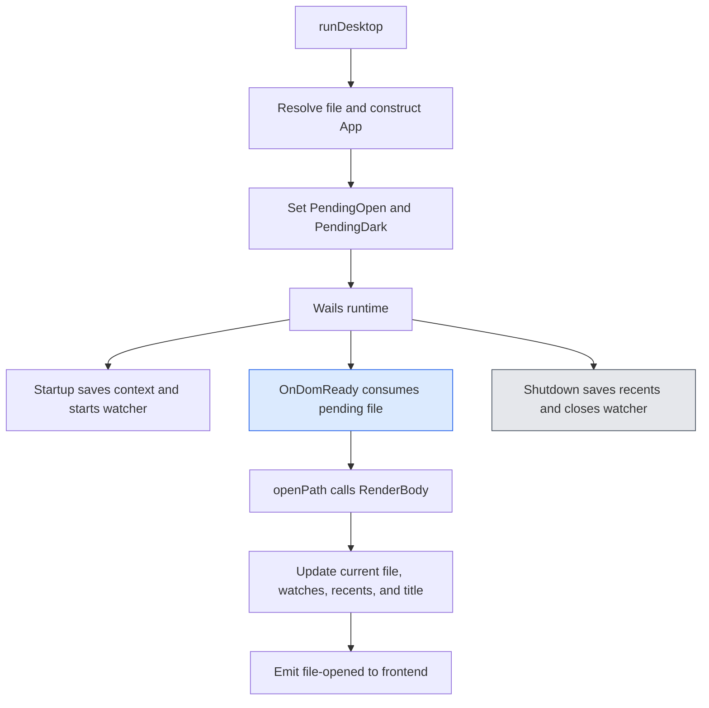
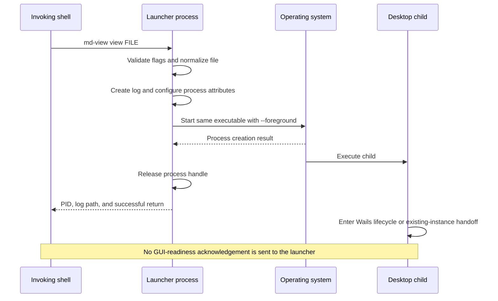
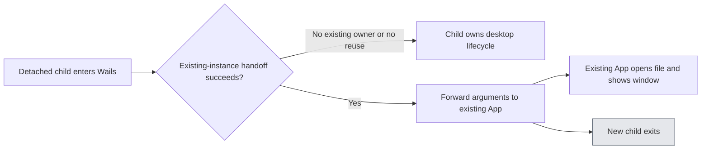
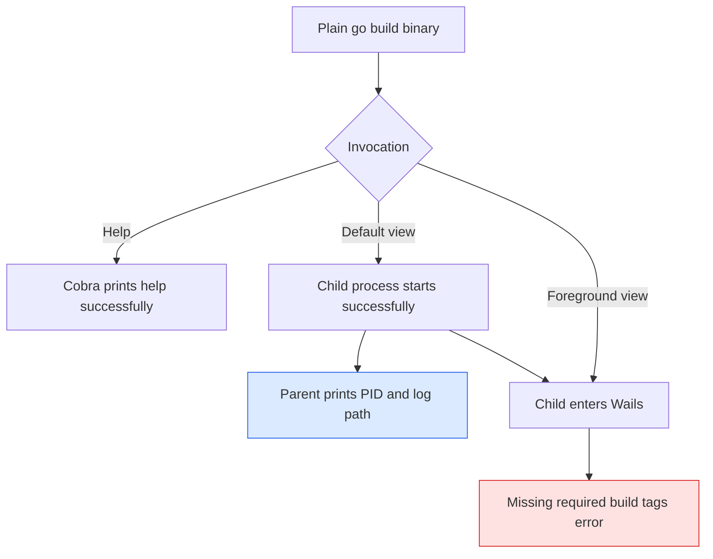

# md-view: Background Desktop Launch and Process Lifecycle Semantics

Opening a document from a terminal should not necessarily make the terminal wait for the document window to close. In `md-view`, the command that parses a file path originally entered the Wails desktop event loop directly. That process structure made a simple viewing request last as long as the desktop application. The background-launch project changed the lifetime of the invoking command without changing the Markdown renderer, the frontend, or the application's window lifecycle.

This report explains that change from the operating-system behavior upward. The central distinction is between creating a process and establishing that an application is ready. Once the launcher returns before the desktop finishes initializing, file paths, argument parsing, terminal descriptors, process sessions, error reporting, and build configuration become parts of the public command contract. Understanding those relationships is necessary both to modify this implementation and to recognize its limits.

> [!summary]
> - `md-view view FILE` now starts a detached copy of the same executable and returns a process ID plus a private log path. `md-view view --foreground FILE` enters Wails directly.
> - Detachment requires both platform-specific process attributes and independent standard streams. Returning without `Wait` is only one part of the implementation.
> - The launcher acknowledges process creation, not window readiness, successful rendering, or successful single-instance forwarding.
> - Linux native tests verified terminal-close survival and foreground blocking. A subsequent installation failure demonstrated why production verification must use the Wails build rather than plain `go build`.

## 1. Project position and evidence

The work was tracked as `MDV-BG-001` and merged in [PR #4](https://github.com/go-go-golems/md-view/pull/4), at commit `b85a0cd`. The repository is now `/home/manuel/code/wesen/go-go-golems/md-view`. Implementation took place in a separate `md-view-background` worktree, which was removed after merge and confirmation that the installed application worked. That deleted directory is part of the work history, not a path a reader should use to rebuild the project.

This report is based on the merged source, the full implementation diary, the intern design guide, the recorded native smoke results, and the subsequent installation conversation. The distinction between those sources matters. The automated native evidence was captured before a flag-spelling correction; the final source uses `--foreground`. The installation incident and the user's confirmation that the corrected installation worked occurred after the diary's implementation steps. They are reported here as user-observed operational evidence, not as an additional automated test run.

The earlier [[ARTICLE - Replacing md-view with a Wails v2 Desktop Application - Technical Deep Dive]] describes the transition from a daemon and browser to Wails. This project does not reverse that transition. It introduces a short-lived launcher process, not a daemon, custom command socket, PID registry, or HTTP server. The desktop continues to use Wails and the existing rendering and file-watching components.

## 2. Define the command's lifetime before implementing it

A command has several observable outcomes that are easy to combine accidentally: argument validation, executable startup, native runtime initialization, window creation, file loading, and eventual shutdown. A foreground desktop command can remain alive through all of these stages. A background launcher deliberately returns earlier, so its exit status cannot represent stages it does not observe.

The final command behavior is:

| Invocation | Execution policy | Meaning of return |
|---|---|---|
| `md-view view FILE` | Start a detached child using the same binary. | The launcher completed process creation and handle release, or encountered a synchronous launch error. |
| `md-view view --dark FILE` | Same launch policy, with dark mode encoded in child arguments. | Same acknowledgement as the default command. |
| `md-view view --foreground FILE` | Run the desktop in the invoking process. | The direct Wails invocation returned, normally after its window closed, or after an existing-instance handoff. |
| `md-view view --foreground=false FILE` | Use the default detached path. | Same acknowledgement as the default command. |
| `md-view` | Preserve the existing direct desktop launch. | The direct desktop invocation returned. |
| `md-view view --help` | Display help without entering either launch path. | Help generation completed. |

Foreground mode does not mean “wait for any existing window to close.” Wails can forward a second invocation to an already-running instance and then terminate the new process. The flag controls whether this invocation re-executes a detached child; it does not add a cross-process completion protocol to Wails.

Leaving bare `md-view` direct was also intentional. The explicit `view` command is the terminal-oriented open-document interface. Bare execution is used when starting an empty desktop window, including double-click and development workflows. Expanding the change to every startup path would have altered those workflows without being necessary for background-by-default viewing.

## 3. The desktop lifecycle that remained unchanged

The existing application's entry point is `runDesktop` in `main.go:99`. It resolves the requested file, constructs an `App`, initializes pending file and theme state, and calls `wails.Run` with embedded assets, menus, callbacks, bound methods, drag-and-drop options, and the single-instance lock. The call is the direct desktop execution path; it is not a background-task scheduler.

The `App` stores the Wails runtime context, current file, theme, recent files, file watcher, and allowed image directories. The launcher does not transfer those objects to another process. A fresh execution constructs them normally. This avoids introducing a serialization format for application state or changing who owns the watcher and window resources.

The startup order has a separate readiness constraint. The file argument is available before the WebView DOM is ready, but frontend events must be sent at the appropriate lifecycle stage. `runDesktop` therefore records `PendingOpen` and `PendingDark`, while `App.OnDomReady` consumes those fields and performs the initial open. `Startup` saves the runtime context and starts watcher infrastructure. `Shutdown` persists recent files and closes the watcher.



`App.openPath`, at `app.go:182`, calls `renderer.RenderBody`, updates the watched file and recent-file state, registers allowed directories for referenced images, and sets the native title. That ordering explains one of the later test observations: a window whose title reflects the fixture's frontmatter has progressed beyond process creation into the application's file-open path. It is stronger evidence than a child command line containing the file name, though it is not a pixel-level rendering assertion.

None of these application callbacks changed in the background-launch PR. The new work changes which process enters the lifecycle, not the lifecycle itself.

## 4. Re-execution establishes a separate process lifetime

Starting Wails in a goroutine would not satisfy the requirement. A goroutine remains inside its original process. If `main` returns, the Go process exits; if `main` waits for the goroutine, the shell is still waiting for the application. Goroutine scheduling does not create a new process session or independently owned standard streams.

The implementation instead runs the same executable a second time. `os.Executable` identifies the binary that is already executing, and `exec.Command` starts that path with a canonical argument vector. It does not search for a possibly different `md-view` on `PATH`, and it does not ask a shell to interpret a command string.



The diagram shows independent execution after process creation; it does not imply that every child initializes after the parent returns. The child may run quickly, fail immediately, or reach the GUI while the parent is still finishing its launch bookkeeping. The design does not impose an ordering between parent exit and window readiness.

The externally useful guarantee is narrower: on the successful detached path, the parent does not wait for the child's eventual desktop lifetime. There is still synchronous work before it returns, including command parsing, path resolution, log creation, and operating-system process creation. “Returns immediately” is user-facing shorthand for “does not wait for the window to close,” not a measured zero-latency guarantee.

### A small command-construction interface

Cobra dispatch was extracted into a function that accepts two implementations of the same operation:

```go
func newRootCommand(desktop, background func(string, bool) error) *cobra.Command
```

The arguments to each callback are the parsed file and dark-mode flag. The actual decision is short:

```go
if viewForeground {
    return desktop(file, viewDark)
}
return background(file, viewDark)
```

Flag values are local to the command constructor rather than shared package variables. Tests can build fresh commands with recording callbacks and verify which path runs without starting a WebView. This separation also keeps command validation in Cobra: unknown flags and excess positional arguments fail before either callback runs.

`main` supplies `runDesktop` as the direct callback and a wrapper around `launch.Start` as the background callback. The wrapper prints `Started md-view process PID; log: PATH` only after `Start` returns without error. That output is deliberately diagnostic text, not a PID-file protocol or stable identifier for a window.

## 5. Canonical arguments prevent recursion and preserve file identity

Re-executing a background-by-default command creates an immediate recursion risk. If the child receives another default `view` request, it would start another child instead of entering Wails. The implementation makes the direct-execution flag part of every generated child argument vector:

```go
func childArgs(file string, dark bool) ([]string, error) {
    args := []string{"view", "--foreground"}
    if dark {
        args = append(args, "--dark")
    }
    if file != "" {
        abs, err := filepath.Abs(file)
        if err != nil {
            return nil, errors.Wrap(err, "resolve background file")
        }
        args = append(args, "--", abs)
    }
    return args, nil
}
```

This is the actual function in `internal/launch/launch.go:38`. It does not append an extra flag to the original `os.Args`. Instead, it reconstructs a minimal request from values Cobra has already parsed. That distinction handles explicit false values correctly: the user's `--foreground=false` selects background execution, but the generated child always receives `--foreground` without a false value.

Reconstruction also means future view options require an intentional forwarding decision. Adding a Cobra flag without extending this function would not automatically propagate it. This is a maintenance constraint, but it keeps the child interface explicit and testable.

### Absolute paths are a process-boundary requirement

Consider a shell in `/home/manuel/notes` running:

```bash
md-view view --dark "relative file.md"
```

The logical child vector is:

```text
["view", "--foreground", "--dark", "--",
 "/home/manuel/notes/relative file.md"]
```

The child inherits the current working directory because `Cmd.Dir` is unset. Even so, the file is made absolute before process creation. The application has another possible process boundary after startup: Wails may forward the new invocation to an existing instance. The code's existing macOS handling documents that the forwarded working directory can be the executable directory rather than the original shell directory. Depending only on inherited cwd would therefore protect the first execution but not necessarily the forwarded one.

`cli.go:62`, `absolutizeFileArg`, already resolves direct-launch file arguments and rewrites the corresponding `os.Args` element before calling Wails. The background launcher supplements that behavior by creating an absolute child argument from the outset. It does not replace or weaken the direct path's existing normalization.

`filepath.Abs` performs path construction; it does not prove that the file exists, validate Markdown, or resolve every filesystem identity issue such as symbolic-link changes. The file is opened later by the desktop. Consequently, an absolute path in the child request is not evidence that the requested document was successfully read.

### Two parsers have different responsibilities

Cobra parses new user invocations strictly. `ParseViewArgs`, at `cli.go:28`, parses Wails-forwarded arguments leniently: it recognizes `--dark`, ignores `view` and flag-looking values, and treats the first remaining argument as the file. It is not a general flag-value parser.

The generated vector is safe for both parsers. Cobra recognizes `--foreground` and the `--` separator. The lenient parser ignores both flags and finds the absolute file. A basename such as `view` or `--dark` is no longer ambiguous once represented as `/some/directory/view` or `/some/directory/--dark` on Unix. Tests cover these names and shell metacharacters as file data.

There is no shell interpolation in the launcher. A file name containing spaces, semicolons, or `$(...)` remains one argument passed to `exec.Command`; it is not executed as shell syntax. The shell that initially invokes `md-view` still applies its own normal quoting rules, so users must quote names containing spaces when entering the original command.

## 6. Detachment has two independent operating-system requirements

An independently running desktop needs an appropriate process/session configuration and appropriate standard streams. Neither property implies the other. A child can have a new session while retaining a write descriptor into a shell pipeline; it can also have output redirected to a file while remaining associated with the launching terminal's session.

### Linux and macOS: create a new session

The Unix implementation is selected with a build constraint for Linux or Darwin:

```go
//go:build linux || darwin

func detach(cmd *exec.Cmd) error {
    cmd.SysProcAttr = &syscall.SysProcAttr{Setsid: true}
    return nil
}
```

`Setsid` requests a new session during child startup. The resulting child is a session leader and is not attached to the launcher's controlling terminal. The native Linux test checks that the session ID equals the child PID, providing a concrete observation that the configuration took effect.

This is not a promise that the application survives every form of user-session termination. A login manager may terminate desktop-session processes during logout; a service manager or container may impose additional lifetime rules. The tested requirement was survival after closing the launcher's terminal session, not persistence across logout or machine shutdown.

### Windows: detached process flags

The Windows file relies on its `_windows.go` suffix for selection and configures the creation flags:

```go
func detach(cmd *exec.Cmd) error {
    const detachedProcess = 0x00000008
    cmd.SysProcAttr = &syscall.SysProcAttr{
        CreationFlags: detachedProcess | syscall.CREATE_NEW_PROCESS_GROUP,
    }
    return nil
}
```

The implementation avoids a shell `start` command and avoids asking for a new console. It expresses console detachment and process-group policy through Windows process creation. Those flags are present in source and the isolated launch package cross-compiled successfully, but this project did not run native Windows console or job-object tests. Their presence should not be reported as equivalent to observed Linux behavior.

For platforms other than Linux, macOS, and Windows, the package returns an explicit error directing the user to `--foreground`. It does not silently claim that generic `Start` has supplied platform-independent detachment.

### Standard streams must not remain attached to the caller

The child is configured with null stdin and log-backed output:

```go
cmd.Stdin = nil
cmd.Stdout = logFile
cmd.Stderr = logFile
```

A nil stdin in `os/exec` uses the null device. The child does not consume input intended for the invoking terminal or another command. Both output streams refer to the same regular log file, so diagnostics remain available without reaching the invoking shell's output descriptors.

Pipe ownership is a separate reason to do this. A reader waiting for EOF on a pipe cannot finish while another process still holds an open write end. If a GUI child inherits the launcher's piped stdout, the launcher may exit but a command capturing its output can remain blocked. Giving the child a regular file rather than the caller's stdout prevents this descriptor inheritance. It also avoids `os/exec` copy goroutines for arbitrary writer interfaces, since the output is already an `*os.File`.

The recorded Linux descriptors were explicit:

```text
fd 0 -> /dev/null
fd 1 -> /tmp/mdv-bg-smoke-5mn_yjs6/cache/md-view/launch-1159635992.log
fd 2 -> /tmp/mdv-bg-smoke-5mn_yjs6/cache/md-view/launch-1159635992.log
```

These observations establish descriptor destinations for that run. The native script did not separately run a shell command-substitution or pipeline EOF assertion; its descriptor inspection supports the intended property without converting it into an unperformed test claim.

## 7. Process creation, handle release, and log ownership

The public launcher interface has only two output fields:

```go
type Result struct {
    PID     int
    LogPath string
}

func Start(file string, dark bool) (Result, error)
```

`Start` finds the executable, normalizes arguments, locates `os.UserCacheDir`, and delegates to a private `start` helper. The helper performs the resource-sensitive sequence. Keeping it independent of Wails lets tests exercise actual operating-system behavior with a test process instead of a native GUI.

The sequence is:

1. Configure the platform's detachment attributes.
2. Create `os.UserCacheDir()/md-view` with requested mode `0700` if necessary.
3. Create a unique `launch-*.log` with `os.CreateTemp`.
4. Attach null stdin and the log-backed output descriptors.
5. Call `cmd.Start`.
6. Save the child PID, release the process handle, and return.
7. Close the parent's log descriptor when the helper returns.

On Unix, `CreateTemp` requests mode `0600`, subject to the usual filesystem and umask rules. The directory call does not repair permissions on an already-existing directory, and Unix mode bits are not a substitute for a Windows ACL audit. “Private log” describes the intended creation policy, not a comprehensive filesystem-security guarantee.

The parent closes its own descriptor after the child has started. The child keeps the inherited output descriptor and can continue writing. No parent-side log-writing goroutine needs to survive, so returning from the launcher does not destroy the child's diagnostic destination.

### Release is not Wait

The critical success-path code is:

```go
result := Result{PID: cmd.Process.Pid, LogPath: logFile.Name()}
if err := cmd.Process.Release(); err != nil {
    return result, errors.Wrapf(err,
        "release background process %d (log %s)",
        result.PID, result.LogPath)
}
return result, nil
```

`Process.Release` relinquishes the parent's process-handle resources. It does not wait for the child, terminate it, or establish GUI readiness. Calling `Wait` here would restore the original blocking lifetime. Using `exec.CommandContext` with the short-lived launcher's cancellation context would also introduce an unwanted ownership relationship if that context were canceled while the child should remain alive.

Release is not a general replacement for process reaping in a long-running supervisor. This API is used by a short-lived CLI that exits after the acknowledgement. Reusing it in a persistent server that starts many children would require revisiting waiting and reaping responsibilities. The native smoke treats Linux zombie state as exited when checking termination, rather than mistaking an unreaped process record for a live desktop.

A release error is also different from a creation error: by that point a child has already started. The helper preserves the PID and log in the error message. A caller should not interpret every nonzero launcher exit as proof that no child exists or blindly retry without considering duplicate launches.

### Failure cleanup is part of the contract

If `cmd.Start` fails, the helper closes and removes the unused log before returning a wrapped error. Closing before removal is necessary for the Windows file lifecycle. The code treats cleanup as best effort: it intentionally ignores close/remove errors rather than replacing the primary startup error.

Failures earlier in the sequence—finding the executable, constructing an absolute path, finding the cache directory, creating the directory, or creating the log—are synchronous launch failures. A missing display, Wails runtime rejection, or later file-read failure occurs after process creation and does not travel back through this function. Some file errors are emitted as frontend events rather than written to stderr, so a launch log is not a complete record of every application-level failure.

Each invocation creates a new log, including invocations that may immediately hand off to an existing window. This prevents unrelated launches from sharing one mutable output file, but logs accumulate. Rotation and retention were not implemented. Users can inspect the printed path and remove old logs when they are no longer needed.

## 8. Single-instance forwarding remains a separate protocol

Wails' `SingleInstanceLock` uses the application's unique ID and calls `App.OnSecondInstanceLaunch` in the existing instance when forwarding succeeds. The callback parses the forwarded arguments, resolves a relative path if needed, applies a requested dark theme, opens the file, and shows the existing window. An empty-file request only asks it to show the window.

The background child still enters this normal Wails path. It may become the desktop process, or it may be a temporary process that delivers a request to another desktop. Consequently, the PID printed by the launcher is not a durable application-instance identity and is not necessarily the process owning the visible window.



Linux single-instance behavior was already documented as best effort on some D-Bus setups. This PR neither repairs nor independently revalidates that behavior. Its native smoke tests the first-instance lifecycle and detachment contract. Keeping the distinction explicit prevents a later duplicate-window report from being attributed automatically to the new process-launch code.

## 9. Testing the contract at three levels

The tests separate command decisions, operating-system behavior, and native GUI lifecycle. Each level answers a different question. A callback test can prove that Cobra chose the correct function, but it cannot prove that a terminal session was detached. A helper process can prove descriptor behavior, but it cannot prove that the production Wails binary opens a Markdown file.

### Command and argument tests

`main_test.go` constructs commands with recording callbacks. Cases cover default background dispatch, empty `view`, dark mode, foreground mode, explicit false foreground, bare root launch, `--` handling, help, unknown flags, typo rejection, and excess positional arguments. The assertions include callback count, file value, theme value, and whether execution returned an error. Separate tests establish propagation of callback errors.

`TestChildArgs` in `internal/launch/launch_test.go` verifies the generated child vector for empty, relative, absolute, flag-looking, and shell-metacharacter file names, with dark mode both enabled and disabled. `cli_test.go` includes a forwarded-child case showing that the lenient Wails parser ignores the foreground marker and separator while retaining the file and theme.

The initial implementation mistakenly preserved `--foregruond` from the original request. After the user clarified the spelling, commit `7fd74c0` changed Cobra registration, child generation, examples, diagnostics, and tests together. The final test explicitly rejects the typo; there is no compatibility alias. This correction matters beyond help text because changing only the parent parser would have left detached children using an invalid flag.

### A real helper process without Wails

`TestDetachedProcess` re-executes the Go test binary with a narrowly selected helper test and environment variables enabling helper mode. The helper records its PID, cwd, argument vector, an inherited environment token, and the result of reading stdin. It writes JSON to stdout and a recognizable line to stderr, then stays active until a release file appears or its deadline expires.

The parent can therefore observe the child after `start` has returned. It checks argument and environment inheritance, log content, Unix permissions, and Unix session identity. Cleanup writes the release file and waits for the helper's normal test-completion output. The helper's deadline limits indefinite lifetime if the parent is interrupted during the intended post-start waiting phase.

Failure tests exercise an invalid executable and a path that cannot be used as a log directory. The invalid-executable test checks that the unused log is removed. These are concrete failure-path tests, not exhaustive fault injection for every possible error in the API. Release errors, cache-discovery failures, and all filesystem permission combinations are not independently injected by the current suite.

### The production native smoke

The ticket's `scripts/01-native-smoke.py` starts the built desktop from tmux with temporary config/cache directories and a document named `relative file.md`. The fixture contains the frontmatter title `MDV-BG-001 native smoke`. The script uses that title to locate the native window and distinguish the test's visible application from ordinary unrelated windows.

For the background case, a shell writes a marker after the command returns. The script waits for the marker, checks the return code, extracts the printed PID and log, inspects `/proc`, and locates the titled window. It then kills the launcher tmux session and checks that the child is still alive before closing the native window. For foreground, the absence of the return marker while the window exists establishes blocking; closing the window allows the marker to appear with exit code zero.

The recorded evidence includes:

```json
{
  "background": {
    "pid": 3353305,
    "sid": 3353305,
    "title": "md-view: MDV-BG-001 native smoke",
    "survived_terminal_close": true
  },
  "foreground": {
    "blocked_with_window_open": true,
    "exit_code": "0"
  },
  "validation_does_not_spawn": true
}
```

This is an excerpt of the stored JSON, not a regenerated result. The full historical artifact contains the original typo in its command line because it predates the correction. The reusable script now expects `--foreground`. Preserving the artifact instead of editing its historical arguments keeps the evidence attributable to the actual run.

The smoke uses polling and bounded waits rather than assuming that process creation immediately creates a window. Its session names include the script PID. Window matching uses a fixed fixture title rather than a unique per-run title, so concurrent smoke runs are not isolated by title; run it serially and with no existing window for that fixture. That is a limitation of the test harness, not a reason to change the application's process model.

### What was verified, and what was not

| Evidence | Supported conclusion | Limit |
|---|---|---|
| Full package tests | Command, argument, helper-process, renderer, and watcher tests passed. | Does not boot the production native runtime. |
| Race tests and vet | No reported failures in the exercised checks. | Not a general proof of race freedom or correctness. |
| Ten repeated launch-package runs | The helper test passed repeatedly under the development environment. | Not a long-duration stress test. |
| Linux native smoke | Observed file-title handling, descriptor separation, new session, terminal-close survival, and foreground blocking. | Does not validate theme pixels or repeated-instance deduplication. |
| Windows/macOS test-binary cross-compilation | The isolated package and target-specific APIs compiled. | Does not validate native console/session behavior or the full Wails application on those platforms. |
| User installation confirmation | The corrected production installation worked in the user's environment. | Not a structured cross-platform test record. |

The diary records successful race, vet, repeated package, production build, and cross-compilation commands. During preparation of this report, `go test -tags webkit2_41 ./... -count=1` was rerun against merged commit `b85a0cd` and all tested packages passed. Native windows were not reopened for report writing.

## 10. The installation failure demonstrated the acknowledgement limit

After merge, the user compiled and installed with:

```bash
go build -o ~/.local/bin/md-view .
```

The resulting binary displayed correct help, including `--foreground`, and background invocations printed normal launch acknowledgements. No window appeared. Running the same binary in foreground exposed the actual runtime error:

```text
Error: Wails applications will not build without the correct build tags.
```

The command parser was working, and the executable could be started by the operating system. The failure occurred when the child entered the Wails runtime. That explains the seemingly inconsistent observations: `--help` did not enter Wails, default `view` returned after starting another process, and `--foreground` reached the runtime in the invoking process where the error was visible.

The supplied transcript did not include the contents of the two background logs. Their exact contents therefore should not be fabricated. The foreground error, the build command, and the documented Wails build requirement identify the cause of the installation failure. Background acknowledgements never promised that this runtime stage had succeeded.



The supported build path is defined in the Makefile. `make build` first generates frontend CSS, then invokes `wails build -tags webkit2_41 -s`. Wails supplies its production build configuration; `webkit2_41` selects the Linux WebKit integration required by this repository's build. A generic Go compile is not the documented production packaging procedure, even if it produces an executable and that executable can parse CLI arguments.

The successful installation instructions were:

```bash
cd /home/manuel/code/wesen/go-go-golems/md-view
make build
mkdir -p ~/.local/bin
install -m 0755 build/bin/md-view ~/.local/bin/md-view

md-view view --foreground /tmp/pbui-step-29.md
```

After confirming that the window opens, omit `--foreground` for the normal detached behavior. The user subsequently confirmed, “cool, it works,” and asked to remove the task worktree.

`make install` is also available, but its destination is determined by `which md-view`, falling back to `/usr/local/bin/md-view`. The explicit `install` command above makes the intended `~/.local/bin` destination unambiguous. Linux source builds require the native WebKit/GTK development dependencies described in `AGENT.md`; this is not a pure-Go desktop artifact.

## 11. Why there is no readiness handshake

A readiness handshake would let the parent wait for an application-defined event rather than merely for process creation. That might be useful, but the event must be chosen precisely. “Ready” could mean that Wails initialized, that the DOM exists, that the requested Markdown rendered, or that another instance accepted the forwarded request. These are different stages, with different failure and timeout behavior.

For this project, waiting for any such event was excluded from the design. The command's primary requirement was to release the terminal while preserving ordinary desktop behavior. A fixed sleep would not solve the problem: a slow machine can remain unready after the sleep, and a process can fail immediately afterward. Polling whether a PID still exists also cannot prove that the intended file is visible.

If future automation needs a stronger guarantee, the implementation should add an explicit acknowledgement protocol with named states and a timeout, rather than change the meaning of the current success text implicitly. It would also need to handle the existing-instance path: the process that starts may not be the process that renders the file. That requirement cannot be met by observing only the new child's startup.

The installation incident does not invalidate the existing contract. It demonstrates its operational cost: background startup makes later failures less visible to the terminal. The chosen mitigations are a printed log path, accurate help text, and an explicit foreground mode. Whether those are sufficient is a product decision tied to how callers use the command.

## 12. Engineering conclusions and remaining work

The implementation is small because it respects an existing application boundary. Cobra decides how to launch, `internal/launch` manages process creation, and Wails continues to own rendering and window state. The feature did not require a new event protocol, renderer API, configuration system, or persistent process registry.

Several properties are worth retaining when modifying this code:

- Parent and child argument contracts must evolve together. A user-facing option used internally for re-execution is also a process-control instruction.
- Terminal independence requires examining session membership and standard descriptors separately. Neither a new goroutine nor a nonblocking `Start` call establishes both properties.
- A child's PID identifies the process that was created, not the window that eventually displays the document.
- File normalization must occur before forwarding boundaries. Inherited cwd alone does not cover every Wails handoff path.
- Foreground execution is a diagnostic and ownership policy, not a guarantee that every file error becomes a nonzero exit or that an existing window's lifetime is supervised.
- Production build validation is distinct from command-parser validation. A binary that prints help may still be unable to initialize its native runtime.

The remaining work is bounded. Native Windows and macOS runs are needed before claiming their detachment behavior has been observed. A dedicated pipe-EOF regression would complement the descriptor inspection. Concurrent native smoke isolation could be improved with a per-run fixture title and stronger window/PID matching. Log retention could be added if per-launch accumulation becomes inconvenient. None of these changes is required to explain the Linux behavior that was implemented, tested, merged, and confirmed working.

The broader result is a precise launch contract: a background command creates an independently running desktop request, while foreground mode keeps the direct invocation attached. Every error-reporting and testing decision follows from where those two executions stop sharing a lifetime.

## Source map and reproducibility

All source references below refer to merged commit `b85a0cdd746e9bca27ef8faa8cd5a29863f64600`. Named symbols are provided alongside line ranges so readers can navigate if later edits move the code.

| Source | What to inspect |
|---|---|
| [main.go:30–94](https://github.com/go-go-golems/md-view/blob/b85a0cdd746e9bca27ef8faa8cd5a29863f64600/main.go#L30-L94) | `main`, callback wiring, `newRootCommand`, validation and foreground selection. |
| [main.go:99–144](https://github.com/go-go-golems/md-view/blob/b85a0cdd746e9bca27ef8faa8cd5a29863f64600/main.go#L99-L144) | `runDesktop`, pending state, Wails callbacks, and single-instance registration. |
| [internal/launch/launch.go](https://github.com/go-go-golems/md-view/blob/b85a0cdd746e9bca27ef8faa8cd5a29863f64600/internal/launch/launch.go) | `Result`, `Start`, `childArgs`, log ownership, process start and release. |
| [internal/launch/detach_unix.go](https://github.com/go-go-golems/md-view/blob/b85a0cdd746e9bca27ef8faa8cd5a29863f64600/internal/launch/detach_unix.go) | Linux/macOS session policy. |
| [internal/launch/detach_windows.go](https://github.com/go-go-golems/md-view/blob/b85a0cdd746e9bca27ef8faa8cd5a29863f64600/internal/launch/detach_windows.go) | Windows creation flags. |
| [cli.go:28–77](https://github.com/go-go-golems/md-view/blob/b85a0cdd746e9bca27ef8faa8cd5a29863f64600/cli.go#L28-L77) | `ParseViewArgs` and `absolutizeFileArg`. |
| [app.go:53–153](https://github.com/go-go-golems/md-view/blob/b85a0cdd746e9bca27ef8faa8cd5a29863f64600/app.go#L53-L153) | Startup, DOM readiness, shutdown, and second-instance handling. |
| [app.go:182–220](https://github.com/go-go-golems/md-view/blob/b85a0cdd746e9bca27ef8faa8cd5a29863f64600/app.go#L182-L220) | `openPath`, rendering, watcher state, and title updates. |
| [main_test.go](https://github.com/go-go-golems/md-view/blob/b85a0cdd746e9bca27ef8faa8cd5a29863f64600/main_test.go) | Command selection, argument rejection, and error propagation. |
| [internal/launch/launch_test.go](https://github.com/go-go-golems/md-view/blob/b85a0cdd746e9bca27ef8faa8cd5a29863f64600/internal/launch/launch_test.go) | Canonical arguments, real helper process, and synchronous failure cases. |
| [Makefile](https://github.com/go-go-golems/md-view/blob/b85a0cdd746e9bca27ef8faa8cd5a29863f64600/Makefile) | Production build, Linux test tags, and install destination selection. |

The ticket directory under the source repository is:

```text
ttmp/2026/09/05/MDV-BG-001--background-view-launch-with-explicit-foreground-mode/
  design-doc/01-background-launch-intern-guide.md
  reference/01-diary.md
  scripts/01-native-smoke.py
  scripts/02-native-smoke-results.json
```

The guide records the design before and after the spelling correction. The diary preserves implementation steps, exact commands, limits, reMarkable publication receipts, and seven printed plan/phase slips. The script and JSON provide the native verification procedure and its historical observations. The initial guide and final guide/diary bundle were uploaded to `/ai/2026/09/05/MDV-BG-001`; those PDFs are historical snapshots and predate the corrected flag spelling.

Representative verification commands are:

```bash
go test -tags webkit2_41 ./... -count=1
go test -race -tags webkit2_41 ./...
go vet -tags webkit2_41 ./...
go test ./internal/launch -count=10

GOOS=windows CGO_ENABLED=0 go test -c ./internal/launch \
  -o /tmp/mdv-launch-windows.test.exe
GOOS=darwin CGO_ENABLED=0 go test -c ./internal/launch \
  -o /tmp/mdv-launch-darwin.test

make build
python3 ttmp/2026/09/05/MDV-BG-001--background-view-launch-with-explicit-foreground-mode/scripts/01-native-smoke.py
```

The native script requires Linux/X11, a usable display, tmux, wmctrl, and xdotool. The cross-compilation commands produce test binaries; they do not execute tests on those target operating systems.

For the standard-library contracts behind the implementation, consult [`exec.Cmd.Start`](https://pkg.go.dev/os/exec#Cmd.Start), [`os.Process.Release`](https://pkg.go.dev/os#Process.Release), [`os.CreateTemp`](https://pkg.go.dev/os#CreateTemp), and [`os.UserCacheDir`](https://pkg.go.dev/os#UserCacheDir). These APIs define process creation, handle ownership, temporary-file creation, and the cache location; Wails defines the later native application lifecycle.

## Related notes

- [[ARTICLE - Replacing md-view with a Wails v2 Desktop Application - Technical Deep Dive]] explains the Wails cutover and the desktop architecture retained by this feature.
- [[ARTICLE - md-view - Building a Daemon-Based Markdown Viewer in Go]] documents the earlier daemon design, which should not be confused with the detached desktop launcher introduced here.
- [[PROJ - md-view - Markdown Viewer Daemon]] is a historical project snapshot from before the desktop lifecycle described in this report.
