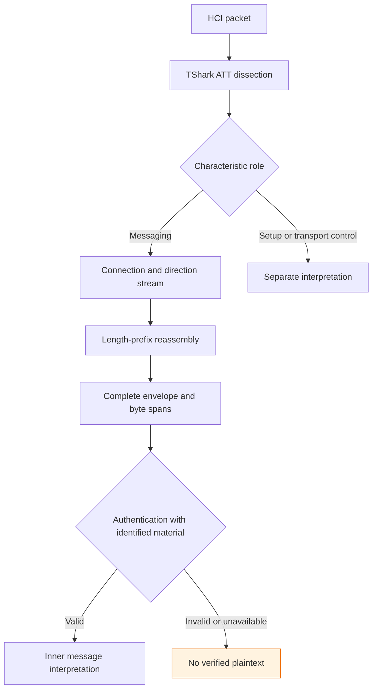
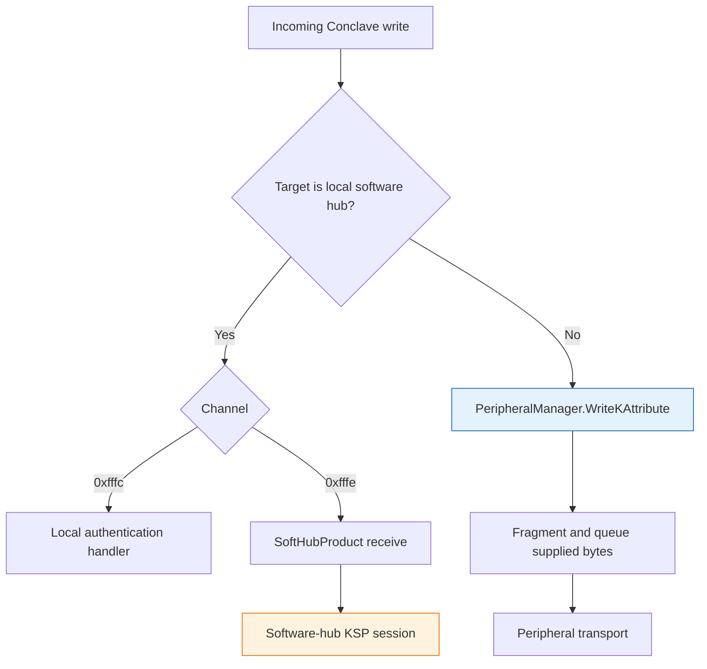
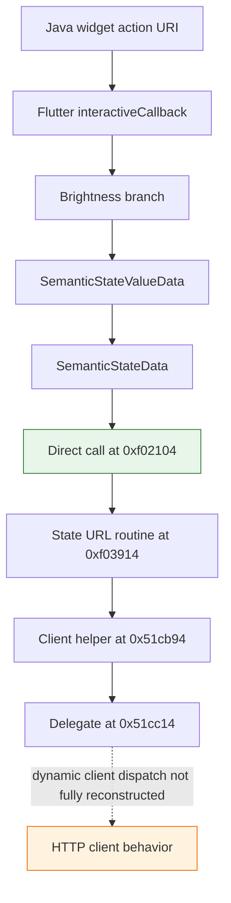

# Hubspace BLE: From Bluetooth Packets to Cloud Control

A phone can transmit a command directly to a light over Bluetooth without constructing or encrypting that command locally. The Bluetooth connection establishes a transport path. It does not establish who authorized the operation, which endpoint owns the cryptographic session, or whether the operation can occur without an internet connection. This distinction became the central result of an investigation that began with a simpler objective: build an independent client for an owned Hubspace light.

We examined three Android Bluetooth capture attempts, the native C++ library shipped with the application, its Java integration, and its compiled Flutter/Dart code. The work produced a native-backed protocol model, reproducible capture tooling, a static session-provenance graph, and a concrete connection between an Android home-screen widget's brightness action and an Afero state API. It did not produce authenticated decryption of a captured bulb message or a working independent offline controller.

> [!summary]
> - Bluetooth transmission is confirmed, but internet-independent smart control is not. Afero explicitly documents the phone acting as an internet gateway for BLE products.
> - Native code distinguishes the software hub's own cryptographic session from payloads forwarded to other devices. Its saved session key is not established as the bulb's key.
> - Raw Dart ARM64 instructions connect a widget brightness branch to a metadevice state API. That is a specific application path, not proof of every main-screen operation or the route used in our earlier capture.
> - The project has 61 passing tests, exact reconstruction of 59 captured envelopes, and retained failure evidence. Session-key provenance, captured authentication, and independent local bootstrap remain unresolved.

This is a closing technical synthesis rather than an implementation diary. The earlier [[PROJ - Hubspace BLE - From HCI Captures to Native Session Cryptography]] records the first native-code checkpoint. This report is a new note, not a replacement: it preserves the earlier experimental history while incorporating the subsequent session, Android, public-documentation, and Dart findings. Paths below are relative to `/home/manuel/code/wesen/2026-09-05--inspect-hubspace` unless identified otherwise.

## 1. The objective needs a more precise definition

The initial goal was local control of an owned light: read its state and change power, brightness, color, and color temperature without using the vendor application for every operation. That description leaves several independent requirements unstated. A replacement interface might still use the vendor cloud. A Bluetooth-only transport might still depend on a cloud-established session. An operation that works after login might not work after a cold start with no network.

These are different capabilities:

| Capability | What it establishes |
|---|---|
| Local transport | The phone exchanges bytes with the product over BLE or a local network. |
| Independent application | Another program can initiate operations instead of the vendor UI. |
| Offline steady-state control | Operations work without a live internet connection after any earlier setup. |
| Offline bootstrap | A client can establish the necessary authorization and session without internet access. |
| Offline recovery | Operation resumes after reconnect, restart, or power loss without a cloud dependency. |

A useful investigation must specify which capability has been demonstrated. In this project, local BLE transport is observed. An offline parser is implemented. Independent application control and offline session establishment are not demonstrated.

The owner's later observation that the app says it requires internet is consistent with the architecture we found, but it is not a controlled experiment identifying the reason for that requirement. An app can require connectivity for account validation, synchronization, provisioning, or command generation. Disabling one UI check would not establish the missing authorization protocol.

The practical question therefore changed from “Which characteristic should we write?” to “Which component can legitimately produce an accepted message for this bulb, and can we reproduce that capability without the cloud?”

## 2. What different forms of evidence can tell us

We used five complementary evidence sources. HCI captures show traffic between Android's Bluetooth host stack and controller. Native disassembly shows how selected functions manipulate data. Decompiled Java exposes Android and Flutter integration. Dart AOT inspection supplies application metadata and machine instructions. Vendor documentation describes the intended platform architecture.

Each source has a limit. A capture does not name the Java or Dart method that produced a value. A function's presence in a library does not prove it handled a particular packet. A readable string in a binary does not establish a call path. A vendor white paper does not identify the key for an individual recorded session.

The project kept several evidence levels separate:

1. **Observed transport data:** a packet, value, sequence, or connection event in a retained capture.
2. **Observed static implementation:** a byte copy, call instruction, branch, or serializer in the inspected binary.
3. **Documented platform behavior:** an architectural statement from the vendor or a scoped statement from an integration author.
4. **Implemented and tested model:** executable research code with explicit fixtures and rejection cases.
5. **Unresolved association:** a proposed relationship between those sources that still lacks an exact match.

The most important unresolved association is between a service payload or native invocation and one of our captured bulb envelopes. We now have strong reasons to investigate forwarding, but we have not joined those two observations by exact bytes.

That distinction prevents a technically detailed report from implying interoperability it has not demonstrated. A synthetic AES-GCM round trip, a parsed capture, and an authenticated product response are three different tests.

## 3. The capture sequence: discovery, an invalid run, and a useful baseline

The first input was an Android bugreport archive containing many unrelated system artifacts. We selected the Bluetooth HCI logs rather than importing the entire report. This kept the investigation focused and avoided unnecessarily distributing device diagnostics through Git and the vault.

Connected traffic exposed the proprietary Afero service, setup messages, messaging fragments, and separate control channels. The first useful discovery was therefore structural: this was an application protocol layered over GATT, not a characteristic accepting a bare brightness value.

The second experiment supplied a human action sequence, but its current log contained no ACL, L2CAP, or ATT packets. It contained many Bluetooth packets, primarily of other kinds, which made file size a misleading measure of capture quality. The rotated file contained earlier traffic rather than the new action run. We could not honestly attach the new action labels to those old packets.

The third attempt yielded 466 ATT packets across two files. From them, the extractor reconstructed 59 complete messaging envelopes: 26 outbound and 33 inbound. The current file's action interval contained nineteen envelopes in each direction. Roughly five-second action spacing made timing useful, though slider positions and gesture boundaries were not measured precisely.

| Experiment | Result | Valid conclusion |
|---|---|---|
| Capture one | Proprietary GATT discovery and connected setup/messaging traffic | Enough evidence to map transport roles and framing candidates. |
| Capture two | No connected ATT traffic in the new current log | The intended action correlation failed; the archive cannot establish the new command path. |
| Capture three | 59 complete envelopes across the two retained files | A reproducible structural baseline with tentative timing/size associations. |

Observed message sizes clustered around 21, 22, and 23 bytes. Later native serialization explained why those sizes were plausible for one-, two-, and three-byte values. It did not turn the timing labels into authenticated attribute semantics. A color-mode switch and a color value can occur near the same gesture, and a slider can generate multiple intermediate writes.

The rule that emerged is simple: verify the relevant protocol traffic exists before interpreting the action timeline. An apparently successful physical operation does not establish which network path was used, and a large log is not necessarily a useful log.

## 4. GATT identity and fragmentation

The relevant service UUID is:

```text
7a5a0068-6469-7545-4c42-6e6162696b
```

Its characteristic UUIDs share the suffix `-6469-7545-4c42-6e6162696b`. The short prefixes identify the roles below.

| Prefix | Observed role |
|---|---|
| `7a5afe01` / `7a5afe02` | Setup notify/write pair, including readable setup exchanges. |
| `7a5afffb` / `7a5afffc` | Additional notify/write pair; native routing uses channel `0xfffc` for negotiation in the local-hub branch. |
| `7a5afffd` / `7a5afffe` | Messaging notify/write pair used for the captured encrypted-envelope model. |
| `7a5afe03` / `7a5afe04` | Separate transport acknowledgment/credit traffic. |

A UUID identifies a characteristic's role; an ATT handle identifies its location in the current GATT database. The messaging write characteristic appeared at handle `0x0037` in an earlier capture and `0x0010` in another. Reusing the old handle initially hid traffic that was actually present.

The captures were consistent with the default ATT MTU of 23. Write Command and Handle Value Notification consume three bytes of ATT overhead, leaving twenty bytes per characteristic value. A twenty-one-byte application envelope therefore spans at least two values. The one-byte continuation is not a separate lighting operation.

“Write without response” also describes only the ATT operation. The application protocol can still exchange acknowledgments on another characteristic. Mixing those acknowledgments into a ciphertext buffer would corrupt reassembly even if their lengths looked cryptographically plausible.



This is why the reusable unit in the research tooling is a connection-aware envelope record, not an isolated characteristic write.

## 5. Native code corrected the protocol model

The installed Hubspace 2.5.1 application includes a symbol-rich ARM64 `libhubby.so`. It is stripped of ordinary debugging information but retains useful dynamic C++ exports. Names such as `KSPSession::PrepareOutboundData`, `Crypto::AesGcmEncrypt`, and `SetKSPMessage::Serialize` let us inspect specific responsibilities instead of searching all instructions equally.

The most consequential correction concerned four bytes following the outer length. An early interpretation divided them into a sixteen-bit sequence and sixteen-bit flags. Native code increments a thirty-two-bit counter and serializes it with `Utils::LE32`. Consequently:

```text
0e 00 01 00  =  uint32 little-endian 0x0001000e  =  65550
```

The upper two bytes were not flags. Ignoring them changed the nonce and guaranteed failure for messages whose upper counter bits were nonzero.

The inspected KSP implementation uses this envelope:

```text
u16le body_length | u32le sequence | ciphertext | tag[6]
```

For plaintext length N, body_length is N + 10, and total envelope length is N + 12. A twenty-one-byte captured envelope can therefore be represented structurally as:

```text
13 00 | 0e 00 01 00 | ciphertext[9] | tag[6]
```

The length word counts nineteen following bytes: four sequence bytes, nine ciphertext bytes, and six tag bytes. This representation deliberately omits captured payload bytes; no private session material is needed to explain the arithmetic.

The cryptographic helper calls `EVP_aes_128_gcm`, uses a twelve-byte nonce, and gets or verifies a six-byte tag. No separate AAD update occurs in the inspected helper. These are concrete facts about this native implementation. The model fits the captured envelope structure, but without a verified tag it is not independent proof that we have identified the bulb's exact cryptographic session or every parameter of that session.

This qualification became more important after we identified the software-hub context. Native code can establish an algorithm precisely while its association with a particular remote product remains unproved.

## 6. Nonce arithmetic and inner message size

The native send path copies the session's base IV and adds the full sequence with carry. The IV is treated as a big-endian ninety-six-bit integer even though the sequence is serialized little-endian on the wire. These are two independent representation choices.

The offline equivalent is:

```python
def nonce_for(base_iv, sequence):
    require len(base_iv) == 12
    require 0 <= sequence <= 0xffffffff
    n = int.from_bytes(base_iv, "big") + sequence
    require n < 2**96
    return n.to_bytes(12, "big")
```

Using only the low sixteen sequence bits, XORing the counter into the IV, or overwriting the final four IV bytes would produce a different nonce. The tests compare this integer formulation with a transcription of the native bytewise carry loop.

The inner Set serializer also explains the observed length classes. It writes an inner length, type, flags, attribute ID, value length, and value:

```text
u16le length | u8 type | u8 flags | u16le attribute_id | u16le value_length | value
```

There are eight header bytes before the value. Adding twelve bytes of outer framing gives:

$$
L_{envelope} = 8 + L_{value} + 12 = 20 + L_{value}.
$$

One-, two-, and three-byte values therefore yield twenty-one-, twenty-two-, and twenty-three-byte envelopes. This explains the size pattern without inventing a larger authentication tag.

It does not establish that a three-byte value is RGB, that a two-byte value is Kelvin, or that a one-byte value is a percentage. Nor does it establish the numeric Set opcode or bulb-specific attribute IDs. Those remain explicit unknowns in the codec rather than constants inferred from timing alone.

A sender would also need a safe counter lifecycle. Reusing the same nonce with different plaintext under a GCM key is not acceptable. Our pure codec accepts an explicit sequence; it does not yet allocate counters durably, establish sessions, or negotiate peer recovery behavior. Those responsibilities cannot be omitted from an eventual client simply because encryption itself is implemented.

## 7. The rejected keys were useful negative evidence

Readable setup JSON contained fields named `key` and `iv`, with lengths compatible with sixteen- and twelve-byte values. After correcting the envelope and tag length, direct use of a visible pair still failed authentication. A bounded follow-up tested fifteen candidate combinations, and every one was rejected.

The conclusion is deliberately limited: those candidate combinations did not authenticate the tested envelope. The result does not prove the envelope model is universally wrong, that every JSON-derived possibility is impossible, or that more arbitrary guessing would be productive.

The inspected negotiation path derives a thirty-two-byte ECDH result and selects:

```text
AES key = shared_result[0:16]
base IV = shared_result[20:32]
```

The saved record has another thirty-two-byte layout:

```text
AES key[16] | base IV[12] | outbound counter[4]
```

Equal total size does not imply equal representation. The IV begins at byte twenty in the derive output but byte sixteen in the packed saved record. A decoder needs provenance identifying which object it is reading.

The next step was therefore not brute force. It was session ownership: determine which object supplies the key, which peer it authenticates, and which messages use it. A key-shaped value without those relationships is not yet a useful key for the investigation.

## 8. What the software hub actually is

The native library contains `SoftHubProduct`, a software endpoint running in the application. It has its own identity, setup state, authentication, and KSP session. “Software hub” is the library's concrete component, not an additional physical device.

Its constructor obtains a configuration string, constructs `SoftHubSetup`, then constructs `KSPSessionSoftHub` using that setup object. In this exact binary, the product retains its session pointer at offset `+0xd0` and its setup pointer at `+0x120`. `SoftHubProduct::Start` calls setup loading followed by session-info reloading.

The inherited `CommonProduct::PrepareOutboundData` loads that session pointer and dispatches through its virtual method table. We corroborated the dispatch using both machine instructions and the corresponding vtable data reference. For the primary Itanium ABI table used here, the callable address point follows a sixteen-byte table header; a slot-relative offset must be applied after that header.

| Concrete relationship | Static evidence |
|---|---|
| Product owns KSPSessionSoftHub | Constructor at ELF `0x266b84`, session construction/store. |
| Startup restores saved material | `SoftHubProduct::Start` at `0x2672d4`. |
| Product send dispatch reaches session send | Slot at `0x412710` references `0x26aa78`. |
| Product receive dispatch reaches NewKAttributeData | Slot at `0x412610` references `0x267dac`. |
| Peripheral manager write dispatch | Slot at `0x40e830` references `0x212fa0`. |

These references support concrete static ownership and dispatch. They do not identify the runtime object that processed a selected captured packet. That last association still needs observation or an equivalent exact data-flow match.

The scoped export covers thirty-two native functions and the three selected vtable references. Its reviewed graph contains twelve static relationships and one explicitly hypothetical capture-to-route association. The resulting distinction is essential: the app's own software-hub session and a session associated with the bulb need not be the same cryptographic context.

## 9. Persistence became clearer without accessing private files

The native setup constructor builds a filename ending in `session_info`. `SetSessionInfo` copies its input into a vector and writes the vector bytes to the corresponding path. `Load` reads it back; `ReloadSessionInfo` checks for exactly thirty-two bytes and restores the key, IV, and outbound counter.

No additional encryption transform appears in the inspected file-writing function. That is not equivalent to a claim about Android file permissions or device-at-rest security. We did not read the actual file, and the release application denied ordinary `run-as` access.

The separate method `SetSessionKey(EVP_PKEY*)` writes `sessionPublic.pem` and `sessionPrivate.pem`. Its argument is an asymmetric-key object, not the sixteen-byte AES value in session_info. The shared word “key” would be an unreliable basis for conflating them.

Java inspection later narrowed the configuration-derived prefix:

```java
prefix = context.getFilesDir().getAbsolutePath()
    + "/shs"
    + (manufacturer + model + hubType + accountId).hashCode();
```

That prefix is supplied as `SOFT_HUB_SETUP_PATH`. We now know where the Java layer gets the path inputs, but not their actual runtime values or every normalization step performed below it. Java's String hash is part of naming; it is not cryptographic protection.

This is a useful example of progress without secret access. The implementation relationship is more precise, yet it still does not make the software hub's saved material the bulb's messaging key.

## 10. The native forwarding branch changed the investigation

`HubConclave::HandleDeviceWrite` decodes a target ID, channel ID, and payload. It then compares the target with the local hub identity associated with its authentication context. The branch taken for the local hub differs from the branch taken for another device.

For the local hub, channel `0xfffc` is routed to authentication/negotiation handling and `0xfffe` to product-side message processing. For another target, the decoded payload is passed to the peripheral-manager interface. The binary-protocol `HubConclave::OnWrite` contains the corresponding split.



The following pseudocode summarizes the inspected branch, omitting error handling and C++ ownership mechanics:

```python
payload = decode_payload(message)
if message.target == local_hub_identity:
    route_to_local_authenticator_or_product(message.channel, payload)
else:
    peripheral_manager.write_k_attribute(
        message.target, message.channel, payload, message.request_id)
```

The non-local branch does not call the local software-hub encryption helper before forwarding that vector. `PeripheralManager::WriteKAttribute` divides supplied bytes into transport-sized pieces and calls `Peripheral::Write`.

Consequently, observing `Crypto::AesGcmEncrypt` could reveal a valid key that is irrelevant to the bulb envelope. If the bulb-targeted payload arrives already encrypted, its producing encryption operation occurred before this forwarding boundary.

The code supports that architecture. We have not yet shown that one of the 59 captured envelopes is the exact payload in a particular Conclave invocation. The report preserves that missing association rather than extending a static branch into an unobserved runtime claim.

## 11. The clear setup material belongs to another use

The `SecretMessage` constructor generates sixteen random bytes and then twelve random bytes. Its serializer converts those fields into the readable JSON representation. References to the serializer lead to Wi-Fi credential-management operations, including connection callbacks, credential submission, and SSID-list requests.

The Wi-Fi credential serializer uses the same AES-GCM helper with the IV supplied directly from SecretMessage. It does not pass through the KSPSession counter-addition path. `WifiCredentialManager::OnConnect` also contains a setup-channel write using `0xfe02`.

This gives a concrete explanation for why a visible setup key may not decrypt later messaging envelopes. The helper is shared by several callers, but their materials, nonce inputs, and payload framing differ.

It also refines a future observation plan. A process-global “last key seen” variable would be inadequate. Concurrent helper invocations could belong to software-hub messaging, credential exchange, or SSID operations. Every observation needs caller and session context, plus an exact output match to the transport data of interest.

We did not use these findings to make a product vulnerability claim. They describe the inspected use of cryptographic APIs and the danger of confusing similarly named fields. Reachability, lifecycle, and complete protocol security would require another investigation.

## 12. Public documentation independently explains BLE internet failover

The vendor's [Afero platform overview](https://afero-docs.readthedocs.io/en/latest/SystemOverview/) explicitly says the mobile app works as a hub, sending and receiving cloud messages on behalf of smart devices. It lists hub software inside the mobile app and describes BLE/Wi-Fi communication to the radio and Wi-Fi/LTE communication to the cloud. That developer page is marked updated in 2021.

A newer [Afero Bluetooth white paper](https://www.afero.io/assets/img/Best_In_Class_Bluetooth_v3_2026.pdf) makes the failover behavior more explicit. Its “Any Internet Connection” section says encrypted traffic can use BLE through the user's phone, tablet, or computer. Its “Direct to Device Connection and Failover” section explains that a product unable to use its Wi-Fi connection can automatically connect to the internet through the phone.

That explains an otherwise confusing product behavior: control can work when the product's Wi-Fi is unavailable while still requiring internet access on the phone. “Direct to device” and “offline” are not interchangeable descriptions.

The white paper also describes mutually authenticated sessions using primitives such as ECDH and traffic protection using AES-GCM. This is consistent with the native implementation. It does not document our exact tag width, nonce arithmetic, or the identity of the session protecting a particular captured command. We treat its broader security statements as vendor claims, not as an independently completed audit.

Community resources provide additional context. An unofficial Home Assistant integration describes cloud-polling and no local control path in that integration. A hardware experiment seeks local operation by replacing an Afero module in a ceiling fan. Afero's public Beetle repository supplies a Linux BlueZ transport interface to hub software, not a replacement cloud or a ready-made offline Hubspace client.

The useful sources, including the original three-page PDF, are archived with URLs and checksums under `sources/afero-web/`. The Home Depot FAQ returned HTTP 403 during extraction; no unavailable FAQ text was treated as a verified quote.

## 13. Capture normalization made the evidence reusable

Once the investigation needed exact associations across sources, the original single-target extractor was no longer sufficient. It cleared every stream on any disconnect and attached frame-number lists that could not precisely represent a characteristic value shared by two envelopes.

The new normalizer separates four responsibilities:

- **Capture identity:** independently parse btsnoop record bounds, timestamps, flags, reported drops, and hashes.
- **Dissection:** join TShark's ATT and connection fields to the independently counted records.
- **Connection state:** maintain controller, continuity domain, handle generation, role map, and directional streams.
- **Provenance:** record exactly which value bytes contribute to each reconstructed envelope.

A span has the following conceptual shape:

```python
ByteSpan(
    capture_id=sha256_of_capture,
    frame_number=source_frame,
    value_offset=offset_in_dissected_ATT_value,
    length=bytes_consumed,
)
```

Suppose one ATT value contains an entire envelope A followed by the first four bytes of envelope B. A frame-number list says only that both involve that packet. A byte-span representation says that A consumes one prefix and B consumes the subsequent four bytes. The next value supplies B's remainder with offset zero in that new value.

Those offsets are logical characteristic-value offsets, not physical positions inside raw HCI packets. If lower-layer reassembly is involved, a reviewer may need the original TShark context to reconstruct the value. The tool states that limitation explicitly.

The real-capture regression checks all 59 envelopes in order, compares their full bytes, directions, and thirty-two-bit sequences, then rebuilds every envelope from its recorded spans. This is stronger than comparing counts alone, but remains structural validation rather than authentication.

## 14. Rotation, ordering, and gaps are correctness issues

Two files do not form one continuous connection merely because one is named `.last`. The normalizer requires exact overlapping packet evidence before carrying state across file boundaries. Identity includes timestamp, HCI flags, original/included lengths, and captured bytes. Equal ciphertext is insufficient because a payload can legitimately be retransmitted.

Overlap also creates ordering problems. A frame numbered 2 in one file may occur after frame 100 in another. If their timestamps are equal at microsecond resolution, sorting on frame number can reverse known packet order. The merger instead preserves each file's recorded sequence through a dependency graph and rejects unresolved ambiguity.

```python
for each capture:
    add ordered packet-occurrence nodes
    add edges between consecutive occurrences

merge only demonstrably identical cross-file occurrences
reject conflicting dissection or ambiguous repeated occurrences
emit an order consistent with all retained file-order edges
```

Reported loss, missing required metadata, and changed characteristic mappings stop potentially affected streams. A malformed length does not trigger a scan through ciphertext for a plausible next prefix. Successful new connection context establishes a new epoch; a failed disconnect event does not destroy a valid stream.

The support scope remains intentionally narrow: btsnoop v1/H4, selected LE connection-complete events, disconnect-complete, ATT Write Command, and Handle Value Notification. Arbitrary pcapng or every Bluetooth event variant is not claimed. Unreported packet loss also cannot be ruled out from this evidence alone.

The CLI writes to a new private directory outside the repository and synced vault, with 0700 directory and 0600 file permissions. It emits metadata, encrypted raw frames, diagnostics, and a summary written last as a completion record. The two capture-three files produce one expected continuity-boundary diagnostic and no incomplete envelope in this run.

## 15. Java inspection exposed integration, not the entire application

The APK contains Flutter components and compiled Dart application code. Java therefore describes only part of the system. MainActivity registers Flutter plugins, including a Softhub plugin identified in its generated registration code.

The plugin registers `afero.io/softhub_method` and `afero.io/softhub_events`. Its fourteen method branches cover lifecycle, association, setup/Wi-Fi, device identity, and Bluetooth state. The inspected dispatcher has no lamp-power or brightness setter.

That absence is scoped. `Hubby.setAttribute(int, String, SetAttributeCallback)` exists separately as a native wrapper, and generic Dart JNI plugins are registered. A Java caller search cannot prove that a method is unreachable from Dart. Nor does a method named setAttribute establish that it changes a remote bulb rather than software-hub attributes.

At the transport boundary, Java is more explicit. `BlueToothAdapter.write` queues a supplied byte array. `BluetoothLeService.writeCharacteristic` assigns that array to a characteristic and calls Android `BluetoothGatt.writeCharacteristic`. These inspected methods do not create a lighting message or perform AES encryption.

The widget path also points back to Flutter. Java WidgetAction builds a `hubspace://...` action URI and sends it through HomeWidget's background intent. The worker resolves a Flutter callback handle and initializes Flutter execution. This supplied a concrete Dart entrypoint for the next investigation.

JADX 1.5.6 was run as a standalone temporary tool. Full decompilation reported 54 errors and exit code 3. Selected wrappers were readable, while WidgetAction required simple-mode output. A decompiler-generated “Method not decompiled” exception was treated as a tooling artifact, not application behavior. Even apparently successful output contained suspicious reconstructed retry control flow, so conclusions were limited to the clear operations being examined.

## 16. Dart AOT inspection required a matching runtime

The matching Flutter engine identified Dart 3.11.4, an Android ARM64 snapshot with compressed pointers and dwarf-stack-trace mode. The workstation's installed Flutter version was not an adequate substitute for that target identity.

We evaluated Blutter, which builds a matching Dart AOT runtime to inspect libapp.so. Its source was pinned to a specific upstream commit. Existing GCC, CMake, Ninja, ICU, and the native files included in the installed Capstone Python package supplied the build dependencies. Only pyelftools 0.32 was added in an isolated temporary environment; no system package or phone change was needed.

A private pkg-config adapter exposed the existing Capstone headers and library to CMake. A private SONAME symlink supplied the library name expected by the generated executable. Ninja concurrency was limited to two jobs to bound memory use.

Compilation succeeded. The analyzer did not complete: it died with SIGSEGV while printing an inferred field type. Batch GDB on that offline analyzer located a null-pointer dereference in `DartField::Print`, called by `DartDumper::DumpCode`.

The failure had to remain visible. Many interesting application method entries also had unknown sizes, shown as `size: -0x1`, and lacked instruction bodies. Some other entries had positive sizes. Fixing a printing crash alone would not recover the missing method boundaries. The snapshot and loader source indicate limitations related to discarded Code objects and InstructionsTable handling, but we did not claim a complete diagnosis or repair of all metadata loss.

The run remains recorded as failed. Its earlier object-pool output and partial class metadata were used only as explicitly qualified inputs for another, narrower analysis.

## 17. Recover useful references without inventing function boundaries

Dart's ARM64 code uses register x27 as the global pool pointer in the convention examined here. Pool metadata associates offsets with constants such as strings and type arguments. Even without a complete method listing, a raw instruction can be checked for loading a particular pool entry.

The small research tool recognizes only two patterns:

```asm
ldr x16, [x27, #0x1410]
```

and an adjacent pair:

```asm
add x16, x27, #0xf, lsl #12
ldr x16, [x16, #0x458]
```

The second pair addresses pool offset `0xf458`. It does not justify propagating a register's meaning across arbitrary instructions, branches, or calls. The recognizer deliberately refuses that broader inference.

The script reads the ELF text section and uses Capstone for bounded instruction windows. It requires an explicit flag before using metadata from the failed Blutter run and records the pool hash and failed status with its output. Every saved window says that its endpoints are analyst-selected bounds, not inferred function boundaries.

ARM64 objdump provided an independent check of selected instructions. For this ELF, `-d` initially displayed the region as data under mapping-symbol interpretation; `-D` decoded the instructions. ELF virtual addresses, file offsets, Ghidra rebasing, and process addresses remain distinct concepts even when two happen to be numerically equal in a particular section.

This method is narrower than a Dart decompiler. It can establish a literal load, allocation tag, or direct branch to an address. It cannot by itself name every dynamic dispatch target, reconstruct asynchronous control flow completely, or prove that the code ran during our capture.

## 18. A concrete widget brightness path reaches the state API

The partial pool metadata contains a closure record whose parent is `package:hubspace/src/home_widget.dart::interactiveCallback` at ELF address `0xf0181c`. A bounded raw-code region beginning there contains a branch checking the string `brightness`, brightness-related diagnostics, state-object allocation, and a direct call at `0xf02104` to `0xf03914`.

The class labels can be corroborated more carefully than by nearby text. Two allocation stubs build object-header values whose class-ID bits decode as follows:

| Stub | Header value | Decoded class ID | Retained class metadata |
|---|---:|---:|---|
| `0xd80d20` | `0x00b6f21c` | 2927 | SemanticStateValueData |
| `0xd7db90` | `0x00b7011c` | 2928 | SemanticStateData |

For this layout, the class ID is `(header >> 12) & 0xfffff`. The brightness branch calls these stubs and stores the `brightness` string in the value object. This connects raw allocation instructions with independently retained class-table labels; it does not recover every field's public API meaning or unit.

The called range at `0xf03914` constructs a URL from a service base, account and metadevice arguments, fixed path components, and a suffix helper:

```text
<service-base>/v2/accounts/<account>/metadevices/<id>/state<suffix>
```

Its machine instructions load these three constants in order:

```asm
0xf03988: ldr x16, [x27, #0x1410]   ; "/v2/accounts/"
0xf03998: ldr x16, [x27, #0x1418]   ; "/metadevices/"
0xf039a8: ldr x16, [x27, #0x1420]   ; "/state"
```

The resulting URL and state object are passed to helper `0x51cb94`, which delegates to `0x51cc14`. A diagnostic in that helper names `AferoClientCoreImpl.put()`. Its leading text incorrectly says “POST called,” so the diagnostic is not an independent observation of an HTTP verb. The strongest supported conclusion is the concrete widget-to-state-API path, with an implementation clue identifying a put-related helper.



This is substantially stronger than finding an API hostname string in a binary. It connects a named widget callback, a brightness branch, typed request construction, and a direct call to endpoint-building code. Its scope remains the Android home-screen widget path. We have not established every main-screen slider's call chain or matched this invocation to the earlier Bluetooth recording.

## 19. Two service hosts and two API routes must not be conflated

The widget's client-initialization range selects the service identifier `prod-gcs2` and allocates class ID 3910, labeled HttpAferoClient in the retained metadata. It stores the selected service descriptor at object offset eight.

The saved production descriptor contains two public hosts:

```text
service offset 0x14: https://api2.afero.net
service offset 0x18: https://semantics2.afero.net
```

The state-URL routine loads the service's offset-0x18 field. With the compiled production descriptor, that selects the semantics host. This is a static configuration/data-flow relationship, not a captured TLS request or an observation of live account state.

A separate raw-code range at `0xf505e0` constructs:

```text
<service-base>/v1/accounts/<account>/devices/<device>/requests
```

It uses the offset-0x14 host field, loads the label `postDeviceRequests`, and calls a helper at `0x7cc0a0` whose diagnostic describes the client's post operation.

The two findings are related architecturally but not interchangeable. The observed widget branch calls the v2 metadevice-state routine. We did not prove that it directly calls the v1 device-request routine. A logical metadevice state may be translated into physical device operations elsewhere, but that translation has not been reconstructed here.

A useful conceptual summary is:

```text
Widget brightness intent
    -> semantic state request for a logical metadevice
    -> application client/service boundary

Separate device-request API implementation
    -> account/device requests endpoint

Unresolved connection
    -> particular service output
    -> particular encrypted bulb envelope
```

Keeping that unresolved connection explicit prevents two genuine code discoveries from becoming an invented complete end-to-end sequence.

## 20. What the tests establish at this checkpoint

The full repository suite has sixty-one passing tests. Their distribution makes the scope clearer than the aggregate alone:

| Test group | Count | What it checks |
|---|---:|---|
| Original codec | 12 | Synthetic AEAD behavior, framing, nonce arithmetic, Set layout, rejection and replay-state order. |
| Native export/provenance | 7 | Pinned identity, export completeness, reviewed citations and selected vtable relationships. |
| Capture normalization | 26 | Connection/gap/rotation behavior, exact spans, private output, and actual capture-three structural regression. |
| APK inspection helpers | 5 | ZIP member identity, source-status accounting and bounded string extraction. |
| Dart analysis wrapper | 5 | Pinned input/tool checks and private dependency setup. |
| Dart pool-reference recognizer | 6 | Conservative direct/adjacent load recognition, duplicate rejection, addressing and term filtering. |

These tests do not contain a positive known-answer vector for a real captured bulb message. They also do not run the app, contact the service, or send BLE operations. A test suite can be strong within its defined scope while the project's practical objective remains unachieved.

The receiver model illustrates the distinction between wire compatibility and internal behavior. Unlike the inspected native receive order, the Python receiver advances its accepted counter only after successful authentication. A modified tag cannot consume replay state in that model. This is a deliberate local implementation choice, not a demonstrated vulnerability in the vendor system.

The remaining acceptance gate is still concrete: bind legitimate session material to identified captured messages, authenticate several distinct messages in each direction, reject mutations, and explain the verified inner content. Nothing in the Java or Dart inspection substitutes for that test.

## 21. Reproduction and artifact organization

The repository separates original evidence, retained derived evidence, research code, and ticket documentation:

```text
sources/
  hubspace-capture*/       selected HCI evidence and provenance
  hubspace-native/         pinned native binary and static exports
  hubspace-app/            selected Java evidence and APK inventory
  hubspace-dart/           failed-run record, scoped metadata, raw ARM64 windows
  afero-web/               vendor/community documents and checksums
scripts/                  all project-owned analysis and test tools
ttmp/                     guides, tasks, changelogs and chronological diaries
```

The large APK exports, full Dart object pools, generated instrumentation templates, and temporary build products stay outside the vault. This article also omits session secrets and device/account identifiers. Understanding the protocol layout and the static control path does not require publishing those values.

The principal checks from the repository root are:

```bash
python3 -m unittest discover -s scripts -p 'test_*.py' -v
sha256sum -c sources/hubspace-native/derived/SHA256SUMS
sha256sum -c sources/hubspace-app/SHA256SUMS
sha256sum -c sources/hubspace-dart/SHA256SUMS
sha256sum -c sources/afero-web/SHA256SUMS
python3 scripts/06-native-provenance.py --claims-only
```

Capture normalization is reproducible into a new private destination:

```bash
python3 scripts/07-normalize-captures.py \
  --manifest scripts/capture3-manifest.json \
  --output-dir /tmp/hubspace-normalized-new-run
```

Its expected summary is 59 envelopes, 26 outbound and 33 inbound, one continuity boundary, and authentication not attempted. The original extractor remains available for comparison.

Dart build and bounded-reference reproduction are documented in `sources/hubspace-dart/README.md`. The full Blutter command may reproduce the known SIGSEGV; it is not listed as an expected successful decompilation. The scoped reference tool requires explicit permission to use the failed run's earlier pool output.

The most useful evidence entrypoints are:

| Question | Files |
|---|---|
| Native envelope and nonce implementation | `scripts/ksp_codec.py`; `sources/hubspace-native/derived/selected-disassembly.txt` |
| Session ownership and forwarding | `sources/hubspace-native/derived/native-provenance.json`; `derived/provenance/0023294c.c`, `00238654.c`, `00266b84.c` |
| Java bridge and GATT boundary | `sources/hubspace-app/java/p028d5/h.java`; `java/io/afero/hubby/internal/BlueToothAdapter.java` and `BluetoothLeService.java` |
| Widget brightness and state endpoint | `sources/hubspace-dart/asm/range_00f0181c_00f021d8.asm`; `range_00f03914_00f03a1c.asm` |
| Client helper and configuration | `sources/hubspace-dart/asm/range_0051cb94_0051cd80.asm`; `range_00f03a1c_00f03bf8.asm`; `metadata/production-service.txt` |
| Distinct v1 request route | `sources/hubspace-dart/asm/range_00f505e0_00f5072c.asm` |
| Failure provenance | `sources/hubspace-app/inspection.json`; `sources/hubspace-dart/failed-blutter-run.json`; HUBSPACE-BLE-005 diary |

The source-evidence cutoff is local commit `dcc09a2`. Earlier milestones include `370c17e` for native forwarding provenance, `ba6e03e` for capture normalization, `4d78438` for Java inspection, and `da57feb` for isolated Dart tooling. These are source-repository commits, distinct from the vault commit publishing this report. Source pushing is not implied by vault publication.

## 22. What would be required to continue

There are two different continuation objectives, and they should not be mixed.

The first is **validate the observed command route**. A scoped, authorized observation could record the bulb-targeted Conclave payload, the peripheral-write payload, and the HCI envelope. Exact equality would establish forwarding for that operation. If a local encryption operation instead produced the exact output, that would identify the relevant local boundary. Timestamps alone would be supporting evidence, not the join key.

The second is **establish independent offline control**. That requires a legitimate way to establish the bulb's accepted session, identify its authorization and peer-binding rules, allocate counters safely, recover attribute semantics, and validate recovery after restart. If a cloud endpoint produces the encrypted command and the app never owns that session's key, observing more app-side AES calls will not necessarily solve the problem.

Public Beetle source may help with transport details; it is not a cloud replacement. A suitable debug or separate test environment could help establish byte provenance; it should not be selected implicitly by modifying the working phone. Hardware replacement is another category of project, and examples from a ceiling fan do not establish a safe or practical modification for this bulb.

The controlled offline experiment discussed during the investigation was not completed here. Even if it were, its interpretation would need care. Success could demonstrate offline steady-state operation while depending on cached setup. Failure could reflect an application gate unrelated to the precise location of encryption. Neither result alone reconstructs the full authorization protocol.

Given the current evidence, the realistic conclusion is that a software-only stock-firmware offline client is not guaranteed and would require a new, explicitly scoped phase. The present investigation has reached a defensible stopping point without claiming impossibility.

## 23. The result is an architectural explanation, not a finished controller

At the beginning, the apparent task was to recover a BLE command format. The native implementation supplied a precise envelope model and corrected several attractive but wrong assumptions. Subsequent ownership analysis showed why that was not enough: a session belongs to a particular endpoint, and a local transport can carry data for another endpoint's authenticated exchange.

Public documentation then confirmed that phone-mediated cloud connectivity is an intentional Afero feature. Java inspection exposed the Softhub lifecycle/setup integration and the supplied-byte GATT boundary. Dart investigation, despite incomplete tooling output, connected a concrete widget brightness operation to a semantic state API through raw instruction evidence.

The investigation therefore produced more than a list of characteristic UUIDs, but less than an independent controller. It produced a reproducible explanation of the parts we could establish, tools that preserve the original byte provenance, and explicit boundaries around what remains unknown.

The working rules are worth retaining:

- A local transport does not establish offline authorization or local command encryption.
- A valid algorithm implementation is useful only after it is associated with the session under investigation.
- Exact byte provenance matters when joining captures, native observations, and application behavior.
- Tool exit status, readable output, and semantic correctness are separate checks.
- Negative results should narrow the next experiment rather than be rewritten as partial success.
- A clear stopping point with unresolved dependencies is more useful than claiming that a protocol is fully decoded when no real message has authenticated.

The light is not yet independently controlled offline. What we now understand is why Bluetooth alone was never sufficient evidence that it could be.
