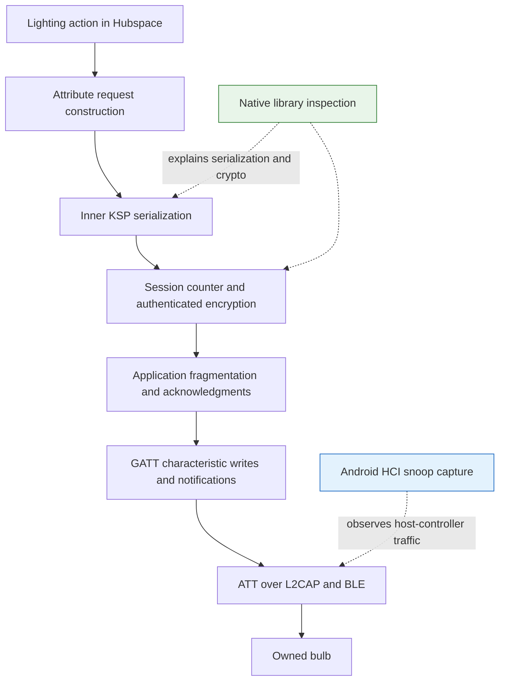
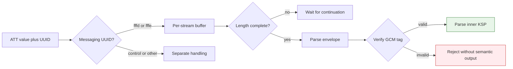
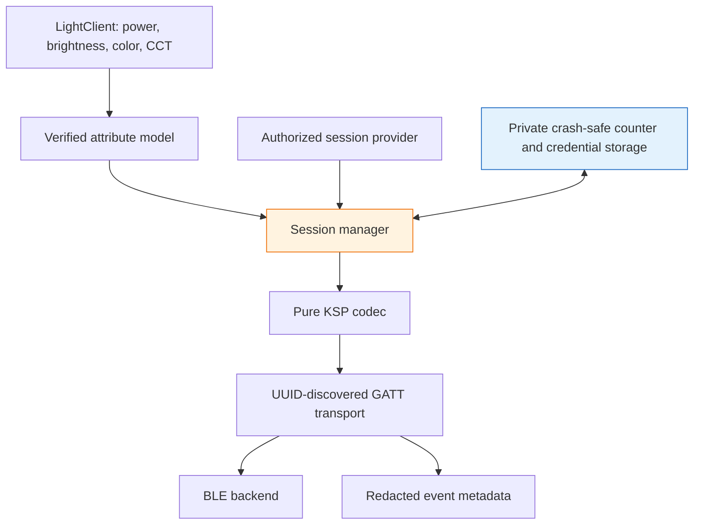

# Hubspace BLE: From HCI Captures to Native Session Cryptography

An independent Hubspace light client needs more than a Bluetooth connection and a characteristic to write. It needs to reproduce a sequence of transformations: a lighting operation becomes an attribute message, that message is serialized and authenticated, and the resulting bytes are transferred through a proprietary GATT service. This project investigates those transformations using Android Bluetooth captures and the native library shipped with the owner's installed Hubspace application.

The investigation has established a concrete messaging format and implemented a tested offline codec. It has not yet authenticated a recorded lighting message with independently identified session material. Understanding that distinction is essential: structural recovery, cryptographic verification, and working device control are different results, with different evidence requirements.

> [!summary]
> - Three capture attempts established the BLE service, transport behavior, and candidate action-to-message relationships.
> - Native analysis corrected the outer message format to a 32-bit sequence and a six-byte AES-GCM tag; earlier “flags” were counter bytes.
> - The inspected session path uses AES-128-GCM, derives nonce values from a base IV and counter, and supports ECDH negotiation and persisted session state.
> - Twelve synthetic tests pass, and 59 complete capture-three messaging envelopes have been extracted. The actual captured session keys and exact lighting attribute semantics remain unresolved.

## 1. Why this project exists

The practical objective is local control of an owned Hubspace bulb without depending on the vendor application for every operation. A useful independent client should eventually read state and set power, brightness, color, and color temperature. It should survive a short disconnect without losing synchronization and should distinguish ordinary local operation from any initial authorization that still requires a cloud service.

These requirements immediately separate two problems. The first is transporting bytes over BLE. The second is producing bytes the device will accept as an authorized message. A general BLE library addresses the first problem; it does not automatically implement Afero's session establishment, sequence handling, message authentication, or attribute model.

The project began with public research suggesting that Hubspace uses Afero and that application-layer security matters more than normal Bluetooth pairing. That research provided useful search terms, but the investigation treated local captures and the installed binary as the sources for implementation claims. An architecture description is not a complete wire specification, and a public example from another bulb cannot establish the exact behavior of this one.

The project directory is `/home/manuel/code/wesen/2026-09-05--inspect-hubspace`. Its current contents separate original evidence under `sources/`, reproducible native/offline tooling under repository-root `scripts/`, and ticketed research under `ttmp/2026/09/05/`. This report describes the state at local source commit `2e13772`; it is a technical project report, not a claim that the client is finished.

## 2. Define the layers before interpreting packets

Bluetooth Low Energy provides several distinct mechanisms that appear in the same capture. Advertising reports tell a scanning phone about nearby devices. Connected traffic uses logical channels, and the Attribute Protocol, ATT, defines operations such as reading, writing, and notifying attribute values. GATT organizes those attributes into services, characteristics, and descriptors.

A characteristic has a UUID and a handle. The UUID identifies the characteristic's role in a service. The handle is a numeric address assigned by the current GATT database. A capture analyst needs handles to locate individual packets; a reusable client should discover the characteristic by UUID and use the current handle returned by discovery.

Android HCI snoop logging records traffic between the Bluetooth host stack and controller. It is not a screen recording, and it is not necessarily an over-the-air trace. It can show host-side connection setup, advertisements, and ACL data carrying L2CAP and ATT. It cannot establish that a particular UI action used BLE merely because the bulb visibly changed.

There is another separation within connected traffic. An ATT notification may contain only a fragment of an application message. In the observed sessions, no ATT MTU exchange was found, so the default ATT MTU of 23 applies. A Write Command or Handle Value Notification has three ATT bytes of overhead, leaving 20 bytes for the characteristic value. A 21-byte application message therefore requires more than one ATT value even though it is a very small application message.



This diagram is a model of responsibilities. The investigation has inspected several native functions that implement those responsibilities, but it has not yet established the complete app-to-session call graph or the exact identity of every cryptographic peer. Afero traffic could be locally terminated or routed through BLE as part of a broader authenticated session. That unresolved distinction matters when identifying keys.

## 3. The first capture: discovery, fragmentation, and setup

The first supplied ZIP was a complete Android bugreport, not a focused PCAP bundle. It contained hundreds of unrelated system artifacts alongside two Bluetooth HCI logs. Importing the entire archive would have added irrelevant private data to the repository. Instead, the investigation extracted and hashed the HCI files, retained them under `sources/hubspace-capture/`, and recorded their provenance separately.

The main file contained 37,422 packets over approximately 244 seconds. The target advertised as `ESP32`, with manufacturer company identifier `0x02D2`, corresponding to Afero. Its manufacturer data included a stable eight-byte field, changing status-like bits, a changing counter-like byte, and a changing two-byte suffix.

Those observations identify fields worth investigating, but they do not decode them. A changing low bit might represent power, availability, or another state. A two-byte suffix might be a checksum or a truncated authenticator. Neither interpretation follows from field width alone. The report therefore retains the advertisement as a discovery and correlation source, not as a command protocol.

The more consequential evidence was connected ATT traffic. Discovery exposed the proprietary service:

```text
7a5a0068-6469-7545-4c42-6e6162696b
```

Within that service, eight custom characteristics formed four notify/write-without-response pairs. The following table uses their short distinguishing UUID prefixes; every entry has the suffix `-6469-7545-4c42-6e6162696b`.

| UUID prefix | Property | Observed role |
|---|---|---|
| `7a5afe01` | Notify | Clear setup responses and short control messages |
| `7a5afe02` | Write without response | Clear setup requests and control messages |
| `7a5afffb` | Notify | Subscribed, but its application role remains unresolved |
| `7a5afffc` | Write without response | No application role established from the selected traffic |
| `7a5afffd` | Notify | Fragments of bulb-to-phone messaging envelopes |
| `7a5afffe` | Write without response | Fragments of phone-to-bulb messaging envelopes |
| `7a5afe03` | Notify | Application transport acknowledgments or credits |
| `7a5afe04` | Write without response | Application transport acknowledgments or credits |

Enabling notification descriptors used ATT Write Request/Response. The data path used ATT Write Command, the operation normally called write-without-response. This does not mean the overall protocol had no acknowledgments. Short messages on the `fe03/fe04` pair repeatedly followed data fragments.

For example, the six bytes `04 00 ea 00 fe ff` appeared on an acknowledgment channel. That six-byte control message is not an AES-GCM tag just because the eventual cryptographic tag also turned out to be six bytes. Channel identity and message context are part of parsing.

One setup exchange also contained readable JSON with fields named `key` and `iv`. Their decoded sizes were 16 and 12 bytes. The same content was echoed by the peer. This was a useful lead, but it was not evidence that the values were the keys protecting every subsequent message. The distinction became central later.

## 4. The second capture: a failed experiment with a useful result

The next experiment supplied a human action sequence: OFF, ON, several brightness settings, colors, temperatures, and a final OFF, approximately ten seconds apart. The archive was large and its current log contained 55,634 packets. Nevertheless, it contained zero ACL packets, zero L2CAP packets, and zero ATT packets.

The rotated log did contain ATT traffic, but it was the earlier session rather than the new action run. Its presence did not rescue the experiment. Assigning new action labels to those old packets would have created a false result.

The relevant comparison was protocol composition, not file size:

| Capture | Main/current ATT packets | Rotated ATT evidence | Consequence |
|---|---:|---|---|
| First | 384 in the main file | Earlier short log also preserved | Enough connected traffic to map GATT and framing candidates |
| Second | 0 | Prior first-capture session, not new actions | No action correlation possible |
| Third | 200 | 266 packets from an earlier interval of the new experiment | Both files contribute useful new evidence |

A successful light change during the second experiment was compatible with Wi-Fi/cloud control. Another possible explanation was logging that omitted the relevant connected traffic. The archive did not establish which explanation was correct, so the earlier conclusion that the app “probably used cloud” remained a diagnosis to test rather than a proved routing decision.

The corrected procedure was to disable internet paths, confirm the logging mode, and begin with a two-action OFF/ON acceptance test. The fundamental acceptance criterion was whether the resulting log actually contained target ATT traffic.

For a quick inspection:

```bash
tshark -r btsnoop_hci.log -Y btatt
```

For a composition check:

```bash
tshark -r btsnoop_hci.log -q -z io,phs
```

The second command reports the decoded protocol hierarchy. It prevents thousands of unrelated advertising reports from being mistaken for a successful command capture.

## 5. The third capture: timing gives semantic candidates

The third experiment used approximately five-second intervals, again with imprecise slider placement. It produced 466 ATT packets across the two HCI logs. The current file contained nineteen outbound messaging envelopes and nineteen inbound envelopes. Across both files, the new extractor eventually reconstructed 59 complete envelopes: 26 outbound and 33 inbound.

The current outbound sequence aligned reasonably well with the previously supplied sixteen-action order. Most human actions corresponded to one message, while some color and temperature transitions produced additional messages nearby in time. Total message lengths fell into three classes: 21, 22, and 23 bytes.

Selected events illustrate the pattern. These are capture-rendered clock labels, not independently synchronized screen timestamps; action names remain timing-based assignments.

| Full outbound sequence | Recorded time label | Total bytes | Tentative action interpretation |
|---:|---|---:|---|
| 65550 | 14:01:15.717 | 21 | OFF |
| 65551 | 14:01:20.018 | 21 | ON |
| 65552–65556 | 14:01:24–14:01:47 | 21 each | Brightness gestures |
| 65557–65558 | 14:01:51–14:01:57 | 21 each | Initial color actions or mode selection |
| 65559–65561 | 14:01:58–14:02:06 | 23 each | Candidate BLUE, RED, and GREEN values |
| 65562 | 14:02:12.550 | 21 | Candidate temperature-mode selection |
| 65563–65564 | 14:02:14–14:02:15 | 22 each | Two events around the first temperature slider gesture |
| 65565–65567 | 14:02:21–14:02:34 | 22 each | Subsequent temperature gestures |
| 65568 | 14:02:39.786 | 21 | OFF |

This table is useful without claiming that the messages were decrypted. It gives the future plaintext investigation concrete expectations. A verified decoder should explain why some actions produce one-byte values, why others use more bytes, and why a single gesture can generate multiple requests.

It also exposes an ambiguity that the earlier report overstated. The first RED action did not simply produce a clearly identified three-byte RGB value. A short message appeared in that interval. It could select a mode or encode another control operation. The extra messages near temperature selection could be mode changes, slider updates, or both. Timing alone does not resolve those alternatives.

The correct result is a candidate mapping supported by order and size—not a recovered lighting command table.

## 6. Handle changes exposed a fragile analysis assumption

An initial query against capture three searched the old data-write handle, `0x0037`, and returned nothing. That did not mean connected control was absent. Service discovery now placed the same `7a5afffe-…` characteristic at handle `0x0010`.

This is a small failure with a direct implementation consequence. The physical bulb and characteristic role can remain the same while numeric handles change. Both analysis tooling and a future active client must use UUID discovery rather than carrying a previous session's handle assignments into a new connection.

The current extractor asks TShark for characteristic UUIDs on write and notification records. It selects the `fffe` and `fffd` messaging channels rather than assuming any handle range is always the custom service. Original file names and frame numbers remain attached to the extracted messages, so a reviewer can return to the packet source.

The rule is specific: discover roles by UUID, resolve connection-local handles, and invalidate that mapping when the database or connection context changes. It is not a recommendation to discard handles from evidence; handles are still valuable packet coordinates.

## 7. Why native analysis became the next step

Repeated captures could improve action timing, but they would not necessarily reveal a cryptographic field boundary. Several plausible frame interpretations were consistent with the observed lengths. Testing arbitrary combinations of tag size, IV manipulation, and associated data risked producing an expanding set of unstructured negative results.

The installed application offered a more direct source. The owner's phone was connected over ADB, and package metadata identified `io.afero.partner.hubspace`, version `2.5.1`, version code `1001503067`, running on an ARM64-capable Fairphone 5. Read-only package retrieval produced the base APK and configuration splits.

The ARM64 split contained both Flutter components and `libhubby.so`. That library was the important finding. Although `file` reported it as stripped, `nm -D -C` revealed exported C++ functions such as:

```text
kiban::KSPMessage::Serialize
kiban::SetKSPMessage::Serialize
kiban::KSPSession::PrepareOutboundData
kiban::KSPSession::OnNewMessagingData
kiban::KSPSessionSoftHub::ReloadSessionInfo
kiban::Crypto::AesGcmEncrypt
kiban::Crypto::AesGcmDecrypt
```

“Stripped” did not mean there were no useful names. Dynamic exports remain necessary for some linking and ABI uses, and this build exposed enough of them to support targeted analysis. Rather than search all machine code equally, the investigation could inspect the serializer, its session wrapper, and the cryptographic helpers.

The imported native evidence is bound to an exact binary:

```text
SHA-256:
c50e8f04ca935bc8fd028bb7cd8a91fa06784fe5757c729f0e8938ad6b5c0de7

ELF Build ID:
2028e15e82551e12dad8d4be3e306de9849d8bd3
```

Those identifiers matter because function addresses and object offsets in this report describe that build, not an eternal public ABI.

## 8. Use disassembly to verify what decompilation suggests

The investigation used ordinary ELF tools first. `nm -D -C` supplied demangled function names, `readelf` described the loaded segments, and ARM64 objdump exposed call arguments. Ghidra was then used directly through a small repository-owned Java exporter, rather than depending on a larger automation layer whose behavior was uncertain.

The two views serve different purposes. Decompiled C makes vector operations and object fields easier to follow. Assembly establishes the register values passed to a function, the exact number of bytes copied, and whether a field is written by a 16- or 32-bit helper. When a decompiler assigns an implausible type, instruction-level evidence resolves the question.

One example is address rebasing. ELF tools identified `PrepareOutboundData` at `0x26b1d0`; Ghidra imported the library with image base `0x100000`, producing address `0x36b1d0`. The first exporter tried the ELF address directly and reported:

```text
java.lang.Exception: No function at 0026b1d0
```

The headless process still returned success. A shell exit status therefore did not establish that the desired exports existed. The corrected exporter adds the program's image base, and its wrapper checks the script-error marker as well as the process result.

There are three address conventions to keep separate:

```text
ELF virtual address:       0x0026b1d0
Ghidra imported address:   0x0036b1d0
Android runtime address:  runtime module base + ELF offset
```

A runtime observation tool would need the third form, with the module base read from the running process. Neither an ELF address nor a Ghidra address should be pasted into a hook without conversion.

## 9. The first decisive correction: a six-byte tag

The decrypt helper calls `EVP_aes_128_gcm`, sets the IV length to 12, and supplies an expected authentication tag of length 6. The encrypt helper requests a six-byte output tag. Those arguments superseded the earlier experiments with 12- and 16-byte tags.

The reconstructed helper signatures are:

```cpp
int AesGcmEncrypt(
    const uint8_t *plaintext, int plaintext_length,
    const uint8_t *key16, const uint8_t *nonce12,
    uint8_t *ciphertext_out, uint8_t *tag6_out);

int AesGcmDecrypt(
    const uint8_t *ciphertext, int ciphertext_length,
    const uint8_t *tag6, const uint8_t *key16,
    const uint8_t *nonce12, uint8_t *plaintext_out);
```

The parameter order is reconstructed from this binary, not copied from an upstream header. Notice that decryption takes the tag before the key, while encryption writes it through the last parameter. Correct signatures will matter if authorized runtime observation becomes necessary.

The inspected helpers do not make a separate additional-authenticated-data update. They initialize GCM, process the message bytes, and finalize or verify with the six-byte tag. That establishes no AAD for this helper path. It does not establish that every cryptographic operation elsewhere in the library has the same parameters.

A six-byte tag provides 48 authentication bits. Its presence is a compatibility fact, not a recommended default for a new general-purpose protocol. The independent codec must reproduce it to interoperate, while any future active implementation should bound failed verification attempts and avoid online guessing.

## 10. The second decisive correction: the “flags” were counter bytes

The early capture interpretation split four bytes after the length into a 16-bit sequence and a 16-bit flags field. The field labeled flags was consistently `01 00` on outbound requests. Native code showed a different operation: it incremented a 32-bit value and called `Utils::LE32` to serialize all four bytes.

Consequently:

```text
0e 00 01 00  -> uint32 little-endian 0x0001000e -> 65550
```

The low-word label 14 was convenient for looking at the first two bytes, but it was not the actual sequence number. The correction affects both nonce derivation and persistence. Using only the low word would generate the wrong nonce once the upper bits were nonzero.

The correct inspected envelope is:

| Offset | Width | Meaning |
|---:|---:|---|
| 0 | 2 | Little-endian body length, excluding this word |
| 2 | 4 | Little-endian sequence |
| 6 | Variable | Ciphertext |
| End minus 6 | 6 | GCM authentication tag |

If the serialized plaintext has length $N$, the body-length field is $N + 10$, and the complete envelope is $N + 12$ bytes. The ten bytes counted outside the ciphertext are four sequence bytes and six tag bytes. The outer length word contributes two more bytes to the total.

A real capture-three envelope illustrates the arithmetic:

```text
13 00 | 0e 00 01 00 | 06 58 bd 84 b7 fe 76 31 97 | 2a e4 4a 97 cb 14
  19       65550                9 ciphertext bytes         6-byte tag
```

This is 21 bytes: a two-byte length, four-byte sequence, nine-byte ciphertext, and six-byte tag. It is a structural decode, not a plaintext decode. The displayed ciphertext has not authenticated using the tested setup-key candidates.

## 11. Nonce arithmetic connects counter state to encryption

The native send path increments the outbound counter, writes it into the envelope, copies the session's base IV, and adds the counter into the IV with carry. The loop reads the counter in little-endian byte order while traversing the IV from its least significant end. Numerically, this is addition to a big-endian 96-bit integer.

The equivalent Python operation is short:

```python
def nonce_for(base_iv: bytes, sequence: int) -> bytes:
    if len(base_iv) != 12 or not 0 <= sequence <= 0xffffffff:
        raise ValueError("invalid IV or sequence")
    value = int.from_bytes(base_iv, "big") + sequence
    return value.to_bytes(12, "big")
```

The byte-order choices are not contradictory. The counter's *wire encoding* is little-endian, while the IV's *integer arithmetic* treats its final byte as least significant. Parsing the uint32 first and then performing integer addition reproduces the observed loop.

This code also makes an overflow condition explicit. A sum that does not fit into 12 bytes must fail rather than truncate silently. A future active sender needs an additional policy for exhausting its uint32 counter. The offline `seal` function accepts an explicit sequence; it does not own allocation, persistence, or crash recovery.

GCM requires avoiding nonce reuse under a key. Therefore counter handling is not just an ordering convenience. If a process sends sequence $s$, crashes, reloads an older counter, and sends different plaintext with the same key and sequence $s$, it repeats the nonce. A correct local client must reserve counters durably before their reuse becomes possible, while also respecting the peer's accepted sequence behavior.

## 12. Reassembly precedes every cryptographic operation

An encrypted envelope may span multiple ATT values. For the 21-byte example above, the capture carries a 20-byte fragment and a one-byte continuation. Trying to authenticate the first fragment alone necessarily uses incomplete ciphertext or an incomplete tag.

The reassembler uses the outer length word to decide when enough bytes have arrived:

```python
buffer.extend(fragment)

while len(buffer) >= 2:
    body_length = int.from_bytes(buffer[:2], "little")
    total = body_length + 2
    reject_if_too_large(body_length)
    if len(buffer) < total:
        break
    emit(bytes(buffer[:total]))
    del buffer[:total]
```

State belongs to a connection, direction, and characteristic role. Interleaved notifications on `fffd` and acknowledgment messages on `fe03` must not be concatenated. Similarly, unfinished bytes from one connection must not silently become the prefix of a message in a later connection.



The committed extractor handles the studied single-target captures conservatively. It selects messaging UUIDs, buffers per endpoint pair and direction, and fails if a file or disconnect boundary leaves incomplete data. Its disconnect handling clears all streams. Before applying it to arbitrary multiplexed traces, it needs per-HCI-connection epochs and improved provenance for multiple messages completed by one fragment.

That limitation is deliberate and documented. A research tool should expose a narrow operating domain rather than silently produce plausible output for inputs it does not model.

## 13. Inner serialization explains the observed size classes

The ciphertext does not contain a bare brightness byte. It contains a serialized KSP message with its own header. The base serializer writes an inner length word, a one-byte message type, and a one-byte flags field. The flags that were incorrectly guessed outside encryption actually have a concrete location inside this message format.

`SetKSPMessage::Serialize` extends that base layout with a 16-bit attribute identifier and a 16-bit value length:

```text
u16le inner length, excluding itself
u8    message type
u8    flags
u16le attribute ID
u16le value length
bytes value
```

The Set header occupies eight bytes before the value. The complete encrypted envelope adds another twelve bytes. Thus a Set message with a value of width $V$ has total envelope length:

$$
L = 8 + V + 12 = 20 + V.
$$

This produces the observed classes directly:

| Value width | Set plaintext length | Encrypted envelope length |
|---:|---:|---:|
| 1 byte | 9 bytes | 21 bytes |
| 2 bytes | 10 bytes | 22 bytes |
| 3 bytes | 11 bytes | 23 bytes |

This is substantially better evidence than trying to infer a tag size from total message length alone. It explains why scalar-like actions, temperature gestures, and RGB gestures could produce the three observed classes.

It still does not prove the semantic encoding. A two-byte value might be Kelvin, a scaled temperature, or an enumeration. Three bytes do not by themselves distinguish RGB from another three-component representation. The actual numeric Set opcode and bulb-specific attribute IDs also remain unresolved in this implementation. The codec accepts them as explicit caller inputs, and the tests use synthetic values rather than presenting placeholders as recovered constants.

## 14. Where the inspected session obtains its key and IV

Correct framing did not make the visible setup JSON sufficient. A direct probe using the last visible key/IV pair failed with `ValueError: MAC check failed`. A bounded follow-up tested three captured pairs against five counter/nonce candidates each; all fifteen were rejected.

Native session initialization provides a more specific direction. `KSPSessionSoftHub::OnNewNegotiationData` includes signature verification, key generation, peer-key construction, and `EVP_PKEY_derive`. On the inspected successful path, the 32-byte derived result is used as follows:

```python
shared_result = ECDH(local_private_key, validated_peer_public_key)
assert len(shared_result) == 32
session_key = shared_result[0:16]
base_iv = shared_result[20:32]
```

The IV starts at byte 20, not byte 16. This detail was checked against ARM64 loads: sixteen key bytes are read from the start of the derive output, followed by eight IV bytes at output offset 20 and four more at output offset 28. Bytes 16–19 are not copied into these two fields. The investigation did not assign another purpose to them.

This establishes a derivation rule for an inspected native path. It does not prove that every visible JSON pair is related to that path, nor that the ECDH peer is necessarily the local bulb. Possible contexts include a separate setup exchange or a broader end-to-end Afero session whose traffic is transported through BLE.

The distinction matters because ECDH public traffic alone normally does not reveal the shared secret. Further arbitrary AES-key guessing is not the practical plan. The practical plan is to identify the legitimate endpoint's actual session material and bind it to the captured traffic.

## 15. Persistence explains why reconnect is not necessarily renegotiation

`KSPSessionSoftHub::SaveSessionInfo` constructs a 32-byte record. `ReloadSessionInfo` checks for a record of that size, restores the key and IV, restores the outbound counter, and marks the session available. The inspected representation is:

```text
record[0:16]    AES key
record[16:28]   base IV
record[28:32]   outbound counter
```

This record has a different layout from the raw ECDH result. The ECDH result's IV comes from `[20:32]`; the saved record packs the selected IV directly after the key at `[16:28]`. Mixing those two formats would produce the wrong nonce base even if the correct shared result were available.

The send wrapper persists session information after successful message preparation. This supports the observed possibility that a short Bluetooth disconnect does not destroy the higher-level messaging session. Transport connection lifetime and authenticated session lifetime need not coincide.

However, several persistence details remain unestablished: the storage filename, whether the record is encrypted at rest, the account and peer identifiers associated with it, and the exact invalidation rules after ownership changes or reboot. The existence of a save function does not settle those questions.

The ADB device also imposed a real access boundary:

```text
adb shell run-as io.afero.partner.hubspace id
run-as: package not debuggable: io.afero.partner.hubspace
```

Reading installed APK files does not imply permission to read the release app's private runtime state. No rooting, repackaging, reinstallation, or live bulb mutation was performed during this native investigation.

## 16. The implemented code and what its tests establish

The tooling is intentionally offline. There is no GATT write path in the new codec or extraction scripts. Their job is to transform evidence reproducibly and to make assumptions executable.

| Tool or module | Implemented responsibility |
|---|---|
| `scripts/01-native-evidence.sh` | Export dynamic symbols and selected assembly; retain full local disassembly as regenerable output |
| `scripts/HubbyDecompile.java` | Export selected functions using ELF-relative addresses and the import image base |
| `scripts/04-decompile-native.sh` | Import or reuse a dedicated Ghidra project and detect script errors |
| `scripts/ksp_codec.py` | Envelope parsing, nonce construction, GCM sealing/opening, Set layout, reassembly, and replay-aware receipt |
| `scripts/test_ksp_codec.py` | Synthetic correctness and rejection tests |
| `scripts/05-extract-ksp.py` | Extract UUID-selected messaging envelopes with source coordinates |
| `scripts/02-test-native-crypto.py` | Preserve the direct visible-key hypothesis as an explicit failing experiment |
| `scripts/03-probe-captured-keys.py` | Run the bounded fifteen-candidate negative experiment |

The core cryptographic API separates parsing from verification:

```python
parse_envelope(frame) -> (sequence, ciphertext, tag)
open_frame(frame, key, iv) -> verified_plaintext
seal(plaintext, key, iv, sequence) -> envelope
```

`parse_envelope` establishes structural consistency. `open_frame` returns plaintext only after successful tag verification. A caller must not treat the first result as if it implied the second.

The twelve passing tests cover round trips at multiple sizes, exact envelope shape, nonce carry and overflow, comparison with a literal native nonce-loop transcription, wrong keys, bit mutations, length errors, every split point in a two-frame stream, incomplete and oversized frames, replay behavior, and Set length consistency.

Synthetic encryption followed by decryption is a useful consistency check, but both sides can share the same mistaken assumption. The independent nonce-loop test and native assembly references strengthen the implementation, while a real captured known-answer vector remains missing.

The validation levels are therefore explicit:

| Validation level | Current result |
|---|---|
| Exact binary identity | Verified by library digest and build ID |
| Selected native control flow and field widths | Supported by assembly and targeted decompilation |
| Synthetic codec behavior | Twelve tests pass |
| Capture envelope reconstruction | 59 complete capture-three envelopes extracted |
| Captured-message authentication | Not achieved with the tested candidate keys |
| Exact lighting semantics | Not recovered from verified plaintext |
| Independent live control | Not implemented or tested |

The reader should interpret the project's progress through this table rather than through a single claim that “the protocol is decoded.”

## 17. Replay handling is a state-transition decision

The native receive export checks the incoming counter against its remembered server counter, then stores the new counter before attempting decryption. The offline `Receiver` deliberately takes a different order: reject already-accepted counters, authenticate the message, then advance its accepted counter.

```python
sequence, _, _ = parse_envelope(frame)
if last_sequence is not None and sequence <= last_sequence:
    raise ValueError("replayed or reordered frame")

plaintext = open_frame(frame, key, iv)
last_sequence = sequence
return plaintext
```

The benefit is that an invalid tag cannot move the receiver's accepted sequence forward. A test submits a modified tag, verifies that the receiver's state remains unchanged, then submits the authentic synthetic frame successfully.

This is not a claim that an exploitable vulnerability has been demonstrated in the vendor product. Reachability, filtering, session resets, and surrounding code have not been evaluated. It is a narrowly justified design decision for the independent implementation, and it illustrates why reproducing a wire format does not require duplicating every internal state-update order.

Counter allocation on send requires similar explicit reasoning. The current pure codec leaves it to its caller. A future active client needs a crash-safe allocator and an exhaustion policy before it can safely reuse sessions across process restarts.

## 18. The key-identification plan is targeted, not brute force

The next investigation should begin at the encryption boundary and work backward through the actual session object. Its first objective is to determine which peer and traffic path that session represents. Until that is known, locating a key-shaped value is not enough.

There are two concrete static paths to trace. The negotiation path connects validated peer material to ECDH output and then to the AES key and IV fields. The resume path connects a saved session record to those same fields. `SoftHubSetup::Load`, `SetSessionInfo`, and their callers should reveal how the persisted material is named and scoped. The clear JSON exchange should be traced independently so that its purpose is established rather than inferred from field names.

If static analysis cannot provide the necessary material, authorized runtime observation offers a direct test. `AesGcmEncrypt` receives the plaintext, key, and per-message nonce and writes the ciphertext and tag. Observing one controlled operation there would let the analyst match the output bytes to an HCI envelope. Observing the owning session would additionally reveal the base IV and counter.

Such observation is future work. On the current release installation, ordinary ADB cannot provide private-state access through `run-as`. A suitable debug build or separate authorized instrumentation environment may be required. The working phone should not be rooted, patched, or reinstalled implicitly, because those actions can change association state and destroy the very session being studied.

A recovered candidate must pass more than one test. It should authenticate several recorded messages in both directions, produce inner KSP messages with consistent lengths, agree with repeated actions where timing is known, and reject modified ciphertext or tags. Reconnect behavior should also agree with the identified session lifetime.

The plan is not to recover an ECDH private key from public traffic or brute-force AES. It is to identify the legitimate endpoint's session material and demonstrate its relationship to the recorded bytes.

## 19. What a future independent client should look like

The offline codec supplies a useful implementation boundary, but it should not grow directly into a script that writes arbitrary bytes to the bulb. A maintainable client should separate semantics, authorization, cryptography, and transport.



The attribute model should contain only verified IDs, types, units, and mode dependencies. The session manager should own keys, counters, reconnect behavior, and reply validation. The codec should remain a deterministic bytes-to-bytes component. The GATT transport should discover the expected UUIDs, validate properties, fragment according to the current value limit, and implement the observed application acknowledgments with bounded timeouts.

Implementation should proceed in evidence-gated stages:

1. **Obtain a captured cryptographic known-answer vector.** This changes the codec from a native-backed synthetic model into a decoder validated against the real session.
2. **Recover semantic attributes from authenticated plaintext.** Explain scalar settings, color values, temperature units, and every intermediate request in a slider gesture.
3. **Harden the offline package.** Add connection-epoch handling, corrupted/truncated capture tests, and redacted fixtures appropriate for broader use.
4. **Implement passive BLE inspection.** Discover and subscribe without changing state; prove handle changes and reconnects are handled correctly.
5. **Implement authorized state reads.** Validate bootstrap, counters, acknowledgments, and replies before exposing mutation APIs.
6. **Add explicit user-approved controls.** Test across reconnect, process restart, and power-cycle, with internet paths disabled when evaluating local operation.

Each stage has a concrete result. Another broad capture is not automatically the best next step; once cryptography is the limiting uncertainty, session provenance has more value than additional unverified action timing.

## 20. How to reproduce the current results

Run the following from the source repository. These commands operate on local evidence and do not control the bulb.

```bash
cd /home/manuel/code/wesen/2026-09-05--inspect-hubspace

sha256sum -c sources/hubspace-native/derived/SHA256SUMS
bash scripts/01-native-evidence.sh
bash scripts/04-decompile-native.sh

python3 -m unittest discover -s scripts -p 'test_*.py' -v

python3 scripts/05-extract-ksp.py \
  sources/hubspace-capture3/btsnoop_hci.log.last \
  sources/hubspace-capture3/btsnoop_hci.log

python3 scripts/03-probe-captured-keys.py
```

The expected results are a matching native digest, targeted decompiler exports, twelve passing tests, 59 JSONL envelope records, and fifteen rejected candidate probes. The separate `02-test-native-crypto.py` is intentionally a failing direct-key experiment, not a working decryptor.

No additional packages were installed for the native investigation. ADB, TShark, ARM64 objdump, Ghidra, Java 21, and PyCryptodome were already available. JADX was absent but unnecessary for the work completed so far; it may become useful when tracing Android wrapper behavior rather than native serialization.

The large complete disassembly and transient Ghidra run log are regenerable and ignored. The selected assembly, symbols, targeted decompilation, and capture-derived envelope records are retained in the source repository. This vault report does not copy the binary, APKs, session keys, or device-specific identifiers.

## 21. Evidence guide and project history

The four research tickets correspond to distinct questions, not four claims of a working client:

| Ticket | Question answered |
|---|---|
| HUBSPACE-BLE-001 | What BLE service, characteristics, setup traffic, and framing candidates occur in the first capture? |
| HUBSPACE-BLE-002 | Did the annotated second experiment actually capture connected BLE commands? |
| HUBSPACE-BLE-003 | Which new message intervals and lengths correlate with the five-second action sequence? |
| HUBSPACE-BLE-004 | What does native code establish about framing, crypto, serialization, and session state? |

The earlier reports now include correction notices. Their original packet observations remain useful, but the outer sequence/flags split and larger-tag hypotheses are superseded by native evidence. Their action labels remain tentative until plaintext verification succeeds.

Important source files, relative to the project repository:

- `sources/hubspace-capture/README.md` records first-capture selection and hashes.
- `sources/hubspace-capture2/README.md` records the failed action-capture diagnosis.
- `sources/hubspace-capture3/derived/att-current.csv` preserves the current action-window write/notify timeline.
- `sources/hubspace-native/README.md` binds native analysis to the installed package and binary digest.
- `sources/hubspace-native/derived/selected-disassembly.txt` contains the instruction-level evidence for the selected functions.
- `sources/hubspace-native/derived/decompiled/0026b1d0.c` describes outbound envelope preparation.
- `sources/hubspace-native/derived/decompiled/0026ae84.c` describes inbound parsing and state-update order.
- `sources/hubspace-native/derived/decompiled/00269e4c.c` contains the inspected negotiation and ECDH path.
- `sources/hubspace-native/derived/decompiled/002673a0.c` and `0026c460.c` describe reload/save record layout.
- `sources/hubspace-native/derived/decompiled/0021a890.c` describes Set serialization.
- `sources/hubspace-native/derived/capture3-envelopes.jsonl` supplies corrected full counters with original capture/frame references.
- `scripts/ksp_codec.py` and `scripts/test_ksp_codec.py` are the executable offline model and its current validation.

For exact native review, the most useful ELF addresses are `0x26b508` and `0x26b808` for the decrypt/encrypt helpers, `0x26b1d0` for envelope creation, `0x26a770–0x26a79c` for derived key/IV copying, and `0x21a890` for Set serialization. Add Ghidra's `0x100000` import base when comparing the decompiled addresses.

The latest source implementation milestones are local commits `1c0f4db` for native tooling and the codec, `0a294aa` for the guide and historical corrections, and `2e13772` for validation and reMarkable delivery. These are source-repository identifiers, distinct from the vault commit that publishes this article.

Related vault projects:

- [[PROJ - Paper Pro E-Ink - Ghidra Reverse Engineering of libqsgepaper.so]] concerns another native-library investigation.
- [[PROJ - Loupedeck Live Hello World - Serial Go Driver]] concerns building an independent hardware protocol client.

## 22. Current status and the working rule

The project has moved from visual packet inspection to a native-backed description of the messaging envelope, nonce arithmetic, and inner Set structure. It has also learned why several apparently productive approaches were insufficient: file size did not establish capture quality, timing did not establish plaintext semantics, field names did not establish key provenance, and successful synthetic tests did not establish interoperability.

The remaining work is narrower than it was at the start. We no longer need to guess whether the outer sequence is two or four bytes or whether this helper uses a six-, twelve-, or sixteen-byte tag. We need to establish the actual session identity and secrets, authenticate real messages, and then recover the bulb's attribute semantics.

The project's working rule is to keep each claim at its demonstrated level. Parse structure before assigning semantics. Verify cryptographic tags before exposing plaintext. Establish session ownership before active control. Preserve failed experiments alongside successful ones so that the next implementation step starts from evidence rather than repeating an attractive assumption.
