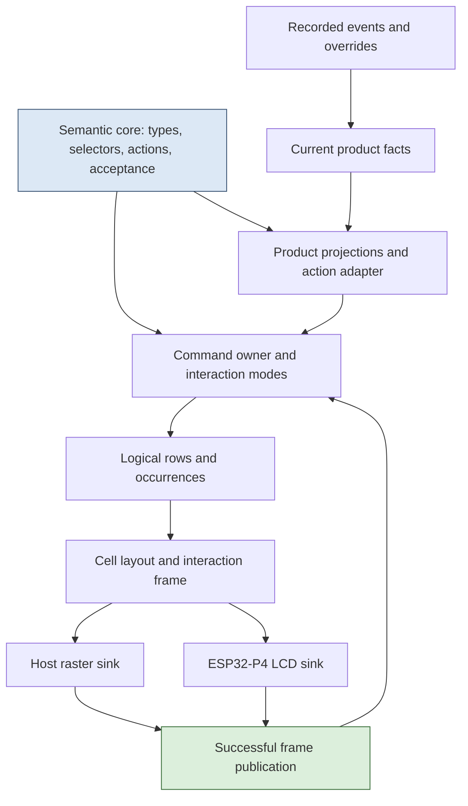
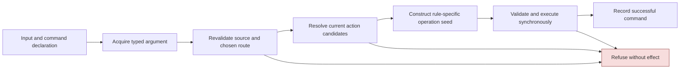
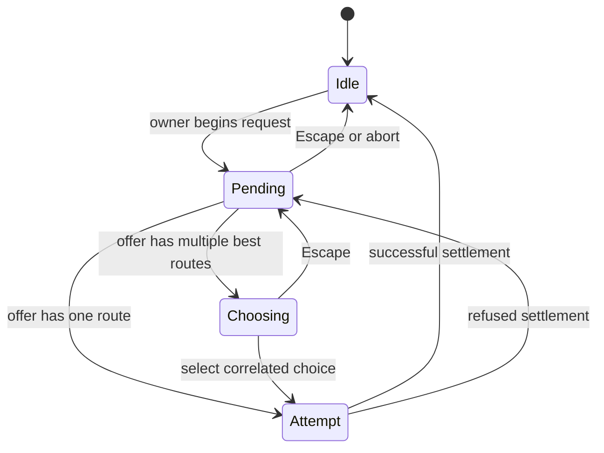
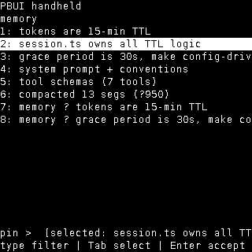
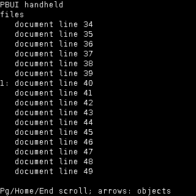
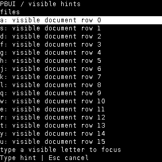
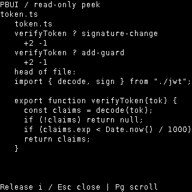
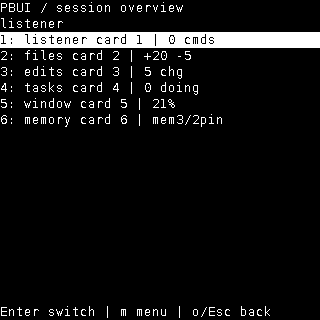
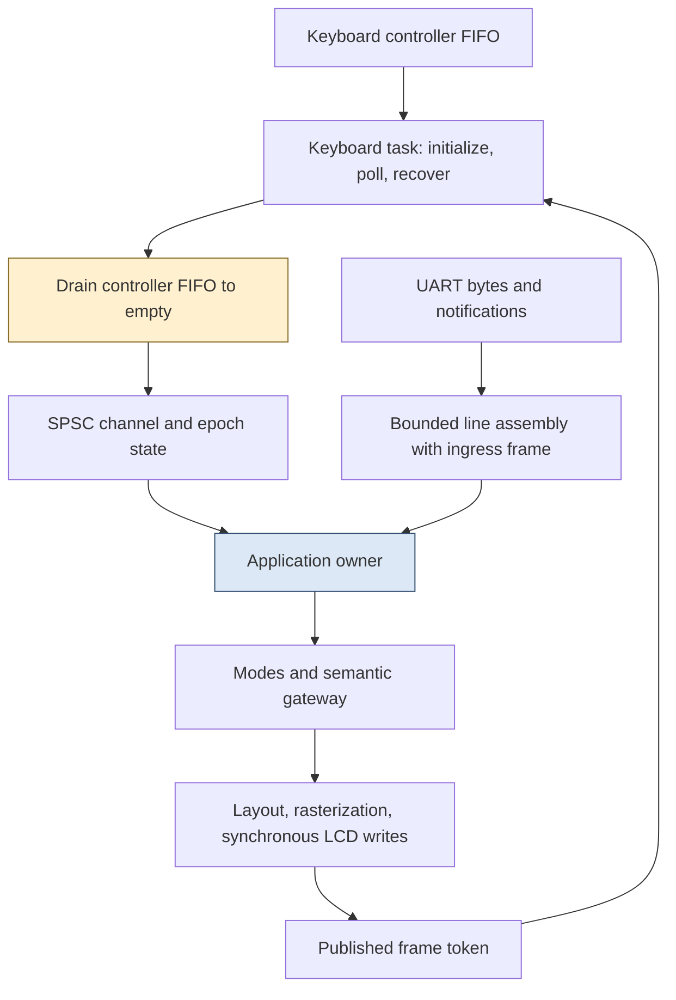

# PBUI on ESP32-P4: Typed Actions, Published Frames, and Recoverable Input

A keyboard-driven interface must preserve the meaning of an input while its data, selection, and display are changing. On a handheld, that requirement extends beyond the application state machine. A key can remain in the keyboard controller's FIFO during recovery. A console command can begin arriving before a repaint and finish afterward. A display update can succeed for several rows and fail before the new screen is complete. In each case, the implementation must decide whether it still has enough information to interpret the input correctly.

PBUI-HANDHELD-1 is a native C++20 implementation of a presentation-based interface for an ESP32-P4 PicoCalc system. Its central problem is not reproducing a React layout on an LCD. It is preserving typed object identity, action-selection rules, argument acquisition, and input freshness while replacing the browser runtime with bounded storage, FreeRTOS tasks, UART transport, and a synchronous display driver.

This report develops the system from its semantic contracts to its platform integration. The important distinctions are between an object and its rendered occurrences, between resolving an action and executing it, between an active caret and a remembered position, and between preparing a frame and publishing it for interaction. Those distinctions explain both the implementation and the remaining work.

> [!summary]
> - The semantic core separates selection, acceptance, binding, and execution. A displayed action is not a cached executable callback.
> - A published interaction frame contains both rendered cells and positional bindings. Failed painting makes positive semantic input unavailable until a valid frame is published.
> - One owner mutates application state. Keyboard recovery runs separately and communicates through copied messages and explicit loss/restoration epochs.
> - The implementation has 41 passing host checks in sanitized Debug and Release and a successful pinned ESP-IDF 5.4.2 P4 build. It is **not** feature-complete, tutorial-complete, independently reuse-validated, or physically qualified.

## 1. Project status and the meaning of this snapshot

The code snapshot is firmware commit `1b75e54`. It includes the latest per-app summary implementation as well as the native semantic engines, command acquisition, logical views, rasterization, recovery protocol, and the principal browse/transient interactions. During report preparation, all 41 CTest entries were rerun successfully in both Debug and Release. The target resource inventory's source hashes and ELF/binary hashes were checked against the current files.

The project is still in progress. Timeline scrubbing/playback controls, complete default provenance, full-text access, and portions of the shared affordance system remain unfinished. The six end-to-end manual tutorials have not been completed as native acceptance replays. A genuinely independent second product has not yet demonstrated reuse. Startup/SDK allocation behavior, complete resource bounds, queue-pressure behavior, and full input-to-visible timing still need further analysis or testing.

These are software obligations. They must not be classified as hardware-blocked merely because the device is disconnected. Physical flashing, real keyboard/controller recovery, display qualification, and measured device memory/stack/timing behavior are separately unverified.

There is also a documentation timing distinction. Committed ticket evidence is current through the overview interaction checkpoint, Step 46. The latest vital-sign code and its 41-check validation exist, but the Step 47 diary/evidence publication had not been finalized when this report was requested. The report retains the relevant current evidence in its own assets rather than treating older 39-check ticket files as proof of the newer result.

The firmware work resides at:

```text
/home/manuel/workspaces/2025-12-21/echo-base-documentation/esp32-s3-m5
```

The active ticket is:

```text
ttmp/2026/09/04/PBUI-HANDHELD-1--conceptual-port-of-pbui-to-an-embedded-esp32-p4-handheld-core-engines-and-keyboard-navigation
```

Within that ticket, design document 03 is authoritative: `03-pbui-on-picocalc-from-first-principles-semantic-kernel-keyboard-protocol-and-lcd-architecture.md`. Earlier QuickJS and native proposals are historical material, not additional implementation specifications to combine indiscriminately.

## 2. What is being ported

A presentation-based interface associates a rendered occurrence with a typed object reference and an action context. The user can act on an object directly, ask which actions apply to it, or start a command and provide an object as its argument. The same object may appear in several views without becoming several independent domain objects.

The source handheld prototype presents a recorded coding session through six applications: Listener, Files, Edits, Tasks, Window, and Memory. A file can contain hunk presentations; a hunk inspector can contain a step presentation; memory and context segments support pinning-related actions. The interface is therefore a useful test of typed interaction: the current subject may be an object of one type while the command's argument or receiver has another role.

The port retains this semantic structure but not the browser execution environment. The core uses bounded C++20 data structures, explicit identifiers, model validation, and synchronous product operations. React components, JavaScript closures, and a general workbench tree are not required by the native runtime. The selected profile uses a flat deck of independently identified cards.

That profile has real limits. Acceptance supports direct subtype acceptance and declared single-relation translation; it is not a general conversion-path search. Capacities are explicit. Unsupported or malformed declarations must refuse rather than silently produce a reduced executable result. These are implementation contracts, not incidental consequences of running out of memory.

The main code boundaries are small enough to describe directly:

| Boundary | Code location | Responsibility |
|---|---|---|
| Semantic core | `components/pbui_core/include/pbui/` | Typed identities, graph/selector logic, conditions, action resolution, acceptance, compiled models, command schemas and acquisition transitions. |
| Logical display | `components/pbui_rows/include/pbui/` | Rows, occurrences, cell layout, frame publication, bitmap font and RGB565 rasterization. |
| Interaction owner | `components/pbui_handheld/include/pbui/` | Session/deck state, command ownership, modes, input gates, console framing and keyboard-channel primitives. |
| Product | `components/pbui_demo/include/pbui/` | Recorded-session facts, overrides, six projections, product actions, labels and app summaries. |
| Platform | `0104-esp32-p4-pbui-handheld/main/` and `platform/` | UART service, keyboard task/recovery adapter, LCD sink, allocation placement and telemetry. |



This decomposition is a design intent supported by the current code structure. It is not yet a substitute for the missing independent-product integration test. Generic templates that have only been exercised with one product can still contain unrecognized interface assumptions.

## 3. Identity precedes rendering

An object reference identifies a domain object. An occurrence identifies one rendering of that reference in a particular view. Confusing these identities produces errors even when every pointer remains valid.

Consider a file shown near the beginning of a document and again beside a later edit. Both rows may contain the same `Reference`. Moving the caret between them is still a meaningful operation: they occupy different positions, have different surrounding text, and require different viewport restoration. A caret stored only as a file reference cannot distinguish the two positions.

The implemented structures make the distinction explicit:

```cpp
struct Reference {
    TypeId type;
    ObjectKey key;       // slot and generation
};

struct OccurrenceKey {
    ViewId view;
    std::uint32_t row;
};

struct Occurrence {
    OccurrenceKey key;
    Reference reference;
    ContextAnchor context;
};
```

The complete equality of an occurrence includes its key, reference, and context. Layout rejects duplicate occurrence keys within a logical document, but permits distinct occurrence keys referring to the same object. That is the condition needed for consistent focus without forbidding repeated presentations.

Identifiers also separate concepts that may happen to share small integer values. A `CommandId` is not an `ActionId`, a `RuleId` is not a `ChoiceId`, and a `FrameId` is not a `ViewId`. Most of these are distinct C++ types backed by 32-bit values. History uses a separate 64-bit sequence. Generation allocation refuses exhaustion rather than wrapping into a previously meaningful identity.

The distinction between durable identity and current ordering matters for cards as well. The deck's internal selection index is maintained as cards move or close, but references and saved view state use stable card/view identities. A card that moves to a different list position does not inherit the previous occupant's inspector or caret.

## 4. Action selection is ordered resolution, not first-match dispatch

A subject can match several action rules. The correct result cannot be obtained by taking the first matching declaration, nor by finding the first currently available rule.

For each logical action, the native resolver compares candidates in this order:

1. Shortest type-graph distance wins.
2. At equal distance, the nearer active scope wins.
3. At equal type and scope rank, higher priority wins.
4. Equal best ranks remain a tie.

The comparator tests priority directly rather than negating it or subtracting two priorities. That avoids overflow at values such as `INT_MIN`. More importantly, it keeps the intended ordering visible in the code.

```text
compare(a, b):                         # explanatory pseudocode
    if a.type_distance != b.type_distance:
        prefer smaller distance
    if a.scope_position != b.scope_position:
        prefer nearer scope
    if a.priority != b.priority:
        prefer larger priority
    return equal rank
```

Type distance is not merely a yes/no subtype relationship. Suppose an image type reaches object through file. Adding a direct image-to-object edge leaves reachability unchanged but shortens one path. A rule on object can consequently tie a rule on file where it previously lost. A graph compiler or optimizer cannot assume that preserving reachability preserves action ordering.

### 4.1 Availability is not Boolean

The core represents four statuses:

| Status | Participates in action competition? | Consequence |
|---|---|---|
| Available | Yes | A unique winner can be bound. |
| Unavailable | Yes | A winning rule prevents execution; its reason can be presented. |
| Hidden | Yes | A winning rule suppresses disclosure rather than permitting a fallback. |
| Inapplicable | No | The rule withdraws from this resolution. |

Suppose a file-specific open rule has distance zero and is unavailable, while an inherited inspectable open rule has distance one and is available. Filtering unavailable rules before ranking would execute the inherited rule. The implemented resolver does not do that: the more specific unavailable rule remains the winner and blocks execution. Hidden has the same competitive effect but a different disclosure result. Inapplicable is the status that permits another candidate to win.

This distinction is visible in `resolve_actions`: the resolver evaluates the rule's availability after structural matching and removes only Inapplicable candidates from competition. It records equal best ranks rather than selecting by declaration order. `bind_selected` refuses ambiguous, shadowed, hidden, or unavailable candidates.

### 4.2 Condition order is observable

An `all` condition evaluates its children in order and returns the first error or non-Available result. If one child reports Unavailable and another reports Hidden, changing their order can change the returned result and reason. Boolean equivalence is therefore insufficient to justify reordering conditions.

The same principle explains the separation between structural matching and action availability. A selector evaluates type and scope before its condition. Action resolution uses the structural match but preserves availability as a candidate property, because dropping a Hidden or Unavailable action would change which action wins.

## 5. Acceptance answers a different question

Action selection asks which rule defines an operation on a subject. Acceptance asks whether an offered source can satisfy a command's argument slot, either directly or through an allowed relation. The two operations use shared type and scope machinery but have different result structures and ordering rules.

Direct acceptance preserves the reference. If a file reference is already acceptable where an inspectable reference is wanted, no translation needs to run. Relation-based acceptance can produce another reference, so both the route and its result must be retained.

The native algorithm is deliberately bounded:

```text
accept(source, wanted_types, filter):
    validate source liveness and type declarations

    if source type reaches a wanted type:
        return [direct(source)] if filter(source) else []

    candidates = []
    for each declared acceptance relation:
        check its source selector and condition
        execute its translation
        validate result liveness and declared codomain
        check wanted type and argument filter
        retain relation identity with result identity

    keep the best scope/priority candidates
    preserve equal-best routes
```

Two details prevent subtle reinterpretation. First, direct filtering is terminal: if the source already has an acceptable type but fails the slot's filter, the algorithm returns no options. It does not then try translations to obtain a different object that passes. Second, two routes producing the same reference remain two route choices. Equal output identity does not erase the difference between how the result was obtained.

A chooser therefore stores a relation/result pair, not just a translated object. At selection time, the owner accepts the original source again and verifies that the chosen pair is still present. An earlier translation result is not sufficient evidence that the same choice remains valid.

## 6. Commands separate the receiver from the argument

A command's name, action, receiver, and argument slot serve different purposes. For a slot-received command such as pin, the accepted memory or context reference can become the action subject. For `newtile`, the session receives the command while the slot supplies an app reference. Adding app objects to a candidate list does not itself establish a session receiver.

The command schema records this distinction. The owner obtains the receiver through the product adapter, constructs the appropriate action query, resolves it, and passes a ticket plus arguments to the synchronous execution gateway. The gateway checks the current command declaration, ticket identity, receiver, arguments, context, and fresh action result before changing state.

That produces a staged execution path:



The diagram describes responsibilities, not a promise that a previously constructed callback can safely be invoked after waiting. `ActionTicket` retains the rule, action, subject, anchor, invocation, and model epoch. Fresh evaluation compares those fields with the current query, checks liveness, resolves again, and binds only the retained rule if it is still the unique available winner.

The product implements the operation's domain meaning. For this demo that includes reverting an edit annotation, pinning memory, evicting a context segment, cycling task status, seeking a step, manipulating tray references, and creating or closing cards. The generic shell does not contain a switch on these product object types to decide their backend meaning.

## 7. Acquisition is a correlated state machine

A command that needs an object cannot be represented adequately by a Boolean `accepting` flag. It needs a request identity, a return point, a possible route chooser, and an attempt identity for settlement.

The native acquisition machine has four alternatives:



The low-level transition type and the higher-level owner have separate responsibilities. The owner supplies backpressure: a pending command or undrained terminal prevents another ordinary invocation from being treated as free to proceed. The transition machine correlates request, choice-frame, choice, and attempt identifiers. An old choice cannot settle a later request simply because its list index is still valid.

The attempt state is not an asynchronous product callback. It asks the owner to revalidate the original source and route and make a synchronous gateway decision. Only the owner settles the result. This permits the state machine to be tested without allocating promises or passing arbitrary executable closures through the keyboard transport.

Escape is a transition, not a global reset. From a route chooser it returns to the same pending request. From pending acquisition it cancels and restores the saved return point. From a menu it returns to its origin. From an inspector it removes one inspector level.



*Historical screenshot at `b23bcef`: the highlighted row is an explicit argument selection. The image also exposes the limited display width and fallback glyphs. It demonstrates an acquisition state, not completed full-text access. Its original provenance is retained in the report evidence asset.*

### 7.1 Defaulting is not the same as selecting the first row

The shell distinguishes text filtering, explicit candidate selection, and nomination of a default. A filtered list can change without authorizing Enter to choose its first member. `it` comes from captured active focus, not from an off-screen restoration hint. Current-card and session context are separate sources of implicit receivers or arguments.

Several default policies and precedence chains are implemented and tested, but the complete provenance tuple and all live invalidation behavior remain outstanding. A correct report must preserve that distinction: existing default tests demonstrate concrete cases, not proof that every pending nomination survives every model/context change correctly.

## 8. The interaction frame defines positional input

The display pipeline starts with logical rows. A row owns bounded text and may contain an occurrence. Layout produces a 40-column by 20-row cell frame, with sixteen body rows between the title/subtitle and prompt/help lines. The same layout operation also creates the key-to-occurrence bindings.

Keeping those outputs together is essential. If the renderer numbered one list while the key handler independently enumerated another, scrolling, filtering, or duplicate references could make a visible key label select a different object. The `InteractionFrame` stores the cells, bindings, frame identity, and viewport as one value.

Ordinary layout can label up to nine visible objects with digits. Hint layout can label all sixteen visible object rows. The presence of a renderer binding is not proof that every shell mode consumes that key; the mode's input protocol still determines what the event means. That distinction remains relevant to the final complete-keyboard audit.

### 8.1 Publication follows successful painting

`FramePublisher` keeps a prepared frame separate from the published frame. It tracks which physical row contents are known to have been painted, skips unchanged valid rows, and publishes new positional bindings only after the synchronous sink has completed all required writes.

```text
paint(next_frame):
    reject a non-increasing frame identity
    mark interaction unavailable

    for each display row:
        skip if known valid and unchanged
        if synchronous row write fails:
            invalidate that physical-row knowledge
            return refusal
        remember the completed row contents

    publish next_frame cells and bindings together
    mark interaction available
```

The update is not an atomic electrical operation on the LCD. A partial display can be visible while row writes are in progress. The guarantee is narrower and testable: the application does not authorize positional input against the incomplete new frame. After failure, positive semantics remain unavailable until a valid frame is published.

The shell adds its own dirty-state check. A publisher may still internally remember an older completed frame while the current shell state needs repainting; the shell does not expose that as a current interactive frame. On the device, the keyboard task's published-frame token is set to zero during painting and restored only from the shell's current frame afterward.

### 8.2 Text encoding and width are separate limits

The bitmap font is a pinned 8×16 DejaVu Sans Mono raster. A 40×20 frame therefore occupies 320×320 pixels. The text-to-cell pass consumes a non-ASCII UTF-8 sequence safely as a fallback glyph rather than copying partial multibyte bytes into the cell grid.

This is a defined fallback, not Unicode completeness. Likewise, a row's 128-byte owned text capacity is not the number of characters visible on the screen: occurrence rows reserve three columns before their text. Horizontal access and the complete long-label/glyph audit remain unfinished. The report's screenshots must not be interpreted as proving that every logical row is fully readable.

## 9. Manual reading, hints, and search have different state

The viewport stores a top row, an optional active occurrence, a manual-reading flag, and an optional restoration hint. Manual paging can move the active occurrence outside the visible area. At that point, the active focus is cleared, and the prior occurrence can be retained only as a restoration hint.

This prevents an invisible object from remaining the target of Enter or `it`. Scrolling the old object back into view does not itself reactivate it. The tested arrow behavior restores an appropriate occurrence before continuing ordinary object navigation. Explicit search, hint selection, and type cycling use a shared focus-installation transition that leaves manual mode and clears the restoration hint.



*Commit `1057991`: a card returns to logical rows 34–49 after cycling through another card. The body contains a visible object label but no active highlight. The test also checks the preserved inspector identity on the other card. Matching pixels alone would not establish those identity assertions.*

### 9.1 Hints freeze a visible logical projection

The hint session captures all visible logical rows, not just the nine ordinary digit bindings. With at most sixteen visible targets, a one-character label is sufficient. The native layout and chooser share the prototype's home-row alphabet, whose first sixteen characters end at `u`.

The session compares its captured view, document size, viewport, visible text, colors, and occurrences against a fresh projection before painting or choosing. A change cancels the map; it does not silently relabel the new objects. This is an exact bounded comparison, not a hash used as semantic identity. Off-screen content that leaves this visible projection and its document size unchanged does not change the mapping.



*Commit `7adb00f`: a synthetic dense document exercises all sixteen visible hint labels. The real shell renders and validates it. This is a geometry/identity fixture, not the independently implemented second product still required by the project.*

A held opening `f` cannot repeat into its own hint selection. Choosing a letter moves focus and does not execute a product action. This matters for letters such as `r`, which have a different meaning in ordinary browsing.

### 9.2 Search and type cycling intentionally use fresh documents

Search takes a bounded printable query and matches current product labels in document order. It can find an off-screen occurrence, but it does not search arbitrary rendered prose or execute the match. An empty query chooses the first matching occurrence under the implemented policy; no match refuses without converting a remembered location into active focus.

Type cycling starts from a captured active occurrence and finds the next occurrence of the exact named presentation type, wrapping once. Missing origin starts at the first match. It does not perform subtype selection or relation conversion. A file type can participate in both systems without making their algorithms interchangeable.

The product supplies the type-key catalog. Validation checks suffix uniqueness, visible ASCII keys, nonzero type identities, bounded nonempty labels, and the sixteen-entry list limit. Complete gestures in Help and suffix-only labels in the active list are generated from the same metadata.

## 10. Held peek makes release ownership observable

Peek reuses the product inspector projection on an ephemeral surface without executing open or pushing a deck view. It removes every occurrence binding before publication and uses a private read-only viewport. The underlying browse state remains unchanged while the peek is paged.

The key event that opens peek records its input source. Only a release of `i` from that source closes the active peek. A console release cannot dismiss a physically held peek. If Escape has already closed peek and the user then opens a menu or acquisition, a delayed release must clear held state without dismissing that newer surface.



*Commit `933ea6a`: this is the actual product's file inspector, not the synthetic paging fixture. The native overlay exposes the bounded inspector through a full-body read-only surface rather than the prototype's eight-line slice. Existing fallback markers remain visible.*

Release cleanup runs after gate validity checking but before the early return for non-positive events and before current-frame validation. That ordering is deliberate. A display failure must not prevent the release that closes the held overlay. Invalid event/source data is still rejected; relaxing frame freshness for cleanup is not permission to relax it for positive operations.

The console protocol makes this behavior easy to test. `/key i pressed` opens a held state and `/key i released` closes it. An ordinary `/key i` stroke performs both transitions before painting, so it does not demonstrate a visibly held overlay.

## 11. Overview and card actions share the semantic path

The flat deck supports direct Left/Right and bracket cycling, with wrap and browse-scoped repeat. Selection changes without clearing each card's inspector stack or manual viewport. This is an explicit native correction to the prototype's stack-clearing switch behavior.

The overview projects cards as typed references with CardId-based occurrence keys. Arrows or visible digits focus a row. Enter invokes the card's declared primary switch action, and menus use the ordinary fresh action gateway. Closing the last card is therefore subject to the same policy as closing it through another command path.

Returning from a menu requires more information than a Boolean “was in overview.” The menu owns an optional sum of return surfaces, currently tray or overview. Editing and acquisition can own an overview return target. Cancellation restores it only while the original root view remains current. Switch, newtile, or closing the originating card instead returns to the resulting browse view.

Immediate commands need a separate completion check from pending acquisition. A no-slot command such as clear may finish without producing an acquisition terminal. The implementation handles that case explicitly; otherwise the operation could succeed while losing the overview selection.

### 11.1 Current summaries are derived, not cached

Overview rows and card inspectors now share the same product formatter. Files sums non-reverted additions/removals; Edits counts changes including reverted annotations; Tasks counts doing tasks; Window rounds the current token-budget fraction; Memory counts live and live-pinned entries. Listener uses the total native successful-command sequence, not the number of entries left in bounded history.



*Commit `1b75e54`: all six actual-product summaries fit in the displayed fixture. The formatter is checked against the original JavaScript `vitals` function for 180 baseline timeline/app combinations. Explicit ASCII normalization changes the Unicode minus and memory glyph notation. This image was copied from the latest validated output before its numbered ticket archive was finalized.*

The formatter test verifies the archived source hash, extracts the actual function, and evaluates it over existing source-derived fold states. It is not a second hand-written JavaScript version of the C++ formulas. Native checks complement those comparisons with mutation, retention, and numeric-boundary cases.

## 12. Product state is folded from events and annotations

The demo's domain owns a timeline cursor, an override set, and materialized facts. The recorded events establish the run; overrides represent user annotations such as reverted changes, memory pin/forget choices, context changes, and task status changes. A successful mutation constructs the next override state and folds it into next facts before installing the result.

This gives several views a consistent basis. Reverting an edit changes the aggregate churn and relevant projections without separately mutating independent Files, Edits, and inspector copies. A later seek can rederive earlier timeline facts while retaining the annotation set.

The distinction between domain capability and user-facing completion is important here. The domain already supports seeking, and step activation uses the product's declared action path. The full manual timeline controls and timed playback interaction are still unfinished. Passing fold differentials does not establish a completed time-machine tutorial.

The existing source/native differential checks cover 150 fold cases. They are useful evidence for the domain's materialization rules, but they do not cover every interaction that can expose those facts. A replay that changes state correctly can still present stale argument defaults, hide a necessary label, or restore the wrong occurrence.

## 13. One semantic owner, separate physical acquisition

The P4 application task owns the product, domain, session, shell, command operations, and painting. A separate keyboard task owns driver initialization, polling, and recovery. The keyboard task sends copied messages; it never mutates the domain or executes a product action.



The separation is necessary because driver recovery can block for seconds. Moving a blocking recovery call into the application owner would suspend painting and console service along with keyboard acquisition. Mock-driver tests verify that console progress continues while recovery is blocked; they do not prove real controller recovery timing.

### 13.1 A full queue must still communicate loss

The keyboard channel is a bounded single-producer/single-consumer ring, with a default capacity of 128 copied messages. A design that reports overflow by enqueueing an ordinary loss message fails precisely when the queue has no free space. The implementation instead maintains loss and restoration epochs outside the ring.

On loss, the producer advances the epoch. The consumer observes the new epoch, discards old buffered records under its ownership, acknowledges consumption of the epoch, and delivers loss. Restoration is separately announced. Publication checks the epoch relationship, so records from an old loss interval cannot simply become current after recovery.

The upstream controller FIFO must also be synchronized. Clearing only the software ring leaves old physical releases in the controller. `KeyboardPump` therefore drains the controller to an empty boundary before restoration is published. Software overflow requires that synchronization too.

Ring counters and semantic identities have different wrap rules. Storage counters can wrap under the bounded ring arithmetic. The epoch reaches a permanent fail-closed terminal value rather than reusing an old semantic interval. Treating those two kinds of counters identically would either complicate the ring unnecessarily or allow old meaning to recur.

### 13.2 Held state is source-local

The key gate tracks keyboard and console held/blocked state separately. A release from one source cannot rearm a key held by the other. Input loss can cancel the shared transient UI while only resetting the affected source's gate state.

Restoration means the transport has recovered; it does not mean keys have been released. Tests exposed this distinction directly: a post-loss press was correctly suppressed when the test had not supplied a new source-matched release. The fix was to correct the test sequence, not weaken the gate.

## 14. UART framing preserves when input began

The console parser accepts named requests such as `/text`, `/key`, `/input-lost`, `/state`, `/mem`, and `/timing`. The line framer has a bounded capacity and a discard/resynchronization policy for oversized or damaged input. It does not execute a truncated command prefix.

`ObservedConsoleLine` captures the frame identity when the first byte of a line is ingested. That is a software observation time, not the physical UART transmission time. Preserving it prevents a line that started against one frame from being assigned a newer frame identity merely because its final byte arrived after repainting.

A text batch is preflighted against the observed frame before any key reaches the gate. Its sequential characters can then advance through their own synchronous successful paints. This prevents an ignored first character from causing the remaining stale batch to be relabeled as fresh. It does not make the whole text batch an atomic transaction: earlier accepted characters are not rolled back if a later operation refuses.

UART notifications also have a per-turn budget. Draining an indefinitely replenished notification queue before doing anything else could starve keyboard/UI work even though every individual call is nonblocking. The implementation examines at most sixteen notifications per turn and distinguishes budget exhaustion from detected loss. The owner also services at most one keyboard message and one nonblocking UART byte in an ordinary loop turn.

The acknowledgement distinguishes parse/execution status from successful Boolean false. In the native `Result<T>` API, `value()` returns a pointer. For `Result<bool>`, a non-null pointer to false is not an error. Several legitimate no-ops and incomplete-but-valid transitions rely on that distinction.

## 15. Target integration: what the build proves

The firmware uses ESP-IDF **5.4.2**, UART0 through the CH343 path on GPIO37/38, and the existing synchronous PicoCalc LCD driver. No device was flashed during this work. The application state and its RGB565 row buffer are placed in aligned PSRAM storage. Keyboard runtime/control/stack storage is allocated from internal-capable memory, with a dedicated 6 KiB task stack.

The application raster buffer holds one sixteen-pixel-high row group:

$$
320 \times 16 \times 2 = 10{,}240\text{ bytes}.
$$

A complete 320×320 RGB565 image contains 204,800 pixel-data bytes. At a nominal 40 MHz single-bit SPI transfer rate, pixel payload alone would require approximately 40.96 ms. That calculation excludes commands, copies, rasterization, scheduling, and driver overhead. It is a lower-bound calculation for that transfer assumption, not measured frame latency.

The driver currently uses synchronous staging/copying. This implementation does not claim an asynchronous overlap optimization from another display project. Reusing a driver does not make every experimental driver configuration part of the validated application.

### 15.1 Current offline sizes

The retained inventory for `1b75e54` reports:

| Item | Bytes | Interpretation |
|---|---:|---|
| Firmware binary | 462,176 | Built image size, not device RAM consumption. |
| Application | 77,504 | Target layout of the application object placed in PSRAM. |
| Shell | 37,652 | Component layout within the application, not an additional allocation to add again. |
| Domain | 14,440 | Owned domain layout. |
| Facts | 12,600 | Facts type layout; nested ownership means sizes must not be blindly summed. |
| Presentation | 7,416 | Product/model adapter layout. |
| KeyboardRuntime | 10,648 | Internal runtime/control/stack layout. |
| KeyboardChannel | 4,128 | Channel type layout within that runtime. |

The compiler's stack-usage output includes 41,504 bytes for `Domain::create`, 29,568 for `app_main`, and 25,920 for `fold` in this build. These are per-function figures. Summing selected entries does not establish a maximum live call chain, and ignoring SDK/library callees does not establish stack safety. The configured large main-task stack is preparation for the current implementation, not physical high-water evidence.

### 15.2 The effective language profile must be inspected

An early target build included a later `-std=gnu++2b` flag after an intended C++20 setting. A CMake declaration of the desired standard was therefore insufficient evidence of the effective compiler mode. The build now places a final `-std=c++20` option and the inspection tool checks the actual compile command.

The profile also disables exceptions and RTTI and enables warnings-as-errors and stack-usage output. Cross-compilation found format/type assumptions that host compilation did not, including `%u` versus target `uint32_t` and mismatched arguments to `std::max`. Fixing those with width-correct formatting and explicit types is stronger than suppressing the warnings.

## 16. Telemetry needs a precise interpretation

Heap telemetry reports capability-specific registered totals, free bytes, largest free blocks, and the SDK's sum of region-level low-water values. That last field is not the simultaneous minimum of total free memory across all regions. The samples are also not one atomic global snapshot. The console names the basis explicitly so downstream analysis does not infer a quantity that was never measured.

Timing uses bounded distributions. The recorded percentile values are histogram bucket upper bounds, not exact sorted percentiles. Paint-attempt timing includes no-op and failed attempts as well as layout, rasterization, and synchronous blits that actually run. Keyboard residence ends before key handling and starts at software acquisition, so it is neither physical key latency nor complete input-to-visible latency.

These definitions are part of the instrumentation contract. An accurately formatted number is still misleading if it is labeled as a different interval. Polling intervals, queue pressure, sampling/logging overhead, and complete input-to-visible timing remain further work.

## 17. Verification is a set of scoped claims

The current result is 41 passing CTest entries in both sanitized Debug and Release. Those entries include suites and integration checks containing many cases; they are not 41 complete product scenarios. Conversely, a large generated-case count does not imply that an end-to-end tutorial has run.

| Evidence | What it supports | What it does not establish |
|---|---|---|
| Native graph/action/acceptance tests | Ordering, filtering, ambiguity, identity and refusal behavior for tested contracts. | Universal equivalence with every feature of the browser kernel. |
| 150 source/native fold cases | Current materialized demo facts against source-derived states. | Completed timeline controls or playback. |
| 83,652 type-cycle oracle cases | Exact-type navigation over generated short documents, including missing origins and wrap. | Human navigation speed or complete tutorial coverage. |
| 180 actual-source vital comparisons | Six formatter results over all baseline cursor states, with explicit normalization. | Every override combination or JS/native large-counter equivalence. |
| 1,980 scoped allocation attempts | No intercepted allocation calls in the audited real shell/raster workload, with positive hook controls. | No startup, SDK, shared-library, or whole-device allocation. |
| Keyboard channel/pump stress and earlier TSAN evidence | Tested producer/consumer ordering and recovery schedules. | Physical FIFO behavior or measured hardware recovery. |
| Reviewed PNG/PPM artifacts | Host-rendered geometry, labels, and documented states. | Physical LCD readability or full text/glyph accessibility. |
| Pinned target build and inventory | Compilation, linking, layouts and effective flag evidence. | Flash success, stack sufficiency, electrical correctness, or runtime latency. |

The allocation test deserves particular care. It uses executable-object wrappers and replacement C++ allocation operators, verifies that its hooks detect positive controls, and then runs a scoped workload across the six apps. The latest workload reports 1,980 attempts, 1,716 true results, and 186 refusals with zero scoped calls. It excludes startup factories and allocator behavior hidden inside shared libraries or the SDK. The six initial app variants are not the six manual tutorial replays.

Failure evidence is useful because it reveals which assumptions were actually challenged. The project encountered compiler-mode override, target ABI formatting, private-constructor test misuse, missing post-loss release, and wrong hint-alphabet indexing. Some failures required implementation changes; others demonstrated that an invariant was correct and the test setup was wrong. Recording that distinction prevents a future maintainer from weakening a contract to reproduce an invalid test assumption.

## 18. How to reproduce and extend the analysis

The primary host validation command, from the firmware repository, is:

```bash
0104-esp32-p4-pbui-handheld/host/validate.sh
```

It creates the current Debug and Release host builds under `/tmp/pbui-native-validation` unless configured otherwise. Individual checks can be rerun without touching hardware:

```bash
ctest --test-dir /tmp/pbui-native-validation/Debug --output-on-failure
ctest --test-dir /tmp/pbui-native-validation/Release --output-on-failure
ctest --test-dir /tmp/pbui-native-validation/Release -R '^vitals_source$' -V
```

For target compilation and offline inspection:

```bash
source /home/manuel/esp/esp-idf-5.4.2/export.sh
cd 0104-esp32-p4-pbui-handheld
idf.py reconfigure build
python tools/inspect_build.py --build build --output /tmp/pbui-resources.json
```

These commands deliberately stop before flashing. Hardware verification will need an identified device, exclusive monitor/flasher ownership, an executable recovery test sequence, and captured physical measurements. It should not be inferred from the availability of a build command.

A useful next development sequence is to finish the remaining semantic/protocol gaps, then execute the six tutorials as assertions over actual owner interactions. Tutorial failures should drive concrete fixes rather than be rewritten into weaker demonstrations. In parallel, the independent product should instantiate the semantic and interaction layers without inheriting the demo's implementation. Resource/failure audits should then cover startup, SDK interactions, call chains, queue pressure, and complete timing intervals. Only after that can the remaining list be reduced honestly to work requiring the disconnected device.

### Source reading map

All paths below are relative to the firmware repository named in the frontmatter. They refer to code at `1b75e54` unless an historical screenshot caption says otherwise.

| Start here | Read for |
|---|---|
| `components/pbui_core/include/pbui/contracts.hpp` | Strong identifier domains, reference generations, bounded results/storage. |
| `components/pbui_core/include/pbui/selection.hpp` and `actions.hpp` | Ordered conditions, ranking, four statuses and fresh binding. |
| `components/pbui_core/include/pbui/acceptance.hpp` | Direct-filter terminal behavior, relation/result identities, best-route preservation. |
| `components/pbui_core/include/pbui/acquisition.hpp` | Correlated request/choice/attempt transitions. |
| `components/pbui_handheld/include/pbui/command_owner.hpp` | Admission, revalidation, dispatch and terminal backpressure. |
| `components/pbui_rows/include/pbui/rows.hpp` | Occurrence layout, UTF-8 fallback, dirty-row painting and frame publication. |
| `components/pbui_handheld/include/pbui/shell.hpp` | Mode-specific input, explicit focus, menu/command origins, peek release ordering. |
| `components/pbui_handheld/include/pbui/keyboard_channel.hpp` | SPSC storage and out-of-band epoch protocol. |
| `0104-esp32-p4-pbui-handheld/platform/keyboard_pump.hpp` | Recovery and controller FIFO synchronization. |
| `components/pbui_handheld/include/pbui/console_line.hpp` and `transport.hpp` | Ingress-frame capture, bounded framing and text-batch preflight. |
| `components/pbui_demo/include/pbui/demo_domain.hpp`, `demo_presentation.hpp`, `demo_vitals.hpp` | Facts/overrides, product execution gateway, projections and current aggregates. |
| `0104-esp32-p4-pbui-handheld/main/app_main.cpp` | Real owner loop, UART fairness, frame token, allocation placement and metric boundaries. |
| `0104-esp32-p4-pbui-handheld/host/tests/` | Executable contracts, failure fixtures, allocation scope and source-backed checks. |

The colocated `_assets/pbui-handheld-report-evidence.json` records figure provenance and the host-check summary. `_assets/pbui-handheld-resource-inventory.json` retains the current source/build hashes and offline target inventory. Historical images remain historical; none has been relabeled as a render from the latest code.

### Related vault reports

- [[PROJECT REPORT - pbui Action-Selection Kernel and the Post-Legacy Unification]] explains the browser-side resolver work that precedes the native port.
- [[PROJECT REPORT - PBUI Interaction Policy - One Activation Ladder, a Request-Identified Accept Machine, Refusals with a Face, and Explaining the Menu]] provides the earlier request-identified interaction context.
- [[PROJECT REPORT - PBUI Workbench Core - A Headless Engine, a Pure Planner, and the Hard Cutover of the React Shell]] is relevant to the separation between reusable state logic and a concrete UI, not a claim that the complete workbench was ported here.
- [[ARTICLE - PicoCalc Keyboard Reset and I2C Recovery - ESP32-P4 Host Investigation]] covers the keyboard recovery background.
- [[ARTICLE - ESP32-P4 PicoCalc Display Optimization - Queued SPI and Dirty Rectangles]] describes related display work; this application currently uses its stated synchronous integration rather than claiming those optimizations.

## Conclusion

The native port's strongest result is the separation of responsibilities that makes refusal behavior explainable. An occurrence identifies a rendered position without changing object identity. Resolution identifies a current winning rule without executing it. Acquisition retains the source and route needed for fresh validation. A completed paint publishes the input mapping. A source-matched release performs cleanup without granting permission for a stale positive action.

Those contracts already support a substantial keyboard interface and a compiling P4 application. They also make the remaining obligations explicit. Full tutorials, independent reuse, accessibility of complete text, complete default provenance, platform resource analysis, and physical qualification are different claims requiring different evidence. The project is ready for that next verification work; it has not yet completed it.
