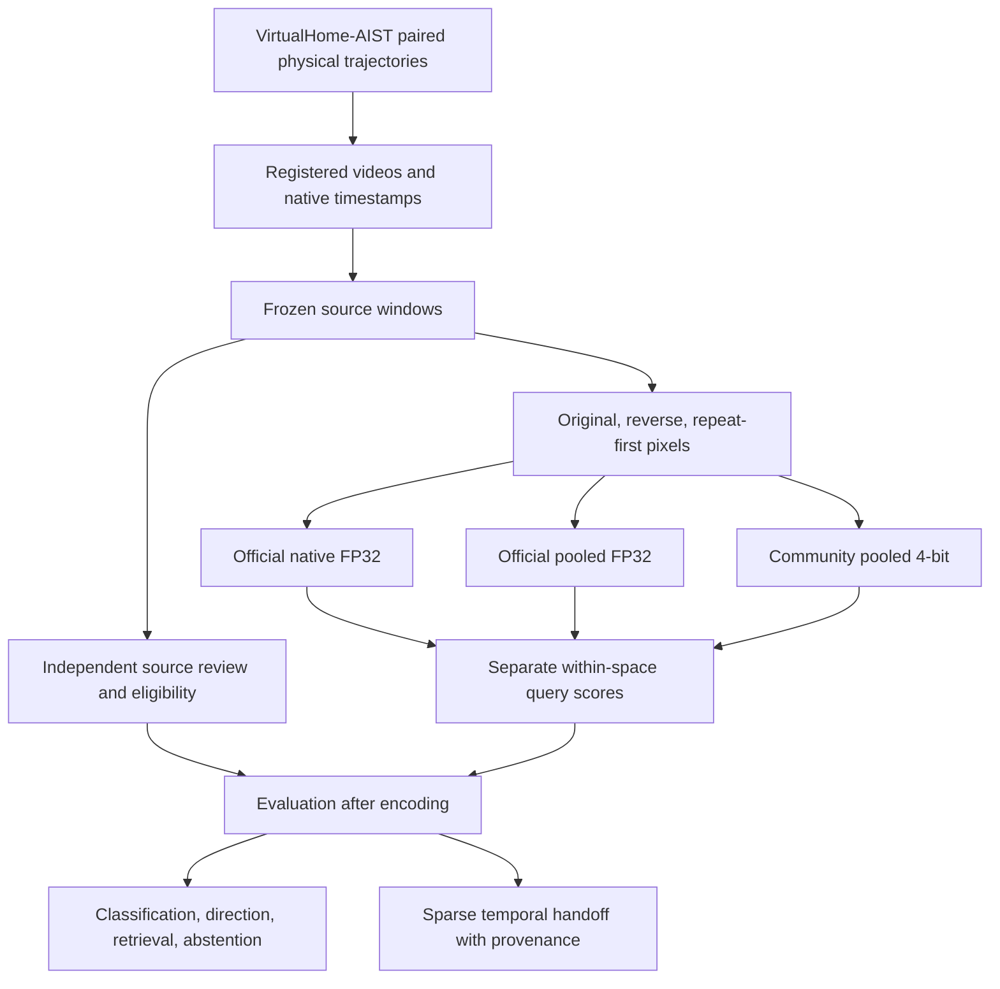
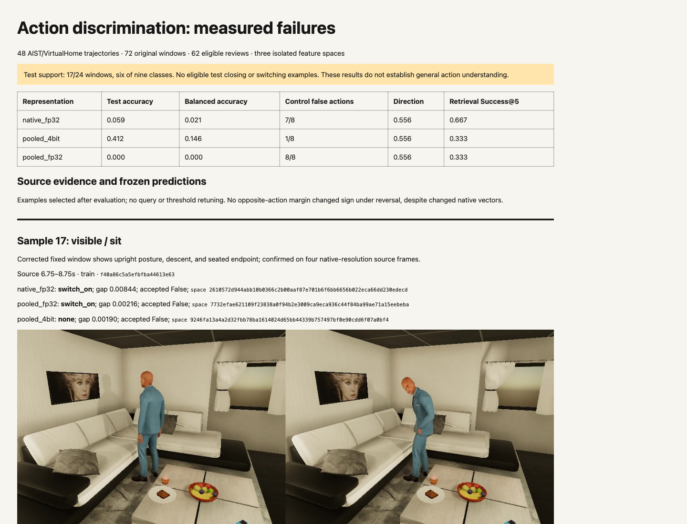

# Action Discrimination: Native Video, Pooled Embeddings, and Audited Failure Modes

The action benchmark now runs three real representations on the same reviewed source windows: accepted official FP32 native video, official FP32 image pooling, and the preserved community 4-bit pooled baseline. The principal finding is weak generic action discrimination. Native video achieves one correct prediction among seventeen eligible test windows. Its embeddings respond to changed pixels and frame order, but none of the reviewed opposite-action margins changes sign when time is reversed. This separates successful implementation from demonstrated action understanding.

The benchmark contains 48 rendered AIST/VirtualHome trajectories and 72 candidate windows. Source review accepts 62 windows and leaves ten ambiguous or unobservable. The held-out apartment has no confidently visible closing or switching examples under the frozen sampling protocol. Consequently, test accuracy and balanced accuracy describe six supported classes, not a complete nine-class evaluation. The source exclusions are part of the result.

## The system being evaluated

This article records the completed VIDEO-ACTIONS-001 experiment. Its implementation is a source-audited benchmark around frozen Qwen representations; it does not train a new action model. The project separates three questions: whether the runtime actually consumes video pixels, whether the representation changes with temporal order, and whether the resulting scores identify the action or its direction. Passing the first question is necessary for the others but supplies no answer to them.

The input unit is a two-second observation window, not a simulator instruction. A simulator program specifies an intended physical interaction. A decoded window supplies sampled visible evidence. A reviewed label states whether those samples establish a recognizable action. The separation is necessary because occlusion, small objects, and timing can make a correctly executed instruction visually uninformative.



Each branch has an independent feature-space identity covering its processing contract. A cosine is meaningful only between vectors produced in a compatible space. The benchmark therefore encodes the same query text independently for each representation rather than treating text vectors as interchangeable.

## Experimental construction

The final simulator release uses `configs/virtualhome-paired-actions-v4.json`. Three apartments supply four action families, two camera views, and interaction or approach-only conditions. Each interaction executes a physical inverse pair. A reversed pixel sequence is a model intervention and never becomes a newly rendered physical-action label. All views and derived windows retain their original lineage partition.

The installed simulator is the AIST fork of VirtualHome. Earlier StandUp requests stalled, and some scene/program combinations failed planning. The accepted posture program uses AIST Stand and omits intervening Watch instructions. Those failures and the successful configuration are documented in diary Step 3. The completed release contains 3,880 encoded frames and passed corpus validation. There are sixteen trajectories in each split.

Each benchmark input contains four frames sampled at two frames per second from a two-second source interval. Sampling uses presentation timestamps and selects the first frame at or after each grid point. Source video hashes, frame indices, raw and normalized timestamps, interval bounds, and availability accompany each sample. No requested verb or reviewed label enters the encoder prompt.

Initial midpoint selection failed on long Sit exports because their spans include positioning and waiting. All six trajectories visibly descend near the exported end. Version two therefore centers every Sit window 750 milliseconds before that end. This rule was established through source inspection before model scores were inspected. The original windows and dense timing sheets remain in `various/action-source-review-v1`; corrected windows and final labels are in `various/action-source-review-v2`.

## Reviewed labels and coverage

A single assistant review inspected all 72 source contact-sheet rows and twenty native-resolution detail sheets. This is an auditable annotation pass, not a measurement of inter-reviewer agreement. Visible and sufficiently informative partial examples are eligible. Ambiguous and unobservable examples retain null action labels, remain in coverage denominators, and remain distractors in retrieval galleries.

| Split | Candidate windows | Eligible | Unknown | Supported classes |
|---|---:|---:|---:|---:|
| Train | 24 | 22 | 2 | 9 |
| Development | 24 | 23 | 1 | 9 |
| Test | 24 | 17 | 7 | 6 |

The unknown set includes four lamp switching windows without a clear light-state change, two edge-on television windows, one monitor-obscured book transfer, and three microwave windows whose visible evidence does not establish the requested direction. These are observation limitations. Neither graph state nor a successful simulator response resolves them into visual truth.

## Representation and intervention controls

Official native and official image pooling load the accepted FP32 artifacts in the repaired MLX environment. Image pooling encodes each frame through the official image processor and model path, normalizes each vector, averages the four vectors, and normalizes the result. Native video processes the frame sequence with official video preprocessing and monotonic timestamp slots. The 4-bit baseline uses its existing isolated environment and community checkpoint. Each representation has a distinct feature-space identity and separately encoded copies of the same nine generic query texts.

Original, reversed, and repeat-first conditions use identical source membership. Reversal reverses pixels while preserving monotonic slot timestamps; repeat-first replaces all slots with the first sampled source image. Pooled permutations should agree within floating-point tolerance. Native vectors may differ under reordering, but vector sensitivity alone does not imply correct direction discrimination.

All three runs completed real inference and returned the same immutable run identity on a second invocation. The FP32 pooled run wrote 297 cached image/query vectors, native wrote 225 video/query vectors, and 4-bit pooling wrote 297. Measured encoding-loop times were approximately 45.5, 58.1, and 46.1 seconds respectively; these exclude model initialization and are single-run timings rather than a performance benchmark.

The native black-frame probe produced original-versus-black cosine 0.498 and maximum component difference 0.146. Reversing source order changed a native vector component by up to 0.0808; pooled differences stayed below 6e-8. Repeating the first image changed all three representations. Runtime manifests and numerical checks are preserved in `various/comparison-v2`.

## Scoring algorithms and the role of temporal interventions

Let `u(x)` denote division by the Euclidean norm of a nonzero vector. For image embeddings `h_1` through `h_4`, the pooled representation is `u(mean(u(h_i)))`. Cosine scoring reduces to a dot product when both the observation and query vectors have unit norm. Reordering the summands does not change their mathematical mean, so a large pooled reversal difference would indicate an implementation problem. Floating-point summation permits small numerical differences.

Native video uses an ordered video input rather than that commutative pooling operation. The reversal experiment keeps monotonically increasing timestamp slots and changes which source image occupies each slot. This isolates pixel order without introducing descending timestamps. Repeating the first image tests dependence on changes across the sampled sequence, but also changes the image content distribution. Neither intervention is a newly executed physical procedure.

```python
# Conceptual structure; the real implementation records all source identities.
for representation in isolated_representations:
    query_vectors = encode_queries(representation, frozen_action_texts)
    for window in source_windows:
        frames, slots = decode_verified_frames(window)
        variants = {
            'original': frames,
            'reverse': list(reversed(frames)),
            'repeat_first': [frames[0]] * len(frames),
        }
        for condition, pixels in variants.items():
            vector = representation.encode(pixels, timestamps=slots)
            scores = cosine_against_queries(vector, query_vectors)
            persist(window.identity, condition, representation.identity, scores)
# Reviewed action labels enter evaluation only after these scores exist.
```

For an action and its inverse, direction is measured by the difference between their query cosines. A positive margin favors the reviewed action; a sign change after pixel reversal would indicate a changed directional preference. A changed vector with an unchanged margin sign establishes numerical sensitivity but does not establish inverse-action recognition. This distinction is central to interpreting the native-video result.

## Classification, direction, and retrieval

Generic classification selects the largest within-space cosine among nine fixed action descriptions. The following table uses original eligible test windows. Supported-class macro F1 omits classes with no eligible test support; the raw results also include macro F1 across all nine declared classes and the complete confusion matrix.

| Representation | Accuracy | Balanced accuracy | Supported macro F1 | False action on controls |
|---|---:|---:|---:|---:|
| Native FP32 | 1/17 (0.059) | 0.021 | 0.037 | 7/8 |
| Pooled FP32 | 0/17 | 0.000 | 0.000 | 8/8 |
| Pooled 4-bit | 7/17 (0.412) | 0.146 | 0.101 | 1/8 |

The 4-bit system's accuracy is mainly attributable to recognizing approach-only controls. Its balanced accuracy remains low. Comparing native with this system changes both temporal processing and checkpoint quantization; it cannot isolate a benefit or penalty from native video alone. The official FP32 pooled control reduces that confound, but its image token structure still differs from native video.

Family-conditioned direction compares a reviewed action query only with its opposite. All three representations produce positive correct-direction margins for five of nine eligible test interactions. No opposite-action margin changes sign under reversal in any split. Native margin magnitudes and vectors do change. The warranted conclusion is sensitivity without demonstrated reversal-consistent direction understanding under these queries.

Retrieval uses each split's original windows as a gallery and reviewed action equality as relevance. Unknown examples remain distractors. Unsupported queries have undefined metrics and are excluded from query means. Interval coverage uses the union of relevant source intervals per video, preventing overlapping windows from counting the same source duration twice. Raw rankings preserve sample and episode identities; there are only three apartment groups, so these means do not support broad confidence claims.

| Representation | Test Success@5 | Test interval coverage@5 | Supported queries |
|---|---:|---:|---:|
| Native FP32 | 0.667 | 0.354 | 6 |
| Pooled FP32 | 0.333 | 0.208 | 6 |
| Pooled 4-bit | 0.333 | 0.333 | 6 |

Retrieval and classification answer different questions. A query can retrieve a relevant clip among five hits even when that clip's highest-scoring description is another action. The stronger native retrieval score therefore does not contradict its poor classification result.

## Abstention and failure evidence

Each representation selects a top-two cosine-gap threshold using development only: maximize answer coverage subject to at most twenty percent observed error on known labels and no answers on unknown labels. This policy is frozen before held-out evaluation. It is an empirical development constraint, not a guaranteed risk bound.

Native accepts five test windows: four known answers are wrong and one unknown example receives an answer. FP32 pooling accepts nine: seven known answers are wrong and two unknown examples receive answers. The 4-bit system accepts two: one correct known answer and one unknown answer. These results show poor transfer of a tiny development calibration set. No test-driven threshold revision was made.

The local evidence gallery at `various/comparison-v2/index.html` combines measurements, source intervals, label rationale, predictions, confidence gaps, and full feature-space identities. It includes corrected sitting, a small microwave, an occluded book transfer, invisible lamp state, and an approach-only control. Its examples were selected after evaluation for explanation and were not used to retune queries. Browser screenshots accompany the source images.

## Temporal handoff and remaining interpretation limits

`output/action-benchmark-v1/temporal-handoff-v2/manifest.json` references 144 sparse sequences: 48 episodes in each of three separate feature spaces. Each NPZ has features `[T,D]`, event and availability times, validity, reviewed-label mask, and integer targets. Original windows alone enter this handoff. Unknown labels do not invalidate their source evidence, and unrepresented intervals do not become background.

These sequences contain one or two benchmark windows per episode. They are useful for validating source mapping and observation ingestion, but are not a dense segmentation training corpus. VIDEO-TEMPORAL-001 must construct a denser trailing-window feature grid for meaningful temporal training and report its weak supervision separately. Event and availability equal source-window end here; actual deployment must additionally account for inference and ingestion latency.

The implementation is reproducible through `python -m video_workbench.actions` prepare, review, encode, and evaluate commands. Run native/FP32 image modes in `output/mlx-video-fix/.venv`; run the 4-bit baseline in `workbench/.venv`. `actions/handoff.py:export` builds the sparse sequence artifacts. `scripts/05-review-window-details.py` and `scripts/06-publish-comparison.py` reproduce the visual audit outputs. Never combine vectors from different spaces in one metric computation.

The subsequent localization diagnostic is covered in the companion report. Temporal modeling must retain explicit validity and availability; neither stage can assume that the present generic action predictions are reliable facts. Oracle fixtures can establish implementation correctness, while weak-feature and real-observation evaluations measure how much useful evidence the system actually has.

## Preserved browser views



[Full source-linked failure gallery screenshot](_assets/actions-v2-failure-gallery.png).

## Implementation reading map and experiment record

The source repository is `/Users/manuel/code/wesen/2026-09-06--vision`. The experiment's ticket root is `ttmp/2026/09/06/VIDEO-ACTIONS-001--balanced-action-discrimination-and-native-video-benchmark/`; references to `various/` and `scripts/` above are relative to that root. They are source-repository artifacts, not vault-relative paths.

| Source API | Responsibility and review concern |
|---|---|
| `actions/data.py:prepare(release, destination)` | Constructs frozen windows and preserves lineage partitions. |
| `actions/data.py:action_center(action, start_us, end_us)` | Applies the reviewed timing rule, including corrected Sit windows. |
| `actions/encoders.py:OfficialImagePool` | Shares accepted official artifacts with native video while assigning a distinct image-pooling identity. |
| `actions/encoders.py:intervention(frames, pts_us, mode)` | Changes source image placement while preserving ordered timestamp slots. |
| `actions/encode.py:run(dataset, destination, mode)` | Runs actual isolated representations and caches immutable outputs. |
| `actions/evaluate.py:run(dataset, labels_path, feature_roots, destination)` | Joins reviewed labels, performs within-space scoring, and records full populations. |
| `actions/handoff.py:export(dataset, labels_path, feature_roots, destination)` | Emits original-window sequences without combining feature spaces. |

These APIs live under `workbench/src/video_workbench/`. The preserved measured results are copied into this vault as [action comparison JSON](_assets/actions-v2-results.json). Source review decisions, immutable runtime manifests, and the original report remain in the ticket. The intern guide explains setup in greater detail and was delivered to reMarkable. This article preserves the measured result and its interpretation.

The experiment suggests improving observable action coverage and targeted supervision before assuming a larger temporal model will recover directional information. A subsequent model must be evaluated on the same source windows and supported classes, with unknown cases retained. The native repair's successful implementation parity remains valuable independently of this benchmark's poor semantic scores.

## Related reports

- [[ARTICLE - Native Video Embeddings in MLX - Repairing Pixel Forwarding and Establishing Reference Parity]]
- [[ARTICLE - VirtualHome Corpus Expansion - Scenario Diversity Provenance and Visual Labels]]
- [[ARTICLE - Timestamped Video Search - From Verified Pixels to Frozen Evaluation]]
- [[ARTICLE - Requested Object Localization - Oracle Crops, Evidence Coverage, and State Recognition]]
