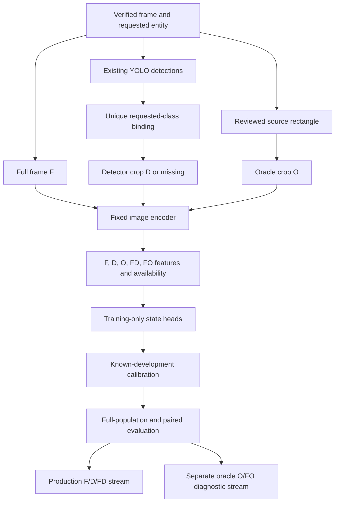
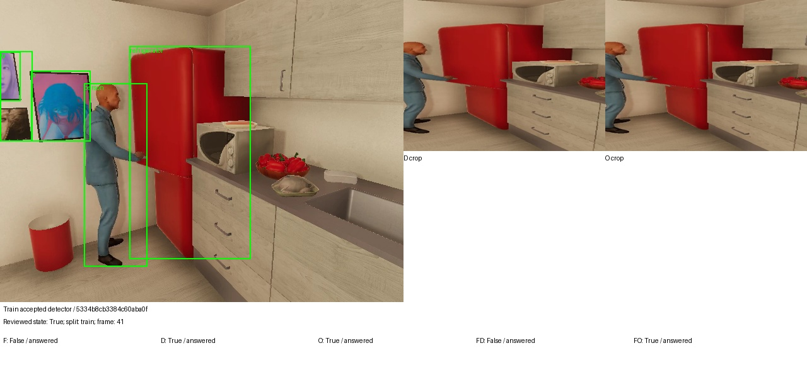
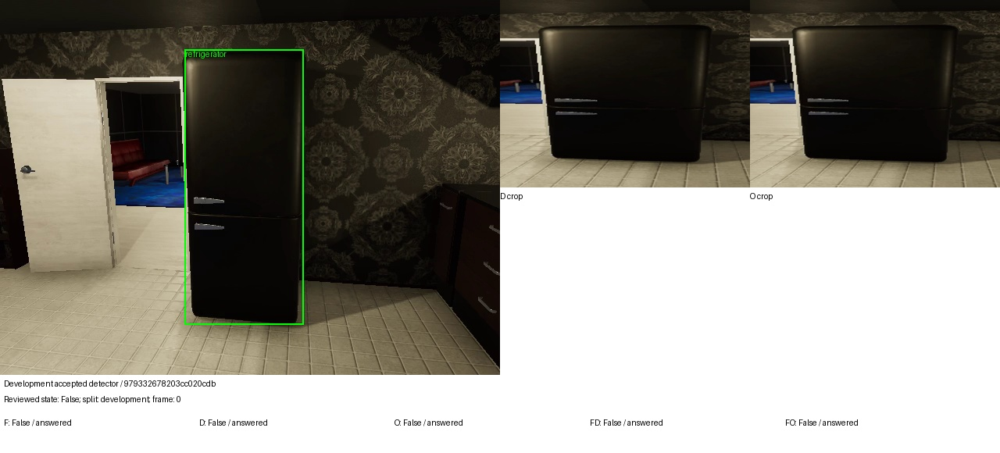
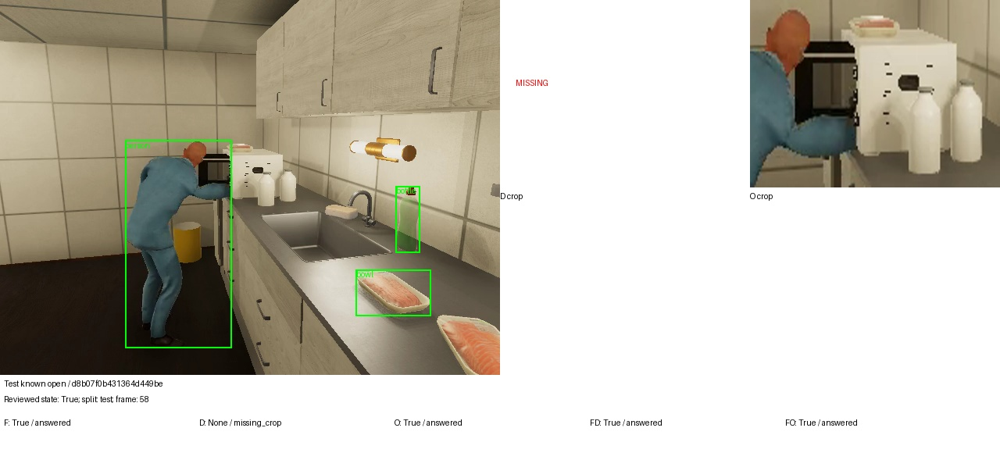
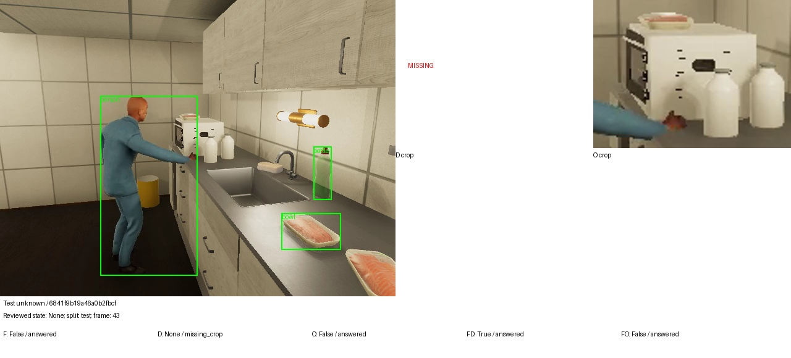
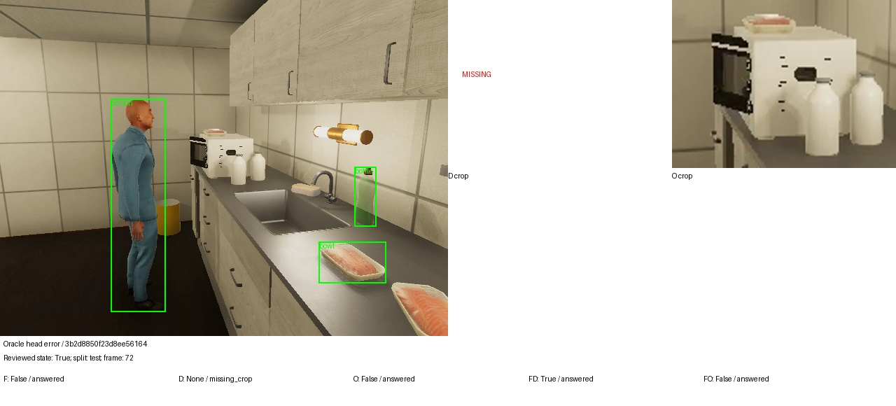

# Requested Object Localization: Oracle Crops, Evidence Coverage, and State Recognition

## Result and scope

Correctly reviewed object locations improve the learned state head on this small local diagnostic. The oracle-crop head identifies 16 of 17 known held-out states correctly, compared with 10 of 17 for the full-frame head. That improvement does not solve evidence availability or unknown-state recognition. The production detector provides no accepted crops for the 24 held-out state frames, and every evidence-bearing method answers all seven visually unknown held-out frames.

The experiment therefore supports two separate engineering priorities: improve requested-object localization, and implement an observability or abstention mechanism that is evaluated on unknown examples. A better state classifier alone cannot recover a missing crop. A better crop alone does not establish that an appliance door state is visible.

This report describes a completed local diagnostic using the installed AIST fork/build of VirtualHome, YOLO11n, and the existing community 4-bit Qwen image embedding model. It makes no claim about native-video acceptance for that checkpoint. Native and pooled action experiments belong to VIDEO-ACTIONS-001. The state test scenes have been inspected previously, so these results are exploratory rather than a fresh generalization estimate.

## Why localization and recognition require separate measurements

A requested-object system must identify which region belongs to the requested entity before it can infer a property from that region. Detection answers a class-and-location question. Binding selects the requested instance when several boxes share a class. State recognition answers a property question using the accepted evidence. Observability asks whether that evidence contains enough information to justify the property assertion. Each stage can fail independently.

An oracle crop in this experiment means a crop constructed from a manually reviewed location. It provides an experimental intervention on the localization stage. It does not supply the state label to the image encoder, establish the state as visible, or represent a deployable detector. Its purpose is to estimate whether better locations could improve recognition under the existing feature and head family.



The design deliberately retains failures before classification. Dropping frames without D would replace a system-level evaluation with performance on an easier selected population. The zero paired test denominator is therefore a measured outcome, not a missing result to fill with an estimate.

## Source population and annotation process

The inventory begins with 144 reviewed state samples and 24 requested-target references from the earlier perception pilot. Six pilot references point to existing state targets. Deduplication uses source video SHA256, exact frame index, and requested entity, leaving 162 unique localization units. Aliases preserve the original experiment IDs so state labels can be joined after inference without changing the population.

Each localization unit receives an independent localization review. The first pass views source images without detector predictions. The second pass overlays the manually supplied rectangle on the source. All 42 episode sheets were inspected, and three geometry errors were corrected: background above a refrigerator, an excluded outer refrigerator-door edge, and an excluded visible microwave-door portion. The prior draft, corrections, final annotations, and rendering hashes remain in `various/source-audit-v1/`.

The final review includes 86 visible unique objects, 72 partially visible unique objects, one unobservable book, and three ambiguous requested-instance cases. Thus 158 targets have rectangles. Four requested targets belong to unsupported detector categories: plates and table lamps. Two supported targets have no unique reviewable rectangle. The detector recall denominator is consequently 156, rather than 162 or 158.

Rectangles describe visible extents using half-open source coordinates. They include a protruding appliance door when visible, but do not infer a hidden edge behind an actor. Unsupported vocabulary and source visibility are separate axes. A table lamp can be visible despite having no supported detector mapping; an edge-on television can be localized while its screen state remains unobservable. The 144 state frames were reviewed in temporal contact sheets, and that context flag remains in the records.

These are approximate single-reviewer annotations. No inter-reviewer agreement was measured. Visible-extent rectangles can differ from the implicit amodal conventions of a pretrained detector, especially under occlusion. The results should be read with that limitation rather than treating annotation hashes as proof of semantic accuracy.

## Source verification and matching

`localization/detector_audit.py` checks the detector run identity, its producer identity, episode manifest hashes, JSONL artifact hashes, source video hashes, frame identity, native timestamps, dimensions, and detection vocabulary. A requested frame absent from the detector run raises an error. A processed frame with no boxes produces an empty detection list. These cases must remain distinct because only the latter is a measured detector output.

The original detector spec hashes an integer-keyed class dictionary. JSON serialization changes its keys to strings. Reconstructing the original integer keys reproduces the existing run and producer hashes exactly; the loader performs this explicitly before checking identities.

A requested target is localized when a box has the mapped class and intersection over union of at least 0.5 with the reviewed rectangle. Best-box recall and unique binding measure different behavior. Several same-class boxes may include a correct box, but the production binder cannot use the reviewed rectangle to decide which instance was requested.

```text
source frame + requested class
    -> verify detector source and producer
    -> filter by frozen confidence
    -> measure best requested-class IoU against review
    -> independently count usable class candidates
    -> preserve missing, unique, ambiguous, and unsupported outcomes
```

## Detector results

| Confidence | Localized / eligible | Recall | Unique correct | Ambiguous bindings |
|---|---:|---:|---:|---:|
| 0.10 | 123 / 156 | 78.8% | 104 | 19 |
| 0.25 | 78 / 156 | 50.0% | 74 | 4 |
| 0.50 | 46 / 156 | 29.5% | 45 | 1 |

The lower threshold retrieves more true target boxes but increases ambiguity. The sweep is descriptive; it does not authorize selecting a production threshold from held-out performance. Confidence 0.25 remains the fixed D-crop condition in the state comparison.

Microwave recall changes substantially: 69/96 at 0.10, 34/96 at 0.25, and 7/96 at 0.50. Refrigerator recall is 46/48, 36/48, and 32/48 respectively. Both beds are localized at every threshold. Four sofas are localized at 0.10 and 0.25, with three at 0.50. Only two of four reviewable TVs are localized at each threshold. The one reviewable book and one reviewable mug are missed throughout. These small class counts cannot establish population-wide detector performance.

Wrong-class boxes overlap six eligible targets at confidence 0.25. This distinguishes classification confusion from having no overlapping region at all. The raw audit includes class, split, apartment, view, size, and occlusion strata. Small means reviewed area below 1,024 pixels; the boundary is a predeclared diagnostic convention, not a universal detector limit. Full-scene average precision and segmentation-mask accuracy were not measured by this requested-target audit.

## Controlled evidence construction

The primary conditions are F, the original full frame; D, a uniquely bound detector crop; and O, a reviewed-location crop. FD and FO normalize the sum of the corresponding unit embeddings. When the crop is unavailable, fusion uses the full-frame vector. Both crop types use the same 25-percent expansion, source clipping, 320-by-240 raster size, and PIL bicubic interpolation. A minimum expanded extent of 12 pixels matches the existing production crop policy.

D selects exactly one usable requested-class candidate. It does not select the best IoU box using the review. O uses the manual location and is explicitly oracle-assisted. Crop preparation reads no reviewed state labels. Feature extraction then encodes the three image conditions with the same fixed Qwen image encoder and constructs the two fusions.

| Partition | State frames | D available | O available |
|---|---:|---:|---:|
| Train | 96 | 46 | 96 |
| Development | 24 | 23 | 24 |
| Test | 24 | 0 | 24 |

The independent materializer exactly reproduces the previous production state-crop coverage. Each feature array has shape `[144,2048]`. D has 69 available rows; the other conditions have 144. Missing D storage contains zero vectors with an availability mask, and the observation writer converts unavailable inference to null raw scores and probabilities. FD equals F numerically on all test rows, but its learned head and calibration differ because it was fitted on mixed evidence conditions.

## Representation construction and missing evidence

The full-frame and crop vectors are unit normalized. Fusion uses the normalized sum, so `FD = u(F + D)` when detector evidence exists; otherwise `FD = F`. The same rule defines FO with reviewed-location evidence. This is an early feature fusion operation. It does not combine independent posterior probabilities and does not establish that one source is more reliable than another.

```python
# Conceptual crop/feature contract; reviewed state is absent from this stage.
for sample in verified_requested_targets:
    F = encode_image(sample.original_frame)
    candidates = usable_boxes(sample.requested_class, frozen_confidence)
    D = encode_image(equal_policy_crop(candidates[0])) if len(candidates) == 1 else None
    O = encode_image(equal_policy_crop(sample.reviewed_box)) if sample.reviewed_box else None
    FD = normalize(F + D) if D is not None else F
    FO = normalize(F + O) if O is not None else F
    save_features_and_availability(F, D, O, FD, FO)
```

Actual feature arrays use finite zero storage for missing crop vectors plus a Boolean availability mask. Zero storage is an implementation convention, not an observation that the requested object has a particular state. Inference must honor the mask and emit null scores when evidence is missing. Converting missing rows to a numeric closed-state score would contaminate both fitting and downstream memory.

Refitting one head per condition is also consequential. Although `FD_test = F_test` when all test detector crops are missing, the fitted functions need not agree: `head_FD(F_test)` and `head_F(F_test)` use different training feature distributions and calibration parameters. The measured FD degradation is consistent with this distinction. Equality of inference vectors does not imply equality of trained estimators.

## State fitting and evaluation

`localization/experiment.py` joins labels only after encoding. It follows original state aliases, verifies entity, image, video, frame, partition, and timestamp identity, and reorders labels to match feature rows. Ridge heads use available known training examples with the existing ridge strength 0.01. Text scores compare open and closed hypothesis embeddings. Platt calibration and the abstention policy use available known development examples only.

This design holds encoder and scoring methods fixed while refitting each condition on its own representation. It measures the learnability of each representation under the existing partitions, rather than applying one shared fitted head across incompatible input distributions. Full-population metrics count missing evidence, known correct answers, known errors, and answers on unknown states. A paired subset includes rows where F, D, and O are all available. The paired test denominator is zero, so its metrics are null.

| Linear-head condition | Known correct / 17 | Known errors | Unknown answers / 7 | Test evidence / 24 |
|---|---:|---:|---:|---:|
| F | 10 | 7 | 7 | 24 |
| D | 0 | 0 | 0 | 0 |
| O | 16 | 1 | 7 | 24 |
| FD | 3 | 14 | 7 | 24 |
| FO | 16 | 1 | 7 | 24 |

The D row is an evidence failure, not a successful low-risk classifier. O and FO improve known-state classification but still answer every unknown example. Their known-state confusion is 15 true negatives, one true positive, one false negative, and no false positives. There are only two known open test frames, making any action-specific interpretation fragile.

All evidence-bearing text-margin conditions classify the 15 known closed frames correctly and miss both known open frames. Their apparent known-state accuracy of 15/17 is therefore dominated by the class imbalance. They also answer all seven unknown frames. The FD linear result demonstrates that fallback availability does not guarantee distributional compatibility: test FD vectors equal F, but a head fitted on fused training evidence can perform substantially differently.

## Visual evidence and artifact reading order

The checked source overlays are under `various/source-audit-v1/overlay-checkpoint/` and `overlay-final/`. `various/crop-comparison-v1/source-detector-oracle.jpg` shows full-frame, detector, and reviewed crops, including missing detector evidence. Its initial checkpoint contains repeated rows and must not be interpreted as additional independent samples. All quantitative results use the deduplicated population.

Read the following files together:

- `various/source-audit-v1/freeze-v1.json`, `reviews-v1.json`, and `overlay-corrections.json`: annotation revision and explicit limitations.
- `various/detector-audit-v1/summary.json` and `rows.json`: aggregate and target-level localization outcomes.
- `various/crop-comparison-v1/crop-manifest.json`: source rectangles, hashes, detector IDs, and oracle provenance.
- `various/crop-comparison-v1/feature-metadata.json`: actual encoder identity and feature archive hash.
- `various/state-comparison-v1/results.json`: fitted parameters, training/development row IDs, and full/paired metrics.
- `various/state-comparison-v1/observations.jsonl`: all 1,440 condition-specific observations, including 150 unavailable D inferences.

Large arrays and crop rasters remain under `output/localization-v1/`. The tracked manifests identify those bytes but do not embed all model weights or arrays. The source implementations are `annotations.py`, `detector_audit.py`, `crops.py`, `features.py`, `experiment.py`, and `handoff.py` under `workbench/src/video_workbench/localization/`.

The final outcome gallery in `various/outcome-gallery-v1/` contains five distinct samples with source detector overlays, D/O rasters, reviewed state, and all five linear-head outcomes. It includes a successful training crop, a development crop, a known open test example, an unknown test example, and the oracle-head test error. All five sheets were visually inspected. Reproduce it with `scripts/02-outcome-gallery.py`.

## Source examples with model outcomes

The following images are copied from the final five-distinct-sample gallery. The left panel contains the original frame and detector overlays; the middle panel is D or a missing indicator; the right panel is O. The lower text records the reviewed state and five linear-head outcomes. These examples explain failures after evaluation and do not add observations to any metric denominator.







The known open example shows that source evidence can visibly support an open door even when the detector provides no requested microwave box. A missing D record must remain distinguishable from the state classifier answering incorrectly.



The unknown example has a reviewed object location but insufficient visual evidence for a reliable state label. The evidence-bearing methods still answer. This is a failure of observability handling that the oracle localization intervention does not resolve.



The final example preserves the oracle head's remaining known-state error. A report that included only its successful open example would overstate what reviewed crops achieved.

## Improvement plan

First, construct a balanced validation corpus crossing appliance class, apartment, camera view, visible state, occlusion, and object size. Keep lineage groups together across splits and preserve unknown examples. The current apartment/class assignment and small positive counts prevent a reliable estimate of generalization. The installed AIST/VirtualHome build should be validated per scenario; the observed execution failures do not establish that every VirtualHome version has the same behavior.

Second, benchmark a higher-capacity or higher-resolution detector on that frozen corpus before fine-tuning. Evaluate recall and unique requested-instance binding separately. The confidence sweep shows available low-score detections, but lowering the threshold alone increases ambiguity. Unsupported classes need a vocabulary strategy, while small props need sufficient source pixels and suitable training examples. Neither problem is fixed by calibrating the state head.

Third, add a dedicated observability decision or train abstention using unknown examples. Evaluate unknown false certainty and coverage jointly. The current known-only development calibration cannot be claimed to control risk on visually unknown states. Preserve null outcomes rather than forcing open/closed decisions.

Fourth, evaluate fusion and fallback explicitly under missing-crop conditions. Train and development should contain the missingness patterns expected at deployment. Retain F as a measured fallback baseline; do not assume that a fusion head behaves like the F head when its feature input happens to equal F.

Fine-tuning is deferred until these failure categories and balanced partitions are available. The immediate engineering value of this ticket is the source-bound diagnostic and evidence contracts, not an unvalidated detector replacement.

## Temporal handoff

The handoff separates production-available F/D/FD observations from oracle O/FO observations. It retains source video/image hashes, entity, frame index, event time, availability time, evidence citations, producer, feature space, unknown reason, and null missing scores. Consumers must select one producer/condition rather than counting alternative predictions as independent observations.

Availability currently equals the offline source horizon. It does not include measured inference or database commit latency. The temporal implementation must preserve the difference between event, availability, and commit clocks rather than treating these exported times as a live latency measurement. Six sampled frames per episode are sparse state observations, not dense temporal ground truth. Dense trailing-window features remain a separate VIDEO-TEMPORAL-001 implementation requirement.

## Validation and limits

Six localization contract tests cover rectangle/source validity, IoU matching, class ambiguity, unsupported categories, changed artifacts, missing frames, and equal-policy crop rasterization. The completed feature check validates shapes, normalization, missing storage, and fusion fallback. All 1,440 exported StateObservation records pass the existing observation contract; missing D rows retain paired null scores. These checks establish software and artifact integrity, not annotation consensus or real-world state reliability.

The intern guides were rendered, visually reviewed, and uploaded to reMarkable. This article records the measured implementation results and copies the final visual examples into the vault for durable reading.

## API reading map and durable evidence

The repository is `/Users/manuel/code/wesen/2026-09-06--vision`. The ticket root is `ttmp/2026/09/06/VIDEO-LOCALIZATION-001--requested-object-localization-and-crop-evidence-coverage/`. The earlier `various/` and `scripts/` references are relative to this source ticket, not to the vault. Copied vault evidence includes the [state comparison JSON](_assets/localization-state-results.json), [detector audit summary](_assets/localization-detector-summary.json), and [source example index](_assets/localization-outcome-index.json).

| Source API | Responsibility |
|---|---|
| `localization/data.py:prepare(state_path, pilot_path, destination)` | Deduplicates requested targets while retaining original aliases. |
| `localization/annotations.py:validate_review(sample, review, check_source=True)` | Checks source identity and legal visible-extent rectangles. |
| `localization/detector_audit.py:load_detections(samples, detector_root)` | Validates producer, frame and artifact provenance before matching. |
| `localization/evaluate.py:match(sample, review, detections, confidence)` | Measures requested-class IoU and binding outcomes. |
| `localization/crops.py:prepare(dataset, reviews_path, detector_root, destination)` | Materializes D and O under the same frozen geometry policy. |
| `localization/features.py:encode(manifest_path, model_path, destination)` | Builds five feature conditions and explicit availability masks. |
| `localization/experiment.py:run(samples_path, labels_path, manifest_path, features_path, destination)` | Verifies row identity, joins labels, fits and evaluates each condition. |
| `localization/handoff.py:export(comparison, crop_manifest, feature_metadata, destination)` | Separates production observations from oracle-assisted diagnostics. |

These modules live under `workbench/src/video_workbench/`. The measured report and handoff were published in source commit `06096fa`, with the detailed implementation diary recording source review, fixes, and experiment steps. The handoff contains 864 production-condition rows and 576 oracle-condition rows: 144 samples multiplied by three or two conditions and two methods. These alternative predictions are not 1,440 independent source observations. The exporter verifies each condition's evidence and rejects an oracle citation inserted into a production condition.

The principal reusable requirement is to carry evidence availability and observability through every layer. A classifier can be accurate on known visible states and still be unsuitable for procedural rules if it confidently answers unobservable frames. The next recognition experiment needs both improved localization coverage and explicit unknown-state evaluation.

## Related reports

- [[ARTICLE - YOLO Video Perception - Detection Tracking Evidence and State Recognition]]
- [[ARTICLE - VirtualHome Corpus Expansion - Scenario Diversity Provenance and Visual Labels]]
- [[ARTICLE - Action Discrimination - Native Video, Pooled Embeddings, and Audited Failure Modes]]
