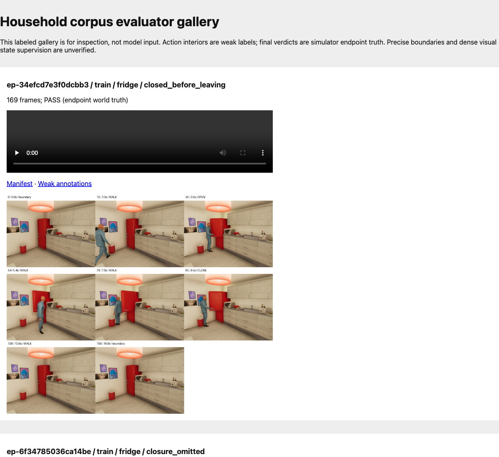
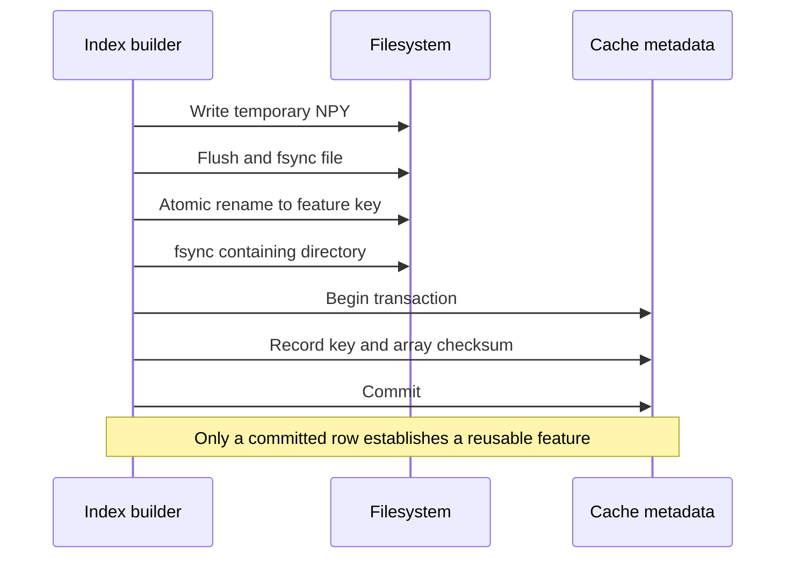
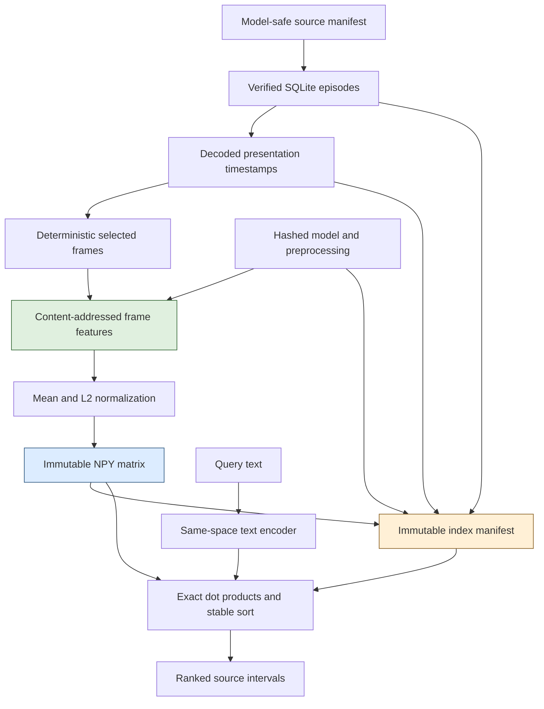
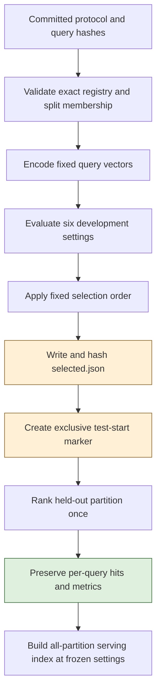

# Timestamped Video Search on Apple Silicon: From Verified Pixels to Frozen Evaluation

A timestamped video search result makes several claims at once. It claims that a particular file was indexed, that a specific set of frames represented the returned interval, that the query and those frames were encoded into compatible vector spaces, and that the displayed source video corresponds to the ranked evidence. A similarity score cannot establish those claims by itself. They require explicit contracts around media decoding, feature identity, storage, and playback.

This project implements those contracts in a local application running on an M1 Max. It ingests 24 VirtualHome videos, computes visual embeddings with a 4-bit Qwen model on MLX, indexes timestamped windows, and returns playable intervals through a small HTTP API and browser interface. A separate evaluator selects a configuration on development data and records one held-out result. The complete implementation is in `/Users/manuel/code/wesen/2026-09-06--vision/workbench`, through source commit `cc58db0`.

The application works, but its measured semantic result is limited. The selected configuration uses ten-second windows at one frame per second. It achieves 75% held-out Success@5, while random ranking has an expected Success@5 of 73.93% on the same candidate set. The system retrieves useful coarse evidence in some cases; these numbers do not establish reliable action localization. Understanding both the working implementation and that limitation is the purpose of this article.

> [!summary]
> - Source identity, decoded timestamps, and complete feature-space identity make a search result reproducible and inspectable.
> - The tested MLX embedding wrapper drops native-video pixels. This implementation exposes an explicit pooled-image baseline and rejects native video.
> - Durable feature publication writes and verifies bytes before committing metadata; exact ranking then operates on a small immutable matrix.
> - Frozen evaluation separates engineering correctness from model quality. The random baseline and temporal-overlap diagnostic substantially change the interpretation of the headline success rate.

The corpus-generation system is described in [[ARTICLE - VirtualHome on Apple Silicon - Simulator Setup and Audited Video Corpus]]. That article ends with a validated recording corpus and explicit annotation limits. This article begins with those recorded MP4 files and explains the first application built on them. The simulator is not running during indexing or search.

## 1. Define the result before selecting the model

The user-facing operation is simple: enter “A person opening the fridge door,” receive ranked video intervals, and inspect one in the source player. The internal result needs more information than a filename and score. A clip may span several seconds while its embedding uses only a subset of frames. If the system preserves only the requested interval, a reviewer cannot determine which pixels actually contributed to the score.

The implemented hit therefore carries an episode ID, chunk ID, requested start and end times, actual sampled timestamps, split and group, raw cosine score, feature-space ID, and a registered video URL. Start and end use integer microseconds and a half-open interval. A result `[10,000,000, 20,000,000)` refers to the ten-second interval beginning at 10 seconds; the right endpoint is excluded from sampling.

Three different identities are involved. The **source identity** names exact video bytes. The **feature-space identity** names the model and transformations that produce a vector. The **index identity** names the ordered set of clips, their source and sampling metadata, and the matrix specification. Combining these into one loosely defined “model version” would make it difficult to tell whether a changed result came from new media, different preprocessing, or a different collection of candidates.

| Identity | Main inputs | Change it when |
|---|---|---|
| Source | Video SHA-256 and registered episode metadata | The recorded video bytes change. |
| Feature space | Model artifacts, prompt, processor, resize, pooling, normalization, dimensions, runtime versions | A transformation that can affect a feature changes. |
| Frame feature | Feature space, source hash, raw PTS, time base, normalized PTS and origin | A different source observation is encoded. |
| Index | Ordered chunks, source/split identities, sampling parameters, producer hashes, feature space | The indexed evidence or its organization changes. |

This separation makes later extensions more precise. A different window duration can reuse the same compatible frame features. A different image processor cannot. A native-video encoder cannot inherit the pooled-image space merely because it returns the same number of values.

## 2. The corpus contains observations and evaluator knowledge

The starting corpus contains 24 videos, 4,261 frames, and 426.1 seconds of footage at 640×480. It depicts fridge and microwave interactions, including closed-before-leaving, omitted closure, and reopened-before-leaving variants. Twelve episodes belong to training groups g01 and g02, six to development group g03, and six to held-out group g04.

Those partitions support a within-scene experiment. They do not create an unseen-home test: the apartment and character remain the same, with variations such as camera and initial position. A split name describes the experimental role of an episode; it does not by itself establish the kind of generalization being measured.

The generator exports model-safe `inputs.jsonl` separately from evaluator files. A model-safe row contains exactly these fields:

```json
{
  "episode_id": "ep-34efcd7e3f0dcbb3",
  "split": "train",
  "split_group": "g01",
  "video": "episodes/ep-34efcd7e3f0dcbb3/attempt-0001/video.mp4",
  "video_sha256": "521a357c859bfaa40bc748524792850b7e8a23c65e73160b1555ca9d3e8af3f5"
}
```

The registry rejects additional fields. That restriction prevents a convenient future change from quietly adding intended action variants or verdicts to inference records. The embedding adapter receives query text or RGB images. It does not receive simulator graph state, intended outcomes, or weak action labels.

The evaluator uses four query families with guarded action interiors derived from the simulator program. These remain **weak program supervision**. They support a coarse retrieval experiment, but they are not reviewed dense visual labels or verified precise action boundaries. The earlier corpus audit deliberately left dense visual-state and precise-boundary supervision disabled. Indexing the videos does not improve those labels automatically.



The gallery exposes labels because it is an inspection tool. The application’s registry consumes the restricted manifest instead. This distinction is visible in the module structure: only `evaluation.py` reads relevance annotations; inference modules never import it.

## 3. Register media before computing features

`Registry.ingest` reads a generic JSONL manifest, verifies the referenced video bytes, decodes timing metadata, and publishes a whole batch in SQLite. It is independent of VirtualHome. Another corpus can use the same path if it supplies valid source rows and local videos.

The validation order matters. IDs must be safe and unique within the incoming batch. Paths must resolve inside the manifest directory. The video checksum must match. A split group cannot appear in two partitions, and identical video bytes cannot cross partitions under different episode names. Each file must decode into a nonempty, strictly increasing timestamp sequence. Only after these checks does the registry insert rows.

A `BEGIN IMMEDIATE` transaction covers validation and publication. Without this serialization, two concurrent ingesters could both inspect an earlier registry state, independently conclude that a group was unassigned, and then assign it to different splits. Serializing only the final INSERT statements would preserve row integrity while allowing that higher-level invariant to fail.

The current registry schema stores one row per episode with six fields: `episode_id`, `split`, `split_group`, `video`, `video_sha256`, and decoded `media` JSON. `PRAGMA user_version=1` identifies its schema version. The media record contains both source timing and derived timing, rather than only a nominal FPS value.

```text
media:
  raw_pts: source presentation timestamp integers
  time_base: rational seconds per timestamp unit
  origin_us: first presentation time in microseconds
  pts_us: presentation times relative to the first frame
  duration_us: final relative timestamp plus final-frame duration
  tail_duration_source: encoded frame duration or explicit estimate
  frames, width, height, variable_rate
```

A repeated ingest is idempotent when the registered episode is unchanged. A changed immutable episode is rejected. A bad file late in a batch does not leave earlier rows partially imported. The tests exercise this behavior with missing files, corrupted media, wrong hashes, duplicate IDs, and split conflicts.

This registry is also the authority used for playback. The browser requests an episode ID; the server resolves the corresponding registered path. It never accepts a client-supplied filesystem path. Before serving bytes, it verifies that the source still has the registered checksum.

## 4. Presentation timestamps determine which frame a time refers to

A frame number is an ordering index. A presentation timestamp describes when a decoded frame should be presented. They coincide through simple multiplication only when the timing is regular and the origin is understood. Generic video processing cannot assume that condition.

For raw presentation timestamp $p_i$ and rational stream time base $b$, the implementation derives a relative microsecond time:

$$
t_i = \operatorname{round}(10^6 p_i b) - \operatorname{round}(10^6 p_0 b).
$$

The subtraction makes the application’s time origin explicit. Raw timestamps and the time base remain available for provenance. The decoder rejects missing or non-increasing presentation timestamps rather than inventing replacements.

A four-frame variable-rate fixture uses presentation times 0, 100, 350, and 450 milliseconds. Sampling that interval at five frames per second requests 0, 200, and 400 milliseconds. The policy selects the first available frame at or after each grid time, giving actual samples at 0, 350, and 450 milliseconds. Sampling at nominal frame index divided by FPS would produce a different answer.

| Requested time | Selected decoded PTS | Reason |
|---:|---:|---|
| 0ms | 0ms | An exact frame exists. |
| 200ms | 350ms | This is the first frame at or after 200ms. |
| 400ms | 450ms | This is the first frame at or after 400ms. |

The rule is deterministic, but it does not promise the nearest frame. If two requested grid times select the same future frame, the implementation deduplicates that frame. A selected frame must still be before the clip’s excluded right endpoint. A long variable-rate gap can produce an empty interval, which contributes no clip to the index.

The fixture initially failed because libx264 rounded the requested 350 and 450 milliseconds to 400 and 500 milliseconds. The decoder had correctly returned those encoded timestamps. Setting both the stream and codec time bases to 1/1000 produced the intended test file. That failure demonstrated why a test must inspect its generated media rather than assuming the encoder preserved every requested timestamp.

The final frame requires another explicit decision. There is no subsequent PTS from which to compute its duration. `media.probe` prefers the encoded frame duration; when it must estimate a tail duration, it records that fact. An apparently precise total duration should not hide an unrecorded estimate.

## 5. Verify the visual path in the installed model implementation

The model checkpoint is `arthurcollet/Qwen3-VL-Embedding-2B-mlx-4bit`, pinned to revision `99b57b385f543a94c46d9f8e85a354de4c836b37`. Its weights, tokenizer, processor files, and chat template are hashed. The model card contains conflicting base-model lineage metadata, so the report identifies the exact converted artifact without claiming an independently verified conversion history.

The loader requires an explicit embedding-class override. The downloaded configuration names `qwen3_vl`, while the installed embedding loader does not automatically map that name to `qwen3_vl_embedding`. The application uses the loader’s in-memory `config_overrides` argument. Downloaded weights and configuration files remain unmodified.

The more consequential finding was in native-video handling. In the installed MLX-VLM 0.6.17 implementation, the embedding model’s `__call__` accepts `**kwargs`, but its call to `_last_hidden_state` forwards only selected named arguments. It does not forward `pixel_values_videos`. The underlying Qwen vision path can process video pixels when that argument reaches it; this wrapper prevents them from reaching it.

```python
# Reduced representation of the installed forwarding problem.
def __call__(input_ids, pixel_values=None, video_grid_thw=None, **kwargs):
    return last_hidden_state(
        input_ids,
        pixel_values=pixel_values,
        video_grid_thw=video_grid_thw,
        # kwargs["pixel_values_videos"] is not passed through.
    )
```

A callable accepting a video-related keyword is therefore insufficient evidence of native-video support. A returned vector may still be finite and have the expected dimension while failing to depend on the intended pixels. The adapter’s `video` method raises `NotImplementedError` with this capability failure. There is no automatic conversion to another mode hidden behind that method.

The implemented visual mode is separately named `pooled_images`. Each image is converted to RGB, resized to 320×240 with Pillow bicubic, and passed through the checkpoint processor. The system instruction is “Represent the user's input.” The checkpoint chat template includes the assistant generation prefix, and the embedding class pools the last nonpadding token. Before each independent sample, the adapter clears cached rotary-position state. After inference, it materializes the MLX result, converts it to float32, verifies its shape and finite values, and normalizes it.

The first smoke attempt failed because `apply_chat_template` required Jinja2, which the installed dependency set had not supplied. Adding Jinja2 explicitly made the environment reproducible through the project’s lock file. Installation success and runtime-path success were separate checks.

The visual smoke compared a repeated corpus frame, a neighboring frame, and a black image. The result had 2,048 finite dimensions and norm 1. The repeated frame matched exactly; adjacent-frame cosine was 0.9634, while the black-image cosine was 0.3662. These observations establish pixel sensitivity and repeatability for this fixture. They do not establish action semantics or native-video correctness.

## 6. A feature space includes transformations, not only weights

Cosine similarity assumes that query and document vectors have compatible meaning. Matching dimensions alone does not establish that assumption. Two encoders can both produce 2,048 numbers while using different prompts, token pooling, normalization, or input modalities.

The `FeatureSpace` record includes the checkpoint identity and artifact digest, explicit mode, adapter version, instruction, image size and resize method, pooling method, dimensions, dtype, normalization, sampling policy, and runtime versions. The final runtime includes MLX 0.32.2, MLX-VLM 0.6.17, Transformers 5.16.1, NumPy 2.4.6, Pillow 12.3.0, and PyAV 17.1.0. The complete dependency graph is pinned in `workbench/uv.lock`.

A canonical JSON serialization of this record is hashed to produce the feature-space ID. The final measured space is:

```text
9246fa13a4a2d32fbb78ba1614024d65bb44339b757497bf0e90cdd6f07a0bf4
```

The frame cache includes this ID in its keys, and the index manifest stores the full record. The search path checks the query’s space ID before multiplication. Changing decoder or numerical-library provenance deliberately created a new identity during implementation; the final experiment recomputed the required features under that identity rather than reusing ambiguously versioned values.

This scheme makes some changes cheap and others intentionally expensive. Moving from five-second to ten-second windows changes the aggregation and index, but can reuse compatible frame embeddings. Changing the image processor or introducing a native-video attention path requires a different feature space and new features. Reuse is an explicit compatibility decision.

## 7. Mean pooling creates a clip vector and removes frame order

Let $e_i$ be the unit embedding for selected frame $i$. The implemented clip representation is:

$$
m = \frac{1}{n}\sum_{i=1}^{n} e_i,
\qquad
v = \frac{m}{\lVert m\rVert_2}.
$$

The first normalization ensures that a frame contributes by its vector direction rather than by an arbitrary magnitude. The mean combines the selected observations. The second normalization makes the resulting clip usable in cosine ranking through a dot product. A zero or nonfinite result is rejected rather than stored.

This representation has a precise limitation: addition is commutative. Reversing the frame sequence leaves $m$, and therefore $v$, unchanged. The baseline cannot encode action order through this pooling operation. A sequence of a closed door followed by an open door can share the same pooled representation as those observations in reverse order, assuming the same frame embeddings are present.

Long windows also reduce the influence of an individual brief observation. Before final normalization, replacing one unit vector $e$ with another $e'$ changes the mean by $(e'-e)/n$, whose norm is at most $2/n$. This bound does not directly predict semantic retrieval accuracy, but it explains why one action frame can have limited influence among many contextual frames. The actual embedding geometry and final normalization still matter.

These properties make the baseline useful for establishing the search system while limiting what can be inferred from it. The output should be treated as candidate appearance evidence. A later temporal encoder must be evaluated for order sensitivity using explicit controls and a distinct feature-space identity.

## 8. Publish bytes before declaring a feature complete

Feature computation is expensive relative to reading a small vector. A resumable indexer therefore needs a durable distinction between an entry that was attempted and an entry that is complete. A file’s presence alone cannot supply that distinction: a process can stop after creating a file but before writing all its contents or recording its metadata.

`FrameCache` writes one normalized float32 row per feature and records its checksum in SQLite. The publication sequence is deliberate:



If the process stops before the metadata transaction commits, an array may remain without an authoritative row. A later build treats that entry as missing and recomputes it. The inverse order would be worse: committing a row before publishing its bytes could expose a supposedly complete feature whose file is missing or partial.

The injected-crash test raises an exception after the atomic rename and before the row commit. It then verifies that `cache.get` returns no completed feature. Recomputing and committing the entry makes it reusable. A separate corruption test modifies committed bytes and verifies that the checksum mismatch fails loudly. These are different recovery cases; the implementation does not silently overwrite committed corruption.

```python
# Publication order, omitting path construction and cleanup details.
write_temporary_array(vector)
flush_and_fsync()
atomic_rename_to_final_path()
fsync_parent_directory()
with metadata_transaction():
    record_feature_key_and_checksum()
```

A filesystem lock permits one index writer for a cache root. SQLite records make individual feature completion durable. The index manifest establishes a separate, larger publication boundary for the complete ordered matrix. These mechanisms operate at different levels and are not interchangeable.

## 9. Freeze an index as an ordered matrix and a manifest

After sampling and retrieving frame features, the builder pools each window and appends its vector in the same order as its chunk metadata. The resulting float32 matrix has shape $[N, 2048]$, where $N$ is the number of indexed windows. The manifest freezes that ordering, source hashes, splits, actual sampled PTS, window and FPS settings, producer source-file hashes, full feature-space specification, matrix shape, and matrix checksum.

The final serving index has 55 windows across all 24 videos. Its NPY matrix occupies 450,688 bytes. That scale supports an uncomplicated exact search implementation. An approximate-nearest-neighbor service would introduce another behavior to validate without solving the present uncertainty about visual semantics.

The index loader verifies the manifest identity and array checksum, checks float32 shape and normalization, and opens the matrix read-only with NumPy memory mapping. Rebuilding an existing identity verifies the matrix and rejects any attempt to change its contents. The application does not mutate a matrix while a search process is reading it.



For a normalized query vector $q$ and normalized matrix rows $X_i$, cosine scores are simply $s=Xq$. The implementation filters eligible rows by partition and sorts by descending score, using chunk ID as a stable tie-breaker. There is no learned reranker or overlap suppression in the measured baseline.

A small mathematical example shows the arithmetic independently of the learned model:

```text
query q = [1, 0]

row A = [1.0, 0.0]  -> score 1.0
row B = [0.6, 0.8]  -> score 0.6
row C = [0.0, 1.0]  -> score 0.0
```

All three rows are unit vectors. Their scores can be checked by direct multiplication. Tests also replace vectors with identical values to verify deterministic ordering under exact ties. These fixtures establish ranking behavior without depending on the semantic quality of the model.

## 10. The HTTP result must remain connected to its source

The HTTP layer loads one immutable index and one compatible embedder. At startup it compares the index’s source and split metadata against the registry. Requests cannot select an arbitrary path or an unknown index. The API exposes four useful surfaces:

| Route | Behavior |
|---|---|
| `POST /v1/search` | Validate query, optional index ID, partition, and top K; return typed hits and elapsed time. |
| `GET /v1/index` | Describe the loaded index and feature space. |
| `GET /v1/episodes/{episode_id}/video` | Serve only the registered, checksum-verified source with byte-range support. |
| `/docs` and `/openapi.json` | Expose generated API documentation and schema. |

`SearchRequest` rejects unknown fields, bounds the query length, and limits `top_k` to 1–100. An empty valid partition produces an empty successful result. A malformed request produces an error. A mismatched index request returns a conflict. These outcomes should not all be converted into “no results,” because they describe different failures or valid states.

Model calls are serialized with a lock. The underlying model retains cached state, including rotary-position information, so concurrent requests must not interleave access to one model instance. The adapter resets its independent-sample state; the API lock ensures that the reset and encode operation belongs to one request at a time.

The viewer uses an ordinary HTML video element. Selecting a hit assigns the registered video URL, waits for media metadata, and sets `currentTime` to `start_us / 1e6`. The source endpoint supports range requests, which the browser uses for media access. The first real browser test returned HTTP 206 for the video and sought to exactly 5.0 seconds with decoded dimensions 640×480 and readyState 4.

Stopping at the interval boundary required a separate browser check. A first implementation used only `timeupdate`; its observed endpoint was 10.245371 seconds for a ten-second boundary. Animation-frame checks and final clamping corrected the displayed endpoint to exactly 10 seconds in the follow-up test. That establishes the observed player behavior, not sample-exact presentation guarantees across every browser and codec.


The final selected-index screenshot was captured after the frozen evaluation completed. It shows a held-out query whose top result covers 10–20 seconds in `ep-d9e2a612fb2342e2`, with playback at exactly 10 seconds in a 24-second source. The observed response took 0.09 seconds. This later visual inspection did not change the selected configuration or replace the aggregate test report.


## 11. Define the evaluation denominator before looking at scores

A retrieval metric is meaningful only relative to a relevance rule and candidate set. The initial labels specify weak action interiors. The frozen rule declares a hit relevant when it belongs to the correct episode and covers at least half of one such interior.

For a retrieved interval $H=[h_0,h_1)$ and a weak interior $G=[g_0,g_1)$, define temporal overlap:

$$
O(H,G)=\max\left(0,\min(h_1,g_1)-\max(h_0,g_0)\right).
$$

The relevance condition is $O(H,G)/(g_1-g_0)\geq 0.5$, together with matching episode identity. An interval ending exactly where an interior begins has zero overlap. Intervals from different episodes never match, even when their timestamp numbers coincide.

This definition favors long windows. A ten-second window can cover a 1.2-second action interior completely while locating it imprecisely. Its temporal IoU is only 0.12 when that interior lies entirely inside the window. Coverage and localization are therefore different measurements.

The evaluator reports three metrics. **Success@K** asks whether any relevant interior is matched in the first K results. **Interval Recall@K** counts distinct matched interiors divided by the total relevant interiors for that query. Repeated hits for the same interior cannot increase this count. The **best-IoU diagnostic** finds the highest hit–truth temporal IoU for each query within the first K results, then averages across positive queries.

A worked interval example makes the denominators concrete. Suppose a query has one relevant interior in episode A and another in episode B, both from time 10 to 20. A retrieved interval in episode A from 15 to 25 covers half of the first interior. It is relevant under the rule. Success is 1, interval recall is 1/2, and temporal IoU is 5/15, or 1/3. A second hit covering that same episode-A interior exactly raises best IoU to 1 but leaves interval recall at 1/2.

Queries with no relevant interiors do not receive an invented zero or one positive-recall value. The report preserves them as unsupported for that calculation and records their actual scores and returned-hit counts. Two explicit negative controls were included: a dog running outside in a garden and a person watering houseplants. Neither action appears in the generated corpus.

## 12. Freeze selection before touching the held-out ranking

The evaluator and protocol were committed as `aeeaa30` before comparing configurations. The protocol fixes the corpus-manifest hash, query-file hash, development and test groups, six candidate settings, relevance threshold, metric cutoffs, selection order, and random-control parameters.

The six candidates combine 2-, 5-, and 10-second windows with 1 and 2 FPS. Query text and instruction are held constant. Development group g03 determines the winner. The fixed tie-break order is macro Success@5, macro interval Recall@5, best IoU@5, then smaller window and lower FPS.



The implementation writes the selected configuration and its provenance before test ranking. An exclusive `test-started.json` marker prevents a second invocation from silently replacing that report. A workflow test substitutes controlled builders and metric results, verifies that `selected.json` exists before the test call, and confirms that the next invocation is rejected.

This is an engineering guard, not a guarantee against all possible experiment misuse. A person can create another report directory or modify a protocol. Such a run should be named as a new experiment, and a partition already used for exploratory tuning should not be described as pristine held-out data. The durable artifacts preserve what this particular run did.

| Setting | Dev Success@5 | Dev interval Recall@5 | Dev best IoU@5 |
|---|---:|---:|---:|
| 2 seconds / 1 FPS | 25% | 6.25% | 0.098 |
| 2 seconds / 2 FPS | 50% | 25% | 0.300 |
| 5 seconds / 1 FPS | 50% | 25% | 0.120 |
| 5 seconds / 2 FPS | 50% | 31.25% | 0.120 |
| 10 seconds / 1 FPS | 75% | 50% | 0.090 |
| 10 seconds / 2 FPS | 75% | 50% | 0.090 |

Both ten-second configurations tied on the measured selection criteria, so one FPS won. The two-second, two-FPS condition had a better localization diagnostic, but it did not win the frozen primary objective. The result exposes a tradeoff in the objective itself. Changing the objective after viewing test performance would create a different experiment.

## 13. Interpret the result against the actual candidate set

The held-out index contains only fourteen windows. Its final metrics are:

| K | Success@K | Macro interval Recall@K | Mean best IoU@K |
|---|---:|---:|---:|
| 1 | 25% | 6.25% | 0.030 |
| 5 | 75% | 68.75% | 0.095 |
| 10 | 100% | 100% | 0.114 |

At K=5, both fridge query families matched all their weak interiors. Microwave opening matched three of four interiors. Microwave closing matched none of its two. The query-level interval-recall values are therefore 1, 1, 0.75, and 0, whose macro mean is 0.6875. Across all intervals, nine of twelve were matched, giving a different micro average of 0.75. The report uses the macro value and names it explicitly.

Random ranking is essential here because K is large relative to the candidate set. With $N$ windows, $R$ relevant windows for a query, and a sample of $K$ distinct windows, the probability of at least one relevant window is:

$$
P(\mathrm{Success@}K)=1-\frac{\binom{N-R}{K}}{\binom{N}{K}}.
$$

This expression counts the complement: selecting K windows entirely from the nonrelevant set. It applies to uniform random ranking without replacement and uses relevant **windows**, not the number of relevant interiors. Those counts need not be equal in a general dataset.

For this frozen test index, the four query families have 4, 2, 4, and 2 relevant windows among fourteen. At K=5, the corresponding probabilities are 87.41%, 60.44%, 87.41%, and 60.44%. Their macro average is 73.926%. The measured random control, using seed 42 and 100 permutations per query, reported 74%. The analytical expectation and the observed control agree.

The model’s 75% Success@5 therefore provides little evidence of improvement in query success. Its 68.75% macro interval recall exceeds the random control’s 34.81%, suggesting useful appearance-based concentration of some relevant intervals in this fixture. Four positive query families and one apartment are insufficient for a strong generalization claim. The low IoU values further restrict the result to coarse retrieval.

Success@10 is especially easy to misread. Retrieving ten of fourteen candidate windows examines most of the held-out index. A 100% query-success rate at that cutoff does not establish that the first few results are precise or that the method can handle a much larger collection.

The negative controls received top cosine scores of 0.0618 and 0.1523, below the positive queries’ top scores in this run. They still returned candidates because the search API performs ranking without a fitted abstention rule. Two negatives do not support choosing a reliable rejection threshold. A future abstention experiment needs a broader negative distribution and its own frozen calibration procedure.


The analytical random expectation in this section was calculated from the already frozen candidate and relevance sets after the run. It is an explanation of the recorded baseline, not a new model evaluation or another configuration-selection step.

## 14. Measure materialized work and explain cache reuse

MLX evaluates many operations lazily. Timing only the Python call that constructs an output can measure graph construction rather than completed numerical work. The adapter calls `mx.eval` on the embedding before recording elapsed time and converting it to NumPy. This makes the reported encode measurements refer to materialized output.

The first engineering index used five-second windows at two FPS. It encoded 861 frames into 95 windows in 134.37 seconds, excluding model loading. The matrix occupied 778,368 bytes. Relative to the 426.1-second source corpus, the build took about 0.315 times the corpus duration.

A verified repeated build reused all 861 frames and encoded none. It took 0.124 seconds, again excluding model loading. That difference measures cache reuse, not an improvement in model inference speed. The later provenance hardening intentionally created a new feature space, so the final evaluation regenerated its required features under the completed identity.

The selected serving index has 55 windows and 434 selected frames at one FPS. Its final all-partition build reused 217 frames already encoded during development and test work, then encoded 217 training frames in 36.84 seconds. The held-out build alone encoded 110 new frames into fourteen windows in 18.43 seconds. These are cache-aware execution measurements, not independent cold benchmarks of every candidate setting.

The evaluation’s first text query took 0.746 seconds; subsequent query encodes took about 0.027–0.036 seconds. Peak MLX allocation was 2.152 GB, and evaluator RSS was 2.226 GB. A separate final smoke loaded the model in 2.52 seconds. These measurements describe this local run on the M1 Max. They do not isolate every preprocessing, kernel-compilation, cache, or machine-wide scheduling effect.

A useful performance report names the boundary of each timer. “Indexing took 0.124 seconds” is misleading without the fact that all visual features were already cached. “Query encoding took 0.03 seconds” omits the first-call behavior and model-loading cost. The recorded artifacts keep those distinctions visible.

## 15. Reproduce the application and review the implementation

Run commands from `/Users/manuel/code/wesen/2026-09-06--vision`. The workbench has its own Python environment and does not modify the simulator environment. If the source corpus is absent, follow the earlier VirtualHome article and `docs/playbook/virtualhome-corpus.md` first.

```sh
uv sync --project workbench --extra dev --locked
workbench/.venv/bin/python \
  ttmp/2026/09/06/COSMOS-EMBED-001--embedding-runtime-baseline-on-mlx/scripts/03-download-pinned-model.py
workbench/.venv/bin/video-workbench ingest \
  output/virtualhome-corpus/home-v1/inputs.jsonl
workbench/.venv/bin/video-workbench index --seconds 10 --fps 1
```

The index command prints a manifest path and writes `output/video-workbench/last-build.json`. Use that manifest with `search` or `serve`. The exact final serving command for the measured implementation is:

```sh
workbench/.venv/bin/video-workbench serve \
  --manifest output/video-workbench/indices/e9ba74dabd6c07eafc1df2ee28c2b77a6f0235b87a7e7b3e0fff2e3df893bbce/manifest.json
```

The local viewer is at `http://127.0.0.1:8767/`. It loads one immutable index; restart the process with another manifest to change that index. A newly modified implementation can produce a different index identity because producer source hashes are part of the manifest. Use the returned path rather than assuming a historical hash remains appropriate after code changes.

```sh
workbench/.venv/bin/video-workbench search \
  'A person opening the fridge door' \
  --manifest output/video-workbench/indices/INDEX_ID/manifest.json \
  --split train

workbench/.venv/bin/pytest workbench/tests -q
```

Fifteen tests pass. They cover vector validation, feature-space identity, variable-rate timestamps, corrupt and missing media, atomic/idempotent ingest, split leakage, interrupted feature publication, index corruption and compatibility, stable ranking ties, request validation, registered video access, range requests, source modification, interval-metric definitions, and selection-before-test ordering. Two upstream Starlette TestClient deprecation warnings remain. Actual browser tests separately verify decode readiness, seeking, and endpoint behavior.

The implementation is small enough to read in dependency order:

| File under `workbench/src/video_workbench/` | Responsibility |
|---|---|
| `registry.py` | Generic manifest validation, SQLite episodes, source and split identity. |
| `media.py` | Decoded PTS metadata and deterministic frame selection. |
| `embedding.py` | Pinned visual adapter, explicit capabilities, normalization, feature-space identity. |
| `index.py` | Frame-cache publication, window pooling, immutable manifests, exact ranking. |
| `api.py` | Typed search requests, serialized model access, registered source playback. |
| `viewer.html` | Query form, ranked intervals, video seeking, timestamp evidence. |
| `evaluation.py` | Evaluator-only relevance joins, development selection, frozen test report. |
| `cli.py` | Ingest, inspect, index, search, serve, and evaluate-retrieval entry points. |

The principal project evidence is under `ttmp/2026/09/06/VIDEO-SEARCH-001--project-1-timestamped-video-search/`: the implementation diary, implementation report, frozen evaluation JSON, exact query vectors, index manifests, and browser screenshots. Runtime capability evidence is in the sibling COSMOS-EMBED-001 ticket. These artifacts support the explanations in this article; historical design documents should not be substituted for measured runtime evidence.

## 16. What the next project can safely reuse

The registry, PTS decoder, sampling policy, feature identities, and publication protocol can be reused without claiming that pooled-image retrieval solves temporal understanding. They establish where an observation came from and how a vector was produced. A state-recognition or temporal-model project can build on those facts while defining its own labels and model outputs.

The next visual model should be required to demonstrate its actual input path. A repaired native-video wrapper needs controls showing that changing video pixels changes the output, that the prepared frame count matches the intended samples, and that repeated, reversed, and otherwise controlled sequences behave as expected. It must use a new feature-space identity; the present image-pooled cache cannot certify it.

Better evaluation also requires reviewed temporal evidence. The current weak interiors and within-apartment partitions should not become dense state labels simply because a model needs them. A stronger experiment would specify visual observability, review action boundaries, add negative and confusable activities, and introduce genuinely different scenes or recordings. Those changes should be recorded as a new corpus and protocol version.

Several conclusions from this implementation are reusable:

- A valid search result requires source identity and actual selected timestamps in addition to a score.
- A model capability must be verified along the installed pixel-processing path; accepting a keyword is not evidence that the pixels are used.
- Feature-space compatibility must include preprocessing and pooling, because matching vector dimensions is insufficient.
- File publication and metadata publication must be ordered so an interruption cannot expose incomplete features as complete.
- Retrieval metrics must be interpreted against the candidate set, relevance rule, and random baseline.
- A working application can be an engineering success while its model remains an inadequate basis for precise temporal decisions.

The completed project provides a local, reproducible way to find and inspect candidate intervals. Its measured limitations identify the next technical questions: verified temporal encoding, stronger visual labels, and evaluation conditions in which successful retrieval requires more than selecting a large fraction of a tiny index.

## Primary references and related work

The technical account above is based principally on the source and measured artifacts at revision `cc58db0`. Upstream references inspected during implementation include the [official Qwen3-VL-Embedding processing implementation](https://huggingface.co/Qwen/Qwen3-VL-Embedding-2B/raw/main/scripts/qwen3_vl_embedding.py), the [pinned community MLX checkpoint](https://huggingface.co/arthurcollet/Qwen3-VL-Embedding-2B-mlx-4bit/tree/99b57b385f543a94c46d9f8e85a354de4c836b37), and the installed MLX-VLM 0.6.17 encoder loader and Qwen model classes. The native-video finding refers to that installed version, not all future MLX implementations.

Related vault notes: [[ARTICLE - VirtualHome on Apple Silicon - Simulator Setup and Audited Video Corpus]] and [[PROJ - VirtualHome-AIST - Native Apple Silicon Simulation and Video Ground Truth]]. The earlier notes explain simulator installation, recording, and annotation provenance; this article explains the search application and its evaluation.
