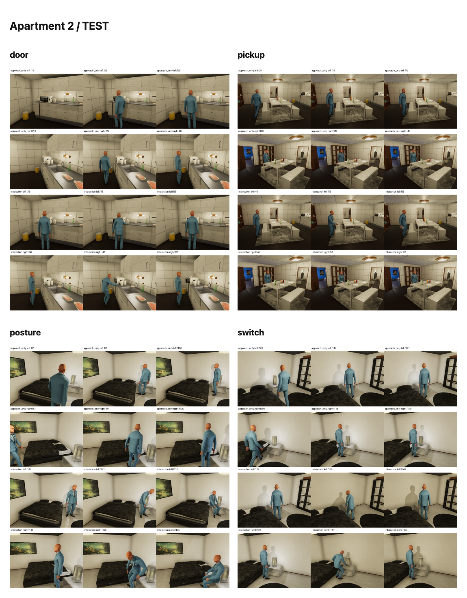
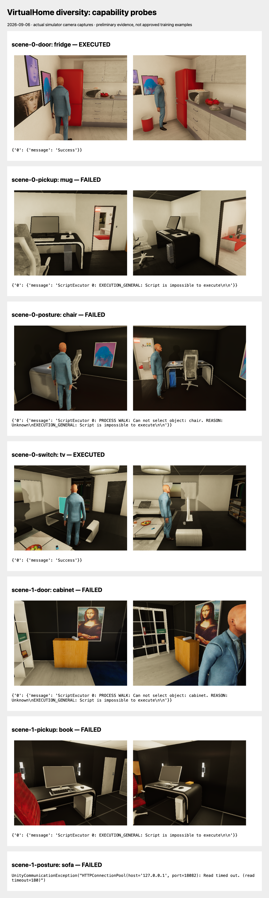
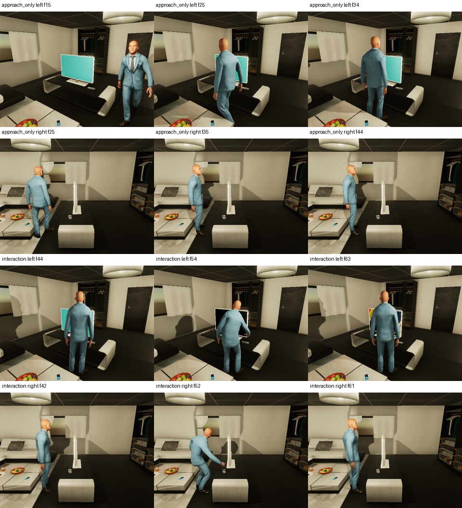
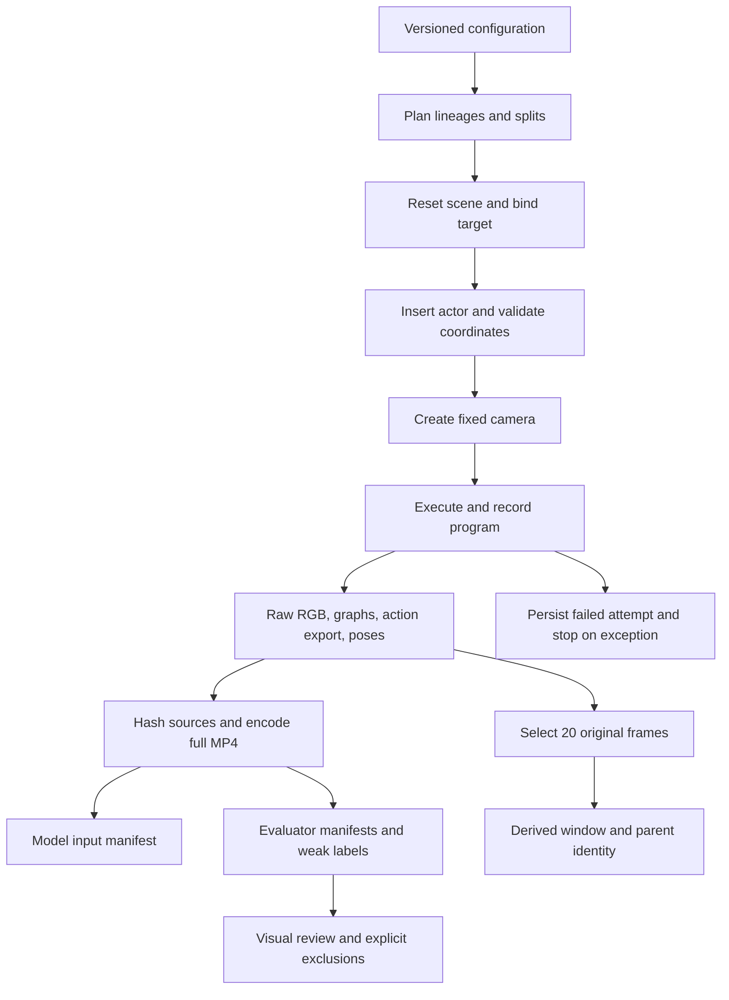
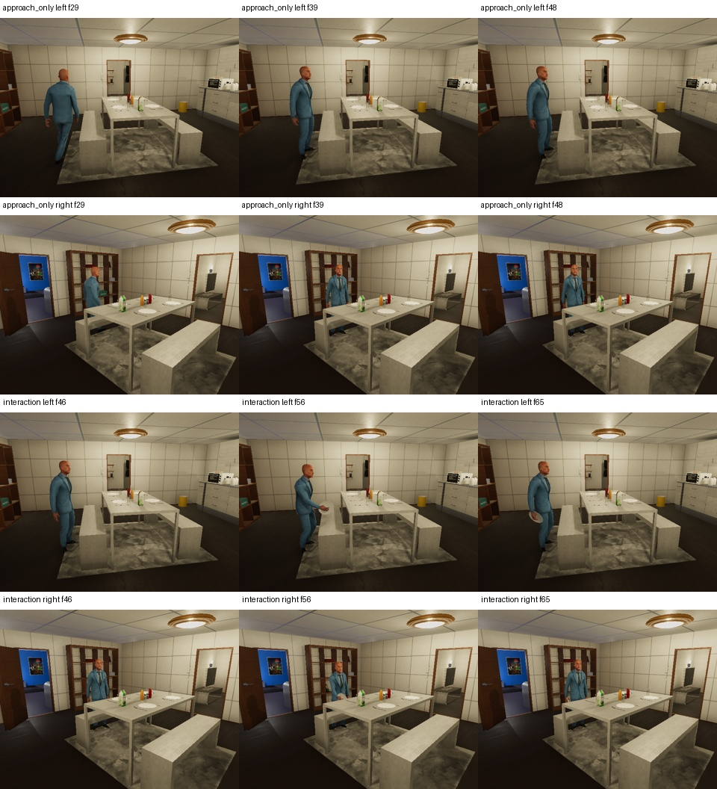
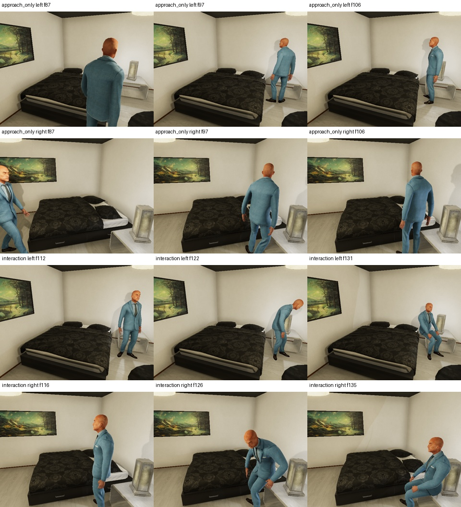
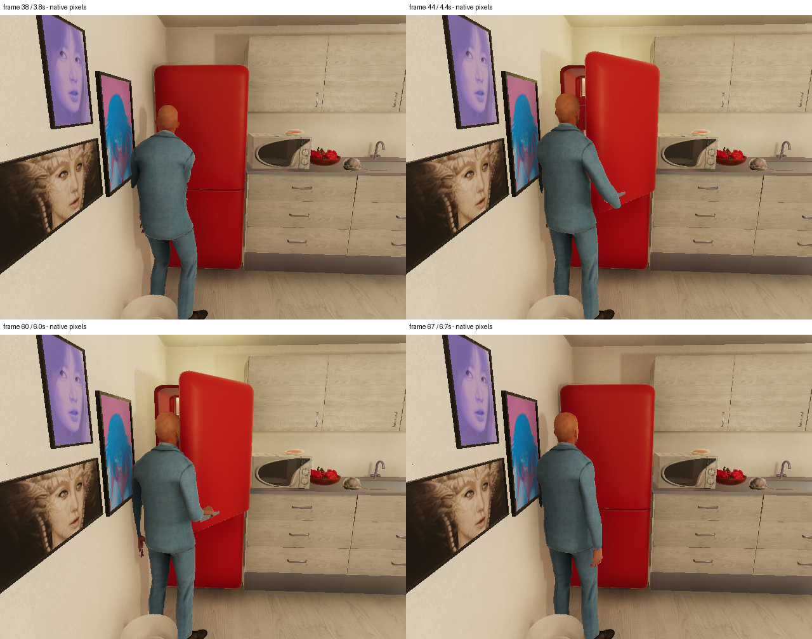
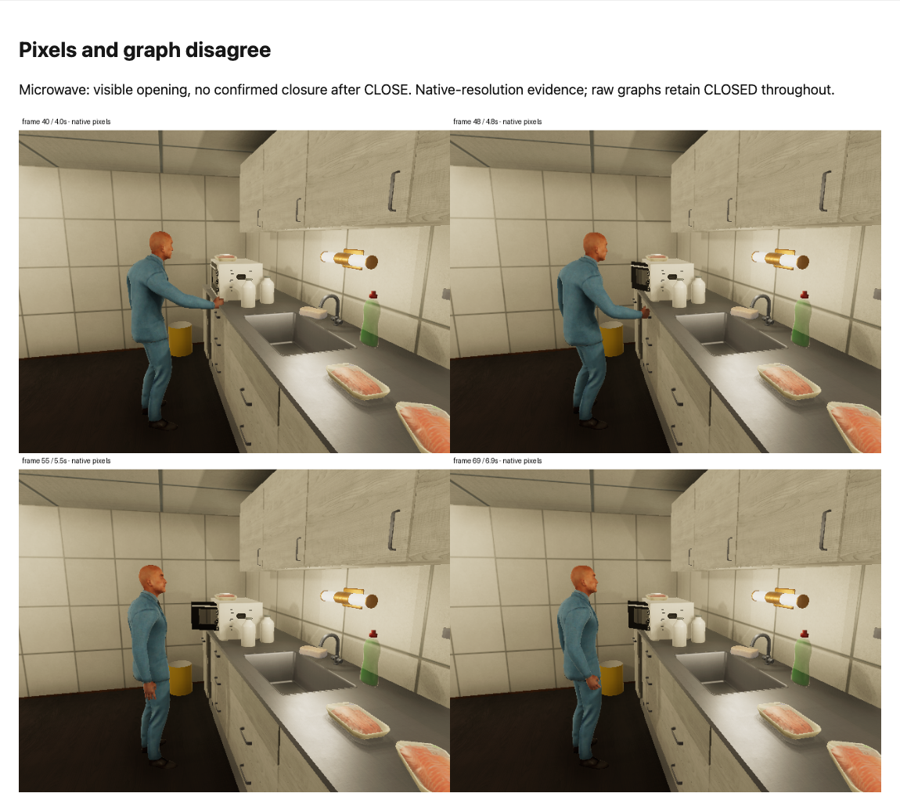

# Expanding a VirtualHome Video Corpus: Scenario Diversity, Provenance, and Visual Label Calibration

A useful video corpus must vary the observations that a model needs to distinguish. Repeated recordings of the same appliance can establish that decoding, embedding, and playback work, but they provide limited evidence that a model recognizes different actions, objects, or locations. The VirtualHome corpus expansion addresses that limitation by generating household interactions across three apartments, four action families, two experimental conditions, and two camera views. It also records the evidence needed to decide which annotations can support which experiments.

The completed release adds **48 full trajectories and 48 derived two-second clips**. These contain refrigerator and microwave interactions, mug/book/plate pickup, sitting on sofas and a bed, and television/lamp switching. All new videos passed media and provenance checks. The investigation also found a strong duration shortcut, inaccessible simulator objects, occluded interactions, and appliance graph states that disagree with the rendered video. Those findings determine how the release should be used.

This report describes the completed corpus augmentation in ticket `VIDEO-CORPUS-001`, through the release evidence at `dc17758` and final diary at `6274be7`. It does not report the subsequent observable-state classifier or the separate MLX repair. The source repository is `/Users/manuel/code/wesen/2026-09-06--vision`.

> [!summary]
> - The new release contains 48 trajectories from 12 scenario lineages, with all four action families present in each apartment partition.
> - Another 48 clips preserve exactly 20 original frames each, removing the full trajectories' duration difference without claiming to remove every evaluation bias.
> - Source hashes, numbered attempts, producer identities, and separate evaluator files preserve how each observation was produced.
> - Visual review established nine conservative appliance transition brackets. It did not establish dense visual ground truth or exact action boundaries.

The earlier setup is documented in [[ARTICLE - VirtualHome on Apple Silicon - Simulator Setup and Audited Video Corpus]]. Its first application is described in [[ARTICLE - Timestamped Video Search - From Verified Pixels to Frozen Evaluation]]. This report explains the broader data foundation needed for subsequent model experiments.

## 1. What changed in the dataset

The original `home-v1` corpus contains 24 videos of fridge and microwave procedures in one apartment. It remains unchanged. The expansion is a separate `diversity-v2` release, so its configuration, manifests, recordings, and annotations can evolve without invalidating earlier experiments.

Here, augmentation means generating additional simulator situations and deriving controlled temporal windows. It does not mean applying image distortions, synthesizing videos with a generative model, or creating independent samples by copying existing frames. The distinction matters when counting data and describing generalization.

| Property | Original `home-v1` | New `diversity-v2` |
|---|---:|---:|
| Full trajectories | 24 | 48 |
| Recorded frames | 4,261 | 3,682 |
| Full-video duration | 426.1 seconds | 368.2 seconds |
| Apartments | 1 | 3 |
| Main situations | Appliance procedures | Door, pickup, posture, switching |
| Additional fixed windows | Not this release's output | 48 × 2 seconds |
| Image format | 640 × 480 at 10 FPS | 640 × 480 at 10 FPS |

The new release has more trajectories but less total duration because its programs are shorter. Together, the two releases contain 72 full recordings, but that arithmetic does not define a valid combined benchmark. Their split policies differ, and apartment 0 appears in both. The 48 derivative clips reuse footage from the new recordings and therefore add no independent scenes or executions.



*Figure 1. Actual browser capture of the apartment-2 review dashboard. Each family contains approach-only and interaction recordings from two views. The kitchen examples involve a microwave and plate; the bedroom examples involve a bed and table lamp. The dashboard contains evaluator labels and must remain outside model input.*

## 2. The experimental unit is a scenario lineage

A scenario lineage identifies an apartment, target binding, and configured actor start. Each lineage produces four recordings: interaction-left, interaction-right, approach-only-left, and approach-only-right. The release has twelve lineages, giving the count

$$3\text{ apartments}\times4\text{ families}\times2\text{ conditions}\times2\text{ views}=48\text{ recordings}.$$

The conditions share the target, requested start, and camera construction. Interaction programs manipulate the target; approach-only programs walk toward it and look at it. These controls help distinguish target manipulation from the presence of the object and the actor's approach. They are not exact counterfactuals: simulator resets can produce different trajectories, and the programs differ in duration.

`diversity.plan` assigns entire apartments to train, development, and test before recording. Every family appears in every split, and all related conditions and views remain together. A different camera view of a training lineage therefore cannot become a nominally independent test example.

| Family | Train: apartment 0 | Development: apartment 1 | Test: apartment 2 |
|---|---|---|---|
| Door manipulation | Fridge 308 | Fridge 155 | Microwave 174 |
| Pick up and return | Mug 454 | Book 332 | Plate 67 |
| Sit | Sofa 375 | Sofa 301 | Bed 296 |
| Switch | TV 433 | TV 313 | Table lamp 268 |

Object numbers are IDs in the pinned scene graphs. They are not portable class labels. The planner derives a lineage hash from the release name, scene index, and scenario configuration, then derives an episode hash from the lineage, condition, and view. This makes identity explicit while keeping condition names out of model-facing filenames.

The split has 16 recordings per partition, but only one apartment per partition. Object class, room layout, and partition are partly confounded: the held-out switching target is a lamp, while the training target is a television. A failure could reflect action recognition, object transfer, or scene transfer. The single Male1 character also leaves actor generalization untested. These are limits on interpretation even when no file crosses a split boundary.

## 3. From scene inventory to executable programs

A simulator graph provides nodes, properties, states, and relations. The producer uses these to bind a proposed target before executing a program. `diversity.bind` requires an exact object ID, the expected class, an appropriate affordance, and exactly one containing room. Pickup additionally requires an explicit support surface.

| Family | Required graph property | Accepted interaction structure after approach |
|---|---|---|
| Door | `CAN_OPEN` | OPEN, LOOKAT, CLOSE, LOOKAT |
| Pickup | `GRABBABLE` | GRAB, PUTOBJBACK, LOOKAT |
| Posture | `SITTABLE` | SIT, then terminate |
| Switch | `HAS_SWITCH` | Toggle, LOOKAT, restore initial graph-reported state, LOOKAT |

Every approach begins with WALK and LOOKAT. The control adds two further LOOKAT commands without manipulating the target. Door generation requires an initially CLOSED target. Switching chooses its first operation from the initial ON state and then reverses it. That program construction describes requested behavior; it does not certify that a visual state change occurred.

An advertised affordance did not guarantee an executable composition. The first probes encountered inaccessible chairs and cabinets, failed pickup/return sequences, and a seated sequence that continued recording after the client timed out. Primitive-level probes narrowed the accepted pickup program to GRAB followed by PUTOBJBACK. The tested explicit PUTBACK-to-desk composition failed, as did tested sequences with LOOKAT during held-object or seated states. Terminal SIT was usable.

These observations apply to the tested bindings, programs, and pinned build. They should not be generalized into universal statements about every VirtualHome version. The accepted configuration reflects successful recorded probes, not merely a list of actions exposed by an API.



*Figure 2. The initial probe gallery preserves unsuccessful candidates alongside successful ones. A graph-advertised chair or cabinet could fail during navigation; a longer seated program could time out. These are investigation artifacts, not accepted training examples.*

### Camera construction and visual acceptance

`camera_for` places a camera relative to the target and its containing room. It computes the horizontal direction toward the room center, rotates that direction by −28 or +28 degrees for the two views, and places the camera at a nominal distance of 2.8 m and height of 1.65 m. Horizontal coordinates are clamped inside the room bounds with a 0.35 m margin. The look-at height is clamped between 0.85 and 1.1 m.

This gives a reproducible construction rather than an arbitrary camera per episode. It does not solve visibility geometrically. Furniture can obstruct the target, the actor can block a small prop, and a television can appear edge-on. Some executable candidates were replaced after visual inspection because the camera did not expose useful evidence. Remaining occlusions are recorded in a separate assessment.



*Figure 3. The two television views show why execution and visibility need separate checks. The left view exposes the screen more directly; the right view is substantially edge-on. A successful switching program does not make both views equally informative about screen state.*

## 4. The generation pipeline preserves attempts and sources

The generator uses the AIST checkout at `122d3b0aee04768d988e02929f6eeeb38f2f28a8` and the recorded `Door_Modified_Build_2023_0404` release. Corpus generation uses the simulator environment under `output/virtualhome-install/.venv`, separately from the MLX embedding environment. It requires no embedding-model inference.



The implementation separates planning (`diversity.py`), recording and validation (`diversity_runner.py`), review (`diversity_review.py`), and derivative production (`diversity_windows.py`). Existing exporter helpers in `core.py` and `runner.py` are reused; the original v1 producer files were not changed for this expansion.

A filesystem lock prevents competing generators from writing the same release root. Reusing an output directory with a different configuration is rejected. Each recording receives a new numbered attempt directory. The episode-level manifest points to its current attempt, while older failed attempts remain available for inspection.

The central execution structure is:

```python
# Condensed from diversity_runner.generate; not a separate API.
attempt = allocate_next_attempt(episode)
persist(status="started", config_hash=hash(config), producer=source_hashes)
try:
    reset(scene)
    target, room, support = bind(environment_graph(), scenario)
    add_character(position=verified_lineage_start)
    initial_room = validate_actual_start(environment_graph())
    camera = add_camera(camera_for(target, room, view))
    render_script(program, recording=True, out_graph=True, per_frame=1)
    export_annotations_and_video()
    hash_original_rgb_graph_pairs_and_supporting_files()
    persist(status="complete", source_hashes=hashes, video_sha256=video_hash)
except Exception as error:
    persist(status="failed", error=str(error))
    raise
```

Failure stops generation because a request timeout does not cancel Unity execution. During probing, Unity continued exporting after a client timeout. Sending another reset into that state would make ownership and provenance uncertain. The investigation stopped the owned client and simulator before resuming. The dedicated simulator was stopped after the final recordings completed.

### The placement failure exposed an incorrect invariant

Generation initially completed 40 recordings, then failed with `RuntimeError: Actor placed in wrong room`. The bed scenario in apartment 2 began in bedroom 358 and approached bed 296 in bedroom 253. The requested start was `[1.98290539, 1.25, 1.5227592]`; the observed start was `[1.9829042, 1.25, 1.52275848]`. The coordinates matched to floating-point precision. The program legitimately crossed between two bedrooms.

The erroneous check required starting room and target room to be identical. The corrected `placement_room` function requires a unique actual starting room and horizontal displacement below 0.25 m from the configured start. It records starting and target room IDs separately. This preserves the successful probe configuration without conflating room membership with coordinate correctness.

The failed attempt remains under `episodes/dv-673fa0ed90d3c06a/attempt-0001`. The remaining eight recordings used the corrected exporter. The audit consequently reports **40 recordings from the initial exporter hash and eight from the placement-fix hash**. There is one configuration identity and one installation variant. A release-level description that claimed identical producer code for all 48 recordings would be inaccurate.

## 5. Media provenance and model-input boundaries

The media files establish what the model can observe. Evaluator metadata establishes how experiments are interpreted. Keeping these interfaces separate prevents programs, condition names, and graph states from becoming accidental model features.

The model-facing `inputs.jsonl` contains exactly five keys: `episode_id`, `split`, `split_group`, `video`, and `video_sha256`. Video paths are relative to the manifest directory. The full release and its window release therefore have different path bases. Inference should resolve these paths and verify hashes; it should not load evaluator galleries or annotations as input.

| Artifact | Responsibility |
|---|---|
| `config.json` | Freeze scenario factors, recording settings, actor positions, and splits. |
| `initializations/*.json` | Preserve the actual initial transform reused within a lineage. |
| `episodes/dv-*/manifest.json` | Identify the current attempt and exact producer/install metadata. |
| `raw-source-hashes.json` | Bind frame indices to original RGB and graph bytes. |
| `inputs.jsonl` | Select model-visible videos through opaque identifiers. |
| `labels.jsonl` and `annotations.json` | Preserve evaluator condition, lineage, and action-export information. |
| Versioned visual assessments | Record reviewer scope, source hashes, visibility, and exclusions. |

Hashes prove identity relative to an expected record; they do not prove semantic correctness. A hash can faithfully identify a graph that incorrectly reports CLOSED while the video shows an open fridge. Similarly, recording a seed and transform does not establish deterministic pixel reproduction. The producer explicitly leaves determinism unverified.

Validation checks completed status, configuration identity, video and supporting-source hashes, frame/graph pairing, media dimensions, FPS, counts, duration, and correspondence between annotations and the original action export. Deep validation also checks individual RGB/graph hashes and fully decodes video with FFmpeg. All 96 new MP4 files passed the recorded media checks. The corpus unit suite had 18 passing tests.

The audit found no cross-split lineage/group violations or exact video duplicates. A separate perceptual diagnostic compares 64-bit difference hashes at five fractions of each full trajectory. Its nearest cross-split pair had mean Hamming distance 18/64. This small hand-crafted diagnostic is useful for inspection, but it neither proves semantic independence nor replaces a stronger near-duplicate study.

## 6. Duration was an effective classifier

Interaction trajectories contain more commands than controls. Their mean durations were 10.175 and 5.167 seconds respectively. This difference provides a classifier with a feature that does not require inspecting the action.

The audit fitted a threshold using training data only, maximizing training accuracy and selecting the lowest threshold in a tie. It predicted interaction whenever duration was at least 5.7 seconds.

| Partition | Correct / total | Duration-only accuracy |
|---|---:|---:|
| Train | 16 / 16 | 100% |
| Development | 16 / 16 | 100% |
| Test | 12 / 16 | 75% |

These are nuisance-baseline results, not visual-model results. They show that a strong score on full-trajectory interaction classification could arise without action recognition. The held-out apartment does not eliminate a feature created by the program design itself.

The response was to preserve the full trajectories and add a controlled temporal representation. Each derived video uses exactly 20 original frames at 10 FPS. Its encoded duration is two seconds. There is no padding, frame looping, or synthetic hold.

`select_window` uses the midpoint of the first OPEN, GRAB, or switching action. For posture, it uses the final 20 frames of the SIT export because that interval can include substantial preparation before visible sitting. Controls use their final 20 frames. The selected range is clamped to the source, and sources shorter than the requested window are rejected.

```python
if source_frames < 20:
    raise ValueError("Source too short; padding is not permitted")
if condition == "approach_only":
    start = source_frames - 20
elif family == "posture":
    start = sit.raw_end - 20
else:
    event = first_target_action()
    start = (event.raw_start + event.raw_end) // 2 - 10
start = max(0, min(source_frames - 20, start))
selected_frames = range(start, start + 20)  # half-open bounds
```

The producer verifies each selected PNG against its original hash before encoding. Window metadata records the parent video hash, raw-source hash inventory, frame interval, split, and lineage. Rebuilding an existing window checks its specification and provenance rather than silently substituting a new crop.



*Figure 4. Start, midpoint, and end samples from the four plate-pickup windows. The plate becomes visible in the actor's hand in the interaction rows, while its size and occlusion vary with view. These sampled observations do not establish a dense holding-state annotation.*



*Figure 5. Terminal SIT selection exposes the visible descent and seated posture. A midpoint crop of a long exported SIT interval could instead emphasize preparation. The selection is deliberately action-conditioned.*

All window durations are identical, so a duration-only majority classifier obtains 50% in each balanced partition. This removes one measured shortcut. It does not remove selection bias: interaction windows are selected using action annotations, whereas controls use their endings. Pose, actor presence, motion amount, object context, and rendering artifacts remain potential predictors. Full trajectories and fixed windows must be evaluated as separate representations of the same underlying lineages.

## 7. Visual calibration distinguishes execution, state, and observability

Three different observations must remain distinct. A program row records a requested action. A graph state records simulator-exported state. An RGB frame records what a camera rendered. Agreement between them must be demonstrated for the intended label, especially when a model receives only pixels.

The review inspected all six appliance interaction trajectories through their OPEN/CLOSE intervals and neighboring frames. Every graph stream retained CLOSED, including frames in which the fridge was visibly open. This is not an offset that can be corrected by shifting timestamps: the intermediate graph transition is absent.



*Figure 6. Apartment-0 left-view evidence. The frame pair at 3.8 and 4.4 seconds brackets an opening; the pair at 6.0 and 6.7 seconds brackets a closing. The graph remained CLOSED throughout. The source composite preserves native 640 × 480 frames, although the article renderer may scale the image for display.*

The reviewer recorded conservative brackets between sampled observations rather than selecting an exact transition frame. At 10 FPS, frame index divided by ten gives seconds for these constant-rate source sequences. The nine accepted brackets are:

| Apartment / view | Opening bracket, frames | Closing bracket, frames |
|---|---:|---:|
| 0 / left | 38–44 | 60–67 |
| 0 / right | 38–44 | 62–68 |
| 1 / left | 52–56 | 75–82 |
| 1 / right | 55–62 | 76–84 |
| 2 / left | Unknown: actor occlusion | No confirmed closure |
| 2 / right | 40–48 | No confirmed closure |

The microwave presents an additional failure. Its right view shows opening, but the reviewed evidence does not show a return to closed following the exported CLOSE operation. The left opening is substantially occluded. Both microwave CLOSE rows are excluded from visually confirmed closing evaluation.



*Figure 7. Actual browser capture of the microwave evidence review. The door is visibly open in later frames despite the exported CLOSE operation, and the raw graph retains CLOSED. The caption records the reviewed discrepancy; it does not convert the simulator action into a visual label.*

An unknown observation is not equivalent to a negative state. If the actor blocks the door, the camera may not establish whether it is open or closed. Copying a graph state or another view's judgment into that frame would create a claim unsupported by its pixels. The release therefore keeps `precise_boundary_supervision_allowed` and `dense_visual_state_supervision_allowed` false. The nine brackets remain scoped evidence, not a dense benchmark.

Review was performed by a single assistant without independent human adjudication. The signed assessment here means a versioned record with reviewer identity, revision, source video hashes, and evidence references; it is not a cryptographic signature. It is stored separately from the unsigned templates regenerated by audit tooling, so rerunning a tool does not erase the judgments.

Other families retain weak program labels with sampled visibility assessments. Small pickup props, edge-on device views, actor occlusion, and a brief near-camera clipping artifact in one development control constrain eligibility. The flagged control is excluded from a visual benchmark in the assessment. These limitations should be applied before reporting model results, rather than removed selectively after examining errors.

## 8. Reproducing and extending the release

The operational entry point is `docs/playbook/virtualhome-diversity.md`. Commands run from the source repository root using the installed simulator environment:

```sh
PYTHONPATH=src output/virtualhome-install/.venv/bin/python \
  -m virtualhome_corpus.diversity_runner plan

PYTHONPATH=src output/virtualhome-install/.venv/bin/python \
  -m unittest discover -s tests -v

# Generation requires a separately owned graphics-enabled Unity process.
PYTHONPATH=src output/virtualhome-install/.venv/bin/python \
  -m virtualhome_corpus.diversity_runner generate --port 18082

PYTHONPATH=src output/virtualhome-install/.venv/bin/python \
  -m virtualhome_corpus.diversity_runner validate

PYTHONPATH=src output/virtualhome-install/.venv/bin/python \
  -m virtualhome_corpus.diversity_review

PYTHONPATH=src output/virtualhome-install/.venv/bin/python \
  -m virtualhome_corpus.diversity_windows
```

These are operational producer commands, not all read-only inspection commands: validation and review can regenerate exported summaries or review templates, and window generation writes derivatives. Preserve signed assessments and use a new release directory when changing the production configuration. `generate --limit 2` bounds newly generated episodes; completed episodes are validated and skipped.

The local client API reference is `output/virtualhome-install/virtualhome-aist/simulation/unity_simulator/comm_unity.py`. The observed calls used by this implementation are:

| API | Purpose and relevant contract |
|---|---|
| `UnityCommunication(port, timeout_wait)` | Address the explicitly owned simulator and bound request waiting. |
| `reset(scene_index)` | Load the intended apartment before binding IDs. |
| `environment_graph()` | Retrieve current objects, transforms, states, and relations. |
| `add_character(asset, position=...)` | Insert the actor at the configured or preserved lineage start. |
| `camera_count()` / `add_camera(...)` | Allocate the fixed recording camera. |
| `camera_image(...)` | Capture probe evidence for visual inspection. |
| `render_script(...)` | Record the program with RGB, graph-per-frame, pose, and action outputs. |

A new intern should first inspect the frozen configuration and planner tests, then follow one episode from its input row through its manifest, attempt, raw-source hashes, annotation export, and corresponding visual assessment. This establishes both the data flow and the meaning of each label before introducing another scenario.

For extension, prioritize variation that reduces existing confounding. Multiple targets from the same family within each apartment would make it easier to separate object identity from action. Additional independently assigned apartments would make scene generalization less dependent on one held-out layout. Alternative actors would test appearance transfer. Action-independent sampling and duration-matched control design would address biases left by the present fixed windows. These are proposed follow-ups, not properties already delivered.

## 9. Evidence, implementation references, and supported conclusions

The release supports broader pipeline tests and exploratory action-discrimination experiments with explicit weak labels. It also supports scoped review of several appliance transitions. It does not establish a large independently adjudicated benchmark, precise action timing, dense visible-state labels, actor generalization, or measured improvement in embedding quality.

For a subsequent experiment, preserve the following rules:

- Keep all views, conditions, and windows of a lineage together, and report results by family and view.
- Report the duration baseline on full trajectories and keep full-video and fixed-window scores separate.
- Apply the versioned visual exclusions and state which labels remain weak program supervision.
- Define a new global split manifest before combining v1 and v2. V1 evaluation and v2 training both contain apartment 0.
- Retain raw counts and acknowledge that repeated views and derived windows are correlated observations.

The following files are the main implementation and evidence references. Paths are relative to `/Users/manuel/code/wesen/2026-09-06--vision` unless otherwise stated.

| Reference | What to inspect |
|---|---|
| `configs/virtualhome-diversity-v2.json` | Accepted scene, target, start-position, and split configuration. |
| `src/virtualhome_corpus/diversity.py` | `bind`, `camera_for`, `program_for`, and `plan`. |
| `src/virtualhome_corpus/diversity_runner.py` | `placement_room`, `generate`, `validate`, and export ownership. |
| `src/virtualhome_corpus/diversity_windows.py` | `select_window`, provenance checks, and raw-frame encoding. |
| `src/virtualhome_corpus/diversity_review.py` | Review artifacts, state runs, and media/similarity diagnostics. |
| `tests/test_virtualhome_diversity.py` | Planner, bindings, split, and placement regressions. |
| `tests/test_diversity_windows.py` | Window clamping, terminal SIT selection, and no-padding behavior. |
| `docs/playbook/virtualhome-diversity.md` | Environment, ownership, reproduction, and interpretation instructions. |

The ticket directory is `ttmp/2026/09/06/VIDEO-CORPUS-001--virtualhome-corpus-expansion-and-label-calibration`. Its `reference/02-implementation-diary.md` preserves the exact commands, failures, and decisions. `reference/03-diverse-household-release-implementation-and-evidence.md` records the completed release. `scripts/10-final-audit.py` implements the final provenance, duration-baseline, and v1-preservation audit. The `various/` directory contains `release-audit.json`, `calibration-assessment-v1.json`, `window-visual-assessment-v1.json`, and the 50-image screenshot inventory.

The seven report figures are copied into this note's adjacent `_assets/` directory. Their byte hashes and original paths are retained in [the report asset manifest](_assets/virtualhome-diversity-report-assets.json). The principal audit and assessments are also copied there as [release audit](_assets/virtualhome-diversity-release-audit.json), [calibration assessment](_assets/virtualhome-diversity-calibration-assessment-v1.json), and [window visual assessment](_assets/virtualhome-diversity-window-visual-assessment-v1.json). These copies allow the report's measurements and figures to remain available with the vault; the original assessment evidence paths still refer to the source repository.

The implementation milestones are `de014ed` for planning and probe evidence, `5867103` for accepted generation, `e0fe884` for cross-room placement and fixed windows, `dc17758` for the audited release and visual exclusions, and `6274be7` for final diary and delivery bookkeeping. The concrete result is a larger range of recorded household situations with traceable sources and narrower, defensible label claims. That combination makes the next model experiment more informative, even before any model improves.
