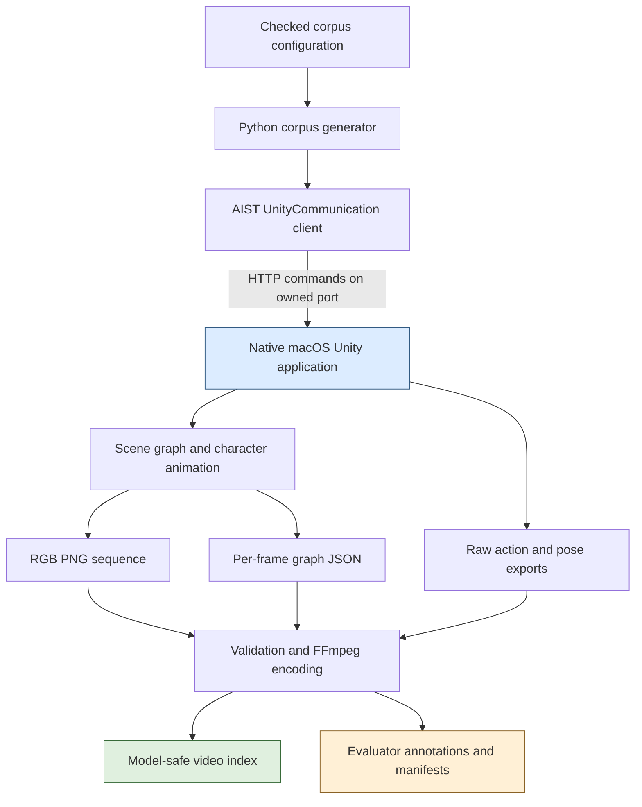
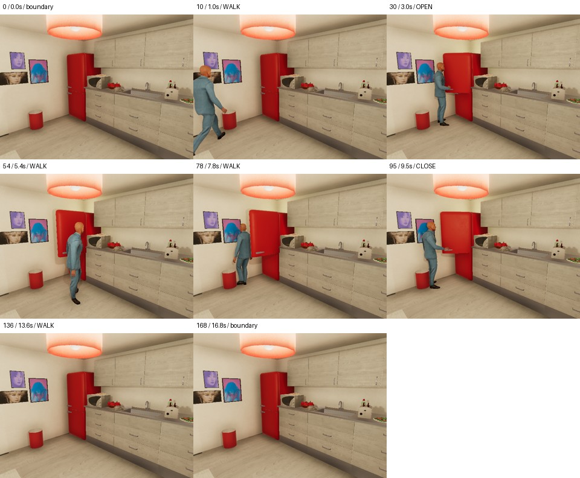
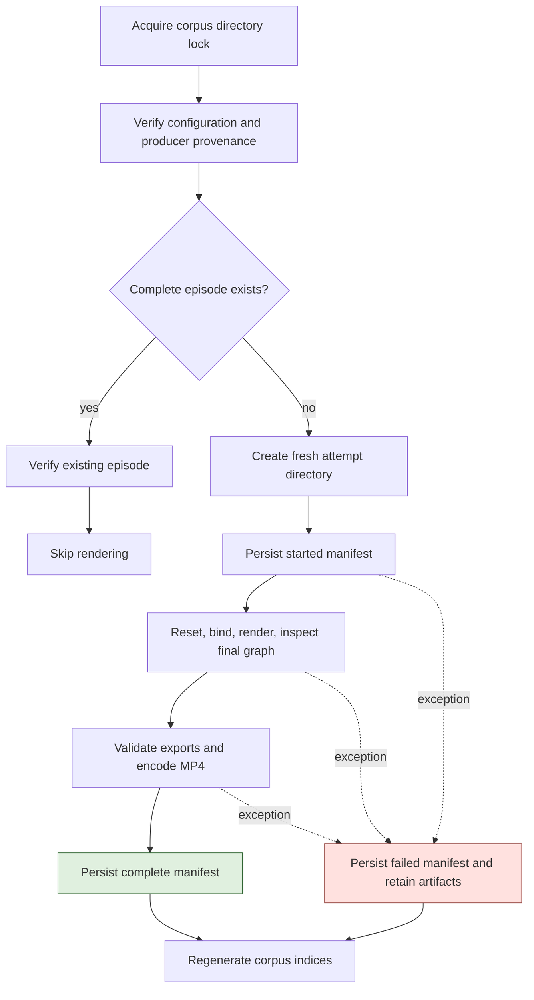
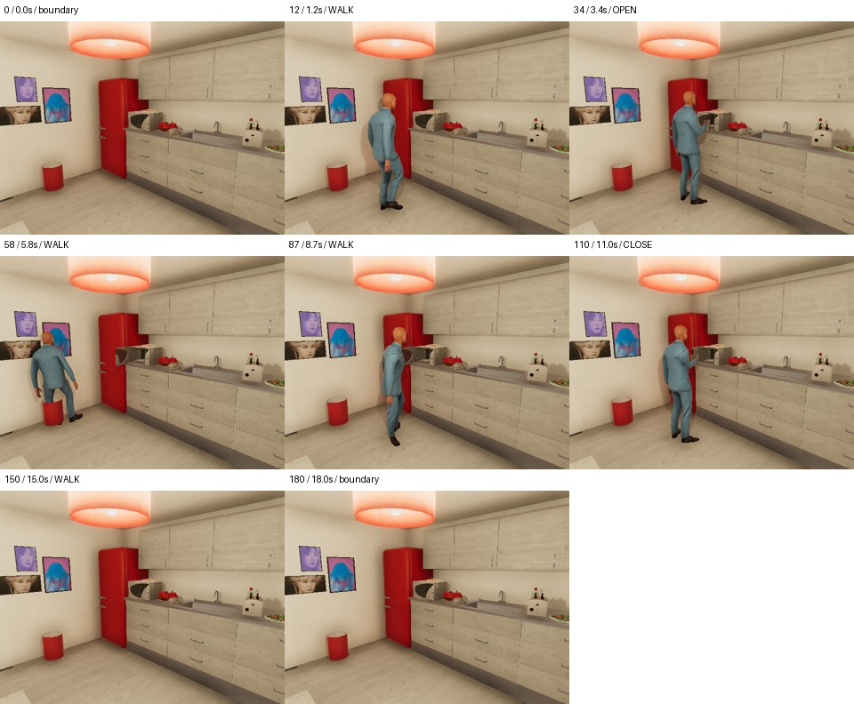
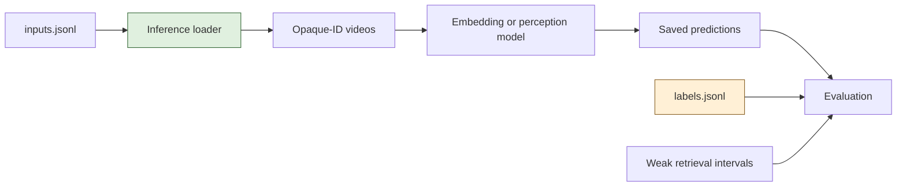

# VirtualHome on Apple Silicon: From Simulator Setup to an Audited Procedural Video Corpus

The VirtualHome setup in this project runs a native macOS simulator, executes household action programs, records RGB frames and world graphs, and turns those exports into a versioned video corpus. The completed run contains 24 videos, 4,261 paired RGB/graph frames, and 426.1 seconds of footage. The engineering result is a working data-generation system with explicit limits on what its annotations establish.

This report explains the complete path from the macOS application bundle to the files a learning system consumes. It also explains the decisions that made the result usable: binding actions to the current scene, choosing cameras from observed images, preserving failed attempts, separating evaluator labels from model inputs, and declining to treat uncalibrated simulator timestamps as exact visual boundaries.

> [!summary]
> - The installed VirtualHome-AIST application ran natively on the M1 Max using a separate Python environment and two small compatibility adjustments.
> - The household corpus completed all 24 planned episodes on their first attempts. Deep validation, full MP4 decoding, metadata auditing, and a no-op resume check passed.
> - Simulator execution, world-state truth, visible evidence, and temporal annotation quality are different properties. Each requires its own verification.
> - The current dataset supports coarse retrieval, pipeline development, and endpoint world-truth tests. Dense visual-state labels and precise action-boundary supervision remain explicitly unverified.

The source repository is `/Users/manuel/code/wesen/2026-09-06--vision`. The generator and recorded validation evidence discussed here are the completed implementation through commit `4ff12c9`. Later embedding, state-recognition, temporal-model, and verifier guides describe future application work; they are not evidence that those models have already been run on this corpus.

The earlier [[PROJ - VirtualHome-AIST - Native Apple Silicon Simulation and Video Ground Truth]] documents the installation and initial recording smoke test. This article extends that account through the completed household corpus, its validation evidence, and the remaining annotation limits.

## 1. Define the data problem before choosing the recording command

Procedural video understanding needs more than a clip and a textual description. A retrieval system needs to know which source interval produced an embedding. A state classifier needs labels that can be justified by the supplied pixels. A temporal model needs an explicit timestamp convention and uncertainty around transitions. A rule evaluator needs to distinguish what actually happened from what the program was intended to do.

The simulator provides useful access to actions and world state, but that access does not collapse these requirements into one label stream. The action program records an instruction. The execution result reports whether the simulator accepted and completed it. The world graph describes simulator entities and relationships. The RGB image records a camera observation. A generated annotation relates some of those artifacts under a particular interpretation.

| Artifact | What it directly establishes | What it does not establish by itself |
|---|---|---|
| Action program | Intended actor, action, and object binding | Successful execution or visual observability |
| Execution response | The simulator's reported outcome | Correct camera framing or calibrated timing |
| World graph | Exported simulator state and relationships | Whether that state is visible in RGB |
| RGB frame | Pixels captured from a selected view | A complete account of unobserved world state |
| Action export row | The exporter's action/index fields | A verified inclusive or half-open boundary convention |
| Reviewed image sample | A scoped visual observation | A dense label for every intervening frame |

This distinction determined the implementation sequence. First prove scene loading and one visible action. Then probe the intended activities and camera settings. Only after those checks should a batch generator produce a training corpus. A successful loop over 500 scripts would provide little value if the selected camera hid every relevant state transition.

## 2. The installed system has two executable layers

VirtualHome-AIST consists here of a Python client checkout and a compiled Unity application. The client sends HTTP requests to the application; the application maintains the scene, executes animations, and writes recording artifacts. The corpus package is a third layer built in this repository. It coordinates experiments and validates the output rather than replacing the simulator.

The [AIST repository](https://github.com/aistairc/virtualhome_aist) describes an extension of VirtualHome 2.2 with additional actions, camera modes, per-frame JSON export, and 2D bounding-box functionality. Those are upstream capabilities. Local validation in this project covers the specific action, camera, RGB, and graph paths described below; it does not certify every advertised export mode.



### Installation layout and provenance

The installation is isolated under `output/virtualhome-install/`. The Python checkout is not installed by copying code into the corpus package. A `.pth` entry adds the checkout to the virtual environment's import path, allowing the `simulation.unity_simulator` imports used by the AIST examples.

```text
output/virtualhome-install/
  .venv/bin/python
  virtualhome-aist/
    simulation/unity_simulator/comm_unity.py
  simulator/
    Modified_Camera_Build_2023_0404_Mac.app/
  installation.json
  requirements-mac.txt
  requirements-lock.txt
  start-simulator.py
  notebook.sh
  smoke_test.py
  smoke-output/
```

The recorded client revision is `122d3b0aee04768d988e02929f6eeeb38f2f28a8`. The application came from the [Door_Modified_Build_2023_0404 release](https://github.com/aistairc/virtualhome_unity_aist/releases/tag/Door_Modified_Build_2023_0404). Its archive SHA-256 is `1e5aa2fbf8467abec96d0498e2ac0a22d5b5901905df9bf984e39d3fee8fafca`. The recorded executable architecture is universal ARM64/x86_64, and the installation report records native execution on this M1 Max.

The recorded environment used Python 3.11.4 on macOS 15.7.7. Relevant installed versions included NumPy 1.26.4, OpenCV Python 4.11.0.86, Pillow 11.3.0, NetworkX 2.8.8, Requests 2.34.2, and FFmpeg 9.0.1. These are observed versions for this installation, not a recommendation to combine arbitrary current package releases. The separate `requirements-mac.txt` and installed-version inventory exist because the old dependency pins in the upstream checkout are not a reliable installation recipe for this Mac.

### The two compatibility adjustments

The downloaded application executable required its execute permission to be restored. A macOS `.app` directory is a bundle containing metadata and an executable; possessing the directory does not guarantee that the executable can run. The launcher reads `Contents/Info.plist`, obtains `CFBundleExecutable`, and executes the corresponding file in `Contents/MacOS/`.

The Python client also used `collections.Iterable` in two camera helpers. The local adjustment imports `collections.abc` and uses `collections.abc.Iterable`. This is a narrow source compatibility change, not a rewrite of the simulator. Recording the original client revision together with the local adjustment is necessary: the Git revision alone does not describe the modified files that actually executed.

The environment was later inventoried with `importlib.metadata.distributions()` because `python -m pip freeze` returned `No module named pip`. That failure did not imply that the required packages were missing. The installed interpreter could import and run the client, and its distribution metadata was sufficient to record package versions without altering the environment.

## 3. Simulator ownership is part of experiment correctness

The Unity process maintains mutable scene state. Calling `reset(0)` is therefore not an isolated read operation: it replaces the scene another caller may be using. The corpus run used its own simulator process on port 18081 and an isolated log at `output/virtualhome-corpus/unity-18081.log`. The installation's ordinary launcher defaults to 18080, so notebook and batch workflows can be kept separate.

The ticket launcher checks whether the requested port already accepts connections, locates the application executable from its bundle metadata, and calls `os.execv`. It passes `-batchmode` while keeping graphics enabled. The `-nographics` flag is inappropriate for this RGB generation path because rendering is the output being measured.

A port availability check is useful operational protection, but it is not an atomic ownership protocol. Another process could bind the port after the check, and another client could connect to an already running simulator. Similarly, the corpus filesystem lock protects one output directory, not every client connected to a simulator. The working rule remains explicit: one experiment controls its own process and port, and shutdown targets only that verified process.

The corpus creates `UnityCommunication(port='18081', timeout_wait=180)` and sends a non-retrying `idle` request to check readiness. The installed client's `check_connection()` uses a retry path whose HTTP call omits the same explicit timeout. The generator deliberately avoids that path. A per-request timeout still does not constitute a global execution watchdog; a future long-running service would need process-level cancellation and deadline handling as well.

### The initial smoke test established a small complete path

The installation test reset scene 0, observed 454 graph nodes, added `Chars/Male1`, selected a sittable sofa, and executed WALK followed by SIT. It recorded 61 RGB frames and 61 graph files at 640x480 and 10 FPS. The MP4 duration was 6.1 seconds. Inspected samples showed the character standing near the sofa and later seated.

That test established local execution and recording. It also exposed two annotation limits immediately. The raw action file contained `0 WALK 0 32` and `1 SIT 33 61`, although image indices ended at 60. The final character graph lacked an explicit `SITTING` state even though the image showed a seated pose. Neither issue prevented video generation, but both prevented treating graph fields and action endpoints as self-explanatory dense labels.

## 4. Action programs bind to entities in the current graph

The world graph contains nodes with IDs, class names, categories, properties, states, transforms, and edges describing relationships. A property such as `CAN_OPEN` is an affordance. A state such as `CLOSED` is a current exported state. An edge such as `INSIDE` relates an entity to a room. These fields answer different questions and should not be substituted for one another.

The corpus selector locates the kitchen room, collects nodes with an `INSIDE` edge to it, and chooses an appliance of the requested class with `CAN_OPEN`. It chooses the lowest matching ID deterministically and verifies that the target starts CLOSED. It also locates the neighboring appliance and destination living room. This makes selection reproducible within the loaded graph without assuming that IDs from one scene apply to another.

The actual first corpus episode used these bindings:

```json
{
  "char0": 1,
  "target": 308,
  "neighbor": 316,
  "destination": 342
}
```

The program token `<char0>` denotes actor ordinal zero. It does not mean graph entity zero. In this run it mapped to graph entity 1. The target fridge happened to be entity 308, the microwave 316, and the destination room 342. Those numbers are evidence from this scene, not portable object identifiers.

```text
<char0> [Walk] <fridge> (308)
<char0> [Open] <fridge> (308)
<char0> [Walk] <microwave> (316)
<char0> [Walk] <fridge> (308)
<char0> [Close] <fridge> (308)
<char0> [Walk] <livingroom> (342)
```

The useful invariant is that every rendered program is saved together with the graph bindings and the scene snapshots from which they were derived. A video cannot be interpreted reliably if its program names an object ID whose meaning has been lost.

## 5. Camera selection changed the dataset design

The initial action probes included a fridge, microwave, faucet, and television. Successful execution did not make every family useful for learning. Automatic faucet views produced extreme close-ups with little useful actor/state evidence. Television cutaways obscured the relevant screen. The first fixed kitchen camera was too high and placed a hanging lamp in front of the target region.

The selected camera lowered its position to `[-0.3, 1.65, -4.8]` and looked toward `[-3.0, 1.0, -2.0]`. The generator computes pitch and yaw from the difference between these positions. For displacement `(dx, dy, dz)`, the implementation uses `atan2(-dy, hypot(dx, dz))` for pitch and `atan2(dx, dz)` for yaw, converting to degrees. Each initialization group adds a small x offset before recomputing rotation.

A camera index in the scene is distinct from an output stream index. The first completed corpus episode recorded camera ID 103, while its file names used stream 0. The generator records both. Assuming that `Action_0000_103_normal.png` must exist because camera 103 was selected would be incorrect for this export layout.

The camera design is deliberately narrow. Both appliances remain in view, making their final geometry inspectable. The actor still partially occludes the microwave during manipulation, and the camera does not provide a direct view of every point in the living room. These limits matter when interpreting departure and continuous-state rules.



*Figure 1. Sampled frames from episode `ep-34efcd7e3f0dcbb3`. The frame labels identify sampled positions in weak action interiors. They do not certify the exact visual onset or completion of each action.*

## 6. The corpus varies procedure outcomes within four groups

The checked configuration defines two appliance families, three program variants, and four initialization/view groups. The Cartesian product produces 24 episodes. All six episodes in a group stay together in one partition.

| Group | Split | Action seed | Camera x offset | Episodes |
|---|---|---:|---:|---:|
| g01 | train | 101 | 0.00 | 6 |
| g02 | train | 202 | 0.15 | 6 |
| g03 | development | 303 | -0.15 | 6 |
| g04 | test | 404 | 0.30 | 6 |

The normal variant opens the target, walks to the neighboring appliance, returns, closes the target, and leaves. The omission variant performs no CLOSE before leaving. The reopening variant closes the target, opens it again, walks to the neighbor, and then leaves. The appliances are never switched on; the target behavior is door-state manipulation.

The detour is an experimental design choice. An early open-close fridge pilot did not expose a reliable intermediate OPEN state in the per-frame graphs. A separate open-only run ended OPEN and showed an open door. Adding a walk to the neighbor lets the open state persist visibly for longer and creates useful samples after the actor moves away. It improves observability, but it does not establish a precise alignment between graph updates and image capture.

The reopening variant is especially useful because a CLOSE action occurs, yet the final state is open. A system that only remembers that closure happened can fail this example. At the same time, the variants differ in action count and duration. A classifier may exploit those differences instead of understanding the state sequence. These are grouped procedural variations, not perfectly controlled counterfactual pairs.

Within a group, the first episode inserts the character by room and saves its position. Subsequent episodes reuse that position. The initial transform is recorded, but the insertion API is not given the full saved orientation, and full rendering determinism was not verified. The smoke recording and full-corpus recording even produced different durations for the same opaque episode ID because their fresh run initializations differed. The ID identifies a planned scenario slot within a named corpus; video hashes identify the actual rendered content.

## 7. A render attempt is a persisted state machine

The generator separates pure corpus contracts in `src/virtualhome_corpus/core.py` from orchestration in `runner.py`. The pure functions validate configuration, plan episode identities, choose scene objects, construct programs, parse action exports, pair frame files, compute camera orientation, and evaluate endpoint truth. The runner handles process communication, filesystem state, image decoding, FFmpeg, manifests, and corpus indices.



At the root, `corpus.json` freezes the configuration, configuration hash, installation metadata, and SHA-256 hashes of `core.py` and `runner.py`. `plan.json` stores the planned cases. Resume compares the current header with the stored one and refuses a changed configuration, installation record, or producer hash. The error asks for a fresh output directory. This avoids quietly mixing different export semantics in one run.

Each episode gets monotonically numbered directories such as `attempt-0001`. The attempt manifest and episode-level manifest are both updated, with the latter pointing to the latest attempt. If rendering or validation raises an exception, the attempt is marked failed and its files remain available. The command stops rather than hiding the failure by continuing with an apparently complete dataset.

```python
# Simplified orchestration matching the implemented lifecycle.
with corpus_lock(root):
    verify_or_create_run_header(root, configuration, producer)
    for case in planned_cases:
        if complete_manifest_exists(case):
            validate_existing_episode(case)
            continue
        attempt = create_new_attempt(case)
        persist(attempt, status="started")
        try:
            reset_bind_and_record(case, attempt)
            check_executed_endpoint(attempt)
            validate_and_encode_exports(attempt)
            persist(attempt, status="complete")
        except Exception as error:
            persist(attempt, status="failed", error=str(error))
            raise
```

JSON publication writes a temporary sibling file and replaces the target. That prevents readers from observing a half-written individual JSON document under ordinary operation. It is not a transaction across both manifests and all indices, and the implementation does not add explicit file/directory `fsync` calls. A power-loss durability claim would require more work. Likewise, `inputs.jsonl` and `labels.jsonl` are regenerated through direct file writes, so external readers should consume them after generation completes rather than assuming live snapshot isolation.

The provenance header is valuable but intentionally incomplete as an environment lock. It hashes the two producer modules and records installation metadata; the installed-package inventory is a separate artifact. Changes in FFmpeg, transitive dependencies, or a simulator binary replaced without updating metadata could escape the header check. Reproduction requires the recorded environment and artifact hashes as well as the code-level guard.

## 8. Recording produces an artifact set, not just an MP4

The recording call passes the saved program, an absolute attempt directory, ten frames per second, 640x480 dimensions, a fixed camera index, pose export, and graph export on every frame. The installed client serializes recording parameters into the request's `stringParams` alongside the action program and sends a `render_script` command over HTTP.

| Client method | Return shape used locally | Responsibility |
|---|---|---|
| `reset(scene_index)` | Boolean | Replace the current scene |
| `add_character(resource, position=...)` | Boolean | Insert the controlled character |
| `environment_graph()` | Success/result pair | Obtain current nodes and edges |
| `camera_count()` | Success/result pair | Determine the next camera index before insertion |
| `add_camera(position, rotation)` | Success/result pair | Add the fixed recording camera |
| `render_script(program, ...)` | Success/result pair | Execute and optionally record the action sequence |

These conventions are drawn from the installed `simulation/unity_simulator/comm_unity.py`. A generic wrapper that assumes every method returns a tuple would mishandle `reset` and `add_character`. Checking the actual interface is necessary before interpreting a result as success.

The attempt directory retains the following structure:

```text
episodes/ep-34efcd7e3f0dcbb3/
  manifest.json
  attempt-0001/
    manifest.json
    actions.txt
    graph-before.json
    graph-initial.json
    graph-after.json
    annotations.json
    world-frames.jsonl
    world-state-runs.json
    contact-sheet.jpg
    video.mp4
    episode/0/
      Action_0000_0_normal.png
      Action_0000_0_graph.json
      ...
      ftaa_episode.txt
      ... additional raw pose/action exports ...
```

The raw graph JSON files contain a UTF-8 byte-order mark in this installation. Reading them with `encoding='utf-8-sig'` handles that prefix while preserving ordinary UTF-8 decoding. The pairing logic extracts numerical frame and stream indices from file names, rejects duplicate frame keys or multiple camera streams, requires identical RGB/graph key sets, and requires contiguous image indices starting at zero.

Those checks precede FFmpeg. A missing numbered PNG can truncate image-sequence decoding, and files left by a previous run can produce an incorrect frame count. Fresh attempt directories and contiguous-key validation prevent these two failure modes from being hidden by a successful encoder exit code.

FFmpeg reads `Action_%04d_0_normal.png` at the configured rate and writes H.264 with `yuv420p` pixels and `+faststart`. The stream number in the pattern is obtained from the parsed files rather than assumed from the scene camera ID. FFprobe then verifies dimensions, frame rate, frame count, and duration. For the first full-corpus episode, 169 frames at 10 FPS correspond to 16.9 seconds.

This presentation clock is defined by the encoded sequence. It does not establish when a graph update occurred relative to the corresponding render operation. More generally, the formula `frame_index / fps` is appropriate to this fixed-rate export but cannot replace source presentation timestamps when real variable-frame-rate recordings are introduced.

## 9. Weak action interiors preserve uncertainty explicitly

The first full-corpus fridge episode produced this raw action file:

```text
0 WALK 0 21
1 OPEN 22 38
2 WALK 39 69
3 WALK 70 86
4 CLOSE 87 103
5 WALK 104 169
```

The four fields are a source-program index, action token, start value, and end value. The final endpoint is 169 while the images run from index 0 to 168. Earlier TV and faucet probes also inserted WALK rows and repeated a source-program index. A parser that zips one export row with each program line would therefore misalign labels even when every row parsed numerically.

`parse_action_export` preserves the original row, the raw endpoints, the source-program line, and the unresolved endpoint convention. It checks source index range, `0 <= start <= end <= frame_count`, chronological start ordering, and overlap between the derived interiors. Empty exports fail. Very short rows can be retained with no usable interior.

For guard size g and frame count N, the derived interval is:

$$
\mathrm{lo} = \mathrm{start} + g,\qquad
\mathrm{hi} = \min(N,\mathrm{end} - g).
$$

Only when `hi > lo` does the parser emit the half-open interior `[lo, hi)`. With g = 2, the raw OPEN row `22 38` yields `[24, 36)`, corresponding to presentation interval `[2.4, 3.6)` seconds. The calculation is exact under the chosen export rule; its alignment with physical motion remains unverified.

```python
# Reduced form of the implemented interval transformation.
lo = raw_start + guard
hi = min(frame_count, raw_end - guard)
interior = None
if hi > lo:
    interior = {
        "start_frame": lo,
        "end_frame_exclusive": hi,
        "start_us": lo * 1_000_000 // fps,
        "end_us": hi * 1_000_000 // fps,
    }
```

Trimming avoids relying on the exact edge frames, but it is not a calibrated error bound. If an exporter update or an animation has a larger or variable offset, the guard does not prove that all retained frames belong to the named visible action. The annotation object therefore records:

```json
{
  "action_endpoint_convention": "unresolved",
  "graph_image_capture_phase": "unverified",
  "precise_boundary_supervision_allowed": false,
  "dense_visual_state_supervision_allowed": false,
  "action_quality": "weak_program_supervision"
}
```

The world-state stream has its own quality marker. Each row records a frame index, presentation time, target-state list, and relative path to its raw graph. Consecutive identical state lists are also summarized as half-open runs in `world-state-runs.json`. Run-length encoding makes inspection easier; it does not improve the underlying observation semantics.

## 10. Endpoint truth is checked against the executed graph

The endpoint evaluator checks three conditions. The character must have an `INSIDE` edge to the destination room. The target must have exactly one of OPEN and CLOSED. Its actual final state must agree with the intended variant. If those conditions fail, the episode is not accepted as a successful training example for that variant.

This is stronger than assigning a PASS label solely because the program contains CLOSE. The reopened variant contains CLOSE but is expected to finish OPEN. The final graph establishes whether the simulator actually reached that result.

The saved verdict also narrows its claim:

```json
{
  "rule": "close_target_before_departure",
  "scope": "episode_endpoint_world_truth",
  "verdict": "PASS",
  "target_states": ["CLOSED"],
  "destination_reached": true,
  "exact_departure_time_verified": false,
  "pixel_observability": "unverified"
}
```

The rule name is broader than the evidence scope unless the reader pays attention to the remaining fields. The implementation checks the final state and final room membership. It does not prove the exact departure moment, uninterrupted closure before departure, or visibility of the relevant state throughout the interval. Downstream rule evaluation must retain that scope rather than promoting the endpoint verdict into stronger temporal ground truth.



*Figure 2. The microwave door is visible during the detour and at the final sample, while manipulation can partially occlude it. This contact sheet supports a sampled visual review. It is not a label for every intervening frame.*

## 11. Separate model inputs from evaluator information

The generator writes two indices. `inputs.jsonl` contains only episode ID, split, split group, video path, and video SHA-256. `labels.jsonl` adds family, intended variant, annotation path, and endpoint rule truth. Videos use opaque episode identifiers rather than outcome-bearing filenames.

This separation prevents a common experimental failure: giving a model the answer through a prompt, path, or metadata field. It is a data contract rather than an access-control system. The files exist in the same corpus directory, so the downstream loader must actually respect the contract. A model that receives the labeled inspection gallery or the full manifest is no longer receiving pixels alone.



Four retrieval query families describe opening and closing each appliance. Their relevant intervals come from the weak action interiors. Each interval carries the episode split so an evaluator can apply a partition consistently to both candidates and relevance labels. These are starter queries for coarse retrieval, not a broad query benchmark.

The index exporter also checks that a split group does not appear in multiple partitions and that an identical video SHA-256 does not cross partitions. The independent audit compares planned cases, manifest metadata, and index rows. These checks detect particular forms of leakage. They do not detect all perceptual near-duplicates, shared scene textures, or correlations between duration and label.

The statistical unit is also limited. There are 24 episodes but only four grouped initializations/views, one scene, and one character resource. Thousands of neighboring frames are not thousands of independent tests of generalization. A high test score in this corpus may establish that an implementation functions on a controlled apartment, while saying little about an unseen home.

## 12. What the validation actually demonstrated

Validation was performed in several layers because no single successful command proves the whole artifact set is correct. The ten unit tests cover planner grouping, invalid configurations, program variants, inserted action rows, malformed/overlapping intervals, mismatched frame sequences, actual endpoint checking, provenance changes, lock exclusion, and encoded metadata mismatches.

The complete run then exercised the real simulator and exporter. A deep validation pass loaded all 4,261 source images and graph files, checked dimensions and structure, verified video hashes and media metadata, recomputed action annotations from the raw rows, and checked executed endpoints. A separate FFmpeg decode traversed every MP4 with errors treated as failures.

The ticket's independent audit additionally compared the corpus plan with episode identities, producer/installation metadata, model-input rows, evaluator-label rows, actual final graph truth, and every world-frame state row against its referenced raw graph. These are cross-artifact consistency checks. They do not independently validate that a graph state is visually observable.

| Check | Recorded outcome | Remaining limit |
|---|---|---|
| Unit contracts | 10 tests passed | Small fixtures do not establish simulator semantics |
| Full generation | 24 completed, 0 failed | One apartment and one character resource |
| Deep asset validation | 4,261 RGB/graph pairs accepted | Matching keys do not certify capture phase |
| Complete MP4 decoding | All 24 decoded without errors | Decode validity is not action visibility |
| Plan/metadata audit | Plan, indices, labels, and state rows agree | Agreement can preserve an uncalibrated source convention |
| Contact-sheet review | All four groups sampled; no gross camera failure recorded | Not exhaustive playback or frame-level annotation |
| Resume | No new attempts; manifest hashes and mtimes unchanged | Does not prove all possible crash points recover correctly |

The resume test is particularly concrete. The generation command was repeated with the same provenance and simulator port. Completed episodes were validated and skipped. The run produced no rendering events, retained exactly 24 attempt directories, and left every episode manifest's content hash and modification time unchanged. The simulator was then stopped after its PID and command line were verified.

This report uses those persisted validation results rather than rerunning generation during documentation. The current `validate` command also regenerates index files, so it is not strictly a read-only command despite its name. That behavior is relevant when another process is consuming a corpus or when preserving a historical run snapshot.

## 13. Measured scale and cost

The completed run contains 12 fridge and 12 microwave episodes. There are eight normal closure cases, eight closure omissions, and eight reopening cases. Endpoint evaluation yields eight PASS and sixteen VIOLATION verdicts. The split is 12 training, six development, and six test episodes.

The sum of per-episode generation/export elapsed times is 600.735 seconds. Dividing by 426.1 recorded seconds gives approximately 1.41 wall seconds per video second. This measurement includes each episode's reset, setup, rendering, export inspection, and encoding work within the timed function. It is not a pure GPU rendering benchmark, and it excludes earlier installation/probe work and later corpus-wide audits.

MP4 files total 7,661,124 bytes, approximately 7.31 MiB. The entire corpus directory occupies about 2.5 GB in the recorded disk-usage check because it retains raw PNGs, per-frame graphs, manifests, and inspection artifacts. The difference is operationally important: compressed playback video is inexpensive compared with retaining the complete evidence needed to diagnose annotation and rendering behavior.

The repository ignores `output/`. Code, configuration, reports, and compact inventories are committed; the application bundle, environment, raw frames, and generated videos remain local assets. Git history alone therefore does not recreate the full corpus. Moving the experiment to another machine requires transferring the selected assets or reproducing them from the recorded installation and run specifications, while acknowledging that fresh rendering is not fully deterministic.

## 14. Reproducing the workflow on the existing installation

The commands below operate from `/Users/manuel/code/wesen/2026-09-06--vision` and use the already installed environment. They are operational instructions for a future run, not actions executed while writing this article. Use a fresh output directory for a new experiment, and do not reset another process's simulator.

Set a task-specific ticket path once to keep the commands readable:

```sh
cd /Users/manuel/code/wesen/2026-09-06--vision
vh_ticket=ttmp/2026/09/06/COSMOS-VIDEO-001--cosmos-and-video-embeddings-a-procedural-video-lab-on-apple-silicon
```

Start the owned graphics-enabled simulator in its own terminal:

```sh
output/virtualhome-install/.venv/bin/python \
  "$vh_ticket/scripts/07-launch-corpus-simulator.py" \
  --port 18081
```

Inspect the plan or run the contract tests before recording:

```sh
PYTHONPATH=src output/virtualhome-install/.venv/bin/python \
  -m virtualhome_corpus plan

PYTHONPATH=src output/virtualhome-install/.venv/bin/python \
  -m unittest discover -s tests -v
```

A smoke run should use its own output directory. Reusing that same configuration and directory allows resume; changing exporter source hashes requires a fresh directory.

```sh
PYTHONPATH=src output/virtualhome-install/.venv/bin/python \
  -m virtualhome_corpus generate --port 18081 \
  --output output/virtualhome-corpus/my-smoke --limit 1
```

For a complete new corpus, omit the limit and choose another fresh directory. After generation, run deep validation and generate the local evaluator gallery:

```sh
PYTHONPATH=src output/virtualhome-install/.venv/bin/python \
  -m virtualhome_corpus validate \
  --output output/virtualhome-corpus/my-run --deep

output/virtualhome-install/.venv/bin/python \
  "$vh_ticket/scripts/10-build-corpus-gallery.py" \
  --root output/virtualhome-corpus/my-run
```

The complete current corpus already has `output/virtualhome-corpus/home-v1/gallery.html`. It references local videos and labeled sheets through relative links. Opening it does not require a running simulator. Notebook users can launch the installed `notebook.sh`, but they must connect to their own chosen port and adapt upstream examples that assume another platform or a default port.

## 15. The next improvement is label calibration

The current implementation has already answered the basic feasibility question: this Mac can execute the selected VirtualHome routines and produce validated video plus graph exports. The next data-quality question is how accurately each export describes observable transitions.

A useful calibration experiment isolates OPEN and CLOSE, leaves a visible dwell between them, and inspects native-resolution transition neighborhoods. For each transition, record the last frame in which the previous state is definite and the first frame in which the new state is definite. Their times define a visual uncertainty bracket. Compare that bracket with both the raw action row and the graph-state transition across repeated actions, appliances, and camera views.

If offsets vary, a single global frame correction is unjustified. If the graph never exposes an intermediate state, no offset can recover that missing observation. If the actor blocks the appliance, the correct visual label can remain unknown even when the world graph is unambiguous. Calibration should publish eligibility by subset and task rather than setting one global "ground truth verified" flag.

Dataset expansion should retain VirtualHome and the working generator, as explicitly selected for this project. New scene indices need capability probes: the current selector assumes a kitchen with both appliances and a living-room destination. New viewpoints need inspection before mass rendering. Variants should have lineage IDs so alternate views and related initializations remain in the same partition.

For stronger procedural evaluation, add duration-matched distractors, repeated events, irrelevant movement, and independently reviewed state/action labels. Preserve the v1 corpus as a historical baseline. Do not turn its test group into training data and continue reporting the old test score as though its meaning had not changed.

## 16. Source map and review entry points

All paths below are relative to the source repository unless an absolute location is shown. They identify the implementation and evidence used for this report; they are not Obsidian wikilinks to nonexistent vault files.

| Source | Where to start | What it explains |
|---|---|---|
| `docs/playbook/virtualhome-video-generation.md` | Installation and smoke sections | Environment, first observed action, import path, compatibility adjustments |
| `docs/playbook/virtualhome-corpus.md` | Generation/resume and annotation limits | Supported corpus commands and output contracts |
| `configs/virtualhome-household-v1.json` | Complete configuration | Families, variants, groups, sampling, and camera |
| `src/virtualhome_corpus/core.py` | Lines 55, 67, 87, 102, 143, 167 | Planning, binding, programs, intervals, pairing, endpoint truth |
| `src/virtualhome_corpus/runner.py` | Lines 54, 110, 125, 202, 228, 272 | Export validation, locking, attempts, validation, indices, resume |
| `tests/test_virtualhome_corpus.py` | Ten `CorpusTests` cases | Regression contracts and deliberate failure fixtures |
| `output/virtualhome-install/installation.json` | Recorded installation metadata | Source revision, release, architecture, archive hash |
| `output/virtualhome-install/virtualhome-aist/simulation/unity_simulator/comm_unity.py` | Lines 121, 175, 214, 291, 332 | Installed API and recording parameter serialization |

The umbrella ticket is `ttmp/2026/09/06/COSMOS-VIDEO-001--cosmos-and-video-embeddings-a-procedural-video-lab-on-apple-silicon/`. Its `reference/02-virtualhome-corpus-implementation-diary.md` records the camera and annotation probes, implementation decisions, failures, and validation history. Its `design-doc/03-virtualhome-household-corpus-design-and-generation-report.md` describes the corpus design and final run.

The same ticket's `various/corpus-result-inventory.json`, `corpus-validation.json`, `corpus-runtime-versions.json`, and `corpus-visual-review.json` contain the compact evidence behind the numerical claims here. `scripts/10-build-corpus-gallery.py` constructs inspection sheets and playback pages, while `scripts/11-audit-corpus.py` checks plan and cross-artifact consistency. The copied figures in this note come from the completed v1 attempts, not the earlier smoke run.

The implementation milestones were `d005b3f` for action/camera probes, `c6dc24a` for the generator and contracts, `b63965f` for inspection tools and completed render records, and `1417810` for validation evidence. Commit `4ff12c9` closed out delivery bookkeeping. These references allow the reader to separate completed generation behavior from later design work in the same repository.

## 17. What this setup establishes

The useful property of this setup is that its outputs can be traced back to executable actions, scene bindings, recording parameters, raw exports, and explicit validation checks. That makes failures diagnosable and future label improvements possible without pretending that the first dataset already supports every downstream claim.

The next embedding experiment can consume opaque video inputs and measure retrieval. A state-recognition experiment can begin with reviewed visible samples. A temporal experiment can use weak interiors while preserving uncertainty at boundaries. A rule experiment can use the verified endpoint labels for a narrowly defined oracle test. Each step can add evidence without changing the meaning of the artifacts already produced.
