# PBUI Visual Onboarding: From Shared Widgets to Executable Design Guidelines

A design system becomes useful to a new developer when it explains which components to choose, how those components compose, and how to verify the result. A token file cannot answer all three questions. Neither can a screenshot gallery or a collection of component props. PBUI already had shared widgets, visual conventions and substantial documentation; this project made those sources agree and connected them to a compiled example that can be inspected and tested.

The work followed the TTC SQL interface refactor. That feature had been adapted to Turboproof and Datalab references by adopting PBUI controls, syntax-aware editing, tokenized table geometry and Storybook fixtures. The implementation succeeded, but it also showed how much a new developer had to infer from source and historical reports. The resulting documentation audit is recorded in [[PROJ - TTC SQL UI Refactor - Matching PBUI Through Components Tokens and Visual Evidence]]. This report describes the subsequent implementation: current guides, reconciled existing documentation, a native workbench example, automated checks and ticket-owned visual evidence.

> [!summary]
> **Original onboarding checkpoint:** PBUI has a single visual-onboarding entry point, four connected guides, revised application/package guidance and a compiled nine-story example. The example uses shared widgets and the native shell rather than copied chrome. Tests cover documentation targets and basic interaction; browser review caught and corrected a real theme-wrapper layout defect. Eleven original screenshots remain in PBUI-VISUAL-1, with selected copies embedded here.
>
> **Styling follow-up, completed September 6 locally / September 7 UTC:** PBUI-STYLE-002 applied those contracts to inspectors, sandbox devtools, chat references/cards, operational tiles and select controls. All three phases are committed locally, with 2,479 passing tests, browser acceptance, 35 ticket-owned captures and seven verified physical print receipts. Sections 12–17 describe this implementation; the earlier account remains historical.

## 1. Define the contracts that produce a consistent interface

Visual consistency is not identical markup. A code editor, a source browser and a result table need different structures. They can nevertheless share typography roles, spacing, surface hierarchy, action controls and state treatment. The important distinction is between a reusable visual contract and the domain-specific content rendered through it.

In PBUI, these responsibilities are distributed across three layers. Core PBUI supplies token defaults, foundational typography, controls, compound widgets and presentation mechanics. The workbench package supplies the React shell, tile surface and native layout/wiring interactions over workbench-core. The product supplies domain data, authorization, execution and state lifetime. A style guideline that ignores these boundaries will encourage either excessive copying or inappropriate dependencies.

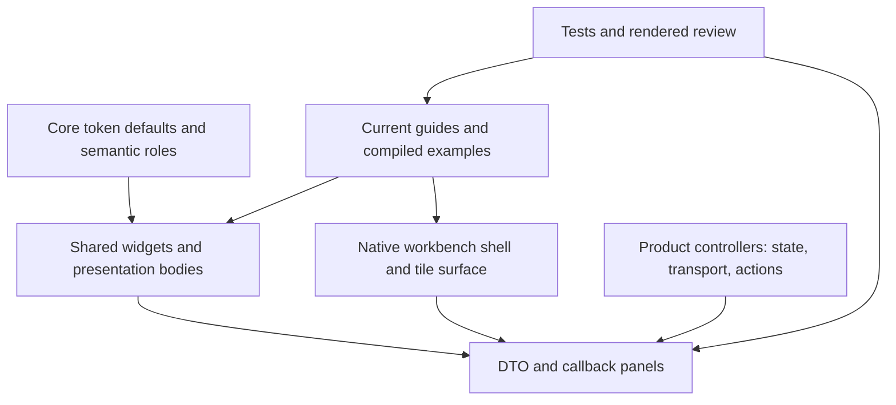

The dependency direction matters. A panel may calculate whether a supplied state permits a button, but it should not secretly fetch credentials or resolve remote authorization. The controller can supply callbacks without forcing every visual fixture to start a server. Conversely, a native workbench story must actually instantiate the shell and document if it claims to demonstrate native behavior. A hand-drawn frame can illustrate a panel but cannot establish the workbench integration contract.

The documentation now makes this distinction explicit. It also avoids turning atoms/molecules/organisms into an alternative permission system for side effects. Those terms describe composition complexity. The practical boundary is still controller versus presentational panel.

## 2. Tokens define roles, not merely available colours

The authoritative PBUI defaults live in `src/tokens.css`. They include a five-size type scale, six spacing steps, surface and border roles, status colours, object-kind tones and focus treatment. The shared font stack begins with IBM Plex Mono and falls back to platform monospace families. The type sizes are 8.5, 9.5, 10.5, 11.5 and 13 pixels; the spacing steps are 2, 4, 6, 10, 16 and 24 pixels.

These values explain the family’s density, but copying them into a product stylesheet would be the wrong adoption strategy. A copied default stops tracking a future shared correction. Consumers should inherit defaults and declare only intentional differences. PBUI wraps its defaults in `:where(:root)`, whose zero specificity allows an ordinary consumer `:root` override to win without depending on a fragile contest between equally specific rules.

| Role | Meaning in the interface |
|---|---|
| `pane`, `paper` | Ordinary readable surface |
| `pane-alt` | Secondary or alternating surface |
| `wash` | Canvas outside tiles |
| `tag-wash` | Neutral marker fill, without selection meaning |
| `selected` | Selected or accepted target, not a general accent |
| `selected-wash` | Lighter hover treatment where the component defines it |
| `ink`, `faint` | Primary and supporting text |
| `danger`, `ok` | Reinforcement for explicit error/success states |
| `tone-*` | Object kind rather than arbitrary execution status |
| `border-grid`, `border-hair`, `border-firm` | Internal separators, region boundaries and stronger framing |

A syntactically correct token reference can still be semantically wrong. Using the selection fill for every running, truncated or highlighted state removes the distinction between selection and status. This was one of the residual concerns identified in the SQL refactor. The new visual guide therefore explains the roles and the incorrect uses, not just their names.

The token-check documentation also received a precise correction. The set of referenced variables minus the set of defined variables identifies potentially missing definitions. It cannot identify a declared variable that nobody reads; that is the reverse set difference. Neither query proves contrast, semantic correctness or whether a stylesheet reaches the browser. A test’s scope must be stated as carefully as an API’s scope.

### Stylesheet reachability is a separate requirement

A shared component can render incorrectly when its CSS is absent even though its props and JavaScript are correct. The normal consumer imports core `styles.css` and the stylesheet of any additional package it uses, such as workbench or editor. Core’s complete stylesheet is not a request to import all of its granular subpaths again.

```ts
import "@hyperslop-systems/pbui/styles.css";
import "@hyperslop-systems/pbui-workbench/styles.css";
// When the product uses the shared code editor:
import "@hyperslop-systems/pbui-editor/styles.css";
```

Core’s stylesheet-wiring and token-definition tests guard library source. They do not automatically inspect the consuming application’s entry points. Runtime and Storybook need an explicitly shared foundation, with any feature-specific differences recorded. A comment saying that both load the same styles is weaker than a source-level parity assertion, and source parity is still weaker than inspecting the final rendered page.

The new styling contract separates these checks. It also retains the practical warning for Go-embedded frontends: a Storybook build must override production Vite output settings so it does not overwrite the embedded application assets.

## 3. Shared widgets preserve behavior as well as appearance

The first decision when implementing a region is whether PBUI already provides it. This is not simply an effort-saving rule. Shared controls preserve input semantics, accessible naming, keyboard behavior and state treatment in addition to borders and typography.

The visual guide now includes a replacement catalogue. Button and IconButton represent actions; TextInput, SelectInput and TextArea represent controlled input; Toolbar and Stack supply bounded composition; AppBody supplies scrolling content; EmptyState distinguishes empty/loading regions; Callout presents information and failures; Chip represents inert markers; KeyValueList presents detail; SectionLabel supplies the shared label treatment. CodeEditor is a separate package for code-aware editing.

Adoption still requires reading the current API. An `accessibleName` does not draw visible text. A visible `<label>` and an accessible name can both be needed. Button defaults to `type="button"`, so replacing a raw form-submit button without preserving submission semantics can break the form. Select options use `disabledBecause`; maintaining a separate boolean and reason invites disagreement between whether an option works and what the interface says about it.

### Typed objects should not acquire a new appearance at every call site

PBUI’s `Presentation` supplies behavior without prescribing every child. That flexibility is necessary for arbitrary domain content, but it also permits the same object to be drawn differently in a table, detail header and line item. The existing `ObjectChip` solves the common case: the product-bound runtime supplies a shared chip body and descriptor label while retaining the presentation behavior.

The new guides explicitly distinguish plain Chip from `pbui.ObjectChip`. The former is suitable for inert status/type markers. The latter requires the product’s provider and declared type. A custom Presentation body is still appropriate for genuinely different content; it should not be the default way to redraw an ordinary object label. Nor should a caller add another framed box around a representation that already has a frame.

This distinction came from the existing PBUI-VISUAL-1 feedback history, not from inventing a new widget during the documentation pass. The implementation made that existing solution discoverable from the root README and visual guide.

### Reuse the component whose semantics fit

The SQL case supplies an important counterexample to indiscriminate component reuse. Datalab’s TablePanel carries field/datum presentations and a row-object model. SQL result evidence uses positional string/null arrays, permits duplicate aliases and preserves exact decimal/BIGINT strings. Converting it into an object merely to import a visually similar table can overwrite columns or change values.

The correct reuse level may therefore be the shared typography and table recipe rather than the entire domain component. The guideline now tells developers to inspect a component’s data and interaction contract before adopting it. This avoids treating visual similarity as proof of semantic compatibility.

## 4. Build a small example that participates in the real toolchain

The new example lives in:

`packages/pbui-workbench/src/stories/StyledPanel/`

It has a component module, CSS module, story file, test file and named-export barrel. This location is deliberate: the example participates in the workbench’s existing typecheck, tests and Storybook build, rather than remaining an uncompiled Markdown fragment. Core/workbench’s stricter folder tests remain intact.

StyledPanel receives a controlled value, a bounded state, callbacks and an optional details slot. StyledPanelDemo owns the fixture state. StyledWorkbench supplies the real native host. The example is synthetic, has no backend and performs no persistence.

```ts
export type PanelState =
  | "ready"
  | "loading"
  | "empty"
  | "error"
  | "disabled";

export interface StyledPanelProps {
  value: string;
  state?: PanelState;
  onValueChange(value: string): void;
  onInspect(): void;
  details?: ReactNode;
}
```

The panel derives a disabled condition from its inputs. It does not consult an ambient service. The controller records the inspected value only when the user explicitly clicks Inspect. Editing changes the input, not the inspection action. That simple separation makes the example suitable for teaching the behavior without implying an execution service exists behind it.

Visible labels use React `useId` to associate a label and input uniquely when several instances mount. The same input carries `accessibleName="Fixture name"`. KeyValueList renders the fixture name and the exact string amount `"120.00"`. Error and information regions reuse Callout rather than introducing another local notice style.

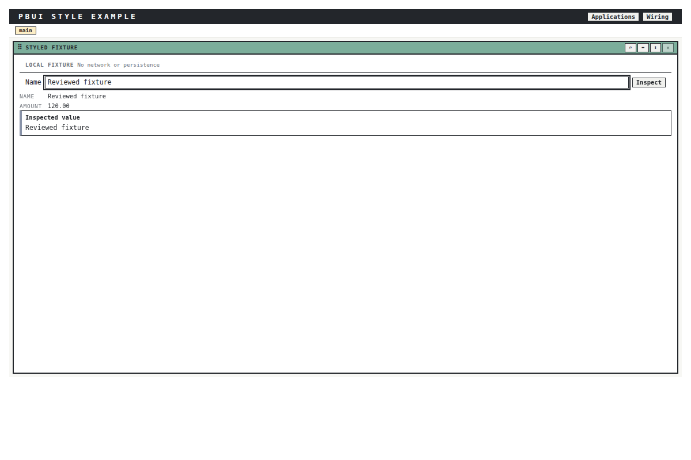

The image shows the actual compiled native story after changing the input to “Reviewed fixture” and clicking Inspect. The browser viewport was 1200×800 CSS pixels; the AppShell measured 1168×640 inside Storybook’s padding. This is a synthetic local interaction, not a server response.

### Native composition is not copied chrome

StyledWorkbench constructs a workbench once per mount through a lazy state initializer, registers its fixture application using `defineWorkbenchApp`, and supplies a real initial layout. The declaration separates manifest policy from presentation, including the existing `--pbui-tone-order` role.

```ts
const [workbench] = useState(() => createWorkbench({
  apps: [defineWorkbenchApp({
    manifest: {
      id: "styled-fixture",
      viewCardinality: "one",
      duplicatePlacement: "link",
    },
    presentation: {
      title: "Styled fixture",
      tone: "var(--pbui-tone-order)",
      Component: () => <StyledPanelDemo />,
    },
  })],
  initial: layout(tile("styled-fixture")),
}));
```

AppShell receives the actual WorkspaceStrip and visible Applications/Wiring buttons. Its content includes the bound Surface, Launcher and Rebalance components. The example does not duplicate a title bar, split engine or wiring overlay. It also does not declare ports: opening native wiring demonstrates access to the mode, not a connected domain workflow.

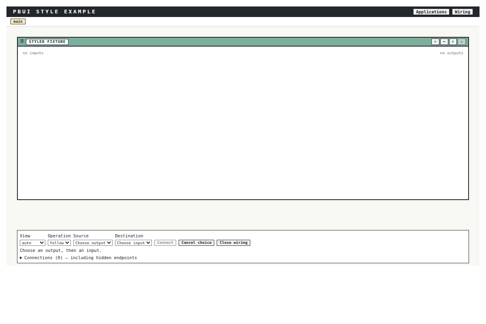

This limitation is intentional. Adding a complete product presentation graph would make the first styling example much larger and obscure the initial composition lesson. The guide links to the workbench contract for that next step. It does not present an empty wiring screen as proof of link persistence or port compatibility.

## 5. Bounded geometry is part of widget integration

AppBody’s most important behavior is its size and overflow contract. It combines growth within a flex parent with `min-height: 0`, `min-width: 0` and scrolling. Those declarations allow content to remain inside the region assigned by a tile. They cannot create a committed height when no ancestor establishes one.

The example therefore gives the native shell a 640px host and pure panel stories a 360px flex-column host. These are controlled test dimensions, not new global design tokens. A narrow story uses 280px width. Long values wrap in the detail region rather than widening the entire panel.

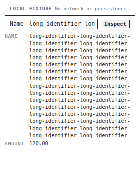

The measured narrow host and AppBody both had 280px client and scroll widths. The text input scrolls its long value internally, which is normal for a single-line control, while the detail text wraps. Distinguishing these behaviors is more useful than a blanket statement that the page has “no overflow.” Some overflow is intentional and local; expanding the pane beyond its allocation is the defect.

### Screenshot capture found a real theme-host defect

The theme story originally introduced a wrapper whose apparent purpose was only token overrides. That wrapper interrupted the bounded flex chain. The panel height collapsed to approximately 103px even though the ordinary panel used a 360px host. Typecheck and the basic interaction tests did not catch this geometry defect.

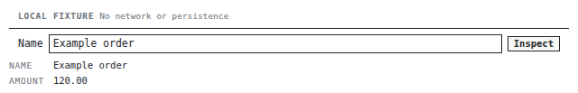

The correction gave the wrapper its own flex-column behavior, growth and zero minimum height. It also made the theme example visibly effective: the original token changes did not strongly demonstrate the intended override on the rendered controls. The corrected version changes the pane to the wash role and the hair border to a field-tone border.

```css
.theme {
  display: flex;
  flex-direction: column;
  flex: 1;
  min-height: 0;
  --pbui-pane: var(--pbui-wash);
  --pbui-border-hair: 1px solid var(--pbui-tone-field);
  background: var(--pbui-pane);
}
```

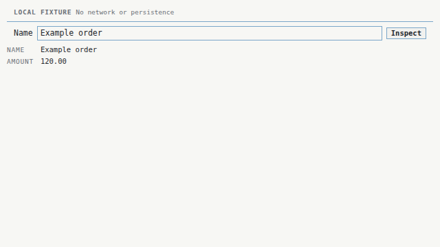

Recapture measured 640×360. The input’s computed border colour was `rgb(122, 166, 201)` and background `rgb(247, 247, 244)`. These values are evidence that the intended token override reached the input. They are not a proposal to copy those RGB literals into product components.

The before image remains in the ticket and is explicitly labeled as a failure exhibit. Keeping it makes the lesson reproducible: a wrapper added for theming is still layout code. It can change the ancestor chain that determines a child’s available size.

This theme story does not exercise portalled menus. A wrapper-level custom property reaches descendants, not a menu rendered outside the wrapper. The styling contract documents that limitation instead of claiming that a successful inline theme example proves whole-application theming.

## 6. State coverage should teach distinctions, not inflate a gallery

The example exports nine stories: Default, Empty, Loading, Error, Disabled, NarrowOverflow, ThemeOverride, DetailsSlot and NativeWorkbench. Each adds a state or integration boundary a reviewer can meaningfully inspect. Different row counts alone would not accomplish that.

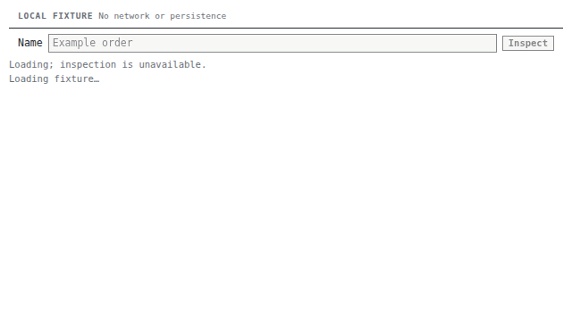

Loading is named explicitly and disables inspection. Empty provides a next action. Disabled keeps a visible explanation. Error uses a danger Callout with a glyph, title, body and hint, rather than colour alone.

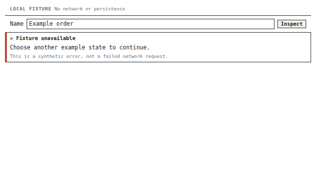

The error test exposed a useful API-versus-rendering distinction. Its first assertion searched for an exact standalone “Fixture unavailable” text node. Callout rendered a glyph alongside the title, so the assertion failed. The correction checked the alert’s content rather than assuming the shared component emitted a particular text-node structure. The test now asserts the semantic region and meaningful text without coupling to an incidental child split.

The initial native registration also failed typecheck because StyledPanelDemo’s optional fixture props were not the application’s `AppProps` shape. The final declaration uses a no-props adapter that renders the fixture controller. This is a small but useful example of why the tutorial points to compiled source: a plausible-looking registration snippet was not sufficient.

No universal `unstyled` prop was added. PBUI components do not share such an API, and omitting CSS in an iframe that already loaded the package is not an unstyled test. The guide distinguishes ordinary token theming, structural slots and deliberately isolated alternative stylesheet composition. The last of these requires separate accessibility and visual coverage.

## 7. Reconcile documentation instead of adding another competing policy

The work added `docs/README.md` as the entry point and four connected guides. Their responsibilities are deliberately different:

| Document | Reader question it answers |
|---|---|
| `docs/guides/visual-style.md` | What makes a panel PBUI, and which widget should I use? |
| `docs/guides/first-styled-workbench-panel.md` | How do I run and build a correct first example? |
| `docs/reference/styling-contract.md` | Who owns tokens, imports, local CSS and extension points? |
| `docs/playbooks/visual-review-and-storybook.md` | How do I inspect and record evidence for a visual change? |

The root README and package READMEs now route readers into that sequence. The new-app and refactoring playbooks were rewritten to remove mixed current instructions and old migration advice. Datalab’s guidelines now describe package-local constraints rather than presenting an alternative shared design system. The durable-editing playbook explicitly identifies its Datalab/Datadrop adapter scope, instead of implying every PBUI consumer must adopt its Redux and full-snapshot persistence choices.

Several concrete inconsistencies were corrected. Datalab’s old token-file reference pointed to a file removed during the visual consolidation. Historical `label` examples disagreed with current `accessibleName` props. The old pinned-workspace recipe referred to a deleted `store/spaces.ts` path. The workbench README used an undeclared plural tone token where the implemented role is singular `order`. The editor README omitted SQL/MySQL support and overstated what bundling guarantees about duplicate CodeMirror instances.

### Shared policy and package-local enforcement are different

The former refactoring guide required a directory for every component, with no small-component exception. Datalab’s newer policy allowed private/simple components to remain local until supporting files or meaningful states justified a directory. Meanwhile core and workbench still enforced stricter folder tests.

The resolution was not to weaken tests or demand empty stylesheets everywhere. Shared guidance now describes ownership and packaging by complexity; packages may impose stricter structural rules, which their local tests enforce. A reusable component with meaningful states needs colocated stories. A private pass-through helper can remain lightweight where permitted. A component with no styles does not need an empty CSS module.

The same distinction resolves the organism-fetching contradiction. A dependency graph may permit API imports in existing domain organisms without recommending hidden effects in every new panel. New presentational panels use DTOs and callbacks. Existing integration exceptions remain explicit. Naming a component “organism” does not settle its state or transport responsibility.

### Historical documents remain historical

PBUI-VISUAL-1 contains the original audit, design plan, after-report and feedback diary. Their reasoning and screenshots were not rewritten to pretend they used today’s APIs. They received pointers to the current guides, and an invalid metadata relation to the deleted Datalab token file was removed. The historical audit body remains unchanged.

This matters when a proposed API differs from the implementation. One old design called the Callout option `severity`; the implemented prop is `variant`. The correct documentation strategy is to mark the design as historical and point to current source, not let two authoritative-looking instructions compete indefinitely.

## 8. Test documentation where the assertions are meaningful

The new `src/docs-contract.test.ts` contains nine checks: eight guide-file checks and one onboarding-example check. It verifies balanced code fences, resolves relative inline Markdown destinations outside code fences, and confirms the root README points to the tutorial. It also checks that the example’s source, styles, stories and tests exist and that the expected story exports remain present.

Those checks are intentionally narrow. They do not validate every prose path, resolve every anchor, compile every Markdown snippet, or prove that each sentence is current. The executable example supplies stronger API validation through the package’s typecheck and tests. The documentation guard ensures the route to that example does not silently break.

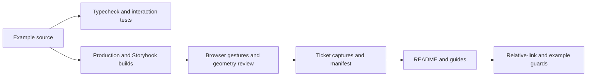

The final recorded results were **868 core tests in 52 files** and **137 workbench tests in 31 files**, with both typechecks passing. The workbench production and Storybook builds passed. The baseline workbench suite contained 132 tests; the example added five behavior cases. These counts belong to the documentation/example implementation checkpoint, not to a fresh test run performed while writing this report.

Live Chromium checks established that editing did not inspect, clicking Inspect did, and both the visible Wiring button and Ctrl+Shift+L from the focused input opened wiring on Linux. The mode has no ports in this example, so connection semantics were not part of that acceptance. Apple shortcut behavior is documented as Command-based, but the browser receipt is Linux-specific.

The browser console had one static-server `/favicon.ico` 404 on initial navigation. It was identified as a missing static asset rather than an application exception. Subsequent story renders had no reported application errors. This is more precise than calling the whole session error-free, and it avoids teaching reviewers to ignore console failures indiscriminately.

## 9. Keep visual evidence independently reusable

All eleven original PNGs are stored in the existing ticket:

`ttmp/2026/09/04/PBUI-VISUAL-1--consolidate-the-visual-style-across-pbui-packages-and-demos/various/screenshots-onboarding/`

`01-capture-catalog.md` records story names, dimensions, interaction state and limitations. `manifest.json` records timestamps, image dimensions and SHA-256 hashes. The timestamps span September 7 UTC while the local working date and report folder remain September 6. This is a timezone distinction, not inconsistent provenance.

The images embedded in this note are copies in the dated vault `_assets/` directory. The ticket originals remain in place, as requested. The copied before-host-fix image is labeled as a failure; the corrected image is not substituted silently for it. Native images are viewport captures, while the panel-state images are element captures.

The input’s computed font family was the PBUI font stack, and font readiness was awaited for the batch. That establishes the declared stack and absence of pending font loading at capture, not independent identification of the physical font file that supplied every glyph. The distinction matters when reproducing dense interfaces across machines.

Docmgr initially rejected the capture README because it lacked frontmatter. The catalogue received metadata and a numeric filename, and the tutorial link was updated. The final ticket doctor run had no new errors; seven preexisting filename-prefix warnings remain on older ticket notes. The report does not describe that as a completely warning-free ticket.

## 10. Source map, checkpoints and reproduction

The implementation repository is `/home/manuel/workspaces/2026-09-01/add-plot-editor/pbui`. The two local checkpoints are:

- **`f450189`** — current onboarding documentation, reconciled guides/READMEs, compiled example, tests and screenshots.
- **`bdc2dca`** — diary validation, ticket-owned capture catalogue metadata and related-file cleanup.

Those application-repository commits were not pushed as part of the original documentation task. They were subsequently pushed at the user's request: the remote branch was verified at `bdc2dca` during this update. The newer styling checkpoints in section 17 remain local. This report and its self-contained images are published separately through go-go-parc.

For review, follow this order:

1. `docs/README.md` and the four guides establish the current policy and procedure.
2. `packages/pbui-workbench/src/stories/StyledPanel/` shows the compiled implementation, nine stories and five behavior tests.
3. `src/tokens.css`, AppBody’s CSS module, current widget props and the product-bound ObjectChip implementation explain the reused contracts.
4. `src/docs-contract.test.ts` establishes the documentation guard’s exact scope.
5. PBUI-VISUAL-1 diary Step 17 and the capture catalogue record failures, corrections and browser evidence.

Representative checks from the repository root are:

```bash
pnpm typecheck
pnpm test
pnpm --filter @hyperslop-systems/pbui-workbench typecheck
pnpm --filter @hyperslop-systems/pbui-workbench test
pnpm --filter @hyperslop-systems/pbui-workbench build
pnpm --filter @hyperslop-systems/pbui-workbench build-storybook
```

The tutorial describes workspace installation and registry authentication requirements. Credentials belong outside source and examples. This is an in-repository example, not a new published consumer package. A fresh registry-based workbench consumer is a separate portability check; the existing root core-consumer smoke test must not be cited as proof of every workbench/editor combination.

## 11. What remains to be taught and tested

The completed onboarding path deliberately begins without domain ports, a product presentation graph, remote persistence or a backend. A later native example can add those contracts in explicit stages. It should not turn this first visual example into a large application whose setup obscures the basic component and layout rules.

Other useful follow-ups are a clean published workbench consumer check, broader portal-theme coverage, and additional browser/accessibility regression tests. Existing product-specific styling compromises, including the SQL feature’s combined stylesheet and older RAG-specific status/detail wrappers, were not changed by this documentation work. Their existence does not invalidate the shared guidance; it prevents the guidance from presenting every existing consumer as a perfect template.

The durable result is a concrete adoption sequence: load the documented styles, inherit semantic defaults, select widgets whose behavior fits, separate controllers from panels, give those panels bounded hosts, expose meaningful states, and verify both gestures and geometry. The compiled example and ticket evidence make that sequence inspectable. Future developers can now begin with the current contract rather than reconstructing it from several applications and historical notes.

## 12. Follow-up: apply the guidelines to existing PBUI components

The onboarding work established an adoption procedure. PBUI-STYLE-002 tested that procedure against existing components whose visual recipes had diverged or whose behavior at small widths was insufficiently exercised. The scope was specific: coordination and sandbox inspectors, neighboring REPL/timeline tools, chat object references, generated notices, proposal/tool cards, operational panels and select controls. This was not a replacement of the underlying application runtimes.

The work followed three implementation phases. P1 addressed inspector/devtool density and bounded controls. P2 addressed shared reference bodies, card composition and severity. P3 addressed operational rows and select consistency, followed by cross-package acceptance. The overall plan and each phase's START/DONE were physically printed; receipts are retained independently from the generated layouts. A detailed diary records both the implementation and a session interruption during validation.

The important methodological change was to promote candidates into confirmed defects only after examining their rendered behavior. A literal font size or local grid is a reason to investigate, not proof that a component is wrong. Narrow synthetic fixtures supplied stronger evidence: several operational rows exceeded their available width, and the REPL's textarea exceeded its own container despite using a shared component.

## 13. Inspector density and the shared textarea boundary

CoordinationInspector already used TileHeader and AppBody, but its internal tables maintained separate 12px/11px typography, literal gaps and locally mixed border colours. The pass moved those regions onto the shared small/tiny scale, SectionLabel headings and hair/grid border roles. Fixed-layout tables wrap long labels within their allocated columns. The native link facts and visible show-wiring action remain intact, with new tests covering the linked and empty states.

Sandbox InspectorTile now delegates its scrolling content to AppBody. Its tree rows use the shared square radius and a neutral edge for the current cross-view hover target. That target is not a persisted selection: hovering an outline node highlights the corresponding rendered node in the program tile. Using the durable selection treatment would misstate the interaction. Timeline and REPL separators now use the internal-grid border role.

The first narrow captures exposed a separate shared-control defect. TextArea declared `width: 100%` without `box-sizing: border-box`. Its declared width therefore described the content box; padding and borders were added outside that width. The escaping textarea created horizontal scrolling in the REPL, even though the REPL's own flex layout had zero minimum dimensions.

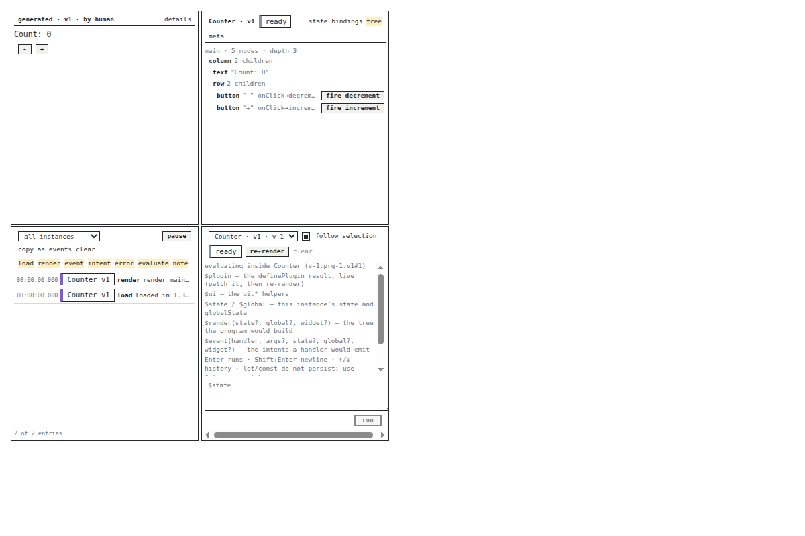

The correction belongs in TextArea, not in a parent rule that hides overflow:

```css
.root {
  box-sizing: border-box;
  width: 100%;
  min-width: 0;
}
```

A first downstream Storybook rebuild still displayed the defect. Sandbox consumed core's built distribution rather than the edited source file, so rebuilding sandbox alone did not include the correction. Rebuilding core first, then sandbox, changed the narrow REPL from 278px client width / 284px scroll width to 278/278. Its final height and scroll height also matched at 318px.

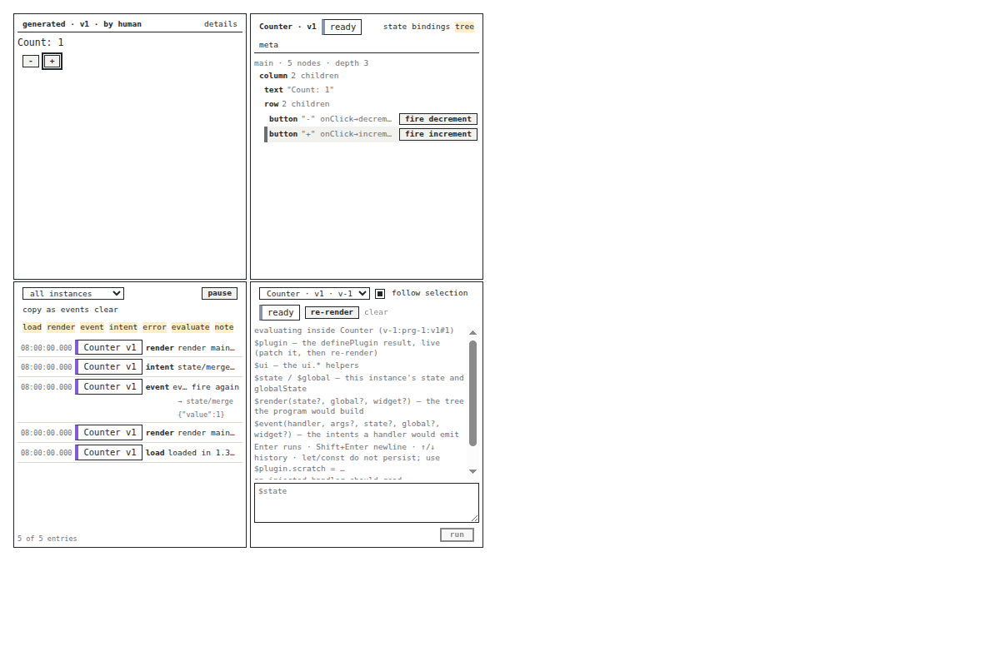

The Counter increment in this capture is a real operation in the local synthetic eval-engine fixture. It establishes that the style pass did not replace the program with a static drawing. It does not establish anything about a production program or backend. The final coordination fixture similarly measured 275×454px with matching scroll dimensions after the shared dependencies were rebuilt.

## 14. Reference bodies, interactive cards and severity

A reference wrapper owns more than its visual body. Chat's RefPresentation lifts the wire reference into the product presentation system, supplies documentation, and records focus for subsequent message context. Replacing the entire wrapper to obtain a Chip would discard those responsibilities. Replacing every child with ObjectChip would introduce a different problem: arbitrary JSX and block content are not ordinary object labels.

The implementation changes only the default inline body. Its control flow is equivalent to:

```tsx
if (!block && children == null) {
  return <ObjectChip {...forwardedPresentationProps} badge={badge}>
    {chat.labelFor(reference)}
  </ObjectChip>;
}
return <Presentation {...forwardedPresentationProps} block={block}>
  {children ?? chat.labelFor(reference)}
</Presentation>;
```

Both branches remain inside the original focus-capture wrapper. The forwarded props retain the converted reference, documentation, class, activation and test identifier. Supplying the existing wire label as ObjectChip text preserves chat's label resolution while allowing the product presentation to own its tone. Composer, watchlist and widget reference collections now use this path instead of independently reconstructing a Chip and its tone. A badge preserves their type metadata.

Regression tests establish that pointer focus and keyboard focus still update the chat store, click and Enter each invoke the host activation once, and custom inline/block bodies remain unchanged. This is a stronger adoption criterion than checking that a screenshot contains a small bordered label.

ProposalCard now composes one Surface, a Toolbar header and KeyValueList facts. Its previous extra wrapper and private definition-list recipe were removed. ToolCard also uses Surface and Toolbar. A proposal remains an interactive group with controlled decision callbacks; it was deliberately not converted into a Callout merely to reuse a similar border. Live-region semantics would be a behavioral change unrelated to its visual appearance.

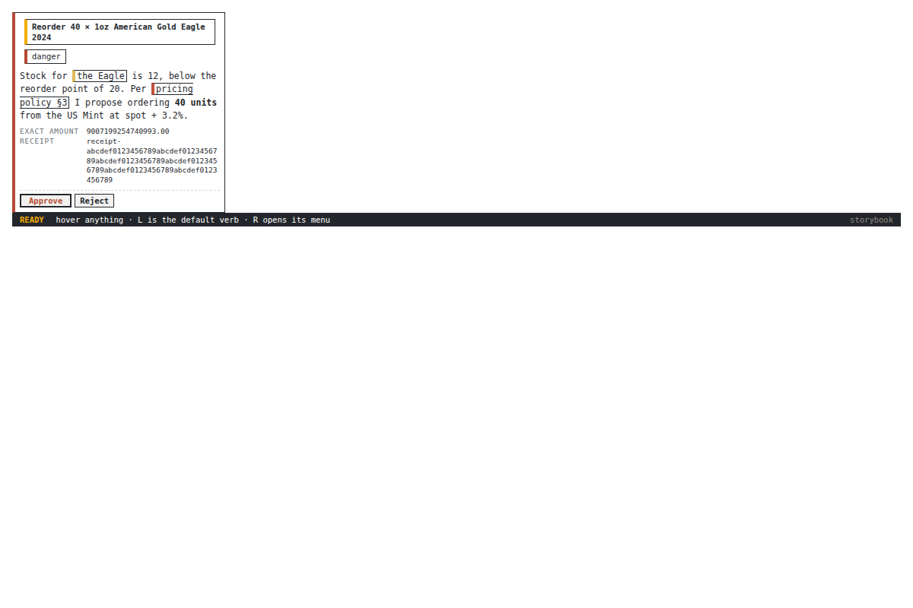

The proposal tests preserve the exact display string `9007199254740993.00`, verify both approve and reject callbacks, and confirm that an already-decided card disables both buttons with their existing reasons. A browser click on the seeded pending proposal also produced the disabled approved state. These checks concern the controlled UI, not backend approval authorization.

Generated sandbox notices contained a semantic defect: both warning and danger mapped to the shared warning Callout. Danger now retains its danger variant and `role="alert"`. The boundary still translates the sandbox wire vocabulary into core vocabulary; it does not make the two schemas identical.

| Sandbox value | Core variant | Rendered role |
|---|---|---|
| omitted or `neutral` | `info` | `status` |
| `positive` | `ok` | `status` |
| `warning` | `warning` | `status` |
| `danger` | `danger` | `alert` |


The first fixture incorrectly supplied core's `info` as a wire value. Typecheck rejected it. The fixture was corrected to `neutral`; the public wire contract was not widened to accommodate a test mistake.

## 15. Dense operational rows must preserve field identity

The operational baseline used 280px outer frames with real seeded chat stores and local debug events. Long identifiers were intentional. They made intrinsic-size constraints visible rather than allowing short demonstration labels to conceal them.

| Region | Baseline client / scroll width | Final narrow client / scroll width |
|---|---:|---:|
| Trace row | 278 / 376px | 278 / 278px |
| Runs row | 270 / 378px | 270 / 270px |
| Events row | 270 / 687px | 270 / 270px |
| Tools row | 270 / 460px | 270 / 270px |

These are measurements of the deliberately awkward rows, not a claim that every baseline row overflowed. The final browser script checks both seeded rows in each panel at wide and narrow widths.

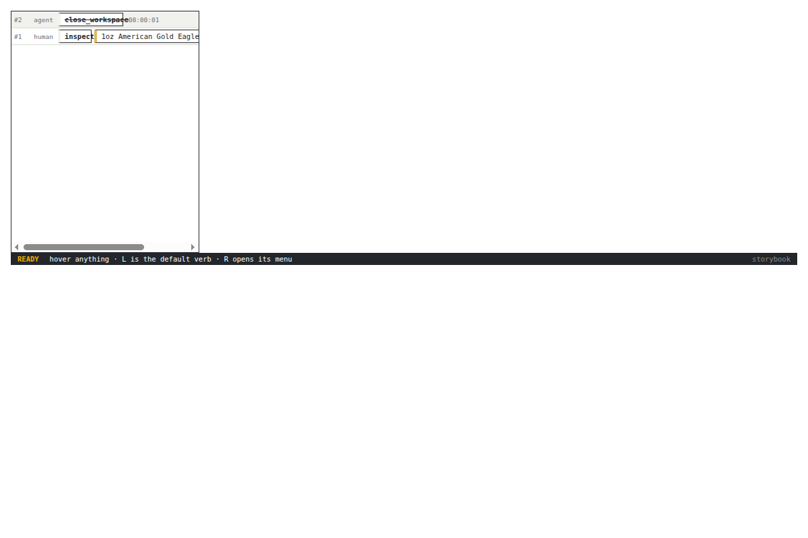

TracePanel had an additional structural problem. Its target child was conditional, but the row relied on implicit grid placement. When no target existed, subsequent children occupied different columns. The fix introduces stable named areas and an explicit no-target cell. Missing data now changes the cell's content, not the identity of neighboring fields.

Below a 420px container width, the trace moves to a compact arrangement. A rejected row gets a full-width explanation instead of forcing the reason into a narrow ellipsis. The query responds to the tile's width rather than the overall browser viewport. Ordering and limit behavior are unchanged and tested.

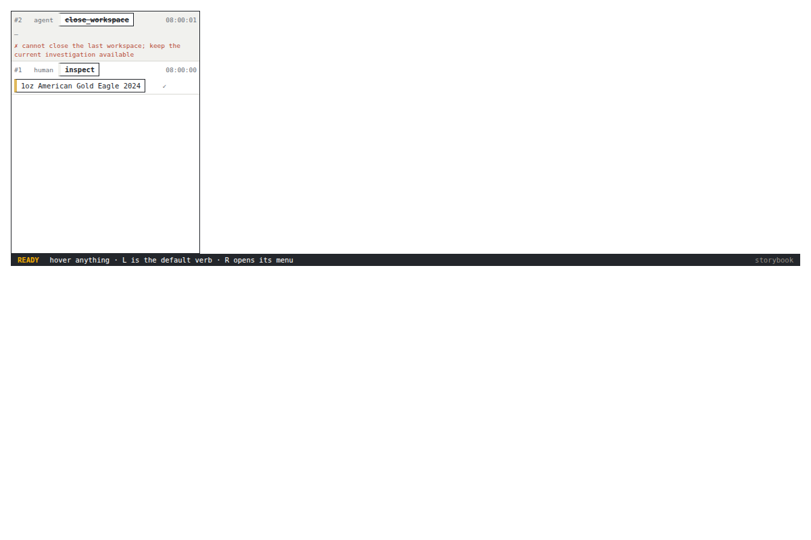

Runs and tools use two-line metadata layouts. The Runs implementation had already intended two lines, but a spanning numbers cell displaced the duration into another row; explicit placement restores the intended relationship. Tool names and errors can wrap, while status and duration keep their own positions. Events also allow long identifiers to wrap. Metadata intentionally kept as an ellipsis retains its full title and underlying reference behavior.

The browser acceptance did more than measure boxes. It filtered ToolsTile to failed calls, opened the native input/result disclosure, and verified the exact string `9007199254740993.00` inside it. This guards against a visually tidy change that silently drops detail or transforms values.

## 16. Match control appearance without replacing native interaction

SelectInput's framed variant and the global unclassed-select skin previously used different geometry. The global skin had a custom chevron and reserved padding; the component used a different framed recipe. The pass centralizes the chevron image and line height in shared tokens and gives the framed control matching padding, border and focus treatment.

The explicit `native` variant still uses platform chrome. Both variants remain actual SELECT elements; no custom popup, option-navigation state machine or keyboard implementation was introduced. A disabled background shorthand was changed to background-color so disabling a framed select does not erase its arrow image.


In the Linux Chromium fixture, global and framed controls both measured 62×18.796875px, with identical padding, background image and appearance. Native intentionally differed. ArrowDown followed by Enter selected `writer` in the controlled framed example. Under emulated forced-colors, both skinned controls switched to `appearance: auto` and removed the custom image, restoring the platform arrow.

The image token is not automatically recoloured by CSS text ink. A product with a custom pane palette can override `--pbui-select-chevron`. This is an explicit theming boundary, not a claim that one successful palette test certifies every theme or operating system.

## 17. Completed checkpoints, evidence and remaining limits

The styling implementation is complete in PBUI-STYLE-002:

- **`cf4cf5a`** — inspector density, devtool boundaries and shared TextArea sizing.
- **`5e4970e`** — ObjectChip adoption, shared card composition and semantic notices.
- **`46e3a30`** — bounded operational rows and framed-select parity.
- **`509bce4`** — final diary, validation logs, capture catalogue, evidence audit and physical receipts.

The ticket lives at:

`ttmp/2026/09/06/PBUI-STYLE-002--align-inspector-chat-and-generated-widgets-with-pbui-visual-contracts/`

Root typecheck and **870 tests in 52 files** passed. Ten workspace suites passed another **1,609 tests**, including 605 Datalab, 249 chat, 229 sandbox and 139 workbench tests. The combined count is **2,479**; it is not a count of browser assertions or Go tests. Recursive workspace typechecks and production builds passed, as did core/chat/sandbox/workbench Storybook builds. A separate nine-test documentation guard rerun validated the updated guide links.

The ticket's browser script is `scripts/01-browser-acceptance.js`. It verifies two rows per operational fixture at each width, filtered tool disclosure, exact input text, native keyboard selection, forced-colors fallback, and final coordination/REPL bounds. The capture catalogue script records 35 original PNGs with source-state labels, dimensions, hashes and loopback story URLs. Its timestamps are filesystem-mtime proxies, not embedded immutable provenance. All seven figures added in this report update are byte-identical copies of selected ticket originals; the earlier seven onboarding images remain unchanged.

A final evidence audit verified **35 capture hashes, seven successful physical print receipts and 92 local Markdown targets**. Each print receipt records HTTP 200, actual printing and printer acknowledgment. The final P3 DONE receipt is timestamped **2026-09-07T01:50:51Z**. All ticket tasks are checked, its status is complete, and docmgr doctor passes for this new ticket. These results are separate from the older PBUI-VISUAL-1 filename warnings described above.

The remaining limitations are explicit. Browser acceptance is local Chromium/Linux with synthetic data and emulated forced-colors, not Safari coverage, native Windows high-contrast certification, complete accessibility testing, backend authorization or a clean published-consumer installation. The static chat fixtures attempt session-metadata PATCH requests and receive 501; auto-connect disabled does not mean network-silent. Favicon 404s and large-chunk warnings in the demo builds remain documented rather than suppressed.

The new styling commits have not been pushed; the remote PBUI branch was verified at `bdc2dca`. Publishing this updated vault report does not publish those source commits. The next useful engineering work is therefore separate from this completed pass: broaden browser/portal-theme coverage, isolate metadata persistence when network-silent stories are required, and validate a fresh published consumer. The implemented changes already demonstrate the main principle: adopt shared behavior and visual contracts together, then verify their actual geometry under constrained inputs.
