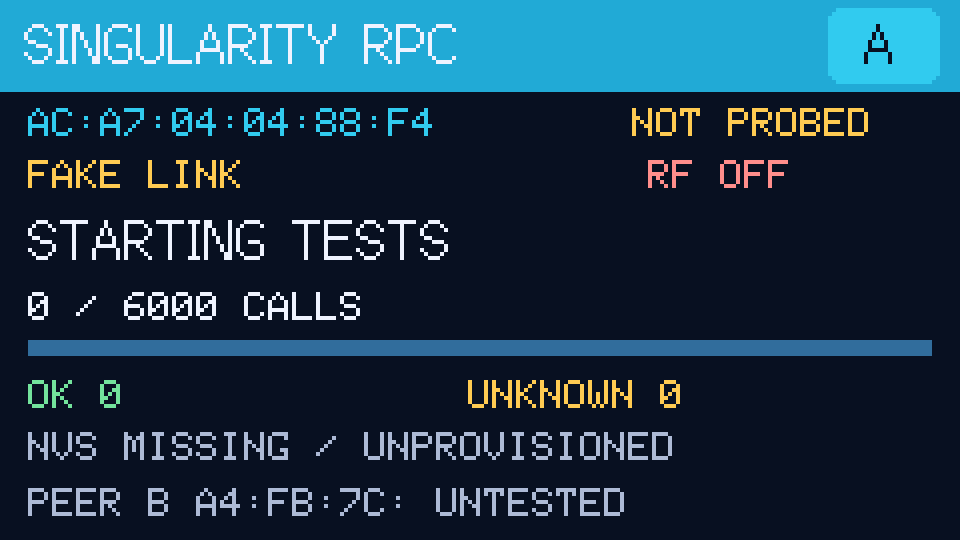
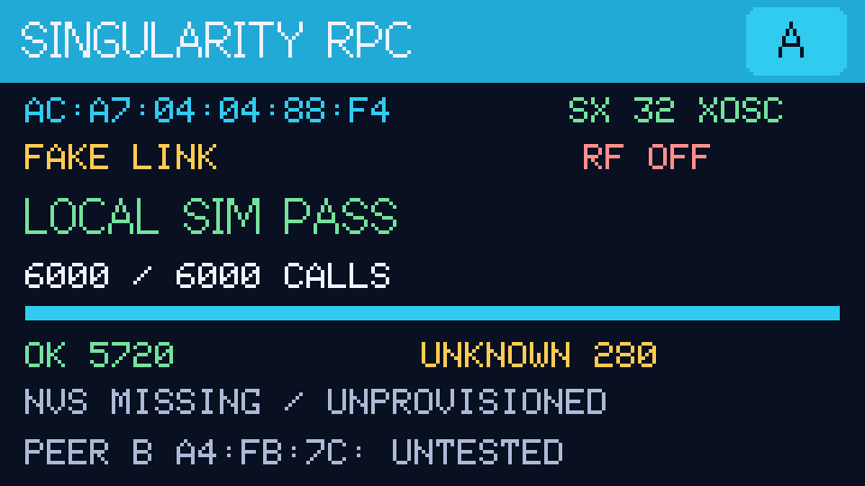
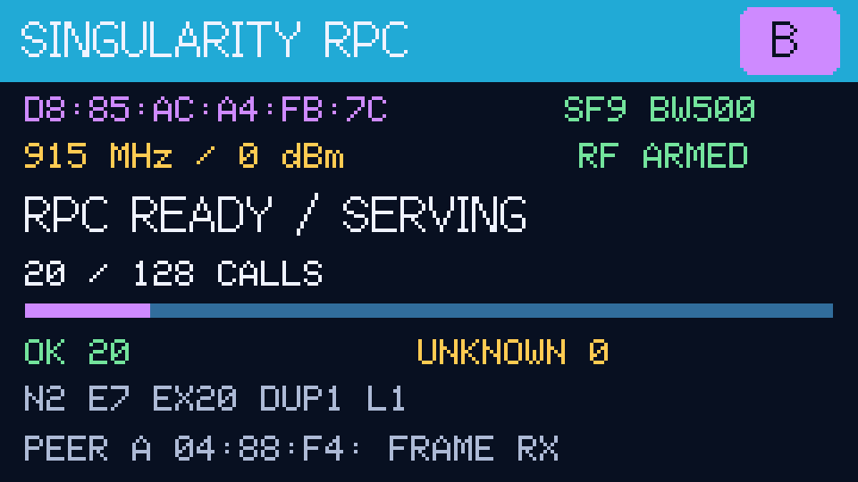
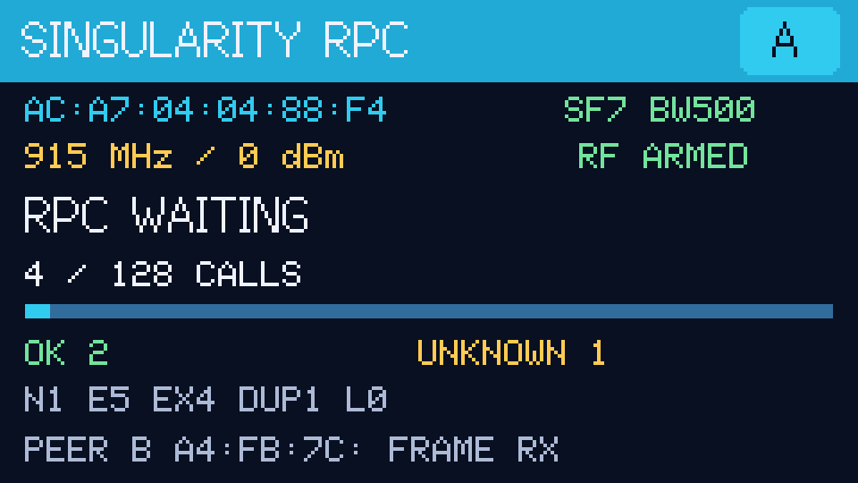
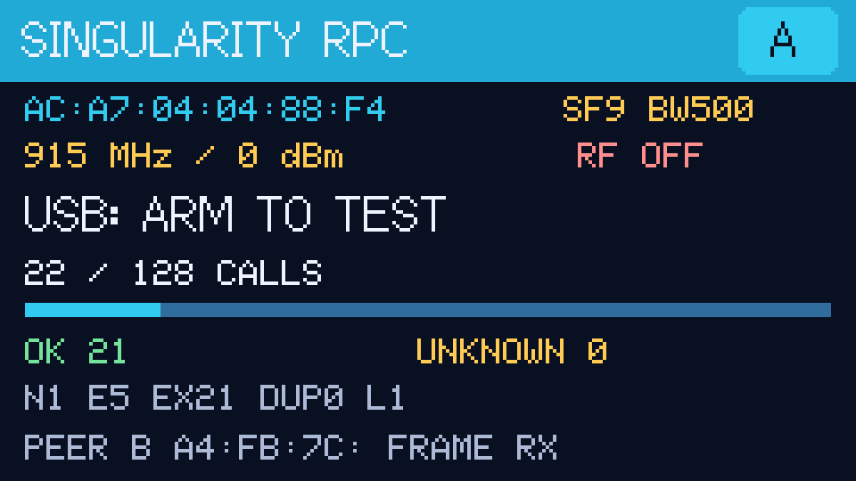
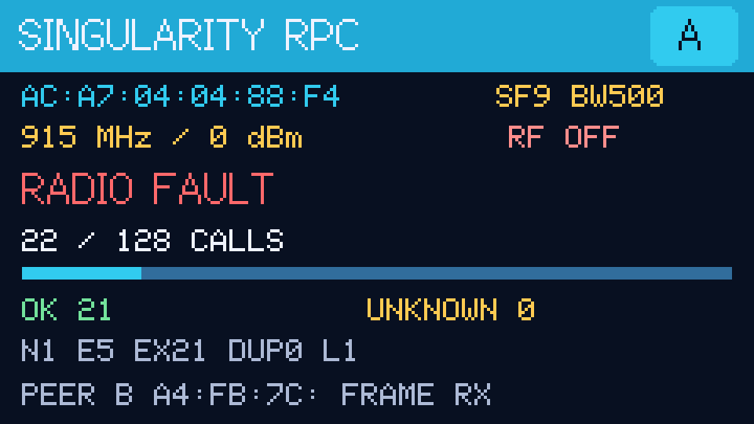
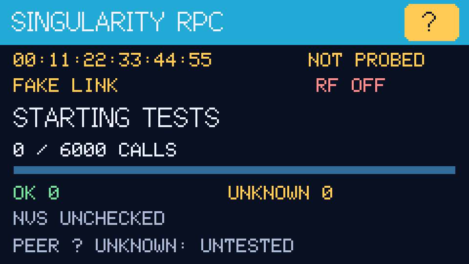
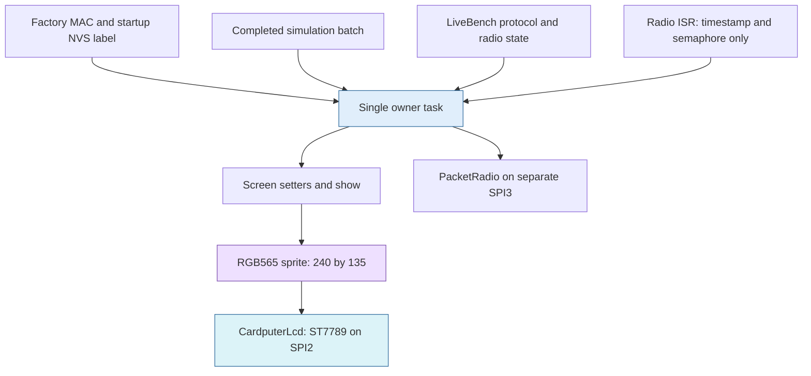
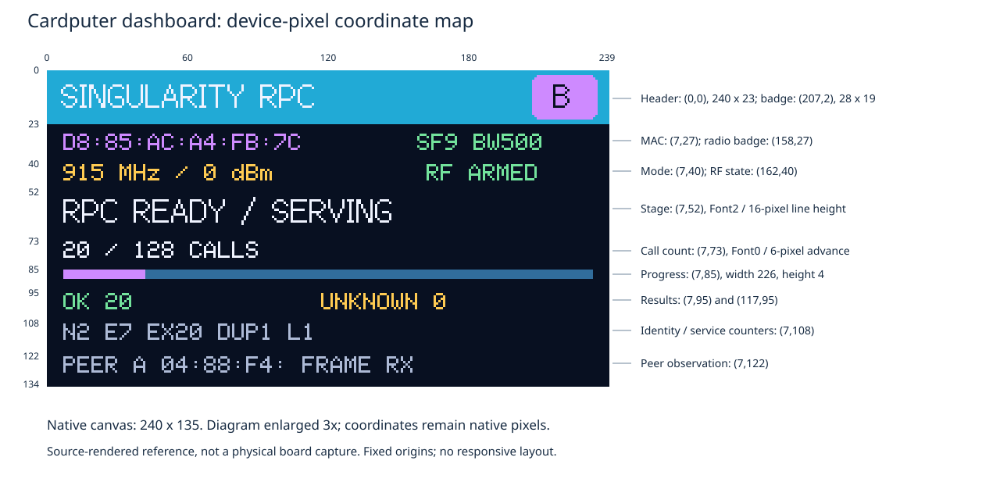
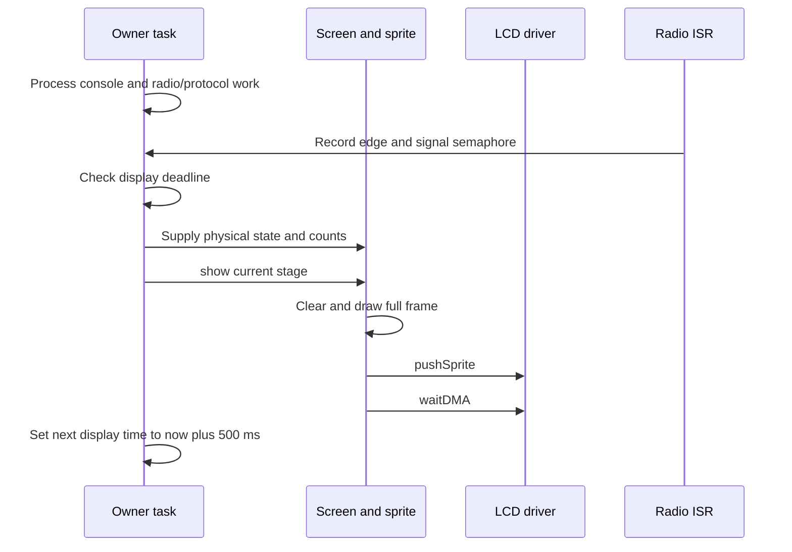

# Singularity Cardputer UI: Reproducing a Pixel-Precise M5GFX Dashboard

The Singularity RPC dashboard is a fixed-layout instrument display for two Cardputer ADV boards. It identifies the board, distinguishes simulated tests from physical radio operation, and reports progress and protocol outcomes in a 240 × 135 pixel viewport. Its appearance comes from a small set of drawing operations, two bitmap fonts, consistent alignment, and a limited palette—not from an application framework or a collection of image assets.

This report explains how to reproduce the implemented appearance and how to preserve its runtime behavior. A developer should be able to configure the display, recreate each row, choose the correct color representation, supply state safely, and validate the resulting pixels without reverse-engineering the whole RPC project. Where the implementation has a limitation, the report identifies it rather than presenting the current code as a general-purpose UI library.

> [!summary]
> - The display uses **M5GFX 0.2.27**, an explicitly configured ST7789 on SPI2, and one startup-allocated **64,800-byte RGB565 sprite**.
> - This note includes **seven source-rendered reference screens**, a coordinate map, frozen application headers, and a runnable host renderer using the real M5GFX drawing code and fonts.
> - A critical reproduction detail is **color argument type**: two signed literals produce a cyan header and blue progress track. Explicit unsigned RGB888 tokens can reproduce those actual colors without relying on the conversion.
> - Rendering belongs to one owner task. The physical dashboard updates after a roughly 500 ms interval, while startup progress follows completed simulation batches.

## 1. What the interface is designed to answer

A small diagnostic screen is useful when its fields have stable meanings. The operator should not need to infer whether a large success count came from a local simulation or a real peer, whether the device is allowed to transmit, or whether the displayed identity is a visual bench label or a persistent protocol identity.

The dashboard answers these questions in separate rows. The header and MAC identify the physical board. The mode row states whether the screen represents a fake link or the physical 915 MHz configuration. The current-stage line gives the immediate activity. The next three rows summarize completed calls and outcomes. The final two rows show identity/service diagnostics and whether a relevant peer frame has been observed.

This organization is not merely decorative. Mixing local-test results with physical-link status would create a misleading success indicator. Combining an A/B label with a protocol node number would conceal the fact that those values come from different sources. The layout gives each kind of evidence its own location, and the renderer does not infer stronger conclusions than the caller supplies.

The implemented interface is a **dashboard**, not an interactive menu. It has no keyboard focus, selectable widgets, scrolling log, touch behavior, or navigation stack. Commands currently arrive through USB. A future keyboard interface can retain the same visual language, but it will require additional state and input-handling policy.

The source project was developed in September 2026 inside a workspace whose path contains `2025-12-21`. The workspace date is retained in the frontmatter; it is not the development date of this UI.

## 2. Reference screens and what they establish

The following images were generated on the host from the actual `Screen` class and M5GFX 0.2.27. The host adapter replaces hardware initialization and the final LCD transfer, but retains the drawing function, state setters, sprite color depth, and bitmap fonts. Each native 240 × 135 frame is enlarged exactly four times with nearest-neighbor scaling to make individual pixels inspectable.

**These are reference renders with supplied example state, not photographs, live board framebuffer dumps, or proof that the illustrated state occurred on a device.** They establish the software drawing result. They do not establish panel brightness, viewing-angle behavior, optical color accuracy, tearing, or electrical correctness. No board was reflashed or armed to create them.

### Startup on board A



The blue-cyan header remains distinct from A's lighter cyan identity accent. Before the probe, the radio field says `NOT PROBED`. The mode remains `FAKE LINK`, RF is off, the progress bar is empty, and the peer remains `UNTESTED`. The NVS line is an example of the actual missing-identity label used at startup.

### Completed local simulation



This fixture uses the known campaign totals of 6,000 calls, 5,720 Ok and 280 Unknown, with an illustrative successful oscillator-standby readback. The stage is green because the caller explicitly passes `passed=true`. `FAKE LINK` and `UNTESTED` remain visible: successful local tests do not establish communication with the other board.

### Board B serving physical RPC



B uses a purple identity badge, MAC and progress fill. The radio and RF fields are green while armed. The stage is normal light text, not success green; readiness is not a completed test. The `N2 E7 EX20 DUP1 L1` line is supplied example state illustrating the compact diagnostic format.

### Board A waiting for a call



The large stage changes without rearranging the surrounding information. Completed-call counts do not include the currently pending call. The displayed difference between completed calls and the two outcome subtotals is permitted; the UI does not show every terminal outcome category.

### Board A disarmed



`RF OFF` changes color and the stage requests USB arming. `FRAME RX` remains visible because peer observation is sticky within the running instance; it is not a current connection indicator. The example uses the final recorded A call totals, but remains a source-rendered fixture rather than a capture of that moment.

### Radio fault



Failure changes the stage text to red. It does **not** fill the entire screen red, remove the board badge, or erase previous counters. Keeping the surrounding state visible helps distinguish an error from a complete loss of display operation.

### An unrecognized board



An unknown MAC produces a question-mark badge and amber identity accent. This fallback is explicit; the renderer does not silently identify an unfamiliar device as board A.

## 3. Architecture: display configuration, rendering, and state supply

The UI has three relevant boundaries. `CardputerLcd` configures the actual panel and bus. `Screen` owns the sprite and draws presentation state. The application owner task supplies that state from startup tests or the physical bench. There is no separate GUI task or retained widget tree.



The implementation resides primarily in `labs/singularity-rpc/firmware/main/status_screen.hpp`, a small header containing both classes. `bench_identity.hpp` supplies the A/B mapping. `app_main.cpp` initializes the screen and renders startup phases. `live_bench.hpp` supplies the periodic physical view.

The report includes frozen copies of [the screen header](_assets/singularity-cardputer-ui-status-screen.hpp) and [the identity header](_assets/singularity-cardputer-ui-bench-identity.hpp). These are application source snapshots, not a vendored copy of M5GFX. When using them in a new firmware, restore the filenames `status_screen.hpp` and `bench_identity.hpp`, because the screen header includes the latter name.

The existing source is a useful compact reference, but its class mixes device configuration, view state, and rendering. For a larger application, separating those responsibilities would improve testing and reuse. That is a proposed extension, not a description of the current implementation.

## 4. Configure the panel before reproducing the layout

The Cardputer screen is an ST7789 with a native configured panel size of 135 × 240. The UI operates in landscape after `setRotation(1)`, yielding 240 × 135 logical coordinates. The driver also needs controller offsets of 52 and 40. These offsets belong to the panel configuration; application drawing coordinates must not add them again.

The source configures the LCD explicitly rather than using M5GFX board autodetection. This is important in this particular assembly because autodetection can probe GPIO5/6, which the LoRa Cap uses for radio chip select and BUSY. Avoiding that probe preserves peripheral ownership before the radio has even been initialized.

| Configuration | Exact value |
|---|---|
| SPI host | `SPI2_HOST` |
| SPI mode | `0` |
| Write/read clock configuration | 40 MHz / 16 MHz |
| SCLK / MOSI / MISO | GPIO36 / GPIO35 / `-1` |
| DC / CS / reset | GPIO34 / GPIO37 / GPIO33 |
| SPI three-wire / bus locking | `true` / `true` |
| Panel width / height | 135 / 240 |
| Panel offset X / Y | 52 / 40 |
| Panel inversion | `true` |
| Panel readable / bus shared | `false` / `false` |
| Logical rotation | `1` |
| Backlight pin | GPIO38 |
| Backlight inversion | `false` |
| PWM frequency / channel | 1,200 Hz / 7 |
| Requested brightness | `180` |
| Display and sprite color depth | 16 bits |

The configured read clock does not make this panel readable; the source explicitly disables panel reads. The report's pixel export reads the host sprite, not LCD memory. Similarly, the brightness value is an API setting, not a measurement of luminance or an assertion of a linear relationship between the value and perceived brightness.

The `CardputerLcd` constructor creates `lgfx::Bus_SPI`, `lgfx::Panel_ST7789`, and `lgfx::Light_PWM` members, applies their configurations, connects bus and light to the panel, and passes the panel to `LGFX_Device`. These objects must outlive the driver operations that refer to them. In the actual firmware the enclosing `Screen` is static.

Do not copy these GPIOs to a different Cardputer variant or unrelated ST7789 board without checking its schematic. The visual layout is reusable; the pin and controller configuration is board-specific.

## 5. Establish the coordinate system and vertical rhythm

Every position in the renderer is an integer logical pixel coordinate, with origin at the top left. X increases to the right and Y increases downward. The valid viewport is X=0–239 and Y=0–134. There is no automatic layout pass, proportional scaling, or responsive reflow.



The header occupies the full width. The body generally starts at X=7 and uses a 226-pixel content width, leaving seven pixels on each side for rectangles. The title starts one pixel farther left, at X=6. Right-side text fields have their own fixed origins rather than being right-aligned against the edge.

| Element | Origin | Extent or font |
|---|---|---|
| Full background | `(0,0)` | 240 × 135 |
| Header rectangle | `(0,0)` | 240 × 23 |
| Title `SINGULARITY RPC` | `(6,3)` | Font2, size 1 |
| Board badge rectangle | `(207,2)` | 28 × 19, corner radius 3 |
| Badge character | `(216,3)` | Font2, size 1 |
| MAC text | `(7,27)` | Font0, size 1 |
| Radio text | `(158,27)` | Font0, size 1 |
| Mode text | `(7,40)` | Font0, size 1 |
| RF state | `(162,40)` | Font0, size 1 |
| Current stage | `(7,52)` | Font2, size 1 |
| Call count | `(7,73)` | Font0, size 1 |
| Progress track/fill | `(7,85)` | Width up to 226, height 4 |
| Ok count | `(7,95)` | Font0, size 1 |
| Unknown count | `(117,95)` | Font0, size 1 |
| NVS or live identity text | `(7,108)` | Font0, size 1 |
| Peer observation | `(7,122)` | Font0, size 1 |

This arrangement leaves a clear gap between the large stage text and the smaller count row. Font2 occupies a 16-pixel line height starting at Y=52; the next small row starts at Y=73. The progress track is only four pixels tall, so it remains subordinate to the state text. The last small row begins at Y=122 and fits within the 135-pixel viewport without using the bottom few rows.

The board character is placed with a fixed cursor, not centered with a layout API. A and B each have an eight-pixel Font2 advance in the pinned library, so the fixed position works for the current one-character labels. Replacing the badge with a two-character code requires revisiting its geometry rather than simply changing the text.

## 6. Typography is part of the pixel specification

The renderer uses `fonts::Font0` for compact rows and `fonts::Font2` for the title, badge and current stage. Both are built into M5GFX, so the firmware does not load font files at runtime.

Font0 is the GLCD-style font with a six-pixel character advance and an eight-pixel line height. The ordinary glyph occupies a smaller bitmap within that cell. It gives diagnostic strings predictable width: the 17-character colon-separated MAC occupies 102 pixels, leaving substantial separation before the radio field at X=158.

Font2 is a proportional bitmap font with a 16-pixel line height and baseline metadata of 13. It is not equivalent to an arbitrary desktop monospace font at “16 px.” Character advances vary, and its glyph design determines the actual appearance. Its source is the library's `Fonts/Font16.h`; the built-in font registration is in `lgfx/v1/lgfx_fonts.cpp`.

The host renderer measured these advances through M5GFX itself:

| Font2 string | Advance width |
|---|---:|
| `SINGULARITY RPC` | 109 px |
| `RPC READY / SERVING` | 141 px |
| `USB: ARM TO TEST` | 119 px |
| `RADIO FAULT` | 81 px |
| `A` or `B` | 8 px |

These are text advance widths, not necessarily the tight bounding box of all illuminated pixels. They are the appropriate measurements when checking cursor placement and remaining horizontal space.

The helper for compact rows explicitly selects the font and size each time:

```cpp
void small(int x, int y, const char* text, uint32_t color = white) {
    canvas_.setFont(&fonts::Font0);
    canvas_.setTextSize(1);
    canvas_.setTextColor(color);
    canvas_.setCursor(x, y);
    canvas_.print(text);
}
```

The header also sets Font2 and size one at the start of every frame. The stage later switches back to Font2. This is necessary because drawing calls mutate the canvas's current font and text color. A developer adding a row should explicitly establish its text state rather than depending on whichever field happened to draw before it.

Text wrapping is disabled in both directions. The current labels are chosen to fit; the renderer does not automatically shrink them, insert ellipses, or wrap long strings. Treat new labels as ASCII unless you deliberately select and validate another font. Font2 even has a documented configuration in which the grave-accent character is drawn as a degree symbol, so arbitrary punctuation is not interchangeable with a desktop font.

## 7. The palette: distinguish source notation from rendered color

Most of the palette is passed through `uint32_t` values and therefore interpreted as RGB888 before being stored in the RGB565 sprite. The background, primary text and board accent follow this path. Calls to `small()` also convert their color arguments to `uint32_t` through the helper signature.

Two rectangle calls do something different:

```cpp
canvas_.fillRect(0, 0, 240, 23, 0x1a2540);
canvas_.fillRect(7, 85, 226, 4, 0x26334d);
```

These unsuffixed constants have signed integer type. M5GFX's color converter selects behavior using argument size and signedness: signed 32-bit values take its RGB565 conversion path, while unsigned 32-bit values take RGB888. Passing a 24-bit-looking signed value through a path intended for 16-bit color does not produce the color suggested by reading its hex digits as RGB888.

The source-rendered frame therefore has a **cyan header** and a **blue progress track**. My earlier short explanation described the apparent navy literal rather than this actual conversion result. The reference images and measurements in this report correct that description. The supplied source snapshots remain unchanged; this documentation work did not recolor the firmware.

| Role | Source expression or RGB888 token | RGB888 readback from 16-bit rendering |
|---|---|---|
| Background | `uint32_t(0x0b1020)` | `#081021` |
| Header, existing signed literal | `0x1a2540` | `#21AAD6` |
| Progress track, existing signed literal | `0x26334d` | `#316D9C` |
| Primary text | `uint32_t(0xeef3ff)` | `#EFF3FF` |
| A accent | `uint32_t(0x36c9ee)` | `#31CBEF` |
| B accent | `uint32_t(0xcf8bff)` | `#CE8AFF` |
| Unknown-board accent / amber | `uint32_t(0xffc857)` | `#FFCB52` |
| Success / armed | `uint32_t(0x74e39a)` | `#73E39C` |
| RF off | `uint32_t(0xff8e89)` | `#FF8E8C` |
| Failure stage | `uint32_t(0xff6868)` | `#FF696B` |
| Secondary diagnostics | `uint32_t(0xaab8d2)` | `#ADBAD6` |

The small differences in the ordinary RGB888 rows follow from quantization to five red bits, six green bits and five blue bits, then expansion for image export. The much larger differences in the two rectangle rows come from argument-type interpretation. They are separate effects.

For a new implementation that must **match the current visual result**, use explicit unsigned RGB888 tokens:

```cpp
namespace palette {
constexpr uint32_t background = 0x0b1020u;
constexpr uint32_t header     = 0x21aad6u; // Match existing rendered header.
constexpr uint32_t track      = 0x316d9cu; // Match existing rendered track.
constexpr uint32_t text       = 0xeef3ffu;
constexpr uint32_t board_a    = 0x36c9eeu;
constexpr uint32_t board_b    = 0xcf8bffu;
constexpr uint32_t positive   = 0x74e39au;
constexpr uint32_t uncertain  = 0xffc857u;
constexpr uint32_t rf_off     = 0xff8e89u;
constexpr uint32_t failure    = 0xff6868u;
constexpr uint32_t secondary  = 0xaab8d2u;
}
```

The host renderer checks that both replacement tokens produce the same RGB565 pixels as the original expressions. This makes the intended appearance explicit and avoids depending on out-of-range RGB565 input. Conversely, changing the existing header to `0x1a2540u` would produce a dark navy header. That may be a reasonable redesign, but it would not preserve the current screen the user accepted.

The palette has two independent roles. Accent color identifies a board and is reused in its badge, MAC and progress fill. Status color communicates a condition: green for positive/armed state, amber for caution or uncertainty, and red tones for RF off or an error. Text labels remain necessary because colors are not a complete semantic encoding, and no physical accessibility or color-calibration claim follows from these software values.

## 8. Render a complete frame into one sprite

After the panel initializes, `Screen::begin()` configures rotation and brightness, checks the logical dimensions, sets 16-bit color, disables PSRAM use for the sprite, and creates a 240 × 135 canvas. A successful allocation costs:

$$
240 \times 135 \times 2 = 64{,}800\text{ bytes}.
$$

That is 63.28125 KiB of pixel storage, excluding object metadata and library resources. The sprite is allocated once at startup, not once per refresh. A static C++ `Screen` object does not mean its pixel bytes are a compile-time static array: `createSprite()` obtains the backing storage dynamically.

The rendering sequence is deliberately simple:

```text
clear the complete sprite
paint header and board badge
paint identity and mode rows
paint stage and call count
paint progress track and current fill
paint outcome counts and diagnostic rows
push the completed sprite to the LCD
wait for outstanding DMA work before reusing it
```

The real flush is:

```cpp
canvas_.pushSprite(0, 0);
lcd_.waitDMA();
```

This approach avoids displaying a blank cleared screen followed by a sequence of individually drawn labels. The panel receives the already composed image. It also removes old text automatically when a new string is shorter: each frame begins with a full clear, so there is no separate “erase the old suffix” operation.

Do not call this a proof of tear-free display updates. There is one application sprite and a panel transfer; there is no demonstrated vertical-blank synchronization or two-frame page-flipping scheme. Depending on driver configuration, `pushSprite()` may already perform synchronous work, and `waitDMA()` may have little additional work to wait for. The important application invariant is that the code does not intentionally mutate the canvas while an outstanding transfer may still read it.

At a configured 40 MHz SPI clock, the pixel bytes alone require an ideal serial transfer time of 12.96 ms. Commands, driver behavior, scheduling, and CPU rendering add overhead. This is a calculation, not a measured frame duration. It explains why the implementation does not redraw continuously, but it must not be used as a hard latency bound for the owner task.

## 9. Draw progress without giving it control over the workload

`Screen::counts(calls, ok, unknown, total)` copies four counters into presentation state. The progress width uses the completed count clamped to the supplied denominator:

```cpp
const unsigned done = calls_ > total_ ? total_ : calls_;
if (total_) {
    canvas_.fillRect(7, 85, int(226u * done / total_), 4, accent);
}
```

The track is always drawn first, including when total is zero. With total zero, no fill is drawn and division is avoided. When calls exceeds total, the fill saturates at 226 pixels while the textual call count still shows the supplied value.

For the simulation, total is 6,000, and each completed 200-call batch advances the bar. For a physical fixture showing 20 of 128 calls, integer division yields a 35-pixel fill. The fill begins at X=7 and covers that many columns; it is not a floating-point percentage later rounded by a layout engine.

The multiplication is safe for the current small denominators. A generalized component accepting arbitrary 32-bit totals should use a wider intermediate, such as `uint64_t(226) * done / total`, rather than assuming clamping alone prevents multiplication overflow.

The physical value `128` deserves special attention. `LiveBench` passes it as a display denominator, but `completed_` is a lifetime count for the current runtime. The radio's per-arm start budget is a separate state value, and both requests and replies can consume starts. The progress bar is therefore **not a remaining RF budget indicator**, and it does not necessarily reset when the operator rearms the radio. A future UI should label or separate those concepts if it exposes transmit budget explicitly.

Likewise, `OK` plus `UNKNOWN` need not equal the displayed completed-call count. NotSent and other terminal outcomes do not have dedicated rows in this compact view. The final recorded A snapshot, for example, had 22 completions, 21 Ok and zero Unknown because the remaining result was an intentional NotSent. The full result remains available in the serial log.

## 10. Define state meanings before choosing labels

The renderer has a small imperative API:

| Method | Presentation effect |
|---|---|
| `begin(identity, mac, nvs)` | Initialize panel/canvas, retain labels, display startup |
| `radio_status(status, ok, held)` | Format the probe field and its success color |
| `physical(armed, seen, sf, identity)` | Switch to physical mode and retain current live fields |
| `counts(calls, ok, unknown, total)` | Replace counter snapshot |
| `show(stage, passed, failed)` | Draw and transfer a complete frame |
| `failure(line)` | Format `FAIL AT LINE N` and draw a failed stage |

Calling the setters alone does not redraw. The owner supplies a group of fields and then calls `show()`, which uses the latest values together. This is a simple snapshot convention, not a thread-safe public API.

During physical operation the stage is chosen in a fixed priority order:

```cpp
radio_.fault() ? "RADIO FAULT" :
pending_       ? "RPC WAITING" :
radio_.armed() ? "RPC READY / SERVING" :
                 "USB: ARM TO TEST"
```

Failure takes precedence over a pending call, and a pending call takes precedence over the normal armed/disarmed label. `show()` gives failure color precedence over passed color as well. The physical caller supplies `passed=false`, so ordinary ready/serving text stays light rather than green.

In probe mode, the radio text is an error code, a held-reset status, or an oscillator-standby status. In physical mode, that field is replaced by `SF7 BW500` or `SF9 BW500`, and its color follows the armed flag. Amber in that field therefore does not always mean a radio fault; in physical mode it can simply mean disarmed.

The A/B label comes from the factory MAC. It is not loaded from the RPC identity record. The lower diagnostic line instead contains:

```text
N<node> E<boot epoch> EX<server commits> DUP<cache hits> L<LED state>
```

`L` is an integer service state, not a promise that a physical LED pin has changed. The radio uses GPIO4 for DIO1, so mapping the service directly onto that pin would break the hardware configuration.

The peer row combines a configured expected-peer label/suffix with a sticky observation bit. The current receiver sets that bit after a reply is accepted by the client or a request produces a non-Drop server admission. Cached and protocol-error responses can therefore accompany a peer observation; it is not limited to newly executed successful calls. Arbitrary received bytes and raw smoke packets do not automatically establish that condition.

`FRAME RX` is not authentication and not a live connection state. The bit remains set after `stop`, until the running instance is reset. A UI extension that wants “last seen 12 seconds ago” needs a timestamp and a new presentation rule rather than a reinterpretation of this boolean.

## 11. One task owns graphics, but graphics still costs time

`app_main.cpp` creates the `srpc-owner` task pinned to core one, at priority five. It uses a large 65,536-byte stack because it also runs the local ownership and RPC suites. That is not evidence that the dashboard itself requires a 64 KiB stack. A new UI-only application should choose and measure its stack separately.

The task creates a static `Screen`, reads the factory MAC, initializes the panel, renders the startup suites, performs the radio probe, and enters persistent `LiveBench::run()` on a successful probe. The physical loop performs console handling, protocol/radio work, and display updates in the same execution context.



The GPIO ISR does not render, allocate a sprite, parse a packet, or invoke a service. This avoids re-entering graphics code and avoids moving SPI work into interrupt context. Sharing one task also prevents the UI from reading a partially updated group of protocol fields during its ordinary rendering sequence.

The physical refresh policy schedules the next update at `esp_timer_get_time() + 500000` after rendering. It is therefore not an exact 2 Hz fixed-rate timer. Frame work and other owner-task delays can make the interval longer. This policy avoids an accumulating backlog of missed redraws, but it means the screen is intentionally a lower-frequency status view rather than a trace of every transition.

Separate SPI controllers do not make LCD rendering free for the radio. Both are serviced by the same owner task. An interrupt can record an edge while the task draws, but subsequent task-level processing waits until the task resumes that work. If a later application has stricter receive deadlines, measure that delay and reconsider scheduling or dirty-region rendering with explicit ownership rules.

Startup progress uses a different cadence. The simulation callback redraws once per completed 200-call batch across 30 batches. Rendering does not advance the simulation's fake time, although it adds real wall-clock duration to the overall test run. Describing every screen update as “every 500 ms” would be inaccurate.

## 12. Lifetimes and string bounds are part of the UI contract

The MAC is copied into an 18-byte array, enough for seventeen visible characters and a terminator. The radio field uses a 14-byte array. Formatted count and peer rows use a 40-byte local buffer. These choices bound storage, but storage bounds are not automatically display bounds.

At six pixels per Font0 character, the body width of 226 pixels fits 37 full character advances. A valid 39-character C string can therefore fit the buffer and still run beyond the intended right margin. The current short fields fit, but long node epochs, execution counts, or a renamed peer need an explicit truncation, abbreviation, or alternate-page policy.

The lower `nvs_` field is a pointer, not a copied string. In startup mode it points to stable literal text. In physical mode it points to `LiveBench::display_identity_`, a 48-byte member array whose lifetime matches the persistent owner. That is safe under the current ownership arrangement. Passing a temporary string or a local array that has gone out of scope would not be safe merely because `physical()` returned successfully.

The physical loop formats the identity array before calling `physical()` and then `show()`. Another task must not modify that array while it is being drawn. A generalized UI interface should own a bounded copy or accept a snapshot object whose lifetime and mutation rules are explicit.

Failure rendering also follows task ownership. The test failure hook draws only when the current task equals the registered screen owner. It then delays 1,500 ms so an owner-task assertion can remain visible before panic/reset. Failures during initialization or from other tasks do not force a concurrent draw. Serial diagnostics remain necessary, particularly when the screen itself failed to initialize.

`Screen::failure()` only changes presentation. It does not disarm a radio, validate hardware standby, or release a transmit allocation. Those operations belong to the runtime that owns the peripheral. A red stage label must not be treated as evidence that hardware is already quiescent.

## 13. How the reference renderer works

The accompanying [host renderer](_assets/singularity-cardputer-ui-render.py) extracts the `Screen` class from the frozen header. It removes the hardware `CardputerLcd` member, constructs a parentless `LGFX_Sprite`, replaces panel initialization with sprite initialization, and replaces the final flush with retention of the completed image. The rest of `show()`, including its original color expressions, is retained.

This approach is more precise than redrawing the dashboard in SVG with a similar-looking font. Text widths, rounded-rectangle pixels, integer bar arithmetic, RGB565 quantization, and the color-type behavior all come from the same library implementation used by the firmware.

The generated C++ program renders seven supplied states, reads each pixel into a PPM image, and exports enlarged PNGs. The script also records source hashes, the eight compiled M5GFX source-file hashes, native dimensions, scaling, measured Font2 widths, and selected pixel colors in [render metadata](_assets/singularity-cardputer-ui-render-metadata.json). Those recorded library source hashes are useful provenance, not a claim to hash every transitive header used by the C++ compiler.

One export detail matters enough to show directly:

```cpp
auto c = canvas_.readPixelRGB(x, y);
uint8_t rgb[] = {c.r, c.g, c.b};
```

M5GFX's `readPixel()` returns a **16-bit RGB565 value**. Treating that integer as three RGB888 bytes produces incorrect images even though the canvas itself is correct. The first exporter draft made that mistake; inspecting the output and the library API corrected it before publication. This readback issue is distinct from the signed-color issue in the drawing calls.

Requirements for regeneration are Python 3.9 or later, a C++17 compiler, `pkg-config`, SDL2 development files, ImageMagick's `convert`, and the pinned M5GFX 0.2.27 source tree. The script uses Python's standard library; an initial Pillow dependency was removed when that package was unavailable.

From the dated note's directory:

```sh
python3 _assets/singularity-cardputer-ui-render.py \
  --m5gfx /home/manuel/workspaces/2025-12-21/echo-base-documentation/esp32-s3-m5/labs/singularity-rpc/firmware/managed_components/m5stack__m5gfx
```

The script compiles a temporary host executable, regenerates the prefixed PNGs and metadata, and builds the coordinate SVG from the B fixture. It does not open either USB port or invoke ESP-IDF flashing. The vault contains everything needed to read the report and images offline; regeneration additionally requires the named compiler tools and M5GFX dependency sources.

Nearest-neighbor enlargement is intentional. Bilinear scaling would introduce blended colors and soften the one-pixel bitmap features, making a technically correct reproduction look different. Compare native pixels or integer nearest-neighbor enlargements when reviewing changes to this UI.

Publication validation checked all eleven palette colors, the B fixture's 35-pixel progress fill, the two unchanged source snapshots, image dimensions, links, and SVG structure. A second complete generation on this machine produced byte-identical seven PNGs, coordinate SVG and metadata. Different image-tool versions may encode identical pixels differently, so cross-machine comparisons should distinguish pixel equality from compressed-file equality.

## 14. A practical implementation sequence for the next developer

Start by reproducing the display configuration and one static frame before adding a new workload. Use the board-specific pins, offsets and rotation, verify that `width()` and `height()` become 240 and 135, and confirm that `createSprite()` succeeds. Do not begin with radio discovery, keyboard input, or a redesigned layout; those would make a panel error harder to isolate.

Next reproduce the fonts and geometry using a small fixture. For example, after initializing the screen with B's visual identity:

```cpp
// Layout fixture only: these values are supplied, not measured state.
static constexpr char detail[] = "N2 E7 EX20 DUP1 L1";
screen.physical(true, true, 9, detail);
screen.counts(20, 20, 0, 128);
screen.show("RPC READY / SERVING");
```

This should match the B reference render in geometry and software color. Do not leave fixture values connected to a production status display. In the real runtime, `armed`, `seen`, SF and counters must come from their respective owners, and displaying “armed” must never itself arm a radio.

If building a new implementation rather than copying the existing header, centralize the explicit RGB888 palette from section seven. Keep the current bitmap fonts and coordinates unchanged for the first comparison. Once the baseline matches, changes to labels, data sources or interaction can be evaluated separately from accidental visual drift.

Then add periodic state supply from one task. Use a bounded, stable diagnostic string and one update sequence ending in `show()`. Keep initialization, data preparation, rendering and flush ownership explicit. Only after that works should another task be allowed to publish data into a reviewed snapshot mechanism.

The existing ESP-IDF project pins M5GFX in `main/idf_component.yml`, not a root manifest, and uses the repository's native 5.5.4 wrapper. The tested build command is:

```sh
bash labs/singularity-rpc/scripts/idf.sh build
```

For a new firmware, carry over the relevant dependency and explicit panel configuration rather than importing the entire RPC test runner. Match the effective C++17 mode, but choose task stack and other resources based on that new application's measured requirements.

Finally, validate on the physical panel. The host result verifies raster behavior, not display orientation, wiring, power, contrast under actual lighting, or interference with other peripherals. If a live screenshot exporter is added later, serialize it through the owner task and coordinate its binary output with the existing single-owner serial protocol. Avoid concurrent monitor/export processes on the same USB device.

## 15. Review and acceptance checklist

A visual match should be checked at several levels. Looking at the final image is necessary, but it will not reveal a dangling text pointer, a panel offset accidentally applied twice, or a graphics transfer that delays a radio deadline.

**Geometry and typography**

- Verify a 240 × 135 viewport after rotation, with no extra controller offset applied in drawing code.
- Match the header, badge, row origins and four-pixel progress bar to the coordinate table.
- Use the pinned Font0 and Font2 at size one, with wrapping disabled.
- Check the 109-pixel title and 141-pixel serving label advances through the actual font API.
- Exercise zero, full and over-total progress, plus the longest proposed labels and diagnostic values.

**Color and frame generation**

- Verify the background readback is `#081021` and the existing-look header is `#21AAD6` in an RGB565 reference render.
- Use explicit unsigned RGB888 palette values in new code rather than relying on signed literals.
- Export with `readPixelRGB()` when writing RGB888 images.
- Clear the full canvas before drawing and wait for outstanding transfer use before modifying its storage.
- Compare at native resolution or integer nearest-neighbor scale; do not assess pixel placement from a blurred thumbnail.

**State and runtime safety**

- Keep A/B identity separate from NVS node/epoch and from peer authentication.
- Preserve explicit fake/physical and RF armed/off labels.
- Do not reinterpret the progress denominator as remaining transmit budget.
- Keep peer observation distinct from current connectivity and successful execution.
- Ensure all stored text remains alive and unmodified during drawing.
- Draw only from the owner task; keep ISR work limited to its reviewed signaling operations.
- Test screen-init failure and owner-task failure without relying on the screen as the only diagnostic channel.

These checks preserve both the appearance and the meaning of the display. A visually identical screen that reports stale or invented state is not an equivalent implementation.

## 16. What to extend, and what not to infer

The current screen has been accepted on the two physical boards and used during the RPC bring-up. This report adds source-rendered visual references and a more precise explanation of the palette. It does not add keyboard interaction, change the firmware, or claim a new optical/frame-timing measurement.

The most useful next UI extension is an input-driven page or menu that retains the header, identity accent, font hierarchy and compact diagnostic footer. Selection should gain a dedicated visual state rather than reusing green, which currently means positive or armed status. A developer should specify focus, confirmation, cancellation and pending-call behavior before deciding which drawing primitive represents selection.

A second extension is a clearer physical progress model. Completed calls, remaining starts, and arm-window time are different quantities. A larger interactive application should expose them separately rather than attaching several meanings to the existing denominator of 128.

Long-running identity counters also need a formatting policy. The current 48-byte string can exceed the visible Font0 width even though its storage is bounded. Options include shorter labels, a secondary diagnostics page, or an explicit compact numeric representation. Silent clipping should not become the default behavior for important state.

If the workload becomes timing-sensitive, profile actual render and transfer duration under radio load. A second sprite, dirty rectangles, or a separate graphics task would change memory or ownership requirements. They should be adopted for a measured need, not assumed to be automatically superior to the current complete-frame approach.

The core design is small enough to reproduce accurately: explicit hardware configuration, fixed pixel geometry, two pinned fonts, typed colors, a single retained canvas, and one task supplying honest state. Those are the properties to preserve when building a similar interface. The supplied frames and source snapshots make the intended comparison concrete.

## Source map and related notes

The implementation snapshot is `78862a677760399bdcae99a35190a68737733270` in `/home/manuel/workspaces/2025-12-21/echo-base-documentation/esp32-s3-m5`.

| Source | What to inspect |
|---|---|
| `labs/singularity-rpc/firmware/main/status_screen.hpp` | `CardputerLcd`, `Screen::begin`, `small`, `show`, `physical`, `failure` |
| `labs/singularity-rpc/firmware/main/bench_identity.hpp` | Factory-MAC-to-label mapping and fallback |
| `labs/singularity-rpc/firmware/main/app_main.cpp` | Startup stages, owner registration, failure hook and task creation |
| `labs/singularity-rpc/firmware/main/live_bench.hpp` | Physical stage priority, sticky peer observation, counter formatting and refresh policy |
| `labs/singularity-rpc/tests/campaign.hpp` | Thirty batch-level progress callbacks |
| `labs/singularity-rpc/firmware/main/idf_component.yml` | M5GFX version pin |
| M5GFX `src/lgfx/v1/lgfx_fonts.cpp` and `src/lgfx/Fonts/Font16.h` | Exact font definitions and metrics |
| M5GFX `src/lgfx/v1/misc/colortype.hpp` | Size/signedness-based color conversion |
| M5GFX `src/lgfx/v1/LGFXBase.hpp` | `readPixel` versus `readPixelRGB` semantics |

Ticket `SINGULARITY-LORA-RPC`, under `ttmp/2026/09/06/`, contains the chronological diary, the physical operating guide and the hardware evidence. In particular, diary Step 10 records user acceptance of both screens, while Steps 13–15 describe the transition to persistent physical operation.

Related vault reports:

- [[PROJ - Singularity RPC - Ownership Retries and Failure Semantics on Two LoRa Radios]] — protocol, ownership, physical transport and fault experiments.
- [[PROJ - Singularity Local Labs - Ownership and Protocol Contracts on the Cardputer ADV]] — the predecessor's local ownership and typed communication work.

The earlier reports remain historical notes. This UI report supplies the pixel-level reproduction contract and explicitly corrects the earlier high-level description of the header color without rewriting those notes.
