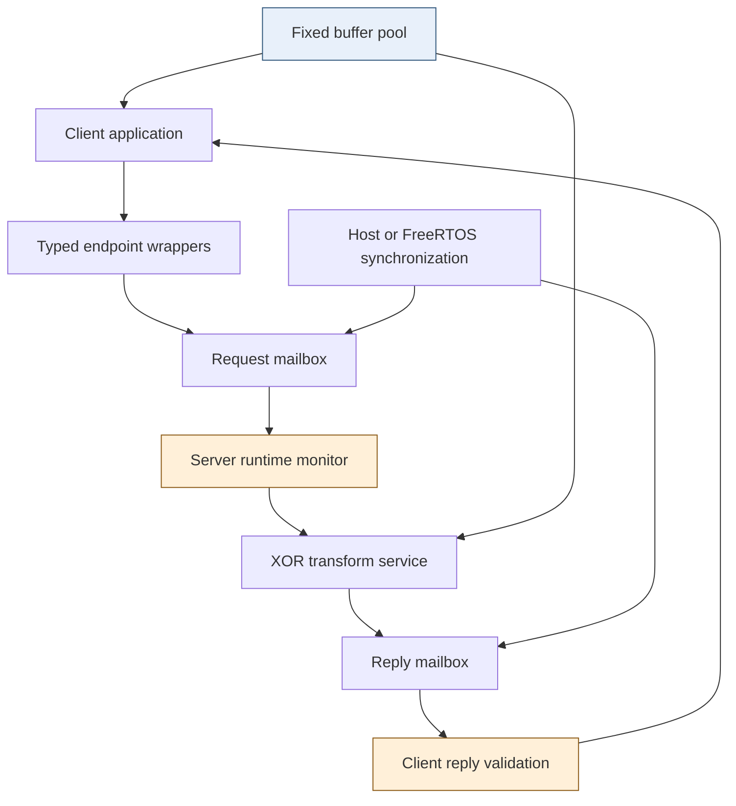
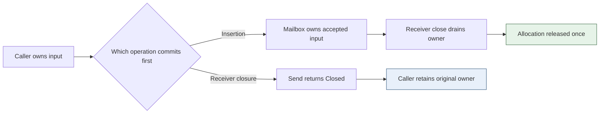
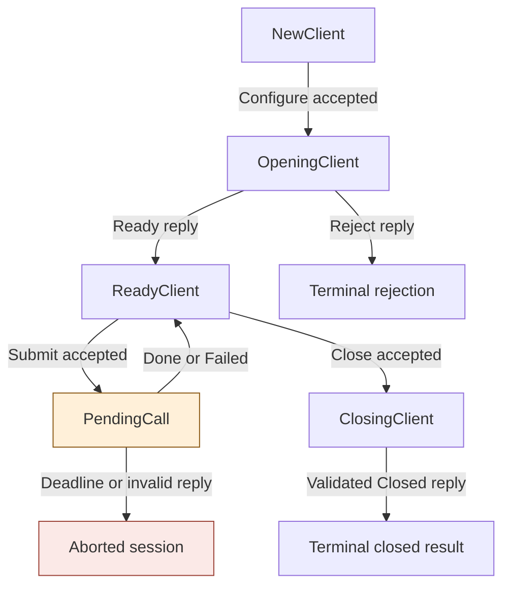
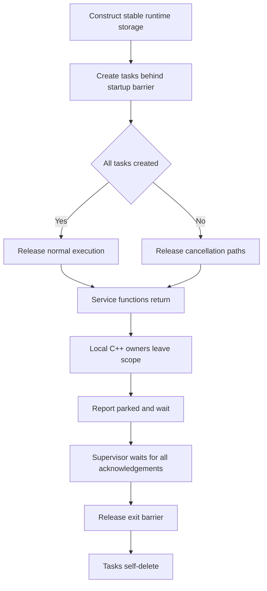
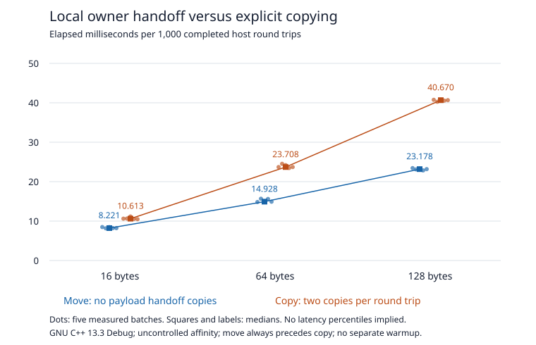

# Singularity Local Labs: Ownership and Protocol Contracts on the Cardputer ADV

A FreeRTOS queue can tell a producer that an item was accepted. It does not automatically tell the rest of the program who now owns the item's payload, whether a receiver may discard it during shutdown, or whether the producer is allowed to issue another request before receiving a reply. Those questions belong to the programming model built above the scheduler.

This project implements two such mechanisms on an ESP32-S3: an ownership-transfer channel and a typed request/reply protocol. The purpose is not to replace FreeRTOS or reproduce the Singularity operating system. It is to take two ideas emphasized by the supplied Singularity-inspired handbooks—exclusive ownership across communication boundaries and explicit communication contracts—and implement enough of them to test their benefits and limitations on real hardware.

The resulting C++17 code runs on a Linux host and on a USB-connected M5Stack Cardputer ADV. The board has a LoRa shield attached, but this implementation does not initialize or transmit through it. Keeping the first experiments local is a deliberate architectural decision: ownership and protocol semantics should be understandable before an unreliable radio link adds another class of failure.

> [!summary]
> - The implemented mailbox moves real C++ owners into bounded storage; it does not byte-copy owning representations through a FreeRTOS queue.
> - Distinct endpoint types remove some illegal calls from the application API, while runtime validation checks actual messages and moved-from endpoint use.
> - Host Debug, Release, and ASan/UBSan suites pass. The Cardputer passes 3,000 send/close race trials, a 1,000-message pipeline, and 1,000 concurrent protocol calls.
> - These results are scoped evidence, not a complete correctness proof. Report-time probes found two additional limitations: pool-local allocation identity and an ambiguous close result.

## 1. Why this is more than task decomposition

The initial temptation was to start with a button task, an LED task, and a console task connected by queues. That would have been a useful introduction to FreeRTOS, but it would not have demonstrated a distinctive Singularity-inspired mechanism. Separating functions into tasks changes scheduling and organization. It does not necessarily strengthen the rules governing memory access or legal conversations.

The useful question is more precise: **which programs should this runtime reject, and which failures should have an unambiguous resource outcome?** The answer led to two connected projects.

The first project rejects accidental copying of payload owners and defines ownership at every local handoff. A successful send empties the caller's owner. A full or closed mailbox preserves it. Receiver closure releases accepted queue-owned buffers exactly once, without reclaiming a buffer already in use by a worker.

The second project restricts application operations according to protocol state. A ready client may submit a request. A pending call may poll for a completion, but has no submission method. Received messages must still pass a monitor that checks tag, direction, identity, request number, payload shape, and current server state.

These mechanisms are complementary. Ownership alone cannot stop a client from issuing two logically conflicting requests. A typed protocol alone cannot make it safe to free a buffer still used by a worker. The implementation becomes interesting where resource lifetime and protocol state must change together.

The source materials have different scopes. The ESP32 handout's first project is “Own every byte,” while the general Rust/Linux handbook's ownership work is Lab 2 and its contract work is Lab 3. This implementation is a local-first adaptation of those mechanisms, not completion of the entire four-project LoRa sequence. The original radio integration, retry policy, authentication, capability broker, manifest launcher, and airtime scheduler remain separate work.

## 2. System boundaries and the actual architecture

The implementation lives in `labs/singularity-local/` within the repository named in the frontmatter. Its portable core consists of four headers: `platform.hpp`, `pool.hpp`, `mailbox.hpp`, and `protocol.hpp`. The host executables and firmware test runner use those same implementations rather than maintaining separate test and embedded protocol algorithms.



The pool arrows indicate the origin and eventual release of storage, not permission for the application and worker to mutate the same buffer simultaneously. At any valid handoff, only one owner is responsible for a particular live allocation.

There are two executable arrangements. The ownership project uses a producer, a transform service, and a sink, each with its own host thread or FreeRTOS task. The protocol project uses a client and server with a request mailbox and a reply mailbox. Both arrangements apply the same deterministic transform: XOR each byte with `0x5a`.

The synthetic operation is intentionally simple. It gives us an exact expected result and makes allocation identity observable without adding sensor calibration, peripheral configuration, or display timing. A zero-length request is also meaningful: it tests ownership and protocol behavior without payload processing.

### 2.1 A service is not a memory-protected process

A service owns application state and exposes endpoints. A task supplies a stack and an execution context scheduled by FreeRTOS. These roles are related but not identical.

All native tasks in this configuration share the MCU's address space. A private C++ field prevents ordinary client source code from accessing that representation; it does not protect the field against arbitrary memory corruption or deliberately invalid native operations. A deleted copy constructor stops a normal C++ copy expression; it cannot prevent unrelated native code from copying memory through an unchecked pointer.

The project's guarantees therefore apply to the reviewed runtime and cooperative application code using its API. They are not a sandbox for untrusted native extensions. The supplied handbooks make this distinction explicit: reproducing aspects of an exchange-heap discipline is not equivalent to reproducing Singularity's verified software-isolation machinery.

This distinction also applies to availability. A bounded mailbox limits accepted message storage. It does not stop a task from allocating elsewhere, monopolizing CPU time, or corrupting the runtime. A whole-system guarantee requires additional mechanisms and a larger argument.

## 3. Ownership begins with allocation identity

The fixed pool contains sixteen physical slots, each with 128 payload bytes. Twelve slots are available through the application's general allocator, and four are reserved for supervisor control allocations. General-pool exhaustion is a normal finite result; it does not trigger fallback allocation from an unbounded heap.

The physical payload capacity is:

```text
16 slots * 128 bytes = 2,048 payload bytes
```

Each slot also stores its checked length, generation, allocation ID, and live flag. The owner contains a private pool reference, slot index, generation, and allocation ID. The generation distinguishes successive uses of a physical slot. The allocation ID identifies a logical allocation within that pool.

This distinction matters because equal bytes do not imply equal allocations. Copying sixty-four bytes into another slot creates a new allocation with a new release responsibility. Moving an owner preserves the allocation's identity and storage.

The core implementation is in `core/include/sl/pool.hpp`. Allocation checks the output is empty, rejects lengths above 128, locks the pool, chooses a free slot in the permitted range, checks counter exhaustion, clears the payload storage, updates metadata, and constructs the sole owner.

```text
allocate(length, output):
    reject nonempty output
    reject length above physical capacity
    lock pool
    reject exhausted allocation counter
    find free slot in allowed range
    reject exhausted slot generation
    advance allocation ID and generation
    zero slot bytes
    mark slot live with checked length
    move newly constructed claim into output
    update counters
    unlock
```

The slot is cleared before publication. This avoids returning bytes left behind by a previous allocation. In the current implementation the full 128-byte physical array is cleared even when the requested length is smaller; this detail also contributes to the cost of the copying benchmark later in the report.

### 3.1 The owner is movable, not copyable

The important interface is deliberately small:

```cpp
class OwnedBuffer {
public:
    OwnedBuffer() noexcept;
    OwnedBuffer(const OwnedBuffer&) = delete;
    OwnedBuffer& operator=(const OwnedBuffer&) = delete;
    OwnedBuffer(OwnedBuffer&&) noexcept;
    OwnedBuffer& operator=(OwnedBuffer&&) noexcept;
    ~OwnedBuffer() noexcept;

    bool valid() const noexcept;
    uint64_t allocation_id() const noexcept;
    size_t size() const noexcept;
    bool read(size_t index, uint8_t& out) const noexcept;
    bool write(size_t index, uint8_t value) noexcept;
    void reset() noexcept;
};
```

A move transfers the private claim and clears the source. Move assignment first releases any allocation already held by the destination. Self-move is defined as a no-op. Destruction calls `reset()`, which validates the claim and returns the slot.

The implementation does not expose a general raw-payload pointer. Reads and writes validate ownership and bounds under the pool mutex. That is conservative and introduces per-access synchronization overhead, but it makes the initial correctness argument smaller. A bulk-access interface could improve performance later, provided its lifetime and reentrancy rules were reviewed separately.

`size() == 0` is not a validity test. An empty owner reports zero size, but so does a valid zero-length allocation. The latter still consumes a slot, has a nonzero identity, and must eventually be released.

### 3.2 What C++ checks, and what it does not

An expression that copies `OwnedBuffer` fails compilation because its copy constructor is deleted. A method call on a moved-from owner still compiles. The checked method returns failure because the source no longer has a live claim.

This is why `std::move` must not be described as a compile-time revocation operation. It is a cast that enables move overload resolution. The actual move constructor or assignment implements source invalidation. C++ does not generally prevent later use of the old variable, and an escaped raw pointer would not be revoked by clearing the wrapper.

Generation checks have a similarly specific scope. They can reject a stale representation presented to a checked API while the pool still exists. They cannot make a dangling pool pointer safe after premature pool destruction. Stable pool lifetime is therefore a separate invariant, enforced by construction and shutdown ordering rather than by the generation field alone.

At a quiescent checkpoint, the pool must satisfy:

```text
allocations = releases + live_general + live_control
12 = free_general + live_general
 4 = free_control + live_control
```

The test helpers also require zero live allocations after each completed scenario. These counters are useful reconciliation evidence. They are not a persisted per-location ownership ledger, and the current implementation does not pretend otherwise.

## 4. Why the mailbox contains actual C++ objects

The repository already contained an ordinary FreeRTOS producer/consumer example in `0002-freertos-queue-demo/`. It sends a small struct containing two integers. That is an appropriate use of `xQueueSend`: FreeRTOS copies the configured number of bytes into queue storage.

The same operation is not an ownership transfer for a nontrivial C++ object. A byte copy does not execute `OwnedBuffer`'s move constructor and does not empty the original wrapper. Copying its representation into a FreeRTOS queue would bypass the deleted-copy interface and could leave two representations claiming the same slot.

Passing a pointer through the queue does not resolve this automatically. It still requires a separate protocol for the pointed-to object's lifetime, ownership transfer, and failure cleanup. For this project, retaining the actual owning object in the queue is easier to reason about.

The mailbox therefore uses a fixed array of `std::optional<detail::Message>`. An occupied optional contains a real message constructed in place. The message contains trivial protocol metadata and at most one `OwnedBuffer`. It is itself move-only.

```cpp
std::array<std::optional<detail::Message>, Capacity> slots;
```

`std::optional` does not require heap allocation for this storage. Insertion constructs into a vacant slot. Removal moves into a known-empty output. Resetting the moved-from slot then destroys an empty owner rather than releasing a live buffer.

A message has an explicit empty state as well as an empty payload state. This matters for control messages: a valid `Close` message has no payload but is not an empty output object. A receive operation rejects a nonempty output rather than silently overwriting a control message or an existing owner.

### 4.1 Acceptance is a precise event

`Mailbox::try_send` performs the following operations:

```text
validate that input is a message
lock mailbox
reject if sender or receiver is closed
reject if queue is full
move-construct input into vacant tail slot
advance tail and occupancy
unlock mailbox
signal receiver wake event
return Accepted
```

Insertion under the mailbox mutex is the send's linearization point. That is the conceptual instant at which the queue takes responsibility for the payload. Before it, the caller owns the input. After it, the caller is empty and an occupied queue slot owns the message.

The distinction between acceptance and execution is fundamental. `Accepted` does not promise that the receiving service will process the message. A receiver may close immediately after insertion, drain the accepted item, and release it without invoking the application. The transport has still honored its contract: it accepted responsibility and reclaimed the resource correctly.

The higher protocol layer must interpret disappearance after acceptance conservatively. It cannot retroactively report a failed pre-enqueue send and return a buffer the worker may already own.

### 4.2 Full means no ownership transfer

When capacity is exhausted, the input message remains unchanged. The caller retains its allocation ID and bytes and may retry with bounded backoff or abandon the operation and release the owner.

The `try` in `try_send` means it does not wait for queue capacity. It does not mean lock-free, wait-free, or a proven hard real-time bound. The operation can wait for its internal task mutex. Scheduling assumptions and critical-section analysis would be needed for a stronger timing guarantee.

The first mailbox capacities are four and one. Testing capacity one is particularly useful: it forces the implementation to confront a full queue with the smallest possible amount of buffered state.

## 5. Closure is part of the ownership algorithm

It is insufficient to implement successful send and receive correctly and treat closure as cleanup added afterward. Closure changes who is responsible for accepted work and must be ordered against admission using the same synchronization discipline.

Closing the sender stops future sends while permitting the receiver to drain accepted messages. Once the queue becomes empty, receive returns `Closed`. Closing the receiver also stops admission, but moves all queued messages into a fixed temporary drain array and empties the ring. The drain array is destroyed after releasing the mailbox mutex.

The send-versus-receiver-close race has exactly two valid outcomes:

| Mutex ordering | Send result | Owner after the operations finish |
|---|---|---|
| Insertion occurs first | Accepted | Close cleanup releases the accepted item; caller is empty |
| Receiver closure occurs first | Closed | Caller still owns the unaccepted input |

There is no third legitimate outcome where both caller and queue claim the allocation, or where neither is responsible for it.



### 5.1 Why destruction occurs outside the queue lock

Destroying a live owner acquires the pool mutex to return its slot. If mailbox closure destroyed payloads while holding the mailbox mutex, it would introduce nested mailbox-to-pool acquisition. Other future code might acquire the same locks in reverse order, producing a deadlock.

The current design avoids that dependency. Under the mailbox lock, closure only moves owners into empty drain slots. Those moves transfer fields and do not release an existing destination. After unlock, destruction acquires the pool mutex independently.

This yields an audit rule more useful than a general instruction to “keep critical sections short”: **every move performed under the mailbox lock must target empty owning storage**. If a destination unexpectedly owns another allocation, move assignment would release it under the queue lock and invalidate the argument.

The same reasoning explains `OutputNotEmpty`. Rejecting receive into a live output is not merely an API preference. It prevents an unnoticed destructor from running inside the queue's critical section.

## 6. Wakeups preserve information, not message counts

A receiver that observes an empty queue may block until something changes. The difficult case is a sender inserting after the empty check but before the receiver actually waits. A correct wake mechanism must retain that notification.

The portable `WakeEvent` represents a binary pending event. On the host it uses a mutex, condition variable, and pending flag. On ESP-IDF it uses a statically allocated binary semaphore. Multiple signals may coalesce because the queue state, not the signal count, determines how many messages are available.

```text
receive_until(deadline):
    repeat:
        result = try_receive(output)
        if result is not Empty:
            return result
        if current time reaches deadline:
            return Timeout
        wait on retained wake event until deadline
```

There is no separate “clear notification” operation between checking the queue and waiting. Such a clear could discard a signal associated with already accepted work and leave the receiver blocked despite a nonempty queue.

### 6.1 Why the implementation changed from task notifications

The preimplementation guide proposed FreeRTOS task notifications. During implementation, the wake adapter changed to a static binary semaphore. The reason was lifecycle coupling rather than message semantics.

A sender releases the mailbox mutex before signaling. If a receiver task were deleted after queue closure but before that post-unlock signal, the sender could notify a stale task handle. A stable semaphore avoids referencing a receiver task at all. It also permits constructing the channel before creating its receiver.

This does not remove lifetime requirements. The semaphore and mailbox still must outlive every sender, receiver, and closer. It moves the requirement from a task handle to supervisor-owned synchronization storage, which fits the static firmware test runner more naturally.

The adapter is task-context only. It does not permit blocking mutex use from an interrupt. These local projects need no ISR; a later radio adapter will require a separately reviewed ISR-to-task path.

## 7. The local protocol makes legal conversations explicit

The protocol is named `TransformLocal/1`. It uses two capacity-one mailboxes and allows one outstanding request per session. The client first negotiates a maximum payload length between one and 128 bytes. Individual submitted payloads may still be zero length.

The messages are `Configure`, `Ready`, `Reject`, `Submit`, `Done`, `Failed`, `Close`, and `Closed`. Every message carries a session identity and service generation. Data requests carry a nonzero increasing request ID; control messages use request ID zero.

`Failed` is a valid application result. The test server rejects every seventeenth request before modifying any byte. The reply returns the original owner unchanged. `Done` returns the same owner after XOR transformation. A malformed message, in contrast, is a protocol failure and aborts the session.



The graph describes semantic transitions. A failed enqueue does not perform the corresponding send transition. If the request queue is full, `ReadyClient` remains ready and the input owner remains with the caller.

### 7.1 Typestate removes methods rather than checking a mode flag

The application-facing wrappers have different method sets:

```cpp
ConfigureResult NewClient::try_configure(uint16_t major,
                                        uint16_t maximum) & noexcept;
OpenResult OpeningClient::poll(int64_t deadline) & noexcept;
SubmitResult ReadyClient::try_submit(OwnedBuffer& input) & noexcept;
CloseResult ReadyClient::try_close() & noexcept;
ReplyResult PendingCall::poll(int64_t deadline) & noexcept;
Status ClosingClient::poll(int64_t deadline) & noexcept;
```

A `PendingCall` has no `try_submit` method. Calling it is a compile-time error rather than a runtime branch that checks a `pending` boolean. The same is true for submitting through a New, Opening, or Closing wrapper.

The wrappers own a move-only lease referring to stable session storage. Constructors that create live endpoints are private to the factory and transition code. Moving a wrapper empties its source lease. Destroying an active lease aborts the session; destroying a moved-from lease does nothing.

This design prevents accidental endpoint duplication through normal copying, but it still needs dynamic invalidation. After a successful submission, the source variable remains a C++ object even though its lease has moved into the pending result. Calling a method on it compiles and returns `InvalidEndpoint` at runtime.

### 7.2 Conditional consumption is the main API decision

The client methods are lvalue-qualified and consume their endpoint only on the appropriate successful transition. This matches mailbox semantics and makes Full retry straightforward.

Consider `ReadyClient::try_submit`:

```text
validate live endpoint, owner, size, and next request ID
remember input allocation ID and length
construct Submit message with a moved input owner
attempt mailbox insertion
if insertion fails before acceptance:
    move the original owner back into input
    preserve Ready and request ID on Full
    return the appropriate error
otherwise:
    transfer the endpoint lease into PendingCall
    remember expected request, allocation ID, and length
    return Accepted with PendingCall
```

The temporary message owns the payload between staging and insertion. It is not an unaccounted interval. On failure, the original allocation returns to the caller; the method does not construct a new byte-identical buffer and pretend identity was preserved.

The return values use a finite `Status` plus an optional next endpoint, rather than a general variant-based result library. This is compact, but the legal status/field combinations are not fully represented by the type system. Callers must check status before consuming `next`. This tradeoff becomes important in the close-result limitation discussed later.

### 7.3 Full cannot consume a request number

The next request ID advances only after a completed call produces a new Ready endpoint. A Full submission does not consume it. The server expects the exact next ID in this local FIFO, stop-and-wait protocol.

This policy is intentionally different from the eventual LoRa retry policy. An injected duplicate local request is a protocol violation, not an instruction to look up a retained reply. Duplicate suppression across unreliable delivery belongs to a later layer with different state and identity requirements.

## 8. Runtime validation protects the effect boundary

Typed wrappers constrain ordinary local API use. They do not prove that every actual message received by a service is valid. Internal defects, stale work, and explicitly untyped test adapters can still construct unexpected envelopes.

`Session::server_step` checks identity, tag, state, request ordering, metadata, and payload bounds before applying the transform. The client validates reply identity, expected request, success/error shape, length, and allocation number before returning a ready lease.

The server is driven by one task. Its protocol state and retained reply are private to that worker; they are not concurrently modified by the client. The shared abort flag is atomic, and request/reply queues provide their own synchronization.

This separation matters when abort races with execution. `Session::abort` closes synchronized queues but deliberately does not reset the server's current reply. That reply may be in use by the worker. Only the worker's next cooperative step releases it.

### 8.1 Reply backpressure is still ownership

After transformation, the server prepares a complete `Done` or `Failed` message. If the reply mailbox is full, the server retains that message as worker-local state. It does not accept a second Submit and accumulate more work.

```text
server_step:
    if aborted or deadline expired:
        release worker-local reply
        stop

    if a reply is already retained:
        try to enqueue it
        on Full, keep it and return
        on Accepted, commit the next server state
        return

    receive and validate one request
    prepare the correct reply and owner
    try to enqueue the reply
```

This is why “one outstanding request” needs a server-side implementation, not merely a comment in the client API. The worker remains logically occupied until its reply is accepted by the local transport.

The deterministic Failed branch also has a strong data condition: it occurs before any byte is modified. A checked access failure halfway through XOR is not that application failure. Returning `Failed` with partially transformed input would violate the contract. The implementation instead treats such an inconsistency as a protocol/internal failure.

## 9. Timeout ends observation, not ownership or execution

A timeout before queue acceptance can leave the caller with its input and no submitted work. After acceptance, the worker or queue may own the allocation, and the operation may already have executed. The client cannot determine nonexecution simply because no valid completion was observed before its deadline.

The pending API therefore reports `OutcomeUnknown` for terminal timeout after acceptance and aborts the session. It does not manufacture another Ready endpoint or return a buffer that might still belong to the server.

The tests cover both important orderings:

```text
Case 1:
    Submit accepted
    client deadline expires
    queued request is drained during abort
    server dispatch count remains zero

Case 2:
    Submit accepted
    server applies XOR and queues Done
    client deadline expires before validating Done
    session aborts and queued reply is released
    server dispatch count remains one
```

The second case is a direct counterexample to “timeout means nothing happened.” No radio is necessary to teach the distinction.

There is an additional API detail: `poll(deadline)` receives an absolute deadline argument from its caller. The wrapper does not store an immutable deadline internally. The supplied runners normally preserve one deadline for each polling loop, but a future client could extend its observation window by repeatedly passing a later value. A deadline policy enforced by the endpoint itself would require storing that policy in the pending state.

Dropping a pending endpoint is similarly not immediate reclamation. If the server retains an owner because its reply queue is full, client destruction aborts the queues but leaves that worker-local owner live until the server reaches cleanup. The correct accounting checkpoint is cooperative quiescence, not the instant the client object disappears.

## 10. FreeRTOS startup and shutdown must respect C++ lifetime

The Cardputer firmware is a finite test runner. It creates tasks behind a startup barrier, runs one scenario to completion, audits resources, and leaves the board quiet after the final PASS marker. It does not provide a keyboard menu or display status page.

Task creation can schedule a new task before the creating task finishes constructing the rest of the system. The runner therefore creates persistent task-control records first and keeps new workers behind the startup barrier. If any creation fails, it marks launch cancelled and releases already created tasks only into their cancellation paths.

At normal completion, each worker returns from the function containing its C++ owning objects, reports that it is parked, and waits at an exit barrier. The supervisor waits for all expected parked acknowledgements before allowing self-deletion.



The runtime pool, session, and synchronization storage remain static until reset. This keeps their lifetime independent of the final task-deletion scheduling. Host tests use thread joins before destroying the corresponding objects.

The runner does not assume `vTaskDelete(other_task)` executes destructors for that task's automatic C++ objects. A worker that cannot reach the cooperative stop point is a failed lifecycle test, not permission for the supervisor to reclaim memory it may still use.

This is another place where the project goes beyond conventional task decomposition. The architectural rule is not merely “run the service in its own task.” It is “construct and terminate the task in a way that preserves the ownership argument.”

## 11. The evidence is deliberately layered

The project uses several forms of evidence because none is sufficient on its own. Static type checks, runtime assertions, concurrent execution, state exploration, and hardware tests answer different questions.

### 11.1 Negative compilation checks constrain the public API

The host build includes positive examples that must compile and negative examples that must fail for the intended reason. Cases include copying an owner, submitting from the wrong endpoint state, copying a live endpoint type, and attempting private construction.

A compilation failure caused by a missing header would not establish any ownership or protocol property. The harness checks both a neighboring positive case and a relevant diagnostic category such as a deleted operation, missing member, or private constructor.

These checks do not prove that the entire implementation is type-safe. They establish that selected invalid programs cannot express their attempted operations through the intended interface.

### 11.2 Runtime suites force small, difficult states

The common ownership suite tests general-pool exhaustion, control reserve, zero/maximum/oversize lengths, invalid access, move assignment, self-move, capacity-one Full retention, receive-output preconditions, sender drain, receiver drain, and timeout.

The protocol suite tests configuration rejection, valid Done and Failed paths, Full retention, wrong direction, session, generation and request metadata, missing payloads, replacement allocations within one pool, duplicate requests, retained replies, pending destruction, timeout before and after execution, and graceful close.

These suites are compiled into both the host tests and the firmware. The firmware intentionally includes the internal untyped adapter because adversarial testing is its purpose. A normal application should not install that adapter as part of its public interface.

### 11.3 Closure tests establish orderings, not every possible schedule

The host and final firmware each run 3,000 close-race trials:

- 1,000 complete insertion before receiver closure begins.
- 1,000 complete receiver closure before insertion begins.
- 1,000 allow sender and closer to run concurrently.

The ordered tests force the two legal operation outcomes. The concurrent tests exercise scheduler-selected interleavings. Together with the single-lock algorithm, they provide useful evidence for the closure argument, but they do not enumerate every instruction-level execution.

The board race sender creates a fresh queue for each trial and waits for a closer acknowledgement before destroying it. This explicit acknowledgement is important: a guessed delay would not establish that the other task had finished using the queue.

### 11.4 The reduced protocol model finds a real missing branch

The ticket contains a Python breadth-first explorer whose global state is:

```text
(client_state, server_state, request_queue, reply_queue)
```

Both queues have capacity one. Sends are enabled when their outbound queue has space; receives require the expected head tag. The search continues to a fixed point and reports reachable nonterminal states with no enabled transition.

The baseline reaches fourteen states and sixteen edges, with one terminal state and no modeled deadlock. Removing the client's Failed receive branch produces a reachable deadlock after this sequence:

```text
client sends Configure
server receives Configure
server sends Ready
client receives Ready
client sends Submit
server receives Submit
server sends Failed
```

The server has produced a legal reply, but the client has no transition that can consume it. This is a concrete example of protocol design requiring all legal alternatives, not just a successful request/reply example.

A second mutant makes both peers receive initially and deadlocks in the initial state. These mutants also test the checker: a tool that reported success for both would not be credible evidence for the baseline.

The model omits payloads, allocation identity, time, abort, real task scheduling, and arbitrary computation. It also permits an indefinite sequence of successful requests instead of eventually choosing Close. “No deadlocked state in this finite abstraction” is not the same claim as “all real programs terminate.”

### 11.5 Recorded hardware results

The final Cardputer capture contains:

```text
PASS ESP32 pipeline completed=1000 allocations=1000 releases=1000 high_water=11
PASS ESP32 3000 ordered/concurrent closure races
PASS ESP32 protocol completed=1000 allocations=1000 releases=1000
SIZES pool=2688 mailbox4=488 message=64 session=672
SINGULARITY LAB ALL PASS RF=DISABLED
I (9983) main_task: Returned from app_main()
```

The three-task pipeline validates the same allocation ID at each hop and verifies every transformed byte at the sink. The protocol task pair validates 1,000 calls, including every-seventeenth-request Failed behavior. Both scenarios reconcile allocations and releases after workers park.

The host CTest suite has six top-level entries, each containing multiple cases. Debug, Release, and AddressSanitizer/UndefinedBehaviorSanitizer configurations pass all six. No ThreadSanitizer result is claimed.

## 12. What the memory and timing measurements mean

The measured object sizes on the ESP32-S3 are more informative than the payload-pool size alone:

| Object | Measured size |
|---|---:|
| Pool, including metadata and mutex | 2,688 bytes |
| Capacity-four mailbox | 488 bytes |
| Internal message | 64 bytes |
| Session, including its two mailboxes | 672 bytes |

Task stacks, task-control blocks, event groups, logging, startup allocations, and other IDF state are additional memory. The main test task uses a 24,576-byte configured stack, and worker tasks use 8,192 bytes each. Advertising the whole runtime as a 2 KiB design because its physical payload storage is 2 KiB would be incorrect.

The pipeline's observed general-pool high-water mark is eleven. That is consistent with one producer-local owner, four queued for transform, one transform-local owner, four queued for the sink, and one sink-local owner. This is a useful capacity explanation, not a whole-firmware memory bound.

### 12.1 The copy-versus-move experiment

The host benchmark uses a separate two-task stop-and-wait round trip with two payload handoffs. It is not the three-task correctness pipeline. Both benchmark modes perform the same transform, validation, and checked access operations.

In move mode, handoff moves the owning wrapper without copying payload bytes. In copy mode, each handoff allocates another general slot, copies the bytes through the checked API, sends the new owner, and releases the original after acceptance. Each completed no-retry copy-mode round trip therefore records two full payload copies.

The recorded matrix contains thirty batches and 30,000 completed exchanges: five batches of 1,000 at each size and mode. The raw data is preserved with this note as [CSV](_assets/singularity-local-copy-move.csv), and the [standard-library plotting script](_assets/singularity-local-copy-move-plot.py) regenerates the figure.



Median batch durations from this Debug host run are:

| Payload | Move, milliseconds per 1,000 exchanges | Copy, milliseconds per 1,000 exchanges |
|---|---:|---:|
| 16 bytes | 8.221 | 10.613 |
| 64 bytes | 14.928 | 23.708 |
| 128 bytes | 23.178 | 40.670 |

These results show that this measured copy-mode implementation took longer in these runs. They do not isolate the cost of a raw memory copy instruction. Every additional copied byte passes through checked read and write methods, which acquire the pool mutex. Copying also adds allocation, full-slot zeroing, and release operations.

For the two-handoff round trip, move mode performs approximately four checked payload accesses per byte: producer write, transform read/write, and client validation read. Copy mode adds another four checked accesses per byte across the two explicit copies. This helps explain why the measured difference grows with payload size without implying that the same ratio would hold for a bulk-copy implementation.

The pool high-water mark also changes. Move-mode runs report one live allocation at their peak. Copy-mode runs generally report two and one records three. A copy sender retains its original until the replacement is accepted; scheduling can allow the client to begin its next allocation before the worker finishes releasing an older local original. That overlap is a real consequence of the copy lifetime policy.

### 12.2 Measurement limits are part of the result

The batches were collected in a Debug build, with uncontrolled CPU affinity, no separately recorded warmup, and move preceding copy within each batch. Worker construction occurs before the timed interval, but first scheduling and synchronization can still affect early exchanges. These are limitations of the experiment, not reasons to discard its raw data.

The plotted dots represent entire batches. Their spread is not a distribution of individual request latencies, and dividing a round-trip duration by two would not produce an independently measured one-way latency. A stronger performance study should randomize or alternate ordering, add a documented warmup, compare instrumented and uninstrumented runs, and collect individual timings separately if tail latency matters.

Most importantly, these measurements are from the host. They are not ESP32 latency and not LoRa airtime. Local no-copy handoff does not imply no copying during serialization, SPI transfer, or reconstruction on a different board.

## 13. Build reproducibility exposed a hidden environment dependency

The firmware baseline is native ESP-IDF 5.5.4 and C++17, using the Cardputer's USB Serial/JTAG console. The implementation does not require Arduino, RadioLib, or an M5 display framework.

The first build attempt nevertheless ran the wrong SDK. The shell inherited `IDF_PYTHON_ENV_PATH` for an ESP-IDF 5.4 Python environment. Sourcing the 5.5.4 export script reported missing dependencies and an incompatible esptool, but the shell still had the older `idf.py` available. The subsequent version check printed `ESP-IDF v5.4.1`.

The exact component manifest prevented an accidental wrong-version build:

```yaml
dependencies:
  idf:
    version: "==5.5.4"
```

This is an example of a configuration check becoming part of the evidence chain. Without it, a compiler or linker error might have been misdiagnosed as a runtime implementation problem. The corrected wrapper clears inherited IDF variables, selects the already installed 5.5 Python environment, sources the desired SDK, and asserts the resulting version before invoking a build or flash.

Two smaller failures were also useful. The incomplete first configure left a generated build directory that IDF refused to remove automatically; only that new failed directory was deleted. The correct-SDK compile then needed an explicit `esp_app_format` private dependency for `esp_app_desc.h`.

The build initially requested a minimum C++17 feature, but IDF retained its newer default language mode. Setting the target's actual `CXX_STANDARD` to 17 made the embedded language selection match the portable implementation contract.

### 13.1 Serial ownership is part of test validity

Each flash was preceded by checking the exact USB device for existing holders. The flasher exited before the single-open collector started. This avoided interleaved output and misleading serial timeouts from competing processes.

The collector waits for the final PASS marker and checks for failure banners. The firmware's initial two-second delay provides time to attach after flashing; it is not used to force any concurrency test outcome. Automatic post-flash reset worked in both recorded runs, so no manual reset was needed during this session.

The final image is 206,272 bytes (`0x325c0`) and fits the default one-megabyte app partition. Its SHA-256 is:

```text
c73ad1741a1d2603850e7d4cdf59ac49376822e1713c4c9bbbb715c7f0472568
```

The embedded version string is `dc497ad-dirty`, because the board work was built before its final commit and the repository also contained unrelated modifications. Rather than describing that as a clean committed binary, the ticket records hashes of twenty-four source/build-script files, the exact compilation command, generated configuration hash, and flashed image hash. Those source files were rechecked against the tree committed in the final implementation milestone.

## 14. Two additional limits found while writing this report

A project report should explain more than the cases already represented by a green test suite. Reviewing the actual implementation against its strongest claims revealed two boundary conditions worth testing. Both probes use the explicit untyped test adapter on the host; neither is a claim about normal application behavior or a failure observed in the Cardputer run.

The [probe source](_assets/singularity-local-boundary-probe.cpp) and its [observed output](_assets/singularity-local-boundary-probe.txt) are preserved with this note. No firmware source was changed as part of this report.

### 14.1 An allocation number is not a complete cross-pool identity

`Pool` has its own allocation counter. The first allocation from pool A can have ID 1, and the first allocation from pool B can also have ID 1. Each owner remains internally valid because `Pool::matches` checks the private pool reference, slot, generation, and ID against the correct pool.

`PendingCall`, however, remembers only the numeric allocation ID and length for reply validation. It does not remember the pool identity. The current same-pool replacement test catches a newly allocated replacement because its number differs. It does not cover a replacement from another pool with the same number and length.

The report-time probe performed the following sequence:

```text
allocate request 1 from pool A
submit and let server produce Done
remove the legitimate reply through the test adapter
release its original owner
allocate buffer 1 of the same length from fresh pool B
insert that owner into the otherwise unchanged reply envelope
return the envelope to the reply mailbox
poll the pending call
```

The observed output was:

```text
cross_pool original_id=1 replacement_id=1 accepted_done=1
```

The pending call accepted a different physical allocation. The tested worker implementation itself does not perform this substitution, and its normal return path moves the original owner. The finding instead limits the stronger claim that the client monitor independently verifies original-allocation identity for any valid owner supplied by an internal peer.

A correct hardening direction is to compare an opaque identity containing both the pool identity and the allocation sequence, or to enforce one allocator domain for the session and validate it explicitly. Exposing a mutable pool pointer to applications is not necessary; the comparison token can remain an internal immutable value. The guarantee should be stated in terms of the complete identity actually checked.

### 14.2 A terminal Closed status conflates two different outcomes

The normal close path is an explicit exchange: the client sends Close, the server sends Closed, and the client validates that acknowledgement. `ClosingClient::poll` returns `Status::Closed` on that successful path and invalidates the lease without aborting the session.

There is also a transport-closure branch. If receive returns something other than Item or Empty, the method calls `fault(Status::Closed)`. That aborts the session but returns the same public status value used for validated graceful completion.

The probe asked the server to produce its Closed reply, removed the reply through the test adapter, and then polled the client against the empty sender-closed reply mailbox. The observed result was:

```text
missing_close_ack returned_closed=1 session_aborted=1
```

The internal abort flag distinguishes the cases, but the endpoint's public close result does not. An application holding only that endpoint cannot treat `Status::Closed` as proof that the final acknowledgement was validated.

The repair is conceptually small but semantically important: distinguish graceful closure from transport loss, using separate statuses or a result type with separate terminal alternatives. This is an example of why a finite status enum is not automatically a complete protocol contract. The result representation must preserve the distinctions the application is allowed to conclude.

### 14.3 What these findings change

Neither finding invalidates the recorded pipeline, concurrency, or normal protocol results. They show that two broader claims need narrower wording and additional tests. The first depends on allocator-domain assumptions; the second loses information in the public error encoding.

They also identify a productive next iteration. Add these probes as regression cases before hardening the implementation, then update the guarantee matrix and API documentation alongside the code. Do not silently strengthen the prose while leaving the checked identity or close result unchanged.

## 15. What is implemented, what is proposed, and what remains

The preimplementation intern guide was deliberately more expansive than the compact first implementation. The code now establishes the two local mechanisms and their host/hardware demonstrations, but some proposed tooling remains absent.

| Area | Implemented now | Remaining refinement |
|---|---|---|
| Ownership | Fixed pool, move-only claims, checked access, queue transfer | Complete allocator-domain identity at reply boundary |
| Closure | Sender drain, receiver cleanup, ordered and concurrent trials | More exhaustive machine-interleaving exploration |
| Protocol types | New, Opening, Ready, Pending, Closing wrappers | Stronger result alternatives and deadline ownership |
| Runtime monitor | Tag/state/identity/request/payload checks | Distinct graceful-close versus transport-loss result |
| Diagnostics | Finite counters and bounded scenario summaries | Persisted per-location ownership trace |
| Performance | Raw Debug host copy/move matrix | Warmup, order control, bulk-access comparison, board timing |
| Hardware | Finite USB-observed test firmware | Optional console scenario launcher and device UI |
| Radio | Explicitly disabled | Validated shield profile, RadioService, wire protocol |

The implementation also uses header-only core code rather than the guide's proposed `.hpp`/`.cpp` split, static binary wakes rather than task notifications, and status-plus-optional result records rather than a general variant-based Result library. Those changes are documented design choices, not hidden incompatibilities.

The next radio work should preserve the distinction between local and remote boundaries. An allocation does not move across the air. A remote board reconstructs bytes in different storage; request and service identities, not local pool IDs, correlate the operation. Lost replies, retries, duplicate suppression, persistent boot identities, authentication, and airtime pacing require their own contracts.

No RF frequency or power profile was approved in this work. The physically attached shield is not evidence of validated radio operation. A future transmit experiment must verify the exact carrier configuration, antenna, regional constraints, and restart pacing before enabling transmission.

## 16. How to read and reproduce the project

The repository root is:

```text
/home/manuel/workspaces/2025-12-21/echo-base-documentation/esp32-s3-m5
```

The workspace directory predates this project; the implementation and this report are from 6 September 2026. The source snapshot discussed here is `fb35635`, with the final code milestone at `08dbb8f`.

For a first code-reading pass, follow one buffer rather than reading every file in directory order:

1. Read `Pool::allocate_range` and the owner move/reset methods in `core/include/sl/pool.hpp`.
2. Read `Mailbox::try_send`, `try_receive`, and `close_receiver` in `mailbox.hpp`, checking every empty-destination assumption.
3. Read `ReadyClient::try_submit` and `PendingCall::poll` in `protocol.hpp`, tracking both the lease and payload across each return branch.
4. Read `Session::server_step` and `abort`, distinguishing worker-local state from synchronized shared state.
5. Read the firmware Runner and race tasks in `firmware/main/app_main.cpp` to understand storage lifetime and quiescence.

From the repository root, the permission-free host path is:

```bash
bash labs/singularity-local/scripts/reproduce.sh
/tmp/sl-host/pipeline
/tmp/sl-host/protocol_tests
/tmp/sl-host/benchmark
```

The last command prints the full measured matrix; redirect it deliberately if saving a new dataset. It does not reproduce the historical numbers exactly, nor should it. Record the new compiler, build mode, machine load, and run conditions with any comparison.

The pinned firmware build path is:

```bash
bash labs/singularity-local/scripts/idf.sh build
```

On a fresh firmware tree, run `idf.sh set-target esp32s3` once before normal builds. Flashing replaces the board's current application. Check exclusive serial ownership and coordinate any required reset before using the documented flash/collector recipe in the repository README. This report does not initiate another flash.

To reproduce the additional report-time probes, compile the companion asset against the project headers and test adapter:

```bash
REPO=/home/manuel/workspaces/2025-12-21/echo-base-documentation/esp32-s3-m5
ASSETS=/home/manuel/code/wesen/go-go-golems/go-go-parc/Projects/2026/09/06/_assets
c++ -std=c++17 -pthread \
  -I"$REPO/labs/singularity-local/core/include" \
  -I"$REPO/labs/singularity-local/tests" \
  "$ASSETS/singularity-local-boundary-probe.cpp" \
  -o /tmp/sl-report-boundary-probe
/tmp/sl-report-boundary-probe
```

Future corrected code should produce different boundary-probe results. These are reproductions of limitations in the specified snapshot, not requirements that the limitations remain.

### 16.1 Evidence and source references

The ticket directory, relative to repository root, is:

```text
ttmp/2026/09/06/SINGULARITY-LORA-LABS--singularity-inspired-freertos-lora-labwork/
```

The most useful artifacts are:

| Artifact | What it establishes |
|---|---|
| `sources/esp32_lora_os_four_projects.md`, sections 3–6 | Embedded source requirements and ownership/RPC distinction |
| `sources/singularity_os_lab_handbook.md`, Labs 2–3 | Ownership and typed-contract teaching foundations |
| `design-doc/01-intern-guide-to-ownership-channels-and-typed-protocols-on-esp32.md` | Preimplementation analysis, pseudocode and phased design |
| `reference/02-diary.md` | Chronological decisions, commands, failures and commit references |
| `reference/03-implementation-evidence-and-cardputer-operating-guide.md` | Implemented API map, adaptations and operational recipe |
| `analysis/01-local-contract-model-results.json` | Finite model counts and mutant counterexample |
| `analysis/02-host-copy-move.csv` | Thirty measured host batches |
| `analysis/06-cardputer-final.txt` | Final live board results |
| `analysis/07-build-provenance.json` | Source, configuration and flashed-image fingerprints |
| `analysis/08-final-host-validation.txt` | Debug, Release and ASan/UBSan CTest output |

Precise implementation anchors at this snapshot include `pool.hpp:45–102` for pool identity/allocation, `mailbox.hpp:45–100` for queue transitions, `protocol.hpp:132–169` for the server monitor, `protocol.hpp:212–243` for submission/completion, and `protocol.hpp:253–261` for close results. The report-time limitations follow from these actual paths, not from the earlier interface sketches.

The local commit sequence is also useful provenance:

- `2e3a012`: design guide, imported source materials and reduced model.
- `ec6ce5f`: ownership pool/mailbox, host races, pipeline and measurements.
- `dc497ad`: typed protocol and static/dynamic negative tests.
- `08dbb8f`: Cardputer firmware, live evidence and operating guide.
- `fb35635`: final diary, print acknowledgements and document-delivery record.

The guide and implementation supplement were uploaded to reMarkable under `/ai/2026/09/06/SINGULARITY-LORA-LABS`. The work also produced an overall thermal plan and start/completion slips for each of four implementation phases. Those artifacts support continuation and review; they are not substitutes for the source and test evidence.

## 17. Conclusion: the useful result is a precise contract

The central result is not that FreeRTOS queues are inadequate, that messages always outperform shared memory, or that C++ endpoint types reproduce a verified operating system. The result is that a small embedded runtime can make important resource and communication rules explicit enough to implement, test, and challenge.

The ownership project defines the exact point at which a sender loses responsibility and specifies what happens when admission fails or a receiver closes. The protocol project connects legal operations to endpoint states and refuses to equate accepted work, executed work, and observed completion. The hardware runner preserves those arguments through task startup and cooperative shutdown.

The strongest part of the project is the connection between a claimed property and a concrete mechanism: deleted copies, checked live claims, one mutex ordering insertion and closure, typed method availability, runtime validation before effects, and quiescent resource accounting. The report-time findings reinforce the same lesson. A numeric ID is only as strong as its identity domain, and a result enum is only as informative as the distinctions it preserves.

This is a solid local foundation for the later LoRa work precisely because it does not pretend that local success solves remote delivery. The next implementation should extend the existing explicit contracts, not replace them with an assumption that a packet send means a remote action completed.

## Related notes

- [[PROJ - CoreS3 QRCode Scanner - Hardware Bring-Up UART Framing and FreeRTOS Ownership]] — another embedded project concerned with ownership at a device boundary.
- [[PROJ - Cardputer Web Serial Demo - Technical Project Report]] — related Cardputer and USB-facing application work.
