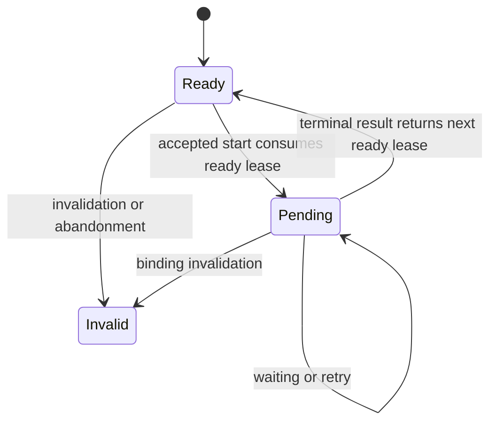
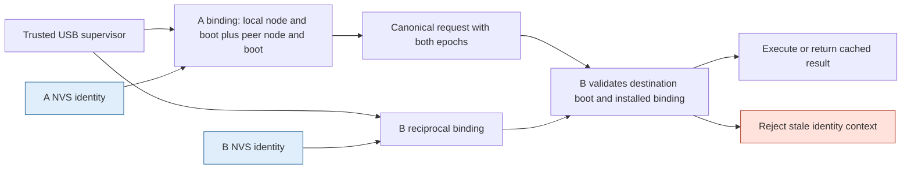
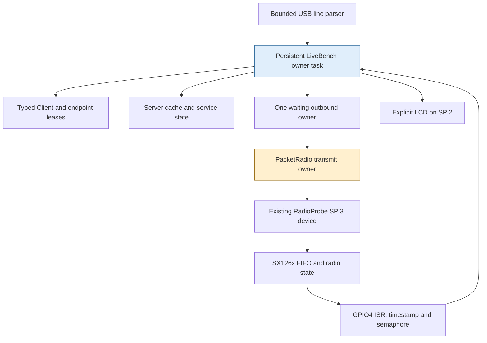
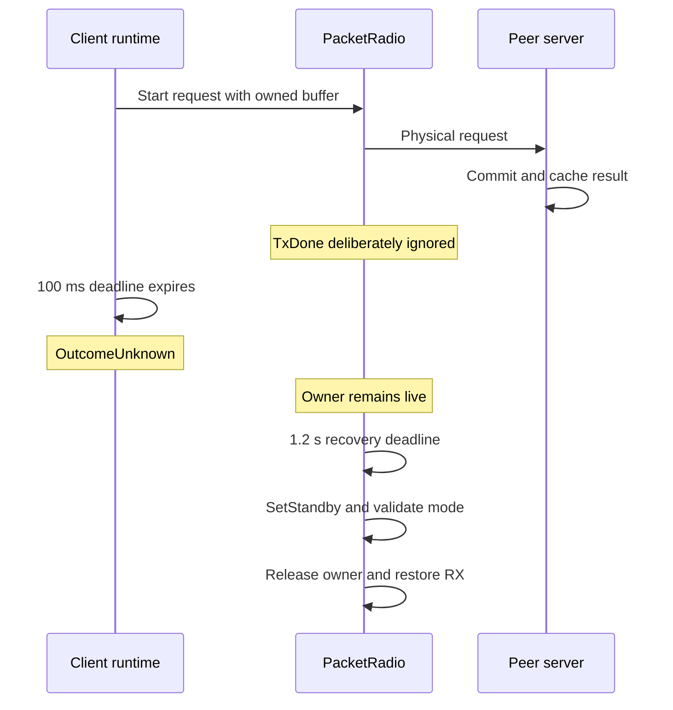
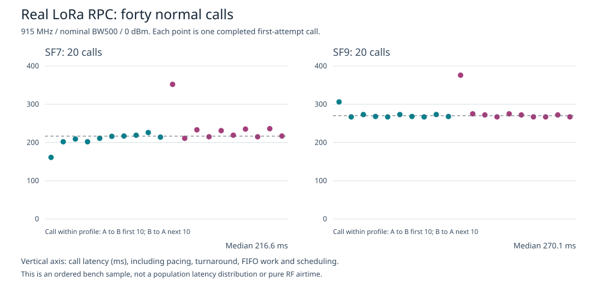
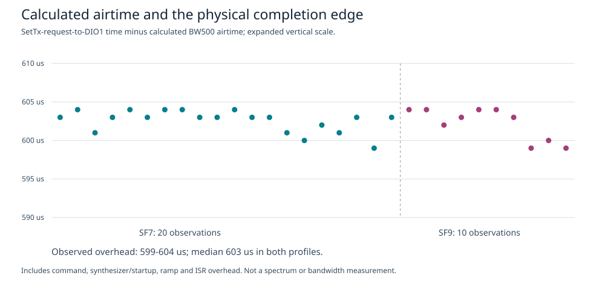

# Singularity RPC: Ownership, Retries, and Failure Semantics on Two LoRa Radios

A remote call can execute on the server and still time out on the client. A client can also finish waiting while its radio driver must continue owning the transmit buffer. These are different forms of incompleteness: one concerns knowledge of a remote effect, and the other concerns local resource lifetime. A useful RPC implementation has to represent both without treating either as an exceptional accident.

This project implements that distinction in C++17 on two ESP32-S3 boards. It extends a local ownership-and-protocol runtime into a bounded datagram RPC system, first through deterministic loss experiments and then through actual LoRa transmissions. The resulting system is small enough to inspect: a canonical codec, a typed client, a fixed server cache, a persistent owner task, a native SPI adapter, and explicit USB provisioning. Its most instructive results are not the successful messages. They are the experiments in which a request committed, a reply disappeared, a caller timed out, a driver retained its allocation, or a peer rebooted with a different identity epoch.

The report develops those mechanisms from their contracts, then follows them into the hardware implementation and measured evidence. It is a project analysis rather than a claim that this firmware is a production radio network or a reimplementation of the Singularity operating system.

> [!summary]
> - The final image passed **40 real RPC calls**, ten in each direction at each of SF7 and SF9, using sensor, LED-state, and health services. Every call completed on its first attempt.
> - An **11-case physical fault/epoch matrix** validated cached retries, uncertainty after lost replies and reset, verified transmit recovery, ownership retention after a logical timeout, and a zero-start NotSent result.
> - The runtime publishes NVS-backed boot epochs only after commit and readback. Bindings remain fixed within a boot, and radio reconfiguration does not reset request IDs.
> - The link is explicitly **unauthenticated**. Close-range behavior and software state transitions are established; range, RF certification, adversarial security, and durable exactly-once execution are not.

## 1. From local ownership to remote uncertainty

The earlier project, [[PROJ - Singularity Local Labs - Ownership and Protocol Contracts on the Cardputer ADV]], studied communication within one MCU. Its ownership channel moves C++ payload owners into bounded storage, and its endpoint types restrict which protocol operations an application can invoke. That work established a local rule: after a successful handoff, the sender must no longer behave as the owner of the transferred buffer.

Radio communication changes what can cross the boundary. A pointer, mutex, or allocator identity from board A cannot become a usable object on board B. A receives or constructs a local representation, encodes bytes, transmits them, and B constructs a separate local representation from received bytes. Ownership transfer remains useful inside each board, but remote communication requires an additional contract about message identity, retries, effects, and failures.

Consider a request to advance a synthetic sensor sample counter. The first transmission reaches B, which increments the counter and forms a response. If that response is lost, A has two possible explanations for its timeout: the request never arrived, or the request arrived and the response did not. Nothing in the absence of a reply distinguishes those explanations. Retrying with a new request ID would risk a second execution. Retrying the same request without server-side duplicate handling would have the same problem.

The implementation therefore separates three questions:

1. **Who owns a local allocation?** The answer changes at explicit local moves and driver completions.
2. **Which logical request does a packet represent?** The answer comes from canonical bytes and a binding-scoped request ID.
3. **What can the caller conclude?** The answer depends on starts, replies, deadlines, and identity validation, not merely on whether a timer expired.

These distinctions explain the project structure. The portable core addresses the second and third questions independently of a particular radio. The physical adapter addresses the first question while supplying real transmission and reception events to that core.

## 2. What was built, and what the evidence covers

The implementation lives in `labs/singularity-rpc/`, beside `labs/singularity-local/`, within the repository named in the frontmatter. Although the workspace path contains December 2025, this project and its hardware experiments were developed on September 6, 2026.

The hardware consists of two Cardputer ADV boards, identified on the bench as A and B, with LoRa Caps using the documented SX126x command interface. The physical experiment uses 915 MHz, nominal bandwidth 500 kHz, SF7 or SF9, coding rate 4/5, an eight-symbol preamble, explicit headers, CRC, normal IQ, and a private sync word of `0x1424`. The configured output power is 0 dBm. Those are driver settings, not measured output-power or spectrum characteristics.

The program has two execution phases at startup. It first runs the local and simulated RPC suites with radio transmission disabled. It then initializes the transceiver and enters a persistent USB-controlled physical bench. Actual packet operation requires an explicit `arm` command; startup does not begin an autonomous transmission campaign.

| Evidence class | What was observed | What it does not establish |
|---|---|---|
| Portable tests | RPC Debug, Release, and ASan/UBSan suites passed 4/4 each; predecessor Debug passed 6/6 in final validation | Every possible scheduler, power-failure, or hardware-error history |
| Deterministic campaigns | Earlier host/MCU runs reconciled all 30 rows of a 6,000-call campaign | A natural RF loss distribution |
| Bounded exploration | 2,048 configured fault schedules, covering 4,096 calls | Exhaustive verification of the physical world |
| Raw physical packets | Exact 48-byte messages in both directions at SF7 and SF9 | RPC semantics by themselves |
| Final physical RPC regression | 40 first-attempt successes with checked service results | General network throughput or range |
| Extended physical fault matrix | Eleven checked uncertainty, ownership, and epoch cases | Durable exactly-once execution or cryptographic authenticity |

The evidence is deliberately separated because the mechanisms are different. A deterministic trace can establish event-order behavior in its model. A physical receive log can establish that bytes crossed between devices. A receiver commit counter can establish that a service operation occurred. None of those facts should be substituted for another.

## 3. The local owner is a checked allocation reference

The local foundation uses an `OwnedBuffer` whose copy operations are deleted and whose move operations invalidate the source. The buffer does not expose unrestricted raw memory. Reads and writes validate the pool, slot, allocation sequence, generation, and bounds before accessing bytes. The pool contains sixteen 128-byte slots: twelve available through a general allocator and four reserved for control allocation by the supervisor.

The intended ownership invariant is that each live allocation has one owning C++ object. Moving that object changes which component is responsible for release. It does not make the payload globally accessible or remove the need to validate a stale reference.

This foundation mattered before radio work because the earlier report had found a cross-pool identity defect. Two pools could each issue their first allocation with the numeric ID `1`. If a protocol compared only that number and the payload length, a wrong-pool response could appear to identify the original allocation. The correction introduced an opaque identity consisting of a pool domain and an allocation sequence. Pool domains are generated under a process-local mutex, and exhaustion fails rather than silently reusing a domain.

```text
old comparison:
    reply.allocation_id == request.allocation_id

corrected comparison:
    reply.identity == (request.pool_domain, request.allocation_sequence)
```

The numeric allocation ID still exists as a diagnostic value, but the local protocol compares the stronger identity. This identity is local to the runtime; it is neither a network identity nor a cryptographic capability.

A second predecessor correction distinguished graceful close from transport closure. An absent closing acknowledgement must not be reported as a successful protocol close merely because the underlying transport closed. The corrected local API reports `TransportClosed` for that condition. The earlier vault report remains a historical account of the defects as they were found; the RPC project's first implementation phase fixed them before building on the local runtime.

There is a general lesson in both corrections. A value that looks unique in one component may not be unique in the scope where it is compared. An event that ends a transport may not complete the higher-level protocol. Correctness depends on the scope of an identity and the meaning of a transition, not on the convenience of the representation.

## 4. Canonical packets make retries comparable

The network representation is not a packed C++ structure. The codec writes fields explicitly into a bounded byte array, with a fixed 44-byte envelope and little-endian integer encoding. This avoids depending on compiler padding, target alignment, or the in-memory representation of enumerations and `size_t`.

| Offset | Width | Field |
|---|---:|---|
| 0 | 2 | Magic bytes `R`, `S` |
| 2 | 1 | Version |
| 3–7 | 5 | Kind, flags, service, opcode, reply status |
| 8 | 2 | Source node |
| 10 | 2 | Destination node |
| 12 | 8 | Source boot epoch |
| 20 | 8 | Destination boot epoch |
| 28 | 4 | Request ID |
| 32 | 4 | Grant ID |
| 36 | 4 | Service generation |
| 40 | 2 | Body length |
| 42 | 2 | Reserved zero bytes |
| 44 | Variable | Body |

`Packet` provides 128 bytes of storage, while `Frame` provides a 64-byte body. The codec can represent a 16-byte tag when its flag is set, but the implemented client/server lab mode rejects nonzero flags. The existence of that field is not an authentication implementation: no MAC is computed or verified by this physical bench.

Decoding checks exact length, supported version, reserved bytes, nonzero identity fields, service/opcode agreement, and service-specific body shape. Sensor and health requests have empty bodies. An LED request has one byte restricted to zero or one. Successful replies have exactly eight, one, or twelve bytes for sensor, LED, or health respectively. Error replies have empty bodies.

A useful detail is that encode and decode are transactional with respect to their output arguments. They construct a temporary representation, validate it, and assign the caller's output only on success. A failed decode does not leave a partly updated frame that downstream code might accidentally use.

Canonical representation also supports the retry algorithm. The client retains the encoded request and sends those same bytes on each attempt. The server can compare a duplicate with the original complete packet, rather than deciding equality from only a request number and a subset of body fields. A matching ID with different canonical bytes is a conflict, not permission to reinterpret the earlier operation.

LoRa CRC belongs to a different part of this design. It detects transmission corruption at the packet level. It does not establish that the sender is authorized, and it does not replace the codec's shape and identity checks.

## 5. Typed endpoints constrain the application, while the runtime constrains time

The application-facing protocol has two endpoint types. A `ReadyClient` can start a call. An accepted start consumes that ready endpoint and produces a `PendingCall`. A pending endpoint can poll but has no start method. Completion can return the next ready endpoint.



This is a useful restriction, but not a complete compile-time proof. C++ permits moved-from objects, and native code can retain a pointer to the underlying runtime. The implementation therefore also validates runtime lease numbers and ownership of the current endpoint. Types remove some invalid operations from the normal interface; runtime checks handle states that cannot be excluded by those types alone.

The client stores one total deadline when the call is accepted. Polling does not provide a new deadline and cannot extend the operation. It also stores a per-attempt reply window, set to two seconds by the physical supervisor. A retry becomes due when the previous reply window expires, provided the total deadline has not expired and fewer than three starts have occurred.

The important events are distinct:

```text
application admission
    -> request becomes due
    -> physical attempt starts
    -> local transmit completes
    -> reply window runs
    -> matching reply or another attempt or terminal deadline
```

An accepted application call is not yet a radio start. A radio start is not remote execution. A local TxDone event is not a reply. The client therefore exposes outcomes whose meaning follows from observed events:

| Outcome | Meaning in this implementation |
|---|---|
| `Waiting` | The logical call has not reached a terminal state |
| `Ok` | A matching successful reply was accepted before the total deadline |
| `RemoteError` | A matching terminal error reply was accepted |
| `NotSent` | The call ended without a recorded start |
| `OutcomeUnknown` | A start occurred, but no conclusive terminal reply was accepted |
| `Invalid` | The endpoint or invocation is invalid |

A `Busy` reply is handled as a wait/retry condition rather than immediately becoming a terminal remote error. Reply validation checks direction, binding identities, both boot epochs, request ID, service, opcode, and flags. The client advances its deadline state before accepting a received reply, so a late packet cannot retroactively turn an expired call into success.

Another invariant is less visible in the type signatures: the supervisor must construct one Client runtime per binding lifetime. Reconstructing it with the same binding would reset its request sequence and invalidate the assumptions of the server's high-water mark. The physical console enforces a deliberately narrow policy—one binding installation per boot—and keeps the runtime alive across calls and SF changes.

## 6. A fixed cache gives a bounded duplicate-suppression contract

The server is not an unbounded map from every historical request to every historical result. It has eight fixed binding entries. Each entry retains its binding, a high-water request ID, a state, the most recent canonical request, and the corresponding reply.

The states are `Idle`, `InProgress`, and `Completed`. Admission reserves the request before execution. That ordering matters: a duplicate arriving while an operation is in progress must not create another execution simply because no completed reply exists yet.

The admission algorithm can be written directly from the implementation:

```text
decode and validate destination node, destination boot, generation, and mode
find the installed grant and validate the complete request binding

if request ID < high-water:
    return Stale

if request ID == high-water and entry is not Idle:
    if canonical request differs:
        return Conflict
    if entry is InProgress:
        coalesce without another execution
    else:
        return the cached reply

if entry is InProgress:
    return Busy

retain the new canonical request
advance high-water
mark InProgress
return permission to execute
```

Execution produces the reply, stores it, and marks the entry completed. In the physical implementation this happens synchronously on the owner task, so the admission index is consumed immediately. The core's `InProgress` state still expresses the reservation contract, but the current cache index is not an asynchronous, generation-stamped handle suitable for an arbitrary worker task.

The high-water mark explains both the strength and the limit of the guarantee. While the binding and its state remain intact, replaying the latest identical request returns the same result without another execution. After a newer request has replaced the retained reply, an older request is rejected as stale; the implementation does not promise to return every old result forever.

It would be incorrect to evict the high-water mark while leaving the same binding valid. An old request could then look new. The bounded design instead retains the high-water state until the binding's boot context changes. This makes memory usage predictable and keeps the duplicate-suppression claim explicit.

The implemented services make effects inspectable. Sensor execution increments a sample counter and returns that sequence with a synthetic signed value. LED execution changes an integer state. Health reports a local time value and generation. These are not calibrated sensing or physical GPIO control. In particular, GPIO4 must not be used as the LED service output because the radio uses it as DIO1.

## 7. Boot epochs distinguish service instances, not successful effects

A request ID alone is insufficient across reboot. If A restarts its sequence at one, or B loses its duplicate cache, a packet from an earlier runtime instance must not be accepted as a request in the new instance.

The binding therefore includes both node identities and both boot epochs, as well as a grant and generation. A request identifies not only its sender but also the particular destination boot for which it was constructed. A response reverses the node and boot directions while preserving the request context.



The native storage adapter uses a dedicated `sing_rpc` NVS namespace and a 16-byte versioned identity record. Provisioning creates a record only when one is missing; it refuses to replace an existing identity and never erases unrelated NVS. On a provisioned boot, the policy reads the record, checks for exhaustion, increments the epoch, saves and commits it, and publishes no usable identity on failure. The physical supervisor additionally reads the record back before publication.

```text
record = load dedicated identity
if missing or invalid:
    remain unprovisioned or unavailable
if epoch is exhausted:
    fail closed

candidate = same node, epoch + 1
save and commit candidate
read back and verify candidate
only then publish the physical identity
```

The factory MAC has a narrower role. It selects the A/B label and helps the USB supervisor address the intended board. It does not silently provision a node or discover a trusted radio peer. The provisioning commands explicitly assigned A to node one and B to node two.

Epochs prevent accepting a request for the wrong service instance. They do not make the service effect durable. If B executes a request and reboots before A receives the reply, B's new epoch tells A that its old context is no longer valid. It does not tell A whether the earlier effect occurred, and it does not restore B's lost cache. The physical reset experiment demonstrates exactly that distinction.

The tested persistence boundary is a software-requested MCU reboot with NVS commit/readback. Abrupt power interruption during a write, flash rollback, cloning, and deliberate erasure were not tested. Those are separate requirements for stronger identity or durability claims.

## 8. The physical runtime uses one persistent execution context

The hardware integration does not create separate client, server, radio, and display tasks with shared mutable protocol state. A persistent `LiveBench` task owns the client, server, endpoint wrappers, outgoing packet slot, driver, and display updates. GPIO interrupt handling records an edge and signals a static semaphore; it does not parse a message or call a service.



This organization is not a claim that FreeRTOS supplies memory or process isolation. It is an application-level serialization rule. The benefit is that state transitions involving a client lease, a queued reply, and a hardware owner can be reviewed in one execution context rather than as a cross-task transaction.

The existing `RadioProbe` owns the SPI3 handles and persistent transaction buffers. `PacketRadio` deliberately reuses that resource through a narrow native integration, instead of installing a second SPI3 device beside the diagnostic code. The runtime objects have static lifetime, so an ISR target or driver buffer cannot disappear when a logical call finishes.

The actual task continues after the startup suites. A legacy startup log named `RPC OWNER PARKED` is a stack high-water observation from the earlier finite runner, not evidence that the current physical owner has terminated; `LIVE READY` begins the persistent console phase. The source and current operating guide, rather than an isolated historical label, define that lifetime.

The display also separates evidence domains. It does not mark a peer tested merely because local simulation passed. In physical mode it shows the frequency/power configuration, SF, arming state, local call totals, node/epoch, server execution and duplicate counters, and LED integer state. A `FRAME RX` indication follows an accepted bound frame, not cryptographic authentication.

## 9. Hardware preparation exposed errors that a fake link could not

The first hardware problem was shared pin ownership, not RPC. LCD autodetection could touch pins used by the LoRa carrier, so the project configures the display explicitly. LCD traffic uses SPI2; radio traffic uses SPI3.

| Function | Board connection |
|---|---|
| Radio reset, BUSY, DIO1 | GPIO3, GPIO6, GPIO4 |
| Radio SCLK, MOSI, MISO, NSS | GPIO40, GPIO14, GPIO39, GPIO5 |
| Carrier I²C | SDA8, SCL9, expander address `0x43` |
| LCD SCLK, MOSI, DC, CS, reset | GPIO36, GPIO35, GPIO34, GPIO37, GPIO33 |
| LCD backlight | GPIO38 |

A status-only phase then established that both radios responded to SPI. They returned `0x2A` with device errors `0x0020`, corresponding to the documented TCXO startup oscillator condition before configuration. That was not sufficient evidence to choose an arbitrary voltage or declare packet readiness. The board vendor's Cap implementation and the RadioLib argument signature established a 3.0 V TCXO setting. The native command sequence configured DIO3, cleared the startup condition, recalibrated, selected LoRa and the candidate PHY, and entered oscillator standby.

The first configured readback produced another instructive result: `0x32`, zero device errors, LoRa packet type, and the intended sync word. The initial parser rejected its command-status value of one. Inspection of the vendor's RadioLib 7.2.1 parser showed that it rejects the documented command error codes three, four, and five, rather than treating one as a failure. The corrected native check kept the independent mode, reserved-bit, error-word, and register checks. It did not infer success from an undocumented status value alone.

The packet phase added carrier and transceiver switching. It updates only the carrier expander's P0 bit through read-modify-write operations, preserving the other pins, and enables DIO2 RF-switch control. It also applies the reviewed PA-clamp, BW500, and normal-IQ register workarounds. The PA configuration is then operated at a requested 0 dBm with a 200 µs ramp.

These details explain why the project moved to physical testing soon after a minimal adapter existed. A fake link can exercise duplicate suppression but cannot reveal a missing antenna-switch enable, a wrong TCXO argument, or a status parser that rejects normal hardware behavior. Conversely, a successful radio packet cannot prove duplicate suppression. The two forms of testing answer different questions.

## 10. Moving ownership does not mean avoiding every copy

The radio's SPI adapter uses a 1 MHz, non-DMA bus with 16-byte transaction storage. A WriteBuffer command consumes two command bytes, leaving fourteen payload bytes per transaction. A ReadBuffer transaction consumes three framing bytes, leaving thirteen payload bytes. The adapter transfers larger packets through repeated bounded chunks and validates the received length before copying into a `Packet`.

This is not a zero-copy radio implementation. The client encodes a packet, the supervisor copies it into an owned pool allocation, and the driver copies bytes into the chip FIFO. Reception performs another bounded copy. The ownership mechanism determines who may access and release each local allocation; it does not imply that serialization or peripheral transfer can be eliminated.

The distinction is particularly important for the ESP-IDF SPI queue. The code may queue a conventional driver descriptor containing pointers because the pointed-to descriptor and arrays have a controlled static lifetime. That is different from byte-copying a nontrivial owning C++ object through a FreeRTOS queue and expecting its move constructor or destructor to run.

Before each SPI exchange, the adapter waits for BUSY with a bound, queues one transaction, and retrieves its completion with another bound. If completion cannot be retrieved, it latches a poisoned state before another operation can overwrite the descriptor or its arrays. A failure path retains storage rather than turning an uncertain peripheral operation into a dangling pointer.

The poisoned-completion path was code-reviewed but not electrically forced during the physical campaign. The live experiments exercised normal SPI transfers and verified radio-state recovery after intentionally ignored TxDone. Those are useful tests, but they are not the same failure.

## 11. Logical completion and physical release form separate state transitions

The central ownership test deliberately suppresses acceptance of the next TxDone event. The packet is still physically transmitted. The driver's retained owner remains live, and the chip is not returned to normal receive handling through the usual completion path. After its recovery deadline, the driver issues standby, checks the returned mode, clears IRQ state, and only then releases the allocation and restores receive mode.



The actual SF7 caller trace includes:

```text
RPC RESULT id=5 outcome=4 attempts=1 elapsed_us=100958 driver_busy=1 service=1 body=
```

Here `outcome=4` is `OutcomeUnknown`. The pool snapshot taken while the driver was still busy showed one live allocation. After the recovery event, another snapshot showed no busy transmit owner and no live pool allocation. The experiment therefore checks both the logical result and the physical release condition; simply counting final frees would not establish that release happened late enough.

A second completion-suppression experiment used the normal call deadline. After verified recovery, the client retried the same request. The server returned the cached result, and the call completed successfully on its second attempt. The first response was not useful to a caller that had not restored its receive path, but the committed server state remained available for the retry.

A ready endpoint and an eligible radio are consequently different concepts. Polling a terminal call can return the next protocol lease while the driver still has a live transmit owner. The physical console separately checks driver availability before admitting a new user call. Treating the word “ready” as a statement about every subsystem would erase the distinction the experiment is intended to demonstrate.

## 12. Half-duplex scheduling affects both latency and admission

The physical supervisor retains one waiting outbound packet in addition to a possible live transmit owner. A received request executes synchronously, and its reply is scheduled 100 ms later. That interval allows the sender to process TxDone and return to RX before the peer begins replying.

A due reply occupies the waiting slot before a due local request is queued. If the slot is already occupied, a new reply can be omitted while the server retains its cached result. The implementation does not silently create an unbounded queue to make congestion disappear. The client can retry within its deadline, or eventually report uncertainty.

The bench also enforces a 250 ms minimum interval between starts on each node. Arming provides a ten-minute window and at most 128 starts. These are finite experiment controls, separate from the historical simulated pacing permit. They are not a proof of regulatory authorization, and the trusted supervisor can deliberately stop and rearm the bench.

The NotSent test uses the start interval rather than inventing a model-only disabled link. After A has recently transmitted B's reply, A receives a new local call with a one-millisecond deadline. Its next start is not yet eligible. The observed result is:

```text
RPC RESULT id=2 outcome=3 attempts=0 elapsed_us=1831 driver_busy=0 service=1 body=
```

The transmit counter did not increase and the pool had no live allocations. The result arrived after 1,831 µs rather than exactly 1,000 µs because the owner observes expiration on its execution schedule. The logical deadline is immutable; it is not a promise that a thread will run at the exact expiration instant.

The recorded request ID of two in this excerpt belongs to a fresh post-reboot binding lifetime. It must not be conflated with the earlier request ID two used in the lost-reply trace. Boot context is part of the identity.

## 13. What the deterministic engine contributed

Before the physical adapter existed, the project ran the same codec, client, server, allocation, and retry logic inside a deterministic event engine. Its event times were simulated microseconds, not host execution times. It used bounded traces, fixed queues, seeded losses, explicit request/reply/completion masks, and a conservative whole-packet overlap rule.

A representative full campaign made 6,000 calls and produced 30 rows. It observed 5,720 successful results and 280 expected OutcomeUnknown results, with 5,942 server commits. The unknown results included both executed and non-executed operations: 222 had committed and 58 had not. Those totals are not a measured loss rate for the physical radios. They show that the implementation's uncertainty classification is consistent with the simulator's independent execution accounting.

The bounded explorer checked 2,048 configured schedules spanning 4,096 calls. It is important to name the bound because a finite mask enumeration is not an exhaustive proof over all interrupt timings, power failures, and external traffic. The model also has its own assumptions, including synchronous service behavior and a zero modeled service delay. The physical implementation adds actual FIFO work, scheduling, and an explicit reply turnaround.

The model's main value was repeatability. A particular lost-reply order could be replayed exactly, and host/MCU campaign rows could be compared. Once the packet adapter existed, the real boards became the primary way to validate clocks, switching, IRQs, and peripheral ownership. The project did not need a second elaborate fake radio to discover that two properly configured devices could already exchange the first packet.

## 14. Reading a real cached-retry trace

The extended physical campaign dropped one reply after the server had committed. These are selected actual lines from the two board logs, grouped by board rather than presented as a globally synchronized timeline:

```text
B: RPC SERVER id=2 admission=1 commits=2 cache=0
B: RPC DROP REPLY id=2 after_commit=1 remaining=0
B: RPC SERVER id=2 admission=3 commits=2 cache=1

A: RPC RESULT id=2 outcome=1 attempts=2 elapsed_us=2188041 driver_busy=0 service=1 body=020000009EFFFFFF
```

Admission value one is `Accepted`; value three is `Cached`. The commit counter remains two across the retry, while the cache-hit counter increases. The successful body encodes sample sequence two and signed value minus ninety-eight. The cumulative commit count was already nonzero before this case, so the relevant assertion is a delta of one commit, not a demand that the absolute counter equal one.

The client took approximately 2.188 seconds because the first reply was deliberately omitted and the two-second reply window had to expire. This latency is expected behavior under the configured retry policy, not evidence that LoRa required two seconds to transmit the frame.

For the three-reply-loss case, the caller stopped after three starts with OutcomeUnknown. The receiver showed one new commit and two cache hits. That result is stronger than merely observing a timeout: it directly establishes that uncertainty did not cause repeated service execution within the intact binding.

The self-contained evidence asset accompanying this note retains the result objects, counter snapshots, selected trace lines, and image/source provenance. The complete raw captures remain in the implementation ticket.

## 15. Physical results and their interpretation

The final normal regression exercised all three services in both directions. Each spreading-factor profile contributed twenty calls, with ten initiated on A and ten on B. The checker validated the sensor sequence/value relation, the LED-state byte, and health-result structure, rather than accepting a generic success string alone.



| Profile | Calls | First-attempt successes | Minimum latency | Median latency | Maximum latency |
|---|---:|---:|---:|---:|---:|
| SF7 / BW500 | 20 | 20 | 161.064 ms | 216.551 ms | 351.989 ms |
| SF9 / BW500 | 20 | 20 | 266.919 ms | 270.056 ms | 375.963 ms |

These latencies include the full local call path: start eligibility, FIFO transfers, radio transmission, reply turnaround, peer processing, receive handling, and scheduling. The experiment executes calls in a known order and does not sample a production traffic distribution. Its maxima are observations, not hard worst-case bounds.

The extended fault matrix contains eleven cases:

| Case | Profiles | Result and independently checked condition |
|---|---|---|
| One omitted reply | SF7, SF9 | Ok after two attempts; one new commit and one cache hit |
| Three omitted replies | SF7, SF9 | OutcomeUnknown after three attempts; one new commit and two cache hits |
| Ignored TxDone with retry | SF7, SF9 | Verified recovery, then Ok on attempt two; no second commit |
| Short deadline with ignored TxDone | SF7, SF9 | OutcomeUnknown with a live driver owner; later verified release |
| Server reset after commit | SF7 | Caller remained uncertain; pre-reset effect observed and volatile cache lost |
| Request for an old server epoch | SF7 | Three rejections and no new-server commit |
| Deadline blocked by pacing | SF7 | NotSent with zero starts and unchanged TX count |

The reset-after-commit case is intentionally stronger than rebooting an idle server. The supervisor waits until B logs that it committed and dropped the response, then requests B's reboot while A is still waiting. A eventually reports OutcomeUnknown. The new B instance has an advanced epoch and empty volatile service/cache state.

A separate test installs a valid new binding on B using A's still-current identity and grant. A nevertheless sends requests targeting B's old boot. The new server rejects three of them and commits none. This distinguishes destination-epoch rejection from the simpler situation in which there is no server binding at all.

The supervisor finally reboots and explicitly rebinds both sides with fresh epochs. Normal calls then work again. This is controlled recovery through trusted setup, not automatic discovery or a distributed reconfiguration protocol.

## 16. Deriving airtime and comparing it with a physical edge

A round-trip measurement alone cannot tell whether the transceiver's modulation timing matches the configured profile. The project therefore adds a separate BW500 airtime helper and records elapsed time from the SetTx request boundary to the DIO1 completion edge.

For the restricted configuration—explicit header, CRC enabled, coding rate 4/5, eight preamble symbols, and low-data-rate optimization off—the payload symbol groups can be expressed as:

$$
g = \max\left(0, \left\lceil\frac{8L - 4SF + 44}{4SF}\right\rceil\right).
$$

The total symbol count is the preamble plus its fixed extension and the payload:

$$
N = 8 + 4.25 + 8 + 5g.
$$

With bandwidth $BW$, symbol duration is $2^{SF}/BW$, so airtime is $N2^{SF}/BW$. At 500 kHz, a 44-byte SF7 request gives $g=14$, $N=90.25$, and an airtime of 23,104 µs. A 52-byte SF9 sensor response gives 82,176 µs.

The historical helper calculates the same restricted configuration at 125 kHz. The physical helper divides that value by four; it does not silently change historical campaign timing. Integer quarter-symbol arithmetic avoids introducing floating-point rounding into this small supported configuration.



The extended physical run collected twenty SF7 and ten SF9 normal TxDone edge observations. Each exceeded the calculated airtime by 599–604 µs, with a median difference of 603 µs in both profiles. The difference includes the SetTx command path, radio startup/synthesizer and ramp behavior, and interrupt delivery. The GPIO edge is closer to the hardware event than an owner-task log timestamp, but it is still not a direct RF waveform measurement.

This comparison is useful because it catches substantial disagreement between packet length, spreading factor, bandwidth assumptions, and observed completion timing. It does not measure occupied bandwidth, spectral emissions, antenna gain, or transmitted power. In particular, a nominal BW500 setting must not be presented as proof of the measured bandwidth required by a regulatory rule.

## 17. Resource accounting, physical state, and reproducibility

The handoff state is deliberately quiescent. Both radios were stopped, neither had a busy or faulted driver state, and both pools had zero live allocations. Each node had forty-two allocations and forty-two releases in its final boot. That includes the post-rebind calls preceding the forty-call regression, not just the regression itself.

At the recorded handoff, A was node one, epoch five; B was node two, epoch seven. Both had twenty-one server commits and LED integer state one. A had twenty-two completed local calls: twenty-one Ok and one intentional NotSent. B had twenty-one Ok results. These are a dated snapshot, not values a future run should hardcode.

Free heap was 233,228 bytes on A and 232,636 bytes on B. The program also allocates a 64,800-byte startup RGB565 display sprite outside the fixed RPC pool. A bounded protocol core should not be described as a proof that every library or the entire firmware is allocation-free. The useful resource claim here is narrower: the protocol uses fixed-capacity structures, and the observed pool allocations balance after the tested completion/recovery paths.

The final firmware image is 399,968 bytes, with SHA-256:

```text
d93961eb3582e363c52467bff1abbe399d6167147e2c91df2c80fd725c7b6907
```

Its embedded version is `1784832-dirty`, because it was built before the final source/evidence commit. The handoff audit matched that image and all 58 recorded source/build-input hashes to the tested tree. This is more precise than treating the embedded parent revision alone as the complete source identity.

A final metadata review caught an older provenance helper that still hardcoded `FAKE` and `DISABLED`. The hardware captures were physical, but those capability labels were obsolete. The records received explicit correction annotations without changing their image/source hashes, and the helper now requires an explicit transport selection. This is a documentation defect with practical consequences: a correct image hash does not make every adjacent descriptive field correct.

The report's self-contained assets are:

- [Forty normal call rows](_assets/singularity-rpc-normal-calls.csv).
- [Thirty physical timing observations](_assets/singularity-rpc-timing.csv).
- [Fault results, counter snapshots, selected traces, and provenance](_assets/singularity-rpc-evidence.json).
- [Standard-library figure generator](_assets/singularity-rpc-figures.py).

Running the figure generator without arguments recreates both SVGs from the colocated CSV files. No external repository, plotting package, or network access is needed for that operation. Its optional import mode documents how the evidence was extracted from the original ticket.

## 18. Operating the bench without invalidating the experiment

The firmware uses native ESP-IDF 5.5.4 and effective C++17. The repository wrapper clears inherited SDK state and selects the pinned environment. This matters on a machine with multiple IDF versions installed: a different SDK can create build failures unrelated to the protocol.

The two stable USB identities are:

```text
A: /dev/serial/by-id/usb-Espressif_USB_JTAG_serial_debug_unit_AC:A7:04:04:88:F4-if00
B: /dev/serial/by-id/usb-Espressif_USB_JTAG_serial_debug_unit_D8:85:AC:A4:FB:7C-if00
```

Do not substitute remembered `ttyACM` numbers. Check `fuser` and use one exclusive serial owner per device. Earlier bring-up included a connection-path failure and ROM download-mode recovery; the later controlled MCU reboots worked without a manual reset, but that does not make arbitrary serial failures safe to retry indefinitely.

From the implementation repository:

```sh
bash labs/singularity-rpc/scripts/idf.sh build
# Flash one board at a time, after checking its full by-id port.

T=ttmp/2026/09/06/SINGULARITY-LORA-RPC--bounded-datagram-rpc-and-unreliable-link-semantics-for-the-singularity-lora-labs
python3 "$T/scripts/08-live-bench.py" --mode rpc --output /tmp/fresh-rpc-run
PYTHONDONTWRITEBYTECODE=1 python3 "$T/scripts/09-physical-faults.py" --output /tmp/fresh-fault-run
```

Each output directory must be new. The RPC harness explicitly provisions only missing identities, verifies the expected node mapping, and installs or checks reciprocal bindings. It does not erase an existing identity to make a test pass. The fault harness requests MCU reboots, advances durable epochs, and performs one deliberate close/reattach for each requested reboot. Both attempt to stop radios in a finally block.

For manual use, `status` reveals the current identities and bindings. `provision NODE` is allowed only for a missing identity. `bind PEER_NODE PEER_EPOCH GRANT` installs the peer context once per boot. `arm 7` or `arm 9` enables the bench, and `call SERVICE LEVEL DEADLINE_MS` invokes sensor one, LED two, or health three. `stop` ends radio activity; `reboot` resets the MCU after asserting transceiver reset.

The fault commands `drop_replies N` and `suppress_done` are explicit test facilities, not production policies. Their presence makes the failure experiment reproducible, but a trace produced with them must be described as controlled injection on a real link rather than spontaneous interference or a naturally lost GPIO interrupt.

## 19. Development findings that should influence the next version

The implementation sequence was productive because it changed testing strategy when the uncertainty changed. Ownership, canonical identity, and deadline behavior benefited from deterministic tests. Clock voltage, switch control, peripheral status, and physical turnaround required hardware. Once the minimal packet path existed, the first real A-to-B transmission succeeded before a large mock-driver framework was built.

The first smoke-test failure was in the checker: it compared the first twenty-four bytes with a twenty-six-byte literal. The receive log already contained the physical payload. The correction built and compared the complete expected 48-byte frame, including sender identity and the transmitted sequence. That is a concrete reason to retain raw evidence rather than treating a failing assertion as a diagnosis of the radio.

Native compilation also caught two platform details. The strict C++17 build required passing the wake argument explicitly to the FreeRTOS ISR-yield macro, and Xtensa's `uint32_t` typedef did not match `%u` without an explicit cast. Neither issue changed the wire format, but both reinforced the value of compiling the actual firmware early rather than relying only on a host compiler.

The main implementation milestones were:

| Commit | Contribution |
|---|---|
| `d149cf9` | Predecessor identity and close-result corrections |
| `df67726` | Canonical codec, epoch policy, and simulation pacing |
| `1884d7e` | Bounded server cache, typed retries, and fake link |
| `6e6d15f` | Campaigns, bounded exploration, and MCU simulation evidence |
| `6d52a8c` | Board-specific TCXO and candidate PHY standby verification |
| `ad053d5` | Actual packet transfer and IRQ-owned buffers |
| `1784832` | Physical typed RPC and explicit NVS identities |
| `facd1a9` | Physical loss/recovery/epoch/timing evidence |
| `78862a6` | Final diary and phase-slip handoff |

The project kept a detailed implementation diary and printed a plan plus start/completion slips for the three physical phases. Those records are useful as a chronological account, but the architectural explanation should remain independent of that chronology: the final contracts are what another engineer needs to preserve.

## 20. Limits and the next engineering questions

This is a functioning experimental RPC bench, not a secure distributed service platform. Grant IDs and boot epochs are transmitted and are not cryptographic secrets. An adversarial sender can attempt to impersonate a peer. Production authentication would require an actual authenticated packet format, key provisioning, nonce/replay policy, and an analysis of how those identities interact with reboot and rollback.

The duplicate cache is volatile and retains only the latest result per binding. It cannot answer whether an old effect occurred after the relevant state is lost. Durable exactly-once processing would require a stronger application/storage protocol, not a renamed timeout status. The current `OutcomeUnknown` is an honest result for that missing information.

The physical measurements were made at close range with controlled traffic. Range, interference, collision behavior under load, antenna matching, spectral compliance, and output-power calibration remain separate work. The operator supplied US operation and a module/antenna range including the selected frequency; the software results do not establish equipment authorization or measured compliance with RF requirements.

The recovery evidence also has a precise boundary. Ignoring TxDone and then verifying standby exercised the real transceiver's abort/recovery path. It did not force an electrically stuck BUSY pin or a peripheral transaction that could never complete. Those tests would need deliberate fault apparatus or additional controlled instrumentation, along with the same rule against reclaiming uncertain driver storage.

Several implementation extensions follow directly from the current boundaries. An asynchronous service worker would need generation-safe completion handles rather than a bare cache index. A more available supervisor would need a reviewed rebinding protocol instead of requiring paired reboots. A workload with multiple independent clients would need explicit admission and fairness policy for the single outbound slot. Each extension should preserve the distinction between application knowledge, protocol identity, and physical ownership rather than combining them into one generic completion flag.

## 21. What this project establishes

The central result is a demonstrated separation of concerns. A canonical request remains the same logical operation across multiple physical attempts. A server reserves and caches that operation within an explicit identity scope. A client reports only what its observations justify. A driver retains local ownership until it has a valid release condition, even when the caller has already stopped waiting.

The physical experiments make those statements concrete. The same request produced one commit and a cached retry. An executed request produced OutcomeUnknown after reset. A stale request produced the same uncertainty classification without execution. A 100 ms caller deadline left a live allocation until later recovery. A pacing-blocked deadline produced NotSent without transmitting. These are distinct states, and the implementation keeps them distinct.

That is the useful Singularity-inspired contribution here: communication contracts and ownership rules are not merely comments around queues. They become state transitions, bounded representations, checked identities, and observable release conditions. Extending the system now means extending those contracts without weakening the evidence they provide.

## Source map and related material

The source revision for this report is `78862a6` in `/home/manuel/workspaces/2025-12-21/echo-base-documentation/esp32-s3-m5`. The primary ticket is `SINGULARITY-LORA-RPC` under `ttmp/2026/09/06/`.

| File or artifact | Reading purpose |
|---|---|
| `labs/singularity-local/core/include/sl/pool.hpp` | Checked allocation ownership and pool-domain identity |
| `labs/singularity-rpc/core/include/srpc/codec.hpp` | Exact representation and transactional validation |
| `client.hpp`, `server.hpp`, `identity.hpp` in the same directory | Endpoint leases, duplicate state, binding and boot policy |
| `airtime.hpp`, `simulation.hpp` in the same directory | Restricted timing calculation and deterministic model |
| `labs/singularity-rpc/firmware/main/radio_probe.hpp` | Static SPI resources and clock initialization |
| `packet_radio.hpp`, `live_bench.hpp`, `nvs_epoch.hpp`, `status_screen.hpp` in the same directory | Actual peripheral ownership, supervision, persistence, and display |
| Ticket `reference/01-diary.md` | Chronological implementation and failures |
| Ticket `reference/05-physical-rpc-operating-guide-and-failure-evidence.md` | Current operating guide and evidence boundaries |
| Ticket `analysis/68-e-final-rpc/` and `analysis/71-e-extended-faults/` | Final normal and fault captures |
| Ticket `analysis/73-e-explicit-transport-provenance.json` and `analysis/74-final-handoff-audit.json` | Image/source identity and completion audit |

Related vault note: [[PROJ - Singularity Local Labs - Ownership and Protocol Contracts on the Cardputer ADV]]. It describes the predecessor at its own report-time revision; the corrections and physical extension are described here without rewriting that historical note.

Hardware references used by the implementation include the [M5Stack Cap LoRa documentation](https://docs.m5stack.com/en/cap/Cap_LoRa868), the [Cardputer ADV documentation](https://docs.m5stack.com/en/core/Cardputer-Adv), and the [Semtech SX1261/2 datasheet supplied through M5Stack](https://m5stack-doc.oss-cn-shenzhen.aliyuncs.com/1177/DS_SX1261_2_V2-2.pdf). Vendor implementation and RadioLib 7.2.1 source inspection are recorded in the ticket; the firmware itself uses the native ESP-IDF adapter rather than linking RadioLib.
