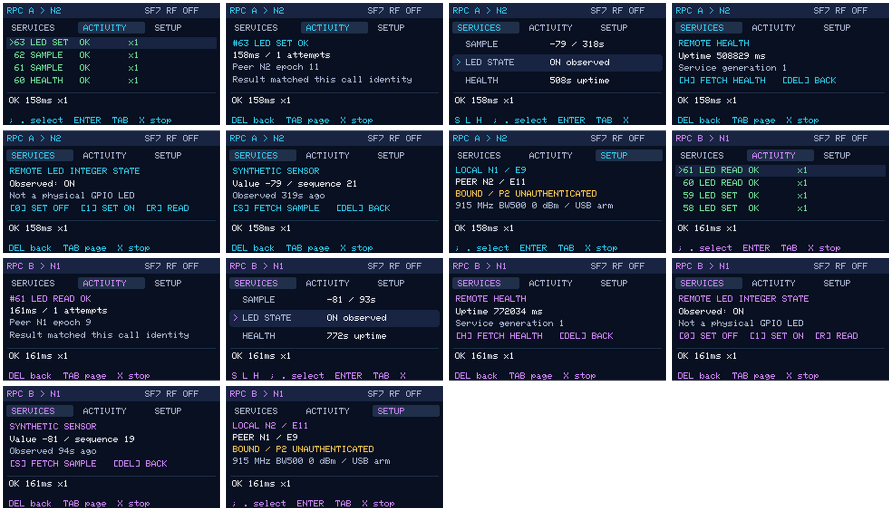
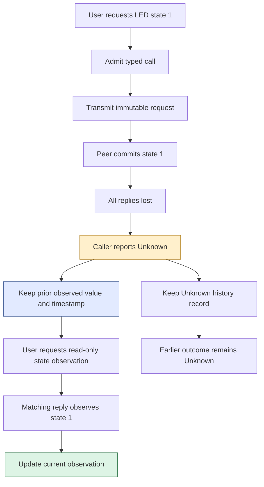
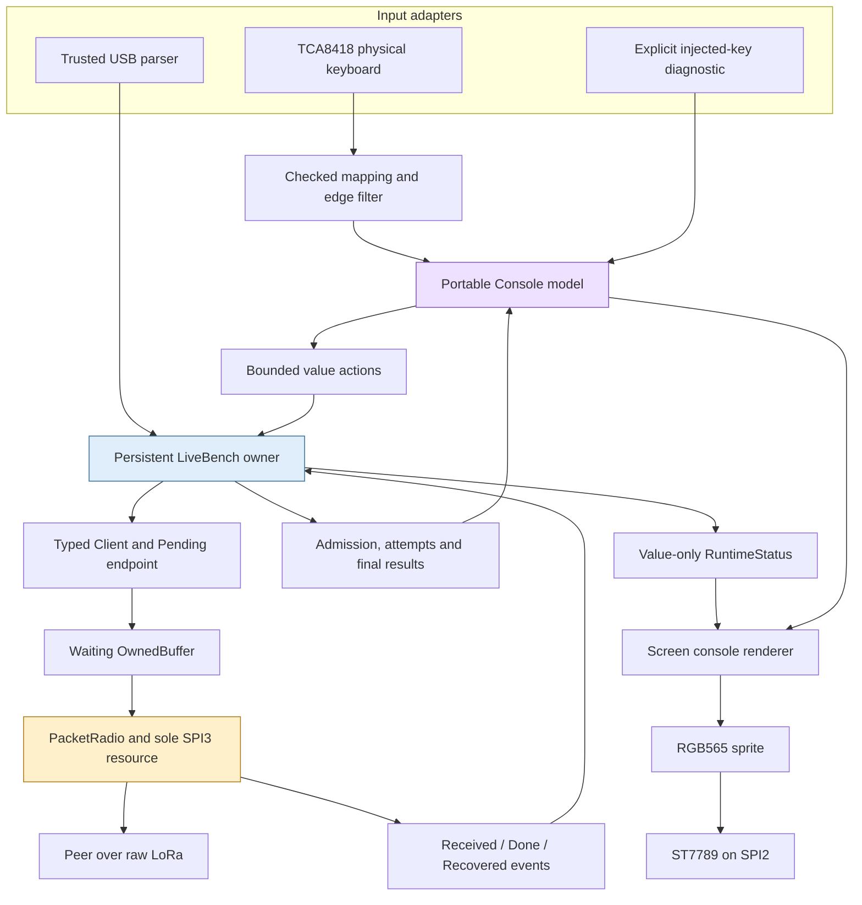
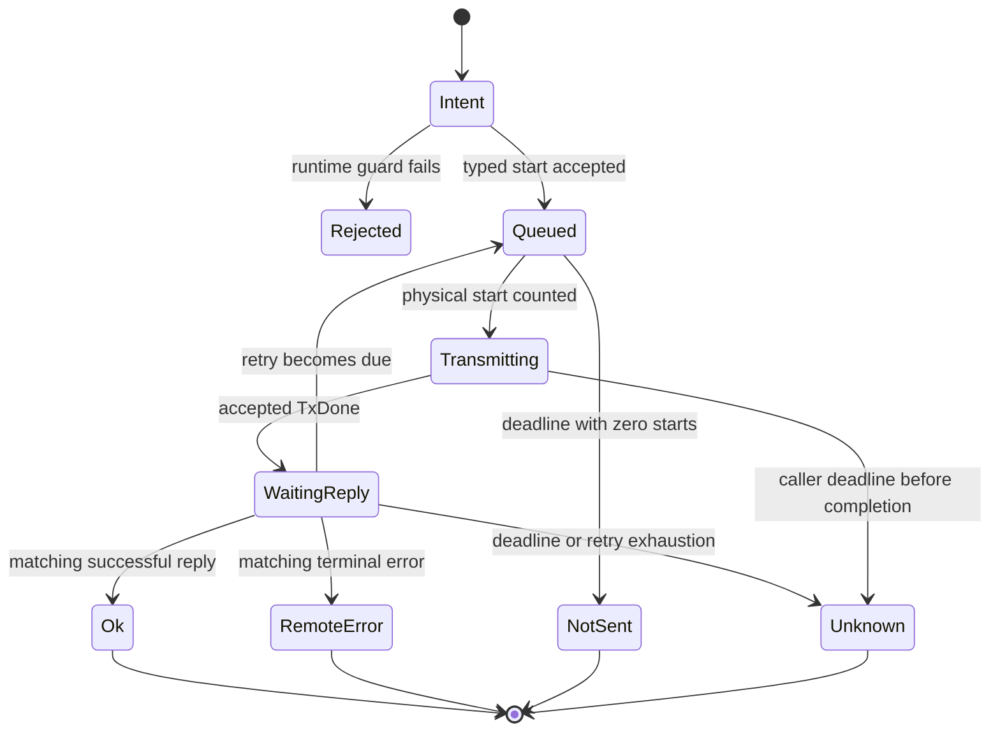
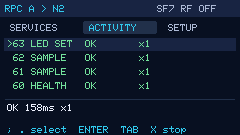
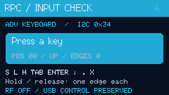
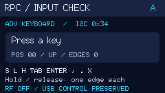
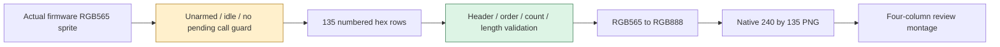

# Singularity RPC Console: Interactive State and Honest Outcomes on Two Cardputers

An interactive interface to a remote service has to represent more than the value the user requested. It must represent what the caller knows, what the peer may have done, and whether the local hardware is still occupied. Those facts can disagree without any implementation error. A request can have executed while its reply was lost; a caller can have timed out while the radio still owns its transmit buffer; a displayed value can be a valid observation that is no longer current.

The Singularity RPC Console makes those distinctions visible on two Cardputer ADV boards. It adds a keyboard-driven service dashboard, remote-state observations, activity history and detail views to the previously validated native LoRa RPC runtime. This report explains the implementation from electrical key events through typed calls to rendered pixels, including the bugs that physical testing exposed and the boundaries that the UI deliberately does not cross.

> [!summary]
> - Both boards have produced successful **physical keyboard-driven RPC calls**: nine from A and seven from B in the recorded interactive sessions.
> - The report preserves **fourteen actual firmware view captures and the montage**, plus frozen source snapshots and a self-contained evidence bundle.
> - An unknown LED write retains the old observation and marks uncertainty. A new **read-only service** observes remote state without issuing another write or rewriting the earlier Unknown result.
> - This is a verified implementation milestone, **not completion of the whole feature**. On-device arming/setup, deliberate lab controls, richer details and final acceptance were still being developed when this snapshot was recorded.

## 1. The application at this milestone

The application runs the same image on both boards. Each board can act as a caller and as a server, although the radio is half-duplex and the local Client admits one call at a time. The dashboard presents a synthetic sensor, an integer LED state and health. The activity page retains the latest sixteen completed calls. Details explain selected service data or a selected call's identity, duration, attempts and peer boot epoch.

The following montage is preserved exactly from the development review. It is assembled from the rendered sprites read out of the two running firmwares over USB. The source frames are 240 by135 pixels; the montage enlarges each frame to480 by270 and places four columns on a white background. It contains A's seven views followed by B's seven views, ordered as activity, call details, dashboard, health, LED, sensor and setup.



These are not host fixtures with invented values. The sample sequences, ages, uptime values and call IDs came from the running boards after real calls. However, the captures read the software sprite, not the LCD electrically or optically. They establish what the drawing code produced and sent to the display; they do not measure luminance, viewing angle, tearing or panel color accuracy. Navigation for the montage was injected through the explicitly labeled diagnostic input path. Physical keyboard operation was verified independently.

The montage can be rebuilt from its fourteen colocated source PNGs:

```sh
python3 Projects/2026/09/06/_assets/singularity-rpc-console-montage.py \
  --output /tmp/rpc-console-montage.png
```

The helper requires ImageMagick's `montage` command and refuses to overwrite an existing output. It reproduces the layout from the saved inputs; encoder metadata or a different ImageMagick version may change the output file hash. The original saved montage remains the reference artifact.

### Current controls

| Key | Behavior in the tested image |
|---|---|
| S | Request a synthetic sensor sample from the peer. |
| H | Request remote health. |
| L | Open the remote LED-state detail panel; do not send yet. |
| 0 / 1 in LED details | Explicitly set the remote integer state to OFF / ON. |
| R in LED details | Read the remote integer state without changing it. |
| Tab | Cycle Services, Activity and Setup. |
| Semicolon / period | Move the service or history selection. |
| Enter | Open or close the selected detail view. |
| Delete / backtick | Return from details. |
| X | Request safe local radio stopping. |

Setup is informational in this image. Trusted USB commands still provision identities, install reciprocal bindings and arm the finite experimental radio profile. This is not an accidental omission hidden behind the montage: on-device arm confirmation and lab controls are a subsequent implementation phase. Likewise, a later uncommitted refinement began adding additional call-detail pages; those pages are not part of the pictured, tested revision.

## 2. Why the UI cannot simply display the requested value

The existing protocol distinguishes an operation from knowledge of its result. An LED set is the simplest example. Suppose A asks B to set state1. B accepts the request, updates its state and prepares a reply. If that reply and the replies to both retries are deliberately dropped, A eventually reports OutcomeUnknown. B may still be in state1.

An optimistic interface would assign its displayed LED value as soon as the user pressed1. That makes the screen responsive, but it converts intention into apparent observation. An interface that changes the value back to0 on timeout makes the opposite unsupported claim: that the effect did not occur. Neither choice follows from the protocol evidence.

The console therefore keeps a last-confirmed observation separately from the active call. The observation includes whether a value is known, the value itself and the local monotonic time at which a matching successful reply was accepted. An active set contains the requested level and its own request identity. An unknown set does not change the observation or refresh its timestamp; it sets an uncertainty flag.



The final read establishes the peer's state at the read operation, not a complete execution history. Another operation could have changed the state between the unknown set and the read. The console does not retroactively mark the unknown call successful merely because the later value happens to match the requested one.

This distinction is the central design rule: **user intent, protocol outcome and observed remote state are separate records**. They may agree during a normal call, but the representation must remain correct when they do not.

## 3. The existing runtime that the interface extends

The predecessor implementation already provided canonical packets, fixed pools, typed Client endpoints, a bounded server cache, persistent boot epochs and a real SX1262 packet adapter. Its physical owner is `bench::LiveBench` in `labs/singularity-rpc/firmware/main/live_bench.hpp`. That persistent task processes USB commands, radio events, synchronous service execution, caller completion and rendering.

The new interface preserves that owner. It does not install a second radio task, call SPI from a keyboard callback, or place mutable Client state behind a new GUI thread. Keyboard and rendering work are bounded additions to the existing event loop. This avoids introducing another concurrency domain merely to support a small screen.



The radio ISR remains restricted to signaling and an edge timestamp. GPIO4 is the LoRa DIO1 interrupt, not an LED output. Packet parsing, service dispatch, ownership transitions and screen drawing occur on the owner task. The keyboard's GPIO11 interrupt is not installed by the new adapter; the keypad controller is polled instead.

This architecture is an API and ownership discipline inside native C++. It is not memory isolation between arbitrary same-board services. A native task that bypasses the reviewed interfaces can still corrupt memory or interfere with hardware. Separate boards have separate RAM, but share the radio medium and other availability dependencies.

## 4. Keyboard input begins with an electrical event number

The Cardputer ADV uses a TCA8418 controller for its keypad. It is not the original Cardputer's direct GPIO matrix. The vendor reference configures seven electrical rows and eight electrical columns, then remaps that geometry into the visible four-row, fourteen-column keyboard.

A TCA event encodes press/release in bit7 and a one-based electrical key number in the lower seven bits. The device's numbering uses a stride of ten columns even though this board uses only eight. That creates invalid event positions which must be rejected before indexing the physical key map.

The portable mapper in `core/include/srpc/keyboard.hpp` follows this order:

```text
number = raw_event & 0x7f
if number == 0:
    reject without changing output

electrical_row = (number - 1) / 10
electrical_column = (number - 1) % 10
if electrical_row >= 7 or electrical_column >= 8:
    reject without changing output

physical_row = electrical_column % 4
physical_column = 2 * electrical_row + (electrical_column >= 4)
position = 14 * physical_row + physical_column
character = key_map[physical_row][physical_column]
pressed = (raw_event & 0x80) != 0
```

Checking zero before subtraction prevents underflow. Checking the electrical column rejects positions8 and9 in each ten-column stride. The resulting physical position is in0–55 and identifies the key independently of its character. Modifiers have no action character, but still have distinct positions and held-state transitions.

`KeyEdges` stores one boolean per physical position. A press when that position is already held produces no new event; a release when it is already released also produces no event. This prevents duplicate controller events from becoming repeated actions. The filter is not a typing-repeat implementation: the console uses deliberate single-key commands, and holding a state-changing key should not repeatedly admit calls.

The host test enumerates all128 lower-bit event numbers, verifies the56 unique physical positions, checks release symmetry and exercises duplicate edges. It also checks independently computed examples for S, H, L, Tab, Enter, D, Space, equals and Delete. Actual physical captures then established that the tested boards produced the expected press/release pairs for the requested eight control keys.

The long-hold claim remains narrower than the implementation intent. The second interactive session measured its recorded S press at about0.245seconds, not two seconds. The report therefore does not claim a physically measured two-second no-repeat test. Host edge suppression is tested; the longer real-key acceptance check remains pending.

## 5. Bounded polling on the existing I2C bus

`RadioProbe` already creates I2C0 on SDA8/SCL9 for the radio carrier expander at address0x43. The keyboard adapter calls `i2c_master_get_bus_handle(I2C_NUM_0, ...)` and attaches its own device handle at address0x34. It does not create another bus or expose the radio owner's private SPI storage.

The adapter configures the TCA matrix-select registers, clears unrelated GPIO-event behavior, drains at most the controller's ten-event capacity during initialization, and verifies configuration/matrix readback. During operation it polls at a10ms cadence and reads at most four events per poll. Individual synchronous I2C operations use a5ms timeout; the first failure aborts processing and latches the keyboard offline.

Those numbers are configured bounds, not measured worst-case loop latency. Several transactions occur in a nonempty poll, and the same owner also renders and processes radio events. The real-radio regression under keyboard polling and redraw is therefore necessary evidence; a successful isolated mapper test would not establish scheduling behavior on the MCU.

### The overflow erratum matters

TI's TCA8418 datasheet SCPS215G, section8.6.4, states that overflow detection requires both configuration bit3 and bit5. Setting only the overflow interrupt-enable bit does not generate the expected overflow indication. The adapter uses configuration0x29: keypad-event enable plus both required overflow bits.

On overflow, some press/release history has already been lost. The driver cannot reconstruct which keys are still held merely by clearing a status bit. It clears its ambiguous held-state representation, reports a fault and remains offline until reboot. It does not dispatch the uncertain FIFO contents as application actions.

The driver also reads overflow status again after the bounded event batch and before delivering that batch. This prevents a batch known to have overlapped overflow from reaching the application. It is not a claim that overflow cannot occur immediately after that final check; it is a conservative handling rule for the evidence the controller has supplied.

The source and device reference are preserved in the ticket, while the report includes a frozen [keyboard driver](_assets/singularity-rpc-console-keyboard-driver.hpp) and [portable key mapper](_assets/singularity-rpc-console-key-map.hpp). The controller contract is documented at [TI's TCA8418 datasheet](https://www.ti.com/lit/ds/symlink/tca8418.pdf).

## 6. The portable model owns presentation state, not protocol authority

The `srpc::ui::Console` model contains one active call, sixteen completed call records, a four-element Action FIFO, an independent Stop flag, page/selection state and three remote observations. Its host representation measured3,800bytes. That is a host `sizeof` result, not a claim that Xtensa must use identical layout.

A call record retains the original service, requested LED level, binding, request number, local admission/deadline/end timestamps, attempt count, outcome and reply Frame. Keeping original call metadata is necessary because a terminal result without a reply may not contain meaningful reply-service information.

That issue appears directly in the evidence. A lost LED-set call can print a terminal serial line with `service=1` and an empty body, because that field comes from the default-initialized reply Frame. It does **not** mean the request changed into a Sensor operation. The preceding `RPC START` and the model's retained call metadata identify the actual request. Consumers of the exported CSV must treat its terminal `service` field as reply-derived and potentially default-valued when no reply exists.

The UI model does not decide whether a radio packet is a valid reply. `Client::receive` already checks direction, binding, epochs, request ID, service, opcode and other canonical constraints. The owner reports the accepted terminal result to `Console::completed`. Similarly, the model does not allocate or release transmit buffers. It receives attempt counts and hardware status, not direct authority over the radio.

The principal API boundary is small:

```cpp
console.key(key_event, now);
console.next_action(action);
console.started(binding, request, service, level, now, deadline);
console.attempts(actual_attempt_count);
console.completed(result, now);
```

The renderer reads const model data and a value-only `RuntimeStatus` assembled by the owner. That snapshot includes local/peer identities, arming/busy/fault state, SF, keyboard health and other diagnostics. Fields reserved for the later setup display are not evidence that those controls are already exposed.

The frozen [model source](_assets/singularity-rpc-console-model.hpp) is from the tested revision, not the later dirty worktree. This distinction matters because refinements to Stop queue clearing and call-detail pagination were in progress when publication began.

## 7. Admission is not a key press, and an attempt is not admission

The physical key path produces a small value Action. The owner consumes a bounded number of actions and invokes shared operations such as `LiveBench::start_call`. The USB parser calls the same operation. This avoids two implementations of the guards and endpoint transitions.

`start_call` checks that a Ready endpoint exists, no call is pending, the radio is not busy, the waiting packet slot is empty, the radio is armed and arguments are valid. It then calls the existing typed `ReadyClient::start`. Only an accepted start creates the model's active record and moves the runtime from Ready to Pending. A rejected key action produces a notice but not a fictional completed call.

A physical attempt occurs later. The existing scheduler queues the canonical request when eligible; `PacketRadio::start` prepares the FIFO and issues the transmit operation. The owner calls `Client::tx_started`, and only then updates the model's attempt count. A queued call can therefore have zero attempts, and the UI must not increment attempts merely to animate progress.



The physical driver timeline continues independently after a logical terminal outcome. If the driver still owns an allocation after the caller ends, the console displays that the radio is finishing. It does not reconstruct the Client to clear a spinner, reclaim the allocation from the view model, or infer idle from `PendingCall::poll` returning.

Stop likewise is not rollback. The tested owner requests verified standby and informs the Client when a caller transmission was aborted. A previously admitted call can remain pending until its immutable deadline resolves. The UI must not report that the remote effect was undone. A subsequent refinement centralizes clearing of queued UI actions for USB Stop as well; that uncommitted refinement is not included in the frozen source snapshot.

## 8. Why a separate read-only service was added

At the previous milestone, service1 returned an eight-byte synthetic sample, service2 accepted a one-byte LED level and returned it, and service3 returned twelve bytes of health data. Health contained uptime and service generation; it did not contain remote commit count or LED state. A proposed “check remote state” control therefore could not be implemented honestly with an existing read operation.

The implementation adds service4, `LedRead`, with opcode4, an empty request body and a one-byte0/1 reply. Service2 remains the setter. The codec validates service4's exact body shapes, and server execution copies the current `led_` value into the reply without assigning `led_`.

| Service | Request body | Successful reply body | Effect |
|---|---|---|---|
| 1 Sensor | Empty | Sequence32 + signed synthetic value32 | Advance synthetic sample sequence. |
| 2 LED set | One byte0/1 | One byte0/1 | Assign remote integer LED state. |
| 3 Health | Empty | Uptime32, generation32, remaining diagnostics | Observe health fields. |
| 4 LED read | Empty | One byte0/1 | Observe LED state without changing it. |

The new operation remains subject to normal identity, duplicate and cache behavior. “Read-only” refers to the LED application state, not an absence of all runtime bookkeeping. A newly accepted read still occupies a server entry, produces a cached reply and increments the server's execution instrumentation counter. Repeating an identical request uses the cache rather than creating a new read operation.

This is an additive protocol extension, not a compatibility shim. Older firmware does not know service4 and will reject it; services1–3 keep their existing encodings. Both interactive peers therefore run the new image. No fallback silently converts a read into a write.

## 9. A real loss experiment, interpreted carefully

One recorded SF7 case from A began with a confirmed LED0 observation. The peer then dropped all three replies to a new LED1 set. The caller's terminal result was Unknown after three attempts and about6.084seconds. The actual UI model still held LED0 and marked it uncertain:

```text
Unknown request: id=48 outcome=4 attempts=3 elapsed_us=6083799
UI: led_known=1 led=0 led_uncertain=1
Read request: id=49 outcome=1 attempts=1 body=01
UI: led_known=1 led=1 led_uncertain=0
```

The read completed in157,948microseconds. Peer counters independently showed the expected number of newly executed operations and two cache hits for the retried set. The host test also checked that the older Unknown history record remained Unknown after readback.

These are controlled reply drops in the real firmware after server processing. The requests and surviving replies still traveled over the physical LoRa link, but the loss was deliberately injected in software. It is not a range, fading or natural-interference experiment. This distinction is essential: the test establishes the application's response to loss at a known boundary, not a statistical characterization of the radio environment.

The first console matrix ran that sequence in both directions at SF7 and SF9. A second matrix repeated it and added injected logical S keys that traversed the actual action dispatcher and physical radio. The injected-key tests establish model-to-runtime integration. The separate user sessions establish the physical keyboard-to-action path.

## 10. Bounded history and stable selection

A history view introduces another identity problem. If the user selects the third row and a new completion arrives, the third visible row may now refer to a different call. Retaining only a row index makes the selection silently change meaning.

The console gives every admitted call a monotonic local record sequence. Completed records live in a sixteen-slot ring, and the selected record is identified by that sequence. As new completions arrive, the model searches for the selected identity rather than assuming its screen position is stable. When the selected record is eventually evicted, the model selects the newest record and emits an explicit eviction notice.

This local record sequence is separate from the wire request number. It supports presentation identity without altering protocol identity. History stores copies of bounded metadata; it does not retain Ready/Pending endpoints or `OwnedBuffer` allocations. Consequently, browsing old records cannot extend a driver's buffer lifetime.

The host test fills beyond sixteen completions, checks the ring bound, verifies that a selected record remains selected while still present and checks recovery when it is evicted. The physical report captures show the populated ring after dozens of calls, rather than an empty history fixture.



At this milestone, the detail page shows identity, duration, attempts and peer epoch, with outcome-specific explanatory text. The record already retains additional timestamps and reply metadata, but not all of those fields are displayed yet. The report does not present the later detail-page work as finished.

## 11. Rendering: one sprite, explicit buses and typed colors

The display remains an explicitly configured ST7789 on SPI2, with SCLK36, MOSI35, DC34, CS37 and RESET33. Backlight GPIO38 uses LEDC channel7. Rotation1 produces the240×135 logical viewport from the135×240 panel configuration, with controller offsets52/40. SPI3 remains reserved for the radio.

Explicit setup matters because general board autodetection can probe pins already assigned to the LoRa carrier. The interface does not import the vendor's full application framework or initialize a second display stack. It reuses `Screen`'s existing64,800-byte RGB565 sprite, allocated once at startup.

The console redraws on a roughly100ms schedule. This is a target update interval plus the cost of other owner-loop work, not a measured hard real-time deadline. Fixed header, tabs, content region and footer keep information in stable positions. Colors identify board and status, but text also states RF state, Unknown outcomes and faults. The tested renderer uses the existing bitmap fonts rather than adding a large font asset pipeline.

### A signedness bug changed the actual colors

The first device screenshot showed a bright cyan header/card where the source intended dark navy:



M5GFX's color conversion selects representation by argument type. In the pinned implementation, a signed32-bit integer is converted as RGB565, while an unsigned32-bit integer is converted as RGB888. Thus this literal did not mean what it appeared to mean:

```cpp
canvas.fillRect(0, 0, 240, 24, 0x1a2540);  // signed int: RGB565 path
canvas.fillRect(0, 0, 240, 24, 0x1a2540u); // unsigned: RGB888 path
```

A named `uint32_t` palette value already followed the RGB888 path. The bug affected direct signed literals passed to fill operations. Correcting four such calls produced the intended dark surfaces on both boards:



The earlier vault article on reproducing the noninteractive dashboard correctly preserves the earlier cyan appearance. This report records the subsequent deliberate correction; it does not rewrite that historical reference or pretend its fixture was a capture of the new application.

## 12. Capturing pixels without disguising the evidence source

The LCD is configured write-only, so `screen_dump` reads the existing sprite using M5GFX's RGB565 `readPixel` API. It emits a header,135 numbered rows of240 four-hex-digit pixels and a final marker. The host checks exact dimensions, every row number in order and every row length before generating a PNG.

RGB565 conversion is explicit. Red and blue use five bits; green uses six. The PNG encoder expands them to eight-bit channels with bit replication and writes PNG chunks with zlib compression and CRCs. No Pillow installation was required. A quick Pillow-based inspection attempt did fail because that module was absent; the standard-library route avoided adding an unnecessary dependency.



The guard is important because a large diagnostic dump would otherwise delay the owner while it should be processing a radio conversation. The dump is allowed only when RF is unarmed, the driver is idle and no call is pending. The owner checks those conditions again when it actually performs the requested dump, rather than relying solely on an earlier parser check.

The capture yields between rows, but it still occupies the application owner for an extended diagnostic operation. It is not a live video stream or a background GUI recorder. A full acceptance program should continue measuring redraw/input effects under RF load and treating keyboard overflow during slow diagnostics conservatively.

## 13. What was measured

The self-contained [evidence bundle](_assets/singularity-rpc-console-evidence.json) and [call CSV](_assets/singularity-rpc-console-calls.csv) contain124 distinct terminal calls from four P3 captures. They are identified by board and request number within the unchanged boot/binding context of those captures. Of those calls,116 returned Ok and8 intentionally returned Unknown during the controlled all-replies-dropped tests.

These totals are an acceptance corpus, not a field reliability estimate. The workload mixes normal regression calls, deliberate loss cases, readback operations, injected UI actions and user-driven calls. Dividing116 by124 would not estimate radio delivery probability.

| Evidence group | Calls | What it establishes |
|---|---:|---|
| First console run | 52 | Forty normal calls plus twelve set/unknown/read operations across both directions and SFs. |
| Second console run | 56 | Forty normal calls plus sixteen set/unknown/read/injected-sample operations. |
| Physical A keyboard session | 9 | User keys caused real sample, LED set/read and health calls. |
| Physical B keyboard session | 7 | Independent physical input path on B caused real service calls. |

All sixteen physical-keyboard calls succeeded on their first attempt. A's nine calls had minimum/median/maximum local elapsed times of158,505 /161,593 /176,277microseconds. B's seven had159,221 /162,418 /190,554microseconds. They were low-rate SF7 bench interactions, not a matched performance comparison between boards.

For the second forty-call normal regression, the twenty SF7 calls measured161,049 /210,029.5 /349,971microseconds minimum/median/maximum. The twenty SF9 calls measured267,922 /273,071 /399,977microseconds. Those intervals include owner scheduling, FIFO work, pacing, radio airtime, the fixed reply turnaround and processing. They are not pure airtime measurements, and only twenty observations per profile do not establish a reliable tail-latency bound.

The host suites passed six CTest entries each in Debug, Release and ASan/UBSan for the P3 snapshot. The local predecessor suite passed6/6. The native build used ESP-IDF5.5.4 and an effective final C++17 flag. The source audit matched all63 recorded source/build inputs against commit `4a197851284c6eb7e2f771b7eec285552398bd22` before exporting this report's frozen files.

The firmware image is411,904bytes with SHA-256 `b2486fbd8277c645cdd24fc2958398e0f9f2e90b657bf370d4dc70856ce2ad81`. Its embedded version string is `b2049ff-dirty`, because it was built before the implementation commit. The image hash plus matched source inputs identifies the tested build more precisely than that version string alone.

## 14. Identity and RF limits remain explicit

A/B labels derive from factory MACs and are only bench labels. Protocol identities are node numbers and committed boot epochs. During the reported P3 runs A was node1/epoch9 and B node2/epoch11, with a reciprocal binding installed through trusted USB. The UI did not discover or authenticate the peer from an arbitrary received frame.

Stopping, changing pages or rearming does not recreate Client or erase Server high-water marks. A peer reboot still requires explicit trusted recovery; the interface does not silently adopt a new epoch. Silence alone cannot diagnose reboot, so the screen must not turn repeated missing replies into a definitive “peer restarted” claim.

The physical configuration is915MHz, nominal BW500, SF7 orSF9,0dBm and finite explicit arming. The existing guard permits at most128 starts per arm and enforces a250ms minimum per-node start interval within the experimental profile. These are configuration and pacing controls, not measured bandwidth/emissions evidence or equipment certification.

Traffic remains P2_UNAUTHENTICATED. A grant number identifies a trusted binding record but is not a cryptographic credential. Hardware CRC does not authenticate a sender. The “LED” is integer service state, not a GPIO-driven lamp; GPIO4 is already assigned to the radio interrupt. The sensor remains synthetic. These labels are intentionally repeated in the user interface because an attractive screen must not make the experimental system appear more capable or secure than it is.

## 15. Source map and reproduction route

The implementation repository is `/home/manuel/workspaces/2025-12-21/echo-base-documentation/esp32-s3-m5`. The workspace's date component is not the date of this work; development and evidence in this report are from2026-09-06.

| Source | Reading purpose |
|---|---|
| `labs/singularity-rpc/core/include/srpc/console.hpp` | Bounded UI model, observations, history and Action queue. |
| `core/include/srpc/keyboard.hpp` | Checked TCA event mapping and held-edge filtering. |
| `core/include/srpc/codec.hpp` | Canonical packet/body validation, including service4. |
| `core/include/srpc/server.hpp` | Synchronous execution, LED read/set distinction and duplicate cache. |
| `core/include/srpc/client.hpp` | Typed admission, attempts, reply matching and outcomes. |
| `firmware/main/keyboard.hpp` | Existing-bus attachment, TCA configuration, bounded polling and faults. |
| `firmware/main/live_bench.hpp` | Shared typed actions, owner-loop integration and diagnostics. |
| `firmware/main/status_screen.hpp` | Explicit panel setup, actual rendering and guarded sprite capture. |
| `host/console_tests.cpp` | Observation/history/action tests using the real Client/Server core. |

Paths shortened to `core/`, `firmware/` or `host/` in the table are relative to `labs/singularity-rpc/`. The report includes frozen [owner](_assets/singularity-rpc-console-owner.hpp) and [screen](_assets/singularity-rpc-console-screen.hpp) headers alongside the model and keyboard snapshots. They are reference files, not a complete standalone firmware distribution; their includes still refer to the repository's other modules and pinned dependencies.

The ticket is `ttmp/2026/09/06/SINGULARITY-RPC-UI--interactive-cardputer-rpc-console/`. Its intern guide was delivered to reMarkable before implementation. Its diary records commands, failures, print acknowledgements and the distinction between completed phases and pending gates. The report does not replace that chronological log.

Start reproduction with:

```sh
bash labs/singularity-rpc/scripts/reproduce.sh
bash labs/singularity-rpc/scripts/idf.sh build
```

Physical scripts require stable full `/dev/serial/by-id/` paths and a single exclusive owner per port. Run `fuser` before attaching. Do not run a monitor beside a capture script, and do not treat an attach failure as permission for a blind reset/reopen loop. The keyboard capture, console RPC test and sprite capture scripts reuse the predecessor's reviewed serial-owner helper.

A source checkout at the report's revision and a fresh build will not necessarily reproduce the identical binary hash if build metadata or dependencies differ. The saved provenance specifies the recorded inputs and toolchain; use it to explain differences instead of assuming any image with a similar version string is the tested one.

## 16. Remaining work and the durable lesson

The current milestone proves that physical keyboard events can drive the existing typed RPC runtime and that a small embedded UI can represent remote uncertainty without replacing the underlying ownership model. It also demonstrates why inspection at several levels matters: host tests established mapping and projection behavior, real calls established integration, physical key sessions established the input path, and actual sprite captures exposed a color-format defect.

The larger feature is still active. On-device arm confirmation, safely stopped SF selection, visible local fault hooks, bounded sample sequences, additional detail pages and final fault-state/interaction acceptance remain to be completed. A measured long-held physical key test is still outstanding. The final image will need its own source/image audit, regression evidence and document delivery; this report's evidence must not be silently attributed to that later image.

There are also broader limitations inherited from the radio lab: no cryptographic authentication, no durable exactly-once effects, no independent RF compliance measurement, no natural range/interference characterization and no electrically forced SPI/BUSY or abrupt-power-loss campaign. The UI does not solve those problems by exposing a menu.

The durable engineering result is a representation rule. **Keep intention, observation, logical outcome and physical ownership distinct, then derive the screen from those facts.** Once those records are separate, the interface can remain understandable during loss and recovery. If they are collapsed into a single optimistic value or generic failure flag, no amount of visual polish can recover the information that the program has discarded.

## Related project reports

- [[PROJ - Singularity Local Labs - Ownership and Protocol Contracts on the Cardputer ADV]] — the local ownership and typed-channel foundation.
- [[PROJ - Singularity RPC - Ownership Retries and Failure Semantics on Two LoRa Radios]] — canonical requests, radio ownership and the preceding physical failure campaign.
- [[PROJ - Singularity Cardputer UI - Reproducing a Pixel-Precise M5GFX Dashboard]] — the earlier noninteractive display and source-rendered reference fixtures; preserved as a historical visual specification.
