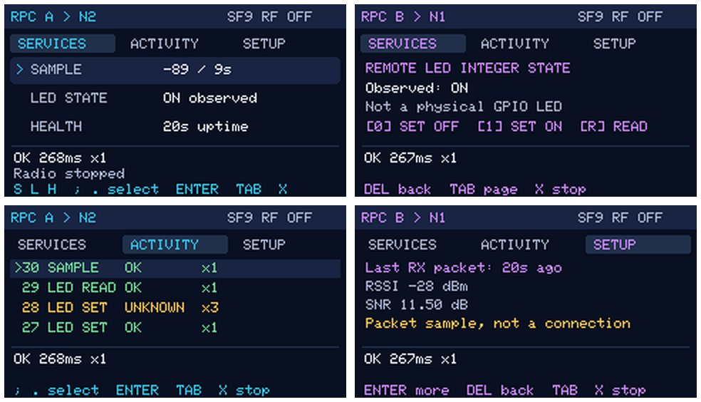
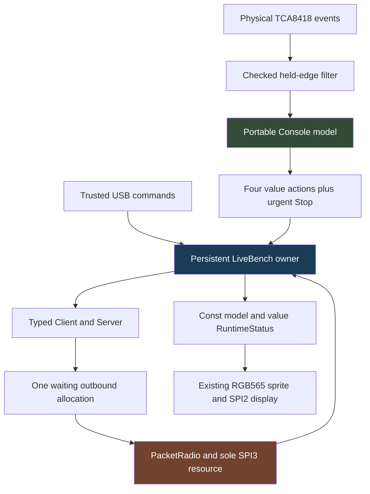
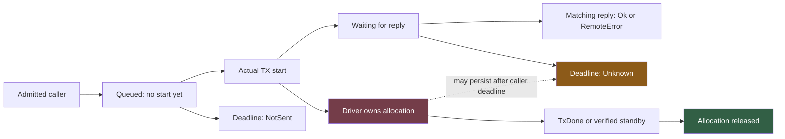
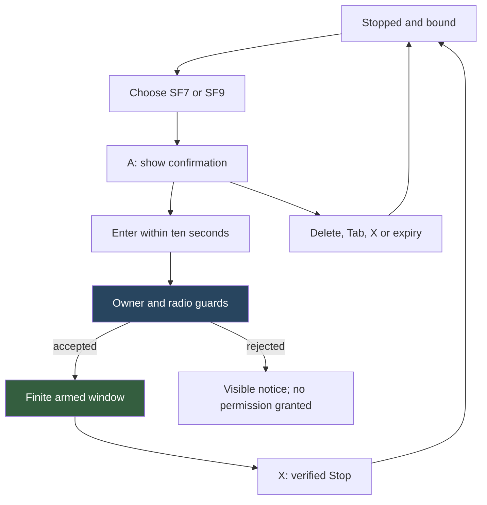
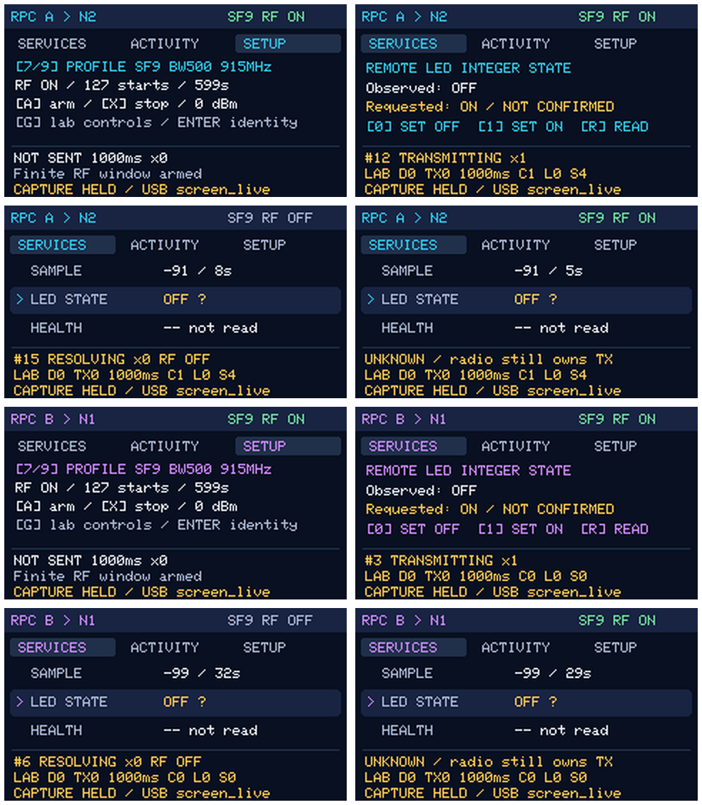
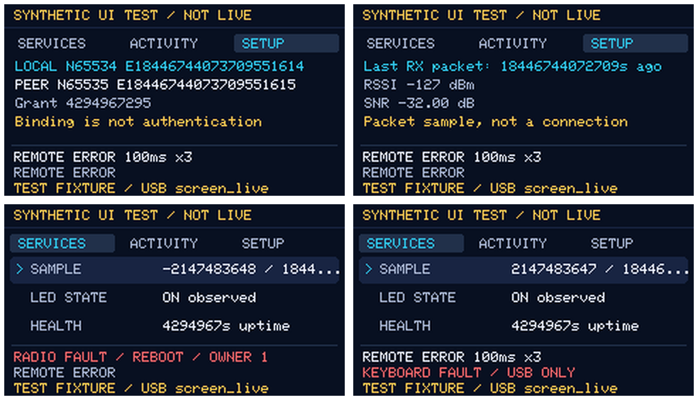
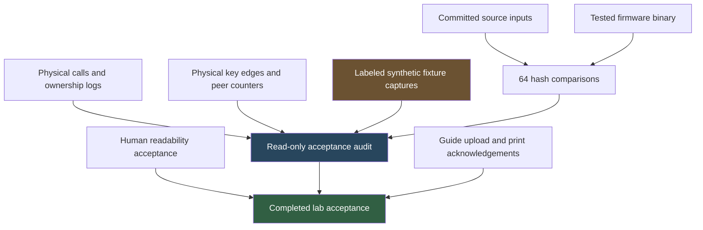

# Singularity RPC Console: Safe Controls, Observable Ownership, and Final Acceptance

A remote-control interface has two responsibilities that are easy to confuse: accept a user's intention and report what the system actually established. Pressing a key establishes an intention. Receiving a matching reply establishes a remote observation. Reaching a deadline establishes that the caller has stopped waiting. None of those facts, by itself, establishes that a radio driver has released its transmit allocation or that a remote side effect did not occur.

The completed Singularity RPC Console represents these distinctions on two Cardputer ADV devices. The same firmware runs on both boards, with each able to request services from the other. Its final increment adds explicit arming, finite experiments, complete identity and call details, and diagnostics that make difficult ownership states inspectable without weakening the hardware contract. This report develops the implementation from its state model through its physical evidence and explains the failures that shaped the final design.

> [!summary]
> - The experimental console is accepted: dashboard, history, setup, local lab controls, physical long holds and human readability confirmation are complete.
> - A call result, a confirmed remote value, a requested target and a retained physical transmit owner remain distinct facts.
> - Final evidence includes an eleven-case physical fault/epoch matrix, forty normal calls, additional loss/readback cases, twenty-two synthetic extreme-layout frames and three real holds exceeding three seconds.
> - Completion applies to this two-board lab. It does not establish cryptographic authentication, production peer recovery, optical calibration or RF regulatory compliance.

This article follows [[PROJ - Singularity RPC Console - Interactive State and Honest Outcomes on Two Cardputers]], which deliberately preserves the earlier keyboard/dashboard milestone. That note and its original fourteen-view montage remain unchanged. The present report describes the accepted implementation at `4a2b460`, not a retrospective rewrite of the earlier evidence.

## 1. The application that was completed

The service page offers a synthetic sensor, an integer LED state and remote health. The activity page retains sixteen completed calls and provides three detail pages for a selected record. Setup offers explicit profile selection and arming, then separate identity and packet-measurement pages. Deliberately entered lab mode exposes reply loss, ignored transmit completion, short caller deadlines and a bounded sample sequence.

These are actual firmware views from both boards after the final radio regression. The four frames show a dashboard, LED details, activity and last-packet measurements. They were read from the existing rendered sprite; they are not host-generated examples with invented values.



The operator subsequently answered “yes all good” to the outstanding question about on-device readability. That is a human usability acceptance, distinct from the software-pixel inspection above. Neither is a measurement of LCD luminance, color accuracy or radio performance.

The final firmware is 421,424 bytes and uses the project's ESP-IDF 5.5.4 wrapper with effective C++17. The source revision was checked against all 64 recorded source/build inputs and the tested binary hash. The image's embedded version predates the source commit because validation ran on the then-dirty worktree; the input hashes, rather than a convenient version string alone, establish correspondence.

## 2. Four states, not one status flag

A useful starting point is to identify the independently owned state. The application contains a **command state**, describing work requested locally; a **caller state**, describing an admitted RPC; an **observation state**, describing values established by successful replies; and a **physical state**, describing the transceiver and its allocation. A single `busy` or `success` flag cannot encode their combinations accurately.

For example, a user may request LED ON while the last successful observation remains OFF. The request can transmit, execute remotely and lose its reply. The caller then returns Unknown. The correct displayed observation is still OFF, qualified as uncertain; the requested ON value belongs to that call's record. A later read may observe ON without proving that this particular earlier write caused it.

A second example concerns time. With a 100 ms caller deadline and deliberately suppressed transmit completion, the caller can terminate while the radio still retains its owner. A screen that replaces everything with “idle” after the terminal result would be wrong about the resource that prevents another transmission.

| State | Authoritative owner | What the console is allowed to do |
|---|---|---|
| Requested action | Portable `Console` queue | Hold a bounded value until dispatch or rejection. |
| Admitted call and reply matching | Typed `Client`/Pending endpoint | Project accepted starts, actual attempts and terminal results. |
| Service effects and duplicates | `Server` and its bounded cache | Display successful remote observations, not inspect peer memory. |
| TX allocation and completion | `PacketRadio` | Display actual owner state; request verified Stop through the owner. |
| Selection and completed history | Portable `Console` | Change pages and selection without sending radio traffic. |

The distinction between authority and display is the central architectural rule. The renderer does not decide whether a reply matches. The console does not release a transmit buffer. The Client does not infer successful execution from the fact that the user pressed a key.

## 3. Why the owner remains singular

The firmware already had a persistent `LiveBench` owner before the interactive application. It contains the radio adapter, Client, Server, Ready/Pending endpoints, one waiting outbound allocation and the trusted USB parser. The console extends that owner rather than creating a second GUI task that also manipulates the protocol.

The physical resources are similarly separated. The LCD uses SPI2; the radio uses SPI3 through the retained `RadioProbe` resource. The ADV keyboard attaches to the existing I2C0 bus at address `0x34`, rather than creating a competing bus controller. GPIO4 is the radio's DIO1 interrupt, not an LED output. Radio interrupt handling signals/timestamps work; SPI and protocol transitions remain in the owner loop.



Serialization does not mean that each loop iteration can do unlimited work. USB input is read in a bounded chunk. Keyboard polling is scheduled and drains at most four events. One ordinary action is dispatched per loop. Drawing is paced rather than performed continuously. The owner yields after its iteration. These bounds preserve opportunities to process radio events without introducing another concurrency domain.

The current call admission is deliberately conservative. `LiveBench::start_call` rejects while a Pending endpoint exists, the radio is physically busy, another packet is waiting, RF is stopped or arguments are invalid. It does not promise a long queue of future RPCs. A small input FIFO is not the same thing as an accepted RPC workload.

## 4. A physical key is an edge, not a repeating command

The ADV's TCA8418 reports matrix events. The portable mapping rejects event zero and unused electrical positions before indexing the physical key map. It then associates held state with one of the 56 physical positions. A press that repeats an already-held state is not a new application action; a release clears that position.

This policy matters most for state-changing operations. If a held key produced repeated setters, an apparently simple button press could create many request identities, consume the finite radio allowance and complicate interpretation of remote state. The application instead admits one action for the transition from released to pressed.

The controller adapter polls at a bounded cadence and latches an input fault after overflow or I2C failure. Losing events makes the held-state reconstruction ambiguous. Continuing as if the state were reliable could turn a missed release into unexpected future behavior. The adapter therefore reports the fault rather than guessing a recovery sequence. The documented TCA8418 overflow configuration includes both required overflow bits; this detail came from the controller contract, not from assuming the vendor example handled every condition.

The final physical capture establishes more than “some keyboard input appeared.” It records a press timestamp, a release timestamp, an actual successful call and the opposite peer's execution-counter change.

| Board | Recorded S hold | Calls produced | Attempts per call |
|---|---:|---:|---:|
| A | 4.826702 s | 1 | 1 |
| B | 3.535266 s | 1 | 1 |
| B | 5.250002 s | 1 | 1 |

All three calls completed successfully. A's peer recorded one additional execution; B's peer recorded two. The earlier captures also contained sixteen successful physical-keyboard calls across the two boards, but those are a separate milestone dataset rather than part of this three-hold test.

## 5. Action admission and Stop priority

The portable `Action` is a value containing an action kind, service, level and future deadline choice. It does not contain an endpoint or an `OwnedBuffer`. Four such values fit in the ordinary action FIFO. Overflow rejects the newest ordinary action with a notice instead of allocating another queue segment.

Stop uses an independent flag. On X, the model clears ordinary queued actions and confirmation state, then sets that flag. `next_action` checks Stop before the FIFO. The owner subsequently clears future sequence admissions and asks the existing radio path to stop.

```text
on X press:
    clear ordinary action FIFO
    cancel pending confirmation
    set urgent_stop

next_action:
    if urgent_stop:
        consume flag
        return Stop
    if ordinary FIFO is nonempty:
        return its oldest value
    return no action
```

This gives Stop priority over queued application values. It does not make Stop instantaneous at the electrical level: the owner still runs cooperatively, and verified radio stopping is a hardware operation. Nor does it introduce a new “effect undone” result. Priority, physical stopping and caller resolution are separate parts of the contract.

The text and keyboard paths share `start_call`, `arm_radio`, `stop_radio` and hook-clearing operations. Keyboard actions are not formatted into strings and reparsed as USB commands. This prevents duplicated call admission or a keyboard-only path that bypasses an existing guard.

## 6. A call record preserves the original request

An accepted call produces a `CallRecord` with its local history sequence, binding, request number, service, requested level, start time and immutable deadline. Completion adds the actual attempt count, terminal outcome, end time and reply value. The original service and binding remain available even if no useful terminal reply exists.

This is a practical defense against misleading diagnostics. A default-constructed reply frame can have a default service field even when the call that timed out was an LED operation. The console must use the saved request metadata to identify the operation. It must not reconstruct the request from an absent reply.

The ring stores sixteen completed records and keeps the active call separate. A local monotonically increasing record sequence identifies selection; a ring-array index does not. When the selected record is evicted, the model selects a current record and emits an eviction notice rather than silently making the old selection refer to different data.

Three detail pages divide the information into readable groups: outcome/attempts/peer, monotonic start/end/deadline, and grant/requested target/reply code/body. Current service bodies fit in the bounded reply display. Opening or paging details sends nothing. That behavior is asserted against real completed/TX counters, not assumed from a static mock.

## 7. Confirmed values and read-after-unknown

The LED service originally had a setter but no observational operation. Reusing that setter to “check” a timed-out write would introduce a second effect and erase the distinction between observation and execution. The application therefore adds `Service::LedRead = 4`: an empty request with a one-byte 0/1 reply. Services 1–3 retain their encodings.

Only a matching successful result updates the observation. The stored observation includes when it was obtained, so its displayed age continues increasing while later work is pending or unknown. A successful set or read can update current LED observation; Unknown on a set marks uncertainty without replacing the preceding value.

```text
on terminal result:
    retain original request metadata in history
    if result is Ok:
        decode the service's observation
        timestamp it with this completion
        for LED set/read: clear current uncertainty
    else if original service is LED set and result is Unknown:
        retain old observation
        mark current LED observation uncertain
    append the completed record
```

A subsequent read does not rewrite the old Unknown row. Observing ON later cannot establish which earlier write caused ON, especially if another caller could have acted between the write and the read. The history records the result of that call; the observation records a later measurement. Those facts should not be merged.

The physical experiments dropped all three replies to a set, checked the peer's execution/cache counters, then issued a read through the radio. The actual UI retained the old value with uncertainty and updated it only after the read. USB peer counters served as independent experiment evidence, not as a substitute source for the displayed remote observation.

## 8. Caller lifetime and transmit ownership form separate dimensions

The portable caller distinguishes Waiting, Ok, RemoteError, NotSent and Unknown. NotSent means no physical attempt started before termination. Unknown means at least one did start without a final acceptable result. The physical driver, meanwhile, can be idle, transmitting, retaining an owner through ignored completion, recovering through verified standby, or faulted.



Suppressing completion deliberately prevents the owner from treating a real completion as accepted. The established recovery path performs verified standby around its 1.2-second boundary before releasing the retained allocation. A 100 ms caller can consequently finish much earlier. This experiment tests the distinction directly; it is not evidence of a naturally occurring hardware IRQ fault.

The renderer's `phase_name` examines the physical request identity as well as the owner type. Its rule is: RF stopped means RESOLVING; ownership of this request means TRANSMITTING; prior attempts without current matching ownership mean WAIT REPLY; otherwise the admitted call is QUEUED. The request comparison is defensive correctness of the projection. The current `start_call` guard actually rejects new admission while the radio is busy, so this should not be misread as a claim that the UI normally admits a new caller behind an old retained TX.

A server reply also occupies the radio without necessarily corresponding to a local caller. The idle-caller display identifies that separately instead of labeling every busy radio as a finished local call. A resource's occupancy alone does not identify which operation owns it.

## 9. What Stop proves—and what it cannot prove

`stop_radio` first clears future application actions and sequence work, drops the waiting allocation, then requests the existing radio Stop. If standby is verified for an aborted caller transmission, the Client receives the driver-fault notification for the physical request. The admitted Pending endpoint is still polled normally.

There is no rollback packet and no new cancellation result in this implementation. The original deadline still governs the caller's resolution. A stopped call with no physical start becomes NotSent. A stopped call with a physical start can become Unknown. Neither result is changed to success because the radio is now idle.

Two retained experiments make the distinction concrete:

| A-origin experiment | Result | Attempts | Elapsed |
|---|---|---:|---:|
| Stop immediately after verified SetTx | Unknown | 1 | 1,000,820 µs |
| Stop an admitted call blocked by pacing | NotSent | 0 | 1,000,780 µs |

B produced the corresponding outcomes as well. The tests checked no later transmit count increase after Stop and balanced allocation/release counters. The one-second elapsed values reflect the original caller deadline, not a one-second delay in physically requesting standby.

Stop leaves unconsumed injection settings intact. That is documented behavior: use C or exit lab to clear hooks. Keeping physical stopping separate from hook configuration avoids suggesting that a stopped radio's fault settings or a real hardware fault have been repaired.

## 10. Safe arming is an interaction protocol

Arming is not an immediate side effect of changing the selected spreading factor. Setup keeps a desired profile separate from the active radio state. It allows 7/9 selection only when stopped, physically idle and without an active caller. A opens a confirmation showing the fixed experimental settings, and Enter confirms within ten seconds. Delete, backtick, Tab and X cancel it.

The confirmation is checked against the model's current runtime information, then the owner rechecks relevant state before applying the action. The radio adapter remains responsible for its own admission guards. This is a small two-stage interaction protocol: selecting a profile and confirming permission are not the same event.



The display reads the actual remaining allowance and arm deadline. One preserved frame shows 127 starts and 599 seconds after a real transmission; those are not decorative constants copied from the defaults. An exhausted or expired allowance cannot be refreshed by the sample sequence. Rearming remains explicit.

The radio profile is 915 MHz, nominal BW500, SF7 or SF9, 0 dBm, with at most 128 starts per ten-minute arm and 250 ms minimum start spacing per node. Configuring those limits does not demonstrate measured bandwidth, equipment authorization or compliance with every applicable RF rule. The project retains that distinction in the guide and report.

## 11. Bounded experiments need accounting, not just a loop limit

Lab mode requires G and confirmation. Its operations are local: dropping B's server replies affects A's calls, while suppressing A's next completion can affect A's next request or server reply. The screen states this direction because “drop a reply” is otherwise ambiguous in a bidirectional system.

D cycles the current owner-side drop count through 0, 1 and 3. The cycle is evaluated at dispatch, not computed from an earlier keyboard-batch snapshot. Z arms completion suppression. T selects future 8000, 100 or 1000 ms caller deadlines. Changing T never changes a deadline already admitted.

The five-call sequence uses the ordinary `start_call` path. It admits another sample only after the previous caller has terminated, the physical owner is free, no packet is waiting, and at least 500 ms has elapsed after the preceding terminal result. Faults, expired allowance, Stop, explicit clear or a manual call cancel future admissions. No path rearms automatically.

A useful invariant for an accepted sequence is:

$$
5 = C + L + S + I
$$

Here $C$ is completed sequence calls, $L$ is work still awaiting admission, $S$ is skipped work, and $I$ is one when a sequence call is currently admitted. Cancellation transfers $L$ to $S$; it does not create historical RPC rows for work that never reached the Client. Duplicate sequence-start requests are counted separately as rejected requests, not silently merged into the current run.

The persistent LAB line shows completed, remaining and skipped counts alongside the active hooks and future deadline. Notices temporarily replace the key-hint line so rejection feedback does not disappear behind the lab banner. Tab leaves the page without exiting lab; G exits and restores the normal future deadline. These details make the finite experiment's current configuration inspectable from any ordinary page.

## 12. Capturing a real transient state without disrupting it

A direct dump of all pixels is too much synchronous USB work to place inside a live radio exchange. The existing dump therefore refuses while RF is armed, the driver is busy or a caller is pending. That guard initially made the most important transient state—Unknown while the owner remains busy—difficult to preserve.

The solution is a bounded **frame latch**, not a second framebuffer and not a fabricated model. `screen_latch` requests the next actual console frame, stamps CAPTURE HELD and retains the existing sprite for at most ten seconds. The owner continues protocol processing. The log records the frame's timestamp and actual armed/busy/active/outcome values. Only X is dispatched from the keyboard during the marked hold, avoiding ordinary operation from stale pixels.

The experiment then stops RF, waits for any logical caller to resolve, and requests the ordinary guarded dump. `screen_live` resumes drawing immediately; timeout also resumes. Thus the expensive transfer occurs after quiescence while the pixels still show the earlier, clearly marked state.



For each board, these actual frames show its armed allowance, requested-but-unconfirmed LED state, stopped-but-resolving caller and Unknown with retained ownership. The header can legitimately show RF ON in the saved frame even though the radio is off by the time pixels are transferred. The capture stamp and timestamped source log are what make that historical meaning explicit.

This method has a limited claim: it preserves what the actual renderer produced at a logged runtime state. It is not optical panel readback. It also does not disable the owner's protocol progress or relax the dump safety checks merely to obtain a screenshot.

## 13. Synthetic layout fixtures are a different evidence category

Ordinary operation does not conveniently produce maximal epochs, maximum request IDs, the full signed sensor range or every fault label. For those questions the project uses explicitly synthetic renderer inputs. `ConsoleFixture` constructs bounded metadata, not Clients, Servers or radio allocations, and renders through the same `Screen::console` function.

The fixture scratch is 4,136 bytes of static metadata. It is reconstructed in optional storage rather than placing another roughly four-kilobyte object on the 8,192-byte main-task stack. The existing 64,800-byte RGB565 sprite remains the only full-screen pixel buffer used by these views.

`screen_fixture 0..10` is refused while armed, busy or pending; the owner checks again before drawing because runtime state could have changed after USB parsing. Both header and footer identify the frame as SYNTHETIC or NOT LIVE. The same bounded hold/resume behavior applies. The live model, its history, TX counters, allocation counters and heap are compared before and after the fixture sequence.



These images establish that full-width identity and last-packet values fit and that fault labels remain legible. They do **not** establish that an SPI completion actually failed or that an I2C overflow was electrically injected. The real ownership/loss experiments and synthetic layout checks answer different questions and must remain labeled separately.

The final run captured eleven fixtures on each board. A retained heap value of 224,888 bytes and B a value of 224,736 bytes before and after their fixture sequences. That is an unchanged-heap result for this diagnostic workload, not a universal proof that every library call is allocation-free.

## 14. Two rendering defects that the evidence exposed

The earlier keyboard/dashboard milestone exposed M5GFX's type-sensitive color conversion: signed integer color literals selected RGB565 interpretation, while unsigned 32-bit values selected RGB888. Source-level hex values that looked right produced bright cyan backgrounds. Explicit unsigned colors and actual sprite captures corrected the mismatch. The earlier article preserves the before/after images; this final report does not present that old defect as a newly discovered failure.

The final fixture pass exposed another less visible library interaction. After A's first set of synthetic frames, heap changed from 224,888 to 224,668 bytes. The exact assertion was:

```text
AssertionError: ('heap', '224888', '224668')
```

The 220-byte retained change coincided with first floating SNR formatting. SNR already arrives as an integer number of quarter-decibels, so conversion through floating `printf` was unnecessary. The replacement preserves the exact scale:

```cpp
const auto magnitude = unsigned(
    quarters < 0 ? -int64_t(quarters) : int64_t(quarters));
std::array<char, 16> text{};
std::snprintf(text.data(), text.size(), "%s%u.%02u",
    quarters < 0 ? "-" : "",
    magnitude / 4,
    (magnitude % 4) * 25);
```

Widening before negation avoids signed overflow for the minimum integer. Keeping the sign separate preserves `-0.25`, which would otherwise be lost if formatting used only truncating integer division. Tests also cover the minimum packet SNR, the maximum positive quarter value and the minimum 32-bit input.

Fresh-board fixture sequences retained the same heap after this change. That supports the intervention: removing floating formatting removed the observed first-use change. No allocator stack trace was collected, so the report does not claim to have identified a particular internal allocation frame.

The same numeric fixtures showed the grant disappearing after a full-width peer epoch. Measuring and clipping text prevented pixels from overflowing, but did not make the missing field useful. Splitting identity and packet measurements into separate detail pages solved the information-layout problem rather than merely shrinking the font. Intentional ellipses remain appropriate for an extreme dashboard age when its full value is available on a detail page.

## 15. What the physical regression establishes

The final predecessor matrix retained eleven cases: one and all reply drops at each SF, missing-completion recovery at each SF, a short deadline retaining ownership at each SF, server reset after commit, rejection of an old destination epoch, and a pacing-blocked NotSent case. It checks peer execution/cache counters and physical allocation state in addition to the caller's result.

The reset cases are important because Unknown can arise from different remote histories. In one, the peer committed before resetting. In another, the rebooted peer rejected the stale destination epoch and executed nothing. The same local uncertainty result cannot distinguish those histories by itself.

A subsequent normal run completed forty checked calls, twenty per spreading factor, with all calls succeeding on the first attempt. Their elapsed-time distributions were:

| Profile | Samples | Minimum | Median | Maximum |
|---|---:|---:|---:|---:|
| SF7 / BW500 | 20 | 160.997 ms | 211.504 ms | 341.956 ms |
| SF9 / BW500 | 20 | 266.897 ms | 273.053 ms | 396.952 ms |

These are complete application-call times, including pacing, software work, half-duplex turnaround and scheduling. They are not pure RF airtime and are not hard real-time bounds. The normal harness sequences operations; the result is not a claim of full-duplex or arbitrary simultaneous-user throughput.

Additional final cases exercised unknown LED set/readback in both directions and profiles, and injected S actions traversed the actual owner and radio. The measured owner-view session reported maximum rendering costs around 31.1 ms, including capture-related drawing, and keyboard polling maxima around 1.2 ms. Those figures do not measure electrical press-to-response latency or worst-case interrupt scheduling.

At the end of the manual holds, each board had 63 allocations and 63 releases, with zero live allocations, busy or fault state. Heap was 224,888 bytes on A and 224,296 on B in that later boot/workload. A recorded one bad-RX diagnostic during the interval; all three intended calls still succeeded without retry, and no specific cause is inferred.

## 16. Evidence integrity is not another test campaign

A report needs to establish which source produced its evidence. It does not need to rerun the entire hardware campaign after a documentation edit. The final read-only audit compares the binary and all 64 recorded source/build inputs, checks retained result counts and physical holds, and verifies the capture's cleanup lines. No radio is armed by that audit.

The capture JSON records final facts before its cleanup block. Consequently its final object can contain `armed=1`, while each raw log subsequently ends with `LIVE STOP ok=1`. The process exited and the serial ports had no holder. The report preserves this ordering instead of modifying the JSON to make it look like an after-cleanup snapshot.



During development, broad checks were repeated too often across closely related increments. The user's final direction was explicit: stop doing that. The appropriate continuation was to verify the saved holds, inspect source/evidence correspondence and finish publication. A full campaign is justified by a relevant behavioral change or regression, not by every new paragraph or bookkeeping commit.

## 17. Operating the accepted console

After trusted USB provisioning and reciprocal binding, use the same profile on both boards. On each, Tab to Setup, choose 7 or 9, press A and confirm with Enter. Then return to Services. The ordinary operation set is intentionally small:

- S requests a synthetic sample; H requests health.
- L opens LED details, where 0 and 1 request explicit targets and R reads state.
- Semicolon/period changes selection. Enter opens details and cycles the multi-page detail views.
- Delete/backtick returns, Tab changes pages, and X requests Stop.
- G in Setup enters lab only after confirmation. D, Z, T, S, 5 and C expose the deliberate experiments described above; G exits.

A diagnostic script must use the complete USB by-id paths and one exclusive serial owner per device. Do not open a second monitor while a capture owns a port. If a particular attach needs a manual reset, coordinate it instead of interpreting repeated serial opens as debugging evidence.

The repository's build entrypoints remain `labs/singularity-rpc/scripts/reproduce.sh` and `labs/singularity-rpc/scripts/idf.sh build`. Their presence documents how to reproduce relevant behavior; it does not imply that a reader should immediately flash a board or start RF tests. Read the operating guide and hardware constraints first.

## 18. Source route and preserved assets

The source root is `/home/manuel/workspaces/2025-12-21/echo-base-documentation/esp32-s3-m5`. Project code is under `labs/singularity-rpc`; the ticket is `ttmp/2026/09/06/SINGULARITY-RPC-UI--interactive-cardputer-rpc-console`.

| Source | Important boundary |
|---|---|
| `core/include/srpc/console.hpp` | Value actions, confirmations, observations, history, phase projection and exact SNR formatting. |
| `core/include/srpc/keyboard.hpp` | Validated mapping and physical-position held-edge filter. |
| `core/include/srpc/client.hpp` | Typed endpoint lifetime, request identity, attempts and terminal outcomes. |
| `core/include/srpc/server.hpp` and `codec.hpp` | Canonical operations, bounded duplicate state and read-only LED service. |
| `firmware/main/live_bench.hpp` | Shared dispatch, actual owner loop, sequence accounting and capture guards. |
| `firmware/main/packet_radio.hpp` | Finite arming, physical TX ownership and verified recovery. |
| `firmware/main/status_screen.hpp` | Actual layouts, clipping, existing sprite, capture stamp and synthetic test display. |
| `core/include/srpc/console_fixture.hpp` | Explicit synthetic metadata; not a protocol or physical simulator. |

Nine frozen headers, all 52 source PNGs used across ordinary/owner/synthetic view sets, three report montages, selected JSON evidence and the raw final hold logs are colocated under `_assets/` with the prefix `singularity-rpc-console-final-`. The [asset manifest](_assets/singularity-rpc-console-final-manifest.json) records their hashes and origins. The [provenance record](_assets/singularity-rpc-console-final-provenance.json) records all 64 source/build hashes; the snapshots are selected reading material, not a self-contained build distribution.

For independent review, start with the [physical hold capture](_assets/singularity-rpc-console-final-holds.json), [fault cases](_assets/singularity-rpc-console-final-faults.json), [normal calls](_assets/singularity-rpc-console-final-normal-calls.json) and [fixture results](_assets/singularity-rpc-console-final-fixtures.json). Text copies use LF normalization and are not claimed byte-identical USB recordings. The [figure helper](_assets/singularity-rpc-console-final-figures.py) verifies source-frame hashes and rebuilds the three montages into a new directory using ImageMagick:

```sh
python3 Projects/2026/09/06/_assets/singularity-rpc-console-final-figures.py \
  --output-dir /tmp/rpc-console-final-figures
```

The original copied frames remain the image evidence; another ImageMagick version can change montage encoding without changing their pixels. The binary hash is:

```text
7c6d2b302698cfdab24c2b8f9d26ebbfc0a05d3d6dbcd95ac6741c8a7b7185cf
```

The technical implementation guide and operating evidence were delivered to reMarkable under `/ai/2026/09/06/SINGULARITY-RPC-UI/`. Earlier design and milestone PDFs remain preserved. P5 DONE was acknowledged at `2026-09-06T23:23:29Z`, after the actual hold evidence and operator readability acceptance.

## 19. Completion boundaries and future work

The completed feature is a bounded experimental application, not a production networking stack. It has no cryptographic authentication, automatic peer discovery or safe unattended rebinding protocol. Its duplicate suppression is volatile and scoped to the binding/boot lifetime, not durable exactly-once execution. Sensor data is synthetic and LED state is a service integer.

Physical SPI/BUSY failure was not electrically forced as part of the final layout checks. Synthetic fault panels do not establish that behavior. Range/interference testing, abrupt power-loss/rollback behavior and independent RF equipment measurements are separate projects. Likewise, cooperative owner timing measurements do not establish a hard real-time scheduling guarantee.

Future work should preserve the same decomposition: add an explicit protocol or authority contract before broadening recovery, add measured scheduling evidence before another hardware-access task, and keep new diagnostic claims tied to the evidence layer that can actually establish them. The completed console demonstrates that useful keyboard interaction, finite experiments and truthful remote-state reporting can coexist without duplicating protocol or hardware ownership.

The practical result is an application that remains informative when nothing went wrong and when the outcome is genuinely uncertain. It does not make uncertainty disappear. It records which operation was attempted, what was observed, what remains physically owned and what the operator can safely do next.
