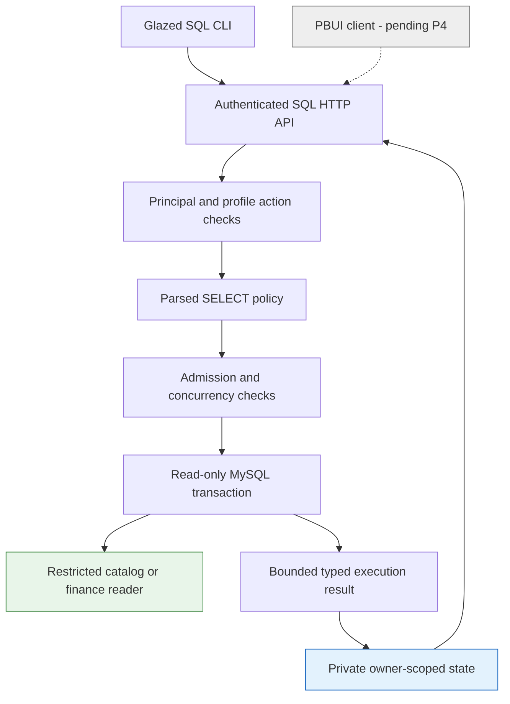

# TTC SQL Investigation: From RAG Review to Scoped MySQL Execution

A useful data investigation system must preserve the meaning of its source relations, constrain who can read them, and retain enough execution evidence to explain a result later. None of these properties follows merely from using SQL, dbt, or an authenticated interface. This project makes each property explicit: approved serving projections define the data, restricted MySQL identities constrain reads, a shared Go service validates and bounds execution, and owner-scoped records separate editable queries from observed results.

The work began with an architectural review of Tree Center's RAG and evaluation systems. It then developed into a concrete implementation of a human SQL investigation backend. This report explains that progression and the implementation through P3. It is intentionally a pre-P4 checkpoint: the PBUI interface and complete dbt-build-to-browser acceptance are still pending.

> [!summary]
> - Existing analytics cleanup is reused rather than reconstructed from raw WooCommerce tables.
> - Catalog and finance have narrow serving models; four local reader identities establish separate access profiles, including unavailable operations/support profiles.
> - A provider-free Go service implements parsed reads, authorization, cancellation, bounded exact-value results, private persistence, and durable refresh admission.
> - Local synthetic data, historical production observations, repository review, and new integration tests are distinct evidence classes throughout this report.

## 1. The investigation began with execution and evidence

The initial TTC-REVIEW-001 work examined how retrieval, customer answering, evaluation, optimization, and the existing PBUI workbench fit together. The central question was not whether another interface or optimizer could be added. It was whether a proposed experiment would use the same execution path as the application it intended to improve, and whether its observations would remain inspectable after execution.

Tree Center already has a substantial retrieval implementation. The review traced index construction, lexical and vector retrieval, representation collapse, policy filtering, reciprocal-rank fusion, augmentation, reranking, and hydration. The important boundary for customer behavior is the canonical application path through `internal/customer/ragsearch` and `pkg/ttc/customerapp`, not an isolated retrieval demonstration. An optimization that changes a separate test implementation can improve a benchmark without changing customer behavior.

The answer-quality pipeline already provides a useful separation. Generated answers can be sealed before judge execution, and historical answers can be measured again without rerunning generation. A judge failure therefore need not destroy the original answer artifact. This distinction informed the later SQL design: execution evidence should remain an observation of a particular run, not a request to silently execute the same input again when someone opens a reference.

The optimization review also found a difference between a broad design vocabulary and the currently executable variables. At the reviewed checkpoint, the optimization catalog exposed `retrieval.final_result_limit` and `fusion.rrf_k`. The workbench's campaign preparation path supported semantic fixtures rather than arbitrary production answering configurations. The recommendation was consequently incremental: establish trusted evaluation and a thin adapter to canonical Go execution before adding a GEPA-driven optimization loop. A broad framework replacement was not necessary to address the observed gaps.

Historical benchmark evidence was deliberately qualified. One retained artifact compared raw retrieval with raw-plus-summary representations: 144 evaluated cases, four skipped cases, and RRF nDCG@10 of approximately 0.8623 versus 0.8635. Eighteen cases improved, eleven worsened, and 115 were unchanged. That is evidence about a particular historical retrieval comparison. It is not a fresh measurement of customer answer quality, and the small aggregate difference is not a sufficient reason to adopt a new serving configuration.

The review produced two long-form reports, an investigation diary, reproduction scripts, archived sources, and screenshots. Its fresh deterministic campaign completed six episodes without terminal failures or budget violations. The backend tests and frontend typecheck/tests/build passed at that checkpoint. A manual browser walkthrough established the observed UI behavior; a separate optional automated replay failed and was not substituted for the successful manual evidence. The original review bundle was delivered to reMarkable.

These findings established a general project requirement: an investigation interface must distinguish configuration, execution, measurement, and retained evidence. The SQL work applies that requirement to database reads without requiring an LLM to participate.

## 2. Why the existing analytics schema was not the serving interface

The subsequent SQL investigation inventoried 80 tracked dbt SQL models, ten singular SQL tests, 159 Sqleton YAML files, and 133 query definitions, including 36 analytics query definitions. These counts describe the reviewed source tree, not the number of production relations or currently deployed endpoints.

The existing dbt graph already performs substantial business cleanup. Orders use WooCommerce HPOS tables, products combine published WordPress product records with SKU metadata, and inventory models derive daily history. Reimplementing those transformations in a new assistant-specific query layer would introduce another place for business rules to diverge. The design instead adds explicit physical projections over existing cleaned models.

However, a cleaned analytics table is not necessarily appropriate for every reader. The root-order model includes billing email, customer identity, employee-related fields, and commercial cost information. A default database name does not prohibit a credential from reading another database. Likewise, two HTTP routes using the same reporting identity do not become separate authorization domains because their default schemas differ.

The reviewed Sqleton deployment illustrates this distinction. Its analytics and reports routes used the same reporting identity while changing default schema routing. The deployment source also contained a literal reporting credential. The value was not copied into the implementation or this report; assessing its current use and possible rotation remains separate owner work.

The new architecture therefore distinguishes three configurations:

| Configuration | What it determines | What it does not establish |
|---|---|---|
| dbt target | Builder connection and target namespace | Reader authorization or source selection |
| dbt source variable | Which declared source relations are read | A safe target database |
| SQL access profile | Authorized serving relations and restricted reader | Public customer ownership rules |

Changing a target does not change the existing project's default source variable. Source and target schemas also need to exist on the same server for the reviewed dbt-mysql connection model. These are operational facts with direct consequences for test safety: a command can have a development target name and still read a production-named source unless both choices are checked explicitly.

## 3. Defining the initial relation contracts

A relation contract needs to state its row identity and the meaning of its measures before specifying its columns. Otherwise, a syntactically valid aggregation can produce a number whose business interpretation is wrong.

### 3.1 Product identity, not live availability

`products_v1` projects `product_id`, `sku`, `product_name`, `parent_product_id`, and `product_kind` from the existing `products` model. Only `product` and `variation` kinds are included. Parent zero becomes SQL NULL. Box, addon, gift-card, and subscription-like kinds classified separately by the upstream model are not included in this first projection.

The key is `product_id`, not SKU. The fixture explicitly permits two merchandise rows with the same SKU. A parent product can also be absent from the projected relation, so parent identifiers are not treated as a universally satisfied foreign-key promise. The interface makes no assertion about current price, sellable stock, or inventory reservation.

The implemented query remains short because it relies on existing cleanup:

```sql
SELECT
    product_id,
    sku,
    product_name,
    NULLIF(parent_id, 0) AS parent_product_id,
    type AS product_kind
FROM {{ ref('products') }}
WHERE type IN ('product', 'variation')
```

The omission of price and stock is intentional. Adding such fields would require a freshness and interpretation contract that product identity alone does not need.

### 3.2 Root-parent order facts before daily aggregates

`orders_v1` retains the root-parent grain of the existing `orders` model. Its columns are order ID, order number, business date, root status, split indicator, total before refunds, refund amount, and total after refunds. Billing identity, employee identity, and cost fields are omitted.

The monetary names preserve existing arithmetic:

```text
order_total_before_refunds = SUM(component total)
refund_amount              = SUM(component refund)
order_total_after_refunds  = before_refunds - refund_amount
```

A concrete example explains the attribution rule. An order created in August with a total of 120 and a refund of 20 recorded in September appears as 100 after refunds on its original August business date. Grouping this relation by business date therefore restates August. It does not produce September refund cashflow, settlement accounting, or recognized revenue.

The date comes from the existing New York business-date transformation. Status remains the root order's status rather than a new paid/revenue classification. A daily report must still choose its status population deliberately. The reviewed PHP revenue report uses different calculations and exclusions, so this relation does not claim automatic parity with that report.

Daily aggregation can remain an ordinary query:

```sql
SELECT
    business_date,
    COUNT(*) AS order_count,
    SUM(order_total_after_refunds) AS order_total
FROM orders_v1
GROUP BY business_date
ORDER BY business_date
```

This approach keeps the underlying facts inspectable. A user can move from a daily total to the contributing parent-order rows without requiring a second, differently defined data product.

### 3.3 Currency is an admission precondition

The upstream rollup does not preserve currency. A USD assumption in application code does not prove that every historical source record is USD, especially when one root order incorporates multiple split records.

The new currency test joins each published root to all contributing `orders_and_split_orders` records through `parent_order_number`, then checks the corresponding HPOS source rows. Missing source rows, NULL currencies, and non-USD values fail. Eligible refund records are checked separately using the existing refund eligibility rules, including the historical exclusion for parent ID 8645.

This is rejection rather than silent filtering. If one component is not USD, removing it from the sum would change the order's amount while preserving an apparently valid USD label. The serving build must instead remain unapproved until the inconsistency is understood.

The tests exercise non-USD split components, missing split currency, and a non-USD refund. They do not establish the currency population of production history. That distinction is essential to the current implementation status.

## 4. Recent HPOS work changed the implementation assumptions

The implementation incorporated three recent TTC tickets before changing serving code. The HPOS audit documented a corrected line-item export join. `split_src_order_id` identifies an immediate split source, not necessarily the root order. For a split of an already split order, joining that ID directly to the root-only `orders` relation can lose enrichment.

The implemented resolution is:

```text
line_items.split_src_order_id
  -> orders_and_split_orders.order_id
  -> orders_and_split_orders.parent_order_number
  -> orders.order_number
```

The historical audit recorded 977,862 root matches among 978,003 line items after the correction, leaving 141 unresolved records. Those counts are historical evidence from the earlier ticket, not a new production query in this project. They also show why a later line-item serving contract must specify unresolved lineage rather than discarding it silently. The initial serving slice avoids adding a line-item interface, but its design now records the constraint explicitly.

The inventory incremental ticket contributed reusable implementation and operational knowledge. It already introduced idempotent MySQL index helpers and tested the older dbt/mysql 1.4.6 environment. It also recorded a production rollout that built 78 models but retained four known test failures. A completed rollout therefore did not imply a fully green test baseline.

The reports-sync work supplied the local HPOS/dbt smoke-test precedent and explicit source/target connection constraints. Together, these tickets prevented three incorrect assumptions: that immediate split ancestry was root ancestry, that index creation needed a new helper, and that default profile discovery was safe enough for development commands.

No historical authorization to operate treehost was treated as authorization for this ticket. All new database work remained on the local TTC MySQL instance.

## 5. P0 and P1: isolate the environment, then test actual serving SQL

P0 verified the available environment rather than upgrading it: dbt Core and mysql-related plugins 1.4.6, and local MySQL 8.0.33 through the existing TTC container on port 3336. Existing commerce and analytics schemas were not mutation targets. Both repositories contained unrelated work that was preserved through exact-path staging.

The new models are disabled unless `assistant_enabled` is explicitly true. Their schema suffixes are `assist_catalog` and `assist_finance`; the default dbt naming behavior prefixes these with the target schema. Merely merging the source does not expand the existing scheduled model set.

P1's smoke harness copies the actual serving model, macro, and test files into a temporary dbt project. It supplies synthetic cleaned ancestors, requires the fixed loopback endpoint, refuses pre-existing scratch schemas, and removes only schemas created by that invocation. This validates actual serving SQL and adapter behavior without pretending to rebuild all HPOS ancestors.

Both builds succeeded, and both positive test runs passed 20 tests. Three currency mutations each failed the intended currency test. Adding a `billing_email` column failed the exact-column test. Removing the mutation and rebuilding returned the suite to green. The fixture also proved merchandise filtering, duplicate-SKU tolerance, parent-zero normalization, and the expected 120/20/100 monetary projection.

Exact-column tests check missing and additional names as well as ordinal order. They are more than schema documentation. A future column added to a table inherits a table-level SELECT grant; without an explicit projection check, an authorized reader could gain access to newly materialized sensitive data.

One validation failure produced a separate operational lesson. dbt 1.4.6's parser invocation left an old `manifest.json` on disk, and a subsequent assertion initially inspected that stale artifact. Fresh `dbt ls` output replaced the assertion, and actual builds independently proved schema routing. Command success and artifact freshness are different observations.

## 6. P2: establish database rights independently of application policy

Four local schemas and readers were provisioned: catalog, operations, finance, and support. Catalog receives SELECT on `products_v1`; finance receives SELECT on `orders_v1`. Operations and support remain empty and unavailable, with only implicit USAGE and no data grants. They can authenticate but cannot select a default database.

This is a useful distinction for frontend behavior. An unavailable profile can be listed as a planned capability without opening a database connection or receiving speculative grants. Creating all four identities establishes the access partition while allowing relation population to remain incremental.

The local provisioner refuses existing schema or account names. It generates reader passwords, binds accounts to the exact client host observed by MySQL rather than `%`, and saves credentials outside git in a 0600 file under a 0700 directory. Docker can present a private bridge address as the client host even when the client connects to loopback; a future network change therefore requires deliberate reconciliation rather than automatic privilege broadening.

Provisioning is not transactional because MySQL DDL is not transactional. The script reserves the credential file before DDL, records which resources it created, and attempts rollback only for those resources after failure. A process crash or lost administrator connection can still require manual reconciliation. There is no automatic destructive reset command.

The final direct verifier passed 64 checks, including all twelve directed cross-profile pairs. It checked exact SHOW GRANTS, intended account matching, no active roles, authorized reads, cross-profile default-schema and qualified-table denials, raw/system-table denials, and write/DDL denials. Missing-table, syntax, or network errors were not accepted as substitutes for authorization errors. Nine offline tests covered provisioning guards and rollback behavior.

These tests bypassed the application policy entirely. The database restriction remains meaningful even if a future SQL validator incorrectly accepts a qualified relation. Conversely, restricted grants do not remove the need for application limits, ownership checks, or safe persistence.

## 7. P3: one execution service for human investigation

The P3 implementation lives in `pkg/ttc/sqlworkbench`. The standalone `rag-ttc sql serve` and `sql query` commands use it without creating a campaign, opening a RAG bundle, or contacting a provider.



Authentication identifies a principal. Authorization then checks actions such as `sql.profile.finance`. The existing static authorizer intentionally ignores the resource coordinate, so using one generic SQL action with a profile resource would not isolate profiles. Profile-specific action names are therefore part of the implemented contract.

The local configuration loader accepts only the fixed P2 development mapping. It does not accept arbitrary DSNs or serialize database credentials into public DTOs. The command bearer token is loaded from a private token file, allowing the command line to contain a path rather than a secret value.

### 7.1 Parse and normalize before execution

The policy uses the same pinned TiDB parser module inspected in CoinVault, but does not import CoinVault's Go `internal` packages. It accepts exactly one SELECT and walks every nested table and relevant expression. A table must belong to the selected profile; a separately authorized catalog profile does not make a catalog-to-finance join permissible within a finance execution.

Read-only syntax is not sufficient by itself. SELECT expressions can call functions that sleep, read files, acquire locks, or invoke stored routines. P3 therefore uses a limited pure-function allowlist. It rejects variables, locking reads, INTO forms, optimizer hints, and unsupported statement forms. CTEs, set operations, and window functions are explicitly unsupported in v1 rather than handled with incomplete scoping logic. Ordinary permitted-table subqueries, joins, and aggregates remain available.

The service executes restored canonical SQL rather than the original comment-bearing input. It verifies parameter count and uses driver binding rather than interpolation. The parser limits input length, parameter count, AST nodes, and nesting depth. These limits constrain work before a database connection is acquired.

### 7.2 Bound the database operation and the returned representation

Each execution has a server-generated ID. POST returns that identity before completion, allowing another request to cancel it. The service owns the execution context independently of the initiating HTTP request and gives it a five-second deadline. It also sets MySQL MAX_EXECUTION_TIME, opens a read-only transaction, and limits global concurrency to four executions.

Within that same transaction, the service inspects each approved table's column names and order. MySQL retains metadata locks through transaction completion, preventing normal DDL from adding a column between this inspection and the user SELECT. This supplements the dbt exact-column test at runtime without claiming to replace a controlled refresh process.

Rows are returned positionally with native column metadata. Every non-NULL cell is represented as a string, preserving decimal values and integers outside JavaScript's exact numeric range. A real test returned:

```json
["10", "120.00", "20.00", "100.00"]
```

The ordering corresponds to order ID, before-refund total, refund amount, and after-refund total. SQL NULL remains JSON null. Duplicate output aliases do not overwrite values because rows are arrays rather than name-keyed objects.

The service limits results to 250 rows, 64 columns, and a full encoded execution envelope below 128 KiB. Truncation is explicit. A row limit alone would not constrain one very large cell, and a row-payload budget alone would omit metadata and retained query input; the encoded-envelope check addresses the actual response representation. Connection packet size is bounded separately.

### 7.3 Keep drafts separate from observations

A saved query stores editable input. An execution records one run and its status, query, creation time, expiry, build provenance, columns, and rows. Saving a query does not execute it, and opening expired evidence does not rerun it.

Both record types are owner-scoped. Retrieval and cancellation recheck current profile authorization, so a record created while a user had finance access is not automatically accessible after that permission is removed. The service uses private plaintext snapshot files, atomic replacement and fsync, and an exclusive process lock. The deployment is intentionally a small local Linux service rather than a distributed persistence framework.

Execution access expires after fifteen minutes. Cleanup runs every minute and at startup; downtime or backups can retain expired bytes longer, but API access remains expired. Saved drafts persist until deleted. The store caps both executions and saved drafts at one hundred records, rejecting capacity exhaustion rather than silently evicting live evidence.

## 8. Refresh admission is a durable state transition

The new serving models are physical tables, and rebuilding a collection of tables does not create an atomic whole-graph release. P3 therefore implements an explicit admission protocol instead of implying that a build ID establishes an immutable database snapshot.

```mermaid
stateDiagram-v2
    [*] --> Ready
    Ready --> Blocked: persist closed admission
    Blocked --> Draining: cancel active executions
    Draining --> Building: all executions settled
    Building --> Ready: build and tests succeed; persist provenance
    Building --> Blocked: failure or cancellation
    Blocked --> Blocked: restart preserves closure
```



The order matters. Admission is closed durably before active queries are cancelled and drained. The trusted builder runs only after draining. A failure, cancellation, invalid build ID, or persistence error leaves admission closed. Restart preserves that state. Interrupted running execution records become interrupted rather than being treated as completed or rerun.

The server can configure a trusted build/test executable, but an HTTP request cannot supply shell text, a program path, or a DSN. The executable must acquire the existing dbt lock exactly once and exit successfully only after both the build and serving tests pass. Its cancellation behavior must include any children it starts.

P3 proves the state protocol with controlled callbacks. P5 still needs to wire and exercise the actual isolated dbt executable. That remaining integration is not a minor deployment detail: it is the evidence that the protocol encloses the real transformation process rather than only a test callback.

## 9. What the tests establish

The final P3 uncached Go suite reported 74 packages as passing. Build, vet, repository lint, Glazed vet, and generated-package checks passed. Race tests exercised ownership, cancellation, bounds, expiration, restart, role revocation, store exclusivity, and refresh failure/recovery. Default test runs skip local integration unless explicitly enabled.

The opt-in integration tests used real P2 reader connections and authenticated HTTP. They verified exact monetary strings, profile denial, empty-profile behavior, SQL policy rejection, saved-query ownership, execution ownership, and refresh provenance. A separate local administrator connection held a WRITE lock on the isolated catalog fixture. Cancelling the blocked HTTP query and waiting for the five-second deadline both settled correctly; releasing the lock allowed a new query to succeed. This tests driver and connection-pool behavior that a fake context alone cannot establish.

A separate script started the actual go-run server in tmux and invoked the actual Glazed CLI. It used a temporary private token and store, verified the synthetic financial result, and stopped its owned server. The checked port was no longer listening afterward.

Govulncheck found zero affected/called vulnerabilities and zero vulnerable imported packages. It also reported four advisories in required modules whose vulnerable code was not called. Those are different statements; the report does not characterize the entire dependency set as advisory-free.

Several failures improved the implementation rather than being hidden. Commit hooks required generated logcopter metadata for the new package. Glazed vet rejected raw Cobra flag registration and direct environment reads, prompting a proper command/field/settings implementation. Test principals needed the `actor:` namespace. Private-store tests needed service-created 0700 child directories. A WriterCommand test incorrectly assumed Cobra SetOut controlled Glazed's classic writer; direct writer tests and actual CLI smoke were separated after inspecting the framework behavior.

## 10. The remaining PBUI work

P4 will present authorized profiles and relations, an explicit SQL editor with bound parameters, Run/Cancel controls, typed results, row detail, contextual help, and saved-query references. Multiple investigations must retain independent profile, draft, execution, and row-selection state. A late result belongs to the execution that produced it, not whichever window happens to be selected later.

The existing workbench mirrors documents into localStorage. Therefore, the intended persistent SQL document is an opaque reference, not a copy of SQL text, parameters, credentials, or result rows. Restoring that reference must invoke the P3 authorization and expiry checks. Unsaved editor content can exist in component memory; durable sensitive input belongs in authorized server records.

P4 also needs coordinated frontend and Go registration. Existing strict document validation cannot simply be weakened to admit arbitrary formats. SQL apps, action vocabulary, subject references, help, and pointer document validation need to agree across the client and host. The earlier RAG review found a related persistent-link compatibility issue between frontend capabilities and the pinned Go PBUI dependency. That is evidence to verify integration, not a reason to disable strict validation.

P5 will then combine the real serving build, reader profiles, refresh admission, HTTP service, and browser workflow. Until that acceptance exists, the project should be described as a tested SQL backend and serving-model increment, not a completed investigation product.

## 11. Source locations and reproducible checkpoints

The main repository is `/home/manuel/workspaces/2026-09-01/add-plot-editor/rag-ttc`; the serving models and provisioning code live in `/home/manuel/code/ttc/ttc`. The workspace date is September 1, while the review and implementation described here occurred on September 6.

The durable source map is:

- TTC `sql/dbt/models/assistant/`: the two projections, column descriptions, and build limitations.
- TTC `sql/dbt/tests/assistant_*.sql` and `macros/assistant_exact_columns.sql`: currency, arithmetic, and exact-column checks.
- TTC `sql/dbt/bin/local-assistant-readers.py`: guarded local provisioning and direct grant verification.
- RAG `pkg/ttc/sqlworkbench/`: policy, profiles, execution, persistence, HTTP, tests, and API documentation.
- RAG `cmd/rag-ttc/cmds/sqlworkbench/`: Glazed server/query commands and focused command tests.
- RAG `ttmp/2026/09/06/TTC-SQL-001--clean-dbt-sql-interfaces-and-scoped-assistant-tools-for-tree-center/`: designs, investigation/implementation diaries, scripts, and physical slip layouts.
- RAG `ttmp/2026/09/06/TTC-REVIEW-001--intern-guide-and-evidence-based-rag-optimization-architecture-review/`: the earlier RAG and linked-workspace review.

| Repository | Commit | Checkpoint |
|---|---|---|
| rag-ttc | `5ddb394f4` | Baseline design and implementation boundary |
| TTC | `1c28da47b` | Opt-in serving relations and checks |
| rag-ttc | `9742d0ef2` | P1 validation harness, diary and receipts |
| TTC | `907189dba` | Four local reader profiles and direct grant checks |
| rag-ttc | `202fada9e` | P2 evidence and phase receipts |
| rag-ttc | `97895c9f5` | Parsed SELECT policy and private profiles |
| rag-ttc | `d94c0980c` | Shared service, persistence, HTTP and CLI |
| rag-ttc | `e916a17e3` | P3 evidence and completion receipts |

The project used detailed chronological diaries and actual thermal plan/start/completion slips at phase boundaries. Those artifacts document work sequencing, but the correctness claims rest on source, tests, command output, and explicit evidence limits. Production schemas, credentials, schedules, and deployment were not changed by P0–P3. The original reMarkable research PDFs remain historical snapshots and do not include every later implementation update.

## 12. Conclusions

The completed work establishes three independently testable properties. The serving models preserve a stated business interpretation while omitting unapproved columns. The local MySQL identities enforce relation access even without application SQL policy. The shared service adds authenticated ownership, parsed execution constraints, bounded representations, cancellation, retention, and durable admission around those readers.

The remaining task is to expose those properties coherently in PBUI and validate the actual transformation-to-investigation sequence. That is narrower than building a generic SQL platform, but it is more demanding than adding an editor and a results table. The interface must preserve the distinctions already established by the backend: profile versus connection, draft versus execution, retained result versus rerun, and validated build provenance versus immutable snapshot.
