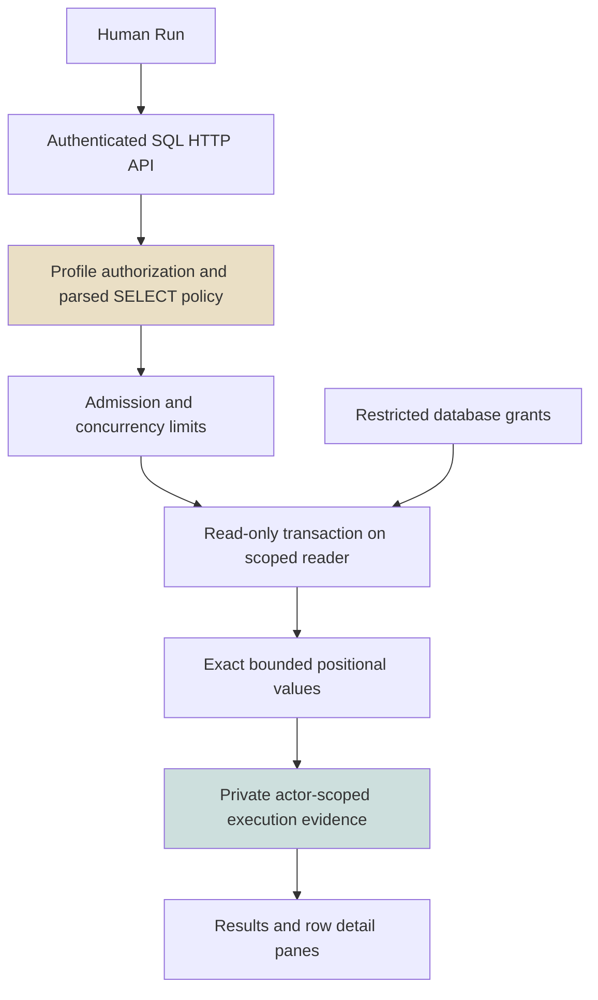
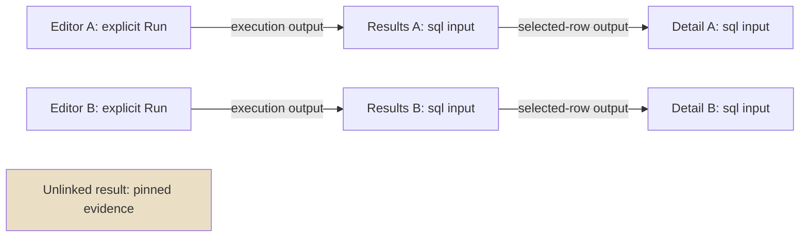
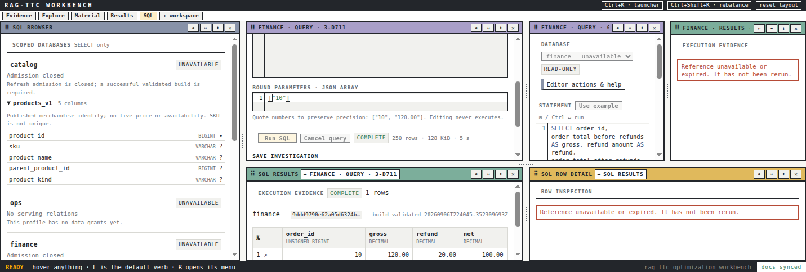

# TTC SQL Investigation: Linked Evidence and Validated dbt Publication

A SQL investigation consists of editable input, an explicit execution, and evidence produced by that execution. These objects have different lifetimes and authorization requirements. Treating them as one editor buffer makes it difficult to answer basic questions: Did this result come from the current statement? Did restoring a workspace execute anything? Does selecting a row identify a business record, or only a position in one result? The implemented TTC workbench gives these questions explicit answers.

This report explains the completed local implementation, with particular attention to the linked PBUI workflow and the dbt publication boundary added after the earlier checkpoint. It is a technical continuation of [[PROJ - TTC SQL Investigation - From RAG Review to Scoped MySQL Execution]], not a replacement for that historical report. The earlier note covers the research, serving semantics, grants and initial execution service in more detail. Together the two notes explain the progression from architecture review to a provider-free human SQL workflow.

> [!summary]
> Four audience profiles exist. Catalog and finance have validated serving relations; operations and support remain unavailable with no data grants. Human investigation uses linked editors, typed results and row details without an LLM. Actual local dbt build/test, failure, restart, interruption and browser acceptance were exercised. This is not a production deployment or a full historical-data validation.

## 1. Begin with three different objects

An **editor draft** is mutable input: profile, SQL text, JSON parameters and a prospective saved-query title. A **saved query** is actor-scoped persisted input that can initialize a draft. An **execution** is a bounded record of what the service actually ran, including its input, status, timestamps, build provenance, column metadata and positional values. Changing one object does not retrospectively change another.

That distinction determines the interaction contract. Editing does not execute SQL. Restoring a saved query does not execute SQL. Restoring an execution reference displays existing evidence if it is still authorized and retained; it does not reconstruct evidence by silently querying again. Once evidence expires, the UI says it is unavailable. A human must issue a new Run to produce new evidence.

Consider the actual final-browser query:

```sql
SELECT order_id, business_date,
  order_total_before_refunds AS gross,
  refund_amount AS refund,
  order_total_after_refunds AS net
FROM orders_v1
WHERE order_id = ?
```

The parameters are `["10"]`, not a number inferred from the editor text. The resulting row contains the exact values `"10"`, `"2026-08-01"`, `"120.00"`, `"20.00"`, `"100.00"`. These are synthetic local facts. The execution records the statement that produced them even if the user subsequently edits the statement to ask a different question.

A useful implementation rule follows: render results from the execution object, never from the current draft. The backend persists the execution's input, and the results panel exposes it under “Executed SQL and parameters.” This makes the evidence inspectable without requiring the reader to trust the editor's present contents.

## 2. Four audiences are four database boundaries

The profiles are `catalog`, `ops`, `finance` and `support`. They are audiences, not deployment environments. The existing dbt targets and source mappings remain separate concerns. A local reader configuration maps each audience to a fixed serving schema and its own restricted account; the HTTP request chooses an approved profile identifier, not a connection string.

| Profile | Initial relation | Effective local data access |
|---|---|---|
| catalog | `products_v1` | SELECT on that exact relation |
| finance | `orders_v1` | SELECT on that exact relation |
| ops | none | No data grants |
| support | none | No data grants |

Establishing empty boundaries is deliberate. It avoids granting operations or support access to finance merely because those future interfaces do not yet have data models. The browser represents this honestly: the empty audiences are unavailable, not apparently usable profiles that fail only after Run.

`products_v1` exposes five explicit identity fields: product ID, SKU, name, parent product ID and product kind. It does not expose a broad product record, price or availability. `orders_v1` exposes eight parent-order fields: identity, number, business date, status, split indicator and the before/refund/after amounts. Exact-column tests are part of the contract; an accidentally added private column must fail validation rather than silently broadening the surface.

The finance contract also defines what its arithmetic does not mean. Refunds restate the original parent-order business date. The resulting amount is not recognized revenue and is not refund-date cashflow. Currency validation rejects non-USD or missing included currencies rather than summing incomparable quantities. The implementation reuses cleaned upstream relations instead of creating another independent raw HPOS transformation pipeline.

## 3. The execution service owns query policy

The frontend is not an authorization boundary. It can disable Run and describe allowed relations, but the service reauthorizes every operation, parses SQL, checks profile-specific relations and functions, acquires bounded resources, and uses the profile's restricted connection. Database grants remain necessary even when the parser rejects an unauthorized reference.



The policy is intentionally narrower than MySQL. It accepts supported SELECT forms, joins, aggregates and approved subqueries, while rejecting writes and unsupported constructs such as CTEs, set operations and window functions. Limits apply before and during execution: 16 KiB statement text, 100 parameters, bounded AST nodes/depth, four concurrent executions, a five-second query budget, 250 result rows, 64 columns and a 128 KiB result envelope. An extra fetched row can establish truncation rather than allowing an unbounded response.

The read-only transaction and restricted account solve different problems from the AST checks. Parsing limits which statements and dependencies the application intends to support. The database account limits what a successfully submitted statement can access. Cancellation and deadlines limit resource occupation. None should be described as a substitute for the others.

The service also distinguishes error classes. A request can be unauthenticated, unauthorized, malformed, unavailable because admission is closed, or unable to resolve missing/expired/other-owner evidence. Tests cover these boundaries separately. The API does not make an expired execution public merely because the caller possesses its opaque ID.

### Exact values require positional rows

JavaScript cannot represent every MySQL integer exactly, and decimal amounts should not be converted through binary floating point merely to render them. The service therefore transports values as strings or null with separate column metadata. A row is an array, not an object keyed by alias. Two projected columns may share an alias without overwriting each other.

The Storybook fixtures include `"9007199254740993"` to make unsafe coercion observable. Null and an empty string remain distinct. The actual browser evidence shows `UNSIGNED BIGINT`, `DATE` and `DECIMAL` metadata returned by the driver. The UI aligns numeric types visually but does not coerce their values numerically.

A row detail pointer uses an execution-relative ordinal. Row 1 in one result is not row 1 in another result and is not itself an order identity. The detail pane states this explicitly. Any future business-record navigation should extract a typed key from an approved column rather than assigning business meaning to the ordinal.

## 4. Layout persistence must not become SQL persistence

PBUI persists layouts and document references. That does not imply it should persist SQL text, parameters or result cells in browser layout state. TTC adds a strict `ragttc.sql-pointer/v1` document format containing an approved profile and, optionally, one opaque draft, saved-query or execution identifier. A row ordinal is valid only with an execution. Unknown fields and combinations are rejected in both Go and TypeScript.

The format permits references, not embedded statements. SQL and results belong in the private service store; unsaved editing belongs in memory. The existing bearer credential mechanism is separate from the layout. Layout sanitization is not presented as a replacement for protecting that authentication mechanism or for defending against arbitrary same-origin script execution.

The private service store uses a mode-0700 directory and mode-0600 files, process locking and atomic replacement. Evidence has a 15-minute API retention window and bounded entry counts. This is private plaintext, not encrypted storage. Retention cleanup at startup and periodic intervals does not guarantee that downtime or backups erase old bytes at the exact expiry instant. The API nevertheless refuses expired evidence.

### Why React remounting mattered

A workbench can reparent a view when opening or arranging another pane. Initially, that remount discarded the query editor's local React state. This made a successful Run appear to erase its input when the result pane opened—a direct violation of the investigation model.

The fix is a small external draft store keyed by view identity, binding and credential epoch, accessed through `useSyncExternalStore`. A microtask grace interval lets a same-commit reparent unsubscribe and resubscribe without losing the entry. A genuinely closed view is deleted after its subscriptions disappear. Credential changes clear entries, and a saved-query load guard prevents remounting from overwriting edits with the original saved input.

The credential epoch also distinguishes an A→B→A credential sequence from an uninterrupted session using A. Returning to the same token string is not permission to resurrect old private UI state. This is tested alongside independent drafts and close/reparent cleanup.

## 5. Links route references, not execution commands

The user asked for multiple editors, results and detail panes. Opening several windows is insufficient: the system must specify which result follows which editor and which detail follows which selected row. Native PBUI links express those dependencies.



The query output port is `execution`; results accept a `sql` input and publish `selected-row`; detail accepts a `sql` input. Run publishes a new opaque execution reference. Selecting a row publishes an opaque execution-plus-ordinal reference. An unlinked result remains pinned instead of being reused as a global “latest result” pane.

A subtle failure appeared during implementation: storing an output document ID did not itself emit that value into the PBUI runtime. `outputPorts.ts` now performs the emission and rehydrates opaque outputs after restoration. Rehydration restores references only. The live reload test observed zero execution POSTs while reconstructing the linked workspace.

Native links also needed a compatible backend document validator. The pinned Go PBUI version did not know `pbui.links`, although the frontend could create it. Rejecting every sync would make the UI appear functional until reload; disabling validation would discard the intended persistence boundary. TTC therefore added a strict host validator for the supported link-document format, with tests, rather than accepting arbitrary JSON.

The live acceptance opened two independent chains and verified that one investigation did not replace the other's evidence. This is stronger than the synthetic Workbench story, whose Run button only changes local story state. The latter is a rendering example, not a link-runtime integration test.

### Wiring access

The native shortcut is Mod+Shift+L: Control on Linux/Windows, Command on Apple platforms. Its ownership rules require focus inside the workbench. After the user reported that Ctrl+Shift+L did not work, a visible top-bar **Wiring** button was added using `link.mode.open`. Both the button and the shortcut from the SQL editor were verified in the Linux browser. Browser-extension interception on the user's machine was not diagnosed by that test.

Shared `sqlDraft` presentation descriptors expose Run/Cancel/Save and help through the existing PBUI vocabulary. The routed `sql.control` verb carries only a view ID and operation. The live controller rechecks availability and refuses agent execution: adding human presentation vocabulary is not equivalent to authorizing an LLM to run arbitrary SQL.

## 6. Visual consistency was tested on rendered interfaces

The SQL panels use existing PBUI controls and typography rather than a separately styled application. The implementation reuses AppBody, Button, Toolbar, SectionLabel, SelectInput, TextInput and EmptyState, plus the workbench's existing identity and key/value elements. CodeMirror supplies MySQL and JSON highlighting, line numbers and the explicit Run chord.

Turboproof and Datalab were run as references. Datalab's source and table panels informed dense schema rows, sticky typed headers, restrained borders, stripe/hover treatment and horizontal overflow. Its domain-specific table runtime was not imported merely to obtain its geometry. Pure SQL Browser, Query, Results and Detail panels accept data and callbacks; controllers own authentication, fetching, persistence and link routing.

The shared editor gained MySQL support in PBUI commit `9359708`. To avoid an unreproducible sibling-directory dependency, the unchanged MIT-licensed source was vendored into the RAG frontend with provenance and a package override. A standalone offline frozen-lockfile install, typecheck, build and tests verified that the application no longer required the sibling checkout. The first vendoring checkpoint exposed Vitest transform configuration failures; corrective commit `0e79be6e9` followed the failing intermediate `335f5721d` rather than concealing it.

Nine network-free stories cover the composed workbench, query/results views, empty, expired, running, 250-row truncation, narrow detail and theme override. They are useful for visual iteration without credentials or service state. Production and Storybook builds both passed. Existing ineffective dynamic-import/chunk warnings are documented rather than represented as a warning-free build.


The final image shows actual local dbt-published data, with the query on the left of its linked result and row detail. Screenshot feedback changed the default SQL workspace to three columns because a stacked layout in a short restored viewport clipped useful editor content. The final capture used an explicit 1600×1100 viewport. The screenshot predates the subsequent top-bar Wiring button; its native link indicators and data are otherwise the demonstrated workflow.

## 7. Refresh closes admission before invoking dbt

A refresh callback is not safe merely because it runs a build command. Queries must not enter while publication is in progress, failure must not silently reopen the service, and a disconnected request must not leave a database-writing child running. The service and operator executable divide these responsibilities explicitly.

The service durably records closed admission before draining or cancelling its own executions. It then invokes a trusted, configured executable with no request-supplied command, shell string or destination arguments. Failure leaves admission closed, including after restart. A successful callback produces a new validation-event build ID and permits admission again.

```text
persist admission = closed
stop admitting new queries
drain/cancel this service's running executions
invoke trusted local build/test executable
if callback fails or is interrupted:
    retain closed admission
else:
    record validated build identity
    reopen admission
```

Profile discovery now exposes an unavailable reason when refresh admission is closed. The UI polls this metadata and disables Run. The backend remains authoritative if a request races the display update. This polling is an affordance, not synchronization between a browser and the publication transaction.



The observed closed-state capture required starting refresh and waiting for the display in one browser function. Separate tool calls initially missed the short interval. That timeout is not evidence that admission failed; the combined test and HTTP responses supplied the relevant observation.

### What the local executable actually does

TTC commit `9379f7e68` adds `sql/dbt/bin/local-assistant-refresh`, its Python implementation, operator guide and tests. It requires `TTC_SQL_FIXTURE_REFRESH=1`, the expected private reader configuration, the fixed local container and loopback MySQL port 3336. It runs through the existing `run-dbt-with-lock` once, rather than attempting to acquire the same lock again inside the build.

The executable creates random staging schemas and a private temporary dbt project containing the real two serving models, their macros/tests and four synthetic cleaned ancestors. Acceptance requires six successful model nodes and twenty passing tests. This count prevents accepting a superficially successful command that accidentally selected no relevant work.

After checking MySQL 8.0 and InnoDB, it publishes both validated tables using one multi-table rename, then repeats 64 reader/grant assertions. The serving schemas and table names are fixed; they do not come from HTTP input. Publication and post-publication verification are separate: if a later check fails, the service remains closed, and automatic data rollback is not claimed.

The preflight initially expected an IPv4-loopback Docker publication. The existing container actually publishes `0.0.0.0:3336` and `[::]:3336`. The guard was corrected to recognize that existing mapping while retaining a hardcoded loopback client connection. No Docker networking was changed. “The client connects locally” must not be confused with “the database listener is externally unreachable.”

### Cancellation must include descendants

`exec.CommandContext` ordinarily targets the immediate child. A wrapper can spawn Python and dbt, so cancelling only the wrapper is inadequate. The Linux implementation starts a process group and kills the entire group on cancellation. A unit test starts a child and verifies it cannot continue running after cancellation; a briefly unreaped zombie is treated differently from an executing process.

The live test disconnected during an actual dbt execution, verified that the child stopped and the shared lock was released, and confirmed admission remained closed. Hard termination prevents Python's normal cleanup from running. The private receipt records that invocation's created schemas and workspace so cleanup can target those exact resources after termination. The test removed those resources explicitly. Wildcard schema cleanup would violate the ownership boundary and is not part of the procedure.

## 8. Failure tests establish the contract

The EUR build was not simulated by returning a callback error. It built six actual dbt models and failed exactly the currency test among twenty tests. No publication occurred; subsequent execution admission returned HTTP 503. Restarting with a USD configuration did not erase the blocked state. Only a successful validated refresh recovered it.

Shared-lock contention was exercised separately: holding the existing lock caused refusal before dbt started. The interruption test established child termination and lock release, and a subsequent USD build established recoverability. The final browser query then read the published relations with `validated-20260906T224754.368183448Z` provenance and exact gross/refund/net values.

That build ID identifies a validation event. It is not an immutable database release or a promise that those mutable table contents can later be reconstructed from the ID alone. Existing execution evidence retains its own bounded values until expiry, which is sufficient for this human investigation scope. Immutable releases were deliberately not introduced.

| Evidence | What it establishes | What it does not establish |
|---|---|---|
| Six models and twenty tests | Actual local serving build and contract checks | Full raw HPOS historical correctness |
| 64 reader checks, including 12 cross-profile directions | Effective restricted local grants | Production IAM/deployment correctness |
| Real MySQL/HTTP race suite | Reads, authorization, cancellation and recovery paths | Arbitrary future driver compatibility |
| Two linked browser investigations and zero POSTs on reload | Independent references and non-executing restoration | Every possible browser extension/key mapping |
| EUR failure/restart/interruption | Durable closed admission and recovery ordering | Automatic cleanup after every machine crash |
| Storybook and screenshot comparison | Rendered visual vocabulary and representative states | A production accessibility certification |

The full uncached Go run passed 74 packages. The final frontend run passed 179 tests in 30 files, plus typecheck and production build; Storybook build and standalone dependency validation also passed. The real MySQL/admin race suite and eleven Python reader/refresh guard tests passed. Commit hooks additionally ran Go tests, lint, Glazed checks and logcopter validation. These are complementary checks, not interchangeable counts of correctness.

## 9. Reproduction and review order

Start with the operator documentation, not a copied production credential. The local fixture reader configuration resides outside git under `~/.local/state/ttc-sql-001/`; the SQL CLI accepts its path and a private token file. The human frontend is a consumer of the same SQL HTTP service used by the CLI, and the standalone server mounts the authenticated workbench document endpoint as well. It needs no model provider, campaign or RAG resource bundle.

The most useful source order is:

1. TTC `sql/dbt/models/assistant/README.md` and the two serving models establish semantics and explicit columns.
2. TTC `sql/dbt/bin/local-assistant-readers.md` and `local-assistant-refresh.md` establish local provisioning, build and cleanup procedures.
3. RAG `pkg/ttc/sqlworkbench/README.md`, `policy.go`, `service.go` and `store.go` establish the execution and persistence contracts.
4. RAG `apps/workbench/web/src/sql/` separates pure panels, transport, draft ownership, output ports and live controllers.
5. RAG `pkg/ttc/workbenchhost/sql_pointer.go` and `links.go` establish the persisted-document boundaries.
6. Ticket `reference/02-implementation-diary.md` records failed attempts, corrections, screenshots and phase-print receipts.

Useful nonsecret checks include:

```bash
# rag-ttc
GOWORK=off go test ./... -count=1
GOWORK=off go test -race ./pkg/ttc/sqlworkbench ./cmd/rag-ttc/cmds/sqlworkbench

# rag-ttc/apps/workbench/web
pnpm install --frozen-lockfile
pnpm typecheck
pnpm test
pnpm build
pnpm build-storybook
```

The ordinary Go run skips optional live-database tests unless their documented private configuration is supplied. Do not cite an unconfigured run as a fresh MySQL test. For refresh reproduction, follow the executable's operator guide, including fixture opt-in, lock ownership, expected container and receipt-scoped cleanup. Do not substitute an arbitrary DSN or point the fixture builder at production.

## 10. Implementation checkpoints and remaining operational scope

| Repository | Commit | Responsibility |
|---|---|---|
| TTC | `1c28da47b` | Serving models and semantic/currency contracts |
| TTC | `907189dba` | Four local readers and authorization verification |
| RAG | `97895c9f5`, `d94c0980c` | Policy, execution, persistence, HTTP and CLI |
| PBUI | `9359708` | Shared MySQL editor grammar, story and test |
| RAG | `2958c77dd` | SQL panes and visual stories |
| RAG | `5ae0a56b5` | Native links and private persistence |
| RAG | `335f5721d`, `0e79be6e9` | Shared actions/vendor and corrective test transform configuration |
| TTC | `9379f7e68` | Actual guarded local dbt publication |
| RAG | `eab989ee3` | Refresh cancellation/admission, readable geometry and Wiring button |

The RAG repository is `/home/manuel/workspaces/2026-09-01/add-plot-editor/rag-ttc`; TTC is `/home/manuel/code/ttc/ttc`; shared PBUI is the workspace's sibling `pbui`. Implementation commits remain on their working branches. This report is published to the go-go-parc vault; it does not imply those application branches were deployed or pushed as a release.

The user was actively checking wiring at handoff, so the local UI/API are intentionally retained for review rather than stopped immediately. The previously exposed development bearer was revoked; the current private bearer was not reproduced in screenshots or this note. Local serving fixtures/readers remain available for development. Original reMarkable PDFs and their annotations remain untouched; they are historical research artifacts, not copies of this final implementation report.

Future production work must validate actual historical populations and currency assumptions, decide how to populate ops/support, review authentication and network exposure, and define deployment/refresh ownership. Arbitrary DSNs, writes, federation, public customer access, generic plugin registries and immutable release infrastructure are not hidden incomplete pieces of this ticket; they were excluded from its agreed local scope.

The implemented result is narrower and testable: a human can inspect an approved schema, author a parameterized SELECT, explicitly execute or cancel it, preserve exact evidence, connect independent investigations, restore references without executing, and observe admission close around an actual validated local dbt publication. Each operation has a distinct owner and a concrete failure behavior. Those distinctions are what make the workflow suitable for continued development.
