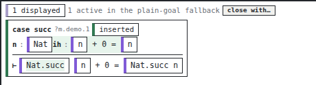
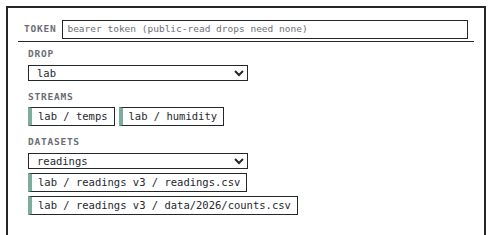
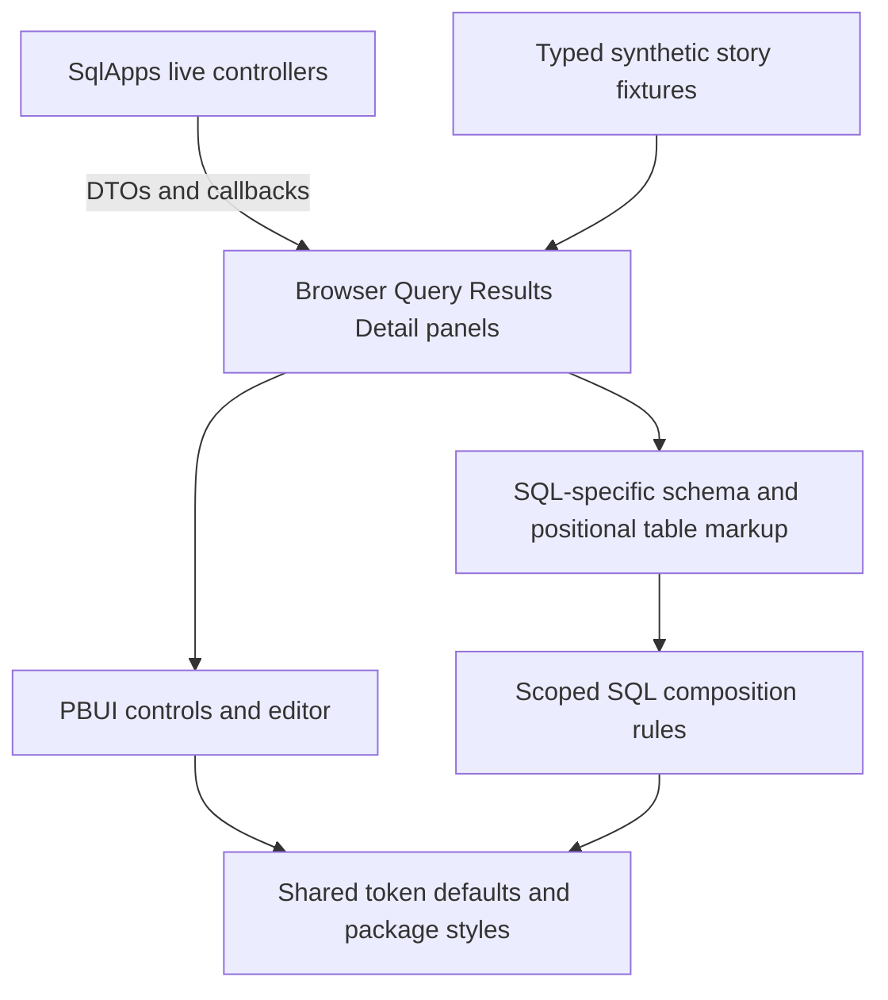
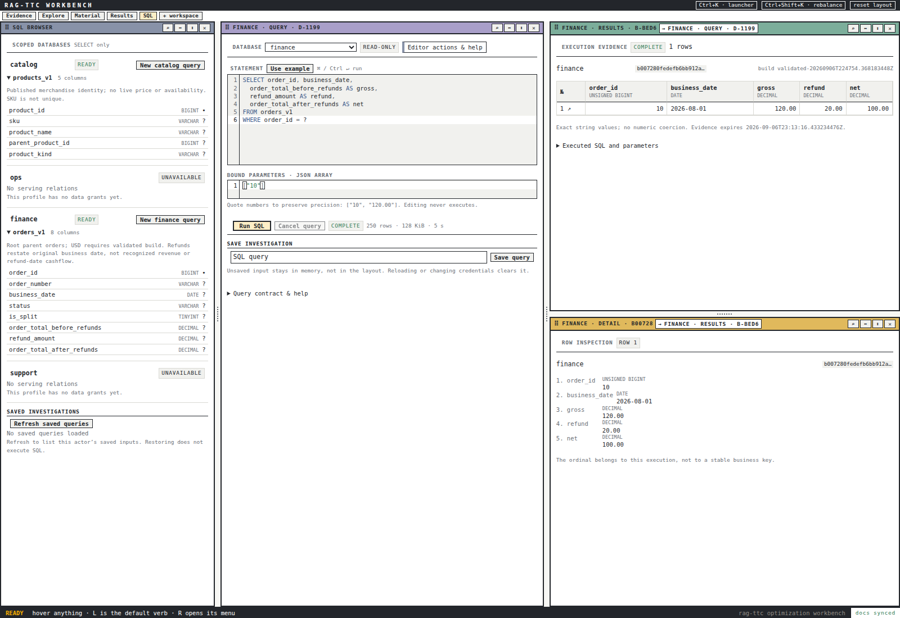

# Matching PBUI Through Components, Tokens and Visual Evidence

A workbench matches a design system when its controls, typography, spacing, boundaries and interaction states are produced by the same contracts as the other applications in that system. Matching a few colours is insufficient. A correctly coloured button can still have the wrong height, omit its accessible name, submit an enclosing form unexpectedly, or disagree with the workbench's action availability. This report explains how the TTC SQL interface was adapted to the PBUI family and what that work reveals about onboarding developers into the family style.

The account is grounded in the implemented SQL panels, their Storybook fixtures, the implementation diary, Turboproof and Datalab references, and the current PBUI documentation. It separates changes actually delivered from recommendations. No application code or PBUI documentation was changed while preparing this report. The documentation proposals below are a worklist, not a claim that those guides already exist.

> [!summary]
> The SQL refactor adopted PBUI controls, shared typography/tokens, a MySQL-aware CodeMirror editor and independently renderable panels. Rendered references and screenshots shaped table anatomy and workspace layout. PBUI already documents many of the right principles, but guidance is fragmented, partly outdated and occasionally contradictory. The next documentation task is consolidation and a tested example, not another disconnected list of CSS rules.

## 1. The original request was about a system, not a stylesheet

The user asked the SQL workbench to match Turboproof or Datalab, explicitly calling out existing widgets, syntax highlighting, result tables, Storybook and screenshot feedback. That request had three separable implications. First, the SQL controls should be instances of shared PBUI components where equivalents exist. Second, the domain-specific parts should use the same visual roles without importing inappropriate domain semantics. Third, acceptance needed rendered evidence, not just a successful TypeScript build.

The relevant implementation lives under `rag-ttc/apps/workbench/web/src/sql/`. `SqlApps.tsx` contains live application controllers; `panels.tsx` contains the browser, query, results and detail renderers; `sql.css` supplies local composition and table rules; `panels.stories.tsx` supplies synthetic states. The shared editor lives in the PBUI repository's `packages/pbui-editor`, with a licensed source snapshot consumed by this RAG frontend.

These boundaries matter because the same report could otherwise tell a misleading story. The work did not migrate every RAG component to PBUI, did not eliminate all local CSS, and did not turn Datalab's table into a generic SQL table. It established a usable, visually consistent SQL feature within the existing application, while leaving several structural and component-reuse opportunities visible.

## 2. Define the visual contract before changing markup

The current authoritative defaults are in **PBUI `src/tokens.css`**, not in a copied product palette. They define paper/pane surfaces, neutral alternation, ink and faint text, selected fill, borders, focus treatment, a closed type scale and a six-step spacing scale. The common appearance is concrete enough to inspect:

| Role | Current token values or names |
|---|---|
| Type family | `--pbui-font`: IBM Plex Mono with platform monospace fallbacks |
| Type sizes | micro 8.5px, tiny 9.5px, small 10.5px, base 11.5px, title 13px |
| Spacing | 2, 4, 6, 10, 16 and 24px through `--pbui-space-1` … `-6` |
| Borders | hair, firm and grid roles rather than unrelated component borders |
| Corners | `--pbui-radius: 0` |
| Labels | `--pbui-track-label`, a shared uppercase-label treatment |
| Selection | `--pbui-selected`; neutral tags have a separate wash role |
| Focus | `--pbui-focus-ring` and `--pbui-focus-offset` |

The table describes the current implementation, not immutable aesthetic law. A future type-scale change should change the shared contract and its examples deliberately. A product should not copy all of these literals merely because it wants today's appearance: that copy would stop tracking future shared corrections.

PBUI defines defaults in `:where(:root)`, which has zero specificity. A consumer's ordinary `:root` override wins over those defaults. This is a deliberate extension mechanism: the consumer overrides a small number of roles and inherits the rest. It is different from overriding internal component classes or transcribing an entire palette.

The first diagnostic when a shared control looks unexpectedly bare is therefore not “write a better button.” It is “is the stylesheet loaded, are the required tokens defined, and what styles actually win?” PBUI's existing playbooks record earlier products accumulating compensating CSS because components read undefined tokens. An invalid custom-property substitution can invalidate the whole declaration without a build error. Styling defects can thus lead directly to avoiding shared components.

### Import reachability is part of the contract

The RAG entry point loads PBUI core styles, workbench styles, plot styles and the product stylesheet. The SQL panel module loads editor styles. The SQL Storybook preview loads core, workbench and product styles; its rendered panels also load editor styles through their module dependency.

```ts
// Core imports common to this application's SQL story and runtime paths.
import "@hyperslop-systems/pbui/styles.css";
import "@hyperslop-systems/pbui-workbench/styles.css";

// Imported by the SQL panel module when it uses the shared editor.
import "@hyperslop-systems/pbui-editor/styles.css";
```

The story and runtime entry points are not literally identical: `main.tsx` additionally imports plot styles. That is not proof of a visible SQL defect, but it means this project should not claim an automated whole-application stylesheet-parity check that it does not have. A future parity test should compare a declared shared foundation and explicitly document feature-specific differences, rather than blindly equating all imports.

PBUI already has useful tests for this class of problem. `src/styles-wiring.test.ts` checks stylesheet reachability and ordering in the library source, while `src/tokens-defined.test.ts` checks token definitions. Those are library guarantees. A consuming application still needs to verify that its own entry points and published artifacts load the intended styles.

## 3. Read reference applications at two levels

Turboproof's styles and stories supplied a reference for compact controls, restrained spacing and familiar text hierarchy; its application styles also described the masthead and workbench treatment. The archived rendered example is an isolated Goals story, not a full-shell screenshot. Datalab supplied concrete source and table panels, including how fields, types, empty states, sticky headers and numeric columns fit into bounded panes.



The references were used in two ways. Their screenshots made visual differences observable, while their source revealed which parts came from PBUI and which belonged to the product. Reading only CSS cannot establish whether a control has a visible label or whether a pane scrolls correctly. Reading only a screenshot cannot establish whether a table's row model is suitable for SQL.



Both reference images are cropped excerpts of archived screenshots, excluding unused surrounding whitespace. The Datalab screenshot here is a source-panel reference, not a claim that it depicts the SQL result-table implementation. The table comparison also used `packages/datalab-ui/src/components/organisms/TablePanel/TablePanel.tsx` and its module CSS. The distinction keeps the illustration's evidence separate from the source review.

### Reuse appearance without importing the wrong data model

Datalab's TablePanel is not just a styled HTML table. It imports its own presentation runtime and FieldChip, operates on its field/row model, and attaches field/datum interactions. It limits rendering to 200 rows while retaining the complete pipeline dataset. Those semantics are appropriate for Datalab.

The SQL service has a different contract. Rows are positional arrays of exact strings or null, duplicate aliases are legal, and the backend bounds evidence to 250 rows and a byte envelope. Adapting these rows into an object keyed by column name could overwrite duplicate aliases. Numeric conversion could corrupt a large integer or alter decimal representation. Importing Datalab solely to avoid writing table markup would couple the SQL feature to the wrong invariants.

The chosen approach reused the visual recipe—sticky headers, type annotations, restrained grid rules, alternating rows and numeric alignment—while retaining SQL-specific rendering. This is an important rule for new PBUI developers: reuse the lowest layer that matches the semantics. A similar screenshot is not sufficient evidence that a domain component is the right dependency.

## 4. Extract the panels so visual work is independently testable

The refactor separated live controllers from renderable panels. BrowserPanel receives profiles, saved queries, error states and callbacks. QueryPanel receives draft state, availability information and Run/Save/Cancel callbacks. ResultsPanel receives an execution and an inspect callback. DetailPanel receives an execution and ordinal. These renderers do not fetch SQL data or resolve bearer credentials.



This separation lets Storybook exercise loading, unavailable, expired and overflow states without creating a backend state that produces each one. It also makes the limits of the stories clear: a panel story can prove that the rendering supports an expired result, not that the service expires evidence correctly.

QueryPanel still derives control availability from a pure helper using the supplied state. “Presentational” does not mean “incapable of any computation.” It means that the panel's rendering and interaction availability can be understood from its inputs, without hidden network calls or ambient authenticated state. The controller remains responsible for validating a requested operation against the live service state.

### The actual shared component replacements

The SQL panels import `AppBody`, `Button`, `EmptyState`, `SectionLabel`, `SelectInput`, `TextInput` and `Toolbar` from PBUI. This reuse carries more than CSS. SelectInput takes option data, a required `accessibleName`, and `onValueChange(value)` rather than exposing DOM event extraction at every call site. Button variants and Toolbar spacing encode common choices rather than accepting an unbounded style configuration.

An abbreviated excerpt illustrates the shape:

```tsx
<Toolbar bordered>
  <SectionLabel>Database</SectionLabel>
  <SelectInput
    accessibleName="SQL profile"
    variant="framed"
    value={draft.profile}
    disabled={running || lockedProfile}
    onValueChange={profile => onChange({ profile: profile as ProfileID })}
    options={profiles.map(p => ({
      value: p.id,
      label: p.id,
      disabledBecause: p.available ? undefined : "unavailable",
    }))}
  />
</Toolbar>
```

The full implementation also clears execution/saved bindings and SQL when changing profiles. That domain behavior is omitted from this excerpt to isolate the composition pattern; it must not be dropped when implementing the actual feature.

The visible “Database” label and the accessible name serve different purposes. Replacing a raw select with a shared component does not automatically preserve both. This distinction appears repeatedly in PBUI's historical documentation, and the current component type is the authoritative source when examples disagree.

## 5. Scrolling and bounded geometry are design-system behavior

The most consequential layout primitive adopted here is AppBody. Its CSS sets `flex: 1`, `min-height: 0`, `min-width: 0`, `overflow: auto`, and tokenized padding. Without the minimum-size overrides, a flex child may grow to fit content rather than fit the tile's allocated region. A developer then sees clipped controls or a missing scrollbar and may compensate with arbitrary heights in several children.

The shared primitive establishes the reusable part. The application must still provide a genuinely bounded parent. A component whose height is “100%” cannot create a meaningful height if the containing layout never commits one. This is especially visible in Storybook, where a panel can render in an unconstrained document even though the real product renders it inside a split tree.

The SQL table has another explicit scroll region: `overflow: auto`, `max-height: 55vh`, a grid border, and `flex-shrink: 0`. Sticky headers stay at the top of that region. This is the current feature implementation, not a generic recommendation that all tables should use viewport units. Nested scroll containers and a viewport-relative cap inside a tile deserve further testing before extracting this as a shared table primitive.

Screenshot feedback exposed a separate geometry issue: the initial stacked SQL layout in a short restored viewport clipped useful editor content. The default workspace was changed to three columns—browser, editor and results—with a subsequently opened detail pane sharing the right-hand area. The final capture explicitly used 1600×1100 dimensions.



This is actual local synthetic database evidence, not the composed Storybook fixture. It predates the later top-bar Wiring button. Its value for this report is that the schema, editor, execution provenance, table and detail can be inspected together at a known viewport size.

A larger viewport alone is not a responsive-design proof. The source still needs awkward widths, long values, collapsed regions and keyboard traversal checked deliberately. The delivered NarrowDetail story covers one 320px case; it does not certify every workspace arrangement.

## 6. Keep typography and value semantics separate

The SQL CSS uses the shared small/tiny/micro roles for result text, hints and type metadata. Table cells use tabular numerals and right alignment for numeric types. These are visual decisions. The values themselves remain unchanged strings or null.

```css
/* Existing SQL rules, shown without unrelated selectors. */
:where(.sql-app) [data-part="result-table"] {
  width: 100%;
  border-collapse: separate;
  border-spacing: 0;
  font-size: var(--pbui-fs-small);
  font-variant-numeric: tabular-nums;
}
:where(.sql-app) td[data-numeric="true"] {
  text-align: right;
}
```

The result renderer indexes columns and cells by position. SQLCell renders null as the explicit word `NULL`, the empty string as “empty string,” and ordinary strings verbatim. This avoids relying on a blank cell to represent two different states. Status labels likewise include text; colour reinforces state rather than being its only representation.

One remaining semantic mismatch is worth documenting: the SQL stylesheet uses `--pbui-selected` for table hover and for running/truncated status fills. PBUI-VISUAL-1 explicitly tried to stop selection colour becoming a generic accent. Being tokenized is therefore necessary but not sufficient for following token semantics. A future pass should decide which states genuinely mean selection and use the appropriate hover/neutral/status recipe for the others.

This is the difference between a token catalogue and a style guide. The catalogue says which variables exist. The guide must explain when to use them and show cases where a technically valid token reference is the wrong choice.

## 7. Integrate the editor as a shared package

The earlier SQL surface needed syntax-aware editing rather than a differently styled textarea. PBUI already had a CodeMirror-based editor package with controlled value updates, required accessible naming, rows, read-only mode, diagnostics and an explicit Run callback. The SQL feature added a MySQL grammar to its language union rather than creating a second editor implementation.

```ts
export type EditorLanguage = "javascript" | "json" | "sql" | "plain";

// The SQL branch in languageExtension:
return sql({ dialect: MySQL });
```

The query uses `language="sql"`; parameters use `language="json"`; executed-input inspection reuses the same component in read-only mode. The syntax theme reads the six shared `--pbui-syntax-*` roles. This avoids an unrelated editor colour scheme inside an otherwise consistent panel.

Keyboard ownership is part of integration. Mod+Enter invokes Run. Workbench-level shortcuts operate through their own routing and focus ownership. The later user report about Ctrl+Shift+L led to a visible Wiring button; on Apple platforms the shortcut uses Command. A style guide should require discoverable controls for important operations instead of presenting keyboard labels as a complete interaction design.

### Dependency portability exposed a separate failure

During development, the frontend linked the sibling editor package. That was useful for iteration but not portable. The final consumer uses an unchanged MIT-licensed source snapshot with provenance, pinned dependencies and an override ensuring the intended editor instance. The snapshot names historical PBUI commit `9359708`; the current checkout inspected for this report has equivalent MySQL extension source at tip `1391b19`. A comparison of `extensions.ts` between those revisions showed no difference. Historical provenance is retained rather than silently rewritten.

The first source-vendor checkpoint exposed a Vitest transform failure, corrected in a follow-up commit. A standalone offline frozen-lockfile install, typecheck, build and tests then established that a sibling checkout was not required. This is package-integration evidence, not a reason to recommend vendoring as the default PBUI adoption strategy. A published compatible editor release should be preferred when available.

The editor README also needs a precise correction. It still opens by describing JavaScript and JSON highlighting, omitting SQL. It says bundling means a consumer can never have two CodeMirror copies; its own API now exports EditorView, EditorState, Compartment and Prec for consumers. The safe rule is narrower: use those exported primitives when extending this editor, and do not mix extensions built with an independently installed CodeMirror instance.

## 8. Storybook supplies examples; browser acceptance supplies integration evidence

The delivered story file defines nine exports: Workbench, Query, Results, Empty, Expired, Running, Truncated, NarrowDetail and ThemeOverride. The fixtures include a BIGINT string beyond JavaScript's exact-integer range, decimal strings, null, an unavailable profile and a 250-row truncated result. These are useful choices because a reviewer can detect a real representational defect, not merely a change in row count.

The controlled editor story owns local draft state so typing works. Its Run callback changes a status label; it does not call the SQL service. The composed Workbench story uses a custom frame and grid, and switches its result area to a detail panel after row selection. It is not a native workbench linking integration story.

These limits should be written next to the stories, as they are in the file's description and `.storybook/README.md`. Otherwise a reviewer might infer that seeing three panels proves view identity, persistence or independent link behavior. The actual two-chain link, saved restoration, cancellation and no-execution-on-reload checks were separate live tests.

There are also gaps in the visual matrix. ThemeOverride changes only two tokens. There is no dedicated unstyled-mode demonstration, no exhaustive control-state matrix for the whole query panel, and no full application screenshot-regression suite established by the nine stories. Reference Storybooks produced console errors during the earlier comparison, so their screenshots establish appearance, not an error-free reference runtime.

The final implementation checkpoint recorded 179 frontend tests in 30 files, typecheck, production build, Storybook build and the standalone dependency test. Those results belong to that checkpoint; preparing this documentation did not rerun the application suite. The report's new validation concerns source claims, paths, assets and publication.

## 9. What remains noncanonical in the delivered refactor

The SQL feature is a useful case study, but it should not be copied as a perfect PBUI starter. Its visual improvement is real; some integration choices remain local compromises.

First, multiple panels share `panels.tsx`, a combined story file and `sql.css`. The existing refactoring playbook recommends colocated component folders and CSS modules. The SQL stylesheet is scoped under `.sql-app`, which reduces collisions, but it remains global and uses structural selectors such as a profile section's first child. That differs from a stable exported parts contract or component-private CSS module.

Second, SQLNotice renders the older RAG `wb-error` element rather than PBUI Callout. SQLStatus draws a local badge rather than reusing Chip. DetailPanel uses the existing RAG KeyValue rather than PBUI KeyValueList. The source imports prove that these are available opportunities, not reasons to invent new primitives. A follow-up should compare their exact content and accessibility behavior before mechanically replacing them.

Third, the RAG shell remains product-owned and the synthetic story Frame reproduces a little chrome. PBUI now provides AppShell and native workbench surfaces. Pure-panel stories can legitimately use a minimal bounded frame, but a native integration story should demonstrate the actual shell, title bars, providers and ports rather than imply that the lightweight frame is the canonical shell implementation.

Fourth, draft survival under React reparenting required a memory store keyed by view, binding and credential epoch. This was not a CSS fix, but it was necessary for a correct layout interaction: opening a result pane initially erased the editor's state on remount. A developer guide for tiled applications must explain that visible placement and durable view identity are different concepts. Styling a panel cannot compensate for losing its state when the panel moves.

These follow-ups do not reopen the completed local SQL feature scope. They identify what should and should not be generalized from it when teaching new PBUI developers.

## 10. The existing PBUI documentation is substantial but fragmented

The documentation audit found useful material in five places: the root README, three integration playbooks, package READMEs, Datalab's guidelines, and PBUI-VISUAL-1's design/after-report. Component comments and stories contain further operational details. The main problem is that there is no short, current route through those sources for “build a panel that looks and behaves like PBUI.”

| Existing source, relative to `pbui/` | What it already teaches | Required update |
|---|---|---|
| `README.md` §“What a consumer imports” | Core stylesheet and package entry points | Add a prominent visual-onboarding route, component-selection table and links to canonical examples; distinguish core/workbench/editor styles |
| `docs/playbooks/building-a-new-hyperslop-systems-app-on-pbui.md` §§3,4,6a,9 | Imports, token failure modes, reuse-first layering and story/runtime parity | Replace old default bootstrap examples with the current workbench package; separate historical migrations from current instructions; reconcile packaging and fixture policies |
| `docs/playbooks/refactoring-a-pbui-app-into-atoms-molecules-and-organisms.md` | Incremental extraction, CSS modules, reuse inventory and screenshot validation | Reconcile its absolute folder rule with current Datalab policy; add a semantic component-adoption checklist and explicit visual-change versus structure-only branches |
| `packages/datalab-ui/GUIDELINES.md` | Type/space roles, layers, stories, CSS rules, non-colour state and review checklist | Correct token ownership, stale commands/API names and internal layering inconsistencies; retain Datalab-specific policy locally |
| `packages/pbui-editor/README.md` | Controlled editor, theme, rows, keyboard and dependency rationale | Add SQL/MySQL, supported language matrix, correct the CodeMirror-instance claim and show exported-extension usage |
| `packages/pbui-workbench/README.md` §§Styles/Wiring | Separate styles, native wiring and extension points | Add AppShell/AppBody bounded composition, shortcut ownership and a visible wiring-entry recipe with tested current APIs |
| `ttmp/2026/09/04/PBUI-VISUAL-1--…/design-doc/02-…` and `03-…` | Consolidated tokens, chrome, chips, notices, structure and before/after evidence | Promote stable conclusions into durable docs; keep historical screenshots and implementation chronology in the ticket |

### Concrete inconsistencies worth correcting first

The Datalab guide says its visual language is `src/styles/tokens.css`; that file no longer exists in the package. PBUI-VISUAL-1 explicitly moved the defaults to core. Sending a newcomer to a deleted file is a direct onboarding failure.

The old refactoring playbook requires one folder per component with no small-component exception. Current Datalab guidelines allow a flat/local file until supporting assets or independently meaningful states justify a directory. These policies cannot both serve as universal requirements. Decide the family rule once, then identify stricter package-local constraints separately.

Datalab's layer section permits organisms to import API code and says fetching can make a component an organism; its new-application recipe later requires the panel organism to have no API import. The new-app playbook also says organisms do not fetch. The recommended canonical distinction is a side-effectful controller versus a DTO/callback panel, with naming subordinate to that distinction.

The Datalab guide still refers to `IconButton.label` and `TextInput.label` as required aria names, while current controls use `accessibleName`. Its procedures also retain `ui/`-relative commands and historical application registration examples. These need verification against current package scripts and workbench APIs, not another prose-only rename.

The token-check explanation overstates its own shell command. A set difference of referenced variables minus defined variables finds missing definitions. It cannot identify a variable that a consumer defines but nobody reads. Those are opposite queries. A guide should state exactly what its checks establish, and avoid selling one grep as both undefined-token and unused-token detection.

Finally, PBUI-VISUAL-1's after-report explicitly leaves a visual-audit playbook as future work. That is the best source material for the requested guide, but a ticket's historical phase plan is not a current developer entry point. Even its design sketch must be checked against source: the sketch calls the Callout option `severity`, while the implemented component uses `variant`.

## 11. Create a small canonical documentation set

The recommended work is four connected documents and one executable example. These are proposed paths, not files created by this report.

### P0 — `docs/guides/visual-style.md`

This should answer “what makes an interface PBUI?” in one reading. Define visual roles with annotated rendered examples: pane versus page surface; grid versus framing border; title, label, value and hint typography; selected versus hovered versus neutral tag; colour reinforced by text or border state; focus treatment; and the rule against unnecessary nested frames.

Include a replacement catalogue: raw button→Button, arbitrary flex row→Toolbar/Stack, empty paragraph→EmptyState, warning box→Callout, inert status/type marker→Chip, definition list→KeyValueList, scrolling tile body→AppBody, code editing→CodeEditor. For each, explain the exception that requires a domain component. SQL positional tables are a good example of why a visually similar Datalab component may not be the right runtime dependency.

### P0 — `docs/guides/first-styled-workbench-panel.md`

Build one actual small application with a bounded native host, toolbar, labelled control, empty/loading/error states and a result/detail interaction. Start with shared defaults and the correct imports. Show both pure-panel stories and a provider-backed native workbench story. Include only current APIs, compiled by CI; link the README directly to this guide.

The example should be safe by default: synthetic fixture data, no embedded credential, explicit action callbacks and no execution on render. Show the difference between visible labels and accessible names. A working initial result is more useful than requiring a new developer to assemble five different historical demos.

### P1 — `docs/reference/styling-contract.md`

Document token ownership, package stylesheet responsibilities, supported override points, CSS-module ownership, named public parts, and what not to target. Generate the token inventory from source where practical, then add manually maintained semantic explanations and examples. Distinguish a public styling hook from incidental DOM structure; a `data-part` string is not automatically a promise that every selector can safely depend on it.

Include the closed type/spacing roles and exceptions process without requiring copied palette literals. Address portal theming explicitly: a wrapper-level override only reaches descendants, not a menu portalled elsewhere. Document editor extension identity and the difference between a local package link, a registry artifact and this project's temporary source-vendor exception.

### P1 — `docs/playbooks/visual-review-and-storybook.md`

Specify a reproducible comparison: fixed viewport, loaded fonts, known data, matched feature state, reference caption, changed-component list, console review and an explicit conclusion. Include narrow/overflow, empty/loading/error/disabled and keyboard states. Use synthetic or sanitized wire-shaped fixtures; do not copy private production responses into Storybook merely because an older playbook says “real captured data.”

Provide checks with declared scopes: stylesheet reachability, shared-foundation parity, token definitions, raw-control exceptions, story coverage and bounded-host rendering. A library test is not automatically a consumer test. Fail on unexpected console errors and record approved exceptions narrowly. Treat visual review and behavior tests as complementary evidence.

### P1 — a compiled example and shared story host

Create a small `examples/styled-workbench/` application or an equivalent discoverable example within the existing demos, rather than another undocumented package. It should exercise the recipe in a clean package consumer and expose the important states in Storybook. Reuse or create a bounded-host decorator only after inventorying current decorators; the historical after-report's blank-story warning does not prove every current package still lacks one.

Acceptance should be concrete: a developer follows the guide from a clean checkout, gets a recognizably PBUI panel, can edit a controlled input, can open help/wiring without guessing a shortcut, sees an informative disabled/error state, and can inspect it at a narrow size without missing controls. Documentation snippets and package versions should be tested with the example so prose cannot silently drift from the supported API.

## 12. Review and delivery record

The implementation chronology is recorded in TTC-SQL-001's `reference/02-implementation-diary.md`, especially Steps 7–10. Historical checkpoints include `2958c77dd` for panels/stories, `5ae0a56b5` for native linking, `335f5721d` and corrective `0e79be6e9` for the portable editor consumer, and `eab989ee3` for final geometry/admission/Wiring access. The full-system account remains [[PROJ - TTC SQL Investigation - Linked Evidence and Validated dbt Publication]]. This note focuses on visual engineering and documentation, without replacing that report.

For source review, start with `src/sql/panels.tsx:17–84`, `src/sql/sql.css` and `src/sql/panels.stories.tsx` in the RAG frontend. Compare PBUI `src/components/layout/AppBody/AppBody.module.css`, `src/tokens.css`, current SelectInput/Callout/KeyValueList props and the Datalab TablePanel. For documentation review, the new-app playbook's §§3/4/6a/9, the refactoring playbook's §§1/2.2/4/8, and Datalab GUIDELINES §§1/2/4/7/8 expose the highest-value corrections.

The central outcome is a repeatable method: verify the shared style foundation, select semantically appropriate existing components, isolate domain panels, express only local anatomy in local styles, render representative states, and compare real bounded compositions. The documentation should make that method the shortest path to a new PBUI interface. A newcomer should not need to rediscover it by reverse-engineering Turboproof and Datalab.
