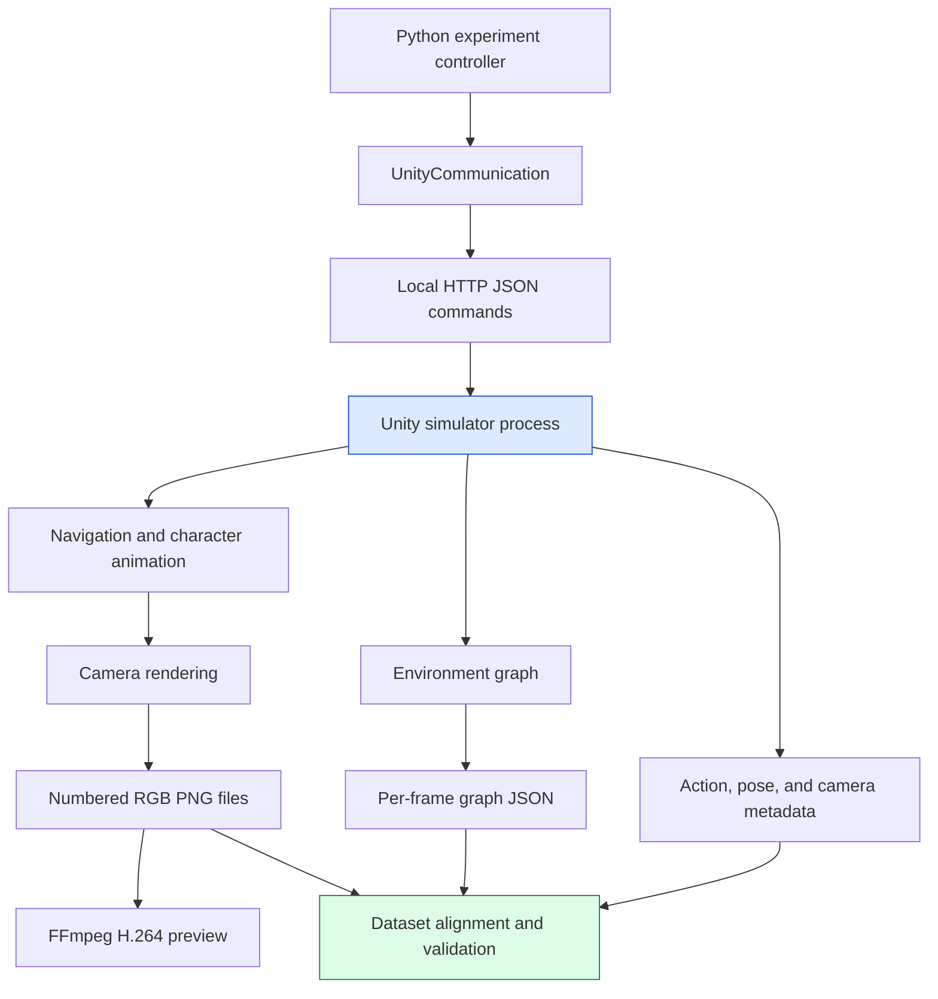
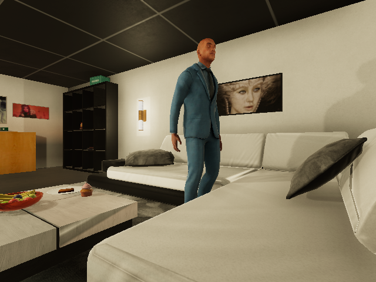
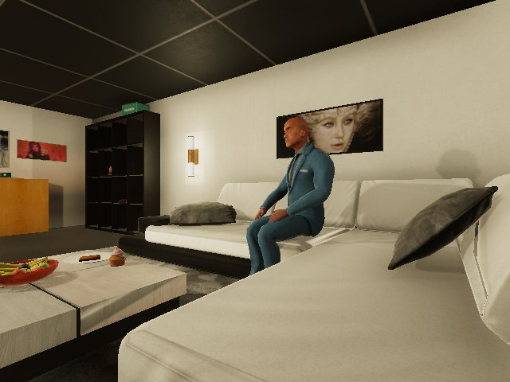
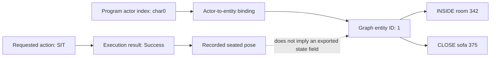
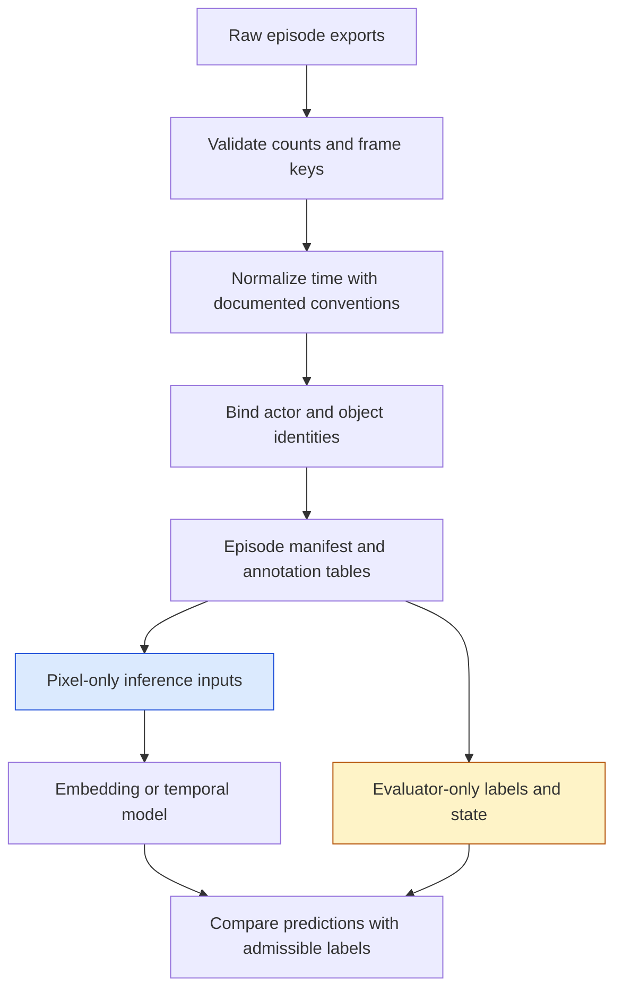

# VirtualHome-AIST: Native Apple Silicon Simulation and Video Ground Truth

VirtualHome-AIST now runs locally on the M1 Max and generates animated human activity together with machine-readable scene data. The first verified execution loaded an apartment, added a person, walked that person to a sofa, and performed a sitting action. It produced 61 RGB frames, 61 corresponding graph files, and a 6.1-second H.264 video. The simulator executable contains an ARM64 slice and runs on this Mac without requiring an Intel-only simulator installation.

The result is a working data-generation foundation for the Cosmos and video-embedding experiments. It gives us control over an action program and access to the simulation's internal outputs. It does not yet give us a validated action-segmentation dataset: frame conventions, action semantics, visibility, and reproducibility still need explicit contracts. Those distinctions are the most useful engineering findings of the installation.

> [!summary]
> - The local installation consists of an AIST Python checkout, a separate Unity application, and an isolated Python 3.11 environment.
> - The verified path is Python command → local HTTP request → Unity action execution → RGB and graph exports.
> - A successful action, a visible pose, and a graph state are different evidence sources. The first run already exposes differences between them.
> - The next step is a small dataset adapter with explicit frame alignment, object identity, provenance, and visibility semantics.

## 1. Why this project exists

A procedural-video system must recognize actions whose meaning depends on order and state. Searching for “person sits on a sofa” is a retrieval task. Identifying when walking ends and sitting begins is temporal segmentation. Determining whether a prerequisite occurred before another action is procedural reasoning. A useful experiment needs enough control and ground truth to evaluate these responsibilities independently.

Recording real footage is necessary for eventual transfer evaluation, but it is inconvenient for controlled counterfactuals. Repeating the same sequence with one skipped action, a different object, or a changed camera position requires additional filming and annotation. A simulator lets an experiment specify those changes as inputs, then collect the resulting visual and internal state outputs.

The intended use is therefore a generator of inspectable test episodes. The initial implementation does not train an agent to discover a policy. A Python program specifies actions, the simulator executes them, and a separate evaluator compares visual predictions with appropriately interpreted annotations. This keeps the first research question focused on video understanding.

The related ticket, `COSMOS-VIDEO-001`, proposes a progression from semantic retrieval through state recognition, temporal models, typed rules, and replay. VirtualHome-AIST supplies potential inputs to that program. No Qwen or Cosmos model was run as part of this installation, and the successful simulator test is not evidence of embedding quality.

## 2. Why AIST, and how it relates to VirtualHome

VirtualHome provides a programmatic interface for simulating household activities. Its executable programs refer to a character, an action, and a concrete object instance. The simulator resolves those instructions into navigation and animation while maintaining an environment representation.

VirtualHome-AIST is an extended fork based on VirtualHome 2.2. It adds actions, camera modes, per-frame JSON output, object bounding-box export, and notebooks for generating batches of recordings. These are additions to the simulator workflow rather than a separate model that runs after upstream VirtualHome. We therefore installed AIST directly instead of maintaining two environments. [AIST project documentation](https://github.com/aistairc/virtualhome_aist)

There are two relevant repositories. `virtualhome_aist` contains the Python interface and examples. `virtualhome_unity_aist` contains the Unity project and downloadable simulator releases. A checkout of the Python repository alone does not provide a running renderer. The installation must pair a Python interface with a compatible application binary. [AIST simulator releases](https://github.com/aistairc/virtualhome_unity_aist/releases)

This distinction also explains why a successful Python import is only an early check. The import proves that the client code and its dependencies load. It says nothing about whether the simulator can launch, initialize graphics, accept the protocol, execute an action, or export useful observations.

## 3. The installed system and its provenance

The installation lives under:

```text
/Users/manuel/code/wesen/2026-09-06--vision/
  output/virtualhome-install/
```

This location isolates the simulator experiment from the parent repository's application and documentation work. The parent repository ignores `output/`; the installation is local experimental state, not a committed application package. This report includes small evidence assets so its central findings remain inspectable inside the vault even if the local installation is later moved.

```text
virtualhome-install/
  .venv/                     isolated Python environment
  virtualhome-aist/           AIST source checkout
  simulator/                 extracted macOS application
  aist-release.json          official release metadata
  installation.json          source and archive provenance
  requirements-mac.txt       chosen dependency constraints
  requirements-lock.txt      resolved installed versions
  start-simulator.py         persistent interactive launcher
  notebook.sh                Jupyter launcher
  smoke_test.py              automated process/API/render check
  smoke-output/
    result.json              validation result
    actions.txt              executed program
    graph-before.json        scene before character insertion
    graph-after.json         scene after execution
    aist-smoke.mp4            encoded preview
    aist-smoke/0/             RGB, graph, pose, camera exports
```

The Python checkout was pinned by observation to revision `122d3b0aee04768d988e02929f6eeeb38f2f28a8`. The binary came from the official `Door_Modified_Build_2023_0404` release, whose macOS asset is named `Modified_Camera_Build_2023_0404_Mac.app.zip`. The archive contains 733,318,352 bytes. Its locally computed SHA-256 is preserved below as an integrity and provenance identifier; this is not a claim that the project published an independent checksum.

```text
1e5aa2fbf8467abec96d0498e2ac0a22d5b5901905df9bf984e39d3fee8fafca
```

The machine is an Apple M1 Max with 64 GB unified memory and 32 GPU cores. Inspection with `file` reported a universal executable containing `x86_64` and `arm64` architectures. The smoke test launched that application directly on the Mac. We did not need to build the Unity project from source or install the Unity Editor.

The Python environment uses CPython 3.11.4. The selected constraints include NumPy 1.26.4, OpenCV 4.11.0.86, NetworkX 2.8.8, and compatible Pillow, Requests, Plotly, Matplotlib, and JupyterLab versions. `uv pip check` reported that all 108 installed packages were compatible. This checks declared package dependencies; it does not prove every historical notebook still runs unchanged.

## 4. Architecture: a Python controller and a Unity process

The Python interface and the renderer run in different processes. `UnityCommunication` serializes commands as JSON and sends them over local HTTP. Unity owns the world, characters, navigation, animation, rendering, and export. Python owns experiment setup, program selection, output organization, and validation.



This architecture allows a controller to execute a known program and query the resulting world independently. It also makes failure localization practical. An import error belongs to the Python environment. A process exit before readiness belongs to simulator startup. A failed action response belongs to execution or scene constraints. Missing or misaligned outputs belong to recording and dataset conversion.

The first test used a dynamically selected local port. The interactive launcher defaults to port 18080 so notebooks can connect to a predictable endpoint. Both paths pass the port using the simulator's `-http-port=` argument.

### 4.1 Locate the executable from the bundle manifest

A macOS application is a directory bundle. Its external filename need not match the executable under `Contents/MacOS`. In this release, the app bundle has a long release-specific name while the executable is `VirtualHome`. The launcher reads `CFBundleExecutable` from `Contents/Info.plist` instead of constructing an executable path from the app name.

```python
# Essential logic from the local launcher.
app = next((installation / "simulator").glob("*.app"))
info = plistlib.loads((app / "Contents/Info.plist").read_bytes())
executable = app / "Contents/MacOS" / info["CFBundleExecutable"]
```

The extracted executable initially had mode `0644`. Restoring its execute bit was necessary for direct process launch. This was a filesystem-permission repair on the downloaded application, not a change to macOS security policy. No global Gatekeeper setting was disabled.

### 4.2 Readiness is an API condition

Starting a process does not mean it is ready to accept an experiment. Unity must initialize the application and its command handler. The smoke test polls an `idle` request with a short HTTP timeout, checks whether the process exited, and imposes an overall 120-second deadline.

```python
# Simplified startup protocol.
process = launch_simulator(executable, port, log_path)
deadline = monotonic() + 120

while monotonic() < deadline:
    if process.poll() is not None:
        raise StartupFailure(process.returncode)
    if idle_request_succeeds(port, timeout=2):
        break
    sleep(1)
else:
    raise StartupTimeout()
```

The distinction between the per-request timeout and the total deadline matters. A short request timeout allows startup to remain responsive while the renderer initializes. The overall deadline prevents an indefinitely stalled process from blocking the installation. Once ready, action execution uses a longer client timeout because rendering a complete activity takes more work than answering an idle request.

### 4.3 Process lifetime is explicit

The automated test owns the process it creates. A `finally` block terminates it, waits up to ten seconds, and escalates to killing that same child if it fails to exit. It does not discover and kill arbitrary Unity processes. The interactive launcher intentionally leaves the simulator running until its user stops it.

The current free-port selection briefly binds a socket and then releases it before launching Unity. That leaves a small race in which another process could claim the port. This is acceptable for a single installation test but should be replaced with retry-on-bind-failure or stronger coordination if multiple episode workers are introduced.

## 5. A concrete program and its execution trace

The program used for validation was:

```text
<char0> [Walk] <sofa> (375)
<char0> [Sit] <sofa> (375)
```

The actor token identifies the first controlled character. `Walk` and `Sit` name simulator actions. The class name describes the target category, while `375` identifies the target instance in this scene. The instance ID matters because a scene may contain multiple objects of the same class.

The test reset scene 0, fetched its environment graph, and added `Chars/Male1` in the living room. It selected a sofa from the returned graph, with a chair fallback if no sofa existed. This produced the concrete target above. The policy “choose the first sofa in the graph” is suitable for a smoke test; a dataset generator should record and deliberately select target instances rather than depend on incidental graph ordering.

```python
comm = UnityCommunication(port=str(port), timeout_wait=180)
assert comm.reset(0)
ok, before = comm.environment_graph()
assert ok
assert comm.add_character("Chars/Male1", initial_room="livingroom")

ok, message = comm.render_script(
    program,
    recording=True,
    output_folder=str(output_directory),
    file_name_prefix="aist-smoke",
    frame_rate=10,
    image_width=640,
    image_height=480,
    camera_mode=["AUTO"],
    save_pose_data=True,
    out_graph=True,
    per_frame=1,
)
```

The response was `True` with a per-character message of `Success`. That response establishes successful simulator execution under this API. The test then fetched the final graph and requested an image, while the recording outputs supplied the animation evidence.

```text
Scene ready: 454 nodes
Render: True {'0': {'message': 'Success'}}
```

The two images below come from the same recorded episode. Frame 30 shows the character standing near the sofa. Frame 60 shows the character seated. The visual inspection corroborates the intended action sequence without requiring the graph to contain a particular textual state label.





The short recording is included with the report:

![[virtualhome-aist-smoke.mp4]]

## 6. What the environment graph actually represents

The graph contains nodes and edges. Nodes identify scene entities and include a category, class name, prefab name, transform, bounding box, properties, and states. Edges describe relations between entity IDs. A consumer needs to preserve the distinction between a property's availability, a state value, and an inter-object relation.

The selected sofa node includes these fields:

```json
{
  "id": 375,
  "category": "Furniture",
  "class_name": "sofa",
  "prefab_name": "PRE_FUR_Sofa_01_02_02",
  "properties": ["SURFACES", "SITTABLE", "LIEABLE", "MOVABLE"],
  "states": []
}
```

`SITTABLE` is an affordance: it describes an action the object supports. It does not mean that someone is currently sitting on it. An empty `states` list similarly does not mean that the sofa is absent or the character failed to sit. It means that this export does not provide a value in that particular field for this node.

The initial graph contained 454 nodes and 930 edges. The final graph contained 455 nodes and 966 edges. The added node is the character. Its graph ID was 1, while the program referred to `<char0>`. Program actor indices and graph entity IDs are therefore separate identifiers; a dataset adapter must establish their mapping.

The final character node had an empty `states` list. Its exported relations included `INSIDE` and `CLOSE`, but no relation whose name contained `SIT`. This is a direct observation of this run, not a claim that no AIST configuration can express sitting state. It demonstrates why a downstream system must inspect actual exported semantics before treating every desired predicate as an existing graph field.



There is a second distinction in the bounding-box data. The sofa's graph bounding box uses three-component center and size values. That is spatial scene information, not a two-dimensional image rectangle. Although AIST advertises a 2D bounding-box export capability, this test did not validate that separate output. A consumer cannot label the graph's three-dimensional box as pixel coordinates.

## 7. Recording outputs and temporal alignment

The recording directory contained matching numbered RGB and graph files:

```text
Action_0000_0_normal.png
Action_0000_0_graph.json
...
Action_0060_0_normal.png
Action_0060_0_graph.json
```

It also contained `sceneInfo.json`, `ftaa_aist-smoke.txt`, `pd_aist-smoke.txt`, and `cd_aist-smoke.txt`. The scene metadata reported `frameRate: 10`. The pose file starts with a list of joints and then numeric frame rows. The camera file contains numeric camera data and ranges. Presence was inspected; the full pose and camera schemas have not yet been validated.

### 7.1 Pair by identity, not by directory iteration order

A directory's enumeration order is not a temporal ordering contract. Extract the numeric frame index from each filename and pair the RGB and graph assets by that key. Confirm that both modalities have the same index set and that the expected indices are contiguous.

```python
# Dataset-adapter pseudocode.
images = index_by_frame(rgb_paths)
graphs = index_by_frame(graph_paths)
require(images.keys() == graphs.keys())
require(sorted(images) == list(range(expected_frame_count)))

for frame_index in sorted(images):
    yield {
        "frame_index": frame_index,
        "presentation_time_s": frame_index / frame_rate,
        "image_path": images[frame_index],
        "graph_path": graphs[frame_index],
    }
```

Matching filenames establish a pairing convention. They do not by themselves prove whether a graph is captured before or after the corresponding rendered frame's state update. That capture-phase relationship should be verified with an observable transition or by inspecting the matching Unity export code before using the corpus for sub-frame or boundary-sensitive evaluation.

### 7.2 The action-range file reveals an unresolved endpoint convention

The actual action-range export was:

```text
0 WALK 0 32
1 SIT 33 61
```

The recorded images span indices 0 through 60. If both action endpoints were inclusive frame indices, the final endpoint 61 would refer to an image that does not exist. If all intervals were interpreted as half-open without adjustment, the first interval would omit index 32. The two lines therefore cannot safely be converted into training intervals by assuming either conventional interpretation without further investigation.

The appropriate immediate behavior is to preserve the raw export and flag the convention as unresolved. A production adapter should trace the exporter or use a dedicated known-boundary test, then define a documented mapping into half-open dataset intervals. Silently adding or subtracting one everywhere would hide the evidence rather than resolve it.

This matters because the long-term experiment concerns temporal order and duration. A single frame at ten FPS corresponds to 0.1 seconds of sampled time. Boundary errors can change the outcome of near-threshold rules even when a qualitative animation looks correct.

### 7.3 Presentation duration and endpoint timestamps differ

The encoded MP4 contains 61 frames at ten FPS, giving a duration of 6.1 seconds. Its frame presentation timestamps run from 0.0 through 6.0 seconds under the chosen constant-rate encoding, with the final frame occupying the remaining frame interval. The last frame timestamp is therefore not equal to the container duration.

This is an encoding-time statement. It does not measure wall-clock simulation throughput, and it does not independently establish the simulator's internal physics timestep. The installation recorded no reliable real-time-factor benchmark.

### 7.4 JSON encoding is a data contract

The per-frame JSON files include a UTF-8 byte-order mark. Reading them as ordinary UTF-8 and passing the resulting string to `json.loads` produced:

```text
JSONDecodeError: Unexpected UTF-8 BOM (decode using utf-8-sig)
```

The correct reader for these files is:

```python
graph = json.loads(path.read_text(encoding="utf-8-sig"))
```

All 61 per-frame graph files parsed successfully with that encoding. Keeping this behavior in the loader is preferable to manually editing every generated file. It also preserves the originals for investigating exporter behavior.

## 8. Constructing and verifying the video artifact

The renderer emitted a numbered PNG sequence. FFmpeg converted it into a conventional MP4 suitable for inspection and downstream video ingestion:

```sh
ffmpeg -framerate 10 -start_number 0 \
  -i smoke-output/aist-smoke/0/Action_%04d_0_normal.png \
  -c:v libx264 -pix_fmt yuv420p -movflags +faststart \
  smoke-output/aist-smoke.mp4
```

The four-digit pattern expresses the filename contract. The input frame rate establishes presentation timing. H.264 and `yuv420p` make the preview broadly usable. The PNG sequence remains the primary visual export because encoding introduces compression and may change details relevant to pixel-level analysis.

`ffprobe` reported H.264, 640 × 480 pixels, ten FPS, 61 frames, and 6.100000 seconds. Visual inspection of the recorded frames confirmed that the character and intended pose were visible. This combines a metadata check with a content check: either one alone would miss important failure modes.

For future datasets, run continuity and frame-count validation before encoding. An image-sequence reader may stop when a numbered frame is missing. A playable MP4 can therefore be shorter than the intended episode even when the encoder exits successfully.

## 9. Compatibility work and why the fixes were local

The upstream requirements file pins several packages to 2019-era versions, including NumPy 1.17.3 and OpenCV 4.1.2.30. Installing those versions unchanged on modern Apple Silicon would combine old Python APIs with package builds predating this platform. The local environment instead uses explicit compatible constraints and records the resolved versions in a lock snapshot.

Only one Python source file needed modification for the verified path. Two camera helpers used `collections.Iterable`, which is unavailable in the chosen Python version. The fix imports `collections.abc` and uses `collections.abc.Iterable`. It does not monkey-patch the standard library or alter unrelated interpreter environments.

```diff
-import collections
+import collections.abc

-collections.Iterable
+collections.abc.Iterable
```

The AIST checkout is made importable through a `.pth` entry in the isolated environment's site-packages. This matches the repository-style `simulation.unity_simulator` imports used by the project. It should not be confused with a newly packaged and published `virtualhome` distribution.

The direct launcher also avoids assumptions in the historical launcher about app naming, inherited environment, and argument construction. It resolves the executable from the app manifest and passes the log-file path as its own argument. These choices are visible in `start-simulator.py` and `smoke_test.py`, so another developer can inspect exactly how the application is invoked.

The large archive initially downloaded slowly. A local downloader resumed the already acquired prefix and fetched disjoint byte ranges concurrently, checking each part's expected length before concatenation. That script is a one-off installation aid, not a general downloader: it contains the source URL, expected size, and the inspected PID of the original download. Future automation should replace those incident-specific values with a reusable resumable transfer implementation.

## 10. What the smoke test proves and what it leaves open

The completed test validates an end-to-end path through the actual installation. The Python client imported, Unity became ready, scene 0 loaded, a character was added, the selected actions succeeded, visual recording produced readable images, and graph recording produced parseable JSON. The test process then shut down.

| Capability | Evidence | Scope |
|---|---|---|
| Native Mac executable | Universal binary with ARM64 slice; successful local launch | This downloaded release on this M1 Max. |
| Scene graph access | Initial 454 nodes / 930 edges | Scene 0 in the tested reset. |
| Character/action execution | WALK and SIT returned success | One actor and one selected sofa. |
| RGB recording | 61 inspected/count-checked PNGs | AUTO camera, 640 × 480, ten FPS. |
| Per-frame graph output | 61 matching files parsed with BOM handling | Content semantics still need a dataset adapter. |
| Video encoding | ffprobe metadata and visual inspection | A 6.1-second preview, not a throughput result. |
| Python dependency compatibility | `uv pip check` passed | Declared dependencies, not all notebook behaviors. |

Several boundaries remain untested. Additional AIST actions and camera modes have not been exercised. The 2D-box capability has not been verified. The action-range endpoint convention remains unresolved. We have not established exact graph-versus-image capture phase, repeated-run determinism, multi-agent behavior, or synthetic-to-real model transfer.

There are also limits in the current smoke-test code. It uses assertions for several checks, so it must not be run with Python optimization that disables them. It writes to a fixed output directory without clearing prior exports. Repeated runs of different lengths could leave stale files that inflate counts. A production episode runner should use a unique run directory and explicit exceptions, validate the new artifacts, and atomically mark the run complete.

The initial character placement specifies a room but not a fixed pose. The render call does not establish a fully controlled random seed policy. Consequently, this run is replayable as an experiment procedure but has not been shown to be bitwise deterministic. A reproducibility claim requires repeated trials with controlled initialization and comparisons of their exported assets.

## 11. Turning exports into a procedural-video dataset

The next engineering artifact should be a normalized episode bundle. It should preserve raw simulator files and add a manifest that explicitly states which fields are derived, which are native exports, and which remain unresolved. It should never present an inferred label as if it were a direct simulator field.

A useful proposed manifest is:

```yaml
episode_id: aist-walk-sit-0001
simulator_release: Door_Modified_Build_2023_0404
python_revision: 122d3b0aee04768d988e02929f6eeeb38f2f28a8
scene_index: 0
recording:
  fps: 10
  width: 640
  height: 480
  camera_mode: AUTO
  frame_count: 61
bindings:
  char0: 1
  target_sofa: 375
annotations:
  graph_encoding: utf-8-sig
  action_endpoint_convention: unresolved
  graph_capture_phase: unverified
```

The adapter should make three kinds of evidence independently accessible. The program states what was requested. The execution result states whether the simulator accepted and completed the request. The exports describe visual and internal results. None of these should automatically replace the others when a discrepancy appears.



The separation between inference inputs and evaluator labels is essential. Feeding the action program, object-state truth, or a label-bearing filename into a vision model would change the experiment. The model should receive the modalities authorized by the research question; gold annotations remain available for evaluation and explicitly labeled oracle diagnostics.

Visibility is a further annotation dimension. An object can exist in the graph while being outside the camera view or occluded by another object. A state that is exact internally can still be unknowable from the supplied pixels. Mark such cases as unavailable or ambiguous for the visual task instead of assuming that simulator truth is always observable truth.

## 12. The next experimental sequence

First resolve frame and label semantics on the smallest possible corpus. Construct an episode with an observable state change, inspect the exporter or repeat controlled traces, and document the mapping from raw ranges to half-open intervals. Validate actor bindings and camera identity at the same time. This prevents later model experiments from optimizing against inconsistent labels.

Second generate a few carefully chosen activity pairs. A repeated action, a changed target, or an omitted action can test the intended reasoning layer. Check that the simulator can actually execute the requested variant: navigation and action preconditions may reject an invalid sequence or insert behavior needed to reach a target. A changed program is not automatically a successful procedural counterfactual.

Third establish a retrieval baseline over the resulting clips. Record the encoder, sampling configuration, and exact query set. Then compare state classification and temporal segmentation on the same episode splits. Keep variations of one scenario together in a split so nearly identical footage does not appear in both training and testing.

Finally, evaluate a small untouched set of staged real videos. A good result inside one rendered environment may depend on camera cuts, avatar motion, textures, or scene layout. Transfer should be measured rather than inferred from the quality of the renderer.

Concrete next tasks are:

- Resolve the `ftaa` endpoint convention and graph/image capture phase.
- Make the episode runner create unique output directories and explicit manifests.
- Record exact actor initialization, object bindings, camera settings, and seed policy.
- Validate at least one state-changing action and one alternative camera mode.
- Add visibility-aware annotations and a grouped train/development/test split.
- Run the first embedding experiment only after these data contracts are stable.

## 13. Reproducing the current local workflow

From the installation directory, start the simulator:

```sh
.venv/bin/python start-simulator.py --port 18080
```

In another terminal, start the notebooks:

```sh
./notebook.sh
```

Existing notebook cells may assume port 8080 or a Windows executable path. Connect to the running Mac application explicitly:

```python
from simulation.unity_simulator import UnityCommunication
comm = UnityCommunication(port="18080")
comm.reset(0)
ok, graph = comm.environment_graph()
print(ok, len(graph["nodes"]))
```

To rerun the automated experiment, use `.venv/bin/python smoke_test.py`. It creates and stops its own simulator process on a free port. Preserve or move an existing `smoke-output/` directory before a new run if the previous artifacts matter, and do not use `python -O` because the current test uses assertions.

These commands reproduce the workflow on the installed machine. Rebuilding elsewhere also requires the official simulator asset, the source revision and local patch, the environment lock snapshot, and a supported graphics session. The current installation has not been packaged as a portable release.

## 14. Source map and durable evidence

The local development playbook is `/Users/manuel/code/wesen/2026-09-06--vision/docs/playbook/virtualhome-video-generation.md`. It provides a persistent simulator launch command and a complete recording recipe with unique episode directories, actor bindings, atomic manifests, graph validation, and FFmpeg encoding. Its Python syntax and rendering API arguments were checked against the installed client; the expanded recipe has not yet been executed end to end. The successful smoke test remains the measured baseline.

The installation root is `/Users/manuel/code/wesen/2026-09-06--vision/output/virtualhome-install`. Within it, the most useful entry points are:

| File | What to inspect |
|---|---|
| `start-simulator.py` | Bundle resolution, default port, log path, process execution. |
| `smoke_test.py` | Readiness loop, reset, actor insertion, program construction, rendering, cleanup. |
| `virtualhome-aist/simulation/unity_simulator/comm_unity.py` | HTTP payloads and the actual client method signatures. |
| `virtualhome-aist/simulation/unity_simulator/communication.py` | Upstream process-launch behavior for comparison. |
| `requirements-mac.txt` | Intentional compatibility constraints. |
| `requirements-lock.txt` | Installed dependency snapshot. |
| `installation.json` | Source revision, binary release, archive hash, architecture. |
| `smoke-output/result.json` | Observed execution and export counts. |
| `smoke-output/aist-smoke/0/ftaa_aist-smoke.txt` | Raw action ranges that require interpretation. |

The wider project analysis lives in the main repository under `ttmp/2026/09/06/COSMOS-VIDEO-001--cosmos-and-video-embeddings-a-procedural-video-lab-on-apple-silicon/`. Its `design-doc/01-source-analysis-and-mac-project-roadmap.md` sets the research sequence, and `design-doc/02-intern-guide-to-the-procedural-video-workbench.md` describes the proposed embedding, temporal-state, rule, and replay system. Those documents describe a broader design; the concrete implementation examined in this report is the simulator installation and smoke test.

Small evidence files are archived beside this note: the two displayed PNGs, the MP4 preview, installation metadata, the result record, the raw action ranges, and the dependency lock snapshot. Large simulator binaries, downloaded repositories, and bulk graph dumps remain outside the vault.

Primary implementation references:

- [VirtualHome-AIST project](https://github.com/aistairc/virtualhome_aist)
- [Client API at the inspected source revision](https://github.com/aistairc/virtualhome_aist/blob/122d3b0aee04768d988e02929f6eeeb38f2f28a8/simulation/unity_simulator/comm_unity.py)
- [Simulator release used for this installation](https://github.com/aistairc/virtualhome_unity_aist/releases/tag/Door_Modified_Build_2023_0404)
- [Original VirtualHome project](https://github.com/StanfordHCI/virtualhome)

The working rule for the next phase is to validate each exported quantity before promoting it to ground truth. The simulator has already made the experiment executable. A precise dataset contract will make its results interpretable.
