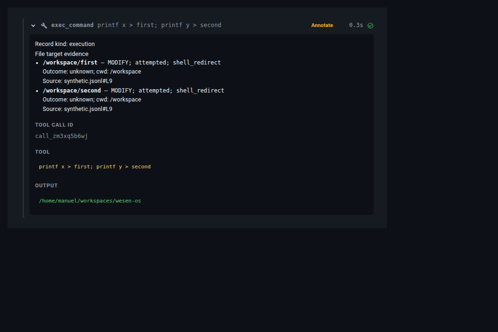
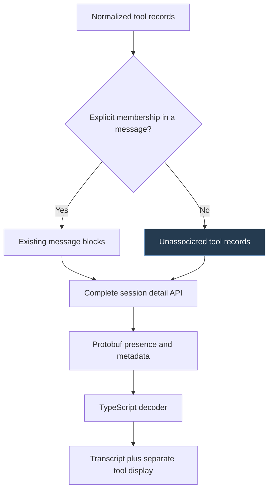
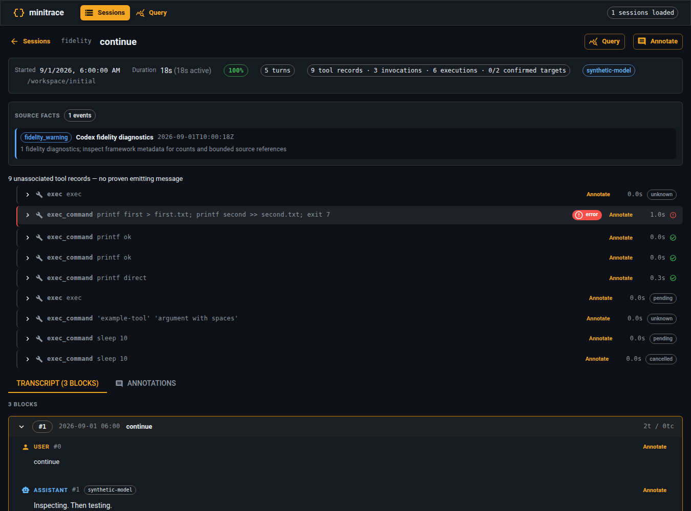

# Codex Transcript Fidelity: Evidence-Preserving Normalization in go-minitrace

A transcript converter can produce valid JSON, publish a complete archive, and still discard the events needed to explain what an agent did. That was the starting point for CODEX-FIDELITY-001. Three local Codex sessions contained hundreds of conversational messages and thousands of command executions, yet their converted archives contained no turns, no normalized commands, and no exit codes. The retained tool records reported success even though the native logs included 155 failed executions.

The repair required more than recognizing another event name. It required separating entities that the previous representation conflated: model-issued calls, orchestration wrappers, executed processes, file targets, observed file effects, and conversational messages. Each entity has its own identity and evidentiary requirements. This report explains the resulting algorithms, schema changes, consumer behavior, and validation strategy, including a final API defect that remained invisible to the SQL audits.

> [!summary]
> - Native event identity determines which observations describe the same operation; matching text does not.
> - Unknown outcomes and unknown relationships are explicit data, not missing values to replace with success or a nearby turn.
> - A command outcome is not an outcome for every file target mentioned in that command.
> - Fidelity must survive conversion, SQLite materialization, protobuf, TypeScript decoding, and the actual user interface.

The ticket is complete in the source revision recorded above. This describes the implemented checkout and its acceptance evidence; it does not assert that the branch has been merged or released.

## 1. Define the claims before defining the records

Transcript analysis asks questions at different levels. “The model requested a shell command,” “a process ran,” “the process exited successfully,” and “a particular file was modified” are not equivalent statements. A useful normalized representation must distinguish them before it can count them accurately.

Consider a model-issued JavaScript tool call containing two subprocess requests:

```javascript
const results = await Promise.all([
  tools.exec_command({ cmd: "printf first > first.txt; exit 7" }),
  tools.exec_command({ cmd: "printf second > second.txt" }),
]);
text(results);
```

This is an illustrative example, not a command executed during analysis. Its source establishes that the model submitted orchestration code. The text alone does not establish which requests ran, whether either finished, or whether either file changed. The distinction becomes decisive when the code contains conditional branches, quoted history, or error handling that converts a rejected child operation into a successfully returned wrapper result.

The implementation therefore distinguishes four normalized record kinds:

| Record kind | What the record represents | What it does not establish by itself |
|---|---|---|
| `tool_call` | An ordinary recorded tool invocation | A separately observed process or file effect |
| `orchestration` | A wrapper invocation such as Codex `exec` | Execution of every statement in its source |
| `execution` | Authoritative native command-execution evidence | A proven parent wrapper or success of every shell statement |
| `file_change` | A native file-change operation | Independent repository authorship or prior filesystem state outside the observation |

These categories answer different queries. Counting all four gives the number of normalized tool records. Counting `execution` gives observed command executions. Counting model invocations requires recognizing that one direct invocation can also be represented by an enriched execution record. Counting file evidence requires a separate table because one operation can target multiple paths.

The governing rule is simple: normalization may reorganize evidence, but it must not strengthen a claim beyond what its source establishes.

## 2. Reproduce the failure against immutable inputs

The baseline was measured with a binary built from source revision `28cd1c2ad215d1f31d54abd45eb439588c8aae12`, rather than inferred from an installed binary or an earlier investigation on another machine. Six local sources were selected: three Codex CLI 0.153.3 sessions declaring paginated history and three legacy-mode controls.

Each source was fingerprinted before conversion. The final audit used fresh output directories and checked those fingerprints again. This matters because an apparent improvement is not a controlled comparison if the source transcript changed between runs.

The affected sources are abbreviated here; the ticket retains their complete identities and hashes.

| Source | Native command executions | Native nonzero exits | Turns before | Turns after | Invalid tool-turn links before |
|---|---:|---:|---:|---:|---:|
| A: `01a06de0…` | 886 | 77 | 0 | 252 | 629 |
| B: `01a06de6-34fd…` | 1,104 | 60 | 0 | 305 | 927 |
| C: `01a06dea…` | 306 | 18 | 0 | 99 | 275 |

All three originally had zero normalized commands and exit codes. Typed output arrays were also being stringified into Go formatting such as `map[text:... type:input_text]`, rather than decoded as content blocks. The baseline SQL substring diagnostic found 622, 878, and 270 such outputs respectively. These are diagnostic counts, not a census of every array-valued native output.

The controls were useful but did not establish that legacy conversion was perfect. Their turn counts increased from 573, 640, and 178 to 630, 701, and 193 after the broader message-recovery changes. A control can help isolate a format-specific defect while still containing other recoverable omissions.

A conversion receipt already reported successful publication at baseline. Archive validation also exited successfully. Neither result contradicted the missing messages: publication integrity and semantic fidelity were different properties, and the original validation covered primarily the former.

## 3. Recover messages without removing genuine repetition

### 3.1 Native turns and conversational messages are different identities

A native Codex turn identifier describes source context. A normalized message index identifies one entry in the converted conversation. A single native turn can contain multiple messages and tool events, so a native turn identifier cannot be substituted directly for an emitting message index.

Paginated logs also contain overlapping message representations. A message may appear as a completed native `UserMessage` or `AgentMessage` item and as a response message. Retaining both blindly duplicates the conversation. Deduplicating by text alone loses genuine repeated instructions such as “continue.”

The implementation in `pkg/adapters/codex/messages.go` first reconciles nonempty native message identities within role and native-turn context. It permits different-ID reconciliation only under a much narrower mirror rule: adjacent source records, complementary representations, the same nonempty native turn, the same role, and exactly matching native text.

A condensed description of the algorithm is:

```text
for each source record in order:
    message = decode a supported message representation
    if no message:
        continue

    existing = lookup(role, native_turn_id, native_message_id)

    if no identity match:
        existing = previous message only if:
            source records are adjacent
            native turn is known and equal
            roles and exact native text agree
            representations are complementary

    if existing:
        retain every source reference
        diagnose conflicting same-identity text
        prefer the response representation for display
    else:
        retain a distinct normalized message
```

This is explanatory pseudocode; the implementation also preserves block kinds, image signals, source ordinals, and framework-specific metadata.

### 3.2 Display formatting must not redefine identity

Joining message blocks is not a purely cosmetic operation when text is also used to recognize mirrors. Suppose a source represents one message as two text blocks, while its legacy mirror stores the same native text as one flat string. Adding a newline between blocks can make the display clearer while changing the string used for comparison.

The converter separates those concerns. It retains the exact native concatenation for content identity and independently produces readable display content. It does not normalize arbitrary whitespace to force a match. That prevents a formatting decision from becoming an identity decision.

Conflicting content under the same identity is diagnosed rather than hidden. Reconciliation retains the source references even when it selects one representation for display, so a reviewer can recover the underlying observations.

### 3.3 Unknown emitting messages remain unknown

The previous archives retained tools with non-null references to turns that did not exist. Recovering messages fixes part of that defect, but assigning every tool to the nearest recovered assistant message would introduce a different error.

The new invariant is stronger:

```text
If emitting_turn_index is non-null:
    the referenced turn exists
    the turn is an assistant message
    the turn reciprocally lists the tool ID
    explicit source linkage justifies the association
Otherwise:
    emitting_turn_index remains null
    native turn context remains available separately
```

A later final answer does not become the emitter merely because it is nearby. This decision initially makes the conversation look less connected, but it preserves the distinction between an unknown relationship and a known one. The API/UI consequences of that choice become important in Section 9.

## 4. Reconcile native execution lifecycles, not JavaScript text

### 4.1 Select authoritative outer records

The new execution collector accepts native lifecycle records whose outer type is `event_msg`, whose payload is `item_started` or `item_completed`, and whose item is `CommandExecution`. It does not recursively search message text, tool arguments, or output strings for similar JSON.

A simplified native event has this shape:

```json
{
  "type": "event_msg",
  "payload": {
    "type": "item_completed",
    "turn_id": "turn-1",
    "item": {
      "type": "CommandExecution",
      "id": "execution-1",
      "command": ["/bin/sh", "-lc", "printf first > first.txt; exit 7"],
      "cwd": "file:///workspace/actual",
      "status": "completed",
      "exit_code": 7
    }
  }
}
```

The source event establishes an observed command execution and its numeric outcome. The same JSON serialized inside a user message establishes only that the message contains quoted text. Keeping the record-selection rule at the outer event boundary is what prevents quoted or guardian-provided history from becoming new execution evidence.

No historical command or JavaScript is evaluated during conversion or validation.

### 4.2 Lifecycle duplicates and repeated commands require opposite decisions

Two notifications with the same native execution identity usually describe one operation. Two different identities carrying the same command text describe two operations. A converter that deduplicates on command text cannot satisfy both cases.

`collectCodexExecutions` groups observations by native identity and retains lifecycle source references. `codexExecution.merge` accumulates command arguments, cwd, streams, lifecycle timing, exit evidence, and explicit relationship fields. Replayed starts do not revert completed operations to pending. Contradictory authoritative fields produce diagnostics and uncertainty rather than a last-write-wins success claim.

For missing identities, source-line-based normalized identities are necessary to keep records addressable. Those fallback identities use a distinct reconciliation namespace from literal native IDs. Otherwise, a real native ID such as `anonymous-line-1` could accidentally collide with the converter's fallback for line 1. The final representation does not label a synthesized fallback as a genuine native identity.

### 4.3 Explicit linkage still needs a cardinality check

A direct model invocation and a native execution may be two observations of the same operation. When an explicit native `call_id` identifies an existing `exec_command`, enriching the existing record avoids counting the mirrored operation twice.

However, an explicit reference does not automatically imply a one-to-one relationship. The implementation found a case that a simpler merge algorithm would mishandle: two distinct native executions can reference the same original invocation. Repeatedly replacing that invocation's fields loses the first execution.

Enrichment therefore requires both identity and cardinality:

```text
enrich a response invocation only when:
    exactly one original invocation has the referenced ID
    exactly one native execution references that invocation
    the target is an original invocation, not a synthesized execution
    the target is a direct exec_command
otherwise:
    preserve separate execution records and their explicit references
```

This distinction also explains why parentage is not guessed from shared turns or timestamps. A native reference is retained as evidence about a relationship; the converter still has to determine what relationship the available fields actually establish.

### 4.4 Preserve argv separately from a display command

For recognized shell executables with `-c` or `-lc`, the script becomes the normalized `command`. The original argv remains in provenance. For other executables, the converter preserves argv and produces a documented quoted display representation rather than pretending the display string was itself a shell script.

File-URI cwd values are decoded. Relative file targets use explicit tool/execution cwd, not the final session cwd. Path resolution is lexical: it does not claim filesystem or symlink canonicalization.

## 5. Model outcomes as evidence, not a default Boolean

A Boolean alone cannot distinguish “failed” from “not known to have succeeded.” That distinction is central to partial transcripts, pending processes, cancellations, and wrapper outputs.

The shared Go schema now uses `*bool` for success together with an explicit status:

| Status | `success` | Meaning |
|---|---|---|
| `unknown` | `null` | The available evidence does not establish a binary result |
| `pending` | `null` | An operation is observed without a known terminal result |
| `cancelled` | `null` | Cancellation is observed without a binary result |
| `succeeded` | `true` | Known successful outcome |
| `failed` | `false` | Known failed outcome |

The implementation centralizes known-outcome assignment. The essential method in `pkg/minitrace/outcome.go` is:

```go
func (output *ToolCallOutput) SetSuccess(success bool) {
    output.Success = &success
    output.Status = ToolOutcomeFailed
    if success {
        output.Status = ToolOutcomeSucceeded
    }
}
```

`OutcomeStatus()` gives a non-null Boolean precedence when binary evidence exists. Without it, pending and cancelled retain their lifecycle meaning; a bare success/completion-style label does not manufacture success. `Failed()` requires a non-null false value. Consequently, SQL `success = 0` counts known failures without silently including unknown outcomes.

Conflict handling is not ordinary last-write-wins assignment. If one result says exit 0 and another says exit 7 for the same operation, repeating the first result later must not erase the conflict. The response-output and legacy terminal reconcilers retain a conflict flag. This is particularly important when output notifications precede their invocation: retaining only the last pending output would discard the contradictory evidence before reconciliation began.

The nullable representation affected other adapters, database insertion, event severity, protobuf presence, TypeScript decoding, and badges. Known outcomes in existing adapters retained their meaning. Unknown values render neutrally rather than acquiring a failure icon merely because they are falsey in JavaScript.

## 6. Decode typed output before extracting metadata or truncating

The original malformed output came from treating an arbitrary decoded value as a printable Go value. That preserves neither the source representation nor a useful readable result. A content array is a typed structure and must be decoded as one.

The new sequence is:


Text blocks receive explicit display boundaries. Image blocks become image signals/placeholders, not duplicated base64 content. Unsupported shapes receive diagnostics. Metadata extraction precedes truncation so an exit code near the end of a long result does not disappear merely because the UI only needs a preview.

Recognized transport contexts include output/metadata envelopes, chunk envelopes, and fulfilled wrapper values that contain a recognized envelope. The parser also recognizes renderer-style metadata only when an explicit output boundary is present. Arbitrary JSON-looking stdout is otherwise preserved.

One especially important separation occurs for native execution streams: authoritative stdout is stored directly and is not reparsed as a tool transport envelope. A program is allowed to print JSON containing an `exit_code` key. That printed key must not replace the native execution's actual exit code.

Multiple child envelopes remain per-block evidence. Selecting one child's code as the result of an `exec` wrapper would create a relationship that the output ordering does not prove. The converter therefore preserves child result metadata without promoting it to wrapper success.

The final API exposes `full_reference`, `full_bytes`, and `full_hash`, in addition to the bounded result. The reference identifies native source content; the byte count and hash describe the full pre-truncation result representation. Recovering or auditing a large output does not require embedding its entire body in every downstream view.

## 7. Give file targets their own evidence and outcomes

### 7.1 A target is not necessarily an observed effect

A scalar `file_path` cannot describe a patch that adds one file, modifies another, and deletes a third. More importantly, attaching the tool's success flag to every path makes a claim about file effects that the tool outcome may not support.

The new `FileTarget` structure records the target and the strength of the observation:

```go
type FileTarget struct {
    Path            string
    NativePath      string
    OperationType   string
    EvidenceKind    string
    Status          string
    Success         *bool
    CWD             string
    Resolved        bool
    SourceReference string
}
```

This excerpt omits JSON tags but preserves the implemented fields. `input.file_targets` is the complete target list. The scalar path is only a first-target convenience.

Direct patch headers and supported literal shell redirects establish attempted targets. Here, “attempted” is deliberately conservative: it identifies a structurally expressed target in a recorded request or command, not proof that every statement reached its redirection at runtime. A zero exit for the whole shell script cannot confirm each target.

Native completed `FileChange` records provide a different kind of evidence. Their structured change maps describe applied effects, so their targets can be confirmed. Failed or cancelled grouped changes do not establish that every individual target failed or succeeded; those targets remain unconfirmed.

### 7.2 Parse a bounded grammar, not arbitrary source text

The shell target extractor accepts a deliberately narrow subset: straight-line words, quoting, escaping, statement boundaries, comments, and literal `<`, `>`, and `>>` redirections. It rejects unsupported control flow, expansion, pipelines, heredocs, process substitutions, descriptor duplication, and cwd-changing or evaluation constructs before accepting targets from the script.

The choice is intentionally conservative. A general-purpose shell interpreter would be the wrong dependency for historical analysis, because conversion must never execute the transcript. A text search for `>` would be incorrect for a different reason: it would match quoted strings and heredoc bodies.

The synthetic tests distinguish cases such as:

```sh
printf 'quoted > not-a-path' > real
```

and:

```sh
if false; then
    printf x > never
fi
```

The first has one supported literal target. The second has unsupported control flow and yields diagnostics instead of an inferred target. Similarly, a search operand in `rg 'needle' search-root` is not recorded as a read merely because it is path-shaped.

Analysis is bounded to 256 KiB for a shell script and 1 MiB for a patch. Unsupported or over-limit input does not produce a clean-looking result with guessed targets.

### 7.3 File changes have lifecycle identity and content conflicts too

Native file-change maps include operations such as add, update, delete, and an optional move destination. The local baseline contained 990 map entries; five moves required an additional destination target each, producing 995 normalized native targets.

Repeated native notifications reconcile by file-change identity. The late hardening step hashed the complete change payload, not just its path and operation. Two notifications can name the same path, operation, and completed status while containing different file contents. Treating them as identical would discard a material conflict.

The converter retains payload fingerprints and source references rather than duplicating private diffs. Conflicts preserve the target union as unconfirmed attempts, and subsequent replay does not restore a confident success claim.



The screenshot uses synthetic data. The process has a success indication, while each target independently says `attempted` and `Outcome: unknown`. That is the intended representation, not an inconsistency to remove.

### 7.4 Distinguish an absent target model from an empty result

The schema must also preserve existing non-Codex behavior. A nil target list can indicate an older scalar-only representation. A non-nil empty list means the adapter explicitly found no structural targets and must not trigger scalar or argument-string fallback.

`EffectiveFileTargets()` implements this distinction. Older scalar reports are labeled `legacy_scalar` and `reported`; explicit structural lists use their own outcomes. Codex file-history excludes scalar-only legacy evidence until those archives are reconverted. This prevents old unsafe inference from re-entering the new history through a fallback path.

## 8. Count records, invocations, executions, and targets separately

The normalized SQLite schema advanced to v5. `tool_calls` exposes `record_kind`; `files` contains one row per target, including target ordinal, evidence kind/status, independent success, cwd, resolution, native path, and source reference. Session and metrics tables expose activity counters derived from actual tool records.

For the implemented record kinds, the partition is:

```text
tool_call_count
  = tool_call_record_count
  + orchestration_count
  + execution_record_count
  + file_change_count
```

`model_invocation_count` is not another partition member. It counts ordinary and orchestration invocations, plus direct invocations explicitly enriched with one-to-one execution evidence. `file_touch_count` counts target evidence rows, not unique paths. `confirmed_file_target_count` counts confirmed successful target effects.

The final values for source A make the distinction concrete:

| Metric | Value |
|---|---:|
| Ordinary records | 7 |
| Orchestration records | 622 |
| Execution records | 886 |
| Native file-change records | 296 |
| Total tool records | 1,811 |
| Model invocations | 629 |
| File target rows | 667 |
| Confirmed native targets | 666 |

Calling all 1,811 records “model tool calls” would be incorrect. Calling all 667 target rows “confirmed writes” would also be incorrect.

An analyst can now request the relevant evidence directly:

```sql
SELECT
    f.session_id,
    f.path,
    f.operation_type,
    f.evidence_kind,
    f.evidence_status,
    f.success,
    f.source_reference
FROM files AS f
JOIN tool_calls AS tc
  ON tc.session_id = f.session_id
 AND tc.tool_call_id = f.tool_call_id
WHERE tc.record_kind = 'file_change'
  AND f.evidence_status = 'confirmed'
  AND f.success = 1
ORDER BY f.session_id, tc.timestamp, f.target_ordinal;
```

This query identifies confirmed native effects. It does not establish independent authorship, deduplicate repeated changes to a path, or prove that the current repository still contains the resulting content.

File-history and file presets now use structural Codex rows rather than scanning wrapper arguments. File-activity includes all targets instead of only the scalar convenience path. Ticket-timeline command matches are explicitly candidates because a matched subcommand can still occur inside conditional or quoted shell text. Context-window preserves its message-range semantics and does not invent associations for tools whose emitters are unknown.

## 9. An API can lose valid records without returning an error

The final smoke exposed the most consequential downstream defect. The normalized archives and SQLite tables contained the recovered execution records, but the transcript API assembled its tool display through conversational blocks. Most recovered Codex tools had no proven emitting message, so they belonged to no turn's tool list.

An affected session returned 55 blocks and zero turn-associated tool calls. Its metrics still reported the complete tool count. The API response was valid, and its numbers were individually plausible, but its presentation omitted the records those numbers counted.

The wrong repair would have been to attach the tools to nearby messages. Instead, the complete session detail gained `unassociated_tool_calls`.



The frontend switched from combining summary and block-only responses to requesting complete detail. Unassociated records appear under an explicit “no proven emitting message” heading, with batches of 50 rendered on demand. The display has its own bounded scroll region so a large tool list does not compress the conversation.

The final API audit compared record counts rather than merely checking HTTP status. Across the six local sessions and the synthetic fixture, every normalized tool record appeared either in a message or in the separate collection. Native execution provenance survived the same path.



The synthetic session in this screenshot has nine normalized records but only three model invocations and six executions. Unknown, pending, cancelled, successful, and failed outcomes remain visually distinct. The transcript is not assigned artificial tool membership to make the display more convenient.

### 9.1 Null can be corrupted after correct serialization

A smaller consumer bug illustrates the same cross-layer risk. File-history selected the preceding user instruction by comparing turn indexes. JavaScript coerced a null emitting index during comparison, allowing it to select turn zero. A correct SQL null had become a false conversational relationship after decoding.

The repair was an explicit null guard. Another inferred field, `created_before_visible_history`, became unknown for structural Codex history: a `MODIFY` target classification alone does not prove the file existed before the observed history.

These failures were not parser errors. They were unsupported claims introduced by consumers of otherwise valid normalized data.

## 10. Validate semantic invariants, not only successful commands

The final acceptance combined three forms of evidence because each answers a different question.

**Synthetic regressions** isolate edge cases with known expected results: repeated messages, complementary mirrors, missing IDs, lifecycle replay, same-command distinct IDs, early output, conflicting exits, image/text blocks, truncation, false branches, quoted history, multi-target patches, moves, and native content conflicts. They are safe to commit because they contain no private transcript bodies.

**Independent native inventories** count and compare outer source events without using the normalization implementation to produce their expected results. Execution identity, argv, output, outcomes, file-change targets, and source references are checked against fresh converted archives. Reusing the converter as its own expected-value generator would not establish fidelity.

**Cross-layer smoke tests** exercise the actual database, CLI, protobuf/TypeScript decoder, HTTP API, and production browser. They catch omissions and coercions that a parser-level test cannot see.

The final observed results were:

| Acceptance property | Result |
|---|---|
| Baseline source fingerprints | All six unchanged |
| Native command executions | 2,296 accounted for |
| Native nonzero execution exits | 155 accounted for |
| Native file-change events | 472 accounted for |
| Confirmed native targets | 995 accounted for |
| Orphan non-null tool-turn references | Zero |
| Malformed map-style output strings | Zero in the diagnostic query |
| Conversion receipt | Six inputs, six outputs, no failures, complete |
| Browser stories | 78 passed after correcting provider setup |
| API completeness | Every normalized record retained across seven sessions |

The consolidated smoke also ran `make all`, actual Dagger-backed generation and Go builds, logcopter checks, relevant race tests, frontend type/build/lint checks, help loading, and docmgr validation. Seven browser stories initially failed because their Redux or Router providers were missing. Those setups were corrected; the suite was not narrowed to conceal the failures.

The initial implementation workflow repeated too many broad checks. The final approach was more useful: run a consolidated smoke, preserve its failures, repair demonstrated defects, and rerun affected checks rather than repeat every private audit after unrelated presentation changes. Repository commit hooks remained enabled.

### 10.1 Keep validator limitations separate from evidence of correctness

Archive validation reported six informational `source-unavailable` messages because stored paths contained literal `~` and the validator attempted to open them without home expansion. Independent expanded-path reads and SHA-256 comparisons verified the sources.

This limitation was documented rather than treated as either a missing native source or a semantic pass. Likewise, thirteen pre-existing frontend lint warnings and bundle-size warnings remained visible; the completed checks had no lint errors. Reporting limitations precisely is more informative than replacing them with a single green status.

## 11. Implementation map and reproducible review

The implementation is organized by responsibility rather than by one large event switch:

| Area | Main files |
|---|---|
| Message decoding and identity reconciliation | `pkg/adapters/codex/messages.go` |
| Native command lifecycle reconciliation | `pkg/adapters/codex/executions.go` |
| Typed output decoding and result evidence | `pkg/adapters/codex/outputs.go` |
| Legacy terminal reconciliation | `pkg/adapters/codex/legacy_outcomes.go` |
| Structural target construction and patch handling | `pkg/adapters/codex/files.go` |
| Bounded shell grammar | `pkg/adapters/codex/shell_targets.go` |
| Native file-change identity and conflicts | `pkg/adapters/codex/file_changes.go` |
| Bounded fidelity diagnostics | `pkg/adapters/codex/fidelity.go` |
| Shared outcome, target, and counting semantics | `pkg/minitrace/outcome.go`, `file_evidence.go`, `activity_counts.go` |
| SQL schema and materialization | `pkg/minitracedb/schema.go`, `materialize.go`, `activity_counts.go` |
| History/activity consumers | `pkg/minitracecmd/core/history/`, `core/files/file-activity.js` |
| API normalization and protobuf mapping | `cmd/go-minitrace/cmds/serve/handlers_sessions*.go` |
| Client decoding and presentation | `web/src/api/sessionProtoAdapters.ts`, `web/src/components/TranscriptViewer/`, `web/src/pages/TranscriptViewerPage.tsx` |

The source checkout is:

```text
/home/manuel/workspaces/2026-09-06/update-codex-adapter/go-minitrace
```

The ticket root is:

```text
ttmp/2026/09/06/
  CODEX-FIDELITY-001--normalize-codex-paginated-messages-and-nested-execution-evidence/
```

Within that ticket, `reference/02-local-source-validation-baseline.md` contains the measured before-state, `reference/03-implementation-diary.md` records decisions and failures, and `reference/04-final-acceptance-audit.md` maps the requirements to evidence. The `scripts/` directory contains independent execution, message, file-change, history, and final-smoke checks. Full private archives and private API bodies remain outside Git under temporary directories.

Useful implementation checkpoints are `22b1f4e` for message recovery, `80d7bd5` for nullable outcomes, `6e656e7` for execution/output normalization, `24bea46` for structural file extraction, `add1bb4` for counters/history, `ccb63de` for target API/UI fields, `d8a19a7` for remaining provenance/consumer repairs, and `b344f44` for retaining unassociated records. These identify source states; they are not a substitute for reading the algorithms and acceptance evidence.

The project also retained physical overall and phase-boundary print receipts. Those establish that the requested implementation workflow occurred. They do not establish parser correctness; that comes from the tests and independent audits.

## 12. What this project establishes—and what it does not

The completed adapter establishes a stronger relationship between source observations and normalized claims. It recovers the missing paginated messages and native operations, preserves conflicting and absent evidence, exposes all supported structural targets, and retains records whose conversational relationships cannot be proven.

It does not interpret arbitrary JavaScript or shell programs to reconstruct every possible effect. It does not treat a command mention as execution, a target as a confirmed write, or a native file effect as independent proof of repository authorship. Those boundaries are part of the implementation contract, not deferred errors concealed by a successful test run.

The most reusable result is the method of designing the representation. Start by identifying the claims an analyst wants to make. Define the evidence and identity required for each claim. Preserve uncertainty where those requirements are not met. Then verify that every consumer maintains the same distinctions. A converter is faithful only when the final query or screen supports no stronger claim than the source evidence permits.

## Related notes

- [[PROJ - go-minitrace - The Normalized SQLite Query Engine]]
- [[PROJ - go-minitrace - Web UI and Transcript Explorer]]
- [[PROJ - go-minitrace Query Commands - From External Skill Repository to Embedded Binary Catalog]]
- [[ARTICLE - Textbook - Transcript Analysis with go-minitrace]]
- [[ARTICLE - Playbook - Analyzing Coding-Agent Sessions with go-minitrace]]
