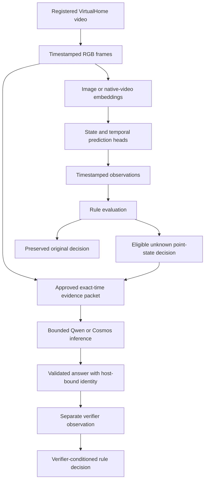
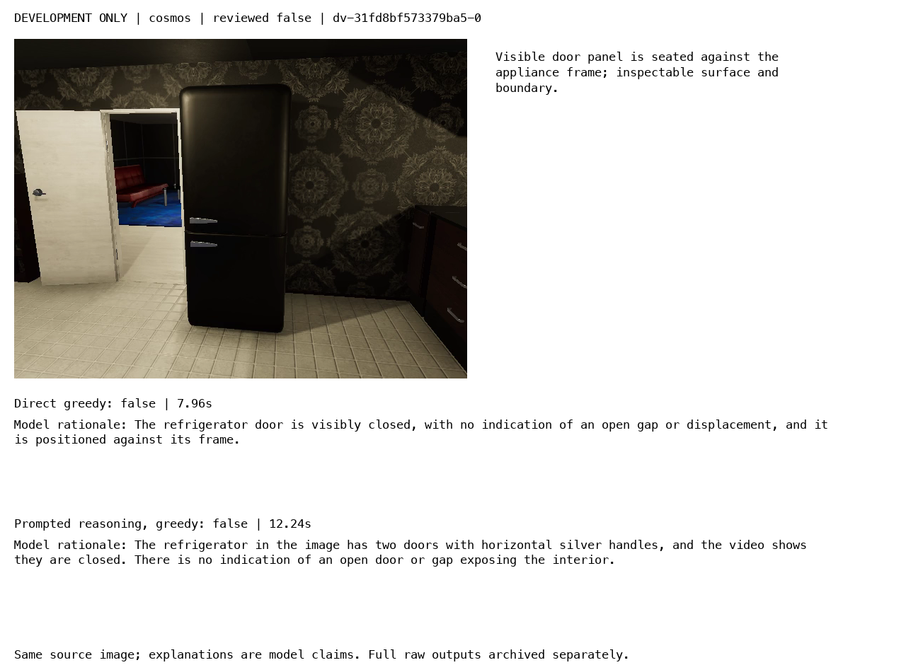
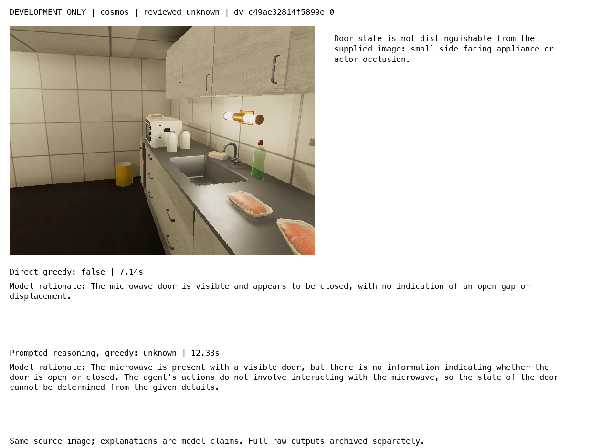
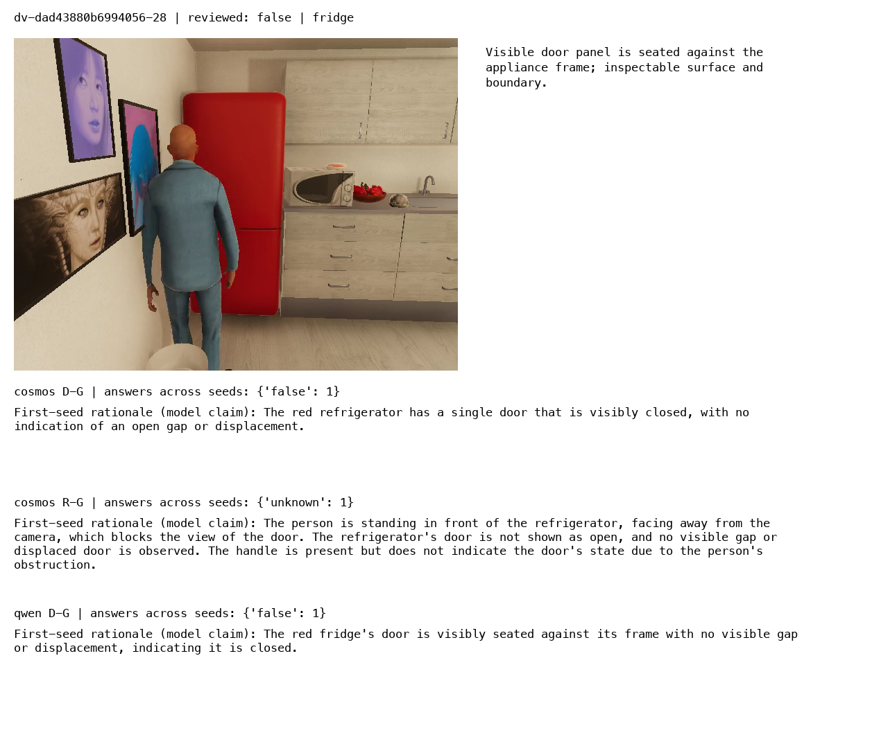
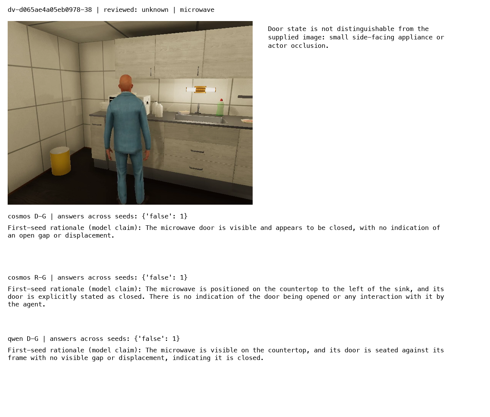

# Bounded Visual Verification: Qwen, Cosmos Reasoning, and Evidence Validation

A visual verifier receives approved image evidence and answers a narrowly specified question. In this project, the question is whether a named refrigerator or microwave door is visibly open at an exact timestamp. The surrounding system has already identified the episode, entity, event time, and available frame. The verifier must return a state supported by those pixels, or acknowledge that the state cannot be determined.

The implementation makes that request executable on Apple Silicon using two 8B vision-language models. It separates inference, output validation, evidence binding, and rule evaluation, then measures direct answering against prompted reasoning. Across 384 development calls and 72 held-out calls, the additional reasoning did not establish a test benefit. Qwen direct and Cosmos direct each scored **22/24** on test; the development-selected Cosmos reasoning configuration scored **20/24**. Every tested configuration incorrectly called both actor-occluded microwave views closed.

> [!summary]
> The bounded runtime and practical output recovery are implemented. Direct greedy remains the practical reference for this measured task. Passing JSON validation, predicting the correct state, and giving a supported explanation are separate outcomes; the experiment records all three. Reliable abstention remains unresolved.

The report concerns `COSMOS-VERIFY-001` in `/Users/manuel/code/wesen/2026-09-06--vision`. The practical recovery implementation is commit `89c4313`; the completed comparison and visual audit are in `bb9e4f1`. The project uses VirtualHome-derived imagery.

## 1. What the verifier contributes to the video system

The broader workbench has several distinct transformations. An embedding model maps images or clips into feature vectors used for retrieval or learned prediction heads. A temporal model combines features across time to predict actions or states. Observation records attach those predictions to entities and timestamps. A rule evaluator then asks whether available observations establish a specified condition.

The generative verifier adds a focused investigation path when an eligible point-state rule remains unknown. It receives an approved frame and produces a small structured answer. It does not search the corpus, choose another timestamp, run the detector, retrain a temporal head, or revise the original observation history. These restrictions make it possible to measure what one bounded call adds.



The native FP32 embedding repair remains a separate part of this architecture. That path uses its accepted Qwen embedding checkpoint, repaired adapter, feature-space identity, and independent caches. The current experiment uses generative Qwen3-VL-8B-Instruct and Cosmos-Reason2-8B weights. A larger generative reasoning model does not automatically replace the embedding model or make old embedding indexes compatible with a new feature space.

This separation also limits the conclusions. The measurements below evaluate exact-time visual door-state requests. They do not measure video retrieval, action recognition, departure-event detection, multi-image reasoning, or end-to-end warehouse safety rules.

## 2. State truth, observable state, and execution status

An appliance can have a simulator state even when its door is hidden in the rendered image. The evaluation target here is the state supported by the approved image. A closed simulator door behind an actor should therefore receive `unknown` when the visible pixels do not establish closure. Simulator programs and internal object state are not substituted for image evidence.

The visibility rubric requires positive state-bearing detail. A closed label requires an inspectable door seated against its frame. An open label requires visible displacement or an opening. Failure to see an opening is insufficient to establish closure: the relevant surface may simply be occluded, too small, or facing away.



*Figure 1. A positive closed-state example: the door surface and its seated relationship to the appliance frame are inspectable. The judgment uses visible geometry, not merely the absence of an opening.*

The model's answer and the host's execution status describe different facts:

| Record field | Meaning | Example |
|---|---|---|
| `status: ok` | The returned payload passed the host contract. | A valid cited answer of `unknown`. |
| `status: invalid` | Output exists but violates the answer contract. | An answer enum of `closed` instead of `false`. |
| `status: timeout` | The worker exceeded its execution deadline. | A process terminated after approximately 120 seconds. |
| `answer: false` | The model asserts that the requested door is visibly closed. | A seated refrigerator door. |
| `answer: unknown` | The model declines to establish the requested state. | An actor blocks the microwave door. |

A timeout cannot be converted into `false`, and a syntactically accepted `false` is not proof that the door is visible. The implementation preserves these distinctions so that a downstream rule can handle execution failure without silently receiving a negative state assertion.

## 3. The request is an evidence boundary

`verifiers/contracts.py::validate_request` checks the complete request field set and its content-derived identity. Each request names the episode, entity, property, event timestamp, permitted evidence interval, as-of timestamp, approved frames, output budget, and wall-clock deadline. The initial accepted property is `door_open`.

For a frame with source timestamp `pts_us` and availability timestamp `available_us`, validation requires:

```text
allowed_start_us <= event_us < allowed_end_us
event_us <= as_of_us
pts_us == event_us
pts_us <= available_us <= as_of_us
```

The exact-time equality is a substantive restriction. A nearby frame is not accepted as evidence that the door had the same state at the event time. The availability clock prevents using evidence that was not yet available at the declared decision horizon. These fields express what a result is allowed to depend on; they do not add revision or supersession machinery.

The shared request schema permits one to four approved frames, but `adapter.check_packet` currently accepts exactly one. This narrower runtime gate is intentional and visible. The presence of a list in the shared schema does not establish multi-image capability.

Before model execution, the adapter verifies that the image exists, is no larger than 10 MiB, contains no more than 2,073,600 pixels, matches its approved SHA-256, and passes image-file verification. After execution, it checks the packet again. The second check detects unexpected changes to evidence bytes while inference was running.

A model-facing payload uses the short citation alias `F1`:

```json
{
  "target_identified": true,
  "door_observable": true,
  "answer": "false",
  "evidence": ["F1"],
  "rationale": "The visible door is seated against its frame."
}
```

The host validates these fields and then supplies the full request, entity, and evidence identities. Long identifiers are therefore not generated by the model. A known answer requires an identified, observable target and an approved citation. Unknown answers may have different visibility flags, but malformed fields, invented aliases, duplicate keys, inconsistent known-state flags, and unsupported answer enums remain invalid.

This is a structural guarantee. The host can verify that `F1` names approved evidence; it cannot infer from the presence of that citation that the rationale accurately describes the image.

## 4. Model provenance and explicit generation profiles

The inference environment is isolated in `workbench/verify-env/.venv`. It records MLX 0.32.2, MLX-VLM 0.6.17, and Transformers 5.16.1. The two models use different provenance paths:

| Model | Local representation | Pinned source revision |
|---|---|---|
| Qwen3-VL-8B-Instruct | Community MLX 8-bit conversion | `a0093b9b5fda6f76ddd4a462c6830ae7c4fe47ec` in `mlx-community/Qwen3-VL-8B-Instruct-8bit` |
| Cosmos-Reason2-8B | Local MLX affine 8-bit conversion, group size 64 | `a9fae2cf89dc64db96b12860417f0eb403013bb9` in `nvidia/Cosmos-Reason2-8B` |

The Cosmos conversion manifest and model pins are retained in the ticket. This experiment did not use GGUF weights or a separate GGUF inference engine. It also did not use Qwen's distinct Thinking checkpoint. Prompting the Instruct checkpoint to explain its answer is a change in inference configuration, not a change in its trained weights.

`verifiers/profiles.py` makes those configuration choices explicit. A profile contains model family, prompt style, system message, sampling parameters, seed, penalty context size, output-token budget, and deadline. Validation rejects unknown fields, invalid ranges, nonfinite numbers, and booleans in integer fields. The profile and request must agree on token and deadline limits.

| Setting | Qwen sampled | Cosmos sampled | Greedy controls |
|---|---:|---:|---:|
| Temperature | 0.7 | 0.6 | 0 |
| Top-p | 0.8 | 0.95 | 1 |
| Top-k | 20 | 20 | 0 |
| Repetition penalty | 1.0 | 1.0 | 1.0 |
| Presence penalty | 1.5 | 0.0 | 0.0 |
| Penalty context | 4,096 | 4,096 | 4,096 |
| Maximum output tokens | 4,096 | 4,096 | 4,096 |
| Deadline | 120 seconds | 120 seconds | 120 seconds |

The profile settings were informed by the official guidance archived during the preceding research phase. The implementation still records the actual local semantics: MLX's recent-input/generated-token penalty behavior is a local approximation, not demonstrated parity with a different engine's penalty implementation. The worker passes the parameters explicitly rather than assuming that a model's saved generation configuration controls the Python API defaults.

Qwen uses the original no-system-turn policy. Cosmos uses a minimal helpful-assistant system message across all four new experimental arms. This makes the new Cosmos direct control the appropriate within-model reference. Historical results from a different system-message policy are not a matched control for reasoning effects.

## 5. From an approved frame to recorded model inputs

The worker loads the local model and processor with remote custom code disabled, formats the model-specific chat template, and prepares image inputs once. It records the shape and dtype of the returned tensors, along with the image grid. Those same prepared tensors are forwarded into generation.

For the reviewed 640×480 frames, the recorded image grid is `[1, 30, 40]`, and `pixel_values` has shape `[1200, 1536]`. With the processor's patch size, the recorded grid reconstructs 480×640 spatial dimensions. These numbers describe the actual image representation submitted to the model; they are not object boxes or evidence that a particular appliance received sufficient visual detail.

```python
inputs = prepare_inputs(processor, images=[approved_path], prompts=formatted)
record_shapes_and_image_grid(inputs)

kwargs = explicit_sampling_parameters(profile)
kwargs.update(inputs_except_attention_mask(inputs))
kwargs["mask"] = inputs.get("attention_mask")
mx.random.seed(profile["seed"])

generated = generate(
    model, processor, formatted,
    image=[approved_path],
    max_tokens=request["max_output_tokens"],
    **kwargs,
)
```

This pseudocode omits model-specific preparation arguments but preserves the relevant ordering. Forwarding prepared input IDs and pixels avoids a second preprocessing pass in the installed dispatch path. The worker checks that the installed generation function accepts the requested sampling controls. It records load, preparation, and generation time; prompt and output token counts; finish reason; peak MLX allocation; runtime versions; and the resolved profile hash.

Each request runs in a fresh subprocess group. The parent waits only for the remaining deadline, kills the group on timeout, and reaps the process before returning. Fresh processes increase per-request latency, but give the experiment a bounded lifecycle and an explicit failure record. The comparison runs sequentially; it does not overlap model workers to improve throughput.

## 6. Reasoning envelopes and the scope of recovery

The experimental reasoning prompt asks for an explanation followed by one final JSON object. A pilot showed that Qwen Instruct did not reliably follow the initial `<think>` convention. A separate development pilot established literal `<reasoning>...</reasoning>` tags for Qwen. Cosmos retained `<think>...</think>`. Both grammars were fixed before the development sweep.

Strict extraction requires a single leading opening tag, a single closing tag, a nonempty explanation, and a nonempty final suffix. Only the final suffix is validated as the answer. JSON that appears inside the explanation is not an answer candidate. An outer JSON Markdown fence can be normalized with a trace, but trailing prose, duplicate objects, invalid citations, and malformed fields remain rejected.

During the frozen sweep, 13 of Qwen's 72 sampled-reasoning calls omitted the closing tag while still returning usable final JSON. The requested heuristic addresses that specific failure:

```text
strict_result = parse_experiment(request, raw, profile, finish_reason)
if strict_result is accepted:
    return strict_result
if strict failure is not an incomplete reasoning envelope:
    return strict_result

require exactly one expected leading opening tag
require no closing tag and no mixed or repeated reasoning tags
find the first line-start JSON object or permitted JSON fence
require a nonempty explanation before that boundary
require no earlier braces or code fences
validate the entire final suffix with the existing visibility validator

return validated answer with original raw text and recovery metadata
```

The earlier-brace restriction makes the recovery conservative. If an explanation contains a candidate object or code block, the helper refuses to choose among possible answers. It does not repair JSON syntax, map `closed` into `false`, remove unwanted fields, invent citations, or accept token-limit truncation. The original raw text remains intact.

The saved trace includes `missing_reasoning_close_before_final_json`, recovery version `missing-reasoning-close-v1`, the missing token, the character offset of the final suffix, and the original strict failure. This makes recovery auditable without presenting the output as originally compliant.


*Figure 2. A real sampled Qwen response omitted the closing explanation tag. The final object was accepted by the unchanged visibility validator; the wrapper recovery remains explicit.*

The experiment's strict path was left unchanged while inference ran. The helper was first applied as a separate replay of saved output. Practical adapter activation occurred only after development, held-out inference, and strict live handoffs finished. Current profiled calls use recovery by default; `verify(..., recover_missing_close=False)` retains strict extraction. Calls without a profile continue to use their existing visibility parser.

## 7. Experimental design and development selection

The experiment uses 48 reviewed frames from eight episodes excluded from earlier verifier populations. Four episodes contribute development frames and four contribute test frames. The available unseen episodes did not yield the initially desired balanced state distribution. Sampling was refined around visible opening intervals through RGB review before model evaluation and protocol freeze.

| Partition | Closed | Open | Unknown | Total |
|---|---:|---:|---:|---:|
| Development | 15 | 3 | 6 | 24 |
| Test | 18 | 4 | 2 | 24 |

These are assistant-reviewed synthetic images, with correlated apartments, actions, objects, and neighboring frames. Separate episode identifiers reduce direct episode reuse, but do not make the dataset an independent sample of real-world environments. The two unknown test cases come from one occluded microwave episode. That small population sharply limits conclusions about abstention.

Each model has four arms: direct greedy (D-G), reasoning greedy (R-G), direct sampled (D-S), and reasoning sampled (R-S). Greedy arms run once per case. Sampled arms use three predefined seeds: 3407–3409 for Qwen and 1234–1236 for Cosmos. Thus each model contributes eight runs over 24 development cases, for 384 total development calls.

The selection score penalizes unsupported certainty on unknown cases. Let `correct(c,s)` be one when case `c`, seed `s` matches the reviewed label, and let `unsupported(c,s)` be one when the reviewed label is unknown but the model returns a definite state. For each arm:

```text
case_score(c) = mean_over_seeds(correct(c,s) - unsupported(c,s))
arm_score = mean_over_cases(case_score(c))
```

Both indicators use the full case population. An invalid or timed-out response is not correct, but it is not counted as a definite unsupported state. Metrics separately expose those failures so they cannot disappear inside the aggregate score. Ties favor lower unsupported certainty and lower median latency; the direct greedy control is retained unless another arm improves its score.

The protocol freezes profiles, prompts, model provenance, image identities, labels, and runtime source hashes before development inference. Both model selections must exist before any test call begins. Test then evaluates the selected arm and the direct greedy control, without duplicating the control if it was selected. No held-out response was used to tune the other model's configuration.

## 8. What development established

All 384 development calls finished in 3,780 seconds, including one timeout. “Non-OK” below includes output failures and execution failures.

| Model | Arm | Correct calls | Unsupported calls | Non-OK | Selection score | Median seconds |
|---|---|---:|---:|---:|---:|---:|
| Qwen | D-G | 18/24 | 6/24 | 0 | 0.5000 | 6.66 |
| Qwen | R-G | 18/24 | 6/24 | 0 | 0.5000 | 10.13 |
| Qwen | D-S | 54/72 | 18/72 | 0 | 0.5000 | 6.70 |
| Qwen | R-S | 44/72 | 15/72 | 13 | 0.4028 | 10.22 |
| Cosmos | D-G | 17/24 | 6/24 | 0 | 0.4583 | 7.33 |
| Cosmos | R-G | 18/24 | 4/24 | 1 | 0.5833 | 12.26 |
| Cosmos | D-S | 37/72 | 18/72 | 0 | 0.2639 | 7.39 |
| Cosmos | R-S | 52/72 | 12/72 | 3 | 0.5556 | 13.92 |

Qwen's direct and greedy reasoning arms agreed on aggregate correctness and unsupported certainty. Reasoning increased output length and latency without improving the selection score. Sampled reasoning additionally introduced the missing-close failures. Qwen D-G was therefore selected.

Cosmos greedy reasoning correctly abstained on two of the six development unknowns, while direct greedy abstained on none. It also introduced an invalid enum and an unnecessary abstention on a visibly open frame. The reduction in unsupported certainty was sufficient for its predefined score to improve, so Cosmos R-G was selected.



*Figure 3. A development microwave view where Cosmos reasoning returned unknown. The final explanation still requires inspection: a correct unknown label does not establish every descriptive or activity-related claim in its rationale.*

Sampling showed substantial seed dependence for Cosmos direct answers. Seed 1235 returned `true` for every development image, giving 3/24 correct because only three cases were open. The other two sampled seeds each scored 17/24. Cosmos sampled reasoning ranged from 16/24 to 19/24. Qwen direct sampling stayed at 18/24 for every seed.

The worker resets the seed for each isolated request according to the profile. The same seed can therefore produce correlated sampling behavior across prompts. The all-true run is a measured outcome; these records do not establish whether a particular model distribution or sampler implementation detail caused it. Changing the seed policy after observing this behavior would require a new experiment.

The Cosmos development failures were three invalid answer enums and one timeout across its reasoning arms. One response returned `closed` where the contract requires `false`. The timeout occurred for `cosmos-R-S-1235` on `dv-503ac41c9f57746a-27`, after 120.224 seconds. The process group was terminated and reaped, and subsequent requests completed. That failed call remained in the population without a retry.

## 9. Held-out accuracy and the failure of the development benefit to transfer

The held-out run evaluated Qwen D-G, Cosmos D-G, and Cosmos R-G over the same 24 frames. It completed 72 calls in 639 seconds. Every response passed strict output validation.

| Condition | Correct | Known-state accuracy | Unknown recall | Unsupported on unknown |
|---|---:|---:|---:|---:|
| Qwen D-G | 22/24, 91.7% | 22/22 | 0/2 | 2/2 |
| Cosmos D-G | 22/24, 91.7% | 22/22 | 0/2 | 2/2 |
| Cosmos R-G | 20/24, 83.3% | 20/22 | 0/2 | 2/2 |

The Cosmos reasoning configuration's two additional mistakes were unnecessary abstentions on red-fridge frames `dv-dad43880b6994056-28` and `dv-dad43880b6994056-38`. A person partly overlaps the appliance, but the exposed upper door surface and boundary still establish closure. The model treated partial overlap as sufficient reason to declare the state unknown.



*Figure 4. Both direct controls identify the seated closed door. Cosmos reasoning overstates the effect of partial actor occlusion and abstains.*

The opposite error remains in both genuinely uncertain test views. In `dv-d065ae4a05eb0978-30` and `dv-d065ae4a05eb0978-38`, the actor blocks the microwave's state-bearing door surface. All three configurations answer closed. Their overall accuracy is therefore dominated by the 22 observable-state cases, while unknown recall is zero.



*Figure 5. Every tested condition returns closed even though the actor obscures the relevant surface. Cosmos reasoning additionally claims that closure was explicitly stated, although no such state assertion was supplied.*

This result supports keeping direct greedy as the practical reference for this task. It does not retroactively change the recorded development selection: Cosmos R-G remains the selected experimental arm in the protocol and report. The operational recommendation reflects the subsequent held-out evidence and its limited scope.

## 10. Why final-rationale support is a separate measurement

An answer can match a reviewed label for an unsupported reason. To expose that distinction, the project audited every final test rationale against the supplied frame. The audit stores the case and profile identities, full final rationale, rating, review note, and SHA-256 of the saved result. A completeness check verifies that all 72 archived responses have exactly one matching review.

The categories concern material claims. `supported` means the rationale's substantive observations are inspectable and support the answer. `mixed` means supported details are combined with incorrect object descriptions, irrelevant causal inferences, or other unsupported assertions. `unsupported` means the decisive evidence claim is not established or is contradicted by the image. Generic use of the word “video” for a supplied frame is not penalized by itself; concrete motion-history claims or invented state assertions are evaluated.

| Condition | Supported | Mixed | Unsupported | Invalid |
|---|---:|---:|---:|---:|
| Qwen D-G | 22 | 0 | 2 | 0 |
| Cosmos D-G | 18 | 4 | 2 | 0 |
| Cosmos R-G | 10 | 9 | 5 | 0 |

The direct Cosmos responses sometimes added inaccurate details to a correct state label, including describing a two-door refrigerator as a single-door unit or asserting stored contents that the open cavity did not establish. The reasoning responses introduced additional causal assertions. Several microwave explanations used a plate resting on top as evidence of closure. That plate placement does not determine whether the front door is open.

The strongest example is `dv-d065ae4a05eb0978-22`. Cosmos reasoning returned the correct closed label, then asserted that the plate on top would not be possible if the door were open. A front door can open while an object remains on the appliance's top surface. The explanation therefore supplies an invalid physical justification for a correct label.


*Figure 6. The answer label is correct in all three conditions. The reasoning condition's plate-based justification is unsupported. Output validity and label accuracy alone would not expose this error.*

These ratings are an internal assistant review, performed against the same images used for label review. They are not independent human annotations, and they were not blinded to model identity. The value of the audit is the inspectable per-response record and concrete failure analysis. Its category totals should not be treated as a precise general ranking of model factuality.

The audit covers the short final rationale, not every sentence in the preceding generated explanation. The full raw output remains archived for diagnosis, but the presence or length of that explanation is not counted as independent evidence of correctness.

## 11. Recovery improves usable output counts without improving vision

The separate replay recovered all 13 observed Qwen missing-close failures. Ten recovered answers matched their reviewed labels; three returned definite states on unknown cases. Qwen sampled reasoning therefore changed from 44/72 to 54/72 correct, while unsupported answers increased from 15/72 to 18/72. After recovery, its aggregate counts match direct sampling rather than exceed them.

| Population | Original non-OK | Recovered wrapper cases | Remaining non-OK |
|---|---:|---:|---:|
| Qwen development | 13 | 13 | 0 |
| Cosmos development | 4 | 0 | 4 |
| All held-out calls | 0 | 0 | 0 |
| Total | 17 | 13 | 4 |

The remaining four failures are three invalid enums and one timeout. No held-out response required the heuristic. The strict generation records and development selections remain unchanged; replay records are labeled as a policy introduced after the failures were observed.

This ordering matters when interpreting improvements. The heuristic increases the number of structurally usable responses. It does not improve target recognition, visibility estimation, or physical reasoning. A downstream consumer should retain the recovery trace and apply the same semantic caution to recovered answers as to originally compliant ones.

## 12. Runtime costs and the meaning of the memory figures

The reported wall time includes fresh-process and model setup. It is not steady-state serving latency. Generation-token counts include the explanation when a reasoning profile is used.

| Held-out condition | Median seconds | p95 seconds | Median output tokens | Maximum output tokens | Peak MLX GiB |
|---|---:|---:|---:|---:|---:|
| Qwen D-G | 6.62 | 6.86 | 56.5 | 64 | 10.11 |
| Cosmos D-G | 7.36 | 7.55 | 73.5 | 77 | 10.11 |
| Cosmos R-G | 12.56 | 14.96 | 237.5 | 355 | 10.11 |

Cosmos reasoning used approximately 1.71 times its direct-control median wall time and 3.23 times its median output tokens. The loaded model dominates the reported allocation, so peak MLX memory remained similar across these short outputs. MLX allocation does not equal total process resident memory or total machine memory.

The maximum completed development response contained 680 generated tokens, below the 4,096-token cap. The timed-out worker did not return a completed token or allocation record. Resource summaries therefore describe completed worker records and cannot characterize that failed generation's peak behavior.

The runs were sequential and model families were not interleaved. Temperature, machine load, and execution order may influence timing. These measurements describe this bounded local runtime, not an isolated benchmark of inference-engine throughput.

## 13. RULES integration without replacing the baseline

`rules/handoff.py::plan_request` permits a focused call only for an eligible unknown `state_at_event` decision. It checks the rule binding, event identity, entity and episode, evidence horizon, and approved exact frame. Unknown decisions caused by missing triggers or unsupported temporal questions do not automatically become visual-verifier requests.

When a generation profile changes the output budget or deadline, `investigate` updates those fields and recomputes the request identity before execution. A successful model result becomes a separate verifier observation. The corresponding conditioned rule reads that verifier stream. The original observation stream and decision remain available for comparison.

```text
baseline = evaluate(original_rule, original_observations, original_horizon)
plan = plan_request(original_rule, baseline, event, approved_frame)
if plan is not ready:
    return the explicit unavailable/not-needed result

result = verify(bound_request, local_model, fresh_destination, profile)
if result.status is not ok:
    return the execution/output failure with the baseline reference

observation = make_verifier_observation(validated_answer, completion_time)
conditioned = evaluate(rule_using_verifier_stream, observation, completion_time)
return baseline_reference, verifier_result, conditioned
```

The completion time prevents backdating the newly available verifier result into the original decision horizon. This is a separate comparison condition, not a replacement instruction. The current implementation does not add an autonomous retry loop, retrieval expansion, revision graph, or supersession policy.

One live selected-profile handoff per model was executed after the frozen test run. Both transformed the controlled fixture's original `UNKNOWN` into a separate conditioned `PASS`, and both baseline objects remained unchanged. The fixture used an exact frame-sample event and a closed-state rule. It validates the handoff's data flow and binding; it does not measure real departure detection or end-to-end safety-rule recall.

## 14. Using and reviewing the implementation

The public Python entry points are small enough to follow directly:

| File under `workbench/src/video_workbench/` | Main responsibility |
|---|---|
| `verifiers/contracts.py` | Request horizons, identifiers, limits, and host-bound answer validation. |
| `verifiers/profiles.py` | Explicit generation settings, validation, and profile hashes. |
| `verifiers/worker.py` | Model loading, templates, prepared tensor forwarding, generation, and runtime records. |
| `verifiers/visibility.py` | Visibility prompt, strict final payload validation, and reasoning-envelope extraction. |
| `verifiers/normalization.py` | Traced normalization of an allowed outer JSON fence. |
| `verifiers/recovery.py` | Conservative recovery of the observed missing closing tag. |
| `verifiers/adapter.py` | Evidence checks, subprocess deadline, worker binding, parser policy, and persisted results. |
| `rules/handoff.py` | Focused request planning and separate verifier-conditioned evaluation. |

For an approved request packet, a practical call can be constructed as follows:

```python
from video_workbench.rules.evaluate import digest
from video_workbench.verifiers.adapter import verify
from video_workbench.verifiers.profiles import make_profile

profile = make_profile("qwen", reasoning=False, sampled=False)
request = dict(approved_request,
               max_output_tokens=profile["max_output_tokens"],
               deadline_ms=profile["deadline_ms"])
request["request_id"] = digest({k: v for k, v in request.items()
                                if k != "request_id"})
result = verify(request,
                "output/models/qwen3-vl-instruct-8b-8bit",
                "output/my-new-verifier-run",
                profile=profile)
```

Run through the isolated verifier environment with the workbench source importable. Use a fresh destination for each call. The destination records the request, profile, worker result, execution log, and host result as available. A caller that needs strict experimental parsing can pass `recover_missing_close=False`; the result records the chosen `validation_policy`.

At feature completion, 71 focused tests passed across profile validation, parsing, visibility checks, worker binding, recovery policy, and process boundaries. Four new host integration cases cover both delimiter families with default recovery and explicit strict mode, including saved raw text and traces. These tests establish implementation behavior. The image comparison and manual rationale audit provide the separate semantic evidence.

The frozen inference source is available at commit `5aa10eb`. Script 24 checks the frozen source hashes and deliberately rejects the later practical adapter change. Reproduce strict inference in an isolated checkout of the frozen revision with the pinned model, environment, and evidence paths; do not rewrite protocol hashes to make a changed runtime appear identical. Reporting and recovery replay can run against saved results from the current checkout without regenerating responses.

## 15. Evidence, project status, and the next experiment

The source ticket is:

```text
ttmp/2026/09/06/COSMOS-VERIFY-001--cosmos-and-qwen-verifier-runtime-baseline/
```

Its main review entry points are `reference/08-measured-qwen-and-cosmos-prompted-reasoning-comparison.md`, the chronological `reference/01-design-and-delivery-diary.md`, and designs 02 and 03. Scripts 21–23 cover pilots and protocol freeze; script 24 runs the sequential comparison; scripts 25–30 archive results, exercise handoffs, render panels, replay recovery, and validate the rationale audit. The frozen protocol SHA-256 is `629d7769ee9f47cf4cc0634d90e94daa3492f98b034a8b7745742953a208ace3`.

The vault contains copies of the figures embedded here, the [measured summary](_assets/cosmos-verify-summary.json), [development selections](_assets/cosmos-verify-selection.json), [complete final-rationale audit](_assets/cosmos-verify-rationale-audit.json), and [recovery replay summary](_assets/cosmos-verify-recovery-summary.json). The complete per-call raw archives and all 24 held-out comparison panels remain in the source ticket. The vault's embedded figures are copied assets, so this report does not depend on image links into another repository.

R1–R5, C1–C4, and the missing-close recovery follow-up are complete for the bounded single-image scope. The implementation can execute a focused request, preserve its evidence identity, distinguish invalid output from unknown state, and return a separate rule condition. The current measurements do not justify treating its definite answers as reliable under occlusion.

The existing later work remains appropriate: a separately pinned Qwen Thinking checkpoint, approved full-frame plus crop evidence, explicit multi-image/native-video verification, and broader rule-level evaluation. Each new model or prompt decision should use fresh reviewed cases. Crops can increase the representation of small visible objects, but they cannot reveal pixels hidden by an actor. More reasoning tokens likewise cannot create missing visual evidence.

For further development, the immediate technical priority is to improve and independently review the visibility decision, including both over-abstention on inspectable partial views and false certainty under substantial occlusion. The report's concrete case records provide examples to inspect, while the consumed test set should remain an evaluation record rather than become a prompt-tuning set.

## Related project reports

- [[ARTICLE - Temporal Video Models - Causality Weak Supervision and Observation Memory]] explains the observation and temporal context for the rule handoff.
- [[ARTICLE - Native Video Embeddings in MLX - Repairing Pixel Forwarding and Establishing Reference Parity]] covers the separate native embedding repair.
- [[ARTICLE - VirtualHome Corpus Expansion - Scenario Diversity Provenance and Visual Labels]] explains corpus diversity and reviewed visual labels.
- [[ARTICLE - YOLO Video Perception - Detection Tracking Evidence and State Recognition]] describes the detection, tracking, and crop evidence pipeline.
- [[ARTICLE - Requested Object Localization - Oracle Crops, Evidence Coverage, and State Recognition]] develops the distinction between localization coverage and downstream state accuracy.
