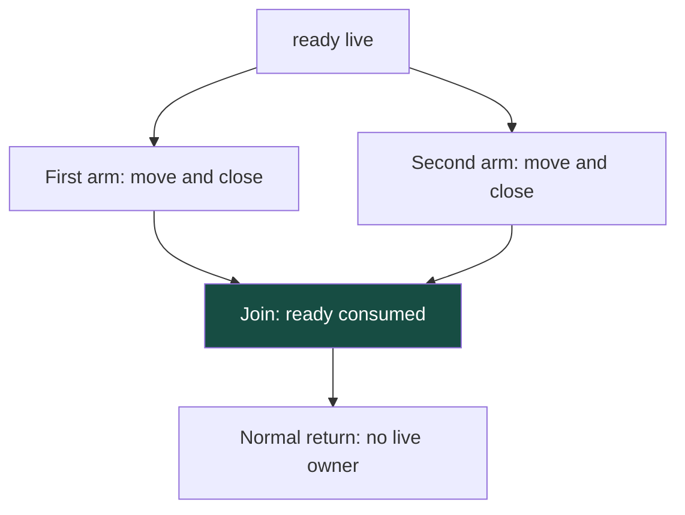

# ServiceLang Mathematics: Ownership, Dataflow and Semantic Preservation

A compiler rejecting a double move is an implementation result. Explaining why a whole class of accepted programs cannot duplicate ownership requires a mathematical model, an analysis related to that model and a backend that preserves the relation. ServiceLang makes these obligations unusually concrete because its source owners correspond to existing native buffers and RPC endpoint leases.

> [!summary]
> The implemented checker uses a finite ownership-status abstraction with variant-specific edges. Its worklist terminates under explicit monotonicity and finite-provenance assumptions. Those facts do not alone prove unique native authority, remote progress or C++ semantic preservation. This article derives the useful parts and identifies exactly where implementation assumptions remain.

The accompanying [[PROJ - ServiceLang - An Ownership Checked Language Compiled to C++|compiler article]] describes the implementation. [[PROJ - ServiceLang Compiler Explorer - Making Compiler Decisions Inspectable|The explorer article]] shows how to inspect the actual CFG and states discussed here. The development guide contains a longer mathematical treatment; this report provides a connected path through its central arguments rather than presenting every possible extension.

## 1. Separate the propositions before proving them

There are at least four different propositions one might want from this project:

1. A source program obeys a resource discipline.
2. The implemented checker accepts only programs satisfying that discipline.
3. Native compilation and adapters preserve the checked source behavior.
4. The environment eventually permits a desired distributed outcome.

None automatically entails the next. A sound source type system does not repair an emitter that overwrites an occupied optional. A correct emitter does not make an unreliable link deliver a reply. A finite dataflow algorithm does not prove that its transfer functions model the intended resource semantics.

A useful configuration includes control, values, resource identities, protocol state, driver state and time:

$$
C=(K,E,H,P,D,t).
$$

The fields are a mathematical decomposition, not a claim that one runtime struct stores them. Write a labeled transition when an operation changes the configuration. An execution is a sequence of such transitions; an observation function selects events relevant to a property.

Driver state is essential. If the configuration contained only the application's Pending endpoint, it could not express a caller receiving Unknown while the driver still owns a transmit allocation. A proof about that reduced machine would omit the exact lifetime distinction we need to preserve.

## 2. Linear usage is a restriction on assumptions

Ordinary typing contexts generally permit an assumption to be used more than once or not at all. In substructural terminology, contraction permits duplication and weakening permits discarding. An ownership discipline changes which of these structural operations are admissible for resource assumptions.

For explanation, separate copyable assumptions from owned assumptions:

$$
\Gamma;\Delta\vdash e:T\dashv\Delta'.
$$

Read this as: under ordinary context Γ and incoming resource context Δ, expression e produces a value of type T and leaves residual resource context Δ′. A consuming operation removes its source assumption; a restricted read preserves it. The produced owner belongs to the result and must subsequently be accounted for.

This notation helps explain why `move ready` cannot be treated as an ordinary variable read. If both the old local and the produced value remained usable, the derivation would have duplicated the same resource assumption. If a resource-bearing result disappeared without an explicit consuming path, the derivation would have silently discarded it.

ServiceLang chooses explicit normal-path cleanup. Native destruction during an abrupt reset is not modeled as a source return. That distinction prevents a source cleanup claim from becoming a false statement that destructors run during every physical failure.

Pierce's edited *Advanced Topics in Types and Programming Languages*, Chapter 1 by David Walker, is the closest reading companion: §§1.1–1.3 discuss structural properties, a linear system and variations. This reading recommendation is based on the verified contents and the established concepts; it is not a claim that Walker's chapter proves ServiceLang's particular Go implementation.

## 3. Status accounting is not yet resource identity

A source local being live tells the checker that it may be used. It does not, by itself, identify the underlying allocation or prove that another local refers to a different allocation.

Suppose an invalid native adapter manufactured two wrappers for the same resource. A status checker could see two live locals, each consumed once, and still fail to detect the alias. To derive unique resource authority, we need an invariant connecting live source owners to distinct native identities, plus contracts saying allocation is fresh and moves transfer rather than copy authority.

This separation is productive. The finite checker can remain small, while native freshness and lease-transfer behavior are isolated as adapter obligations. It is incorrect, however, to hide those obligations inside the word ownership and then claim that the status lattice proves everything.

For a move from s to d, a resource-identity invariant should establish that d receives exactly the identity previously owned by s and that s loses usable authority. For release, the resource ceases to be caller-owned through the permitted native operation. The number of live source slots is only an approximation to these richer facts.

## 4. Construct the abstract domain from concrete ledgers

Let V be the finite set of lowered storage slots. These include compiler temporaries, not just source variable names. Let:

$$
S=\{U,L,D\},
$$

where U means uninitialized, L live and D consumed. A concrete status ledger is a function c from V to S. An execution chooses one branch and assigns each slot one actual status. Analysis must cover all branches that its CFG considers possible.

For a nonempty set X of concrete ledgers, collect the possible status of each slot:

$$
\alpha(X)(v)=\{c(v)\mid c\in X\}.
$$

An abstract ledger A maps each slot to a nonempty subset of S. Its concretization is the set of concrete ledgers consistent with every coordinate:

$$
\gamma(A)=\{c:V\rightarrow S\mid\forall v,\ c(v)\in A(v)\}.
$$

Give unreachable execution a separate bottom element. Define the abstraction of the empty set as bottom and its concretization as empty. This corresponds to the implementation's nil incoming ledger. It is not the same as an existing uninitialized slot: a reachable path can initialize a U slot, while an unreachable path contributes nothing.

Order reachable abstract ledgers by pointwise subset inclusion. Join is pointwise union. This is the powerset/product/map-lattice construction developed in Møller and Schwartzbach's *Static Program Analysis*, §4.3.

### Derive the abstraction relationship

The useful relationship is:

$$
\alpha(X)\sqsubseteq A\quad\Longleftrightarrow\quad X\subseteq\gamma(A).
$$

For the forward direction, choose any c in X and slot v. The value c(v) belongs to α(X)(v), and therefore to A(v). Thus c belongs to γ(A). Conversely, if every c in X belongs to γ(A), every status collected into α(X)(v) belongs to A(v). The unreachable cases follow from the bottom definitions.

The derivation explains the approximation rather than merely giving it a name. It also exposes the information lost. If X contains ledgers `(x=L,y=D)` and `(x=D,y=L)`, the abstraction assigns `{L,D}` to both coordinates. Its concretization additionally contains `(L,L)` and `(D,D)`. The checker no longer knows that exactly one owner is live.

A rejected program can therefore be safe under a more precise analysis. Conservative rejection is not evidence that a concrete execution would necessarily fail.

## 5. Derive a transfer and its validity predicate

A concrete move requires a live source and a non-live destination. It sets the source to consumed and the destination to live, preserving other coordinates. Its abstract transfer is:

$$
F_{s\rightarrow d}(A)=A[s\mapsto\{D\},d\mapsto\{L\}].
$$

The acceptance condition is:

$$
\operatorname{ValidMove}(A,s,d)
\iff A(s)=\{L\}\land L\notin A(d).
$$

Merely requiring L to be a member of A(s) would be insufficient: `{L,D}` represents a possible already-consumed source. Conversely, destination `{U,D}` is safe to initialize because neither alternative is live. Requiring every state to be a singleton would reject valid branch-local temporaries.

Now suppose ValidMove holds and c belongs to γ(A). The concrete move is defined, and its changed coordinates lie in the singleton sets installed by F. All unchanged coordinates still lie in their previous sets. Consequently the successor belongs to γ(F(A)). This is conditional local soundness for the stated ledger model.

The implementation needs one further distinction. During worklist solving, it totalizes transfers even on invalid input states. A bad move may still install D/L facts so propagation can continue. After convergence, a second pass checks preconditions on stabilized states. Accepted-program reasoning depends on that second pass. Without it, invalid operations could produce superficially plausible downstream facts and reach emission.

The proof is conditional on correctly implemented transfers and complete control flow. It does not become a proof of Go code merely because its equations resemble the implementation.

## 6. Work a real branch through the checker

The committed branch example closes Ready on both paths:

```text
if flag { close(move ready); }
else    { close(move ready); }
return;
```

The [actual dumped CFG](_assets/servicelang-20260907/evidence/29-branch-ir.json) has eight slots and four blocks. Its owned slots are 0 for ready, 3 for the first arm's move temporary and 5 for the second arm's temporary.

| Program point | Slot 0 | Slot 3 | Slot 5 |
|---|---|---|---|
| Entry | {L} | {U} | {U} |
| First arm after move | {D} | {L} | {U} |
| First arm after close | {D} | {D} | {U} |
| Second arm after close | {D} | {U} | {D} |
| Join | {D} | {U,D} | {U,D} |

No owner may still be live at the join. Each temporary is consumed on the path where it exists and uninitialized on the other path. This is exactly the valid nonsingleton case.



Delete the second close. The first arm contributes `{D}` for ready; the second contributes `{L}`. Their union is `{L,D}`, so the strict initial checker reports E_JOIN. It does not select the last visited predecessor or reset the local to live.

Returning inside one branch changes the graph itself. In `if flag { return move ready; } return move ready;`, the first branch has no edge to the final return. Only the still-live predecessor reaches it. This distinction prevents a syntactic branch walker from inventing a consumed predecessor that does not exist in the CFG.

The following screenshot shows the implementation's stabilized states for the accepted example. The mathematical table above is a derivation; this image is actual compiler inspection, not a native execution trace.


## 7. Variant edges introduce only the active payload

Resource-bearing sums are a natural way to express conditional transfer. Allocation has an Allocated alternative carrying Buffer and an AllocFailed alternative carrying copyable error data. A consuming match first consumes the aggregate. Only the successful edge introduces the Buffer payload.

If a names the aggregate and b the successful payload, the relevant edge effects are:

$$
E_{\mathrm{Allocated}}(A)=A[a\mapsto\{D\},b\mapsto\{L\}],
$$

$$
E_{\mathrm{AllocFailed}}(A)=A[a\mapsto\{D\}].
$$

Defining every alternative's fields before selecting the edge would invent owners. Defining none would lose the successful owner's cleanup obligation. The implementation stores field bindings on CFG edges and applies them only to the chosen abstract successor.

RPC polling composes this pattern. Waiting carries Pending; Complete carries a copyable CallResult and an owned Continuation. Reusable carries Ready, whereas Lost carries only fault data. There is no valid edge transformer that makes both Pending and Ready live for one poll, or creates Ready on the Lost edge.

Exhaustiveness makes the alternatives visible, but the trusted adapter must still select the truthful alternative. Type structure cannot compensate for a wrapper that misclassifies invalidation or manufactures a lease.

## 8. Termination of the analysis needs more than a top element

The dataflow equations join predecessor contributions and apply block/edge transfer functions. The finite-height fixed-point theorem in the analysis notes, §4.4, applies when the global equation transformer is monotone.

The basic induction starts from bottom. Since bottom is least and the transformer is monotone, successive iterates form an ascending chain. Finite height forces stabilization. To establish leastness, compare the iterates with any fixed point: bottom lies below it, and monotonicity preserves that ordering at every iteration.

For our move transfer, replacing the same coordinates of two ordered inputs with the same singleton sets preserves their ordering. Reads are identity-like on ownership status. Compositions and predecessor unions remain monotone. These are the premises that justify invoking the theorem.

With n slots and b blocks, at most 3nb ownership-status bits can be added to incoming maps. For the eight-slot, four-block example, 96 is an upper bound on bit additions. It is not an exact operation count: transfers scan operations and slots, edges copy ledgers and queue management adds work.

The implementation also tracks diagnostic Origin. An earlier origin span can improve without any status bit changing and can cause another worklist update. Therefore a proof based only on 3nb is incomplete for the actual algorithm.

There are finitely many possible origin spans. Incoming origins move from absent to a span and then only to an earlier span. Transfers preserve origin or install a constant origin/absence. Adding this finite provenance order gives a termination argument for origin-only updates too. This is why reviewing the actual implementation matters even when the status-domain theorem is elementary.

## 9. Preservation, progress and remote uncertainty

Preservation says an allowed step maintains the appropriate well-formedness invariant, possibly with an updated resource or store typing. It would be wrong to require the resource context to remain literally unchanged across move, release or endpoint transition.

Progress needs a definition that includes legitimate waiting. A well-formed component may finish, take an internal/adapter step or return a specified Waiting state with its owner intact. Waiting is not an illegal stuck instruction.

Neither proposition guarantees a remote reply. Even eventual terminal resolution needs environmental assumptions: time advances, the owner is scheduled, deadlines are finite and native operations return. The terminal outcome may still be Unknown.

To see why, compare two histories. In one, the request is lost and no remote action occurs. In another, the server commits but the reply is lost. If the caller's available observations are identical, it cannot distinguish these histories. A type system cannot infer the missing observation.

Unknown is therefore an information result. It is not a default synonym for failure or proof of no effect. NotSent is stronger only relative to the runtime's observed attempt boundary; it is not an independent electrical measurement of radio silence.

Linear endpoint use also does not establish global deadlock freedom. Two components can each own an endpoint correctly while waiting on a cycle of dependencies. Session-calculus deadlock theorems require their particular composition rules and assumptions, not merely endpoint types with dual-looking transitions.

## 10. Native refinement is a separate correspondence

Let compile(p) be generated C++ and let source and target behavior sets be defined under an environment model E. A useful target is:

$$
\mathcal B_T(\operatorname{compile}(p),E)
\subseteq\mathcal B_S(p,E).
$$

The target must not introduce behavior forbidden by the source. Behaviors must include faults and, when progress is claimed, termination/divergence. Inclusion of finite prefixes alone would allow an implementation that silently stops making progress.

A representation relation connects a live source owner to an engaged optional containing the unique usable native wrapper. The emitted take sequence moves the wrapper, resets the moved-from optional and places the value in a proven-empty destination. To justify the macrostep, native move construction must transfer authority and the moved-from destructor must be harmless to the transferred lease.

Argument order is another correspondence. The rejected `sink(move b, length(b))` must fail before emission because its later read follows consumption. In the accepted version, a preceding length calculation appears before the move in both CFG operations and emitted statements.

Checked addition provides a small arithmetic proof. Two I32 operands sum within the range from minus $2^{32}$ to $2^{32}-2$, safely inside int64. The helper widens first, computes there, checks I32 bounds and only then converts back. Checking after overflowing signed I32 arithmetic would be too late.

Literal spelling exposed a different refinement issue: source decimal 0010 must mean ten, not C++ octal eight. Canonicalizing parsed decimal values before emission fixes that discrepancy while preserving source spans. The native regression checks both positive and negative spellings, as well as 0008, which would otherwise be invalid C++ octal.

## 11. What the equivalence experiment actually establishes

The P4 harness compares generated Sensor code against independent native Ready/Pending calls in four saved simulation configurations. Its observation tuple includes outcome, value, attempts, completion time, step count, cleanup count, reusable continuation and all simulator counters. Both executions audit resources after quiescence.

In the short-deadline case, both return Unknown at model time 1000 microseconds after one attempt, with a reusable logical endpoint while fake TX remains busy. Three further cleanup steps precede audit. An observation projection containing only outcome would miss premature resource release; a requirement for immediate quiescence would reject correct model behavior.

This is not full source/target semantic preservation. There is no independent source interpreter, and four environments are not all programs or schedules. The experiment tests a useful concrete correspondence to handwritten protocol code. A general theorem still needs source semantics, all transfer cases, the representation relation and native assumptions.

## 12. Component authority and capacity as finite constraints

Let C be component names and I declared endpoint instances. The startup checker requires an injective total assignment from C to I with equal finite counts. Thus each component receives one endpoint and no two share it.

For component c, let R(c) be the capabilities required by its selected entry functions and transitive callees, and G(c) its declared grants. Acceptance requires:

$$
R(c)\subseteq G(c).
$$

For resource demand, count allocate calls across all branch arms and call occurrences. This deliberately overestimates one execution. The acyclic call graph allows summaries to be computed in dependency order. If B(c) is the declared general-slot budget, require:

$$
B(c)\geq\max(A(\operatorname{begin}_c),A(\operatorname{poll}_c)),
\qquad\sum_c B(c)\leq12.
$$

Live allocations cannot exceed all allocation attempts within an invocation. Checked normal paths consume owners, and the fixed entry results cannot carry Buffers to the next invocation. Under the host owner discipline, these facts support the conservative capacity check. They do not create runtime quotas or account for arbitrary native interference outside the checked application.

Static validation and native acquisition remain distinct. Invalid plans publish nothing. A valid plan may encounter an unavailable native endpoint; earlier acquisitions are then retired, not transactionally restored. Claiming rollback would require a stronger native API contract than the implementation possesses.

## 13. A focused reading path

The references support different parts of the argument:

- **Møller and Schwartzbach, Static Program Analysis:** §§4.3–4.4 for lattice construction and fixed points, Chapter 5 for dataflow, Chapter 12 for abstraction. The preserved August 29, 2026 version supplied the directly worked lattice context. [Author-hosted notes](https://cs.au.dk/~amoeller/spa/spa.pdf).
- **Harper, Practical Foundations for Programming Languages:** the retained abbreviated second edition supplies the operational-semantics and preservation/progress foundation, especially Chapter 6. [Abbreviated edition](https://www.cs.cmu.edu/~rwh/pfpl/abbrev.pdf).
- **Pierce, Types and Programming Languages:** Chapters 3, 8–11 and 13 are a useful route through semantics, typing, variants and store typings. [Verified contents](https://www.cis.upenn.edu/~bcpierce/tapl/contents.pdf).
- **Advanced Topics in Types and Programming Languages:** Walker's Chapter 1 is the highest-priority ownership reading; Chapter 3 connects effects to capability summaries; Morrisett's Chapter 4 addresses low-level typed compilation. Chapters 6–7 are later material for equivalence arguments. [Verified contents](https://www.cis.upenn.edu/~bcpierce/attapl/frontmatter.pdf). Full chapter text was not available in this work, so these are reading recommendations, not claims of a completed chapter-based proof.
- **Wadler, Propositions as Sessions:** useful for understanding the relationship among linear logic, sessions and calculus-specific deadlock results. The retained archive is a longer 2013 manuscript with a 2012 conference cover, not asserted to be the exact conference PDF.
- **Leroy, Formal Verification of a Realistic Compiler:** separates source guarantees from semantic preservation through compilation. [Author manuscript](https://xavierleroy.org/publi/compcert-CACM.pdf). CompCert's proof is not inherited by our C++ transpiler.

The [source manifest](_assets/servicelang-20260907/source-manifest.json) preserves scholarly source URLs, versions and hashes without republishing the books here.

## 14. The useful boundary of the result

The project now has an implemented finite checker, generated native execution, explicit component constraints and a workbench that exposes actual analysis states. The strongest justified mathematical statements are the derivations for the specified finite model and the stated conditional correspondence arguments. The implementation tests support particular code paths and scenarios.

A universal compiler soundness theorem, proof of native undefined-behavior freedom, authenticated distributed authority and general deadlock freedom remain different propositions. Keeping them distinct is what makes the mathematics useful for engineering: it tells us which assumption to inspect when a concrete extension changes the system.
