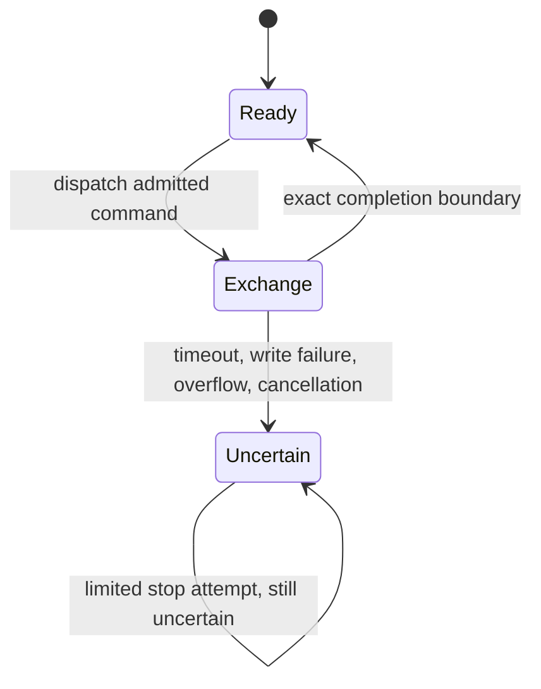
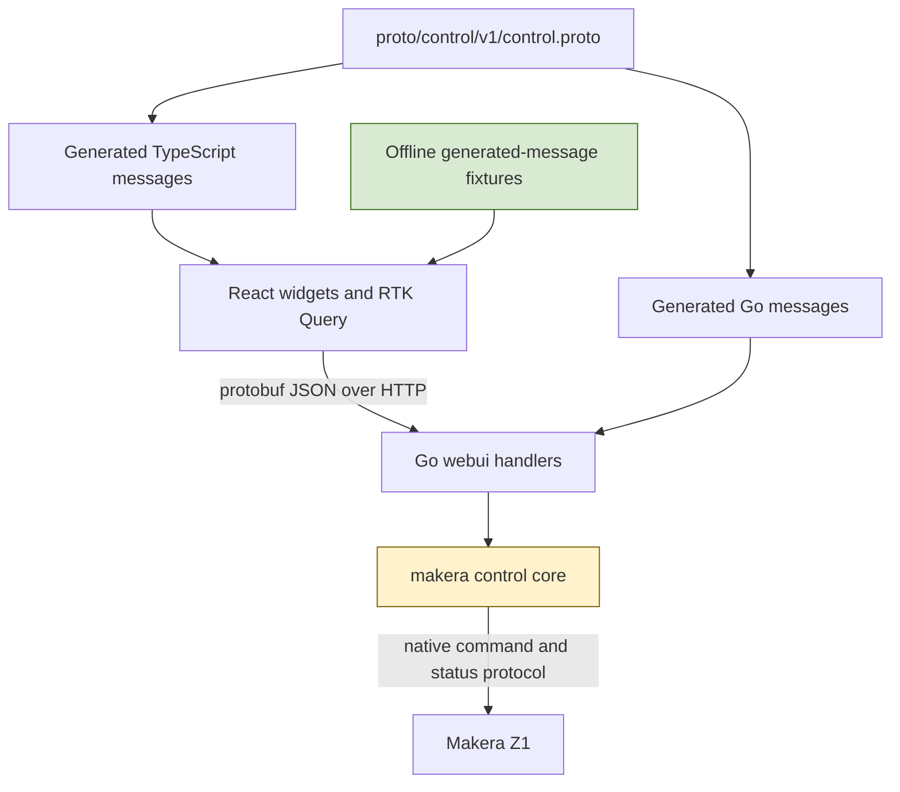
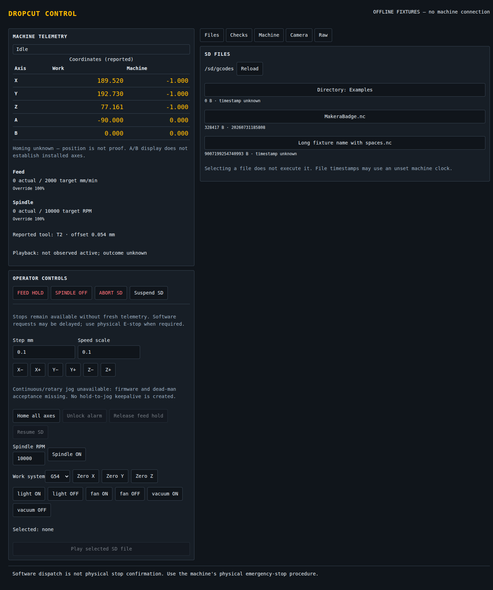
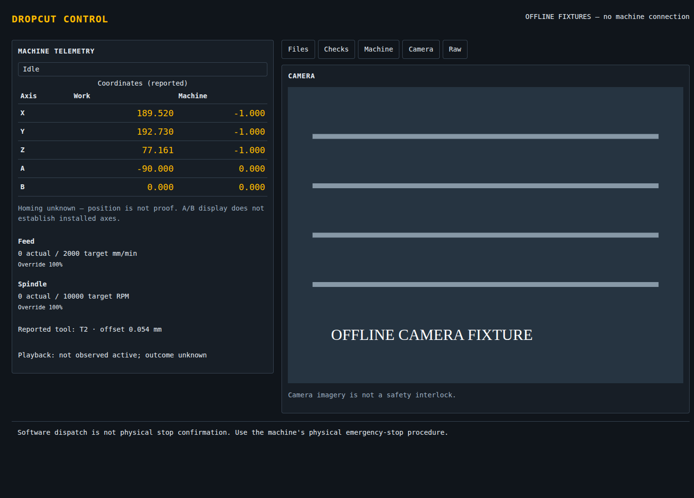

# Makera Z1 Control — Typed Interfaces and Explicit Uncertainty

A CNC controller can receive a successful HTTP response without learning whether the machine performed the requested operation. It can display an exact coordinate without knowing whether that coordinate has an established reference. It can lose its connection after dispatch and be unable to determine whether repeating the command would repeat a physical action. These are separate uncertainties, and a useful control interface must preserve their distinctions rather than convert them into a single success indicator.

This report explains the implementation of a typed React control interface for the Makera Z1, the Go changes that support it, and the remaining differences between a working offline interface and a deployable machine controller. The central question is how information and authority move through the system: what the firmware actually reports, what the host can conclude, what the browser may request, and what each layer must refuse to infer.

The report describes the repository at commit `8c4d997`. It covers the MZ1-008 interface migration and the relevant MZ1-007 control-core work that preceded it. It continues [[PROJ - Makera Z1 Control - What the Machine Does Not Say]], but does not treat the earlier hardware observations as validation of the replacement interface.

> [!summary]
> - The replacement uses protobuf-defined HTTP JSON, generated Go and TypeScript messages, React components, RTK Query, and a small Redux UI slice. It does not replace the native machine protocol with gRPC.
> - Fourteen reusable widgets have 99 named Storybook scenarios. Five offline screenshots are included below. Eight frontend tests pass; the complete browser scenario sweep remains unfinished.
> - Unknown outcomes block further enabling actions locally. Continuous jog is deliberately unavailable because the deployed firmware's command dialect and stop-on-missing-keepalive behavior have not been established.
> - The migration is not yet deployed or complete. Go embedding, end-to-end contract validation, and the final browser audit remain open. The existing live server was left unchanged.

## 1. What the project is actually changing

The active repository contains both a CAM application and a machine controller. The CAM application already lives in `apps/studio`; the active Go controller is the nested `makera-z1-cli` module selected by the workspace. The new application, `apps/control`, is a separate control interface. It is not a rewrite of the CAM editor, nor does this work establish that a CAM-generated artifact is safe to execute.

The original controller interface consisted of approximately 593 lines of browser JavaScript, 326 lines of CSS, and 195 lines of HTML in `makera-z1-cli/pkg/webui/static`. Its Go server already supplied status, identification, file listing, diagnostics, camera access, motion requests, and job lifecycle operations. The migration preserves those broad responsibilities while replacing the browser's untyped payload handling and direct DOM manipulation.

Preserving the responsibilities does not mean preserving every behavior. Several existing behaviors overstated certainty or allowed requests whose assumptions had not been validated. A correct migration therefore includes selective behavior changes: homing remains unknown, incomplete outcomes remain unknown, missing emergency-stop input fails enabling preflight, and continuous jog is refused rather than reproduced uncritically.

The implementation status at the report checkpoint is:

| Area | Implemented | Still required |
|---|---|---|
| Application contracts | Protobuf schema, Go/TS generation, strict decoding for body-decoding handlers | Complete endpoint and presence audit; automated cross-language fixtures |
| Observation interface | Telemetry, files, diagnostics, identity, camera fixture, raw report | Panel-specific production error handling and final visual audit |
| Operator controls | Typed requests, confirmation, local single-flight admission, uncertainty state | Broader interaction coverage and end-to-end server validation |
| Storybook | Fourteen component files with 99 named scenarios; static build succeeds | Complete browser sweep and verification of all play functions |
| Packaging | Vite production build succeeds | Replace Go's embedded legacy assets and validate the resulting binary |
| Hardware evidence | Earlier read-only evaluation and one separately authorized unlock | No replacement-interface physical commissioning has occurred |

This distinction is operationally important. The Go server still embeds `static/index.html` and its associated legacy assets. Committed HTTP responses have changed to the protobuf JSON contract, but production embedding has not yet been switched to the React build. A new server built from this checkpoint must not be described as a completed replacement release.

## 2. Start with evidence, not with UI state

An interface needs a model of what it knows before it needs a component hierarchy. In this project, at least four different facts can appear during one operation:

1. The browser submitted an HTTP request.
2. The Go client dispatched a native command.
3. The command exchange produced an acknowledgement or response terminator.
4. The physical operation completed with the intended result.

These facts are not interchangeable. A later fact requires additional evidence; an earlier fact does not imply it. The same applies to observations. A position report is evidence of a reported position. It is not automatically evidence of homing, installed rotary axes, tool clearance, or a completed job.

### Position and homing are different properties

The stock firmware's `-1,-1,-1` machine position was particularly misleading. Earlier investigation established that it can occur both at boot and at the resting position after homing. Consequently, testing whether the coordinates equal that tuple cannot establish whether a position reference exists. Testing whether they differ from the tuple cannot establish it either.

The migration fixes a concrete server omission: `handleStatus` constructed an `AtRest` field but did not assign `st.AtRestPosition`. The new assignment repairs the reported at-rest property. It does not introduce a `homed` property. The Checks panel now reports homing as unknown rather than presenting movement away from the boot position as successful homing evidence.

The distinction can be written directly:

```text
reported_position = (-1, -1, -1)
    does not imply homed
    does not imply unhomed

reported_position != (-1, -1, -1)
    does not imply homed
```

This is not a limitation that TypeScript can remove. A type system can represent uncertainty correctly; it cannot supply missing firmware evidence.

### Absence must not become a clear emergency-stop input

The diagnostic parser exposes a Boolean emergency-stop value. Without a separate validity check, an absent diagnostic input can take the Boolean zero value and appear clear. The revised core preflight checks the raw diagnostic field before accepting the interpreted value:

```go
if _, known := d.Raw.At("I", 0); !known {
    add("emergency stop", false, true,
        "unknown: diagnostic input absent")
} else {
    add("emergency stop", !d.EStop, true,
        pick(!d.EStop, "clear", "engaged"))
}
```

The second Boolean passed to `add` marks this as a fatal preflight condition. Missing evidence therefore prevents an enabling operation. The diagnostic UI exposes the absence as unknown, and the unlock handler separately refuses an engaged or unknown input.

This correction is narrower than a complete diagnostic-validity model. Presence of one parsed field does not validate every possible value or every diagnostic field. The important improvement is that absence no longer automatically becomes permission at this specific decision point.

## 3. The control-core work underneath the interface

The UI migration follows MZ1-007, which changed command admission, exchange boundaries, and job-result interpretation. These changes matter because an accurately worded browser cannot repair a host client that sends ambiguous commands or treats an incomplete exchange as reusable state.

### Admission is based on complete command forms

The control-core work replaced permissive classifications with explicit read and stop forms. Command input must be a bounded printable ASCII line, and malformed or ambiguous input is rejected rather than partially interpreted as a lower-risk command. Numeric motion arguments receive finite-value checks, and mutable input slices used in coordinate operations are copied so that later caller mutation cannot change admitted intent.

The principle is that validation applies to the complete operation that will be dispatched. Recognizing a safe prefix is insufficient when additional words, modal commands, or line breaks can change the resulting operation.

### An incomplete exchange changes what the client may do next

The client now quarantines an uncertain connection after incomplete exchanges. Relevant causes include write failures, timeout, output overflow, and loss of the expected response boundary. Completion uses an exact command sentinel record rather than an arbitrary substring match. Output is bounded by both byte and message counts.

The key transition is:



The last transition is intentional. Attempting a stop does not restore the ability to attribute delayed responses to previous commands. Nor does a new TCP connection establish what an earlier physical operation did. The code's uncertainty state is per client; it is not a complete durable machine-supervision system.

### Inactive playback is not terminal success

`CheckPlaybackActive` returns success only in the sense that monitoring should continue while playback is observed active. When playback is not observed active, the code reports an unknown outcome rather than announcing successful completion. An inactive playback field can be consistent with completion, refusal, a job that never started, or insufficient observation.

The React telemetry panel retains that interpretation. Its wording is “not observed active; outcome unknown,” not “job complete.” This is a useful example of a semantic correction surviving a frontend rewrite: the new component does not simplify away the distinction established in the Go core.

## 4. Two protocols with separate responsibilities

The protobuf schema describes application HTTP payloads. The native Makera protocol remains the responsibility of the Go client. Introducing protobuf therefore does not require the mill to speak protobuf, does not add a gRPC service, and does not change camera frames into protobuf messages.



The source schema is `proto/control/v1/control.proto`, package `control.v1`. Buf generates Go messages into `makera-z1-cli/pkg/webui/gen/control/v1` and TypeScript messages into `apps/control/src/generated/control/v1`. Generation is pinned to Go plugin 1.36.5 and ES plugin 2.2.5; the TypeScript protobuf runtime is also 2.2.5.

### Structural agreement requires runtime decoding

Generated TypeScript interfaces alone would not validate a server response. The frontend checks `schemaVersion` and then calls the protobuf runtime's `fromJson` function. A payload with no supported version is rejected before it becomes ordinary query data.

Command constructors perform the reverse conversion: they construct generated messages and use `toJson` before passing the body to RTK Query. This matters because protobuf JSON has rules that ordinary JavaScript serialization does not reproduce automatically.

On the Go side, handlers that call `decodeBody` now select an endpoint-specific generated request message and decode with `protojson.Unmarshal`. The body is limited to 64 KiB. Unknown fields and malformed JSON fail instead of silently disappearing into a permissive body struct.

There is a qualification: not every mutating handler decodes a body. Several stop handlers do not need one, and the existence of `JogLeaseRequest` in the schema does not mean the old keep/stop handlers implement generation-scoped ownership. The helper's comment is broader than the actual route coverage. A complete audit must examine callers, not just the decoder.

### The current response conversion is validated but still indirect

The handlers still produce domain structs and `map[string]any` values. `payload.go` chooses a generated response type from the value's type or distinguishing map keys, marshals the intermediate representation, normalizes exported field names, and validates it through protobuf decoding before writing canonical protobuf JSON.

This avoids supporting two external wire formats, but it does retain a conversion layer between existing domain representations and generated messages. Response selection by keys such as `version`, `files`, and `checks` is not a compile-time guarantee. A new handler shape can fail only when it reaches the boundary. Errors currently use `CommandResponse`, although a separate `ErrorResponse` is defined in the schema.

Direct construction of generated response messages would make these choices explicit at each handler. That is a justified follow-up, not a description of what this checkpoint already does.

## 5. Presence and integer precision must survive the whole path

Consider two reports about a spindle:

```json
{"current": 0, "target": 10000}
```

```json
{"target": 10000}
```

The first reports an actual speed of zero. The second supplies no actual-speed observation. A UI that fills missing fields with zero makes the two reports indistinguishable. The schema therefore uses optional numeric fields for rates, tool number, and tool-length offset, and the widgets render absent values as unknown.

However, declaring a field optional is necessary rather than sufficient. The current Go `statusPayload` still contains value-typed `Tool`, `TLO`, `Feed`, and `Spindle` fields, and the handler copies them from the parsed status. If the parser has already replaced absence with a zero value, protobuf cannot reconstruct the missing presence information. The schema can represent the distinction, and frontend fixture tests exercise it, but end-to-end presence preservation remains unfinished.

Coordinates have the same issue in another form: a fixed five-element Go array supplies positions for five slots. Displaying those slots does not establish that all axes are installed, observed, or operationally supported. The interface explicitly warns that the A/B display is not capability evidence.

### Why a large file-size test is useful even for a small machine

The contract uses `int64` for file size and machine clock epoch. JavaScript numbers represent integers exactly only through `2^53 - 1`. The test value `9007199254740993` is intentionally beyond that limit. It is a precision test, not a claim about a plausible SD file on the mill.

The required conversion is:

```text
Go int64:       9007199254740993
protobuf JSON: "9007199254740993"
TypeScript:    9007199254740993n
rendered text: 9007199254740993
```

There is a less obvious loss point before the JSON reaches the browser. Decoding an intermediate Go JSON object into ordinary `any` values normally converts numbers to `float64`. The response conversion would then round the integer before protobuf could serialize it as a string. `payload.go` avoids that by calling `json.Decoder.UseNumber()`.

On the frontend, `toJson` must be used for generated payloads containing `bigint`; ordinary `JSON.stringify` is not an appropriate replacement. Redux's serializability predicate explicitly permits `bigint` while retaining its ordinary checks for other values. This is a conscious state representation choice, not a claim that every external Redux persistence or debugging tool automatically handles bigint.

## 6. Organizing the interface by responsibility

The requested layout uses atoms, molecules, and organisms, with one directory per reusable widget. Each directory contains a TSX implementation, a plain CSS file, a colocated Storybook file, and an export file. The hierarchy organizes component responsibilities; it does not determine state ownership.

```text
apps/control/src/
  design-system/index.css
  api/controlApi.ts
  api/commands.ts
  state/store.ts
  fixtures/machine.ts
  components/
    atoms/ActionButton/
    atoms/StateBadge/
    atoms/NumericInput/
    molecules/Panel/
    molecules/CoordinateReadout/
    molecules/RateReadout/
    molecules/ConfirmationCard/
    organisms/TelemetryPanel/
    organisms/DiagnosticsPanel/
    organisms/FilesPanel/
    organisms/MachinePanel/
    organisms/CameraPanel/
    organisms/ControlPanel/
    organisms/MachineDashboard/
```

Shared colors, spacing tokens, typography, focus treatment, and primitive layout styles live in `design-system/index.css`. Colocated CSS tunes individual widgets. Styling is scoped through the control UI root and its `data-styled` setting; stories also exercise light and unstyled presentations. The dashboard provides composition points such as custom header and controls content.

This structure is useful because a pure telemetry panel can be rendered with generated fixture messages without a Redux store or a machine connection. The transport-aware code belongs in `ConnectedControl`, not in the coordinate table or state badge.



*Figure 1. The interactive offline dashboard includes telemetry, operator controls, and SD-file presentation. These values are fixtures. Successful fixture actions explicitly report that nothing was sent to a machine.*

### Three kinds of state

RTK Query owns remote observations and request lifecycle. The small Redux UI slice owns shared application selection: active tab, directory, selected filename, and polling interval. Component state owns local forms, confirmation content, pending presentation, and local uncertainty.

This division avoids copying query results into a second collection of hand-maintained state fields. It also avoids treating every input edit as global application state. Directory changes clear the selected file because a filename selected in one directory should not silently identify an execution target in another.

The production view polls status at the configured interval, initially one second, and checks every five seconds. It also updates a local clock once per second so freshness can change even when no new response arrives. Missing, malformed, or more-than-five-seconds-old status timestamps produce a stale state.


*Figure 2. A stale report remains visible as historical observation while the interface warns that it must not authorize enabling controls.*

The present freshness calculation compares browser time with a server-generated timestamp. It therefore assumes clocks are sufficiently aligned and does not explicitly reject a far-future timestamp. A more complete policy should test skew and distinguish server observation time from browser receipt time.

There is also an integration gap in query errors. `ConnectedControl` currently derives its shared error message from the status query; files, identification, and diagnostics have their own query failures that are not propagated independently to their respective panels. The pure widgets can render errors, but the production composition does not yet exercise all of those representations.

## 7. From a click to an admitted operation

An enabling action first creates a typed command description. It does not immediately send the request. `ControlPanel` stores that description for confirmation, rechecks permission when confirmation occurs, and only then invokes its injected execution function.

The admission rule can be summarized as the following pseudocode, simplified from `ControlPanel.tsx`:

```text
allowed(command):
    if not command.enabling:
        return true

    require connected
    require not stale
    require not blocked
    require not locally_unknown
    require no enabling_request_in_flight

    if command is unlock:
        require state == Alarm
    else if command is release_hold or resume_SD:
        require state == Hold
    else:
        require state == Idle
```

The rule is a browser interaction policy, not a replacement for server validation or a proof of physical readiness. In particular, using `Hold` for both release-hold and SD-resume availability is a current UI policy that still needs validation against the distinct lifecycle semantics of these operations.

### Why both a ref and React state are used

`pending` state controls rendering, while an `inFlight` ref changes synchronously before awaiting the request. A second invocation can occur before React has rendered an updated disabled button. Checking the ref prevents that second enabling dispatch in the local component instance.

This protection is deliberately local. It does not prevent another tab or HTTP client from issuing a request, does not survive a reload, and does not serialize every server operation. Backend admission remains necessary.

The completion text is correspondingly precise: “dispatch acknowledged, not physical completion.” On an exception, a failed result, or a result containing an error, the component sets local uncertainty and blocks later enabling actions. It never automatically retries the original request.

A separate operator acknowledgement clears that local state without replaying anything. That acknowledgement is not protocol reconciliation. It neither removes a Go client's quarantine nor proves that the earlier operation finished. A durable recovery design would have to represent outstanding operations and reconciliation evidence outside the lifetime of a React component.

### Urgent requests must remain available, but availability is not stopping

The stop buttons remain enabled without fresh telemetry and while an enabling request is pending. A frontend regression test begins a never-yet-completed enabling request and verifies that spindle-off can still be submitted.

The Go change is equally specific: spindle-off bypasses `motionBusy` and sends `M5` through the command path instead of returning the ordinary overlapping-motion refusal. It does not acquire a physically preemptive channel. Existing command and server-session serialization can still delay it; firmware can also queue a text command in circumstances where the operator expects an immediate stop.


*Figure 3. Disconnected controls disable enabling operations while keeping stop requests available. The warning explicitly states that software requests may be delayed and are not a substitute for the physical emergency-stop procedure.*

A further limitation is that not all output-off handlers received the spindle-specific bypass. The accessory handler still uses the general motion route. Likewise, multiple stop completions and a pending enabling completion can update the same local notice. Per-operation result presentation would make those concurrent outcomes less ambiguous.

## 8. Why continuous jog was removed from the available controls

Continuous jog depends on more than sending repeated browser events. Its correctness requires agreement about the command dialect, keepalive interval, stop-on-missing-keepalive behavior, and ownership of a gesture across asynchronous requests. The pinned public stock source rejected a `-c` form emitted by the host; applicability to the deployed firmware was unresolved. The migration therefore does not assume continuous jog is supported.

The previous web path also had a concrete lock-order defect:

```text
handleJogStart holds jogMu
    -> withClient acquires mu
        -> failed session cleanup
            -> clearJogLocked tries to acquire jogMu again
```

A separate browser race could revive keepalives after the user released the control but before an asynchronous start request completed. Fixing only the lock order would not establish correct gesture semantics, and fixing only the browser race would not validate the firmware dialect.

The implemented decision is refusal before session locks or machine I/O. The replacement has bounded XYZ step controls and states that continuous and rotary jog are unavailable. No hold-to-jog keepalive loop is created. The backend regression holds both relevant locks while calling the refused start path and verifies that the handler returns without trying to acquire either lock.

This is not a completed continuous-jog lease implementation. The schema contains a gesture identifier, but support would require additional work: generation-scoped start/keep/stop semantics, rejection of obsolete keepalives, release-before-start tests, and physical validation of the firmware contract. The report should not confuse a reserved message field with an implemented concurrency protocol.

## 9. Offline execution is an architectural property

The Vite development entry mounts `OfflineDemo` by default. Production can also mount that fixture view with `?demo`. The connected component is a separate mount, and the development configuration has no proxy to the live mill server.

Storybook builds the same reusable widgets against generated-message fixtures. The preview rejects API and external fetch requests, removes inherited proxy configuration, and supplies a restrictive content-security policy. The camera fixture is an inline SVG rather than a stream URL. Unit tests reject unexpected fetches, and the dashboard navigation test verifies that switching to the camera fixture produces no request.



*Figure 4. Camera presentation is exercised with an explicitly labeled SVG image. This screenshot proves rendering of the camera panel, not operation of the real camera or validity of a machine setup.*

These measures have different scopes. The mock execution function prevents fixture controls from submitting commands. The absence of a proxy prevents a local API path from forwarding to the mill. The fetch guard and CSP help expose accidental external dependencies. None should be described as a universal machine-network sandbox or a replacement for reviewing what the development process starts.

The real camera path is still part of the Go application. Although the widget and command constructors can represent resolution selection, the current production composition does not pass the resolution callback into the dashboard. That wiring remains part of the completion work.

## 10. What the tests and screenshots actually establish

There are 99 named Storybook scenarios across fourteen widgets. The count includes default, themed, unstyled, and state variants. It is not a count of 99 independent passing behavioral tests. Two control stories contain play functions for refusal and pending behavior, but the later all-story browser sweep lost its connection before completion could be established.

The eight frontend tests cover:

- Exact bigint representation and missing fields, together with rejection of missing schema versions.
- Offline navigation, including an inline camera fixture and no fetch calls.
- Homing and completion wording that preserves uncertainty.
- Clearing file selection when the directory changes.
- Confirmation followed by uncertain failure without automatic retry.
- A stop request while an enabling request is pending.
- Invalidating confirmation when telemetry becomes stale.
- Empty numeric input and the absence of a continuous-jog gesture path.

Go tests cover the new response shapes, strict request decoding, exact large integers, continuous-jog refusal without session locks, spindle-off's busy bypass, and rejection of unsupported jog axes or cover bypass. The web package race run passes. Earlier MZ1-007 validation separately recorded full Go tests, race tests, vet, and two bounded fuzz runs totaling 208,475 executions. That earlier result is evidence about the core work; it is not a fresh full-suite validation of every later interface change.

The screenshot set was captured from static Storybook on localhost at `2026-09-07T16:32:58Z` through `16:32:59Z`. The mobile image was visually inspected. Request inspection of the last captured page found no API or private-mill requests. This observation is narrower than a completed network audit of all stories.


*Figure 5. The mobile view preserves the complete observation and control interface in a single scrolling layout. The full-page capture exposes the substantial vertical length; a future ergonomic review should consider the visibility of urgent actions while the operator is reading lower panels.*

The screenshot files are copied into this note's `_assets` directory so that the vault report remains self-contained. They are checkpoint images, not evidence that the Go binary embeds this interface. All five source images and their provenance are committed in the implementation repository.

## 11. Completion should be defined by contracts, not by the build command

A successful Vite or Storybook build establishes that the bundler can produce assets. It does not establish that the Go binary serves those assets, that every HTTP payload reaches the correct generated decoder, or that every control preserves the intended operational semantics. The remaining work should therefore be organized around observable contracts.

First, the Go embedding path must be replaced and tested as a whole. The server currently serves the old `static` files while the committed response format has changed. Asset generation, `/static/` paths, the index route, mutation guards, and production startup need one reproducible validation sequence. The current live server should not be restarted merely to test this transition.

Second, presence must be traced from native parser to rendered widget. Optional protobuf fields solve only the representational part. A missing tool number or rate must not acquire a zero value in an intermediate struct and arrive at the browser as an apparently observed zero. Cross-language fixtures generated by actual Go handler code should test this path; separately authored Go and TypeScript tests cannot by themselves prove it.

Third, the production composition needs its own error and lifecycle audit. Files and diagnostics require independent error propagation. RTK Query can reject with structured objects rather than JavaScript `Error` instances; the current control catch path reduces those objects to “request failed,” losing potentially useful server refusal details. Future timestamps, local uncertainty reset, concurrent result notices, and SD resume policy require explicit tests.

Fourth, the browser validation needs to resume in bounded groups. The interrupted sweep reported `MCP error -32000: Connection closed`, followed by `Not connected` on tab inspection. That is a tooling failure, not proof that the UI scenarios failed, but it also is not permission to mark them passed. The final report should add the resulting evidence rather than retroactively relabel this checkpoint.

Finally, machine commissioning remains separate. Read-only observation, isolated unlock, bounded motion, spindle behavior, coordinate operations, and program execution have different acceptance requirements. This migration did not perform homing, jogging, spindle changes, offsets, or job execution through the replacement interface. The next hardware step must be explicitly authorized and bounded; offline screenshots cannot substitute for it.

## 12. The reusable engineering conclusions

The most useful result of this work is a more precise division of responsibility. Protobuf describes what a payload can express. Runtime decoding checks whether received JSON conforms to that description. The parser determines whether an observation was present. The control core decides whether an exchange is still attributable. The browser distinguishes pending, acknowledged, refused, and unknown outcomes. None of these responsibilities can be replaced by the others.

Several practical rules follow:

- Optional fields preserve uncertainty only if every earlier representation also preserves presence.
- A timeout after dispatch does not authorize retry; it creates an outcome that requires reconciliation.
- An enabled stop button proves availability of a request path, not a bound on physical stopping time.
- A generated field for gesture identity is not a lease protocol until ownership transitions and obsolete requests are implemented and tested.
- Offline fixtures are most reliable when the connected application is a separate mount rather than a live application with a remembered operator convention.
- A component catalog, a passing unit suite, a rendered screenshot, and a hardware acceptance result are different evidence classes and should remain labeled as such.

The replacement interface now demonstrates these principles in working components and focused regressions. Its remaining work is equally concrete: complete the contract path, package the actual application, finish the browser audit, and retain explicit uncertainty wherever the machine or host cannot establish more.

## Source guide and continuation references

The implementation repository is `/home/manuel/workspaces/2026-08-11/cnc-control-dropcut/dropcut-studio`, branch `task/cnc-control-dropcut`. This article uses commit `8c4d997` as its checkpoint; it does not assert that the implementation branch was pushed as part of writing this vault note.

| Source relative to the repository | What to read there |
|---|---|
| `proto/control/v1/control.proto` | Application message fields, optional presence, int64 values, and request shapes |
| `buf.yaml`, `buf.gen.yaml` | Schema policy and pinned Go/TS generation |
| `makera-z1-cli/pkg/webui/payload.go` | Request schema selection, indirect response conversion, exact-number handling |
| `makera-z1-cli/pkg/webui/webui.go` | Embedded legacy assets, status construction, query handlers |
| `makera-z1-cli/pkg/webui/motion.go` | Mutation guards, busy admission, refused continuous jog, unlock checks |
| `makera-z1-cli/pkg/webui/payload_test.go` | Codec and precision regressions |
| `makera-z1-cli/pkg/webui/control_regression_test.go` | Lock-free refusal and spindle-off busy bypass |
| `makera-z1-cli/pkg/makera/client.go` | Exact exchange completion and uncertainty quarantine |
| `makera-z1-cli/pkg/makera/preflight.go` | Fatal unknown emergency-stop diagnostic |
| `makera-z1-cli/pkg/makera/jobctl.go` | Playback observation versus terminal success |
| `apps/control/src/App.tsx`, `main.tsx` | Offline/connected separation and production composition gaps |
| `apps/control/src/api/` | Generated request construction and RTK Query decoding |
| `apps/control/src/state/store.ts` | UI state ownership and bigint serializability policy |
| `apps/control/src/components/organisms/ControlPanel/` | Confirmation, local single flight, uncertainty and stop presentation |
| `apps/control/src/design-system/index.css` | Shared presentation tokens and primitives |
| `apps/control/src/controls.test.tsx`, `dashboard.test.tsx` | Eight focused frontend tests |
| `apps/control/.storybook/` | Offline preview configuration and request restrictions |

The MZ1-008 design and implementation diary are under `ttmp/2026/09/07/MZ1-008--react-typescript-redux-protobuf-control-ui-and-storybook-migration/`. MZ1-007's core design, regression evidence, and diary are under `ttmp/2026/09/06/MZ1-007--z1-control-core-admission-transaction-and-lifecycle-correctness/`.

The main implementation sequence is recorded by `65eb005` (design), `99ef66c` (protobuf boundary), `875bc6f` (read-only React dashboard), `50096d7` (confirmed controls and conservative jog admission), and `8c4d997` (Storybook and screenshots). The report intentionally describes the last of these as a checkpoint rather than a release.

Related project history:

- [[PROJ - Makera Z1 Control - Reverse-Specifying a CNC Wire Protocol]]
- [[PROJ - Makera Z1 Control - Building and Validating the Client]]
- [[PROJ - Makera Z1 Control - Crossing into Motion]]
- [[PROJ - Makera Z1 Control - What the Machine Does Not Say]]
