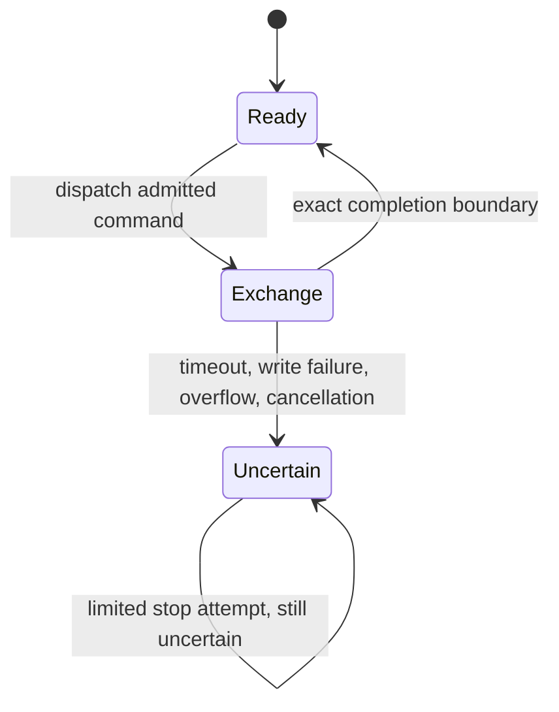
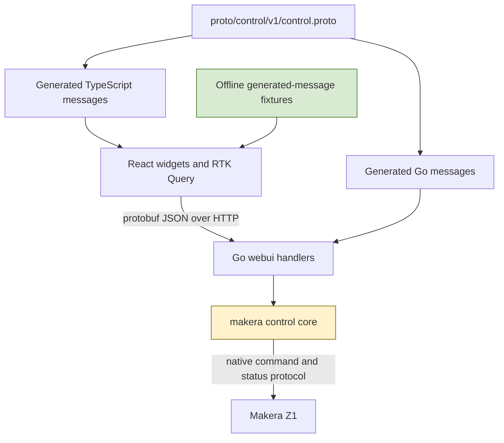
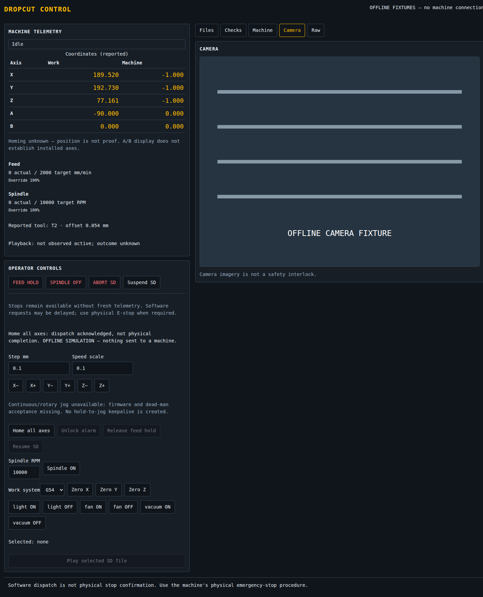
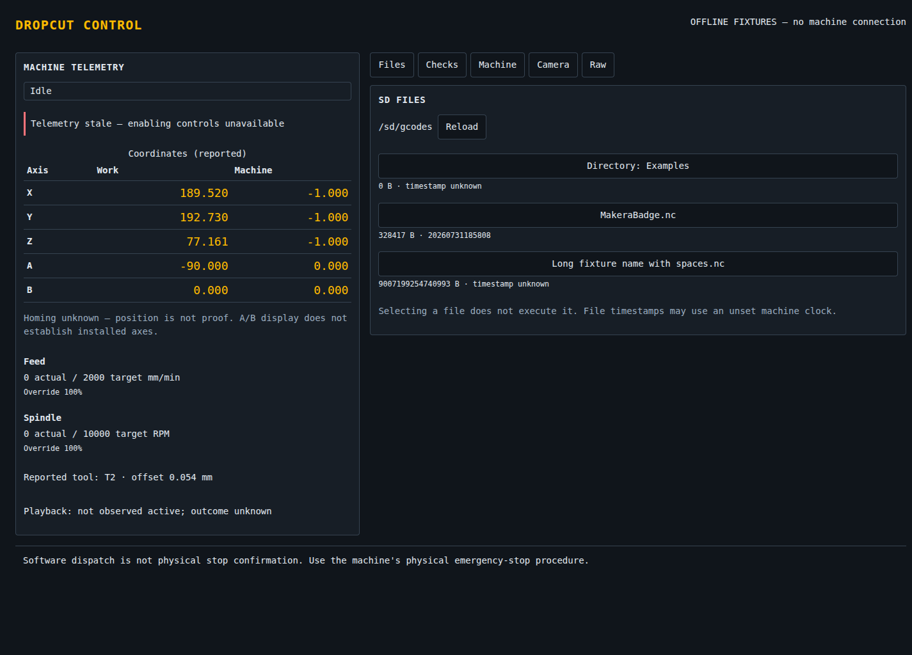
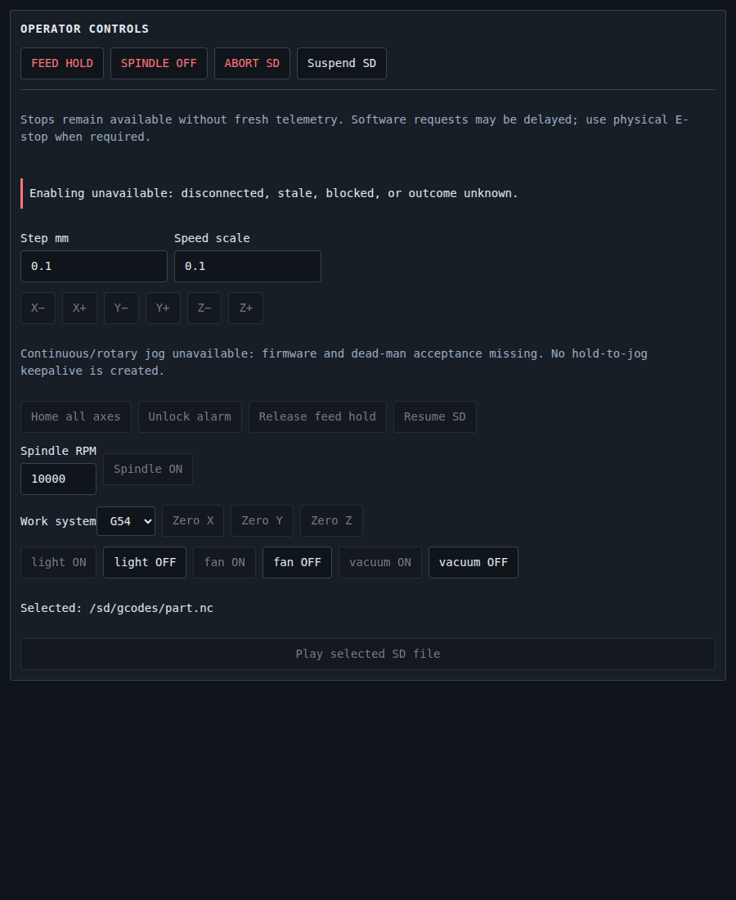
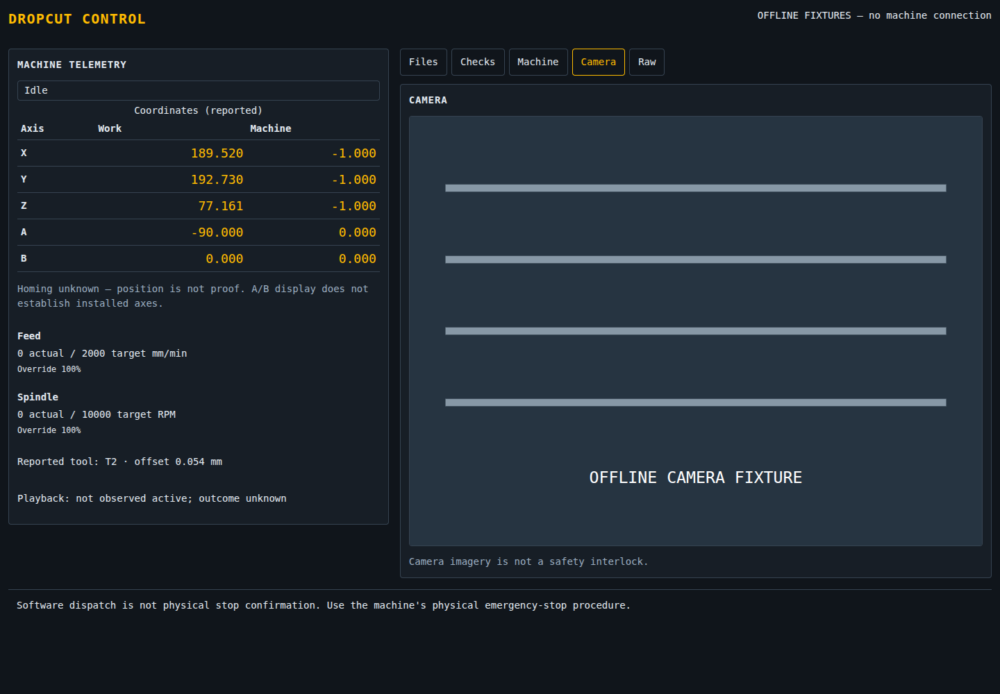
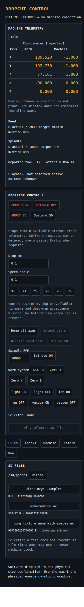
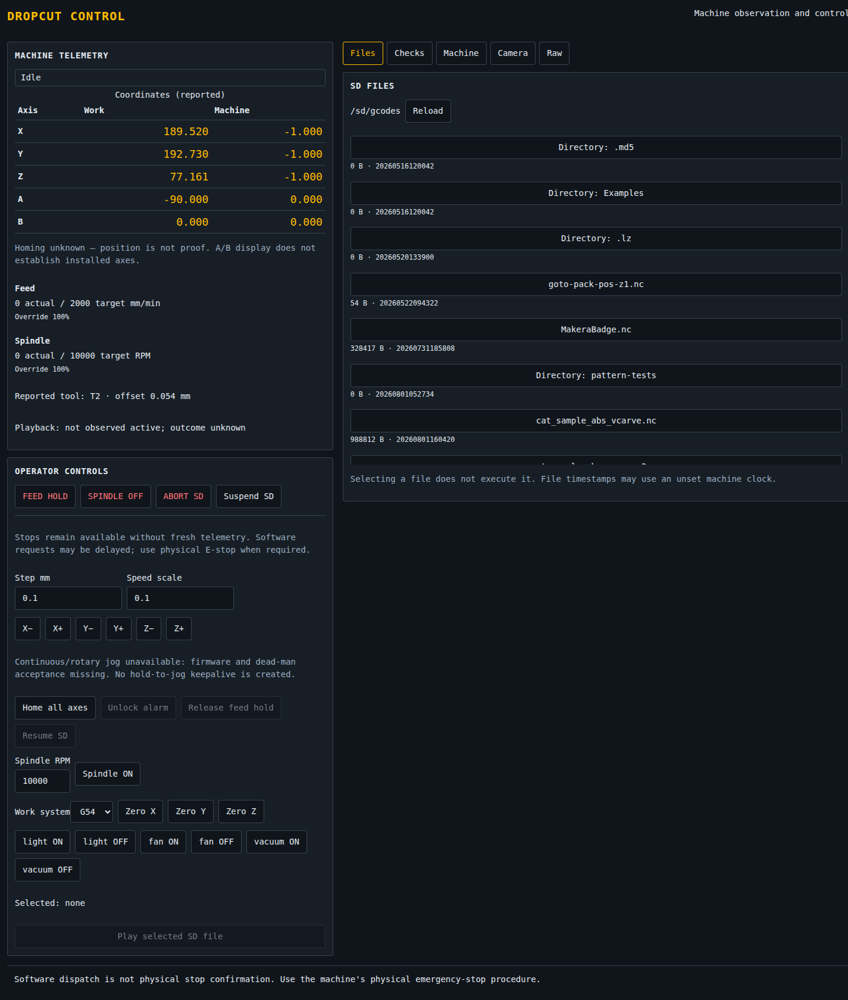
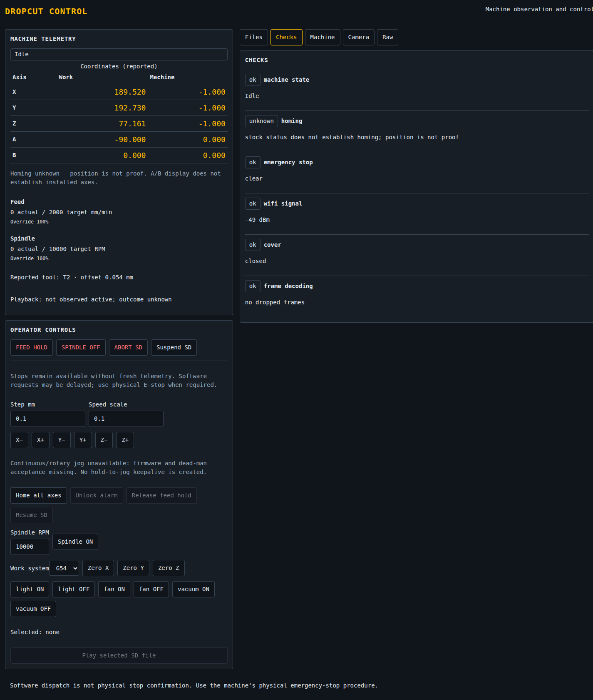
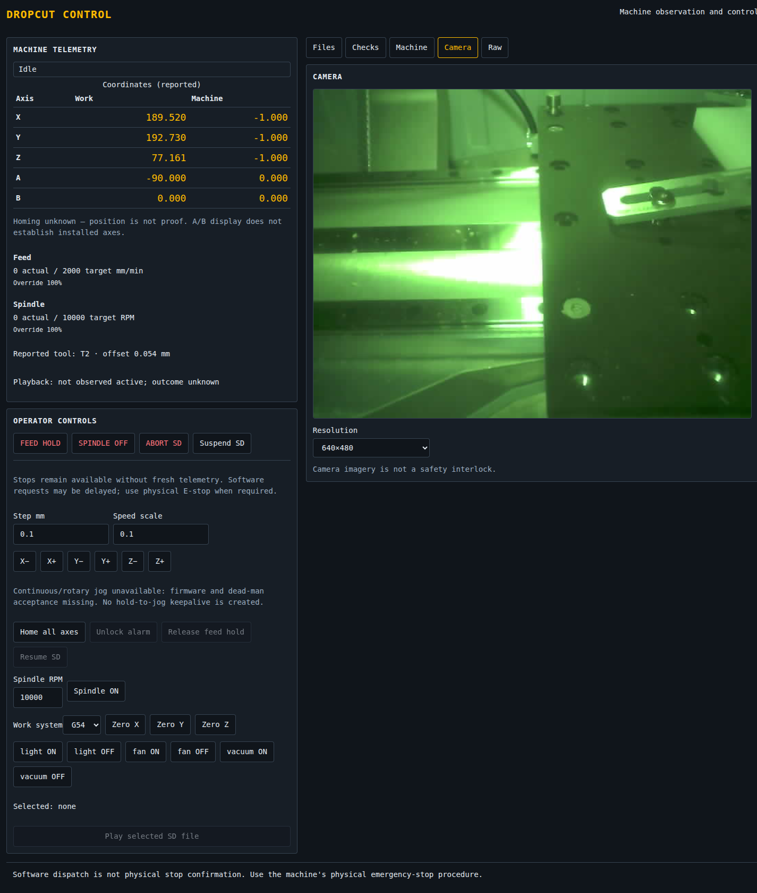

# Makera Z1 Control — Typed Interfaces and Explicit Uncertainty

A CNC controller can receive a successful HTTP response without learning whether the machine performed the requested operation. It can display an exact coordinate without knowing whether that coordinate has an established reference. It can lose its connection after dispatch and be unable to determine whether repeating the command would repeat a physical action. These are separate uncertainties, and a useful control interface must preserve their distinctions rather than convert them into a single success indicator.

This report explains the implementation of a typed React control interface for the Makera Z1, the Go changes that support it, its completed software validation, and its live deployment. It distinguishes read-only verification of the deployed application from physical acceptance of its motion and output controls. The central question is how information and authority move through the system: what the firmware actually reports, what the host can conclude, what the browser may request, and what each layer must refuse to infer.

This report was first written at checkpoint `8c4d997` and updated after the complete implementation pass at `ee9adfa`, documentation commit `d549070`, and the explicitly authorized live deployment on 2026-09-08 UTC. It covers MZ1-008 and the relevant MZ1-007 control-core work. It continues [[PROJ - Makera Z1 Control - What the Machine Does Not Say]], while keeping earlier hardware observations distinct from the new application's own deployment evidence.

> [!summary]
> - The replacement uses protobuf-defined HTTP JSON, generated Go and TypeScript messages, React components, RTK Query, and a small Redux UI slice. It does not replace the native machine protocol with gRPC.
> - Fourteen reusable widgets have 99 named Storybook scenarios. The render sweep completed in bounded batches; computed-style tests check every widget plus theme and mobile behavior. Fifteen frontend tests pass, including actual Go-generated JSON decoded by TypeScript.
> - Unknown outcomes block further enabling actions locally. Continuous jog is deliberately unavailable because the deployed firmware's command dialect and stop-on-missing-keepalive behavior have not been established.
> - React is now embedded in the Go server and deployed at `http://127.0.0.1:8080/`. Live status, identity, files, diagnostics, and a 640×480 camera stream were verified using read-only requests. No motion, unlock, output, offset or job command was sent during deployment.

## 1. What the project is actually changing

The active repository contains both a CAM application and a machine controller. The CAM application already lives in `apps/studio`; the active Go controller is the nested `makera-z1-cli` module selected by the workspace. The new application, `apps/control`, is a separate control interface. It is not a rewrite of the CAM editor, nor does this work establish that a CAM-generated artifact is safe to execute.

The original controller interface consisted of approximately 593 lines of browser JavaScript, 326 lines of CSS, and 195 lines of HTML in `makera-z1-cli/pkg/webui/static`. Its Go server already supplied status, identification, file listing, diagnostics, camera access, motion requests, and job lifecycle operations. The migration preserves those broad responsibilities while replacing the browser's untyped payload handling and direct DOM manipulation.

Preserving the responsibilities does not mean preserving every behavior. Several existing behaviors overstated certainty or allowed requests whose assumptions had not been validated. A correct migration therefore includes selective behavior changes: homing remains unknown, incomplete outcomes remain unknown, missing emergency-stop input fails enabling preflight, and continuous jog is refused rather than reproduced uncritically.

The implementation status after the complete pass is:

| Area | Implemented and verified | Remaining boundary |
|---|---|---|
| Application contracts | Pinned schema generation, raw-presence status construction, Go→JSON→TS fixtures, exact int64 handling | Several non-status responses still use validated map conversion |
| Observation interface | Independent panel errors, timestamp validity, live telemetry/files/checks/identity/camera | Broader long-duration operational observation remains separate |
| Operator controls | Typed confirmation, local single flight, pending-stop availability and uncertainty regressions | Physical motion/output acceptance and durable cross-client ownership are not claimed |
| Storybook | 99 rendered scenarios; refusal/pending notice states observed; fourteen characteristic CSS checks | This is not exhaustive visual or accessibility testing |
| Packaging | Reproducible committed React assets; actual Go-served demo; clean-module race/vet/build | Remote GitHub Actions execution remains unperformed |
| Deployment | Live server replaced under explicit authorization; read-only verification succeeds | No replacement-interface motion commissioning has occurred |

The earlier checkpoint temporarily combined new HTTP contracts with legacy embedded assets. That mismatch is resolved: `go generate ./pkg/webui` builds the React application and replaces the embedded static directory. The current server serves the corresponding generated JSON contract and frontend together. The earlier server remained untouched during development; only the later explicit “live deploy” instruction authorized its replacement.

## 2. Start with evidence, not with UI state

An interface needs a model of what it knows before it needs a component hierarchy. In this project, at least four different facts can appear during one operation:

1. The browser submitted an HTTP request.
2. The Go client dispatched a native command.
3. The command exchange produced an acknowledgement or response terminator.
4. The physical operation completed with the intended result.

These facts are not interchangeable. A later fact requires additional evidence; an earlier fact does not imply it. The same applies to observations. A position report is evidence of a reported position. It is not automatically evidence of homing, installed rotary axes, tool clearance, or a completed job.

### Position and homing are different properties

The stock firmware's `-1,-1,-1` machine position was particularly misleading. Earlier investigation established that it can occur both at boot and at the resting position after homing. Consequently, testing whether the coordinates equal that tuple cannot establish whether a position reference exists. Testing whether they differ from the tuple cannot establish it either.

The migration fixes a concrete server omission: `handleStatus` constructed an `AtRest` field but did not assign `st.AtRestPosition`. The new assignment repairs the reported at-rest property. It does not introduce a `homed` property. The Checks panel now reports homing as unknown rather than presenting movement away from the boot position as successful homing evidence.

The distinction can be written directly:

```text
reported_position = (-1, -1, -1)
    does not imply homed
    does not imply unhomed

reported_position != (-1, -1, -1)
    does not imply homed
```

This is not a limitation that TypeScript can remove. A type system can represent uncertainty correctly; it cannot supply missing firmware evidence.

### Absence must not become a clear emergency-stop input

The diagnostic parser exposes a Boolean emergency-stop value. Without a separate validity check, an absent diagnostic input can take the Boolean zero value and appear clear. The revised core preflight checks the raw diagnostic field before accepting the interpreted value:

```go
if _, known := d.Raw.At("I", 0); !known {
    add("emergency stop", false, true,
        "unknown: diagnostic input absent")
} else {
    add("emergency stop", !d.EStop, true,
        pick(!d.EStop, "clear", "engaged"))
}
```

The second Boolean passed to `add` marks this as a fatal preflight condition. Missing evidence therefore prevents an enabling operation. The diagnostic UI exposes the absence as unknown, and the unlock handler separately refuses an engaged or unknown input.

This correction is narrower than a complete diagnostic-validity model. Presence of one parsed field does not validate every possible value or every diagnostic field. The important improvement is that absence no longer automatically becomes permission at this specific decision point.

## 3. The control-core work underneath the interface

The UI migration follows MZ1-007, which changed command admission, exchange boundaries, and job-result interpretation. These changes matter because an accurately worded browser cannot repair a host client that sends ambiguous commands or treats an incomplete exchange as reusable state.

### Admission is based on complete command forms

The control-core work replaced permissive classifications with explicit read and stop forms. Command input must be a bounded printable ASCII line, and malformed or ambiguous input is rejected rather than partially interpreted as a lower-risk command. Numeric motion arguments receive finite-value checks, and mutable input slices used in coordinate operations are copied so that later caller mutation cannot change admitted intent.

The principle is that validation applies to the complete operation that will be dispatched. Recognizing a safe prefix is insufficient when additional words, modal commands, or line breaks can change the resulting operation.

### An incomplete exchange changes what the client may do next

The client now quarantines an uncertain connection after incomplete exchanges. Relevant causes include write failures, timeout, output overflow, and loss of the expected response boundary. Completion uses an exact command sentinel record rather than an arbitrary substring match. Output is bounded by both byte and message counts.

The key transition is:



The last transition is intentional. Attempting a stop does not restore the ability to attribute delayed responses to previous commands. Nor does a new TCP connection establish what an earlier physical operation did. The code's uncertainty state is per client; it is not a complete durable machine-supervision system.

### Inactive playback is not terminal success

`CheckPlaybackActive` returns success only in the sense that monitoring should continue while playback is observed active. When playback is not observed active, the code reports an unknown outcome rather than announcing successful completion. An inactive playback field can be consistent with completion, refusal, a job that never started, or insufficient observation.

The React telemetry panel retains that interpretation. Its wording is “not observed active; outcome unknown,” not “job complete.” This is a useful example of a semantic correction surviving a frontend rewrite: the new component does not simplify away the distinction established in the Go core.

## 4. Two protocols with separate responsibilities

The protobuf schema describes application HTTP payloads. The native Makera protocol remains the responsibility of the Go client. Introducing protobuf therefore does not require the mill to speak protobuf, does not add a gRPC service, and does not change camera frames into protobuf messages.



The source schema is `proto/control/v1/control.proto`, package `control.v1`. Buf generates Go messages into `makera-z1-cli/pkg/webui/gen/control/v1` and TypeScript messages into `apps/control/src/generated/control/v1`. Generation is pinned to Go plugin 1.36.5 and ES plugin 2.2.5; the TypeScript protobuf runtime is also 2.2.5.

### Structural agreement requires runtime decoding

Generated TypeScript interfaces alone would not validate a server response. The frontend checks `schemaVersion` and then calls the protobuf runtime's `fromJson` function. A payload with no supported version is rejected before it becomes ordinary query data.

Command constructors perform the reverse conversion: they construct generated messages and use `toJson` before passing the body to RTK Query. This matters because protobuf JSON has rules that ordinary JavaScript serialization does not reproduce automatically.

On the Go side, handlers that call `decodeBody` now select an endpoint-specific generated request message and decode with `protojson.Unmarshal`. The body is limited to 64 KiB. Unknown fields and malformed JSON fail instead of silently disappearing into a permissive body struct.

There is a qualification: not every mutating handler decodes a body. Several stop handlers do not need one, and the existence of `JogLeaseRequest` in the schema does not mean the old keep/stop handlers implement generation-scoped ownership. The helper's comment is broader than the actual route coverage. A complete audit must examine callers, not just the decoder.

### Direct status construction and remaining response conversion

The status handler now constructs `controlv1.StatusResponse` directly through `observedStatus`, and `encodeResponse` serializes generated messages without an intermediate map. Other handlers still produce domain structs and `map[string]any` values. `payload.go` chooses a generated response type from the value's type or distinguishing map keys, marshals the intermediate representation, normalizes exported field names, and validates it through protobuf decoding before writing canonical protobuf JSON.

This avoids supporting two external wire formats, but it does retain a conversion layer between existing domain representations and generated messages. Response selection by keys such as `version`, `files`, and `checks` is not a compile-time guarantee. A new handler shape can fail only when it reaches the boundary. Errors currently use `CommandResponse`, although a separate `ErrorResponse` is defined in the schema.

Extending direct generated-message construction to the remaining endpoints would make those choices explicit at each handler. The status path demonstrates that approach already; the remaining conversion layer is a maintainability limitation, not a second external wire protocol.

## 5. Presence and integer precision must survive the whole path

Consider two reports about a spindle:

```json
{"current": 0, "target": 10000}
```

```json
{"target": 10000}
```

The first reports an actual speed of zero. The second supplies no actual-speed observation. A UI that fills missing fields with zero makes the two reports indistinguishable. The schema therefore uses optional numeric fields for rates, tool number, and tool-length offset, and the widgets render absent values as unknown.

Declaring a field optional is necessary rather than sufficient. The initial `statusPayload` copied value-typed domain fields and therefore could erase presence before serialization. The final pass removed that structure from the status path. `observedNumber` reads the raw report field, returns nil for absence or nonfinite values, and otherwise returns a pointer to the observed value. `observedInteger` additionally rejects fractional and out-of-range values. Generated optional tool and rate fields therefore distinguish measured zero from missing observation.

Coordinates required a separate representation decision. A repeated protobuf vector has no interior missing-value slot. `observedAxes` retains the finite prefix of each raw vector and stops at the first absent or invalid element. Thus `[1, NaN, 3]` becomes `[1]`, not `[1, 3]` and not `[1, 0, 3]`: the converter neither shifts Z into Y nor manufactures Y. A three-axis report stays three-axis rather than gaining zero-valued A/B coordinates. The UI still warns that even reported A/B slots do not establish installed capabilities.

Playback is emitted only when the four expected tuple elements are present and valid integers. A partial P field is omitted rather than becoming a fabricated inactive/zero-progress message. This is deliberately conservative and still does not define terminal job success.

```text
native report: <Idle|F:0|T:2|MPos:0,0,0>
Go message:   feed.current = pointer(0), feed.target = nil
              tool = pointer(2), tlo = nil
              machine = [0, 0, 0]
TypeScript:   current === 0; target === undefined
              tool === 2; tlo === undefined
```

The cross-language fixture is produced by Go's native report parser and the same status-message/serialization functions used by the HTTP handler. `src/contract.test.ts` decodes that committed JSON using `fromJson`. Its absence, explicit-zero, partial, nonfinite and large-integer cases test one shared artifact rather than two independently handwritten expectations.

### Why a large file-size test is useful even for a small machine

The contract uses `int64` for file size and machine clock epoch. JavaScript numbers represent integers exactly only through `2^53 - 1`. The test value `9007199254740993` is intentionally beyond that limit. It is a precision test, not a claim about a plausible SD file on the mill.

The required conversion is:

```text
Go int64:       9007199254740993
protobuf JSON: "9007199254740993"
TypeScript:    9007199254740993n
rendered text: 9007199254740993
```

There is a less obvious loss point before the JSON reaches the browser. Decoding an intermediate Go JSON object into ordinary `any` values normally converts numbers to `float64`. The response conversion would then round the integer before protobuf could serialize it as a string. `payload.go` avoids that by calling `json.Decoder.UseNumber()`.

On the frontend, `toJson` must be used for generated payloads containing `bigint`; ordinary `JSON.stringify` is not an appropriate replacement. Redux's serializability predicate explicitly permits `bigint` while retaining its ordinary checks for other values. This is a conscious state representation choice, not a claim that every external Redux persistence or debugging tool automatically handles bigint.

## 6. Organizing the interface by responsibility

The requested layout uses atoms, molecules, and organisms, with one directory per reusable widget. Each directory contains a TSX implementation, a plain CSS file, a colocated Storybook file, and an export file. The hierarchy organizes component responsibilities; it does not determine state ownership.

```text
apps/control/src/
  design-system/index.css
  api/controlApi.ts
  api/commands.ts
  state/store.ts
  fixtures/machine.ts
  components/
    atoms/ActionButton/
    atoms/StateBadge/
    atoms/NumericInput/
    molecules/Panel/
    molecules/CoordinateReadout/
    molecules/RateReadout/
    molecules/ConfirmationCard/
    organisms/TelemetryPanel/
    organisms/DiagnosticsPanel/
    organisms/FilesPanel/
    organisms/MachinePanel/
    organisms/CameraPanel/
    organisms/ControlPanel/
    organisms/MachineDashboard/
```

Shared colors, spacing tokens, typography, focus treatment, and primitive layout styles live in `design-system/index.css`. Colocated CSS tunes individual widgets. Styling is scoped through the control UI root and its `data-styled` setting; stories also exercise light and unstyled presentations. The dashboard provides composition points such as custom header and controls content.

This structure is useful because a pure telemetry panel can be rendered with generated fixture messages without a Redux store or a machine connection. The transport-aware code belongs in `ConnectedControl`, not in the coordinate table or state badge.



*Figure 1. The completed React application served by the actual Go binary at `:8088/?demo`. The camera and telemetry are fixtures, and the visible acknowledgement explicitly says nothing was sent to a machine. Browser interception counted zero API requests during this check.*

### Three kinds of state

RTK Query owns remote observations and request lifecycle. The small Redux UI slice owns shared application selection: active tab, directory, selected filename, and polling interval. Component state owns local forms, confirmation content, pending presentation, and local uncertainty.

This division avoids copying query results into a second collection of hand-maintained state fields. It also avoids treating every input edit as global application state. Directory changes clear the selected file because a filename selected in one directory should not silently identify an execution target in another.

The production view polls status at the configured interval, initially one second, and checks every five seconds. It also updates a local clock once per second so freshness can change even when no new response arrives. Missing, malformed, or more-than-five-seconds-old status timestamps produce a stale state.



*Figure 2. A stale report remains visible as historical observation while the interface warns that it must not authorize enabling controls.*

The final freshness predicate rejects disconnected, absent, malformed, older-than-five-seconds and more-than-one-second-future observations. This closes the earlier far-future timestamp admission gap. It still compares browser and server wall clocks, so it remains a freshness policy with an explicit skew tolerance rather than a physical-readiness guarantee.

Files, identification and diagnostics now pass their own query failures to their respective panels. A healthy status report no longer hides a failed file listing or identification query. The shared error decoder also preserves structured RTK Query server refusal text instead of reducing every non-Error rejection object to “request failed.” These paths are covered by three additional observation/error tests.

## 7. From a click to an admitted operation

An enabling action first creates a typed command description. It does not immediately send the request. `ControlPanel` stores that description for confirmation, rechecks permission when confirmation occurs, and only then invokes its injected execution function.

The admission rule can be summarized as the following pseudocode, simplified from `ControlPanel.tsx`:

```text
allowed(command):
    if not command.enabling:
        return true

    require connected
    require not stale
    require not blocked
    require not locally_unknown
    require no enabling_request_in_flight

    if command is unlock:
        require state == Alarm
    else if command is release_hold or resume_SD:
        require state == Hold
    else:
        require state == Idle
```

The rule is a browser interaction policy, not a replacement for server validation or a proof of physical readiness. In particular, using `Hold` for both release-hold and SD-resume availability is a current UI policy that still needs validation against the distinct lifecycle semantics of these operations.

### Why both a ref and React state are used

`pending` state controls rendering, while an `inFlight` ref changes synchronously before awaiting the request. A second invocation can occur before React has rendered an updated disabled button. Checking the ref prevents that second enabling dispatch in the local component instance.

This protection is deliberately local. It does not prevent another tab or HTTP client from issuing a request, does not survive a reload, and does not serialize every server operation. Backend admission remains necessary.

The completion text is correspondingly precise: “dispatch acknowledged, not physical completion.” On an exception, a failed result, or a result containing an error, the component sets local uncertainty and blocks later enabling actions. It never automatically retries the original request.

A separate operator acknowledgement clears that local state without replaying anything. That acknowledgement is not protocol reconciliation. It neither removes a Go client's quarantine nor proves that the earlier operation finished. A durable recovery design would have to represent outstanding operations and reconciliation evidence outside the lifetime of a React component.

### Urgent requests must remain available, but availability is not stopping

The stop buttons remain enabled without fresh telemetry and while an enabling request is pending. A frontend regression test begins a never-yet-completed enabling request and verifies that spindle-off can still be submitted.

The Go change is equally specific: spindle-off bypasses `motionBusy` and sends `M5` through the command path instead of returning the ordinary overlapping-motion refusal. It does not acquire a physically preemptive channel. Existing command and server-session serialization can still delay it; firmware can also queue a text command in circumstances where the operator expects an immediate stop.



*Figure 3. Disconnected controls disable enabling operations while keeping stop requests available. The warning explicitly states that software requests may be delayed and are not a substitute for the physical emergency-stop procedure.*

A further limitation is that not all output-off handlers received the spindle-specific bypass. The accessory handler still uses the general motion route. Likewise, multiple stop completions and a pending enabling completion can update the same local notice. Per-operation result presentation would make those concurrent outcomes less ambiguous.

## 8. Why continuous jog was removed from the available controls

Continuous jog depends on more than sending repeated browser events. Its correctness requires agreement about the command dialect, keepalive interval, stop-on-missing-keepalive behavior, and ownership of a gesture across asynchronous requests. The pinned public stock source rejected a `-c` form emitted by the host; applicability to the deployed firmware was unresolved. The migration therefore does not assume continuous jog is supported.

The previous web path also had a concrete lock-order defect:

```text
handleJogStart holds jogMu
    -> withClient acquires mu
        -> failed session cleanup
            -> clearJogLocked tries to acquire jogMu again
```

A separate browser race could revive keepalives after the user released the control but before an asynchronous start request completed. Fixing only the lock order would not establish correct gesture semantics, and fixing only the browser race would not validate the firmware dialect.

The implemented decision is refusal before session locks or machine I/O. The replacement has bounded XYZ step controls and states that continuous and rotary jog are unavailable. No hold-to-jog keepalive loop is created. The backend regression holds both relevant locks while calling the refused start path and verifies that the handler returns without trying to acquire either lock.

This is not a completed continuous-jog lease implementation. The schema contains a gesture identifier, but support would require additional work: generation-scoped start/keep/stop semantics, rejection of obsolete keepalives, release-before-start tests, and physical validation of the firmware contract. The report should not confuse a reserved message field with an implemented concurrency protocol.

## 9. Offline execution is an architectural property

The Vite development entry mounts `OfflineDemo` by default. Production can also mount that fixture view with `?demo`. The connected component is a separate mount, and the development configuration has no proxy to the live mill server.

Storybook builds the same reusable widgets against generated-message fixtures. The preview rejects API and external fetch requests, removes inherited proxy configuration, and supplies a restrictive content-security policy. The camera fixture is an inline SVG rather than a stream URL. Unit tests reject unexpected fetches, and the dashboard navigation test verifies that switching to the camera fixture produces no request.



*Figure 4. The corrected camera fixture has explicit monospace text, image containment and shared-token styling. It remains an SVG fixture, not hardware evidence.*

The camera review exposed two defects that successful rendering had not detected. Text inside an SVG loaded through an image element does not inherit the surrounding document's font. Separately, dashboard selectors such as `.control-ui .MachineDashboard > header` required an ancestor theme root even though the dashboard itself was the theme root. Storybook's extra wrapper accidentally satisfied that selector and hid the standalone failure.

The correction gives dashboard stories exactly one theme root, scopes header/navigation/footer rules directly to that root, and explicitly styles the SVG's own text. `scripts/05-check-widget-css.js` now tests a characteristic computed property for each widget, confirms that unstyled mode actually removes layout styling, verifies the light background, and checks mobile camera containment. These tests establish more than the presence of rendered DOM, while still not claiming exhaustive design review.

These measures have different scopes. The mock execution function prevents fixture controls from submitting commands. The absence of a proxy prevents a local API path from forwarding to the mill. The fetch guard and CSP help expose accidental external dependencies. None should be described as a universal machine-network sandbox or a replacement for reviewing what the development process starts.

The real camera path remains part of the Go application. The production composition now wires the resolution callback and displays failures from the typed resolution request. Live deployment verified the camera stream but did not change its resolution: a displayed selector is not evidence that its mutating operation was exercised.

## 10. What the tests and screenshots actually establish

There are 99 named Storybook scenarios across fourteen widgets. The count includes default, themed, unstyled, and state variants; it is not a count of 99 independent behavioral tests. An initial sweep lost its tool connection. After reconnection, four bounded batches completed all 99 render checks, and the refusal/pending stories reached their expected notice states. The later computed-style checks were repeated against the rebuilt final application.

The original eight frontend tests cover:

- Exact bigint representation and missing fields, together with rejection of missing schema versions.
- Offline navigation, including an inline camera fixture and no fetch calls.
- Homing and completion wording that preserves uncertainty.
- Clearing file selection when the directory changes.
- Confirmation followed by uncertain failure without automatic retry.
- A stop request while an enabling request is pending.
- Invalidating confirmation when telemetry becomes stale.
- Empty numeric input and the absence of a continuous-jog gesture path.

Seven further tests bring the frontend total to **15**: four consume Go-generated contract fixtures and three cover structured errors, freshness and independent panel error presentation. Typecheck and the production/Storybook builds pass.

Go tests cover response shapes, strict decoding, exact integers, raw observation presence, continuous-jog refusal without session locks, spindle-off's busy bypass, unsupported axes/cover bypass, embedded assets, unknown routes, and guards on the actual HTTP mux. The final complete controller module passes `GOWORK=off go test -race ./... -count=1`, `GOWORK=off go vet ./...`, and `GOWORK=off go build ./...`. Buf lint/generation produces no binding drift, and repeated asset generation produces no embedded-file drift.

Earlier MZ1-007 validation separately recorded two bounded fuzz runs totaling 208,475 executions. Those remain evidence for the earlier core work; no new fuzz run is implied by the migration's final test results. The new GitHub Actions workflow is configured, but no remote workflow result is claimed.

The first five screenshots were captured from static Storybook at `2026-09-07T16:32:58Z` through `16:32:59Z`. They remain historical fixture evidence. Corrected camera images were subsequently captured after CSS checks; the actual embedded Go demo and, later, the live deployment have separate images and provenance. Previously visited static Storybook URLs once loaded older resources during recapture; fresh revision queries and verification of the new SVG source prevented those stale images from being presented as the correction.



*Figure 5. The mobile view preserves the complete observation and control interface in a single scrolling layout. The full-page capture exposes the substantial vertical length; a future ergonomic review should consider the visibility of urgent actions while the operator is reading lower panels.*

The screenshot files are copied into this note's `_assets` directory so that the report remains self-contained. Fixture, embedded-demo and live images are labeled separately. The initial mobile figure remains a historical full-dashboard layout example; the deployment figures below document the actual live application.

## 11. From a reproducible build to a live read-only deployment

A successful bundler invocation establishes only that assets can be produced. The final pass therefore tested the package that serves them: Go's actual HTTP handler, its referenced JS/CSS files, unknown API and asset paths, and mutation guards. The HTML entry receives a no-store policy; responses receive no-referrer and nosniff policies. Unknown paths return 404 rather than accidentally returning application HTML.

The asset builder runs Vite, verifies the built index, copies the result to a staging directory, and only then replaces the embedded static directory. This ordering prevents a failed frontend build from deleting the last usable assets. The built files are intentionally committed so a normal Go checkout can compile without Node. CI regenerates them and checks for drift. The final production output was 379.48 kB of JavaScript, 119.12 kB gzip, and 5.69 kB of CSS, 1.44 kB gzip.

### Independent module validation exposed a hidden dependency

The workspace build succeeded, but the first `GOWORK=off` test failed because the CLI imported Glazed and Cobra without declaring them. A local replacement pointed to a neighboring Glazed checkout, and the workspace supplied dependencies that an independent checkout could not resolve. This was a pre-existing packaging defect rather than a React compile failure.

The correction pins the versions actually present in the workspace: Glazed v1.4.3 and Cobra v1.10.1. Removing the local-only replacement and running module tidy made the complete controller module pass race tests, vet and build with workspace resolution disabled. A workspace build and an independent-module build answer different reproducibility questions; testing both prevented the new CI workflow from depending on an untracked neighboring checkout.

### Verify the binary without using the mill

Before live deployment, a separate Go process ran on port 8088 with the deliberately non-machine device address `127.0.0.1:1`. Opening `/?demo` mounted the fixture application. Browser interception observed no API requests during a fixture confirmation and camera navigation, while computed styles confirmed the same single-root layout used in Storybook.

A second check mounted the connected component but intercepted every API request. It observed status, identity, files and diagnostics queries and exactly one confirmed home body, `{"confirm":true}`, which the browser mock fulfilled without reaching a server mutation handler. The harness initially lacked a `URL` constructor in its execution scope; corrected path extraction returned the expected records, with residual errors from the earlier callbacks also emitted. This check verifies frontend request construction, not homing or server-side machine execution.

### The authorized live restart

Only after the operator requested “live deploy” was the existing server replaced. The first pre-deployment status request returned HTTP 503. A subsequent read succeeded and reported Idle, zero actual feed and spindle RPM, no observed active playback, and the existing coordinate values. The cause of the initial 503 was not established; it is retained as an observation rather than explained speculatively.

The old executable was copied for rollback, the running process received a graceful interrupt, and the port was confirmed free. The replacement was started with the same loopback listener and the same configured machine address:

```sh
GOWORK=off go run ./cmd/z1ctl serve \
  --addr 127.0.0.1:8080 \
  --device 192.168.0.55:2222 \
  --protocol makera
```

The new process runs in tmux `z1-react-live`. A local rollback executable was retained at `/tmp/mz1-pre-react-5a4j7F/z1ctl`; this temporary artifact is not a durable release-management system and no rollback was needed.

At `2026-09-08T02:02:14Z`, the replacement returned the generated contract with `schemaVersion: 1`, `state: "Idle"`, `atRest: true`, unchanged machine/work coordinates, zero actual feed/RPM and zero dropped frames. The legacy response immediately before replacement had reported `at_rest: false` for the same position. The new value demonstrates the repaired assignment; it still establishes nothing about homing.

```json
{
  "schemaVersion": 1,
  "connected": true,
  "state": "Idle",
  "atRest": true,
  "machine": [-1, -1, -1, 0, 0],
  "work": [189.52, 192.73, 77.1609, -90, 0],
  "feed": {"current": 0, "target": 2000, "override": 100},
  "spindle": {"current": 0, "target": 10000, "override": 100},
  "drops": 0
}
```

*Selected fields from the post-deployment response; this is not the entire report or a physical-readiness assertion.*

### Live verification and its limits

The browser was configured to block every non-GET/HEAD API request before opening the deployed page. Status, identity, SD files and diagnostics all returned HTTP 200 and rendered in the replacement interface. The camera stream produced a real 640×480 image. The camera tab was closed after capture; no resolution change was requested. Verification screenshots were captured by `2026-09-08T02:03:39Z`.



*Figure 6. The deployed Go/React application reads the real machine's telemetry and SD file listing. Selecting or executing a program was not part of deployment validation.*



*Figure 7. The live diagnostic panel retains unknown homing rather than deriving it from the resting coordinates.*



*Figure 8. The actual 640×480 camera stream in the deployed interface. The green tint is present in the captured frame; no camera calibration or image-quality conclusion is claimed. This is distinct from the labeled SVG fixture in Figure 4.*

A later read again reported Idle, unchanged coordinates, zero actual feed/RPM and zero drops. No motion, unlock, spindle/output, work-offset or job command was sent during deployment. Read-only status and image evidence do not prove tool clearance, homing, stopping latency, or safe program execution. Those remain separate physical acceptance tasks requiring explicit authorization.

The remaining engineering boundaries are also explicit: remote CI has not been run, local uncertainty is not durable cross-client operation ownership, some response construction remains map-based, accessory-off requests retain general motion-path behavior, concurrent result notices can overwrite one another, and URL-token exposure deserves broader authentication work. These are not concealed by calling the scoped software migration complete.

## 12. The reusable engineering conclusions

The most useful result of this work is a more precise division of responsibility. Protobuf describes what a payload can express. Runtime decoding checks whether received JSON conforms to that description. The parser determines whether an observation was present. The control core decides whether an exchange is still attributable. The browser distinguishes pending, acknowledged, refused, and unknown outcomes. None of these responsibilities can be replaced by the others.

Several practical rules follow:

- Optional fields preserve uncertainty only if every earlier representation also preserves presence.
- A timeout after dispatch does not authorize retry; it creates an outcome that requires reconciliation.
- An enabled stop button proves availability of a request path, not a bound on physical stopping time.
- A generated field for gesture identity is not a lease protocol until ownership transitions and obsolete requests are implemented and tested.
- Offline fixtures are most reliable when the connected application is a separate mount rather than a live application with a remembered operator convention.
- A component catalog, a passing unit suite, a rendered screenshot, and a hardware acceptance result are different evidence classes and should remain labeled as such.

The replacement now implements the cross-language contract path, reproducible Go packaging and the completed software/browser validation pass, and it has passed live read-only verification. Remaining work is operationally distinct: remote CI execution, broader visual/accessibility review, durable recovery authority, and separately authorized physical acceptance. Deployment does not remove uncertainty that the firmware cannot resolve.

## Source guide and continuation references

The implementation repository is `/home/manuel/workspaces/2026-08-11/cnc-control-dropcut/dropcut-studio`, branch `task/cnc-control-dropcut`. The completed implementation is `ee9adfa`, with final offline documentation in `d549070`. This vault update does not assert that the implementation branch was pushed or that remote CI ran.

| Source relative to the repository | What to read there |
|---|---|
| `proto/control/v1/control.proto` | Application message fields, optional presence, int64 values, and request shapes |
| `buf.yaml`, `buf.gen.yaml` | Schema policy and pinned Go/TS generation |
| `makera-z1-cli/pkg/webui/payload.go` | Request schema selection, indirect response conversion, exact-number handling |
| `makera-z1-cli/pkg/webui/webui.go`, `status.go` | Current embedded React assets, raw-presence status construction and query handlers |
| `makera-z1-cli/pkg/webui/internal/buildassets/main.go` | Reproducible Vite build and staged replacement of embedded assets |
| `makera-z1-cli/pkg/webui/status_test.go`, `testdata/control-contract.json` | Go-generated cross-language observation fixtures |
| `makera-z1-cli/pkg/webui/static_test.go` | Actual embedded routes, assets and mutation guards |
| `makera-z1-cli/pkg/webui/motion.go` | Mutation guards, busy admission, refused continuous jog, unlock checks |
| `makera-z1-cli/pkg/webui/payload_test.go` | Codec and precision regressions |
| `makera-z1-cli/pkg/webui/control_regression_test.go` | Lock-free refusal and spindle-off busy bypass |
| `makera-z1-cli/pkg/makera/client.go` | Exact exchange completion and uncertainty quarantine |
| `makera-z1-cli/pkg/makera/preflight.go` | Fatal unknown emergency-stop diagnostic |
| `makera-z1-cli/pkg/makera/jobctl.go` | Playback observation versus terminal success |
| `apps/control/src/App.tsx`, `main.tsx` | Offline/connected separation and production composition gaps |
| `apps/control/src/api/` | Generated request construction and RTK Query decoding |
| `apps/control/src/state/store.ts` | UI state ownership and bigint serializability policy |
| `apps/control/src/components/organisms/ControlPanel/` | Confirmation, local single flight, uncertainty and stop presentation |
| `apps/control/src/design-system/index.css` | Shared presentation tokens and primitives |
| `apps/control/src/controls.test.tsx`, `dashboard.test.tsx`, `contract.test.ts`, `observations.test.tsx` | Fifteen frontend tests |
| `.github/workflows/control-ui.yaml`, `Makefile`, `apps/control/README.md` | CI definition, developer commands and operational limits |
| `apps/control/.storybook/` | Offline preview configuration and request restrictions |

The MZ1-008 design and implementation diary are under `ttmp/2026/09/07/MZ1-008--react-typescript-redux-protobuf-control-ui-and-storybook-migration/`. MZ1-007's core design, regression evidence, and diary are under `ttmp/2026/09/06/MZ1-007--z1-control-core-admission-transaction-and-lifecycle-correctness/`.

The implementation sequence is recorded by `65eb005` (design), `99ef66c` (protobuf boundary), `875bc6f` (read-only dashboard), `50096d7` (confirmed controls), `8c4d997` (initial Storybook checkpoint), `ab28cbc` (CSS corrections), and `ee9adfa` (presence preservation and completed Go packaging). Documentation commit `d549070` records the offline audit. The live restart and read-only verification happened afterward under explicit operator authorization.

Related project history:

- [[PROJ - Makera Z1 Control - Reverse-Specifying a CNC Wire Protocol]]
- [[PROJ - Makera Z1 Control - Building and Validating the Client]]
- [[PROJ - Makera Z1 Control - Crossing into Motion]]
- [[PROJ - Makera Z1 Control - What the Machine Does Not Say]]
