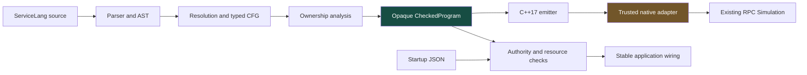
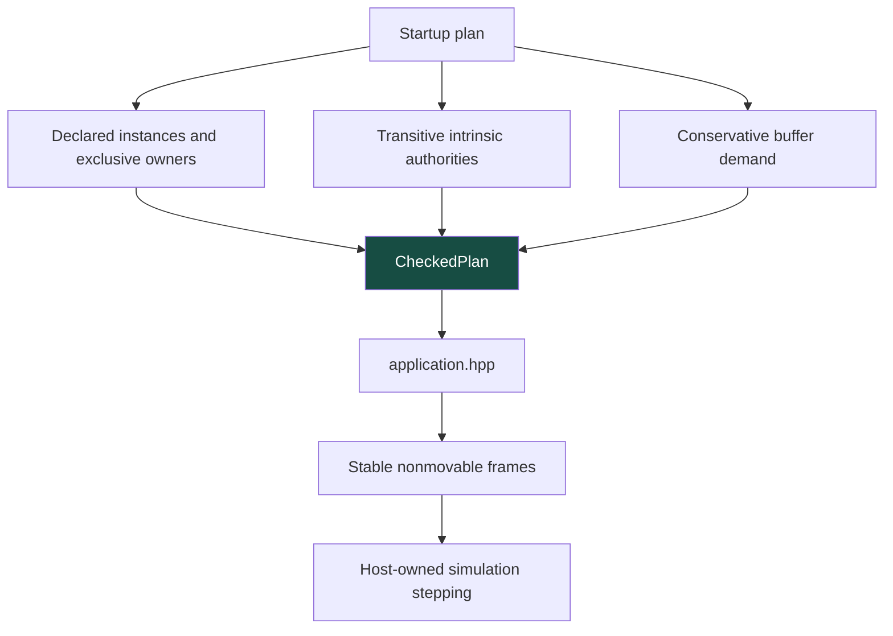

# ServiceLang: An Ownership-Checked Language Compiled to C++

ServiceLang is a small host compiler that checks explicit resource ownership and a fixed RPC endpoint protocol before emitting C++17. Its purpose is not to replace the existing radio runtime. It makes selected obligations of that runtime expressible in source programs and rejects violations before native compilation. The first application is a generated Sensor client running against the existing handwritten RPC server in a deterministic simulation.

> [!summary]
> ServiceLang implements parsing, resolution, value/protocol typing, control-flow ownership analysis, C++ emission and checked component wiring. Generated and handwritten clients agree in four saved simulation configurations. The compiler and native adapters remain trusted; this is not a formally verified operating system or a hardware deployment.

This article explains the implemented system. The companion [[ARTICLE - ServiceLang Mathematics - Ownership Dataflow and Semantic Preservation|mathematics article]] derives its main analysis and refinement obligations. [[PROJ - ServiceLang Compiler Explorer - Making Compiler Decisions Inspectable|The Compiler Explorer article]] explains the interactive editor and inspection API.

## 1. Begin with the runtime obligation

The existing C++ runtime already distinguishes an endpoint that may start a call from an endpoint representing an outstanding call. `ReadyClient::start` conditionally changes ownership: successful admission transfers a Pending endpoint, while some rejected inputs preserve Ready. `PendingCall::poll` can retain Pending, return a terminal result with Ready, or return a terminal result without Ready after invalidation.

These are not ordinary functions returning unrelated scalar values. Each call changes which authority the caller still possesses. Discarding a returned owner, using the old endpoint after transfer or assuming every terminal result restores Ready can invalidate a binding or corrupt application reasoning.

C++ move-only wrappers prevent straightforward copying, but they do not make every application path correct. An occupied optional can be overwritten. A live endpoint can be silently destroyed on a branch. The caller can fail to distinguish a timeout from proof that the remote action did not occur. ServiceLang adds a deliberately restricted source language in which these cases become explicit checks.

The connection to Singularity is the use of language-enforced ownership, contracts and declared authority. It is not an assertion that FreeRTOS tasks are verified software-isolated processes. Remote LoRa uncertainty is also different from a reliable local channel. The design preserves those differences rather than borrowing stronger guarantees from the original system's terminology.

## 2. A complete vertical path

The implementation lives in `labs/singularity-servicelang` within the repository shown in frontmatter. The workspace directory carries an older date; the language work itself began on September 6, 2026.



The compiler is written in Go without external Go dependencies. The native side uses the existing C++17 libraries, with exceptions and RTTI disabled. This keeps the new trusted surface identifiable: the source checker, the emitter and a narrow adapter, not another implementation of retransmission, duplicate suppression or radio ownership.

The source archive accompanying this article contains the [complete first-party lab](_assets/servicelang-20260907/source/labs/singularity-servicelang/README.md), its native prerequisite headers and a [hash manifest](_assets/servicelang-20260907/manifest.json). It excludes generated binaries, node_modules and third-party books.

## 3. What the source language permits

A module imports a closed capability inventory and declares ordinary functions. Parameters and return types are explicit. Owned parameters use `own`, and transfers from named owners use `move`.

```text
use sensor;

fn begin(own ready: Ready, now: Time) -> StartResult {
    return rpc_start(move ready, now, 8000);
}
```

The first executable language includes I32, Bool, Time, Unit and a fixed inventory of records and variants. It supports let bindings, assignment, conditionals, exhaustive matches, calls, returns, selected record fields and scalar comparisons. Checked addition returns an explicit result instead of inheriting signed-overflow behavior from C++.

The restrictions are substantial and intentional. There are no source loops, recursive calls, raw pointers, first-class borrows, partial moves, arbitrary native calls or user-defined resource aggregates. Generic protocol/server generation is not present. Unsupported syntax and types are rejected rather than approximately translated.

Source reading and parsing are bounded: 64 KiB input, bounded parser nesting and at most 256 storage slots per function. Identifiers are ASCII; comments and source text may contain UTF-8. Diagnostics use source byte offsets, which later matters when the same compiler is exposed through a JavaScript editor.

A source name is not an ownership identity. Resolution assigns slot IDs, and branch environments determine which IDs are visible. The implementation rejects local shadowing, including ambiguous reuse that might make a consumed owner appear to have become live merely because its spelling reappeared.

## 4. Result types carry the ownership contract

The fixed SensorRPC inventory exposes admission and polling as resource-bearing variants:

```text
StartResult = Started(Pending)
            | Rejected(Ready, I32)
            | Unavailable(I32)

PollResult = Waiting(Pending)
           | Complete(CallResult, Continuation)

Continuation = Reusable(Ready) | Lost(I32)
```

CallResult is copyable and includes Ok, RemoteError, NotSent, Unknown and RuntimeFault. Continuation is owned. A terminal result and a reusable endpoint are therefore separate facts.

This representation prevents an important false inference. Unknown means the caller cannot establish the remote outcome. It does not mean the driver has released its transmit allocation, and it does not mean an endpoint necessarily remains usable. Conversely, loss of the endpoint does not erase a meaningful terminal result.

The generated Sensor function makes every polling alternative visible:

```text
match rpc_poll(move pending, now) {
    Waiting(next) => { return Again(move next); }
    Complete(result, continuation) => {
        match result {
            Ok(sample) => { observe(1, sample.value); }
            RemoteError(error) => { observe(2, error); }
            NotSent => { observe(3, 0); }
            Unknown => { observe(4, 0); }
            RuntimeFault(fault) => { observe(5, fault); }
        }
        return Finished(move continuation);
    }
}
```

An exhaustive match is not proof that the application interprets every outcome sensibly. Source code could intentionally report an inappropriate number. The type checker establishes that alternatives and owners are accounted for; it does not infer an application's intended user-facing meaning.

## 5. Lowering makes evaluation order visible

The parser builds source-oriented expressions and statements. Lowering resolves calls and types, creates storage slots and divides control flow into basic blocks with explicit terminators. Expressions become ordered operations before ownership analysis.

Consider `sink(move buffer, length(buffer))`. ServiceLang evaluates arguments left to right. Lowering first moves buffer into an argument temporary. The later length call then attempts to read a consumed original owner and is rejected. The compiler never delegates this question to native argument-evaluation rules.

The accepted formulation reads first:

```text
let size = length(buffer);
return sink(move buffer, size);
```

Restricted reads are intrinsic-only. `length` can inspect a Buffer without retaining a reference, but the source language cannot store that read access, return a reference or pass it to an arbitrary function. This provides a useful operation without introducing a general borrow checker.

Branches produce separate successors and explicit joins. A branch that returns has no edge to a subsequent join. Matches produce variant-specific edges: only the fields of the selected alternative become live in that branch. These details are semantic, not graphical conveniences for the explorer.

## 6. The ownership checker accounts for temporary slots too

For each slot, the analysis tracks possible states from uninitialized, live and consumed. Incoming states join by set union. A use requires definitely live ownership. Initializing an owned destination requires that it cannot already be live. A normal return must leave no unconsumed owner behind.

A move lowered into two steps illustrates why temporaries matter:

```text
argument_temporary = move source_owner
result = consuming_call(argument_temporary)
```

The first operation consumes the original and defines the temporary. The second consumes the temporary. If the checker considered only user-named variables, it could miss a dropped temporary returned by a call or introduced by a constructor.

A small branch example exposes the precision boundary. If both arms close Ready, the join sees Ready as consumed. Each arm's private temporary is either uninitialized or consumed, which is safe. If only one arm closes Ready, the join contains both live and consumed possibilities, and the strict initial checker rejects it.

The implementation solves the finite dataflow equations before reporting diagnostics. During solving, invalid operations still have totalized transfer behavior so propagation can converge. The second pass checks the required preconditions on stabilized inputs. Without that pass, an invalid operation could create plausible downstream facts and accidentally reach emission.

This is a tested implementation of a finite analysis, not a universal ownership theorem. The mathematical article explains the additional assumptions needed to move from status accounting to unique native resource authority.

## 7. The native representation is explicit

The backend emits optional storage for slots, declares storage before block labels and follows the checked CFG with native control flow. Source functions have deterministic native names, recorded in metadata. This avoids keyword collisions and leaves the mapping inspectable.

Moving an optional does not disengage it. The runtime helper therefore extracts and resets explicitly:

```cpp
template<class T>
T take(std::optional<T>& slot) noexcept {
    sl::require(slot.has_value());
    T value = std::move(*slot);
    slot.reset();
    return value;
}
```

This helper relies on the existing wrappers' move constructors emptying the old authority. Reset must destroy only a moved-from wrapper, not abandon the newly transferred lease. Owned destinations receive an occupancy assertion before emplace, supplementing the static overwrite check.

Calls materialize their arguments in separate statements. Resource variants are inspected by discriminant, taken as a whole and then destructured into the active fields. Inactive alternatives never become simultaneous owners. The generated code does not depend on an optimizer to reconstruct source ordering.

The target restrictions are the same ones used for native host checks: C++17, warnings as errors, no exceptions and no RTTI. Compiling successfully is necessary but not a proof of native undefined-behavior freedom.

### A small lexical bug with semantic consequences

Final review found that decimal source literals were initially emitted using their original spelling. That is incorrect for strings such as `0010`: C++ interprets the leading zero as octal. A spelling such as `0008` is worse—it is accepted as decimal source but invalid as a C++ octal literal.

The fix parses the value in base ten and stores a canonical decimal spelling for lowering, while preserving the original source span. The focused native regression verifies 0008, 0010 and -0010 through generated execution. This is an example of a backend correctness issue that type checking alone cannot prevent: both source and target may have integer types while disagreeing on the represented value.

## 8. The adapter preserves failure ownership

`svc_runtime.hpp` translates the existing conditional-mutation API into consuming source results. For start, it checks a positive millisecond interval and overflow-safe conversion to an absolute deadline before calling the native endpoint. A prevalidated rejection returns Ready. Native Accepted must provide Pending. Unexpected native failure retires the remaining wrapper and returns Unavailable rather than treating every Invalid as retryable.

For poll, Waiting returns the still-live Pending. Completion decodes the result and independently inspects whether the native API returned Ready. A valid Sensor payload becomes Sample; malformed success shape becomes RuntimeFault. No branch manufactures a replacement lease or resets request numbering to recover usability.

The host must supply genuinely live endpoint parameters and keep the Client and Pool alive longer than every wrapper. Source checking cannot make a malicious native caller obey these conditions. They are explicit trusted-boundary assumptions.

The observation sink is bounded to 64 copyable entries and counts dropped observations. It is not optical readback, proof of remote execution or a physical-driver trace. This distinction is important when the same values are shown in the explorer and discussed in reports.

## 9. Component plans check startup authority separately

A source module can import an operation without every component being authorized to use it. The startup plan closes that distinction by selecting entry functions and declaring the authority their transitive call closure requires.

A plan contains one to four fixed SensorRPC client instances and exactly one component owner for each. It validates declared endpoint names, exclusive ownership, entry signatures, authorities and general-slot budgets. Duplicate JSON keys and unknown fields are rejected, avoiding ambiguous manifest interpretation.



Buffer demand is conservative: count allocation calls across both branch arms and transitive callees, then use the larger begin/poll demand for each component. The sum of declarations must fit the application's twelve general slots. This is a capacity check, not a separately enforced per-component allocator quota. The fixed entry result types cannot carry Buffers between invocations.

The native frame owns its Context and endpoint state, but not the simulation driver. The host advances simulations and invokes polling. Admission additionally checks host quiescence; Ready alone is not permission to start physical work.

Startup failure requires precise wording. Invalid static plans publish no application artifacts. Runtime validation rejects bad or duplicate hosts before acquiring leases. If a later acquisition is unavailable, no Application is published, but earlier acquisitions are retired through their normal destructors. This is fail-closed cleanup, not transactional rollback. The current public runtime has no operation that can honestly restore all earlier leases to their exact pre-startup state.

## 10. Verification at the appropriate level

The central native experiment compares the generated client with a handwritten client that calls the existing Ready/Pending API directly. Both use the same saved Simulation configuration and step/poll schedule. The reference does not route through the ServiceLang adapter.

| Model case | Outcome | Attempts | Completion time, model µs | TX retained at completion |
|---|---|---:|---:|---|
| Success | Ok | 1 | 195073 | No |
| No RF permission | NotSent | 0 | 8000000 | No |
| All replies lost | Unknown | 3 | 6277248 | No |
| One-millisecond deadline | Unknown | 1 | 1000 | Yes |

The comparison includes value, attempts, every simulator counter, completion time, step count, cleanup count and reusable continuation. Both paths audit resources after quiescence. The short-deadline case needs three further cleanup steps after returning Unknown, demonstrating why logical completion cannot release a driver's allocation prematurely.

Direct endpoint checks cover recoverable rejection, NotSent/Lost and Unknown/Lost after invalidation, and stale Ready becoming Unavailable. The generated application test reverses component/instance order and verifies that the right component receives each host's result. It also exercises the documented acquisition-failure policy.

These are deterministic model results. They are not radio latency measurements, an exhaustive schedule exploration, source-language soundness or proof of compiler correctness. The original physical console campaign establishes prerequisites for a different artifact; it is not reused as evidence that generated code ran on hardware.

## 11. Building and inspecting the result

From the archived or live lab directory:

```sh
make simulation
make application
make check
make serve
```

`make check` covers native simulation/application execution, Go formatting and vet/tests, the frontend build, TypeScript and formatting. It does not flash firmware. Standalone CLI commands are:

```sh
servicec check examples/sensor.svc
servicec dump-ir examples/sensor.svc
servicec emit-cpp examples/ownership.svc --out /tmp/new-output
servicec emit-app examples/sensor.svc examples/sensor.plan.json --out /tmp/new-app
```

The destination must not exist. The publisher stages all files, reserves a fresh destination and atomically publishes the completed `artifacts/` directory. Metadata includes source and compiler-source hashes, source-to-native mappings and the required adapter ABI. A different source string cannot be attached to an already checked program.

The [final local CI log](_assets/servicelang-20260907/evidence/54-final-local-ci.txt) records integration acceptance. The [decimal-literal regression](_assets/servicelang-20260907/evidence/59-decimal-literal-regression.txt) records the later targeted correction. Unaffected tests were not repeatedly expanded into additional campaigns.

## 12. What remains intentionally outside the implementation

Generic protocol/server generation, borrowing, arbitrary source loops, higher-order functions and verified isolation are not implemented. The original on-device application mode was optional and has not been activated. The current component wrapper depends on Simulation, not LiveBench; moving it to hardware requires a reviewed adapter that preserves the existing single driver owner, admission guards, finite RF permission and stopped handoff.

Those boundaries are not reasons to discount the implemented result. The project has crossed the meaningful threshold from syntax translation to a checked language executing over an existing resource-sensitive runtime. The next question is whether a proposed extension preserves the explicit contracts already present, not whether more syntax can be accepted.

## Source and reading trail

- [Compiler specification](_assets/servicelang-20260907/source/labs/singularity-servicelang/SPEC.md).
- [Parser](_assets/servicelang-20260907/source/labs/singularity-servicelang/compiler/internal/compiler/syntax.go), [typed lowering](_assets/servicelang-20260907/source/labs/singularity-servicelang/compiler/internal/compiler/lower.go), [ownership checker](_assets/servicelang-20260907/source/labs/singularity-servicelang/compiler/internal/compiler/check.go).
- [C++ emitter](_assets/servicelang-20260907/source/labs/singularity-servicelang/compiler/internal/compiler/cpp.go), [runtime adapter](_assets/servicelang-20260907/source/labs/singularity-servicelang/runtime/svc_runtime.hpp), [component plan checker](_assets/servicelang-20260907/source/labs/singularity-servicelang/compiler/internal/compiler/plan.go).
- [Generated/native comparison harness](_assets/servicelang-20260907/source/labs/singularity-servicelang/host/simulation.cpp).
- Hunt and Larus, *Singularity: Rethinking the Software Stack*, OSR 41(2), 2007, [original paper](https://www.microsoft.com/en-us/research/wp-content/uploads/2016/02/osr2007_rethinkingsoftwarestack.pdf). Its architectural ideas motivate the project; its guarantees are not inherited by this implementation.
