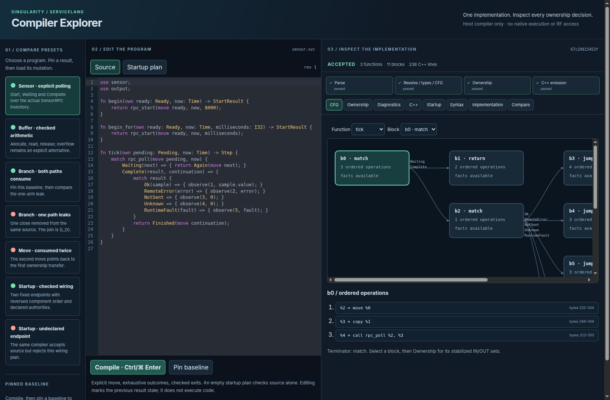
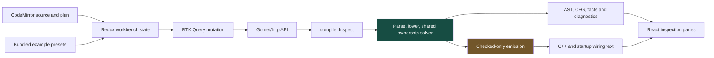
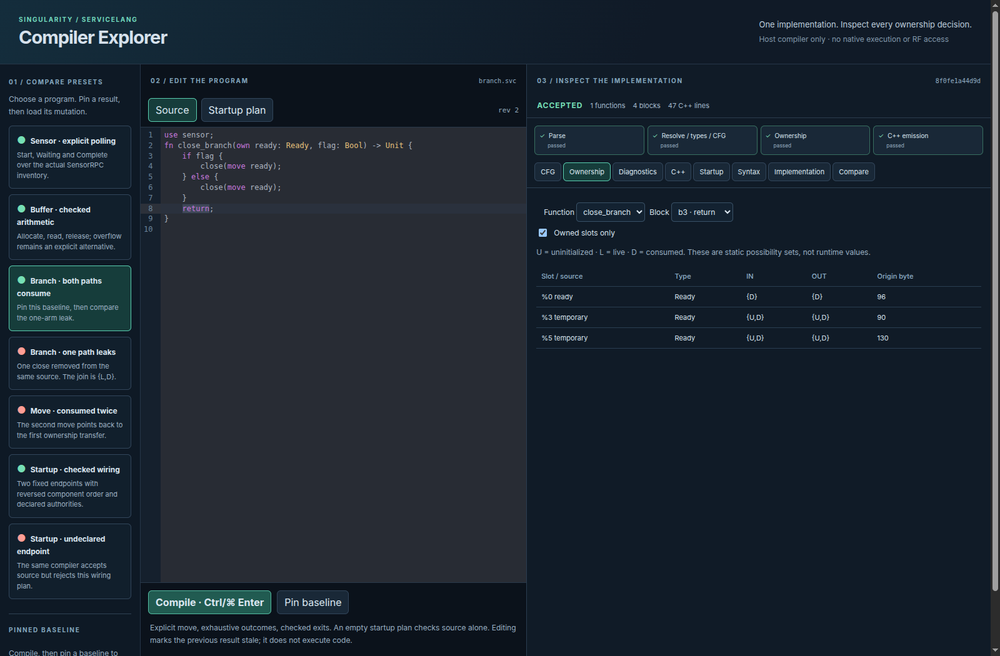
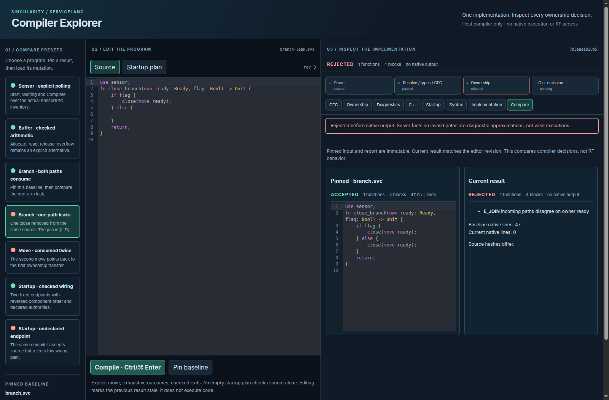
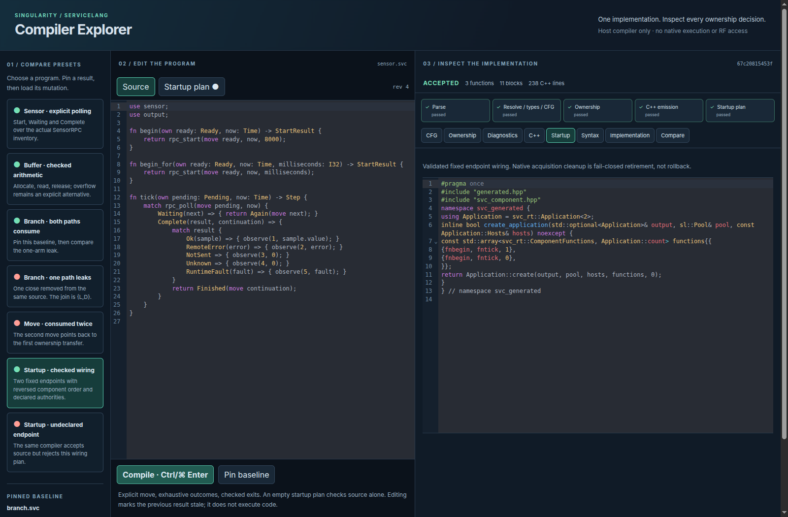
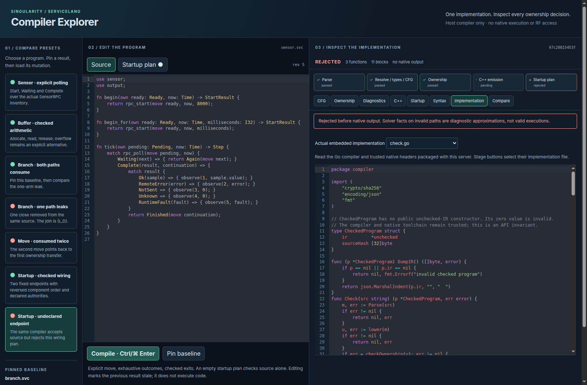
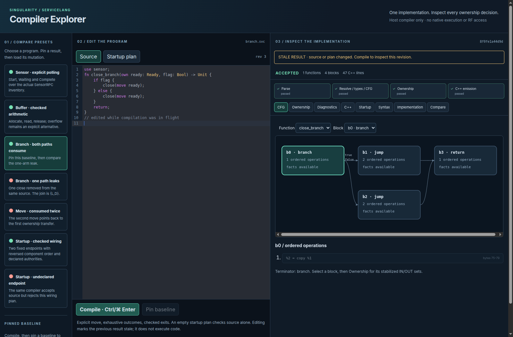
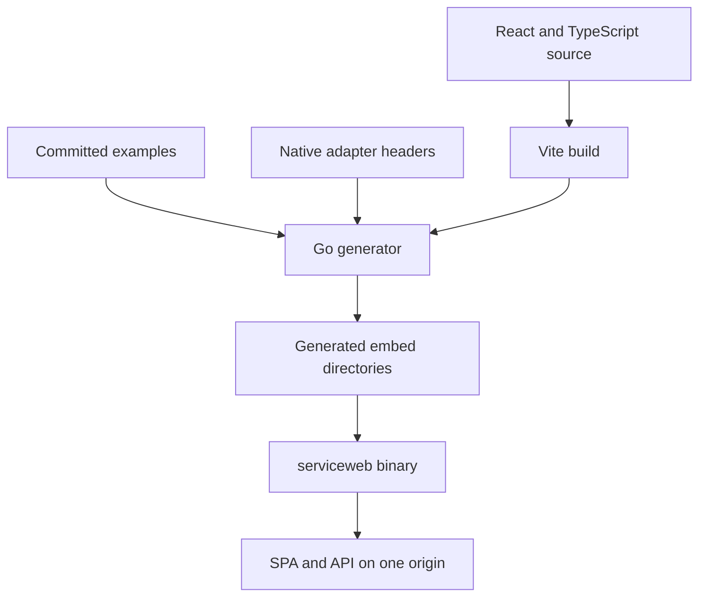

# ServiceLang Compiler Explorer: Making Compiler Decisions Inspectable

A compiler becomes easier to understand when a reader can edit a small program, observe a rejection and inspect the exact graph and state facts responsible for that decision. The ServiceLang Compiler Explorer provides that interaction without implementing another checker in JavaScript. It is a React/TypeScript interface around the same Go compiler used by the command-line tool.

> [!summary]
> The explorer combines CodeMirror editing, comparison presets, Redux Toolkit state and the actual compiler inspection API. It shows parser output, typed control flow, ownership sets, diagnostics, generated C++ and startup wiring. It does not execute emitted native code or access radio hardware.

The live development endpoint is `http://127.0.0.1:4786`; it is local to the development machine, not a public hosted service. The committed build produces one embedded Go server binary that can run from another directory. This article explains its implementation and records actual browser interactions. The [[PROJ - ServiceLang - An Ownership Checked Language Compiled to C++|language/compiler report]] and [[ARTICLE - ServiceLang Mathematics - Ownership Dataflow and Semantic Preservation|mathematics report]] provide the underlying semantics.



## 1. The design constraint: observe one implementation

A teaching interface can easily become misleading if it animates rules that merely resemble the compiler. A hand-authored ownership diagram might accept a program the real checker rejects, ignore a temporary slot or assume a terminal poll always returns Ready. Such a display would explain a different system.

The explorer instead exposes a read-only observation path through the existing implementation. Parsing, lowering and ownership transfer still occur in Go. The frontend arranges their results and translates source positions into editor selections. It does not decide which move is legal, calculate its own ownership fixed point or synthesize native code.

This distinction also matters for rejected programs. The user should be able to inspect the CFG and solver facts that led to rejection, but those facts must not authorize emission. The backend therefore separates an inspection report from an opaque CheckedProgram. A report can contain rejected-path information; native output requires successful acceptance.

The initial useful workflow is small: load a valid branch example, pin its result, remove one close, compile again and compare. That interaction teaches more than a static list of diagnostic names because the graph, source and changed state are visible together.

## 2. Architecture and trust boundaries



The server exposes three principal endpoints: presets, implementation source and analysis. The SPA and API share one origin in the production build. No Go HTTP framework is used; routing is standard `net/http.ServeMux`.

Source and startup-plan strings are each limited to 64 KiB. Request bodies are capped at 1 MiB, filenames are bounded and only one analysis executes at a time. A busy server returns 429 rather than allowing repeated large inspections to accumulate without limit. This is a local workbench boundary, not a multi-tenant service architecture.

The filename in an analysis request identifies the submitted source for diagnostics and generated comments. It is not a path the server opens. The implementation endpoint exposes only bundled compiler files and native headers, not arbitrary host paths. No endpoint invokes g++, runs a generated executable, opens serial devices or grants RF permission.

The C++ execution evidence belongs to the host test harness described in the language report. The browser's acceptance badge means compiler acceptance, not successful remote RPC execution.

## 3. The inspection API reuses the checker

`compiler.Inspect` calls the same Parse and lower functions used by Check. It constructs view records for functions, slots, operations and terminators. Ownership solving then uses the existing implementation with an observation callback that receives stabilized incoming ledgers.

The callback records the data needed by the UI. It does not replace the validation pass. If ownership checking fails, the report includes the diagnostic and available facts but no Output. If source succeeds, an optional startup plan is checked before application wiring is emitted. An invalid plan can therefore reject the overall request after source analysis succeeds.

Each function view contains actual lowered slot IDs, source spans, ownership classification and blocks. A block contains its ordered operations, terminator, successor edges and IN/OUT facts. This structure allows the frontend to display the compiler's own representation without parsing a debug log or reverse-engineering C++ output.

Inspection has a separate cap of 100,000 fact cells. That cap limits presentation amplification; it does not skip compiler checks. A large report explicitly marks limited inspection. Facts may also be absent for unreachable blocks or functions not visited before an earlier rejection. The UI states these alternatives instead of displaying an empty table as proof that no owners exist.

The API's acceptance/emission relationship has a focused regression: accepted inspection output must match ordinary Check followed by EmitCPP, while rejected inspection must contain no native output. This checks the integration boundary without creating a second language evaluator.

## 4. Two kinds of state in Redux

The workbench stores editable input and the most recent compiler report separately. That separation is necessary because a report belongs to a particular input revision, not to whatever text happens to be in the editor when a response arrives.

The slice tracks source, filename, plan, revision, selected preset, current report, report revision, pending request identity, error state, baseline and view selection. RTK Query handles HTTP requests and its own query state; the workbench slice holds the user-facing relationship among input and results.

On an edit, the revision increments. On compilation, the request captures its revision and request ID. A response can update the workbench only if it belongs to the tracked request. Even then, if the editor has changed, the report revision differs from the current revision and the UI labels it stale.

```text
edit:
    revision += 1

compile:
    capture input, revision and request identity

response:
    ignore if request identity no longer matches
    store report with its captured revision

render:
    stale := report revision differs from editor revision
```

The code does not erase every previous result immediately when the user types. Keeping a previous graph visible is useful, provided it is unmistakably stale. Stale results cannot be pinned or used to jump into the newer source buffer. Otherwise a valid old byte span could highlight an unrelated region of edited text.

The baseline is another independent snapshot. Pinning copies the current input and report into a preserved comparison value. Loading a mutation does not rewrite that baseline. This is the central comparison contract, not just a layout detail.

## 5. CodeMirror is controlled without confusing programmatic changes with edits

The React wrapper owns an EditorView instance and destroys it on cleanup. Current callbacks are stored in a ref so the view can call the latest React handlers without being recreated for every render. Source/plan changes arriving through props are applied to the existing document.

A suppression flag distinguishes those controlled prop updates from genuine user edits. Without it, loading a preset could be reported back as another edit, increment the revision again or trigger a feedback loop. User edits still flow through the normal update listener into Redux.

Source and plan use separate editor modes. ServiceLang highlighting is a lightweight lexical presentation; the actual parser remains the Go implementation. JSON, C++ and Go modes support the other panes. Read-only views show emitted code, parser output and implementation source without pretending that editing them would affect compiler acceptance.

The source editor supports the visible compile button and the Ctrl/Command-Enter shortcut. Compilation remains explicit rather than firing an unrestricted sequence of analyses for every keystroke. Preset selection compiles its captured input, making the basic learning workflow immediate.

### Byte offsets and UTF-16 selections

Go spans count UTF-8 bytes. CodeMirror positions count UTF-16 code units. These coordinate systems agree on ASCII but differ for accented characters and supplementary Unicode characters.

The wrapper walks code points, counts their UTF-8 byte lengths and advances by their JavaScript string lengths. That maps a compiler byte offset to a CodeMirror position without assuming one byte equals one editor unit.

The browser check used a comment containing `café` and an emoji before a double move. The compiler's primary span was bytes 84–94, and its related span was 65–75. Clicking both locations selected exactly `move ready`. The test verifies the visible interaction, not merely a helper's arithmetic in isolation.

## 6. The CFG pane is derived from real edges

The graph renderer receives the compiler's blocks and edges. It assigns columns by graph depth and rows within each column. The current source language has no loops, and lowering creates the acyclic control flow used by this layout. The graph is not intended as a general layout algorithm for arbitrary cyclic IR.

Nodes show block identity, terminator kind, ordered operation count and whether facts were recorded. Edges display actual variant names or branch labels. Clicking a block selects its operations and available source location; the Ownership pane then inspects the same selected block.

The diagram remains scrollable when a program exceeds the visible area. Visual review found that the initial column gap could crowd longer labels such as RuntimeFault. The gap was widened, and the final browser measurement found a maximum transition-label width of about 65 pixels within a 103-pixel label allowance. This was a concrete readability fix, not a claim that every possible graph layout is optimal.

A graph is useful only if the underlying values are explained. Operations are listed in their real lowering order, including temporary slots and consuming calls. A reader can move from a source expression to its lowered operation, then to the solver facts and finally to emitted code.

## 7. Ownership tables expose possibility sets

The ownership view filters to owned slots by default but can show all slots. Its legend distinguishes U, L and D, and its rows display stabilized IN/OUT sets and diagnostic-origin offsets.



In the accepted branch example, Ready is consumed on both paths. Each branch-private temporary joins as `{U,D}` because it was either never created or consumed. The table makes this valid nonsingleton state visible. A display that reduced every slot to one colored live/dead flag would hide the analysis's actual abstraction.

Removing the close from one arm produces `{L,D}` for the original owner and E_JOIN. The mathematical reason is explained in the companion article, but the explorer provides the direct experiment: the source mutation, graph and diagnosis are produced by the same compiler.

Facts on rejected paths need a warning. The solver totalizes transfers while finding its fixed point, so a later temporary may have plausible-looking facts even when an earlier operation was invalid. The report does not make those paths valid executions. The interface states this and withholds native output.

## 8. Comparing a positive program with a nearby mutation

The baseline workflow was verified in the browser:

1. Load the branch where both arms consume Ready.
2. Select its join and inspect the ownership table.
3. Pin the accepted source/report.
4. Load the one-arm leak mutation.
5. Open comparison.



The preserved baseline has one function, four blocks and 47 C++ lines. The mutation has E_JOIN and no native output. The source hashes differ. This comparison is deliberately narrower than a textual diff tool: it compares compiler decisions while preserving the exact baseline input.

A line-count inconsistency found during visual review was fixed by sharing the native line-count calculation. Small presentation details matter here because users are expected to compare artifacts quantitatively. Counting the final newline differently in two panes would introduce a false difference.

Presets come from bundled committed examples. The one-arm leak is derived by removing a known close from the same branch source, rather than maintaining an unrelated imitation. The HTTP tests check that every preset's actual result matches its stated expectation.

## 9. Startup plans and implementation source remain inspectable

The startup preset supplies the same source with a checked plan for two fixed endpoints. A successful request adds generated application wiring. Changing an endpoint reference to an undeclared name produces E_PLAN_ENDPOINT and no wiring.



The UI does not hide the native factory's failure contract. Startup validation and runtime acquisition are different operations; an unavailable later acquisition retires earlier leases rather than providing transactional rollback. The generated code pane is accompanied by that limitation.

The implementation pane displays compiler Go source and the trusted native headers embedded in the server. Stage buttons select the corresponding implementation file. This makes the tool useful for learning how the implementation works, not merely experimenting with source syntax.



The snapshot is bounded to deliberately packaged source files. There is no user-controlled filesystem browser. The distinction permits transparent implementation inspection without exposing arbitrary files from the development machine.

## 10. A delayed response must not become current by accident

A real browser check delayed an actual compiler response while the source was edited. When the response arrived, it remained marked stale and pinning stayed disabled. The test did not replace the compiler with a fabricated acceptance response.



The first attempt at this browser probe failed because the tool sandbox did not provide a global setTimeout. The corrected probe used Playwright's wait mechanism, removed the abandoned route and reloaded before retrying. This was a test-harness issue, not an application failure, and the distinction is preserved in the diary.

The responsive check used a 430-pixel viewport and measured a 415-pixel document width, with no horizontal page overflow. Narrow screens move presets into a horizontal strip and stack editor/analysis sections. The primary design remains a desktop comparison workbench; the check is not an exhaustive mobile accessibility audit.

## 11. Packaging a repeatable single-binary workbench

`make web` installs the frozen pnpm lockfile, invokes go generate and builds serviceweb. The generator builds the Vite application and copies frontend output, examples and native headers into ignored embed directories. The server embeds those files at build time.



Starting the binary from `/tmp` verified that static serving does not depend on the source checkout as its working directory. The standalone servicec command does not import webui and can still be built without frontend artifacts. For development HMR, Vite proxies API requests to the Go server.

The repository has a broad build-artifact ignore pattern that initially excluded the source directory `cmd/build-web`. A narrow exception was added and the generator explicitly committed. This matters for reproducibility: a local successful build is not enough if its build program is absent from the committed tree.

The current asset is roughly 811 kB minified and 263 kB gzip, including React/RTK and editor grammars. Vite's size advisory is retained rather than suppressed. The local workbench has no claimed bundle-size or loading-performance SLA; future delivery constraints could justify splitting editor modes, but no unsupported performance claim is made here.

## 12. Verification and preserved evidence

The focused checks cover shared-checker agreement, seven HTTP presets, SPA/API routing, missing assets, JSON content type and rejection without native output. Browser checks cover editing, Unicode diagnostics, baseline comparison, startup denial, implementation viewing, stale responses and responsive layout. Final local CI includes native simulation/application tests, Go vet/tests, TypeScript, formatting and the production frontend build.

The initial HTTP test caught an actual ServeMux registration error: method-specific `GET /` conflicted with methodless `/api/`, because neither pattern was more specific across both method and path. GET-specific API fallback guards resolved the conflict. Registration order was not the solution; ServeMux specificity considers the patterns themselves.

A missing favicon and crowded graph labels were also corrected. The final inspected page had no console or page errors. These are specific observations, not a blanket claim that every browser, input size or accessibility interaction has been exhaustively tested.

The [browser evidence record](_assets/servicelang-20260907/evidence/56-p6-browser-evidence.json) preserves source hashes, selected spans, ownership sets and viewport measurements. The [integration log](_assets/servicelang-20260907/evidence/54-final-local-ci.txt) and [asset manifest](_assets/servicelang-20260907/manifest.json) connect the reports to real artifacts. Screenshots were captured before the final decimal-literal correction; their inputs contain no affected leading-zero literals, and the displayed UI structure and ownership results are unchanged by that fix.

## 13. Reproducing and extending the explorer

From the [frozen lab source](_assets/servicelang-20260907/source/labs/singularity-servicelang/README.md):

```sh
make serve
# open http://127.0.0.1:4786
```

Start code review with [Inspect](_assets/servicelang-20260907/source/labs/singularity-servicelang/compiler/internal/compiler/inspect.go), the [HTTP server](_assets/servicelang-20260907/source/labs/singularity-servicelang/compiler/internal/webui/server.go), the [Redux slice](_assets/servicelang-20260907/source/labs/singularity-servicelang/web/src/store.ts), the [CodeMirror wrapper](_assets/servicelang-20260907/source/labs/singularity-servicelang/web/src/CodeEditor.tsx) and [graph renderer](_assets/servicelang-20260907/source/labs/singularity-servicelang/web/src/Graph.tsx).

An extension should preserve three boundaries. Compiler acceptance must remain authoritative in Go. A rendered result must remain attached to its own input revision. Inspection must remain separate from executing native output or controlling hardware. New animations or panes are useful only when they continue to explain the actual implementation under those constraints.
