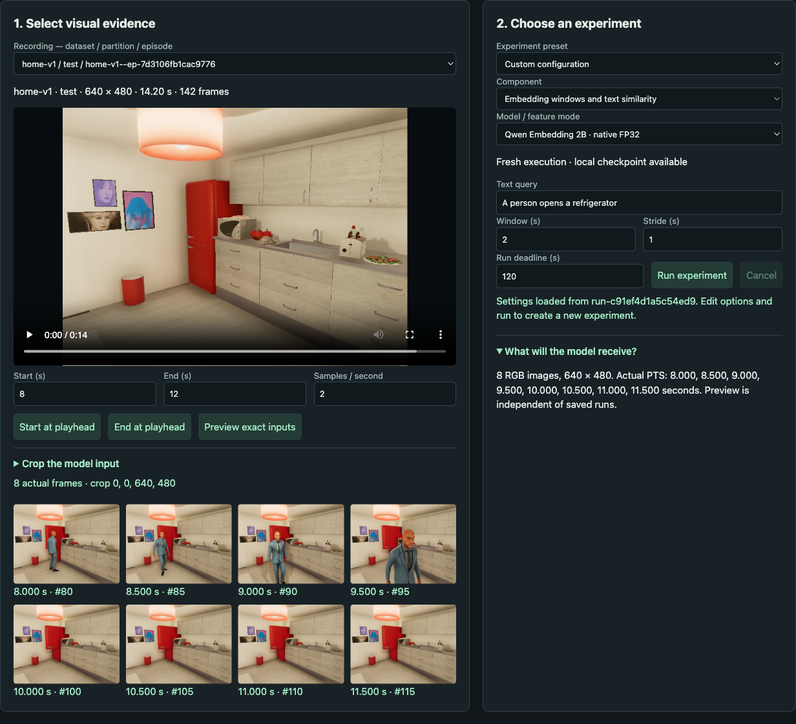
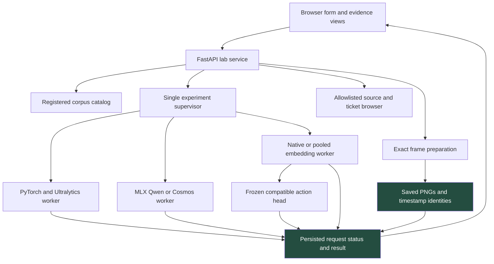
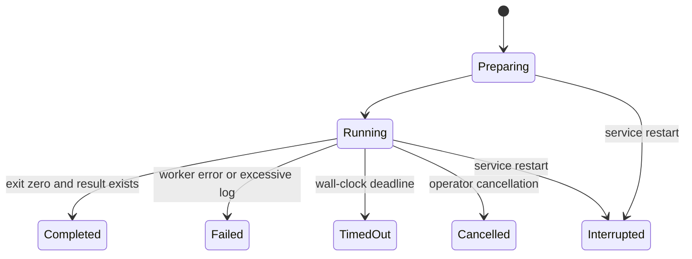
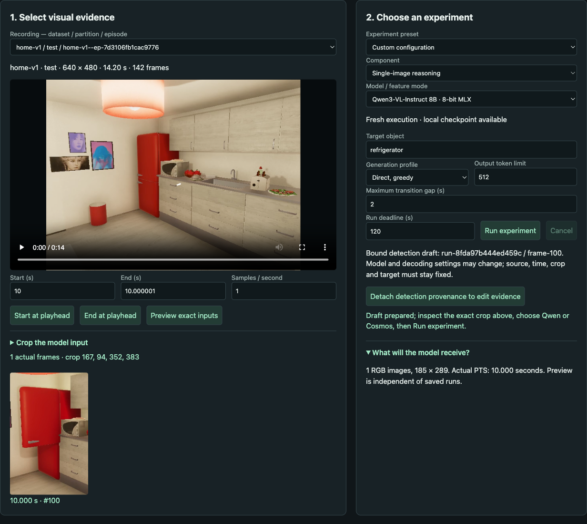
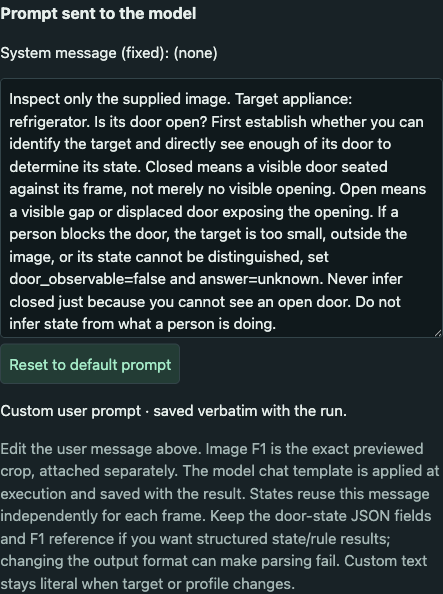
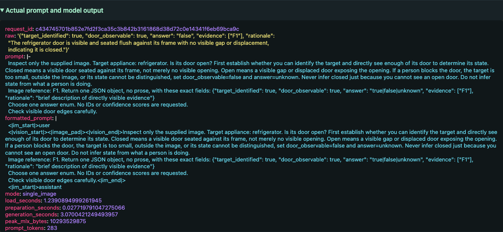
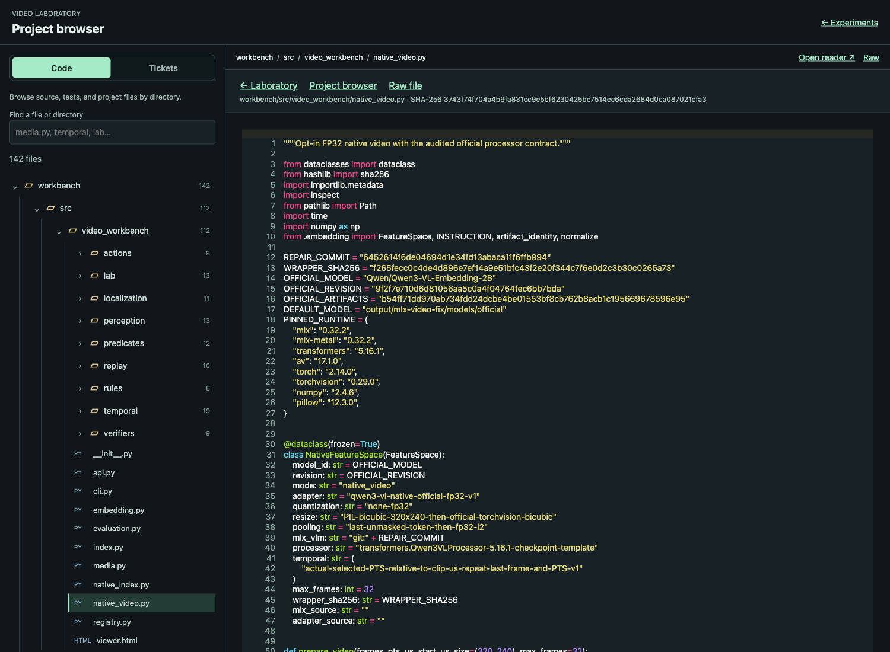
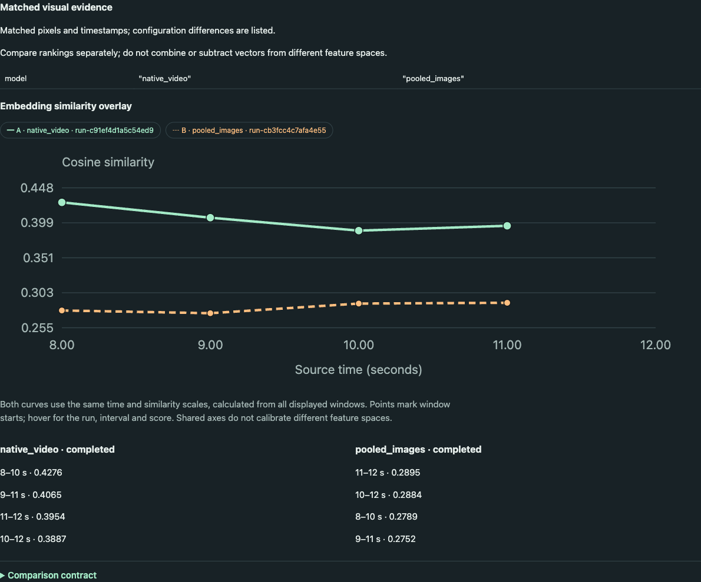
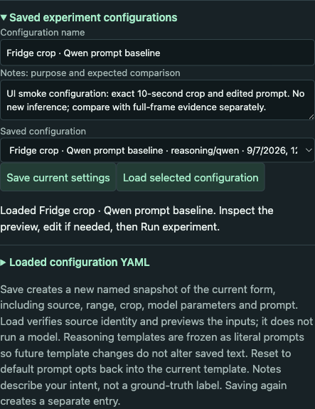

# Video Laboratory: Reproducible Experiments from Pixels to Model Evidence

The Video Laboratory is a local application for inspecting and running the components of a video-understanding system. A user selects a recording, chooses a time range and spatial crop, previews the actual decoded frames, and runs object perception, visual reasoning, embedding extraction, or action classification. The application retains enough evidence to explain which inputs produced each result and to distinguish changes in model behavior from changes in the experiment itself.

This report explains the implementation through `c41e899`, with ticket documentation through `0cdb236`. It covers the FastAPI service, browser interface, model-worker boundary, evidence contracts, comparison semantics, editable prompts, and saved configurations. The source repository is `/Users/manuel/code/wesen/2026-09-06--vision`; the active ticket is `VIDEO-LAB-UI-001`. The repository date is September 6, while the lab UI work and this report are dated September 7, 2026.

> [!summary]
> The implemented lab makes local video experiments inspectable and repeatable: exact images and timestamps, model-specific execution, immutable run requests, independent reviews, and explicit configuration differences. Its smoke tests establish that these paths execute and preserve evidence. They do not establish that the underlying models reliably recognize door states or actions.

## 1. Why the interface exists

The project already had several independently useful implementations: a VirtualHome corpus, native and pooled embeddings, frozen action heads, YOLO perception, bounded visual verification, and temporal rule evaluation. Running those components from command-line scripts produced artifacts, but understanding their relationships required reading different directories and remembering which model, preprocessing policy, timestamp selection, and crop had been used.

The UI addresses that problem by making the experimental context persistent and visible. An embedding result is associated with its feature space and input windows. A door-state answer is associated with a specific image and prompt. A rule decision is associated with observations at an explicitly selected time. The same interface supports changing these inputs deliberately, then inspecting the resulting difference.

This distinction matters when an apparent failure is investigated. Suppose a model returns `closed` for a refrigerator that a reviewer believes is open. Several causes remain possible: the selected timestamp differs from the frame the reviewer watched; the crop removes the opening; another appliance attracts the model's attention; preprocessing reduces the useful detail; the prompt encourages an unsupported answer; or the model misinterprets the visible evidence. The application preserves these variables so a follow-up experiment can change one of them explicitly.



*Figure 1. The evidence preview wraps within a bounded column. This layout change preserves access to parameters when more frames are selected; it does not change the sampling algorithm.*

## 2. System shape and execution environments

The browser is a plain HTML and JavaScript application. FastAPI serves the UI, exposes experiment and evidence APIs, and supervises isolated Python workers. There is no frontend build step. `viewer.html` contains the main form and result renderer; `analysis.js` adds history, comparisons, timelines, handoffs, prompt editing, and saved configurations. A separate project browser renders source files and ticket documentation.



The environment boundary is part of the implementation. PyTorch perception, repaired native-video embeddings, and generative verification have different dependency requirements. The service selects fixed local runtimes and checkpoints from `lab/catalog.py`; it does not accept an arbitrary executable path from the browser.

| Component | Local model or head | Execution environment | Input/output meaning |
|---|---|---|---|
| Detection | YOLO11n | `workbench/perception-env/.venv` | RGB image to object classes, scores and boxes |
| Segmentation | YOLO11n-seg | Same perception environment | RGB image to instances, boxes and mask polygons |
| Tracking | YOLO detections plus `TrackerSession` | Same perception environment | Associations across sampled frames, with cadence/reset rules |
| Reasoning and states | Qwen3-VL-Instruct 8B, local 8-bit | `workbench/verify-env/.venv` | One image to a bounded door-state answer |
| Reasoning and states | Cosmos Reason2 8B, local 8-bit | Same verification environment | Same accepted single-image contract |
| Pooled embeddings | Qwen3-VL-Embedding 2B, local 4-bit | `workbench/.venv` | Independent image embeddings combined by pooling |
| Native embeddings | Qwen3-VL-Embedding 2B, official FP32 | `output/mlx-video-fix/.venv` | Ordered frames and timestamps to a video embedding |
| Action recognition | Frozen ridge head for the selected feature space | Matching embedding environment | Fresh embeddings to one of ten action classes |

The 8B reasoning models are separate from the 2B embedding models. A larger reasoning checkpoint does not change the embedding space. Likewise, a native embedding extractor cannot be substituted beneath a pooled action head: the head's learned coefficients are defined relative to its training features.

The application is served on port 8780 using explicit loopback and Tailscale IPv4 addresses. The startup module accepts repeated `--host` arguments and supplies the resulting sockets to Uvicorn. The working address during this implementation is `http://mimimi:8780/`. It is a local operator application, with access governed by the selected network interfaces and surrounding network policy; it is not a multi-user application with an application-level authorization model.

## 3. Evidence identity begins before inference

A source identifier alone is insufficient to identify video evidence. Earlier corpus generations can reuse episode names while containing different video bytes. The lab catalog therefore exposes namespaced identifiers such as `home-v1--ep-7d3106fb1cac9776` and retains the original episode identifier, dataset, partition, split group, and video SHA-256.

On source access, the catalog checks the registered video against its expected hash. This catches a changed source file before it is used as if it were the old recording. The partition travels with the evidence and later with review exports. Inspecting a test example does not silently turn it into a training example.

Time selection uses presentation timestamps, or PTS. A frame index identifies a position in the decoded sequence; it does not by itself describe elapsed time, especially for variable-rate video. For a start time `s` and sampling rate `f`, requested sample times are:

$$t_k = s + k\frac{10^6}{f}$$

where time is measured in microseconds. At each grid point, the selector chooses the first available presentation timestamp at or after the requested time, excludes timestamps at the interval end, and removes duplicate selections. The selection interval is half-open, `[start_us, end_us)`.

```python
selected = []
for requested_time in sampling_grid(start_us, end_us, fps):
    frame = first_frame_with_pts_at_least(requested_time)
    if frame.pts_us < end_us and frame.index not in selected:
        selected.append(frame.index)
assert 1 <= len(selected) <= 64
```

`lab/evidence.py::prepare` decodes the selected frames, applies the crop, and writes PNG files before model execution. Each frame record includes its index, normalized and raw timestamp, time base, source dimensions, actual crop rectangle, output dimensions, and image hash. The browser's video player is useful for navigation, but the saved PNG is the authoritative model input. Seeking an HTML video element does not replace that evidence with a newly inferred frame.

Normalized crop coordinates are converted to pixels by rounding outward: floor for the left/top edges and ceiling for right/bottom. Because floating-point normalization can affect a boundary, the recorded integer crop and saved PNG take precedence when reproducing the actual input. The interface shows those exact coordinates alongside the preview.

## 4. A run is a persisted experiment, not the current form

An editable form and a completed result have different lifetimes. The user can change the form while inspecting an old result. Rendering that old result using current control values would falsely attribute its predictions to a configuration that never produced them. The lab therefore renders results from the saved request attached to the run.

A run directory under `output/video-lab/` contains `request.json`, `status.json`, input images, worker logs, and eventually `result.json`. Some components also write progress, vectors, or overlay images. The request captures options and prepared evidence, while the result records component-specific model identities and runtime details. Reviews are separate files.

The supervisor in `lab/manager.py` admits one expensive experiment at a time. Under a lock, it rejects an active-worker conflict, resolves any detector handoff, creates a fresh run directory, prepares evidence, checks the selected runtime/checkpoint, snapshots the prompt when applicable, and persists the request. It then starts a background thread supervising a fixed worker module in the appropriate environment.



The worker process has its own process group. Cancellation and timeout terminate and reap that group, avoiding a child process continuing to occupy accelerator resources after the UI claims it stopped. Logs are bounded at 2 MiB. Startup marks abandoned nonterminal runs interrupted. Preparation happens synchronously before the run-start response, so the HTTP request can include decoding latency; the expensive model execution is asynchronous.

This is deliberately a single-host execution policy. It does not coordinate GPU ownership with unrelated scripts or the separately managed replay runtime. A second lab run receives a conflict response rather than entering an implicit queue. That behavior is sufficient for interactive experiments and makes current execution ownership visible.

## 5. Perception outputs and the crop-to-reasoning connection

YOLO detection returns object class, score, and a rectangle in input-image coordinates. Segmentation additionally returns polygons for predicted instance masks. The worker draws overlays on the same image that was given to the detector, which keeps display scaling from changing the recorded coordinate relationship. Tracking uses the existing association implementation and retains observed/predicted distinctions and reset behavior.


*Figure 2. The segmentation view presents predictions on the exact sampled inputs. A predicted box or mask is evidence of a model output, not a reviewed object annotation.*

The next useful dependency is to use a detected appliance as the input region for a reasoner. The implemented handoff requires the user to choose an actual detection from a completed perception run. Supported classes are refrigerator, microwave, and oven, because the accepted downstream question concerns a door state. A person or tie detection is not silently repurposed as an appliance region.

The detection box may itself come from a cropped image. Let `(ox, oy)` be that parent crop's origin in the source image and `(x0, y0, x1, y1)` the detection coordinates within the parent input. With padding fraction `p`, the horizontal padding is `p*(x1-x0)` and the vertical padding is `p*(y1-y0)` on each side. The resolver adds the source origin, rounds outward, and clamps to source dimensions.

```python
dx = padding * (x1 - x0)
dy = padding * (y1 - y0)
left   = max(0, floor(ox + x0 - dx))
top    = max(0, floor(oy + y0 - dy))
right  = min(source_width,  ceil(ox + x1 + dx))
bottom = min(source_height, ceil(oy + y1 + dy))
```

A test with parent origin `(100,50)`, box `(20,30,120,230)`, and padding `0.1` produces source crop `(110,60,230,300)`. Omitting the parent origin would select a different region while preserving a plausible-looking normalized rectangle, making this an important boundary test.

The resolver prepares a reasoning selection `[frame.pts_us, frame.pts_us+1)` with one exact frame. The one-microsecond interval is a selection device, not a claim that the observed state lasts one microsecond. The child request records the parent request/result hashes, source identity, frame, detection, padding, and intended crop. Submission resolves the parent again and rejects changes to the bound source, time, FPS, crop, target, or component. Model and decoding settings may change. An explicit detach control permits independent evidence editing without retaining an inaccurate detection binding.



*Figure 3. The handoff draft previews the rectangular RGB crop before inference. Mask pixels are not used to remove the surrounding background.*

## 6. Prompt editing without losing the execution record

The reasoning form displays the user message before execution. Default text is built by shared Python functions in `verifiers/visibility.py`, so preview and inference do not maintain separate copies of the instructions. The default explains target identification, visible door state, abstention when evidence is insufficient, and the expected output fields.

The editor changes the user message. Qwen has no explicit system message in the selected local profile; Cosmos uses the fixed `You are a helpful assistant.` message. Both are visible in the form. The runtime later applies the model-specific chat template and inserts image placeholders. Consequently, the pre-run editor and the post-run `formatted_prompt` show different stages of the same request construction.



*Figure 4. The user message is editable beside the experiment settings. Resetting restores the template for the selected target and generation profile.*

A custom prompt is a literal string limited to 16,000 characters. Once edited, it is not automatically rewritten when target or generation profile changes. An asynchronous refresh counter prevents a late default-preview response from overwriting newer edits. At run admission, the manager stores the resolved prompt text, its SHA-256, the system message, and whether it originated as custom text. The lab worker passes that exact snapshot through an explicit keyword-only override to the verifier worker.

Prompt editing does not change the parser. Reasoning and state experiments still expect the door-state schema, and a state run applies the same message independently to each selected image. Asking for a different output format can produce invalid structured output. Asking a different semantic question can also make a syntactically valid answer inappropriate for the existing door-state interpretation; operators must preserve that meaning when comparing these experiments.

The UI keeps raw output, parsed state, recovery status, and execution status separate. `true` represents open and `false` represents closed under the contract. Unknown evidence, invalid output, and failed execution are distinguishable conditions; none should be interpreted as a confident closed observation.

## 7. YAML inspection and the project browser

The rendered answer is the primary view, but technical investigation requires complete structured records. Expandable evidence panels now display highlighted YAML. PyYAML preserves multiline text as block scalars, avoiding escaped newline sequences in prompts and raw responses. Pygments generates escaped HTML for highlighting. The endpoint accepts null values so unset options can be shown in comparisons.



*Figure 5. Structured inspection preserves fields while presenting multiline prompt and response text readably. JSON remains the storage and transport format.*

Rendering occurs when a panel is opened. This avoids eagerly highlighting every nested request, runtime record, and comparison report on page load. The UI retains sans-serif code text as requested. Tests check that YAML round-trips preserve values and that strings containing script markup do not become executable HTML.

The project browser is a separate page at `/resources`. Code is presented as a directory tree, while ticket documents have a separate section. Markdown is rendered with HTML disabled; source is highlighted with line anchors. Resources are indexed from selected repository paths and addressed through identifiers derived from those paths. Requests cannot supply an arbitrary filesystem path to the reader. The server also checks that resolved resources remain within the expected indexed identity and applies a size limit.



*Figure 6. The source browser makes implementation inspection part of the experiment workflow. Ticket documentation is organized separately from the code hierarchy.*

This reader connects explanatory text to implementation without embedding filesystem operations in the experiment form. Its index is constructed at service startup, so newly added files require an index refresh through restart; existing file contents are read when served. The reader includes links to upstream resources, but the local accepted runtime and evidence contracts remain the authority for what this application actually executes.

## 8. Embeddings, action heads, and honest comparisons

An embedding maps an input to a vector. For unit-normalized vectors `u` and `v`, their dot product equals cosine similarity. The pooled baseline embeds images independently, normalizes their features, averages them, and normalizes the result. The native model accepts ordered frames and timestamps jointly.

$$e_{pooled}=\operatorname{normalize}\left(\frac{1}{n}\sum_{i=1}^{n}\operatorname{normalize}(e_i)\right),\qquad score=e_{window}^{T}e_{query}$$

Pooling is invariant to frame permutation at this aggregation step. Native ordered input has a different modeling path, but the local native/pooled comparison also changes precision and preprocessing. A difference in retrieval quality therefore compares complete systems; it does not isolate the effect of temporal order.

The embedding UI exposes query, FPS, window duration, stride, and feature mode. Each window records its actual frame membership. Saved vectors retain feature-space identity. Native and pooled vectors must not be mixed into one index merely because their dimensions match.



*Figure 7. Both curves share time and similarity axes. Shared plotting scales make the displayed measurements comparable geometrically; they do not calibrate scores across feature spaces.*

The comparison API first checks source hash, partition, frame timestamps, image hashes, and crop coordinates. Equal evidence supports a model/configuration comparison. Different evidence is labeled an input intervention. The chart overlays two series using the union of their time and score extents; the ranked-window lists remain separate. Run selections, history filters, active tab, and whether to render the comparison are represented in the URL so refresh and browser navigation can restore the view.

Action recognition adds a frozen ridge head above fresh compatible embeddings. Its scores have the form `s=(x-mean)W+bias`; the maximum score selects one of ten classes. The lab checks the feature-manifest identity and preprocessing contract before applying the head. Full-frame input, 2 FPS, and the required temporal grid are enforced. Early windows after the selected start have reduced context because the local experiment resets there.

An action class such as OPEN is a learned prediction over a window. It does not by itself identify an exact opening instant or the actor. Similarly, a cosine score is not a probability and a ridge score is not a calibrated confidence. These meanings are explained in the component guides and should remain visible when richer comparisons are added.

## 9. State samples, transitions, and point rules

A States run executes independent image calls and produces timestamped values such as closed, unknown, and open. Adjacent known values can imply a transition interval. If closed is observed at `a` and open at `b`, the system reports OPEN in `(a,b]` only when the gap is within the selected maximum and no unknown sample interrupts continuity.

```python
previous = None
for sample in samples:
    if sample.state == UNKNOWN:
        previous = None
        continue
    if previous and sample.time - previous.time <= maximum_gap:
        if previous.state != sample.state:
            emit_transition(previous.time, sample.time, previous.id, sample.id)
    previous = sample
```

This procedure describes uncertainty between observations. It does not establish motion recognition, persistent state between every pair of frames, or actor attribution. A sparse sequence can miss an opening and closing that both occur between samples.

The current lab rule control asks whether a door has an expected state at a user-selected exact time. A known match yields PASS, a contradiction yields VIOLATION, and no exact usable sample yields UNKNOWN. The UI explicitly identifies the trigger as manually selected; it is not a detected departure event. The existing replay viewer remains available separately for availability-time constraints, bounded service queues, and causal comparisons.

Reviews attach a verdict and explanation to a run without changing predictions. Their source partition is retained. The export includes the experiment and reviews; point-rule evaluations are saved separately and are not currently included by that export route. Per-frame reviewed event annotations and a unified review browser remain useful follow-up work.

## 10. Saved configurations have a different purpose from saved runs

A saved configuration preserves a proposed experiment. A run preserves what actually executed. The application stores configurations separately under `output/video-lab/configurations/`, with a name, notes, options, source hash/partition, and prompt snapshot. Each save creates a fresh identifier, including repeated saves with the same name.

For reasoning, saving resolves even a default template into literal `options.prompt` text. Loading later therefore preserves the saved wording despite subsequent template changes. Resetting the editor explicitly chooses the current template again. This behavior protects the intended prompt, but does not pin installed model weights or runtime versions; those are recorded when execution occurs.



*Figure 8. Loading restores the configuration and previews the input. It does not start inference or create a completed result.*

Load checks source hash and partition, validates the options and any detector handoff, and restores the form through the existing prompt/crop loaders. The saved notes describe experimental intent rather than ground truth. Configuration validity also does not guarantee that execution will succeed: full sampling limits, model availability, worker admission, and runtime limits still apply at run time.

## 11. Measured evidence and what it establishes

The implementation accumulated real model runs as feature-boundary smoke checks. Their timings include local loading and execution conditions, and they are not controlled throughput benchmarks. The following examples identify useful artifacts without treating successful execution as quality validation.

| Experiment | Run ID | Recorded result |
|---|---|---|
| Detector-selected Qwen crop | `run-6903f06e821843c6` | Completed in 13.583 s; valid `closed` answer |
| Same crop with edited user prompt | `run-805e04781b4846b7` | Completed in 12.096 s; valid `closed` answer |
| Native embedding reference smoke | `run-c91ef4d1a5c54ed9` | Four windows over the selected interval; native feature space retained |
| Matched pooled embedding smoke | `run-cb3fcc4c7afa4e55` | Separate pooled feature space and ranking |
| Fresh native action head | `run-2b41c5b71eba45ee` | Compatible fresh features and frozen head executed |

The detector-to-reasoner trace is particularly concrete. Parent segmentation run `run-8fda97b444ed459c` supplied a refrigerator detection at 10 seconds. Padding `0.15` produced source crop `(167,94,352,383)`, a 185×289 image. The child run retained the parent identities and produced a valid closed answer. Altering its crop while retaining the binding was rejected with HTTP 422 and the message `handoff crop changed; detach the handoff before editing evidence`.

For the edited-prompt run, the default message was extended with `Check visible door edges carefully.`. The editor string exactly matched the pre-run prompt snapshot and the runtime's actual prompt. The answer remained closed. This is a transmission and persistence test, not evidence that the added instruction improved visual reasoning.

The saved configuration smoke used `config-bdf08f25ff734afd`, refreshed the page, and reloaded the edited prompt and bound crop. A per-field comparison found no differences between saved and restored options, and the run count did not change. An initial comparison of serialized JavaScript objects returned false because key order differed; checking field values corrected the test interpretation.

At the latest feature boundary, eleven lab tests passed. The prompt implementation also passed 38 existing profile/visibility tests after default text construction was extracted into shared helpers. Browser checks covered actual saved-input preview, custom prompt reset/restoration, highlighted YAML, responsive thumbnails, history filtering, comparison URL restoration, and configuration reload. No additional expensive inference was needed for the configuration feature.

## 12. API and source reading guide

Paths below are relative to `workbench/src/video_workbench/` unless stated otherwise. Reading in this order follows the experimental data from admission to interpretation.

| File or symbol | Responsibility |
|---|---|
| `lab/contracts.py` | Valid finite options, component/model combinations, crop/range and custom-prompt constraints |
| `lab/catalog.py` | Namespaced registered sources and fixed model/runtime mapping |
| `lab/evidence.py::prepare` | Actual frame selection, crop conversion, PNG persistence and identities |
| `lab/manager.py::Manager.start` | Serialized admission, request snapshots and supervised worker lifecycle |
| `lab/worker.py` | Component adapters for perception, reasoning, embeddings and action heads |
| `lab/handoff.py::resolve` and `validate` | Parent detection lookup, source coordinate conversion and bound-field validation |
| `lab/presentation.py` | Shared prompt preview and safe highlighted YAML rendering |
| `verifiers/worker.py::run` | Model loading, chat-template application, inference and runtime evidence |
| `lab/analysis.py` | Evidence-aware comparison, exact-point rules and saved action inspection |
| `lab/configurations.py` | Named draft persistence and source checks |
| `lab/viewer.html`, `lab/analysis.js` | Form, result views, timelines, comparisons and interactive controls |
| `lab/resources.py`, `lab/browser.html` | Indexed Markdown/source browser and code/ticket navigation |
| `workbench/tests/test_lab.py` | Evidence, lifecycle, handoff, prompt, YAML and saved-configuration checks |

The live `/docs` and `/openapi.json` describe executable request schemas. The key endpoints are:

| API | Meaning |
|---|---|
| `GET /v1/lab/catalog` | Registered sources and local capabilities |
| `POST /v1/lab/preview` | Decode and save exact selected inputs |
| `POST /v1/lab/runs` | Admit a fresh experiment |
| `GET /v1/lab/runs/{id}` | Saved request, status and available output |
| `POST /v1/lab/runs/{id}/cancel` | Cancel the active run |
| `GET /v1/lab/compare?a=...&b=...` | Evidence matching and option differences |
| `POST /v1/lab/handoff` | Resolve a detection into an explicit reasoning draft |
| `POST /v1/lab/prompt` | Resolve user/system text without model loading |
| `POST /v1/lab/render-yaml` | Render structured data for inspection |
| `POST /v1/lab/configurations` | Save a named configuration |
| `GET /v1/lab/configurations/{id}` | Validate and load saved settings |
| `POST /v1/lab/runs/{id}/reviews` | Add an independent review |
| `POST /v1/lab/runs/{id}/rule` | Evaluate the current exact-point rule |
| `GET /v1/lab/runs/{id}/export` | Export experiment and review records |

The ticket's intern guide, implementation diary, measured walkthrough, screenshots and smoke artifacts are under `ttmp/2026/09/07/VIDEO-LAB-UI-001--video-experiment-workbench-and-guided-component-labs/`. The diary records the detailed sequence, including failed checks and their corrections; this report organizes the final architecture by responsibility instead of repeating that chronology.

## 13. Limits and the next useful work

The original implementation checklist and the detector-handoff/saved-configuration additions are complete. Several boundaries remain deliberate: accepted reasoning is single-image; the lab runs one expensive job at a time; reviews are primarily run-level; and the lab exposes one exact-point rule template. Generative output can remain visually wrong even when parsing succeeds. The UI makes that failure inspectable but does not solve it.

The frontend has also grown through layers of result-rendering and form-loading wrappers in `analysis.js`. That was practical for incremental delivery, but further features would benefit from clearer modules for form state, history/URL state, rendering, and API access. This would reduce dependence on wrapper order and make asynchronous state changes easier to reason about. It is an implementation maintenance concern, not a requirement to replace the entire frontend stack.

The most useful next feature is a richer comparison workspace: synchronized playback, aligned point-state/action timelines, and prompt/output differences beside the existing embedding overlays. A small sequential batch runner would then support controlled model, crop and prompt comparisons on matched evidence. It should record every child run and summarize failures as well as successful answers, without introducing an implicit distributed scheduling system.

Visual crop drawing, clickable boxes, mask toggles and measurements would improve evidence selection. Per-frame reviews and review browsing would improve the quality of collected evaluation cases. Additional rule templates should follow concrete investigative needs and expose their time and coverage assumptions. Configuration rename/archive controls can be added once the saved configurations accumulate enough entries to justify them.

## Related project reports

- [[ARTICLE - Bounded Visual Verification - Qwen Cosmos Reasoning and Evidence Validation]] explains the accepted verifier, output recovery and measured reasoning comparisons.
- [[ARTICLE - YOLO Video Perception - Detection Tracking Evidence and State Recognition]] explains perception and tracking contracts beneath the UI.
- [[ARTICLE - Temporal Video Models - Causality Weak Supervision and Observation Memory]] explains the temporal observation and action-model context.
- [[ARTICLE - Native Video Embeddings in MLX - Repairing Pixel Forwarding and Establishing Reference Parity]] explains the repaired native embedding execution path.
- [[ARTICLE - Timestamped Video Search - From Verified Pixels to Frozen Evaluation]] explains the earlier timestamped retrieval system.
