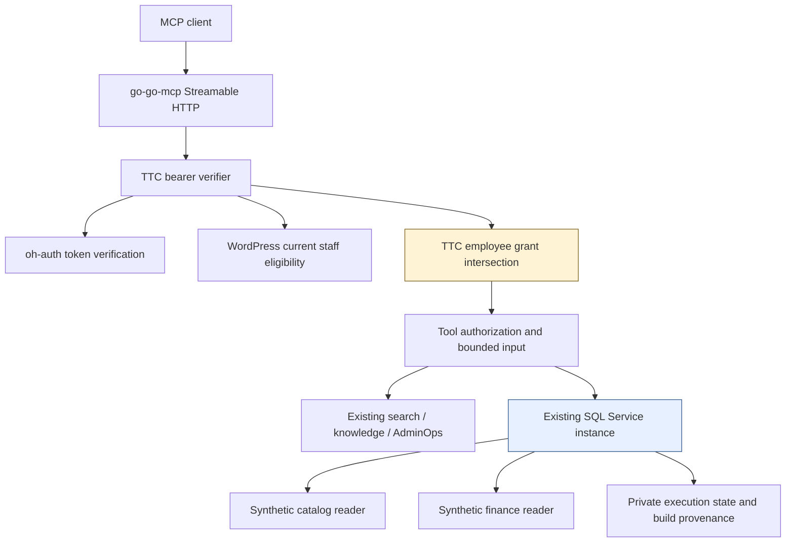
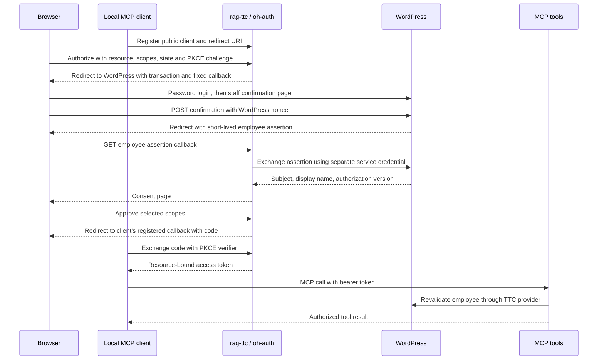
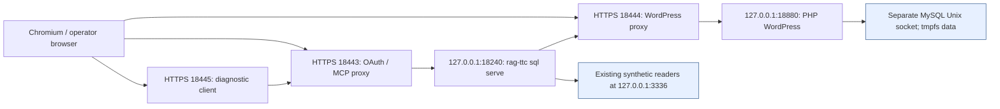

# Building the TTC MCP Connector

The TTC MCP connector exposes existing application tools and constrained dbt/MySQL queries through one employee-authorized HTTP service. Its central implementation problem is preserving the meaning of a request while it crosses several interfaces: a WordPress session becomes an employee assertion; that assertion participates in OAuth authorization; an access token becomes a verified MCP principal; and that principal becomes the owner of a bounded SQL execution. A working function call is only one part of this sequence. The service must also preserve delegated scopes, data availability, numeric precision, cancellation, evidence ownership and browser navigation rules.

This report explains the implementation completed locally on September 6–7, 2026. It develops the design from explicit contracts, follows the principal and data paths through the source, and examines the failures that changed the implementation. The intended reader can write application code but need not already understand MCP, OAuth composition, WordPress identity integration or the existing TTC SQL workbench. Pseudocode is labeled and describes the implemented control flow; source references identify the corresponding files and symbols.

The result is a working local connector with automated protocol tests, real synthetic MySQL queries, actual WordPress assertion tests and a Chromium login/consent regression. The operator independently confirmed the interactive flow. This is not a production deployment report. The database loader deliberately accepts the existing local synthetic deployment, the library corrections remain local commits, and the final WordPress CSP correction is tested and staged but not committed because automatic approval review rejected disabling unavailable repository hooks.

> [!summary]
> - Compose the existing OAuth engine, MCP transport and domain services, while keeping employee policy in TTC-owned code.
> - Compute authority at each relevant boundary. Employee eligibility, delegated token scopes, tool policy and SQL profile permission are distinct checks.
> - Pass the existing SQL service into MCP so admission, refresh, evidence and cancellation retain one owner.
> - Validate browser behavior directly. The confirmation form's GET response contained a CSP defect that isolated HTTP tests did not expose.

## 1. Start with the operations and their authority

Model Context Protocol provides a way for a client to discover named tools, inspect their input descriptions and invoke them through a protocol transport. In this project the transport is Streamable HTTP, and the server returns JSON responses in stateless mode. Those choices describe message handling. They do not establish which employee may query finance data or which mutable state can be shared across requests.

The first useful design artifact was therefore a tool inventory. TTC already had search, knowledge and administrative query implementations. The SQL workbench already owned constrained access to selected dbt-produced relations. The connector needed a deliberate selection of these operations, together with explicit authentication and delegation rules.

| Tool | Required operation scope | Additional authority or dependency |
| --- | --- | --- |
| `ttc_search` | `ttc:search:read` | A configured search runtime and a fresh per-call registry/evidence ledger |
| `ttc_knowledge_query` | `ttc:knowledge:read` | A configured read-only knowledge database and curated views |
| `ttc_adminops_query` | `ttc:adminops:read` | A configured fixture/policy plus a resolved employee AdminOps role and scope |
| `sql_doc` | `ttc:sql:docs:read` | A grant for every profile whose metadata is returned |
| `sql_query` | `ttc:sql:read` | A grant for the selected SQL profile, followed by canonical SQL validation |

The SQL profile scopes are `ttc:sql:profile:catalog`, `ttc:sql:profile:finance`, `ttc:sql:profile:ops` and `ttc:sql:profile:support`. The current local loader makes catalog and finance available. Ops and support retain explicit unavailable descriptions. Defining a scope does not provision its database, and listing a profile does not mean its relations can be queried.

The distinction between the two SQL tools is intentional. Metadata can disclose schema names, business concepts and available fields even when no rows are returned. A client authorized to read catalog documentation should not receive finance documentation merely because both profiles exist in the server's configuration. `sql_doc` filters through the same service authorization machinery used for execution, with a separate metadata permission. [S1]

The persistent interactive fixture enables SQL and AdminOps. The assembled Go acceptance test additionally enables a synthetic knowledge database. Search is covered by a deterministic canonical-runtime test rather than a paid embedding call. These are different coverage statements; none implies that every optional runtime was enabled in the browser session.

## 2. Reuse the existing libraries at their actual boundaries

The project began with a broader question: how should rag-ttc align with CoinVault, `oh-auth` and `go-go-mcp`? The useful answer was to share the existing mechanisms while leaving application-specific policy in the application. CoinVault supplied an implementation precedent and a set of observed integration hazards. TTC did not require a migration of CoinVault or a new universal resource-server framework to obtain a working first connector.

Three existing responsibilities were already separable:

1. **oh-auth owns OAuth protocol state and transitions.** Its engine, SQLite store, signing support and HTTP transport implement registration, authorization, consent, token exchange and refresh behavior.
2. **go-go-mcp owns MCP transport and dispatch integration.** Its embeddable server accepts a custom HTTP verifier, tool definitions and dispatch policies.
3. **rag-ttc owns domain operations and TTC policy.** It selects tools, resolves employee grants, opens application resources and passes verified authority to the canonical runtimes.

WordPress has a fourth responsibility: establish whether a current site user is an eligible employee. It does not assign the delegated MCP scope set in this design. The operator-configured rag-ttc employee map supplies that policy.



The resulting TTC packages are small in responsibility even where the total integration is substantial. `internal/mcpoauth` implements the identity client and application-facing OAuth ports. `internal/mcphost` validates private configuration and owns startup/shutdown. `internal/mcpconn` describes the selected tool catalog and converts verified MCP authority into domain authority. The existing `sql serve` command supplies the hosting process. [S1–S4]

This version did not extract a generic OAuth resource middleware, migrate every TTC HTTP authenticator, add distributed OAuth state, or create another SQL executor. Those directions remain possible, but each introduces additional API design and migration work. They were not required to make the selected operations usable through the current library APIs.

## 3. Distinguish the identities in the authorization flow

Several URLs participate in this connector, but they do not identify the same object. The issuer identifies the authorization server. The resource identifies the service for which access is requested. The client redirect receives the authorization response in the MCP client. The WordPress identity callback returns an employee assertion to the authorization server.

The local browser fixture makes these distinctions visible:

| Identifier | Local value | Owner |
| --- | --- | --- |
| OAuth issuer | `https://localhost:18443` | rag-ttc OAuth provider |
| MCP resource | `https://localhost:18443/mcp` | Protected MCP service |
| Employee login site | `https://localhost:18444` | Synthetic WordPress fixture |
| Employee assertion callback | `https://localhost:18443/oauth/ttc/callback` | rag-ttc identity callback |
| Test-client redirect | `https://localhost:18445/callback` | Local diagnostic OAuth client |
| Protected-resource discovery | `https://localhost:18443/.well-known/oauth-protected-resource/mcp` | MCP resource metadata |

The callback distinction prevents a serious authority confusion. WordPress must send its assertion only to the configured rag-ttc callback. It must not accept an arbitrary MCP client's redirect URI as the recipient of an employee assertion. The OAuth engine separately validates the registered client's redirect URI when it later returns an authorization code.

The complete local sequence is:



PKCE binds authorization-code exchange to a verifier retained by the client. The client sends a challenge derived from that verifier when it begins authorization, and later proves possession of the verifier when exchanging the code. The employee assertion solves a different problem: binding a WordPress-authenticated employee to the already-started rag-ttc authorization transaction. Neither credential replaces the other.

## 4. Implement WordPress as an employee identity authority

The bridge in `TreeAdmin\API\MCPIdentity` registers an `admin-post.php` action for browser interaction and two REST endpoints for server-to-server identity operations. The browser action requires the WordPress session. The REST endpoints require a separate service bearer configured privately on both sides. An MCP access token, a WordPress password and the existing local SQL bearer are not interchangeable credentials. [S5]

The returned employee record contains three fields:

```json
{
  "subject": "wp:1",
  "display_name": "Local MCP Staff",
  "authorization_version": 123456789
}
```

This is an illustrative record; the version shown is not a captured value. The subject is based on the stable WordPress numeric user ID rather than a mutable display name or email address. Eligibility requires one of the approved API-access roles. An explicit inactive role denies eligibility even when another staff role is also present. The version is derived from sorted roles and capabilities, using 52 bits so its integer representation remains exact across the PHP/JSON/Go boundary.

### 4.1 Bind a short-lived assertion to the intended transaction

An assertion is a random opaque value. Its stored record includes the user ID, the rag-ttc transaction, the exact callback and an expiry. The option name contains a digest of the assertion; the raw assertion is not the persisted lookup key. Expiry is sixty seconds. The browser receives the raw assertion only so it can return it to the callback.

The important consumption behavior is atomic removal of the record that was validated. A separate read followed by an unconditional delete would allow two concurrent exchanges to both return the employee. The implementation instead deletes only if both the option name and stored value still match.

```text
# Pseudocode: MCPIdentity.Consume
validate assertion and transaction syntax
name = prefix + SHA256(assertion)
raw = read option value by name
record = parse raw

require record is unexpired
require record.transaction == transaction
require record.callback == configured callback
require record.user_id is valid

deleted = DELETE option
          WHERE option_name = name
            AND option_value = raw
require deleted == 1
invalidate the WordPress option cache entry
return current eligible principal(record.user_id)
```

The second consumer can read the same initial value, but its conditional delete affects zero rows after the first consumer succeeds. The real WordPress test runs two PHP subprocesses against the same MySQL-backed option table and verifies that exactly one obtains a principal. This is stronger evidence for this concurrency property than replacing the storage operation with an in-memory mock.

The issuance path also prunes expired assertions and rejects issuance when its observed live-record threshold is reached. That is an application admission check, not proof of a strictly serialized global quota under simultaneous issuers. The tested atomic property is consumption. It is useful to state the invariant narrowly enough that the test actually establishes it.

### 4.2 Recheck the current employee when exchanging and using credentials

Assertion consumption resolves current eligibility after removing the assertion. An employee who becomes inactive after issuance does not remain eligible merely because the assertion has not expired. Later, each bearer-authenticated MCP request revalidates the employee through the principal endpoint.

This introduces an explicit availability dependency: if current employee authority cannot be resolved, the provider fails closed. A signed, unexpired token alone is insufficient. The five-second identity HTTP timeout and bounded response size keep that dependency from creating an unbounded request. Redirects from the configured identity endpoint are rejected, preventing the service credential from following an unexpected redirect target. [S3]

Eligibility revalidation occurs at request ingress. The repeated scope and expiry checks inside an already-running tool call use its verified request context; they do not poll WordPress on every SQL status check. The distinction matters when describing how quickly a mid-request role change can take effect.

## 5. Compute delegated authority without merging client grants

An employee can authorize two clients with different scopes. The service must not combine those clients' grants simply because their subject is identical. The effective scope set is the intersection of the scopes carried by the verified token and the configured scopes available to that employee.

Let `T` be the token's scopes and `E` the employee's configured scopes. At request verification:

```text
effective_scopes = T ∩ E
```

If `T` contains only catalog access while `E` also permits finance, the request remains catalog-only. If the token contains a scope no longer present in the process's configured employee map, that scope is removed. The employee map is loaded at startup in this implementation; editing its JSON file is not a live reload mechanism. Operational changes require an appropriate process restart or a separately implemented reload path.

Authorization for a SQL query then requires both an operation grant and a profile grant:

```text
# Pseudocode: remote SQL authorization
require verified employee principal
require requested domain principal equals derived MCP principal
require resource.kind == "sql-profile"
require action == "sql.profile." + resource.id
require resource.id is one of the defined profiles
require "ttc:sql:read" in effective_scopes
require "ttc:sql:profile:" + resource.id in effective_scopes
```

The resource and action checks prevent a generic scope match from accidentally granting an unrelated operation. In particular, a verified remote principal cannot fall back to the local workbench policy or acquire `sql.refresh`. Metadata access substitutes the documentation operation scope through a private context marker set only by the documentation tool; model-supplied arguments do not control that marker. [S1]

### 5.1 Ownership and delegation answer different questions

The SQL evidence owner is derived from a hash of the verified issuer and subject:

```text
owner = "actor:mcp-" + hex(SHA256(JSON([issuer, subject])))
```

Including the issuer avoids equating subjects issued by different authorities. Deriving the owner from verified context prevents the model from selecting another actor through tool arguments.

The client ID is not part of this ownership coordinate. Two clients for the same employee therefore share the stable employee ownership identity while retaining different delegated scope sets on their requests. This is scope isolation, not a claim of per-client evidence-storage isolation. The separately authenticated local workbench actor is different again; the acceptance test verifies that it cannot read an MCP-owned execution merely by knowing its execution ID.

This separation is also relevant to AdminOps. Its canonical runtime requires a domain principal with role and scope fields. `AdminPrincipal` resolves those fields from the verified employee and configured grant on each call. It does not retain whichever employee happened to construct the tool descriptor at startup. [S1, S3]

## 6. Keep one SQL service responsible for execution

The pre-existing SQL workbench service already owns query admission, database execution, evidence persistence, cancellation and refresh coordination. Adding a second service instance solely for MCP would introduce a second admission counter, a second refresh view and potentially another owner of the same evidence directory.

The hosting command instead constructs one service and passes it to both the existing HTTP handler and the MCP host:

```go
// Simplified composition; error handling omitted here.
service := sqlworkbench.NewService(ctx, profiles, authorizer, stateDirectory)
localHandler := service.Handler(localBearerAuthenticator, buildCallback)
mux.Handle("/", localHandler)
mcphost.Mount(ctx, mux, service, mcpConfig)
```

These calls are shown schematically; `NewService`, `Handler` and `Mount` return errors in the actual source. The important ownership rule is the argument to `Mount`: it receives the existing `*Service`. `SQLTools` never opens another database or state store. [S2, S4]

The service's execution path contains several independent controls. Its SQL policy validates the query before admission. Admission rejects work while closed, blocked by refresh, beyond the active execution limit or beyond retained execution capacity. Execution acquires a connection, configures a server-side time limit, begins a read-only transaction and validates the expected relation columns within that transaction before executing the canonical statement.

The relation check is more than documentation validation. A `SELECT * ... LIMIT 0` probe obtains the current ordered column names. If they differ from the permitted contract, execution fails. The same transaction retains metadata locks while the actual query runs, avoiding a gap in which a newly added column could appear between validation and a query using `SELECT *`.

The active limit is four executions. The service uses a five-second execution context and MySQL's `MAX_EXECUTION_TIME=5000`. Results are bounded by row, column and serialized-evidence limits. These controls reinforce one another, but their individual purposes differ: read-only prevents modification, relation policy limits disclosure, admission limits concurrency, and deadlines bound resource occupancy. [S6]

### 6.1 Respect the business meaning of the dbt relations

The connector exposes the existing dbt-facing contract; it does not infer accounting meaning from column names. The catalog relation describes published merchandise identity and explicitly does not claim live price or availability. The finance relation describes root parent orders, and its refund treatment restates the original business date. Its totals are not automatically recognized revenue or refund-date cash flow.

That semantic metadata belongs in `sql_doc` because a syntactically valid aggregate can still answer the wrong business question. The SQL service can preserve exact decimal bytes and enforce table access, but neither property establishes that a sum is the financial measure the caller intended. [S6]

The current `LocalProfiles` implementation checks the fixed fixture marker, `127.0.0.1:3336`, expected schemas, reader usernames and table mappings. It deliberately rejects arbitrary production connection configurations. A production profile loader and its provisioning are a separate deployment task, not an undocumented command-line substitution.

## 7. Preserve numeric values at the JSON boundary

Database identifiers and monetary values should not be routed through an imprecise JSON-number representation merely because JSON supports a number token. A large integer such as `9007199254740993` cannot be represented exactly by the usual binary64 number type. If a protocol library decodes it into that representation before the SQL adapter sees it, later converting it back into text does not recover the original integer.

The MCP SQL input contract therefore permits parameter values that are strings, booleans or null. Numeric JSON parameters are rejected. A caller that intends an exact numeric value provides its textual representation:

```json
{
  "profile": "catalog",
  "sql": "SELECT product_id FROM products_v1 WHERE product_id = ? ORDER BY product_id LIMIT 1",
  "parameters": ["9007199254740993"]
}
```

The database still evaluates the bound parameter according to the query and column types. The adapter's responsibility is to preserve the submitted value until that evaluation. The canonical service already handles parameter binding; MCP does not add SQL interpolation.

Results follow the same preservation rule. The executor scans database cells as raw bytes and represents non-null cells as strings, with SQL null represented as JSON null. Column metadata separately identifies database types. A decimal result can retain its exact text rather than becoming an approximate client-side floating-point value.

The MCP result projects `execution_id`, `profile`, `build_id`, `columns`, `rows` and `truncated`. It omits the persisted owner and query draft. Execution and build identifiers retain provenance without repeating unnecessary stored material in every response.

The outer MCP budget is distinct from the canonical SQL evidence budget. MCP includes both structured content and a JSON text representation for client compatibility. The implementation measures the encoded result and caps the complete envelope at 256 KiB; a canonical result that fits its own store may still require a narrower MCP query. Input is capped at 32 KiB and a tool call has a ten-second application deadline. [S1, S6]

## 8. Match cancellation to the caller's lifetime

The SQL workbench's asynchronous HTTP API intentionally allows an execution to continue after the request that started it returns. An MCP tool call instead expects one bounded result associated with that call. Changing every `Start` operation to inherit its HTTP request lifetime would break the existing workbench semantics.

The added `Service.Run` method composes the existing start and status operations:

```text
# Pseudocode: Service.Run
check caller context
execution = Start(context, principal, query)

on exit:
    under service mutex:
        cancel only this execution if it remains active

every 20 milliseconds:
    if caller context is done:
        return its error
    current = Execution(context, principal, execution.id)
    if authorization or lookup fails:
        return the error
    if current is no longer running:
        return current
```

The deferred cleanup is deliberately execution-specific and internal. If the caller's credential has expired, a public cancellation API that demands current authorization might reject the cleanup itself. `Run` already knows which execution it created and cancels only that execution under the service's synchronization. It does not grant a general unauthenticated cancellation capability.

The status lookup repeats the domain authorization check. In MCP, that check re-examines the verified context's scopes and expiry. A request cannot keep receiving evidence after its captured token authority has expired merely because execution started earlier. The outer tool handler also checks authority around the canonical call before returning its result.

The assembled test additionally invokes the shared refresh path and verifies the resulting build identifier in subsequent MCP evidence. That proves that both interfaces use the same service state. The acceptance callback supplies a synthetic build identifier; it does not run or validate a fresh dbt build. The prior SQL work is the source of the canonical refresh mechanism. [S1, S6]

## 9. Share expensive runtimes without sharing request evidence

Reuse does not mean that every object inside a runtime has the same lifetime. A configured search index and inference setup can be process-owned, while an evidence ledger must be call-owned. If the ledger were retained inside a tool registered once at startup, a later call could inherit evidence from an earlier call.

`RegistryTool` obtains the canonical descriptor from a registry factory, then asks that factory for a new registry at execution time. It resolves the selected tool again and invokes the canonical function with the current context. The factory is not used to open a fresh database for every call; it creates the call-owned tool definitions and mutable state needed by that runtime.

```text
# Pseudocode: selected canonical tool
startup:
    descriptor = factory().GetTool(name)
    expose descriptor's name, description and input schema

call(context, input):
    registry = factory()
    tool = registry.GetTool(name)
    return tool.ExecuteWithContext(context, input)
```

AdminOps uses a related but distinct rule. Its long-lived runtime can be shared, but the employee principal must be resolved for the current request. Descriptor construction uses an empty principal only to obtain metadata; execution receives the current configured employee role/scope. Returned administrative data identifies the configured snapshot and does not claim to be a live production answer.

The tests target these lifetimes directly: fresh search evidence between calls, current principal selection for administrative operations, and shared service state for SQL. Testing the lifetime contract is more useful here than asserting only that a tool name appears in discovery. [S1]

## 10. Two small library fixes with observable consequences

The application used existing go-go-mcp APIs, but local integration exposed two defects worth fixing in the library itself.

The first involved the resource metadata URL included when tool authorization denies a call. A custom HTTP verifier already supplied the application's resource metadata. The tool-dispatch path, however, constructed its denial using the built-in auth configuration's resource URL. That could give the client a different discovery destination from the one used by bearer authentication.

Commit `3ccddca` adds a selector that obtains the resource metadata URL from the custom verifier when present and falls back to the built-in configuration otherwise. The dispatch denial now describes the same resource that the verifier protects. This does not change the public verifier API; it corrects which existing configuration the tool authorization path uses.

The other defect involved logs. The official backend logged raw tool arguments at debug level, and `protocol.NewToolResult` logged the complete result at trace level. In this connector those structures can contain SQL, parameters and returned rows. Commit `3ccddca` removes the argument payload from the tool-call debug event. Commit `68be65b` removes the complete result trace event.

A regression test runs with trace logging enabled, submits distinct argument and result canaries, and asserts that neither appears in captured logs. It also verifies the custom-verifier resource metadata on a denied call and that the unauthorized handler is never invoked. The test therefore checks the actual transport path and its observable output. [S7]

These corrections do not establish that every possible logging layer has been audited. The TTC MCP wrapper rejects URL query strings on `/mcp` before the library logger, and the OAuth audit sink records only operation/outcome/reason fields. A development PHP access log can still include callback query strings. Such logs remain private fixture material and are not copied into reports.

The published rag-ttc dependency is still go-go-mcp `v0.2.4`. The validated workspace includes the local corrections, while `GOWORK=off` selects published module versions. Passing a standalone compatibility build therefore does not mean that build contains the privacy and discovery corrections. Publishing and pinning an appropriate reviewed version remains a release prerequisite.

## 11. The browser failure that changed the implementation

The first browser login reached WordPress's staff confirmation page. Submitting an invalid nonce correctly produced HTTP 403. Submitting a valid nonce did not reach consent. Chromium reported a violation of:

```http
Content-Security-Policy: default-src 'none'; form-action 'self'; frame-ancestors 'none'
```

The form posts to WordPress on port 18444, but the successful response redirects to the MCP callback on port 18443. Those are different origins even though both use `localhost`. The initial implementation added the validated callback origin only to the POST response. That placement was insufficient: the document containing the form supplied the policy under which the browser initiated and followed the form navigation.

The correction moves construction of the callback-origin policy before the GET/POST branch, after transaction, callback and employee validation. The GET response that contains the form now permits the exact configured callback origin, and the POST response receives the same policy.

```text
# Pseudocode: corrected Authorize placement
set restrictive default response headers
require logged-in WordPress user
read transaction and callback
require valid transaction
require callback exactly equals operator configuration
require eligible employee

callback_origin = validated callback scheme + host + optional port
set CSP: default-src 'none';
         form-action 'self' callback_origin;
         frame-ancestors 'none'

if GET:
    render form with transaction-bound WordPress nonce
else if valid POST nonce:
    issue assertion and redirect to exact callback
else:
    reject
```

The policy change does not make the callback arbitrary. It derives the allowed origin from a callback that has already passed an exact comparison with operator configuration. The specific navigation target is still constructed by the bridge. Expanding the directive to all HTTPS origins or removing it would not express the intended restriction.

The nonce test itself required a correction. Its first version used JavaScript `fetch` from the confirmation page to submit an invalid nonce. The page's `default-src 'none'` blocked that request, so the test never exercised server-side nonce rejection. The revised test modifies the hidden nonce field, submits the actual form, observes HTTP 403, reloads the confirmation page and then submits a valid nonce. This tests the browser behavior the application actually permits.

After the CSP correction, Chromium completed both grant cases. The operator then encountered `invalid_grant` while retrying an earlier transaction. The sanitized audit event was:

```text
login outcome=denied reason=store_not_found
```

That event identifies unavailable authorization state, not a bad WordPress password. A consumed, expired or otherwise missing transaction cannot be recovered by reloading its callback. Starting a fresh connection created new state, and the operator confirmed: “cool, it works.” The audit does not by itself distinguish every possible reason the old row disappeared, so the report does not attribute a more specific cause than the evidence supports.

## 12. Construct a local fixture that exercises the real components

The persistent fixture intentionally separates WordPress identity storage from the existing synthetic SQL databases. It copies installed WordPress core while excluding the real site's configuration and content. Its own generated configuration points to a fresh socket-only MySQL instance and loads only the actual identity bridge and its UserCaps dependency. It creates a synthetic staff account and stores the random password in a private file.

The service layout is:



The Python proxy is a diagnostic tool. On the MCP origin it forwards only MCP, OAuth, discovery and public-key paths. It does not expose the local SQL/workbench routes through that proxy. Its local test client performs registration and PKCE, binds the callback to a secure cookie, retains tokens in memory and issues protocol requests after consent. It is not proposed as production ingress infrastructure.

The fixture exposed an ordinary but consequential permission interaction. The state directory was private, but MySQL changed the socket subdirectory owner to its container UID while leaving mode 0700. PHP ran under a different UID and received a socket permission error. The fix was shared-group traversal on the socket subdirectory, mode 0770, within the private 0700 parent. Broadening permissions on every secret file was unnecessary.

An attempted internal Docker network was not reachable from this host. Rather than changing machine-wide routing or firewall rules, the PHP fixture now uses the host network namespace with an explicit loopback listener. WordPress blocks external HTTP and mail. MySQL retains networking disabled. The browser automation aborts non-loopback requests, and dependency downloads remain disabled.

The TLS certificate is self-signed and valid for the local test names. `SSL_CERT_FILE` gives the rag-ttc process explicit trust in that certificate without modifying the global trust store. The dedicated Chromium context accepts the local certificate for the test. An operator browser may require acknowledging the local certificate warning. These are local test arrangements and should not be copied into production TLS configuration.

The temporary directory is `/tmp/ttc-mcp-interactive`. It persists while the local setup is running, but it is not durable deployment state: the WordPress database is tmpfs, and reboot or temporary-file cleanup can remove the fixture. The startup script refuses to overwrite an existing private state directory and checks that expected ports are free. The stop script verifies ownership before killing its host listeners and stops only its named tmux sessions and containers. [S8]

## 13. Read the validation evidence as separate claims

The validation strategy progressed from package contracts to actual browser behavior. Each stage establishes a different part of the service.

| Evidence | What it establishes | What it does not establish |
| --- | --- | --- |
| Canonical tool tests | Search evidence isolation, AdminOps principal selection, scoped SQL behavior | A deployed client or paid provider interaction |
| OAuth provider tests | Registration, callback, consent, code/assertion replay denial, audience/expiry checks, refresh narrowing and revocation | Browser enforcement of the WordPress page's CSP |
| Real WordPress tests | Eligibility, assertion binding/expiry, absent service credential denial, one-winner consumption | The complete browser navigation path |
| Assembled Go test with official MCP SDK | Actual host through TLS, knowledge/AdminOps, synthetic MySQL, narrowed grants, ownership and shared build provenance | Real WordPress password/session interaction |
| Chromium regression | Actual WordPress login, nonce denial/confirmation, consent, PKCE and scoped calls | External hosted MCP-client compatibility or production deployment |
| Operator confirmation | The persistent interactive setup works for the user's browser session | A replacement for the other regression checks |

The browser receipt is short because it records outcomes rather than credentials:

```text
catalog: real WordPress password/session login reached staff confirmation
catalog: invalid WordPress nonce rejected with HTTP 403
catalog: valid nonce and callback reached OAuth consent
catalog: consent, PKCE exchange and real scoped MCP tool calls passed
full: real WordPress password/session login reached staff confirmation
full: invalid WordPress nonce rejected with HTTP 403
full: valid nonce and callback reached OAuth consent
full: consent, PKCE exchange and real scoped MCP tool calls passed
PASS: local Chromium WordPress login, nonce denial/confirmation, OAuth consent, catalog isolation, finance and AdminOps
```

The real WordPress suite passed four tests and 36 assertions. The assembled host passed the Go race detector with real synthetic MySQL enabled. Normal rag-ttc Go test, lint and logcopter hooks passed for the V4 code checkpoint. The later local fixture scripts were checked and exercised separately; their documentation/script commit did not rerun Go hooks because it contained no matching Go files.

Full PHP project checks did not pass. Required attempts encountered malformed historical PHP files, an installed Psalm/vendor incompatibility, missing Biome and default hook assumptions about an absent development container and host PHP extensions. Focused ECS and Psalm passed for the bridge, with zero Psalm errors and 15 informational issues. Those focused results are useful, but they are not a passing full-project analysis claim.

The final CSP correction remains staged in TTC. Its normal commit hooks failed on those environment assumptions, and automatic approval review rejected disabling the hooks for the checkpoint. The code is active in the local fixture through its source mount and is covered by the browser regression, but it is not contained in the earlier WordPress bridge commit. Preserving that distinction makes the report usable for release preparation rather than merely describing a working directory as a reproducible revision.

## 14. Reproduce the useful checks

For a self-contained protocol/host check, run from the rag-ttc workspace checkout with workspace module resolution enabled:

```sh
GOROOT=/home/manuel/go/pkg/mod/golang.org/toolchain@v0.0.1-go1.26.7.linux-amd64 \
GOTOOLCHAIN=local GOPROXY=off GOSUMDB=off \
/home/manuel/go/pkg/mod/golang.org/toolchain@v0.0.1-go1.26.7.linux-amd64/bin/go test \
  ./internal/mcphost -run TestAssembledOAuthAndMCP -count=1 -v
```

To include the existing synthetic MySQL readers, append:

```sh
-mcp-mysql-profiles /home/manuel/.local/state/ttc-sql-001/local-readers.json
```

The explicit installed Go root avoids the earlier mismatch between a Go 1.26.7 executable and an inherited Go 1.25.5 compiler root. The offline flags prevent module resolution from reaching external services. These paths describe this machine's validated environment; another machine must provide its own installed compatible toolchain and synthetic fixture.

For interactive use, open `https://localhost:18445`, choose catalog-only or the broader grant, and authenticate as the fixture account `mcp-staff`. Its password is in `/tmp/ttc-mcp-interactive/staff-password`. Do not paste it into a ticket, screenshot, query string or committed example. Access tokens last five minutes; begin a new connection after expiry or after a consumed/failed transaction.

The ticket's `scripts/08-interactive-browser.cjs` repeats the real browser sequence with the installed Playwright package. Scripts 05–07 prepare the fixture and manage its named services. The adjacent handoff document contains complete start/stop arguments. The main integration command is still `rag-ttc sql serve --mcp-config <private-file>`; the diagnostic harness does not replace the actual host implementation.

## 15. What remains before a deployment

The next work should preserve the established contracts while replacing local assumptions with explicit deployment inputs. The most immediate source-management issue is committing the tested CSP correction through repaired hooks or an explicitly authorized checkpoint procedure. The next dependency issue is releasing and pinning the two go-go-mcp fixes so the validated behavior does not depend on a local `go.work` file.

Production database access needs its own configuration and provisioning. The current fixed-fixture loader is intentionally unsuitable for a production DSN. Reader privileges, relation contracts, dbt build/test sequencing, state ownership, TLS ingress, secret material and staff policy must be selected and verified for the target environment. No production grants or employee accounts were created by this work.

A hosted client also deserves its own acceptance run through the intended ingress. Local Chromium proves browser navigation for this fixture, and the official SDK proves MCP behavior through the assembled Go host. Neither proves every external client's discovery, registration or transport expectations.

The broader unification work remains optional: generic resource-server middleware, shared application integration packages, CoinVault migration, distributed state and consolidation of all TTC authenticators. The first version already demonstrates that the existing libraries can be composed successfully with limited application wiring. Further extraction should be justified by repeated requirements and concrete duplication rather than by the existence of two related services.

## 16. Source map and implementation checkpoints

All source observations in this report come from local files, test receipts and Git history. No external service was queried to validate the runtime. The report's vault commit and push are separately authorized documentation delivery.

Repository roots used below:

- **R:** `/home/manuel/workspaces/2026-09-01/add-plot-editor/rag-ttc`
- **O:** `/home/manuel/workspaces/2026-09-01/add-plot-editor/oh-auth`
- **M:** `/home/manuel/workspaces/2026-09-01/add-plot-editor/go-go-mcp`
- **T:** `/home/manuel/code/ttc/ttc`
- **Ticket:** `R/ttmp/2026/09/06/TTC-AUTH-MCP-001--unify-ttc-and-coinvault-oauth-resource-and-mcp-integrations`

| Reference | Source and review entry points |
| --- | --- |
| S1 | `R/internal/mcpconn/server.go` (`Principal`, `NewHandler`, bounded tool handler); `data_tools.go` (`RegistryTool`, `AdminTool`); `sql_tools.go` (`SQLAuthorizer.Check`, `SQLTools`) |
| S2 | `R/internal/mcphost/host.go` (`ReadConfig`, `Mount`, `Host.Close`) and `host_test.go` |
| S3 | `R/internal/mcpoauth/provider.go` (`ValidateBearerToken`, `Revalidate`, `AuthenticateCallback`, `AdminPrincipal`); `identity.go`; `provider_test.go` |
| S4 | `R/cmd/rag-ttc/cmds/sqlworkbench/command.go`, including the `mcp-config` field and one-service composition |
| S5 | `T/tadmin/plugin/src/API/MCPIdentity.php` (`Authorize`, `Principal`, `Issue`, `Consume`, `ServicePermission`); `T/tadmin/plugin/tests/API/MCPIdentityTest.php` |
| S6 | `R/pkg/ttc/sqlworkbench/{profiles,policy,service,run,store}.go`, particularly `LocalProfiles`, `Start`, `execute`, `Execution`, `Refresh` and `Run` |
| S7 | `M/pkg/embeddable/official_backend.go`; `M/pkg/protocol/tools.go`; `M/pkg/embeddable/custom_verifier_regression_test.go` |
| S8 | Ticket `scripts/05-interactive-setup.py`, `06-interactive-proxy.py`, `07-interactive-stack.sh`, `08-interactive-browser.cjs`; `reference/05-persistent-local-browser-fixture-and-csp-validation.md` |
| S9 | `R/internal/mcphost/acceptance_test.go`; ticket `reference/validation/{local-acceptance.txt,interactive-browser.txt}` and `reference/02-implementation-diary.md` |
| S10 | `O/pkg/httptransport/server.go` (`IdentityCallbackHandler`, authorization and consent handlers), `O/pkg/oauthserver`, `O/pkg/sqlitestore`, `O/pkg/jwttokens` |

The significant local checkpoints are:

| Repository | Commit | Result |
| --- | --- | --- |
| rag-ttc | `34787a263` | V0 contracts and implementation baseline |
| rag-ttc | `516b2c36c` | Existing TTC tools exposed through authenticated MCP |
| rag-ttc | `3aed423f6` | Scoped dbt SQL tools through the shared service |
| rag-ttc | `51cec8cb6` | Employee OAuth and MCP composition in the SQL host |
| rag-ttc | `9dfebf73c` | Assembled OAuth/MCP/local MySQL acceptance |
| rag-ttc | `2de968b5a` | Initial implementation diary, runbook and receipts |
| rag-ttc | `1f6424571` | Persistent local WordPress fixture and Chromium regression |
| go-go-mcp | `3ccddca` | Custom-verifier challenge correction and argument-log removal |
| go-go-mcp | `68be65b` | Raw result trace-log removal and extended canary test |
| TTC | `8c34bd85c` | Original transaction-bound employee identity bridge |
| TTC working tree | Staged, not committed | GET-page CSP correction validated by Chromium and the operator |

The exact uncommitted correction is preserved with this report as [the confirmation CSP patch](_assets/ttc-mcp-confirmation-csp.patch). It applies to the original WordPress bridge checkpoint and records the reviewed change without claiming that a later source commit exists.

The preceding design context is preserved in [[PROJECT REPORT - Building a Production MCP Service - Authorization Transport Deployment and the TTC Transfer Plan]]. That report describes the CoinVault production experience and TTC transfer plan. This report records the subsequent TTC implementation and the additional evidence obtained by testing its real local WordPress flow.
