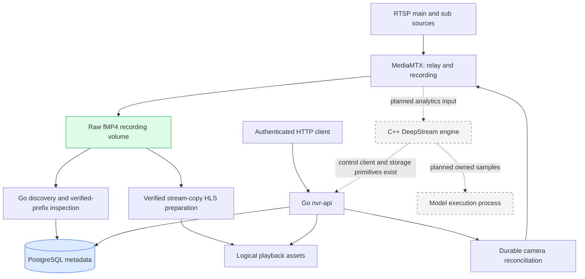
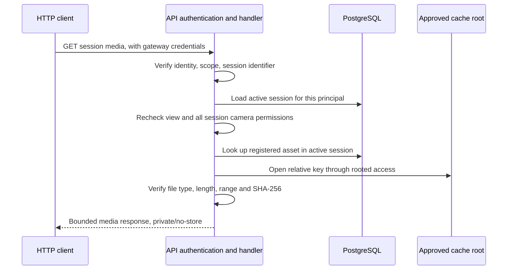

# Video Observatory Backend: Verified Recording and Authenticated Playback

A recording service has several different kinds of state: the camera configuration an operator requested, the connection a media router established, the bytes a recorder wrote, the intervals an index verified, and the media a particular user may read. Video Observatory makes these distinctions explicit. This report explains how its current Go backend represents those states, coordinates work across process boundaries, verifies encoded recordings, and authorizes playback assets without treating a successful command as proof of a successful media operation.

The implementation has reached a useful but incomplete checkpoint. A real software GStreamer source has been recorded through MediaMTX, discovered automatically, indexed in PostgreSQL, remuxed without changing its encoded packets, and decoded over HTTP through authenticated product handlers. Public playback-session creation is not implemented. The native DeepStream worker, actual model execution, several lifecycle requirements, and target-machine qualification also remain unfinished.

> [!summary]
> - Recording is operationally independent from analytics, while configuration changes are reconciled through durable, fenced database work.
> - Archive visibility is based on verified complete byte prefixes and integer timestamp mapping, not filenames or file-size stability alone.
> - Playback delivery requires current identity, camera permissions, view permissions, an active owner-bound session, and a registered logical asset.
> - The real media test establishes an encoded recording-to-authenticated-HLS path. It does not establish public session admission, browser execution, GPU inference, or sixteen-camera capacity.

## 1. The intended system and the implemented subset

The target product is a sixteen-camera video observatory. Each camera has a main and a substream. Operators should be able to inspect recordings, browse thumbnail and metric timelines, play historical intervals, run detection and video embeddings, inspect candidate events, and determine which stage is limiting throughput. Recording must continue when analytics is unavailable. Missing measurements must remain missing rather than appearing as zero. A masked-only account must never receive raw imagery as an automatic fallback.

These requirements produce a system with more than an RTSP input and an HTTP output. It needs an archive whose byte boundaries remain valid while files grow, a representation of time that survives remuxing, a scheduler whose crashed workers cannot publish stale results, and authorization that applies to each delivered media object.

The specification's baseline is concrete: sixteen camera pairs, main streams at 1920×1080 and 15 fps with nominal 4 Mbit/s, and substreams at 640×360 and 10 fps with nominal 400 kbit/s. It specifies closed GOPs, approximately one IDR per second, no B-frames in the golden fixture, and no audio. Before container and filesystem overhead, its recording rate is:

```text
16 × (4.0 + 0.4) Mbit/s = 70.4 Mbit/s
70.4 Mbit/s ÷ 8 = 8.8 MB/s
8.8 MB/s × 86,400 s = 760.32 GB/day
```

This is workload arithmetic, not a benchmark result. The current real-media test uses one small software-generated stream. It does not demonstrate the specified recording rate, analytics cadence, or four-player browser workload.

The report concerns `video-backend/` within the repository. The shared specifications and canonical contracts live in `video_platform_v1/`. There is separate web-UI work in the same repository; this report does not assess that implementation or imply that the UI and backend have completed their integration.

| Area | State at this checkpoint |
|---|---|
| Canonical contract generation and strict request validation | Implemented and checked for drift |
| Camera/configuration/policy APIs and router reconciliation | Implemented, including real MediaMTX conformance tests |
| Recording discovery and verified UTC archive indexing | Implemented, with conservative growing-file semantics |
| Encoded stream-copy HLS preparation | Implemented and verified with packet hashes and decoding |
| Session reads, renewal, deletion, manifest/media delivery | Implemented with database-backed grants and authenticated handler tests |
| Public POST playback-session creation and admission | Not implemented |
| Public sample indexes and exact UTC HLS anchors | Not implemented |
| Native control client and atomic policy checkpoint storage | Implemented primitives; production coordinator remains unwired |
| DeepStream execution and real Embed/Reason inference | Not implemented or qualified by this checkpoint |
| Cache/source reclamation, retention, privacy rendering, timelines | Substantial implementation remains |

The phase accounting is therefore intentionally incomplete: P1 is complete, P2 and P3 remain open, and later phases remain required. Completing useful portions of two phases is not equivalent to completing either phase.

## 2. Separate processes by ownership and failure behavior

MediaMTX owns encoded ingest, relay, and raw recording. The Go control server owns public authorization, desired configuration, database transactions, and background coordination. The planned C++ video engine owns decoding, detection, tracking, sampling, and privacy rendering. Model execution belongs in a separate model process rather than in per-frame callbacks or public HTTP handlers.

The implemented and planned paths can be distinguished directly:



There is an important omission in this diagram's implemented path: no public creation coordinator yet connects a client's requested interval to preparation, resource admission, and session publication. The preparation code and delivery code exist, but the real fixture connects them through a trusted internal issuer. That distinction will remain explicit throughout the report.

Recording independence follows from this ownership arrangement. An unavailable model process should prevent model work from succeeding; it should not terminate MediaMTX's camera pulls. Similarly, a control-server shutdown joins its background workers and closes local resources without treating shutdown as an instruction to stop the external recorder.

Process separation does not remove shared resource contention. Archive inspection, HLS preparation, recording, and inference can still compete for disk bandwidth, memory, and CPU or GPU capacity. The design separates responsibilities first; admission and measurement must subsequently bound their interference.

## 3. Canonical contracts are executable constraints

The backend does not maintain an independently edited copy of its public API. It generates wire types, schema material, a 49-operation inventory, and protobuf/gRPC bindings from the supplied canonical bundle. Embedded contract files and their hash manifest make the binary's contract inputs inspectable and regeneration reproducible. The declared API version comes from the embedded OpenAPI document.

The operation inventory is not an implementation-completion count. It describes the supplied interface. Some listed routes, including public playback creation, do not yet have handlers.

Strict decoding matters because ordinary struct decoding does not express the entire contract. A omitted nullable field is different from an explicitly present null when the schema requires the property. Duplicate JSON keys are also problematic: different components can select different values from the same bytes. The backend therefore checks required fields, nullability, unknown properties, duplicate keys, trailing content, nesting depth, and declared integer domains before domain operations run.

Time and counter representations need particular care. The public contract uses decimal strings for microsecond timestamps and large counters, preserving precision across JavaScript and Go. The implementation checks their integer range rather than accepting a string merely because it looks numeric.

For a requested half-open interval `[a, b)`, the essential conditions are:

```text
parse a and b exactly in the declared integer domain
require b > a
require interval width <= the operation's admitted maximum
```

The contract helper avoids signed subtraction overflow when checking interval width. This is a small implementation detail with a large consequence: an extreme timestamp cannot convert an invalid request into an apparently short interval through arithmetic wraparound.

There are two independent validation questions. Schema validation asks whether a request has an allowed shape and representation. Domain validation asks whether its camera, policy, model provenance, source authority, and requested operation are permitted. Neither replaces the other.

## 4. Database correctness starts with transaction boundaries

PostgreSQL stores camera configuration, policy state, durable operations and jobs, idempotency responses, audit records, observations, archive metadata, playback grants, and an outbox. It does not store video blobs. Migration checksums reject unexpected changes to an already applied migration, and a transaction-scoped advisory lock serializes migration startup.

### 4.1 Idempotency must retain the response, not just the request identifier

A client can lose an HTTP response after the server commits. Repeating the mutation should not create another operation merely because the first response was not received. `Store.Idempotent` scopes this problem by principal, route, and key.

Its implementation hashes the request bytes, obtains an advisory transaction lock for the scoped key, checks the stored request digest, and either replays the saved response or executes the mutation. Mutation state and the exact response status, body, and headers commit in the same transaction. Reusing the key with different bytes produces an idempotency conflict.

```text
begin transaction
lock (principal, route, idempotency key)

if unexpired saved response exists:
    require saved request digest == current request digest
    return saved status, body, and headers

perform domain mutation
persist response with request digest and expiry
commit
```

The digest is over request bytes. This is not a promise that semantically equivalent JSON documents with different formatting will share an idempotency identity. The implementation also avoids ambiguous key concatenation by encoding the key tuple structurally.

### 4.2 Outbox order must agree with commit visibility

A database sequence allocates increasing numbers, but transactions do not necessarily commit in allocation order. Suppose transaction A obtains cursor 101 and waits, while transaction B obtains 102 and commits. A consumer that sees 102 and checkpoints it can miss 101 when A commits later.

The outbox publisher avoids that ordering by updating a singleton clock row inside the publishing transaction:

```sql
UPDATE outbox_clock
SET cursor = cursor + 1
WHERE singleton
RETURNING cursor;
```

The row lock remains held until commit or rollback. Another publisher cannot allocate its next cursor while the earlier publishing transaction is unresolved. Committed cursor progression therefore does not skip an earlier transaction that can subsequently become visible.

This deliberately serializes an ordering-critical section. It is suitable for control metadata; it is not a reason to put per-frame GPU work or long media preparation inside that transaction. Lock ordering matters as well. A transaction that publishes after locking one camera must not then acquire arbitrary additional camera locks in an order that conflicts with another publisher. Native stream reset consequently locks its affected cameras before publishing invalidations.

## 5. Reconciliation connects desired state to an external router

An HTTP camera update commits desired configuration. It does not prove that MediaMTX has applied it or received decodable media. A reconciliation worker subsequently claims work, attempts the router changes, observes the result, and publishes a fenced database update.

The controller starts four workers. Claims use database row locking with `SKIP LOCKED`, allowing workers to take distinct eligible work without waiting behind a claimed row. The lease lasts thirty seconds. Execution is limited to twenty seconds and is further capped by the remaining lease minus a five-second publication allowance.

The publication condition is more important than the number of workers:

```text
publish only if:
    worker identity still matches
    fencing token still matches
    lease is still valid
    desired camera revision still matches the claimed revision
```

A worker that resumes after a crash, pause, or lease replacement must not overwrite the state published by a newer worker. The fencing token distinguishes ownership generations even if a worker name is reused.

Two camera revision fields are necessary. The attempted revision records which desired revision has already been tried; the applied revision records successful convergence. If retry scheduling only compared desired with applied revision, a failure would leave the revisions different and could make every poll look like a fresh configuration change. Recording the attempted revision allows the same failing request to respect its backoff.

Normal reconciliation is scheduled approximately once per second. Failures use equal-jitter exponential backoff with a fifteen-second ceiling. Explicit reconnect operations have a three-attempt bound, including crash recovery. These constants bound local behavior; they are not throughput measurements.

The MediaMTX adapter owns only its `vo_raw/<camera>/<main|sub>` paths. It checks the pinned router version and ensures continuous TCP pulls, fMP4 recording, configured clock behavior, and disabled router-side retention. Source credentials are resolved through deployment-controlled references rather than embedded in camera-selected URLs.

The source-authority allowlist is rechecked on every reconciliation pass. This matters after configuration changes: a camera URI accepted yesterday must not remain active indefinitely after its authority is revoked today. The controller removes existing owned pulls when that check fails.

There is still an unavoidable limit to database fencing. MediaMTX's control API does not accept the backend's fencing token. A stale worker can potentially issue an external change even when its eventual database publication will be rejected. A later pass repairs the external state. This is eventual reconciliation of vendor effects, not linearizable mutation across PostgreSQL and MediaMTX.

## 6. Health is an observation with a revision and an age

A configured path, an online source, available media, and verified archive output are different observations. The status API must not collapse them into one optimistic boolean.

Camera status reads a repeatable-read snapshot of camera configuration, policy state, and router observations. Freshness is limited to five seconds. Future timestamps, stale observations, missing observations, or observations associated with the wrong desired revision are not accepted as current evidence. Detail and list reads join observations into their database query rather than issuing a separate status request for every camera.

A freshly unavailable source can justify degradation. A freshly available source still does not prove that archive bytes were produced and indexed. The implementation consequently keeps last-output timestamps and ages null when it has no corresponding output evidence.

This distinction is not merely about presentation. If an operator uses the API to determine whether a disk failure stopped recording, reporting source availability as recording health would conceal the failure. The same rule applies to measurements: a missing latency or output-age measurement must not become numeric zero, because zero asserts a measurement result.

Configuration ETags continue to describe desired configuration. Observation revisions describe observed-state publication. Time-dependent freshness can change the interpretation of an observation without a new camera edit, so consumers must not use a configuration ETag as the identity of all runtime state.

## 7. Native acceptance and policy application are separate events

The native transport uses deployment-controlled Unix sockets rather than a fallback TCP address or HTTP proxy. The client has four unary-call slots, a one-second capabilities deadline, and five-second command deadlines that include admission waiting. The control and model response bounds are the contract's 4 MiB and 8 MiB, respectively.

The native client validates capabilities and command receipts for incarnation, request identity, revision, and accepted state. An accepted `SetPolicy` call is not evidence that the engine has applied the policy. Only a matching `PolicyApplied` observation can advance effective policy state.

Matching means more than equal revision numbers. The stored acknowledgement path checks the current engine incarnation, the camera's current desired policy, and the exact canonical protobuf representation. Disabled or deleted cameras and obsolete policies cannot be reported as freshly applied.

An engine restart invalidates effective policy state. That can move the effective policy revision to zero, but it must not make the public state revision go backward. The implementation maintains an independent applied-state revision for this reason. Domain values can reset while the sequence describing changes remains monotonic.

### 7.1 A checkpoint is a claim about completed processing

The policy watcher uses one stream, invokes its consumer synchronously, and has a ten-second idle watchdog. It rejects incarnation changes, nonincreasing envelope sequences, malformed or foreign camera events, and explicit resynchronization notices. Sequence gaps are allowed because camera filtering can omit unrelated envelopes.

The database consumer commits either the policy acknowledgement or a durable rejection together with its replay cursor:

```text
begin transaction
lock native stream state
verify stream generation and engine incarnation

if sequence <= stored cursor:
    return duplicate

attempt exact policy acknowledgement
if event is obsolete or otherwise a recognized domain rejection:
    persist rejection reason
if an unexpected storage error occurs:
    rollback without advancing

store sequence as replay cursor
commit
```

Advancing first would lose an acknowledgement after a crash between cursor persistence and policy persistence. Never advancing for an obsolete event would instead allow that event to prevent replay progress indefinitely. A durable rejection records the decision while permitting progress. A generation or incarnation mismatch is different: it invalidates the consumer's authority and must not advance the checkpoint.

Reset operations explicitly journal bootstrap, incarnation changes, or retention-related resynchronization, invalidate effective policies, and increment the stream generation. The code does not silently pretend that an unavailable range was delivered. The uint64 cursor is persisted as `numeric(20,0)`, including values beyond signed bigint range.

These transport and storage properties are tested. The production native coordinator that schedules commands and connects the watcher to the running engine remains unfinished. They are not evidence that DeepStream has executed a policy on hardware.

## 8. Model availability requires runtime provenance

An approved model catalog describes what a deployment permits. It does not establish that the model is loaded or callable. `/api/v1/models` therefore starts approved models as unavailable and uses a live ModelExecutor capabilities response to determine what can be reported.

The runtime descriptor must match the approved model identifier, family, artifact hash, preprocessing hash, precision, embedding space, and dimension where applicable. Duplicate or malformed reports fail closed; unknown models are excluded. The adapter version remains approved metadata because the current runtime descriptor does not attest it. Memory measurements remain null because that RPC does not supply them.

This preserves an important distinction between provenance approval and runtime observation. It also prevents a fixture executor from establishing a hardware claim. The Unix gRPC tests validate transport, deadlines, descriptor matching, permissions, and message-size behavior. They do not run the real Embed or Reason models.

The message-size history illustrates why strictness must follow the actual contract. An earlier one-MiB limit was narrower than the specification. It was corrected to 4/8 MiB, with regression tests accepting a two-MiB response and rejecting a nine-MiB model response. An arbitrary smaller bound can be incompatible even when it appears conservative.

## 9. A growing recording has a verified prefix, not a completion flag

An fMP4 recording consists of initialization data and media fragments. The initialization establishes codec and track information; `moof` metadata describes fragment samples, and `mdat` contains their encoded bytes. A crash or concurrent writer can leave a partial box or a complete `moof` without its corresponding complete media data.

`archive.ScanPrefix` walks box headers with explicit size and parent-file bounds. It requires valid initialization before media, rejects invalid box lengths and ordering, and exposes only complete `moof`/`mdat` pairs. A size-to-EOF box is not sufficient to establish a verified boundary in a growing file.

Consider this conceptual file layout:

```text
ftyp | moov | moof A | mdat A | moof B | partial mdat B
             <--- verified --->
```

The visible prefix ends after `mdat A`. Fragment B is not independently admitted just because some of its bytes exist. Byte-by-byte truncation tests verify the scanner's behavior around these boundaries.

A complete prefix is still not the same as a sealed file. Discovery cannot infer closure from a quiet directory, unchanged size, or a successful probe. The current worker records discovered files as growing. Trusted recorder-completion integration remains necessary.

### 9.1 Extending an index requires preserving previous evidence

`Store.PutRecording` receives verified metadata and an already opened source handle. It checks the new prefix hash, then locks the corresponding database state. For an existing file, it recomputes the old prefix digest from that handle before admitting an extension.

```text
require new prefix bytes match their declared digest
require new length >= previously indexed length
require old prefix bytes still match their stored digest
require existing identity, clock provenance, and fragment metadata remain equal
append verified metadata, or return the existing revision for an identical write
```

Once sealed, the file cannot grow or change its verified content through this path. A subsequent discovery pass does not reopen a sealed record as growing. Explicit sealing also requires the physical size to equal the verified prefix size at the check.

This establishes content and metadata consistency under the method's source-handle and trust assumptions. It does not establish fsync or power-loss durability of the recording volume, nor does it implement a retention lease protocol. Those are separate lifecycle requirements.

### 9.2 UTC mapping must use rational arithmetic

The MediaMTX recorder filename supplies a segment-start NTP-derived timestamp. The backend expects these filenames to be interpreted in UTC. The pinned implementation was inspected to establish this meaning; a filesystem modification time is not substituted for it.

Let `A` be the UTC anchor in microseconds, `d0` the first decode timestamp, and `n/q` the media time base in seconds per tick. The start of a sample at decode timestamp `d` is mapped as:

```text
start_us = A + floor((d - d0) × n × 1,000,000 / q)
end_us   = A + ceil((d + duration - d0) × n × 1,000,000 / q)
```

Starts are floored and ends are ceiled so the microsecond interval includes the sample interval represented in media ticks. Big-integer intermediates avoid multiplication overflow, followed by an explicit int64 result check.

For example, at time base `1/90000`, an offset of 3,000 ticks is 33,333⅓ microseconds. Floating-point conversion followed by inconsistent rounding would make neighboring metadata calculations disagree. Explicit floor/ceil rules make the representation deterministic.

Timestamp arithmetic does not prove clock quality. Newly discovered historical recordings use estimated provenance because today's camera configuration cannot establish which clock configuration was active when an older file began. Previously stored stronger provenance is preserved. Epoch identifiers are conservative and per-file; cross-file continuity has not yet been established.

Archive overlap queries use half-open interval conditions:

```sql
WHERE camera_id = $camera
  AND profile = $profile
  AND start_us < $requested_end
  AND end_us > $requested_start
ORDER BY start_us, file_id
LIMIT $admitted_limit_plus_one;
```

If an extra row proves that the admitted limit was exceeded, the method returns `ErrArchiveLimit`. It does not silently truncate the result and let a caller mistake omitted recordings for gaps.

## 10. Automatic discovery is bounded work, not proof of capacity

The executable enables discovery only when both recording and archive-cache roots are supplied. The worker opens the recording root through `os.Root`, recognizes only known camera identifiers and main/sub MP4 paths under `vo_raw`, and skips discovered symlinks. The cache directory must exist and must not be group/world-writable.

Directory entries are streamed in batches of 128. The scan admits at most 128 cameras, two profiles per camera, and one million visited entries. It retains two newest candidates per profile and a rotating batch of sixteen historical repair candidates. Its change cache has 4,096 entries. Inspection is serial, with a five-second per-file context, a thirty-second pass budget, and a two-second delay between passes. Failures receive a thirty-second retry delay.

These choices address different problems. Streaming batches bound memory during directory enumeration. Recent candidates prioritize current ingest. Historical candidates permit reinspection even when file identity, size, and modification time are unchanged. Serial inspection avoids creating an unbounded queue of ffprobe processes. Temporary inspection directories are removed after normal processing.

The limits do not prove eventual scan progress under every retained-file count or deadline pattern. A large deployment can repeatedly exhaust its pass budget, and filesystem operations do not all become instantly interruptible when a context expires. Fairness, inspection cost, and sustained discovery lag require capacity testing. Crash-orphan cleanup is also distinct from normal-pass cleanup.

Most importantly, discovery is not completion notification. The real fixture waits for the production worker to discover a growing recording in PostgreSQL and only then makes its separate test-controlled sealing assertion.

## 11. Stream-copy HLS needs byte and decode evidence

A physical recorder part is not necessarily an independently decodable playback segment. It can begin with samples that depend on an earlier random-access frame. Serving each physical fragment as if it were a complete independently decodable clip would confuse container completeness with decoder independence.

`archive.PrepareHLS` first snapshots a verified prefix and probes its stream and packets. The admitted baseline is one H.264 video stream, `yuv420p`, no B-frames, an initial random-access sample, and valid monotonic timestamps and packet hashes. It validates encoded sample bounds against verified media data and limits a snapshot to 512 MiB and a probe to 20,000 packets. Subprocess execution and diagnostic output are bounded.

FFmpeg remuxes the snapshot into fMP4 HLS with stream copy. The backend probes the resulting playlist and compares the ordered packet hashes with those of the source. This checks that remuxing did not change the encoded sample bytes. The test then decodes the entire recording, the HTTP HLS playlist, and every initialization-plus-segment combination independently.

These checks answer different questions:

| Check | What it establishes |
|---|---|
| Complete MP4 prefix scan | The exposed input excludes incomplete container tails |
| Packet-position validation | Encoded sample references stay within admitted media data |
| Ordered packet hash comparison | The remux preserves the source encoded sample sequence |
| Whole-playlist decode | The delivered playlist and referenced assets form decodable media |
| Independent init-plus-segment decode | Each logical segment can be decoded with its initializer |
| `yuv420p`, H.264, no-B-frame admission | The tested stream matches the selected baseline format constraints |

Packet equality alone does not establish UTC correctness of a public playback index. The exact sample-index endpoint, public UTC playlist anchors, and cross-file mapping remain unfinished. Likewise, successful FFmpeg decoding does not establish execution in a browser player.

An earlier fixture made this distinction concrete. The software encoder negotiated High 4:4:4 Predictive video with `yuv444p10le`. FFmpeg decoded it, but that did not establish the intended browser-compatible baseline. The GStreamer input was constrained to I420, and the archive probe now requires `yuv420p`. The resulting fixture reported Constrained Baseline output. No actual browser result is inferred from that correction.

## 12. Playback delivery is authorization over immutable logical assets

The current product handlers implement:

```text
GET    /api/v1/playback/sessions/{session_id}
POST   /api/v1/playback/sessions/{session_id}/renew
DELETE /api/v1/playback/sessions/{session_id}
GET    /api/v1/playback/sessions/{session_id}/cameras/{camera_id}/manifest.m3u8
GET    /api/v1/playback/sessions/{session_id}/media/{media_id}
HEAD   /api/v1/playback/sessions/{session_id}/media/{media_id}
```

There is no implemented public `POST /api/v1/playback/sessions` route. `store.CreatePlayback` is an internal trusted issuer, not a client URL importer. Future creation must establish source/view provenance and resource admission before invoking it.

The issuer persists an owner-bound session and logical asset references in one caller-owned transaction. Asset metadata includes its camera, relative cache key, content type, byte length, and SHA-256. Issuance is bounded to 2,048 grants, and each asset is limited to 64 MiB. A ready player must have a corresponding manifest grant and a manifest URL. These checks constrain storage; they do not implement a complete materialization policy.

### 12.1 Identity and permissions are checked on every request

The gateway verifier uses RS256 with configured key identifiers, issuer, audience, and deployment. Camera and view permissions come from the verified principal, not arbitrary identity headers. Cookie-authenticated mutations additionally require the configured HTTPS origin and CSRF header.

A playback request first finds a live session belonging to that principal. It then checks current permission for the session's raw or redacted view and checks every player camera's authorization and existence. The selected asset is subsequently looked up within that active, owner-bound session.



The all-player check is stricter than authorizing only the requested asset's camera. Losing access to any camera in a multi-camera session can prevent requests through that session. The current behavior should be understood before a future creation coordinator starts constructing multi-camera resources.

A session identifier is therefore not a bearer credential. A different principal cannot use it to load the resource. A principal who has lost raw-view access cannot continue reading raw bytes merely because the session was created earlier.

There is no redacted materializer at this checkpoint and no fallback to raw. The V1 specification itself distinguishes required masked live playback from separately gated historical masking. Neither should be represented as implemented by these generic view checks.

### 12.2 Session expiry and physical reclamation are different operations

A session receives a sixty-second expiry and a maximum expiry thirty minutes after creation. Renewal uses:

```text
new_expiry = min(now + 60 seconds, creation_time + 30 minutes)
```

Only an unexpired, unclosed owner-bound session can renew. Renewal also opens its granted files and verifies their type and expected size. The subsequent media read performs the full hash verification; renewal does not rehash the entire cache.

A session created at `t=0` and renewed at `t=20` expires at `t=80`, not `t=120`. The tests check that it remains readable at `t=61` and is unavailable at `t=81`. Repeated renewals cannot cross the independent thirty-minute ceiling.

Closing the repository record is idempotent. The HTTP DELETE path first loads an active session, however, so deletion of an already inactive session returns not-found rather than another successful active-session response. That is the implemented behavior, not an assumed API property.

Expiry and closure deny new delivery. They do not yet delete cache files, clean crash orphans, release a complete source-file lease graph, or implement retention. Calling this a complete cache lifecycle would be incorrect.

### 12.3 Range requests operate on a granted asset, not the recording volume

The handler opens only the cache path registered for the logical asset. It verifies a regular file with the exact expected length, validates one satisfiable byte range, hashes the file, and then serves it through `http.ServeContent`. Multi-range and unsatisfiable requests are rejected. Responses carry a hash-based ETag, private/no-store caching policy, and nosniff.

The client cannot turn a requested byte range into a read of adjacent source recordings. A large range endpoint can only be bounded by the selected asset's size. The source recording path is not itself a public asset identifier.

Full-asset hashing has a measurable cost. If an asset is 2 MiB and a client requests 64 KiB, the handler hashes 32 times as many bytes as it returns before considering response-copy work. Page cache can reduce physical disk I/O, but it does not eliminate hashing work. Repeated ranged requests and HEAD requests also use the integrity path. Capacity qualification must measure this behavior before optimizing it; any optimization must preserve the immutable-content assumption and authorization order.

Raw-access audit integration is still missing. Current authorization is not a substitute for the audit trail required by the broader product specification.

## 13. What the real test actually does

The test source is real software media, not a mocked packet stream. Local GStreamer encodes the source; because the installed environment did not provide `rtspclientsink`, FFmpeg republishes the encoded stream to RTSP using stream copy. The production MediaMTX adapter records it. PostgreSQL and the router run in isolated test containers, and generated media remains under an ignored build directory.

The current flow is:

```text
GStreamer source and H.264 encoder
  -> FFmpeg encoded RTSP publisher
  -> MediaMTX recording adapter
  -> recorder-owned fMP4 file
  -> production automatic discovery
  -> PostgreSQL verified growing-file index
  -> explicit test-controlled seal assertion
  -> verified HLS preparation
  -> trusted internal session/grant issuance
  -> product API handlers hosted by a test HTTP server
  -> RS256-authenticated FFmpeg HLS decode
```

The fixture generates an actual 2048-bit RSA key and signs a short-lived gateway token. The manifest references registered media routes, and FFmpeg sends the authorization header on HLS requests. An unauthenticated manifest request must fail. This is real authenticated HTTP delivery through the product handler implementation, not an ad-hoc filesystem whitelist.

The retained milestone evidence reports:

```text
=== RUN   TestRealEncodedRecording
verified H.264 recording: .../media-3rTe1C/...mp4
(49 packets, 5 HLS assets, HTTP and independent-segment decode passed)
--- PASS: TestRealEncodedRecording (11.98s)
```

The path is abbreviated here; the packet count, asset count, and test result come from the retained log. The 11.98-second test duration includes fixture orchestration and is not a playback startup-latency measurement.

The full `make check` run also covered canonical validation/drift, formatting/vet, race tests, build, isolated PostgreSQL tests, and real MediaMTX conformance. A final `go test ./control/...` passed after unfinished creation experiments were removed. Environmental integration tests may skip in that final command; their evidence comes from the retained full run rather than an assumption that every package test invokes Docker.

To reproduce the recorded classes of checks:

```bash
cd /home/manuel/code/wesen/2026-09-07--streaming-system/video-backend
make check

# Narrower real media integration, when inspecting this particular path:
make media-integration
```

This report was written from code and retained validation artifacts. It did not rerun the deployment or hardware qualification work as part of documentation.

## 14. The incomplete work follows from the current interfaces

The next useful implementation checkpoint is public playback creation together with authenticated HLS, not another isolated helper. Creation must validate the requested cameras, view, interval and generation; admit player and cache resources; select verified source intervals; establish source lifetime during preparation; preserve immutable-prefix identity while recordings grow; and publish only authorized logical assets. It must either describe every requested camera's state or return an explicit failure rather than silently omitting sources.

The canonical request permits up to sixteen cameras and a ten-minute range, while the initial concurrent-player target is four. Those contract and specification values must not be reported as effective admitted capacity before a real coordinator enforces its configured limits and the deployment is measured. A complete route must also handle cancellation, retry/idempotency behavior, and cleanup when preparation succeeds but publication fails.

Time correctness is a related but separate requirement. Public sample indexes, codec metadata, UTC playlist anchors, and cross-file epochs must agree with the actual remuxed samples. Packet hashes establish byte identity, not every timing property. A new coordinator should not generate timestamps from rounded playlist durations or assume continuity between independently recorded files.

The archive needs trusted completion integration, restart repair, recording-volume durability validation, cache quotas, crash-orphan cleanup, source/cache leases, and deletion/retention behavior. The native side needs the actual coordinator and running C++ engine, not just client and checkpoint primitives. Models need real approved artifacts, preprocessing, precision, and successful inference. Timelines, events, privacy rendering, diagnostics, live-tail, and remaining public endpoints still require implementation.

Target-machine qualification is its own evidence requirement. The specification calls for an exact NVIDIA/Spark environment record, immutable container identifiers, plugin build results, an RTSP-to-decode/infer/track/crop/encode/HLS exercise, and real model-adapter smoke tests. The local environment's missing DeepStream and C++ gRPC development support were constraints, not proof that the remaining implementation would work on Spark. No target throughput should be inferred from NVIDIA engine counts or advertised memory bandwidth.

## 15. Working method and the stopping decision

The implementation proceeded with a chronological diary, scoped code commits, ticket relations, retained validation logs, an intern guide, and phase-print receipts. That preserved the reasoning behind several corrections: MediaMTX's empty-string duration normalization, the distinction between online and available media, Unix socket-directory permissions, corrected control/model message bounds, and the software fixture's initial 10-bit 4:4:4 output.

The cost was process overhead. The user explicitly requested broader feature checkpoints rather than tests and documentation after every small edit. The better continuation cadence is to implement a coherent slice, use targeted tests for debugging and authorization or data-loss risks, run integration at the slice boundary, and reserve the full suite and documentation batch for meaningful milestones.

The later stop request took precedence over extending that slice. Unfinished admission/materialization and logical-timestamp experiments were removed. The retained code is the tested delivery/lifecycle checkpoint; the report does not promote discarded sketches into implementation status. This leaves a precise continuation point without changing the unfinished phase accounting.

## 16. Source and evidence reading guide

The repository root is `/home/manuel/code/wesen/2026-09-07--streaming-system`. Paths below are relative to it. The source snapshot used for this report is `bbb8123acf376e8b5b269f8f347dd5418c9a5a37`.

| Read | What to examine |
|---|---|
| `01_video_backend_spec.md` | Intended workload, ownership, privacy boundaries, and target-machine qualification |
| `video_platform_v1/contracts/nvr.openapi.json` | Canonical public schema and operation definitions |
| `video_platform_v1/contracts/media.proto` | Native/model command and observation interfaces |
| `video-backend/contracts/validate.go` | Strict decoding and integer/interval constraints |
| `video-backend/control/cmd/nvr-api/main.go` | Configuration, startup, roots, workers, and shutdown |
| `video-backend/control/internal/store/cameras.go` | Mutation/idempotency transaction boundary |
| `video-backend/control/internal/store/store.go` | Migration and commit-ordered outbox publication |
| `video-backend/control/internal/reconcile/controller.go` | Router work, deadlines, backoff, and authority rechecks |
| `video-backend/control/internal/store/reconciliation.go` | Durable claims and publication fencing |
| `video-backend/control/internal/store/status.go` | Consistent observed status projection |
| `video-backend/control/internal/native/client.go` | Native command and policy stream transport |
| `video-backend/control/internal/store/native_policy_stream.go` | Atomic acknowledgement/rejection/checkpoint and reset semantics |
| `video-backend/control/internal/archive/fragments.go` | Verified complete fragment prefixes |
| `video-backend/control/internal/archive/index.go` | Rational UTC mapping and conservative per-file epochs |
| `video-backend/control/internal/store/recordings.go` | Immutable-prefix extension and bounded interval queries |
| `video-backend/control/internal/indexer/worker.go` | Automatic discovery, candidate selection, and conservative provenance |
| `video-backend/control/internal/archive/playback.go` | Probe validation and stream-copy HLS evidence |
| `video-backend/control/internal/store/playback.go` | Trusted grant issuance and persisted session lifecycle |
| `video-backend/control/internal/api/playback.go` | Current authorization, file verification, renewal, and range delivery |
| `video-backend/control/internal/router/playback_http_test.go` | Genuine token generation and internal fixture issuance |
| `video-backend/control/internal/router/recording_test.go` | Real discovery, indexing, authenticated HLS and independent decode |

The ticket workspace is:

```text
ttmp/2026/09/08/VIDEO-001--implement-video-backend-with-gstreamer-and-deepstream-deployment-path/
```

Its `reference/01-diary.md` records the implementation through Step 20. `design-doc/01-video-backend-architecture-and-intern-implementation-guide.md` describes the larger intended system and phase plan. The most relevant retained evidence is:

- `artifacts/26-archive-index-milestone-check.log`: database-backed archive-index verification.
- `artifacts/28-automatic-discovery-milestone-check.log`: automatic discovery milestone.
- `artifacts/29-authenticated-playback-milestone-check.log`: full validation including authenticated real HLS delivery.
- `artifacts/30-playback-stop-check.log`: package checks after removing unfinished experiments.

The current history identifies the delivery implementation as `301f275`. The stopping diary references its earlier identifier, `6ac70a8`; comparing those commits under `video-backend/` showed identical backend content at report time. Other useful implementation points are `84d61c6` for discovery, `7c79b2f` for the verified archive index, `783d67d` for real media preparation, and `79bc8d8` for atomic native checkpoints. The repository has no configured remote URL at this checkpoint, so these are local Git references rather than invented web links.

## Related notes

- [[PROJ - Video Laboratory - Reproducible Experiments from Pixels to Model Evidence]] describes experiment-oriented video interfaces. The shared concern is preserving the relation between configuration, actual execution, and evidence; this report does not claim the projects share an implementation.
- [[ARTICLE - Timestamped Video Search - From Verified Pixels to Frozen Evaluation]] provides related context for time-addressed video evidence and evaluation.

## Conclusion

The most substantial result is not a single endpoint. It is a sequence of separately justified state transitions: desired configuration is reconciled without treating vendor calls as fenced transactions; native policy evidence can commit with its replay position; growing recordings expose only verified complete prefixes; indexed time is derived with explicit integer rounding; and media delivery requires both active authorization and an immutable logical grant.

The current implementation also makes its missing transition identifiable. Public session creation does not yet turn an authorized interval request into admitted, prepared, published media. Completing that transition, its time mapping, and its resource lifecycle is the next coherent backend feature. Until it and the remaining native, privacy, observability, and deployment requirements are verified, the project remains an implemented and tested subset of Video Observatory V1—not a production-ready completion of the specification.
