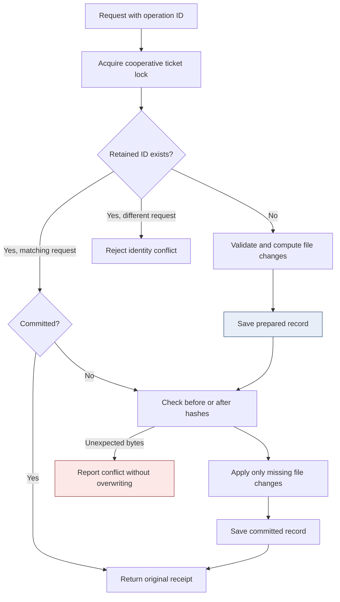
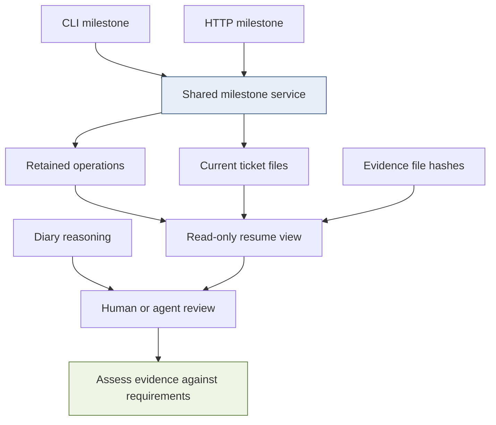
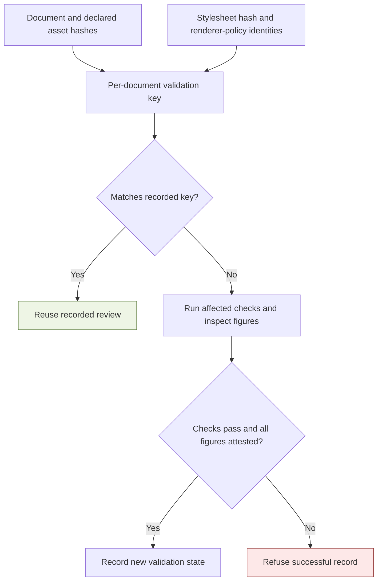

# Docmgr and Agent Skills: Recoverable Documentation and Proportional Validation

A documentation workflow becomes expensive when a completed action leaves uncertainty about what changed, whether it can be retried, and which previous checks remain valid. The resulting work is not necessarily better testing. It can be repeated inspection caused by unstable writes, partial updates, duplicated instructions, and poorly identified evidence.

This project addressed that problem at two different levels. In **docmgr**, it made document writes stable and introduced recoverable milestone operations with read-only resumption. In the **agent skills**, it separated routine success from substantive investigation, assigned delivery policy to one specialist, and added dependency-aware validation helpers. The implementations belong in separate repositories because one changes executable behavior and the other changes instructions and optional workflow tooling.

The central distinction is between reducing uncertainty and reducing verification. The first is an engineering improvement. The second is safe only when the omitted work is demonstrably redundant.

> [!summary]
> - Stable serialization and write-if-changed behavior remove meaningless mutations without discarding authored Markdown.
> - Prepared journals make interrupted multi-file updates recoverable; they do not make those updates simultaneously visible or power-loss durable.
> - Milestone identity, current file revisions, and evidence adequacy are separate concepts.
> - The skills now encourage proportional verification, but reduced agent churn remains an unmeasured hypothesis rather than a demonstrated performance result.

## 1. The project began with observable failure, not a preference for fewer checks

The triggering work was the Video Observatory investigation and the [[PROJ - Engineering Temporal Systems - Textbook Series|Engineering Temporal Systems textbook series]]. That work required implementation evidence, diagrams, executable examples, long-form writing, ticket bookkeeping, and publication. Some verification was intrinsically necessary: a generated figure can parse and still be unreadable, and a successful model test cannot establish browser behavior. Other work was induced by defects in the documentation tools and contradictions between loaded instructions.

The research separated those categories before proposing changes. A request to “be less cautious” would have been too broad. It might suppress the check that catches an unreadable diagram while leaving a defective serializer untouched. The useful questions were narrower: which mutations should have been no-ops, which interrupted operations could be retried safely, and which repeated checks had unchanged inputs?

Two small reproductions established concrete tool defects. In the original writer, successive metadata round trips produced this retained result:

```json
{"body_leading_newlines_after_round_trips":[1,2,3,4],
 "changelog_trailing_newlines":2}
```

The array is not a stylistic disagreement. The same read/write operation repeatedly changed the document body. A user or agent inspecting the diff had to decide whether the extra lines were intentional, generated, or evidence of an incomplete edit.

The close reproduction was more serious. It replaced `changelog.md` with a directory, then invoked the old close command. The command exited with status 1 because the changelog could not be opened, but the ticket status was already `complete`. A second reproduction closed an ordinary ticket twice: the second invocation changed index bytes again and left two closing entries.

These observations explain the implementation order. Fix the mutation contracts first; simplify the instructions second; then automate the remaining bookkeeping. An agent should not need a permanent workaround for an operation that reports failure after silently publishing completion.

## 2. Define the equivalence relation before fixing the serializer

“Preserve the document” can mean several different things. It can mean that parsed metadata values are unchanged, that visible prose is unchanged, or that every byte is unchanged. Those contracts are not interchangeable.

Docmgr documents combine typed YAML frontmatter with an authored Markdown body. The new writer deliberately gives those regions different contracts:

| Region | Preservation contract |
|---|---|
| Typed YAML metadata | Canonical serialization of values; comments and original scalar styling are not retained |
| Unknown YAML fields | Values survive through retained YAML nodes and bounded alias expansion |
| Markdown body | Body bytes are preserved during metadata serialization |
| Frontmatter framing | Delimiter termination uses LF |
| Newly created document spacing | Creation callers provide the initial separator explicitly |

Let `R` parse a document into metadata `m` and body `b`, and let `S(m,b)` serialize them. The body contract is that parsing the serialized result yields the same body bytes. Once metadata has reached its canonical representation, another parse/serialize round trip should produce the same complete byte sequence. This statement assumes the caller does not intentionally change a field such as `LastUpdated` between iterations.

The previous spacing bug came from treating a creation convenience as part of every rewrite. If the body already begins with a separator newline and serialization adds another separator, each round trip increases the prefix. The repair makes creation explicit:

```text
CreationBody(body):
    if body is empty or already starts with a newline:
        return body
    return newline + body

SerializeDocument(metadata, body):
    return opening_delimiter
         + canonical_yaml(metadata)
         + closing_delimiter_with_termination
         + body
```

This is explanatory pseudocode for `CreationBody` and `SerializeDocument` in `internal/documents/frontmatter.go`. The important absence is a global trim of `body`. Markdown hard breaks can depend on trailing spaces; indentation can define code blocks; intentional leading blank lines are still authored bytes. Removing whitespace everywhere would stop one symptom by violating a different contract.

Generated changelogs have their own policy. `BuildChangelogEntry` receives an explicit date and constructs canonical boundaries between sections, ending the generated result with one LF. It does not deduplicate equal entry text: two distinct actions may legitimately have the same description. Retry identity belongs to operations, not to a string comparison of prose.

## 3. Unknown metadata requires more than an extra-fields map

Preserving unknown YAML values prevents a typed Go struct from deleting fields that another tool understands. However, retaining arbitrary YAML nodes introduces a dependency between aliases and anchors.

Consider an unknown field that aliases a value anchored in a known field. The known field is decoded into a Go value, then re-encoded without its original YAML node. If the unknown field is emitted as the original alias node, its anchor may no longer exist in the output. Preserving the node literally would therefore fail to preserve a valid document.

The implementation expands aliases in unknown fields before encoding them. It removes anchor names from the copied nodes and follows alias targets recursively. Expansion has a depth limit of 64 and a shared budget of 10,000 nodes across extra fields. A recursive or excessive expansion fails before the write rather than producing an invalid document or unbounded work.

Parsing order also matters. The reader first attempts to parse valid YAML directly. Only a failed parse enters the existing scalar-repair preprocessing path. Running repair heuristics before parsing valid YAML can turn real aliases into ordinary strings and change inline-comment semantics. A compatibility helper intended to rescue malformed input must not reinterpret valid input unnecessarily.

This is semantic preservation, not source-format preservation. Readers should not expect YAML comments, anchor spelling, or scalar quoting style to survive. The benefit is a clear boundary: typed metadata values and unknown values remain usable, while Markdown body bytes remain untouched.

## 4. A byte-stable result should also be a filesystem no-op

A serializer can return identical bytes while its caller still rewrites the file. That changes modification time and can activate file watchers, incremental tools, synchronization clients, or an agent looking for unexplained modifications. Byte stability is therefore necessary but insufficient.

`WriteFileIfChanged` reads an existing regular file and compares its bytes with the proposed output. Equal bytes return without writing, preserving mtime. For changed bytes, it preserves the existing permission bits, writes a temporary file in the target directory, syncs and closes it, then renames it over the target. Symlink and other non-regular targets are rejected.

There are two separate guarantees here. The equality test eliminates a known unnecessary mutation. The same-directory rename avoids exposing a partially written replacement file through the normal target path. Neither provides a transaction across multiple paths.

The implementation also does not claim isolation from an uncooperative editor between the read and rename. Another program can change the file after comparison. Nor does syncing the temporary file alone establish a full power-loss durability protocol for the directory entries. These exclusions are part of the public contract, not details to infer after failure.

The same principle was later applied to the skills validation-state file. Recording identical validation state now leaves its mtime unchanged. Administrative artifacts should not recreate the no-op defect that the main writer was designed to remove.

## 5. Multi-file work needs retained intent and an explicit recovery rule

A close operation changes at least two representations of a ticket: the status in `index.md` and the narrative history in `changelog.md`. A milestone may change task checkboxes and the changelog. Even when every individual write uses rename, an observer can see one new file and one old file.

The chosen design does not pretend to eliminate that intermediate state. It records enough information to recognize and finish an interrupted operation.

The operation store manages only three projection names: `index.md`, `tasks.md`, and `changelog.md`. A **projection** here is a concrete file whose desired bytes are derived by an operation planner. The prepared record retains the normalized request representation, a request digest, the before hash of each planned path, the intended after bytes, and a receipt containing hashes and identity.



The ordering is deliberate. No projection is changed before the prepared journal has been saved. The journal directory is `.docmgr-operations/`; new directories use mode 0700. The directory lock serializes cooperating operations and is released when the process exits. Supported lock implementations cover Linux, macOS, and FreeBSD; other builds return a capability error for these operations.

The lock does not include all older mutation commands or external editors. That limitation prevents the phrase “transactional update” from being interpreted as database-level isolation. The narrower claim is recoverable, cooperatively serialized application of a bounded set of file changes.

### Recovery is a three-way classification of current bytes

For each planned path, let `B` be its recorded before hash, `A` the hash of intended after bytes, and `C` the current hash. Recovery uses this rule:

```text
if C == A:
    this projection is already applied; skip it
else if C == B:
    write the retained after bytes
else:
    stop with a revision conflict
```

An absent file has the distinct revision `missing`; it is not conflated with an existing empty file. This matters when a plan creates a new changelog.

Suppose tasks were updated but the changelog write failed. On retry, the task file matches `A`, so it is skipped. The unchanged changelog matches `B`, so the retained replacement is applied. If a person edited the changelog in the meantime, its hash matches neither value, and recovery stops. Automatic overwrite would destroy information that is not represented in the saved plan.

The error retains the operation receipt and the paths whose after bytes are already visible. Those paths can include effects from an earlier interrupted attempt, not just the current process. This makes partial success inspectable without pretending that an error means nothing happened.

## 6. Retry identity is different from equal descriptions

The operation ID identifies one logical action. A matching retained ID and request returns the original committed receipt, or resumes the saved plan if it is still prepared. Reusing the ID with a different request fails. An unrelated new operation is blocked while a prepared operation remains unresolved.

The implementation hashes the JSON produced by Go's request encoding. It does not define a universal semantic equivalence relation over arbitrary user requests. Callers should retain the same arguments, including evidence references, expected revisions, and list ordering, rather than assume that a reordered or rewritten request is interchangeable.

Saving output bytes is important because planners may use time. Recomputing a changelog on retry could produce a different date or timestamp. A retry should complete the original action, not quietly create a new version of it.

Committed replay is intentionally historical. It returns the retained result without revalidating whether referenced evidence is still current. The read-only resume command performs that staleness check separately. Otherwise, an acknowledged operation could change from success to failure merely because a report was edited later.

The store assigns monotonically increasing sequence numbers from retained records. It orders records by sequence rather than wall-clock timestamps, so a clock adjustment does not reverse milestone order. The clock-rollback regression specifically tests this distinction.

Identity retention is bounded. The store limits request size to 64 KiB, individual files and journals to 4 MiB, retained record count to 1,024, and scanned journal bytes to 64 MiB. Projection after-bytes are also bounded in aggregate; JSON encoding overhead can make the journal limit stricter than the raw payload limit. Old committed history must be archived deliberately. Removing a pending record to bypass a conflict is not a recovery strategy, and archived IDs must not be reused as though deduplication still remembers them.

These limits also explain the performance model. `Records` reads and validates retained JSON records, then sorts them by sequence. Reading history scales with retained bytes, and sorting scales with the number of records; there is no separate indexed checkpoint store. Retaining intended after bytes simplifies recovery but consumes storage on every recorded change. The 64 MiB scanned-history bound is an input bound, not a promise that total process memory stays below 64 MiB. This is a bounded local-ticket design, not an indefinitely growing event database.

## 7. Close becomes safer without becoming a completion judge

The close planner writes history before status. Consequently, a predictable changelog failure does not publish a completed ticket. A later failure can still leave history ahead of status, but the prepared record explains the intended transition and allows recovery.

The bare and structured CLI paths now use the same close service. This removes the risk that output-mode selection changes mutation semantics. Structured output intentionally changes from the previous duplicated update-boolean map to a receipt-oriented contract; scripts consuming the old fields need review.

An already matching status and intent normally produces no mutation, even if the caller supplies another message. A standalone note belongs in the changelog command, not in a second close. An explicit operation ID gives close a stable retry identity; an interrupted default close reports its generated ID so the caller can retry the original request.

Close still warns about open tasks rather than making them an absolute prohibition. The tool is not able to decide whether every user requirement has been satisfied. It can report task state and preserve the effects of a requested transition. The decision to close remains with the operator or agent reviewing the actual contract.

This separation avoids a common error in automation: converting a mechanical success condition into a semantic completion claim. “Every requested file mutation was applied” is not equivalent to “the project is finished.”

## 8. Milestones consolidate effects; diaries retain reasoning

`RecordMilestone` operates on stable task IDs, validates ticket-contained evidence references, appends a history entry, and stores the request and receipt. It does not write the diary, change ticket status, or infer completion from a passing test.

Stable task IDs matter because positions are mutable. Inserting a new task near the top of a list must not cause a previously authored command to complete a different task. The service rejects unknown IDs and duplicate stable IDs in the parsed task file before application.

Evidence references have four fields: kind, path, revision, and claim. The revision is the SHA256 of the referenced file, not a Git commit ID. The path must resolve within the ticket. This restriction matters particularly for HTTP callers: accepting an arbitrary evidence path must not become an arbitrary server-side file read. To cite another repository, retain a ticket-local report that names the external revision.

A hash binds a claim to specific bytes. It does not establish that those bytes prove the claim. A log can be correctly hashed and still describe the wrong test configuration. The agent must evaluate scope before it marks a task complete.

The public command shape is:

```bash
# EXAMPLE and ab12 must identify an existing ticket and stable task.
docmgr milestone record \
  --ticket EXAMPLE --operation-id persistence-reviewed \
  --summary 'Reviewed persistence regressions' \
  --phase validate --task-id ab12 \
  --next 'Review HTTP parity' --dry-run
```

Removing `--dry-run` applies the request. `--evidence-file` adds the evidence array, and `--expected-file` supplies optional expected hashes for the three managed projections. Those expected revisions provide optimistic guards, not exclusion against arbitrary editors. Structured output uses the pinned Glazed v1.3.6 convention: `--with-glaze-output --output json`.



The HTTP entry points are `POST /api/v1/tickets/milestone` and `GET /api/v1/tickets/resume`. The mutation endpoint uses strict, size-bounded JSON and the same service as the CLI. A successful file operation followed by a failed index refresh returns its committed receipt with a warning. Reporting it as a failed mutation would invite a duplicate action even though the authoritative files had already changed.

## 9. Resume must combine history with current state

A saved status paragraph becomes stale as soon as a later operation changes a task, status, or evidence file. Requiring an agent to maintain another resume document would recreate the synchronization problem the milestone service was meant to reduce.

`TicketResume` instead derives a view under the cooperative lock. It reads current status, remaining tasks, projection hashes, document pointers, and retained operations. It selects the latest committed milestone for phase, next action, and evidence. Pending operations and changed evidence are returned as conflict warnings. The command itself does not write.

One review refinement was essential: the latest milestone is not necessarily the latest writer of every projection. Closing a ticket after recording a milestone legitimately changes the index and changelog. Comparing current files only with the milestone's hashes would incorrectly call the close stale.

The final implementation maintains two views while scanning committed records in sequence order. The latest milestone supplies the narrative checkpoint. The latest committed operation affecting each path supplies that path's expected hash, including operations such as close that are not milestones.

The project exercised this distinction on its own ticket. These are selected fields from retained real receipts, not a simulated trace:

```text
sequence 1  implementation-verified
            committed; changed tasks.md, changelog.md
sequence 2  implementation-closed
            committed; changed changelog.md, index.md
sequence 3  local-installation-verified
            committed; changed changelog.md
```

After the installation milestone, resume reported `complete`, no remaining tasks, and no conflicts. In the companion skills ticket, resume retained the single open real-session evaluation task. The two outcomes express different remaining work rather than forcing both tickets into the same completion state.

Standalone edits may still legitimately produce warnings. Resume is a compact starting point for investigation, not a command to ignore current files or a newer user request.

## 10. Skill composition should assign responsibility, not accumulate commands

The instruction changes address a different failure mechanism. When several loaded skills independently prescribe a complete workflow, their requirements accumulate. Even individually reasonable instructions can produce repeated help reads, redundant preflights, and contradictory delivery checks.

The revised research skill delegates responsibilities. Docmgr owns ticket command contracts; the diary skill owns entry formats and evidence levels; the upload specialist owns delivery mechanics. Phase-specific references distinguish starting, implementing, checkpointing, resuming, and closing. They are instruction conventions, not changes to Pi's loader or an automatic scheduler.

The upload policy illustrates the difference. An unambiguous successful upload does not routinely require status, account, and independent listing commands. Explicit user verification requirements still take precedence. Ambiguous results and unresolved overwrite risk still require investigation. Authentication retry is bounded, and replacement that would discard annotations still needs authorization.

The objective is not “never list remote files.” It is “perform that inspection when it establishes something needed.” A cloud success result supports a cloud-delivery claim; it does not prove that a physical device has synchronized. Naming the claim precisely prevents both excess checking and unsupported success reports.

Diary selection follows the same reasoning. Routine successful bookkeeping can use a compact milestone entry. Substantive implementation, failures, design decisions, or an explicit detailed-diary request use the investigation format. Historical detailed entries are preserved. The new policy changes future work; it does not rewrite the record to make an earlier session appear less expensive.

## 11. Validation reuse is a dependency problem

A check is reusable only when the inputs relevant to its conclusion are unchanged. The fact that the document text is unchanged is insufficient if its renderer, stylesheet, included assets, or validation policy changed.

The optional `workflow_checks.py` helper encodes this idea for document validation. It computes a per-document key from the document byte hash, declared asset hashes, stylesheet hash, renderer identifier, policy identifier, and recognized figure list. It compares that key with recorded state and requests review only for pending documents.

```text
key(document) = hash(canonical_JSON({
    body_hash,
    declared_asset_hashes,
    stylesheet_hash,
    renderer_identifier,
    policy_identifier,
    recognized_figures
}))
```

This is a description of the implemented key, not a claim that the helper discovers every dependency. Renderer and policy are caller-supplied identifiers. A renderer implementation change must change its identifier or be declared through hashed dependencies. External includes and other relevant inputs must also be declared. An omitted dependency can invalidate the reasoning while leaving the cache key unchanged.



The tests make the intended invalidation scope concrete. Changing a declared asset used by `a.md` invalidates `a.md` but not an unrelated `b.md`. Changing the shared stylesheet, renderer identifier, or policy identifier invalidates both. An unchanged set produces no pending documents.

A separate regression prevents first-figure-only validation. The fixture contains two Mermaid diagrams; recording a review of only `mermaid:1` is rejected. Both recognized figures must be attested, and `checks_passed` must be true. However, an attestation is still a caller-supplied statement. The helper does not inspect pixels or judge whether the reviewer actually understood the diagram.

Figure recognition is intentionally limited to the implemented patterns for Mermaid fences and ordinary Markdown image syntax. It is not a complete Markdown or Obsidian parser. Reference-style images, transclusions, plugins, and other rendering features require explicit handling rather than an assumption of exhaustive discovery.

The result is a useful but bounded mechanism: avoid redoing known-valid work while making dependency changes visible. It is not a general scheduler for every Go, browser, security, and deployment test in the repositories.

## 12. Proportional evidence does not mean weaker evidence

The evidence guidance distinguishes four situations. Routine success needs the command, result, and relevant revision. An experiment additionally needs configuration, versions, inputs, observations, and interpretation. A failure needs its exact relevant diagnostic and recovery context. A byte-identity claim needs the original bytes or hashes appropriate to that claim.

This distinction prevents a peculiar form of excess work: preserving a compressed raw copy of a routine success log solely because normalization changed decorative whitespace. If the claim is only that `doctor` passed, readable output and revision are enough. If the claim concerns serialization bytes, normalization would destroy the subject of the test and cannot substitute for raw evidence.

Likewise, repeating a targeted test after changing its implementation is not churn. Re-running every unrelated suite because a diary paragraph changed usually adds little evidence about that paragraph. A final integration review remains necessary because a set of local checks can miss a boundary between components. Its purpose is to cover those boundaries, not to repeat unchanged checks without a reason.

The installed build supplied a concrete example of justified additional verification. The earlier development binary was a CLI test build. Installation required `make build-embed` so that replacing the existing local executable would not discard its embedded web UI. The installed executable was then checked for `sqlite_fts5,embed` tags and exercised through the CLI smoke test. Those checks addressed a new artifact and installation boundary; prior library tests did not establish them.

A concrete decision sequence makes the policy less ambiguous:

| Change since the last successful check | Appropriate next validation | What the old result cannot establish |
|---|---|---|
| Edit one article paragraph, with unchanged figures and renderer | Review the new prose and document syntax/links | Correctness of the new wording |
| Change an asset used by one document | Re-render and review that document's affected output | Appearance of the changed asset |
| Change the shared renderer or stylesheet | Revalidate dependent documents | Layout under the new rendering implementation |
| Change operation recovery code | Run relevant recovery/concurrency tests and review callers | Behavior of the new failure path |
| Build the installed embedded executable | Verify build tags and exercise that executable | Correct packaging from library tests alone |

The table is review guidance, not a complete automatic rule set. The implemented helper is coarser: its cache unit is a whole document, so a prose edit marks that document pending and still requires a complete figure attestation. It does not independently cache each figure or select Go tests. A prose edit that changes a mathematical or behavioral claim can also require an additional experiment even though no renderer dependency changed. Mechanical dependency keys and semantic review answer different questions.

## 13. What the tests and installation actually establish

The implementation validation covered ordinary and FTS5-tagged Go tests, race tests in the operation/command/HTTP packages, repository scenarios, CLI smoke behavior, static checks, frontend type checking, and targeted lint. Installation added tagged web/HTTP tests and the exact CI-pinned golangci-lint v2.12.2 and GoSec command. The skills helper suite has ten passing tests.

The recovery tests inject failures before the prepared journal, each of two fixture projection writes, and the committed journal marker. Retrying reaches the intended final bytes. Another test changes a file after partial application and verifies that recovery preserves the human edit and reports a conflict. Concurrency tests submit eight requests with the same identity and check that only one record remains; lock cancellation is tested separately.

These are deterministic error-injection tests, not a physical power-cut experiment. They support the advertised interruption and replay paths but do not justify expanding the durability contract. Similarly, a passing policy fixture shows that a Python model of the policy selects the expected actions; it does not show that an arbitrary agent will follow the prose.

Dependency work raised the minimum Go version to 1.26.6 and updated reachable vulnerable dependencies. The retained post-update vulnerability scan reported zero reachable findings. Some package/module advisories remained without reachable calls, so “zero reachable findings” should not be shortened to “no dependency vulnerabilities exist.”

The locally installed executable is `/home/manuel/.local/bin/docmgr`, built from clean revision `e607822` with Go 1.26.6 and the embedded UI/FTS5 tags. Its SHA256 is `449999482b7fbe9f1bc265a341b7e956bf4f699da50ede6a2aea73b76f462766`. Later source commit `1d3df1e` records the installation and readiness check; it does not represent a different installed implementation.

At this report's checkpoint, the source changes were committed locally and ready to open as separate docmgr and skills PRs. They had not been pushed or opened. Local checks are evidence for readiness to begin review, not a substitute for remote CI or maintainer approval.

## 14. Will other agents do less redundant work?

The mechanism is plausible and the lower-level correctness improvements are demonstrated. Whether the instruction changes reduce agent overhead has not yet been measured in equivalent post-adoption sessions.

The distinction matters because the session that motivated the work was unusually broad. It combined research, implementation, document rendering, publication, and repeated user requests. Raw tool counts cannot attribute a causal time saving to a new skill. A shorter session may have had an easier task, fewer figures, less demanding delivery requirements, or incomplete verification.

The optional comparison helper therefore requires matching task class and requirement lists. It compares curated observations such as redundant reloads, independent state records, and unnecessary mutation diffs. It also checks whether requirement coverage, retained failure context, or unsupported success claims changed. A change in those guardrails is flagged for review rather than treated automatically as an improvement.

The helper does not discover comparability on its own, and unchanged curated guardrail values do not prove equivalent quality. A useful evaluation must examine what the agent actually did: which check it reused, what inputs remained unchanged, whether the retained failure still explains the outcome, and whether any omitted validation would have caught a real problem.

The open skills task `vewh` retains that work explicitly. The correct current conclusion is that the project removed concrete causes of uncertainty and supplied clearer instructions for proportional verification. It has not established a percentage reduction in tokens, elapsed time, or redundant tests.

## 15. Source map and reconstruction path

The report draws on local implementations at docmgr `1d3df1e` and skills `62d63d3`. The implementation itself is concentrated in earlier focused commits: docmgr persistence `91e0603`, recoverable operations `582171f`, security updates `7de2ea4`, YAML/scaffold refinements `b1f53fc`, CLI/HTTP integration `1516abc`, and resume reconciliation `1d0710d`; skills policy/tooling `112f8aa` and validation-state no-op behavior `acb7338`.

The two repositories are `/home/manuel/code/wesen/go-go-golems/docmgr` and `/home/manuel/.pi/agent/skills` (the latter resolves to the shared `/home/manuel/.codex/skills` tree). The focused source-reading route is:

| Question | Primary source |
|---|---|
| What is preserved during a metadata edit? | `internal/documents/frontmatter.go`, `internal/documents/stability_test.go` |
| What makes an unchanged write a no-op? | `internal/documents/write.go` |
| How are interrupted updates recovered? | `internal/operations/store.go`, `store_test.go`, `sequence_test.go` |
| Why is history written before status? | `pkg/commands/close_service.go` |
| What does a milestone validate? | `pkg/commands/milestone_service.go` |
| How does resume handle a later close? | `pkg/commands/resume_projection_test.go` |
| What do clients actually call? | `pkg/doc/milestone-workflows.md`, `internal/httpapi/milestones.go`, `ui/src/services/docmgrApi.ts` |
| What evidence should a diary preserve? | Skills: `diary/references/evidence-levels.md` |
| What inputs invalidate review? | Skills: `ticket-research-docmgr-remarkable/scripts/workflow_checks.py` and `test_workflow_checks.py` |

The docmgr ticket is `ttmp/2026/09/10/DOCMGR-FRICTION-001--reduce-documentation-workflow-friction-with-deterministic-writes-and-coherent-milestones`. Its `sources/write-reproduction.json` and `sources/close-reproduction.json` retain the original failures. Its implementation and installation receipts retain the real operation sequence described above. The corresponding skills ticket is `ttmp/2026/09/10/SKILLS-FRICTION-001--make-skills-phase-aware-proportional-and-consistent-across-long-sessions`. Both contain detailed investigation diaries and the original intern-oriented design guides.

The article's colocated `_assets/docmgr-workflow-friction/` directory retains a compact evidence snapshot and reviewed renderings of the three diagrams. The native Mermaid definitions remain in the article. No new reMarkable delivery is implied by publishing this vault report.

## Conclusion

Reliable documentation tooling should make repetition uneventful when nothing has changed and make partial application explicit when something fails. That requires separate contracts for serialization, filesystem replacement, logical operation identity, recovery, and evidence freshness. Combining them into a general promise of “atomic” or “safe” behavior obscures exactly the cases an agent needs to understand.

The skills changes apply the same precision to process. A successful check is reusable only within its dependency and evidence scope. A diary should preserve the reasoning and failures that matter, not expand every routine success into an investigation. A specialist policy should be invoked where needed rather than copied into each orchestrator.

These changes make it possible to spend less effort on redundant confirmation without lowering the standard for a completion claim. Demonstrating that other agents consistently do so is the next empirical task, not a result to assume from the implementation.
