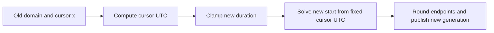
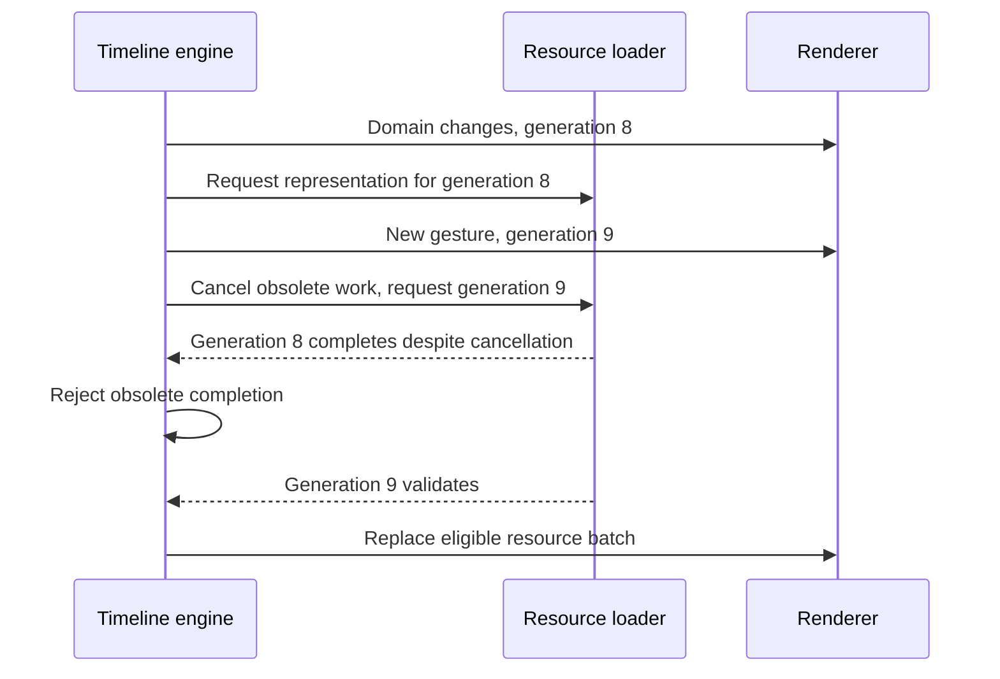
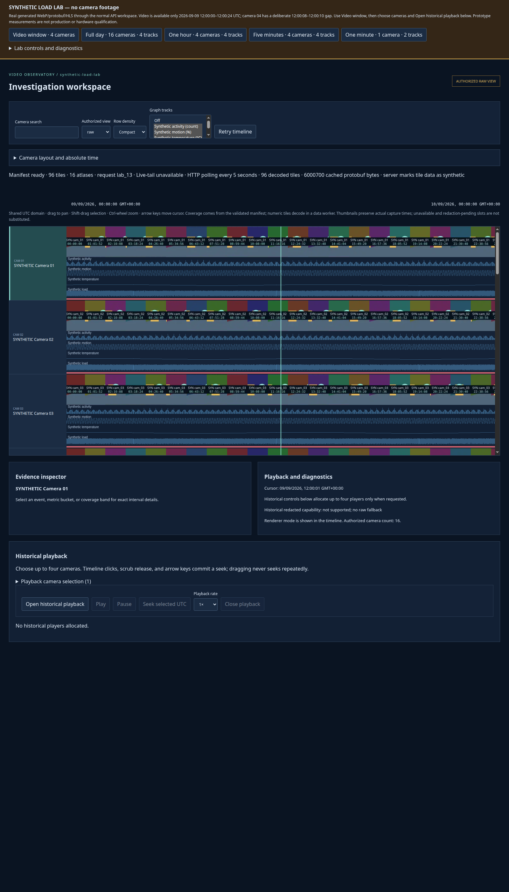

# Multiresolution Time-Series Visualization: Sampling, Coordinates and Bounded Rendering

A timeline cannot give every observation a distinct horizontal position when there are more observations than available pixels. Increasing the speed of the drawing API does not change this constraint. The useful design question is which information to preserve at each scale, and how to change that representation without changing the meaning of the data.

This chapter derives a timeline engine whose work depends on the current view rather than the full recording history. We will use integer timestamps, canonical temporal tiles, independent numeric and image resolutions, and bounded geometry. We will also distinguish the immediately visible view from the asynchronously loaded resources that describe it. Those distinctions matter: a renderer can be fast while showing stale evidence, and a renderer can be bounded while its upstream request queue is not.

Series: [[PROJ - Engineering Temporal Systems - Textbook Series]].

The executable companion is [timeline.py](_assets/temporal-systems/timeline.py), with [tests](_assets/temporal-systems/tests/test_timeline.py) and [retained output](_assets/temporal-systems/outputs/timeline-demo.json). It is a new educational model, not a replacement for the product. The implementation case study is [[ARTICLE - Video Observatory - Scrolling Through a Day of Video Without Loading a Day of Video]]. Project context and earlier reports are available through [[PROJ - Video Observatory - Technical Deep Dive Series]].

## 1. Decide what the display is supposed to preserve

Let a visible interval have duration $D$ seconds and width $W$ CSS pixels. If observations arrive regularly every $\Delta$ seconds, the interval contains approximately $D/\Delta$ observation opportunities. The number of opportunities per horizontal pixel is

$$
\rho = \frac{D}{W\Delta}.
$$

For a day, a width of 1,400 pixels and a two-second observation interval, $\rho=86400/(1400\cdot2)\approx30.86$. At minute scale the same expression gives $0.0214$: the thirty observation opportunities are separated by about 46.7 pixels. One fixed representation cannot be appropriate at both scales.

An opportunity is not necessarily an observation. If the camera or measurement source was unavailable, the dataset has missing values. Nor does a valid point observation necessarily establish continuous coverage between it and the next observation. Representation selection must preserve these distinctions rather than replacing missing values with zero or implying that a sparse sequence is continuously measured.

### 1.1 Aggregation is not reconstruction

Consider the eight values

```text
0, 0, 0, 8, 0, 0, 0, 0
```

Their mean is one and their extrema are zero and eight. A mean line communicates the average observed value. A min/max envelope communicates that at least one observed value reached eight. Neither representation preserves the position of the spike unless temporal metadata is stored separately. Neither permits reconstructing all eight original values.

The distinction becomes sharper for an alternating sequence:

```text
+1, -1, +1, -1, +1, -1, +1, -1
```

Taking every second value produces a constant positive sequence. Pairwise means produce zero. Pairwise extrema produce the interval $[-1,1]$. These are different answers because they implement different operations. The extrema are suitable for showing observed range, not the frequency or phase of the source oscillation.

For signal reconstruction, impose additional assumptions. Suppose a continuous signal is band-limited below frequency $f_{max}$ and is sampled regularly at rate $f_s>2f_{max}$. Under the ideal sampling theorem, those samples determine the signal. To downsample an already sampled signal by factor $k$, first suppress frequency content above the new half-sampling rate, $f_s/(2k)$, then retain samples on the coarser grid. Practical filters require a transition band and introduce approximation and possibly delay. A block average is one particular finite filter; it is not an ideal low-pass filter and does not provide a general alias-free guarantee.

A visual envelope does not perform this reconstruction task. It can deliberately preserve a short extreme that a low-pass filter would attenuate. Choose it when the reader asks “what observed range occurred here?” Choose a filtered curve when the reader asks about a lower-frequency signal under appropriate sampling assumptions. Choose a representative image when the reader needs identifiable visual content. The selection policy follows the question, not a universal instruction to downsample.

Steven W. Smith's *The Scientist and Engineer's Guide to Digital Signal Processing*, Chapter 3, [“The Sampling Theorem”](https://www.dspguide.com/ch3/2.htm), develops the reconstruction and aliasing conditions. The discussion above applies those conditions narrowly; it does not apply a band-limited reconstruction theorem to irregular missing observations or to extrema envelopes.

## 2. Keep absolute time out of floating-point geometry

Let $u$ denote an integer UTC timestamp in microseconds, and let the viewport be the half-open interval $[a,b)$. Define $D_\mu=b-a$. Its forward and inverse coordinate maps are

$$
x(u)=W\frac{u-a}{D_\mu},
\qquad
u(x)=a+\operatorname{round}\left(\frac{xD_\mu}{W}\right).
$$

The subtraction is the important operation. UTC near the example day is about $1.789\times10^{15}$ microseconds. Binary32 has 24 bits of significand precision, including its leading bit. In the exponent range containing that absolute timestamp, adjacent representable numbers are $2^{50-23}=134217728$ microseconds apart: about 134 seconds. A float32 vertex attribute containing the absolute epoch cannot distinguish nearby frames or even many nearby observations.

Instead, subtract the integer viewport origin before conversion, and preferably compute final pixel positions before storing float32 geometry. At about 1,400 pixels, binary32 spacing is approximately $2^{-13}$ pixels, a completely different numerical scale. This is not proof that every part of a rendering pipeline is exact. It explains why the representation should match the magnitude actually needed by that pipeline.

The product uses bigint timestamps and bounded relative conversion. The Python model retains exact `Fraction` values until it emits coordinates:

```python
def time_to_x(utc, domain, width):
    return Fraction((utc - domain.start) * width, domain.span)

def x_to_time(x, domain, width):
    return domain.start + round(Fraction(x) * domain.span / width)
```

With an exact rational coordinate, the round trip for an integer input timestamp is exact. When the coordinate has first been rounded to a floating-point screen value, the inverse has both coordinate error and microsecond rounding error. If coordinate error is $\epsilon_x$, the temporal contribution is approximately $D_\mu\epsilon_x/W$. A tenth of a pixel represents about 6.17 seconds at day scale, but only about 4.29 milliseconds at minute scale. Screen precision and timestamp precision are separate constraints.

Python `round` uses ties-to-even; JavaScript `Math.round` has a different tie rule. The model is not a bit-identical translation. Its coordinate tests use rational values and its zoom test permits a one-microsecond anchor discrepancy. The domain is bounded between four seconds and seven days, matching the example's admitted interaction range rather than suggesting that finite-precision arithmetic accepts unrestricted durations.

### 2.1 Derive zoom from an invariant

Suppose the cursor is at $x_c$, and its current timestamp is $u_c=\nu(x_c)$. A zoom factor $z>1$ reduces duration to $D'_\mu=D_\mu/z$. To preserve the timestamp under that cursor, solve

$$
x_c=W\frac{u_c-a'}{D'_\mu}
\quad\Longrightarrow\quad
 a'=u_c-\frac{x_cD'_\mu}{W},
\qquad b'=a'+D'_\mu.
$$

Clamp the new duration before calculating the new start; otherwise a later clamp breaks the constraint used in the calculation. Round integer endpoints consistently. At the viewport center, zooming a day by factor 1,440 produces a minute centered on noon. At the left edge it produces a minute beginning at the original left edge. A zoom operation based only on changing duration would not distinguish these two user intentions.



### 2.2 Derive pan from the initial gesture

Store the initial domain and pointer coordinate when a drag begins. For a later pointer coordinate $x_1$, compute the displacement against that same snapshot:

$$
\delta_\mu=\nu_0(x_0)-\nu_0(x_1),
\qquad [a_1,b_1)=[a_0+\delta_\mu,b_0+\delta_\mu).
$$

Moving the pointer to the right moves the visible domain earlier. Computing every update from the previous rounded update accumulates error and makes the outcome dependent on event frequency. Computing from the snapshot makes the final geometry depend on the initial state and current pointer instead.

Cancelling a gesture may restore the initial geometry. It must not restore an old request generation. A request started during the drag can finish after cancellation. Monotonically advancing generations allow the engine to restore the old interval while still rejecting work associated with an obsolete interaction.

## 3. Give every resolution a canonical grid

A tile is a resource for a fixed interval, not a resource for whatever range happened to be on screen when it was requested. In this example, level $L$ has tile duration

$$
S_L=64\cdot2^L\ \text{seconds}.
$$

Tile $j$ covers $[jS_L,(j+1)S_L)$. Its identity can be reused across overlapping views. The level is part of the identity; so are the source, track, view, revision and relevant authority scope in a real resource system.

For integer microsecond endpoints, the intersecting indices are

$$
j_{first}=\left\lfloor\frac{a}{S_{L,\mu}}\right\rfloor,
\qquad
j_{last}=\left\lfloor\frac{b-1}{S_{L,\mu}}\right\rfloor.
$$

The subtraction of one microsecond implements the half-open end. A view ending exactly at a tile boundary does not require the tile on the other side. Mathematical floor also matters before epoch zero: the interval $[-64,0)$ seconds is tile $-1$, not tile zero. Integer division that truncates toward zero is wrong for this case unless corrected.

Each numeric tile contains 256 buckets; each image tile contains 32 representative slots. Thus numeric spacing at level zero is 0.25 seconds, while image slot spacing is two seconds. These are layout constants, not claims that measurements or captures occur at every nominal bucket boundary. Actual sample times belong to the data.

### 3.1 Choose levels independently

Let $h_0$ be base representation spacing in seconds, and let $p$ be its target width in pixels. At level $L$, spacing is $h_02^L$, so its screen width is

$$
p_L=\frac{Wh_02^L}{D}.
$$

Solving $p_L=p$ gives

$$
L^*=\log_2\left(\frac{Dp}{Wh_0}\right).
$$

Round to an admitted integer level and clamp to available resolutions. Nearest-level rounding gives widths within a factor of $\sqrt 2$ of the target when no clamp applies. It does not force each bucket to occupy exactly the target number of pixels.

For the day view, numeric $p=0.75$ and $h_0=0.25$ give $L^*\approx7.53$, hence L8. Numeric buckets span 64 seconds and approximately 1.037 pixels. Image $p=80$ and $h_0=2$ give $L^*\approx11.27$, hence L11. An image slot spans 4,096 seconds and about 66.37 pixels. Choosing L8 for both representations would leave images about 8.30 pixels wide, too small for the intended visual inspection task.

An optional hysteresis band can keep the previous level while the desired spacing remains sufficiently close to its spacing. This reduces repeated changes near thresholds, but it makes level selection stateful. The product's `chooseLevel` accepts a previous level and checks an 80–120% spacing band. The inspected lab server does **not** pass a previous level. The educational model also uses stateless rounding. Neither should be described as having active server LOD hysteresis.

Hierarchical summaries make these resolutions reusable, but their algebra must preserve meaning: parent means require counts or weights, not a mean of means. That is the subject of Chapter 3, not a property conferred merely by placing data on a power-of-two grid.

## 4. Bound rendering separately from loading

For uniform row height $H$, vertical scroll position $s$, visible height $V$, row count $N$ and overscan $o$, the row interval is approximately

$$
r_{first}=\max(0,\lfloor s/H\rfloor-o),
\qquad
r_{end}=\min(N,\lceil(s+V)/H\rceil+o).
$$

The interval is half-open, just like the time domain. The ceiling includes a partially visible last row. With 232-pixel rows, a 720-pixel viewport, sixteen total rows and two rows of overscan, the top viewport selects rows zero through five. Variable-height rows require cumulative offsets and an index search rather than this uniform-height formula.

For each selected row, enumerate intersecting tiles and their buckets. Reject any bucket completely outside the domain. For a bucket interval $[t_0,t_1)$, clip its screen extent to $[0,W]$ before emitting geometry. Clipping removes offscreen work; it does not change a bucket's original temporal meaning. An envelope still describes its original observation interval, including any portion outside the current view.

A rectangle can be rendered by an instanced unit quad with per-instance position, dimensions and data attributes. Instancing reduces repeated vertex descriptions and draw-call overhead. It does not remove the need to bound instance generation, nor does it guarantee a frame time on an unspecified GPU. The CPU can exhaust time constructing instances before the GPU receives any command.

### 4.1 Derive the bounds

Let $R$ be admitted visible rows, $K$ intersecting tiles per row, $B=256$ buckets per tile and $I$ the instance limit. Enumeration costs $O(RKB)$ and retained geometry costs $O(\min(RKB,I))$. The example checks the candidate upper bound **before** allocation, rejecting it if it exceeds the limits rather than allocating an enormous list and trimming it later.

`timeline.py` admits at most 512 tile references per row selection and at most 128 rows in the supplied collection. It separately checks 50,000 candidate instances and a 512 KiB equivalent packed-output budget. Four float32 scalars require 16 bytes per instance, so the byte limit admits at most 32,768 such instances and is stricter than the instance count in this format. The actual implementation returns Python tuples containing Python numbers; 16 bytes is an equivalent packed representation, not its heap usage.

If LOD remains away from clamps, $K\approx D/(Bh_02^L)+O(1)$. Substituting the desired spacing gives $KB\approx W/p+O(B)$, so temporal work is approximately proportional to screen width rather than dataset duration. Once the coarsest available level is reached, that relationship no longer holds for increasing durations. Explicit domain/reference admission is what preserves a hard bound there. “Arbitrarily large archive” means the archive can outgrow the view; it does not mean a bounded-resolution API admits an arbitrarily wide view.

### 4.2 Account for each owner

| Owner | Example or inspected policy | What it does not bound |
|---|---|---|
| Educational geometry | 50,000 candidates and 512 KiB four-scalar equivalent, checked before output | Python heap, product caches or GPU driver allocations |
| Product numeric loader | 512 admitted references, 16 tracks; 64 MiB encoded cache | Only currently visible rows; native browser totals |
| Product atlas host | 192 MiB texture estimate, 8 MiB pending uploads, 4 MiB upload allowance per frame | Driver overhead, process RSS or guaranteed upload latency |
| Product renderer | 50,000 combined instances and capped device-pixel ratio | Whole-source storage or network queues |
| Server resources | Independently bounded numeric, pyramid and image caches | Browser memory or physical graphics residency |

A 1,280×360 RGBA8 atlas has $1280\cdot360\cdot4=1,843,200$ bytes of base-level texel storage. Its compressed WebP transfer size is a different quantity. Mipmaps, alignment, driver bookkeeping and implementation copies can add storage. Dividing the base estimate into an application budget is useful ownership accounting, not a measurement of total VRAM consumption.

Pacing uploads limits how much the application submits in one rendering interval. The product's 4 MiB allowance can accommodate two such base-level atlas estimates, but whether they complete quickly depends on the browser and device. MDN's [WebGL best practices](https://developer.mozilla.org/en-US/docs/Web/API/WebGL_API/WebGL_best_practices) recommends batching, texture atlases, explicit resource release and application memory budgets; it also explains that WebGL does not expose a portable total-video-memory query.

Most importantly, numeric loading in the inspected product is batch-oriented and can include all admitted cameras. Row virtualization bounds row rendering and visible image work; it does not mean that every upstream subsystem requests only visible rows. Attach every performance claim to its actual owner.

## 5. Replace representations without changing evidence

The viewport should move as soon as the gesture updates it. Waiting for the next network response makes interaction latency depend on the server. Conversely, moving old samples to convenient new positions makes interaction appear responsive by displaying incorrect evidence. The solution is immediate geometry publication with separately validated resource publication.



Cancellation asks work to stop. Eligibility decides whether a result may affect current state. They solve different problems because completion can race with cancellation, and some underlying work cannot be interrupted promptly.

Retaining one previous validated representation can avoid unnecessary blanks while a finer level loads. Its original timestamp coordinates must be transformed into the new viewport; the data must not be stretched to fill the new domain. Retention also needs a compatibility predicate. A result from a different authority, view, catalog or reset lifetime is not a permissible visual fallback merely because its interval overlaps.

In the product, `useTileResources` retains one completed numeric batch only under specified non-null-manifest and view/catalog/retry-lifetime conditions. `tile-loader.ts` resolves a `Promise.all` batch, rather than publishing every numeric tile progressively. One failed request can therefore prevent publication of a whole new batch. An honest pending or missing-detail state is preferable to claiming completeness from a mixture whose provenance has not been checked.

The engine's direct listeners receive immediate changes, while React-facing state is published on a slower schedule. This is a separation of interaction and query/UI update rates, not permission to omit generation checks. The educational `Engine.eligible` checks only generation; it deliberately does not implement the product's authority-scoped resource predicate.

## 6. Run and inspect the worked engine

From the companion directory:

```sh
cd Projects/2026/09/10/_assets/temporal-systems
PYTHONDONTWRITEBYTECODE=1 python3 -m unittest discover -s tests -v
python3 timeline.py
```

The retained run selected numeric L8, image L11 and six rows. The six numeric tile indices were 109186 through 109191. Clipping emitted 8,100 extents, with a four-float32 equivalent of 129,600 bytes. The first extent began at x=0 and ended at x=1.037037; the next ended at x=2.074074. These values follow directly from 64-second buckets in an 86,400-second view of width 1,400.

The interaction trace is:

| Operation | UTC microsecond domain | Interpretation |
|---|---|---|
| Center zoom by 1,440 | `[1788955170000000,1788955230000000)` | One minute around noon |
| Pan from x=700 to x=840 | `[1788955164000000,1788955224000000)` | Move six seconds earlier |
| Cancel pan | `[1788955170000000,1788955230000000)` | Restore geometry, advance generation |
| Complete the pan's old request | `late_completion_eligible=false` | Do not publish obsolete work |

At minute scale the numeric level clamps to L0 and the selected tile indices are 27952424 and 27952425. The clamp means the view can show the finest available representation but cannot invent observations at a finer spacing.

Four unittest cases passed. They cover 1,000 seeded randomized time/coordinate and zoom checks, negative epochs, exact half-open boundaries, independent numeric/image levels, row selection, clipped geometry, admission rejection and cancellation without generation rewind. Their [retained log](_assets/temporal-systems/outputs/timeline-tests.log) is evidence of those model invariants, not a browser benchmark. The model does not allocate source observations, create textures or fetch resources.

The retained product screenshot below provides a separate kind of evidence: the implemented day-scale UI running in the synthetic lab. It does not prove the model's algebra, establish a universal frame rate or measure total system memory.



*Retained P5 cold day view. Source measurements and their limitations are discussed in the original project report; this chapter does not reinterpret the screenshot as a new performance experiment.*

## 7. What the design establishes

The reusable result is not “use tiles” or “use WebGL.” It is a collection of explicit contracts. Integer time preserves identity; relative geometry preserves usable numerical precision. Canonical grids make representations reusable. LOD connects their resolution to display needs. Admission and ownership checks bound work before allocation. Generation and authority checks prevent asynchronous completion from changing the meaning of the current view.

- A representation must identify the question it answers. An envelope, a filtered curve and a representative image preserve different information.
- Bounds must name their owner. Visible row work, admitted numeric batches, compressed caches and texture estimates are not interchangeable.
- Interaction geometry and resource eligibility advance independently. Restoring a previous view does not authorize an old completion.
- Tests can establish mathematical and state invariants without establishing physical-browser performance. Both kinds of evidence are useful when labeled accurately.

The next related foundations are summary algebra and asynchronous ownership. A correct grid is not enough if its parents contain incorrectly weighted statistics; a correct renderer is not enough if obsolete resources remain eligible to publish.

### Source and reference notes

The implementation statements above refer to source checkpoint `ee51ca7b3091d96f9428199412038c1285099085`; the subsequent inspected HEAD differs in documentation, not `web-ui` code. Relevant symbols are `timeToX`, `xToTime`, `zoomDomain`, `floorDiv` and `chooseLevel` in `web-ui/src/engine/time.ts`; gesture/publication logic in `engine/timeline.ts`; row/scene geometry in `engine/rows.ts`, `engine/scene.ts` and `render/geometry.ts`; atlas ownership in `render/atlases.ts`; and batch retention/admission in `app/useTileResources.ts` and `data/tile-loader.ts`.

External sources read September 10, 2026: Smith's Chapter 3 sampling-theorem section, and the MDN WebGL best-practices sections concerning batching, atlases, explicit resource destruction and memory budgeting. These support the explicitly scoped general claims above. The new rational-coordinate engine and its outputs are educational extensions, independently linked and tested.
