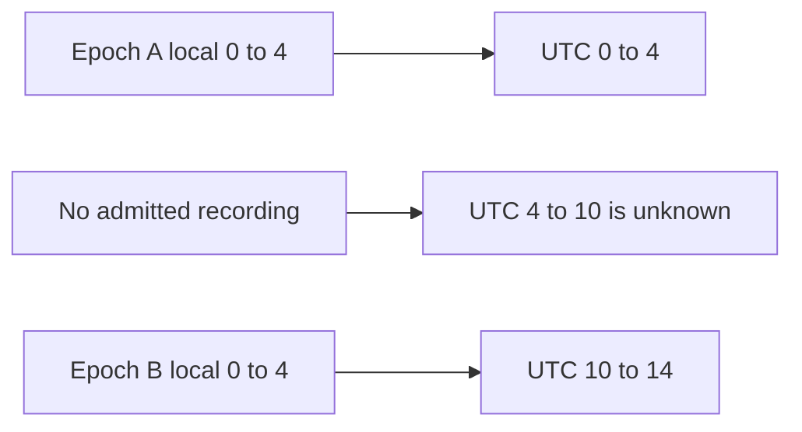
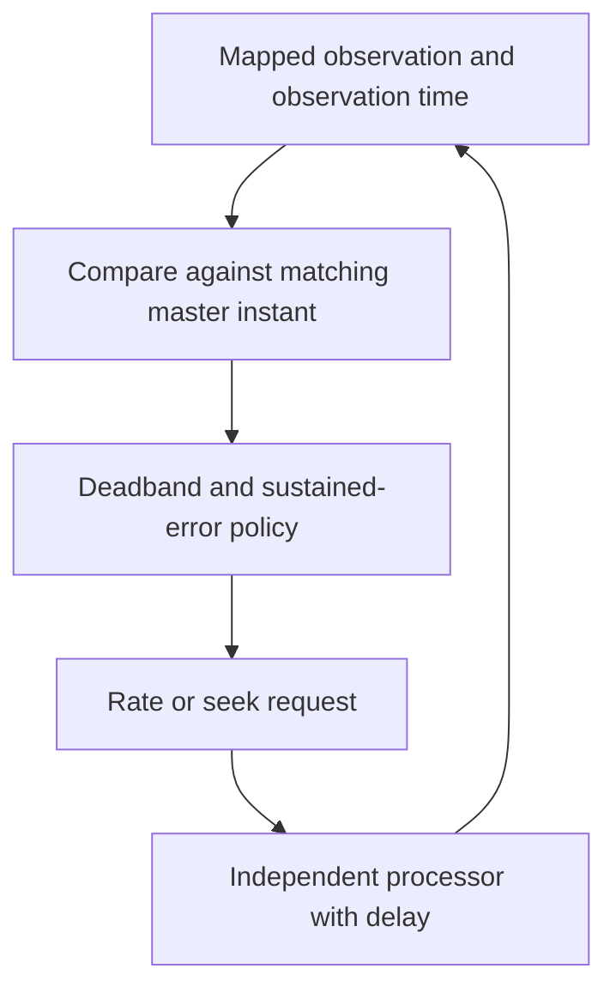

# Temporal Coordination of Asynchronous Media: Clock Domains, Discontinuities and Feedback Control

Independent media processors do not become synchronized merely because an application assigns them the same playback position. Each processor applies requests after some delay, buffers independently, and may expose timestamps whose origin changes between recordings. Synchronization therefore requires both a valid mapping of time and a policy for correcting differences observed through an asynchronous interface.

We will construct those two parts separately. A mapping answers which application time a media timestamp represents. A controller answers what to do when that mapped time differs from a common target. Keeping them separate prevents a controller from trying to correct missing or invalid information as though it were ordinary drift.

Series: [[PROJ - Engineering Temporal Systems - Textbook Series]]. The executable [clock model](_assets/temporal-systems/clocks.py), [tests](_assets/temporal-systems/tests/test_clocks.py) and [simulation trace](_assets/temporal-systems/outputs/clocks-demo.json) accompany this chapter. They are deterministic educational code, not a browser or camera measurement. Chapter 7 applies this foundation to historical sessions; this chapter establishes the mathematical and control assumptions without reproducing that session walkthrough.

## 1. A timestamp needs a clock and a unit

A number such as `12.4` is not enough to identify an instant. It might be elapsed time since a page began, seconds on a media element's timeline, or time since a recording epoch. Converting between these quantities requires an identified correspondence, not just a unit conversion.

| Quantity | Convention here | Purpose and limitation |
|---|---|---|
| UTC | Integer microseconds, $u$ | Names application/history instants; stored precision does not establish capture accuracy |
| Monotonic elapsed time | Milliseconds, $p$ | Measures progression during one execution without wall-clock adjustments |
| Local media position | Seconds, $m$ | Names a position within a particular media mapping epoch |
| Encoded timestamp | Ticks, $q$, at timescale $f$ | Represents codec/container timing; PTS and DTS can differ |
| Physical capture time | Actual acquisition instant | Requires source clock and acquisition evidence beyond browser labels |

Wall time can be adjusted forward or backward. If playback advancement uses successive wall-clock readings, an unrelated clock correction can make the target jump. A monotonic clock avoids that particular problem: construct a UTC anchor once, then advance it using elapsed monotonic time. W3C High Resolution Time Level 3, section 2.1, distinguishes these clocks and notes that monotonic values are not universal identifiers across browser executions. Timer throttling is also distinct from clock progression: a callback can be delayed even while elapsed time continues to increase.

Precision, accuracy and uncertainty must not be conflated. A microsecond integer is precise enough to represent microsecond increments. A source clock that is 40 milliseconds wrong still produces microsecond integers. Similarly, a nanosecond-scale timer cannot make a delayed frame observation current.

### 1.1 Scale ticks before interpreting them

For an anchor correspondence $(q_0,u_0)$ and timescale $f$ ticks per second,

$$
u(q)=u_0+\operatorname{round}\left((q-q_0)\frac{10^6}{f}\right).
$$

At 90,000 ticks per second, a tick spans $100/9$ microseconds. A displacement of 3,003 ticks is $33,366.\overline6$ microseconds and rounds to 33,367. Exact rational calculation followed by nearest-microsecond rounding contributes at most half a microsecond of error. That bound concerns conversion of a known tick value, not uncertainty about when a real event occurred within a tick.

The model's `ticks_to_utc` uses `Fraction` until the final rounding. Tests cover 2,001 positive and negative tick displacements against exact rational results. As in Chapter 1, Python uses ties-to-even rounding. A protocol needing another tie convention should state it explicitly.

PTS is presentation time; DTS is decode time. Reordered video can require decoding a frame before its presentation position is reached. The mapping used to compare a displayed frame against a master must therefore use presentation timing, not assume every decode timestamp identifies the visible instant. Chapter 5 develops decode dependencies and sample indexing in detail.

## 2. A correct mapping is often piecewise

Within one epoch, a media mapping can be affine:

$$
u(m)=u_0+(m-m_0)10^6.
$$

The unit conversion has slope one second of UTC per second of media position. Playback rate does not change this mapping. Rate changes how quickly the processor moves through its media positions, not what each position means.

Now consider two recordings whose local timestamps both begin at zero:

| Epoch | Local interval | UTC interval, relative seconds |
|---|---|---|
| A | `[0,4)` | `[0,4)` |
| B | `[0,4)` | `[10,14)` |

Media position one means UTC one in epoch A and UTC eleven in epoch B. A single offset cannot express both. The interval `[4,10)` has no recording; interpolating through it would manufacture coverage. The model therefore requires epoch identity for media-to-UTC conversion and returns unknown when inverse lookup finds no covered UTC interval.



The `ClockMap` constructor rejects overlapping UTC coverage because its inverse must be unambiguous. It also rejects duplicate epoch identities. This is a deliberately simple model: a production archive with legitimate overlapping recordings needs an explicit selection rule or multiple-valued lookup, not silent rejection or arbitrary first-match behavior.

All intervals are half-open. A time equal to an interval's end belongs to the next interval or to a gap. Floating-point conversion near an endpoint needs particular care: a local position just below four seconds can round to UTC 4,000,000 microseconds. The model clamps that rounded result to the last integer microsecond inside the admitted interval. It first verifies local membership, so the clamp does not convert an actually out-of-range position into valid coverage.

The product's client mapping has a different representation. It binds authorized HLS fragments and program-date-time metadata onto an unambiguous local browser timeline, rejects overlapping local mappings, and lets indexed gaps override mapping. The educational model uses explicit `(epoch, media)` pairs so timestamp reset semantics are visible. It is not a claim that the product directly consumes a complete per-sample index.

### 2.1 Carry uncertainty separately

Suppose the UTC anchor has bounded error $\epsilon_a$, local timestamp error is bounded by $\epsilon_m$ seconds, and mapping-rate error is bounded by $\epsilon_r$ seconds per elapsed second. Over displacement $T$, a conservative temporal error bound is

$$
\epsilon_u\le\epsilon_a+10^6\epsilon_m+10^6|T|\epsilon_r+\epsilon_{round}.
$$

All terms here are in microseconds after conversion. This is a worst-case sum; it does not assume independent random errors. Root-sum-square combination would require additional statistical assumptions. A 100-parts-per-million rate mismatch can contribute six milliseconds over sixty seconds even if the initial offset was exact.

If two mapped frames have UTC labels differing by $d$ and each label has uncertainty $\epsilon_1,\epsilon_2$, their physical acquisition difference can be as large as $|d|+\epsilon_1+\epsilon_2$, before considering how the source associates timestamps with exposure. Equal labels do not establish simultaneous capture.

## 3. Construct a master that is continuous between user seeks

Let $U_0$ be anchor UTC, $p_0$ anchor monotonic time in milliseconds and $r$ the playback rate. While running,

$$
U(p)=U_0+\operatorname{round}\bigl(1000r(p-p_0)\bigr).
$$

While paused, return $U_0$. The multiplication by 1,000 converts milliseconds to microseconds. The application should not repeatedly replace this anchor with wall-clock time; that would reintroduce wall-clock adjustments into progression.

A rate change at $p_c$ must first compute $U_c=U(p_c)$ using the old rate, then install $(U_c,p_c,r_{new})$. Otherwise, changing the rate against the old anchor retroactively changes the whole elapsed interval. If a clock has run for ten seconds at 1×, setting its rate to 2× without reanchoring makes it report twenty seconds immediately, a ten-second discontinuity.

The same procedure handles pause and resume. At pause, save the current UTC and stop elapsed advancement. At resume, keep that UTC and replace the monotonic anchor with the resume time. A user seek is intentionally different: it installs a new UTC anchor and is allowed to be discontinuous.

The model test starts at UTC ten seconds, runs for one second, switches to 2×, pauses after another half-second, waits while paused, then resumes at 0.5×. Its asserted UTC values are eleven, twelve, twelve and twelve-and-a-half seconds. Those values test continuity and progression separately.

A clock-driven timeline cursor update is not a user seek command. If every cursor publication triggers a seek, the playback system repeatedly interrupts itself merely because time is advancing. The product separates committed seeks from the visible clock cursor for this reason.

## 4. Define drift before choosing a correction

Let the observed mapped media time be $M(p)$ and the master be $U(p)$. Define signed drift in seconds as

$$
e(p)=\frac{M(p)-U(p)}{10^6}.
$$

Positive error means the player is ahead and should slow down; negative error means it is behind and should speed up. If observation was made at $p-\tau$ but compared against $U(p)$ without accounting for delay, even a perfectly synchronized 1× player appears approximately $\tau$ seconds behind. Timestamp the observation and either compare with the corresponding master instant or explicitly model the delay.

Under an ideal continuous model with master rate one and applied player rate $v$, error evolves as $\dot e=v-1$. A proportional policy $v=1-ke$ gives $\dot e=-ke$, with solution $e(t)=e(0)e^{-kt}$ for positive $k$. At sampling period $h$, a simple discrete approximation gives

$$
e_{n+1}=(1-kh)e_n.
$$

The scalar ideal model contracts when $|1-kh|<1$, or $0<kh<2$. This is a derivation for instantaneous actuation and observation. It is not a stability proof for a browser with delayed seeks, rate limits, missing frames and discontinuities. Delay adds previous errors to the recurrence and can invalidate the conclusion.

### 4.1 A bounded piecewise policy

The inspected product uses a simpler policy rather than this proportional law:

| Absolute drift | Action at 1× |
|---|---|
| At most 50 ms | Restore nominal rate |
| Above 50 ms through 200 ms | Use 0.95× when ahead, 1.05× when behind |
| Above 200 ms for less than 500 ms | Wait at nominal rate |
| Above 200 ms continuously for at least 500 ms | Request a hard seek |
| Unknown mapped time | Report unavailable mapping, not a numeric correction |

At non-1× master rates the product does not apply the ±5% correction. The educational `DriftController` preserves these thresholds but uses descriptive action names such as `normal` and `wait`; its return vocabulary is not a copy of the product API.

At 1.05× against a 1× master, an ideal trailing player closes fifty milliseconds per second. Reducing a 150-millisecond lag to the 50-millisecond deadband therefore takes two seconds. This estimate assumes adequate decoding capacity and no new stall. If the decoder cannot progress at the requested rate, changing `playbackRate` does not supply the missing capacity.

The deadband avoids continually correcting small errors and quantization fluctuations. The sustained-error timer prevents one transient large observation from immediately provoking a seek. It resets when error returns within 200 milliseconds or the mapping becomes unknown. A hard seek itself has delay, so an implementation also needs in-flight request ownership: repeatedly launching corrections while an earlier one is pending can increase disruption rather than reduce error.



## 5. Readiness is a set of different observations

A requested position, fetched bytes, buffered media, a decoded frame and a frame submitted for composition are different states. A media element's `currentTime` identifies its playback position; assigning it initiates asynchronous work. The `seeked` event indicates completion of a seek operation, not independent proof that an authorized frame with the intended timestamp is what the user sees.

`requestVideoFrameCallback` provides frame-related metadata when a frame is sent to the compositor. MDN identifies `mediaTime` as the frame's presentation timestamp on the element timeline, `presentationTime` as submission time for composition, and `expectedDisplayTime` as the expected visibility time. The WICG draft and MDN both explain that callback timing has no strict synchronization guarantee; callbacks can arrive late and need not observe every frame under load. These observations are stronger than assuming an assigned position has already become a frame, but they are not a measurement of photons emitted by a physical display.

A fallback based on `currentTime` and readiness flags has weaker observability. It should be labeled as such. Chapter 8 develops the resulting presentation state machine and authorization races; here the essential rule is to define the evidence required by each readiness predicate.

### 5.1 Bound group waiting without declaring every member ready

A readiness barrier records a generation, a finite member set, individual arrivals and a deadline. An arrival from an old generation must not satisfy a new barrier. When all members arrive, the group may start. When the deadline expires, the group may also proceed, but absent members remain unready.

For generation seven with members A and B, an arrival `(generation=6, member=A)` is ignored. If B arrives for generation seven and the two-second deadline then expires, the result is “released by deadline, B ready, A missing.” It is not “A and B ready.” The model's test asserts exactly that output and verifies that a second poll cannot release again.

This policy trades indefinite waiting for partial progress. It does not require revealing an unready player's old frame. A player can remain concealed while the master and other players continue. New user intent creates a new generation; old readiness cannot be reused merely because the member names are the same.

## 6. Why repeatedly pursuing a moving target can fail

Consider a master advancing at 1×. At time zero, a controller requests the master's current position. Applying the seek takes 120 milliseconds, and initial decoding then takes another 200 milliseconds. A controller that keeps the processor paused throughout both stages observes a frame for time zero at master time 320 milliseconds. It rejects the frame because it lies outside a 150-millisecond reveal tolerance, then repeats the same procedure against the new target.

The delay does not disappear on repetition. The next decoded frame corresponds to master time 320 milliseconds but arrives when the master is at 640. Every attempt is 320 milliseconds behind. The retained model trace contains five such rejected attempts.

If the processor advances behind an opaque cover after seek application, the selected model behaves differently. During the 200 milliseconds of decoding it progresses by 200 milliseconds. At master time 320 milliseconds, its decoded frame is for time 200 milliseconds: 120 milliseconds behind and inside the reveal tolerance. The first attempt can succeed.

| Policy | First decoded time | Frame position | Drift | Eligible in this model |
|---|---:|---:|---:|---|
| Pause throughout seek and initial decode | 320 ms | 0 ms | −320 ms | No |
| Progress behind cover after application | 320 ms | 200 ms | −120 ms | Yes |

This is an intentionally selected deterministic delay model. If seek application alone takes longer than the tolerance, or decoding cannot sustain playback, this change need not suffice. It demonstrates a specific liveness failure and why concealing a frame must not automatically mean stopping all progress needed to obtain a newer one.

The product encountered the corresponding class of recovery failure and was changed to permit decode/play behind cover with bounded correction. Its 150-millisecond condition is a reveal gate, not a continuously enforced universal drift invariant. The simulation below applies its own cover predicate every tick, a deliberately stronger model rule that must not be attributed to the product.

## 7. Inspect the four-processor experiment

Run the shared suite and scenario from the example directory:

```sh
PYTHONDONTWRITEBYTECODE=1 python3 -m unittest discover -s tests -v
python3 clocks.py
```

The scenario uses a 20-millisecond discrete loop for fourteen seconds and has no additional observation delay. Requested seek delays are zero, eighty, 120 and forty milliseconds. Completions are checked on subsequent ticks, so a nominal zero-delay request completes after twenty milliseconds. Initial decode readiness follows application by 200 milliseconds. These assumptions are inputs, not measured browser characteristics.

Processor 2 stalls for 400 milliseconds near time four seconds. Processor 3 resets its local media clock at UTC offset eight seconds, changing epoch identity. Processor 4 lacks coverage from offsets six through eight seconds. The master continues through both disruptions. The trace retains state changes and half-second observations, rather than every internal step.

The executed output is:

| Processor | Seek requests | Gap ticks | Maximum observed absolute drift | Final visible |
|---|---:|---:|---:|---|
| 1 | 1 | 0 | 20 ms | Yes |
| 2 | 2 | 0 | 450 ms | Yes |
| 3 | 2 | 0 | 120 ms | Yes |
| 4 | 2 | 100 | 40 ms | Yes |

The initial barrier releases at 320 milliseconds with all four members ready. Processor 2's large error causes an additional hard seek after the sustained-error condition; its maximum is not concealed by reporting only final state. Processor 3's second seek is associated with the new epoch. Processor 4's one hundred gap ticks account for exactly two seconds at the selected step size; it does not contribute a fabricated numeric drift during that gap.

Nine tests pass across the shared timeline and clock modules. Clock-specific tests establish anchor continuity, rational tick scaling, gap/reset lookup, endpoint rounding, generation-tagged barrier behavior, drift threshold boundaries, bounded rates, and the selected old/repaired recovery contrast. The [test log](_assets/temporal-systems/outputs/clocks-tests.log) and JSON trace retain the results. The scenario is bounded to four processors, 701 loop iterations and fewer than 200 retained trace entries; these are experiment bounds rather than general scheduler admission guarantees.

## 8. What synchronization evidence can establish

A valid clock map permits meaningful drift measurement. A continuous master defines what followers should do between user seeks. A bounded controller can correct differences under explicitly stated capacity and delay assumptions. A readiness barrier lets the application proceed without confusing its deadline with each player's evidence state.

None of these establishes simultaneous physical capture. Nor does final convergence establish that every intermediate frame was within tolerance. Preserve unknown intervals, delayed observations, maximum error and readiness transitions alongside final state. The historical-playback chapter will reuse this foundation while adding archive selection, session intent and gaps specific to an indexed recording workflow.

### Sources and scope

Source pin: `ee51ca7b3091d96f9428199412038c1285099085`. Inspected product symbols: `MediaTimeMap`, `MasterClock` and `DriftController` in `web-ui/src/playback/time-map.ts`; barrier generation/deadline behavior in `playback/barrier.ts`; recovery and frame eligibility in `HistoricalPlayer.tsx`. The source master starts paused and admits rates 0.5, 1, 2 and 4; the educational master starts running and admits positive rates through four, so its API is intentionally not identical.

References read September 10, 2026: [W3C High Resolution Time Level 3, §2.1–2.2](https://www.w3.org/TR/hr-time-3/#time-concepts); [WICG video-frame-callback draft](https://wicg.github.io/video-rvfc/), introduction and callback timing procedures; [MDN requestVideoFrameCallback](https://developer.mozilla.org/en-US/docs/Web/API/HTMLVideoElement/requestVideoFrameCallback), metadata and timing discussion. The scalar feedback derivation is given explicitly above with its assumptions, not cited as a general browser stability theorem.
