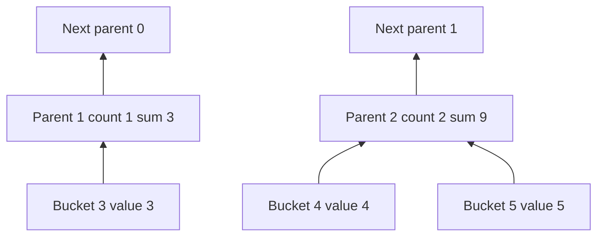

# Mergeable Summaries: The Mathematics of Correct Aggregation Under Missing Data

A summary is useful only if it retains the information needed by later queries. The mean of a group is enough to display that group's mean, but it is not enough to combine the group correctly with another group of unknown size. A hierarchy that repeatedly averages child averages can therefore become less meaningful at every level even though each arithmetic operation succeeds.

This chapter derives summaries that can be combined repeatedly without changing their intended statistical meaning. We will separate exact algebra from floating-point behavior, distinguish missing observations from valid zeros, and make temporal coverage a separate quantity rather than an inference from sample count. The executable result is a small summary library with stable variance and canonical hierarchy construction.

Series: [[PROJ - Engineering Temporal Systems - Textbook Series]]. Companion [summaries.py](_assets/temporal-systems/summaries.py), [tests](_assets/temporal-systems/tests/test_summaries.py), [experiment output](_assets/temporal-systems/outputs/summaries-demo.json) and [test log](_assets/temporal-systems/outputs/summaries-tests.log) are new educational artifacts. The product's actual count/sum/extrema pyramid is described in [[ARTICLE - Video Observatory - Preserving Meaning While Aggregating Millions of Observations]]. It does not contain the stable variance accumulator developed here.

## 1. Define the quantity before defining the reducer

The *estimand* is the quantity a statistical calculation is intended to estimate. A sample mean, a time mean and a mean of interval means can all be legitimate estimands, but they need not have the same value.

Suppose one group contains nine observations of ten, while another contains one observation of one hundred. Their means are ten and one hundred. Averaging those means gives 55. The mean over all ten observations is instead

$$
\mu=\frac{9\cdot10+1\cdot100}{9+1}=19.
$$

The value 55 is not an arithmetic error. It is the result of assigning equal weight to the two groups rather than equal weight to each observation. If the intended question was “what is the mean measurement over collected observations?”, the reducer answered the wrong question.

More generally, if group $i$ has count $n_i$ and mean $\mu_i$,

$$
\mu=\frac{\sum_i n_i\mu_i}{\sum_i n_i}.
$$

Counts and sums are query-sufficient state for this mean: together they determine the answer without retaining every observation. This use of “sufficient” concerns a specified query. It should not be confused with a formal claim that the summary is a sufficient statistic for an unspecified probability distribution or inference problem.

### 1.1 A time mean needs temporal weights

Suppose a signal is known to equal zero for nine seconds and ten for one second. Its duration-weighted mean is one. If the dataset instead contains just two point observations, zero and ten, their sample mean is five. Assigning nine seconds of weight to the zero observation requires a justified model of the interval, such as verified piecewise-constant behavior. The time between two samples does not by itself establish that the earlier sample remained valid throughout it.

For nonnegative duration weights $w_i$ and values $x_i$,

$$
\mu_w=\frac{\sum_i w_i x_i}{\sum_i w_i}.
$$

The units of the numerator are value-times-duration and the denominator is duration. For sample weighting, the weights count observations instead. Equal numerical weights with different meanings can lead to different interpretations even when the formula looks identical.

The companion `weighted_mean` checks finite values and nonnegative weights, returns unknown when total weight is zero, and executes both examples. It does not derive durations from point timestamps. Nor does it implement a universal weighted sample-variance correction: frequency weights, duration weights and reliability weights have different statistical interpretations.

### 1.2 Missingness can bias a perfectly computed mean

If a sensor stops reporting during high-load periods, the mean of its collected observations can underrepresent high load. Correctly merging counts and sums cannot recover the missing values. The algebra establishes consistency with the supplied data, not that the supplied data are representative of the process.

State the population being summarized: collected valid observations, admitted recording intervals, known continuous signal coverage, or another precisely defined set. If the choice excludes unavailable periods, say so. Treating absence as zero changes both the quantity and its value.

## 2. Define an explicit empty summary

Our summary contains count $n$, sum $s$, mean $\mu$, centered squared-deviation sum $M_2$, minimum, maximum and first/last observation metadata. An observation has an actual UTC timestamp, a unique identity and a value. Empty summaries have count zero, no extrema and no first/last observation.

The implementation stores zero in the empty mean and sum fields as an internal neutral representation. Count determines whether a mean is defined. This is different from a singleton whose observed value is zero: it has count one, minimum zero, maximum zero and actual temporal metadata.

```python
@dataclass(frozen=True)
class Summary:
    n: int = 0
    total: float = 0.0
    mean: float = 0.0
    m2: float = 0.0
    minimum: float | None = None
    maximum: float | None = None
    first: Observation | None = None
    last: Observation | None = None
```

The empty summary $E$ is an identity: $E\oplus A=A\oplus E=A$. Empty children do not introduce zero extrema or invented timestamps. This matters for a positive-only dataset: an empty child must not lower its parent's minimum to zero.

For nonempty disjoint groups A and B, counts and sums merge by addition, extrema by minimum/maximum, and temporal endpoints by the ordering of actual observations. The implementation orders by UTC and unique identity; if two different observations share a timestamp, the identity gives deterministic first/last selection. It does not choose the last value according to network arrival order.

### 2.1 State the disjointness precondition

A merge operation normally represents multiset union. Merging a summary with itself doubles its count; it is not idempotent. If a transport retry delivers the same observations again, deduplicate them before reduction or preserve enough identity state to detect that duplication. Counts, extrema and a pair of endpoint identities cannot detect arbitrary overlap between two large groups.

Under exact arithmetic and disjoint source partitions, the merge is associative because each field is defined as a function of the same combined observations. Numeric statistics are commutative. Temporal metadata is also merge-order independent here because a total ordering is explicitly defined; a different “last arrival wins” policy would not have that property.

These laws describe valid summaries produced by the library. The dataclass is not a hostile-input parser. Constructing a record with a negative count or contradictory extrema violates the precondition and is outside the model's API contract. A wire decoder needs separate admission and consistency validation.

## 3. Derive the stable variance merge

Define

$$
M_2=\sum_{i=1}^n(x_i-\mu)^2.
$$

For a finite population of $n>0$ values, its population variance is $M_2/n$. The usual sample-variance estimator uses $M_2/(n-1)$ for $n>1$; its inferential interpretation requires sampling assumptions. For a singleton, population variance is zero and sample variance is undefined. For an empty summary both are undefined.

Let A and B have counts $n_A,n_B$, means $\mu_A,\mu_B$ and centered sums $M_{2,A},M_{2,B}$. Put $n=n_A+n_B$ and $\delta=\mu_B-\mu_A$. The combined mean is

$$
\mu=\mu_A+\delta\frac{n_B}{n}.
$$

To derive the squared-deviation update, expand each A deviation around its own mean:

$$
\sum_{i\in A}(x_i-\mu)^2
=\sum_{i\in A}\bigl((x_i-\mu_A)+(\mu_A-\mu)\bigr)^2.
$$

The cross term vanishes because deviations from $\mu_A$ sum to zero. Thus A contributes $M_{2,A}+n_A(\mu_A-\mu)^2$, and B contributes the corresponding expression. Substituting

$$
\mu_A-\mu=-\delta\frac{n_B}{n},
\qquad
\mu_B-\mu=\delta\frac{n_A}{n}
$$

and collecting the two mean-shift terms gives

$$
\boxed{M_2=M_{2,A}+M_{2,B}+\delta^2\frac{n_A n_B}{n}}.
$$

The companion uses this one operation for both direct reduction and hierarchy construction:

```python
n = a.n + b.n
delta = b.mean - a.mean
mean = a.mean + delta * (b.n / n)
m2 = fsum((a.m2, b.m2, delta * delta * (a.n / n) * b.n))
```

The `fsum` call improves the addition of the three already computed terms. It does not undo error already introduced into child means or products. The library keeps `total` for sum queries and `mean` for the centered accumulator; in floating-point arithmetic they need not remain bitwise identical to `total/n` after every reduction tree.

Chan, Golub and LeVeque's *Algorithms for computing the sample variance: analysis and recommendations*, Technical Report #222, develops updating and pairwise algorithms. The [Yale-hosted scanned report](https://engineering.yale.edu/download_file/view/d929f792-2810-4841-9469-e6e85fc02b5e/431) was visually read on its printed pages 1–2, including equations 1.3–1.6. Its pairwise formula is expressed using sums; the derivation above expresses the same combination in terms of means.

### 3.1 Why an algebraically equivalent formula can fail numerically

Expanding the definition also gives

$$
M_2=\sum_i x_i^2-\frac{(\sum_i x_i)^2}{n}.
$$

If each value is near a large common offset and the spread is small, the two terms can be enormous and nearly equal. Their floating-point rounding errors can be much larger than the small difference being sought. Subtracting them cannot recover digits that were not retained.

The executed example uses eight binary64 values $10^{12}+i/8$ for $i=0,\ldots,7$. These increments are exactly representable at this magnitude. An 80-digit Decimal reference is constructed from the exact binary floating-point inputs, not from an assumed decimal measurement model.

| Calculation | Computed $M_2$ |
|---|---:|
| Decimal centered reference | 0.65625000 |
| Balanced pairwise merge | 0.65625 |
| Sequential singleton merges | 0.65625 |
| Merge partitions of sizes three and five | 0.65625 |
| Naive difference of large squared sums | 0.0 |

The population variance is $0.65625/8=0.08203125$. The naive algorithm has discarded all of it. The exact agreement of the three centered reductions is a property of this selected dataset, not a promise of exact results for arbitrary inputs.

The centered formula can still overflow for sufficiently large differences or counts. The educational merge rejects non-finite results; it is not an arbitrary-precision accumulator. `fsum` likewise does not guarantee meaningful answers when the underlying products overflow. Numerical range belongs in the input contract.

## 4. A small set of moments does not determine a distribution

Consider these two sorted datasets:

```text
A = [0, 0, 3, 3, 4, 8]
B = [0, 1, 1, 4, 4, 8]
```

Both have count six, sum eighteen, sum of squares 98, minimum zero and maximum eight. Consequently both have mean three and

$$
M_2=98-\frac{18^2}{6}=44.
$$

Assign timestamps and identities zero through five in order; both also have the same first and last observations. Yet A's median is three and B's median is 2.5. The companion verifies these equalities and the differing medians.

Therefore the complete summary developed so far cannot answer an exact median query in general. This is an information limitation, not a missing arithmetic trick. Exact quantiles require additional order/distribution information, such as retained values or exact frequency counts over a restricted value domain. If the domain has only a known small number of possible values, a histogram can be compact and exact; arbitrary real-valued observations do not share that bound.

Approximate quantile sketches trade state size for a specified approximation contract. Their rank or value error guarantees depend on the algorithm and assumptions. Count/sum/variance is not such a sketch, and this chapter does not infer a quantile error bound from those moments.

## 5. Preserve missingness and temporal meaning

A missing observation contributes no sample value to the sample summary. It is represented by an empty leaf, not by a leaf whose value is zero. In a wire format, an invalid bucket's numeric storage may still be zero for canonical encoding. Validity metadata determines whether that zero is an observation.

Actual sample time also differs from nominal bucket time. A bucket summarizes observations in $[a,b)$; the first observation may occur well after $a$ and the last well before $b$. Those endpoints describe the collected observations. They do not prove continuous coverage from the first to the last, or from $a$ to $b$.

The inspected product's synthetic numeric data are point samples, and `observedCoverageUs=0` does not mean that every bucket is empty. It means that no continuous observed duration has been inferred from the point observations. Scenario overlap, analytics availability and historical recording coverage are different facts and must not be substituted for each other.

### 5.1 Coverage is a separate partition

For a domain of duration $D$, classify disjoint portions as available, known missing or unknown. Then

$$
D=D_{available}+D_{missing}+D_{unknown}.
$$

Unknown means evidence has not established either availability or known absence. The companion `coverage` accepts disjoint labeled intervals, rejects overlap and treats uncovered portions as unknown. It does not infer availability from the sample summary.

For a ten-second domain with `[0,4)` known available and `[4,6)` known missing, the result is four seconds available, two missing and four unknown. All three quantities are integer durations, so conservation is exact. If independently supplied intervals overlap, simply adding their lengths would double-count time; the example rejects such input rather than pretending that conservation still holds.

### 5.2 Align parents globally, not relative to the requested slice

Suppose the base grid has indices 3, 4 and 5. At the next level, each index belongs to parent $\lfloor j/2\rfloor$. Index 3 belongs to parent 1, while indices 4 and 5 belong to parent 2. Pairing the first two entries in the local array would instead combine 3 and 4, constructing a noncanonical interval.



The executable hierarchy uses dictionary keys as global indices and calls the same tested `merge` for each parent. The output above is reproduced in `aligned_levels`. Missing siblings are absent input to that reduction; they do not become zero observations and do not establish that the sibling's time interval was known missing. A summary built from a slice must not be advertised as a complete canonical resource unless coverage/completeness is separately established.

Negative indices require mathematical floor too: index −1 remains in parent −1. The implementation bounds depth at sixteen and input bucket count at 4,096. For $K$ sparse input buckets and $d$ levels, the conservative work and retained-level bound is $O(dK)$, because sparse nodes need not pair at each level. Dense contiguous reductions shrink approximately geometrically until few nodes remain, but that optimization is not a valid bound for arbitrary sparse or indefinitely retained unary levels.

## 6. Test the algebra and its numerical realization separately

Mathematical associativity does not imply bitwise floating-point associativity. In binary64 arithmetic, grouping the sum `1e16 + (-1e16) + 1` from the left yields one, while grouping the last two terms first yields zero. A pairwise hierarchy changes the reduction order, so a direct sequential calculation is not automatically a bitwise reference.

Use exact assertions for count, validity, extrema and selected observation identities. Use a separately calculated numerical reference and a stated tolerance for floating mean and $M_2$. Do not choose a tolerance so large that it would accept the mean-of-means error or the vanished variance above.

The shared suite now contains thirteen tests. Summary-specific checks include:

- Empty identity, valid zero, singleton population/sample variance and deterministic timestamp ties are asserted directly.
- Three hundred seeded datasets, with twenty-percent dropout probability, are reduced directly, in randomized partitions with balanced reduction, and in shuffled sequential partition order. Counts, extrema and temporal endpoints must agree exactly.
- For values restricted to `[-100,100]` and fewer than one hundred input opportunities, sums, means and $M_2$ are compared with `math.fsum` references using absolute tolerances of $10^{-9}$, $10^{-11}$ and $10^{-8}$ respectively. These tolerances are specific to those bounded tests, not a universal error theorem.
- The large-offset experiment is checked against its Decimal reference across three reduction shapes. The regression tolerance is $10^{-3}$ in $M_2$ units, under 0.2 percent of the nonzero reference; the retained observed error is zero. The test separately asserts that the naive method does not equal the reference, so the tolerance cannot hide its total loss.
- A mixed-scale sequence with values near $10^6$ and $10^{-6}$ is reduced in both directions and compared at relative $M_2$ tolerance $10^{-12}$. Grid-edge alignment, negative indices and coverage conservation have separate tests.

Run from the companion directory:

```sh
PYTHONDONTWRITEBYTECODE=1 python3 -m unittest discover -s tests -v
python3 summaries.py
```

The library's balanced reducer materializes its input summaries, then repeatedly merges adjacent pairs. It therefore uses $O(n)$ memory in this educational implementation. An incremental binary-level accumulator can reduce retained intermediate state to $O(\log n)$, but that is not what this implementation does. The hierarchy retains requested levels for inspection and has its own $O(dK)$ bound. Numerical mergeability does not by itself imply bounded total storage.

## 7. What a correct summary guarantees

A correct merge can guarantee consistency with the admitted observations, a declared weighting scheme and a declared temporal ordering. It can preserve enough information for later means and variances without replaying raw values. It cannot recover missing observations, prove representative sampling, infer continuous coverage or answer every distribution query.

- Define the estimand and weights before selecting summary fields.
- Treat emptiness as a state, not as a numeric zero.
- Use one merge operation throughout the hierarchy, with disjointness and canonical alignment as explicit preconditions.
- Distinguish exact algebra from finite-precision results and test both.
- Preserve coverage evidence separately from point-observation statistics.

These contracts supply the algebra needed by multiresolution visualization. The next systems question is how to keep such summaries correct when their requests finish out of order, when cache ownership changes and when obsolete work continues after cancellation.

### Evidence and references

Product source pin: `ee51ca7b3091d96f9428199412038c1285099085`. `web-ui/lab/pyramid.ts` stores count, sum, extrema and first/last sample indices and aligns parent indices using floor division. `lab/tiles.ts` and `src/data/tiles.ts` carry and validate the corresponding semantics. The educational `M2` accumulator, explicit tie identities, coverage helper and quantile counterexample are additions for teaching, not previously implemented product features.

Primary numerical reference: Chan, Golub and LeVeque, *Algorithms for computing the sample variance: analysis and recommendations*, Technical Report #222, printed pages 1–2 (PDF pages 3–4), visually inspected September 10, 2026. Those pages discuss cancellation in the squared-sum formula and develop updating/pairwise equations. The report's later error analysis was not read and is not claimed as a verified bound for this Python implementation. The initially attempted Goldberg extraction failed, so no unread Goldberg passage is used as supporting evidence.
